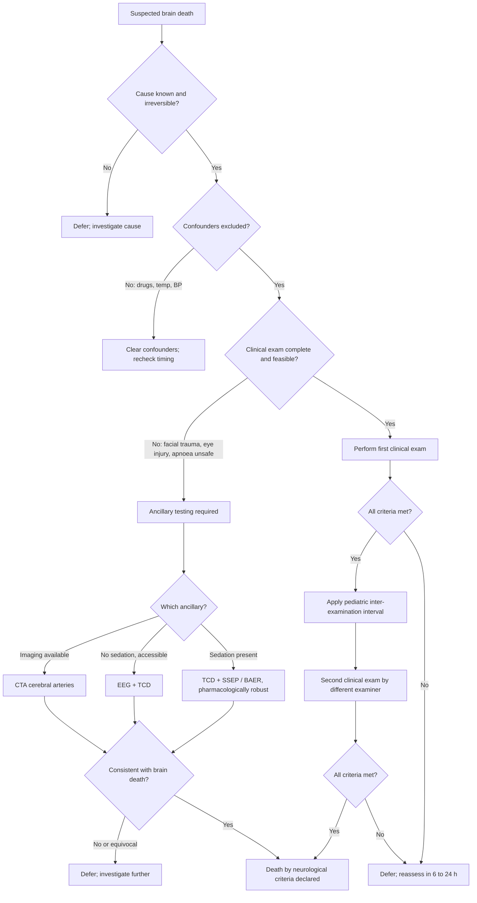

<Callout type="reference">
**Acronyms used on this page**

- **DNC**: death by neurological criteria (formal term for brain death)
- **TBI**: traumatic brain injury
- **TCD / TCCD**: transcranial Doppler / transcranial color-coded duplex
- **MFV**: mean flow velocity
- **EEG / cEEG**: electroencephalogram / continuous EEG
- **aEEG**: amplitude-integrated EEG
- **SSEP**: somatosensory evoked potential
- **BAER / ABR**: brainstem auditory evoked response
- **N20**: the cortical SSEP response component (median nerve)
- **CTA**: CT angiography
- **CPP / ICP / MAP**: cerebral perfusion / intracranial / mean arterial pressure
- **NPi**: neurological pupil index
- **EVD**: external ventricular drain
- **DC**: decompressive craniectomy
- **AAN**: American Academy of Neurology
- **WBDP**: World Brain Death Project
- **DCD**: donation after circulatory death
- **DBD**: donation after brain death
</Callout>

<TldrCard>
**The 60-second version.** Brain death is a **clinical diagnosis**: irreversible cause known, confounders excluded, coma, absent brainstem reflexes, absent motor response, positive apnoea test. **MNM does not replace the clinical exam**, it **choreographs the timing** (when sedation has cleared sufficiently) and **confirms when the exam is incomplete** (severe facial trauma, hypothermia, residual sedation, neonatal context). The four main ancillary modalities: **TCD** (cerebral circulatory arrest pattern: reverberating flow or systolic spikes only), **EEG** (electrocerebral silence, < 2 microvolts), **CTA** (no opacification of basal arteries), **SSEP / BAER** (absent N20, absent BAER waves III-V). **TCD and evoked potentials are pharmacologically robust**, uniquely useful when CNS depressants are still on board. Pediatric guidelines (Nakagawa 2011) require age-stratified observation intervals and apnoea-test parameters. The MNM contribution is **safe timing plus high-confidence confirmation**, not the diagnosis itself.
</TldrCard>

## 1. Three patient vignettes

### Vignette A. Canonical adolescent severe TBI day 5

**Aliyah, 13 years old.** Severe TBI from a high-energy motor-vehicle collision. GCS 3 since admission. Day 2 placed on pentobarbital coma for refractory raised ICP; weaned starting yesterday. Currently: pentobarbital level 18 mg/L (target for exam < 5), paralysis cleared, no eye opening, no motor response to deep noxious stimulation. ICP probe reads 8 to 10 mmHg (CPP exceeds ICP comfortably). Two senior physicians independently agree the clinical picture is consistent with brain death, but the pentobarbital washout is incomplete. The family wants to understand what is happening. The team chooses the MNM-supported approach: choreograph the timing with TCD, cEEG, and SSEPs; defer formal exam until pentobarbital clears; communicate clearly along the way. <Cite id="nakagawa2011peds_bd" /> <Cite id="greer2020_braindeath" /> <Cite id="rasulo2008" />

### Vignette B. Infant after severe HIE post-arrest

**Noor, 4 months old, post-cardiac arrest from severe RSV bronchiolitis.** Cooled to 33 degrees for 72 hours, rewarmed. Day 6, GCS 3, no brainstem reflexes, no motor response. Sedation: morphine 10 mcg/kg/h (light), no benzodiazepines or barbiturates. Pediatric brain-death criteria require **two independent exams separated by 24 hours** for infants in this age band (Nakagawa 2011); the team plans accordingly. cEEG over 6 hours is isoelectric (no reactivity to noxious stimulation, voltage < 2 microvolts). TCD through the anterior fontanelle: **oscillating flow pattern bilaterally in MCAs, no detectable flow in basilar**, repeated 30 minutes later with the same finding. Pupillometry NPi 0 / 0. The infant-specific challenge: small heads, thin temporal windows easy but vessel identification harder; anterior fontanelle window (still open) is unusually useful; ancillary testing requirements vary by jurisdiction for infants under 1 year. <Cite id="nakagawa2011peds_bd" /> <Cite id="rasulo2008" />

### Vignette C. Atypical: clinical exam met, ancillary discordant

**Ali, 16 years old.** Severe TBI day 4 after a fall. Clinical exam meets brain-death criteria: coma, absent brainstem reflexes, no motor response, no spontaneous breaths. Apnoea test: PaCO2 rose from 40 to 72 mmHg, no respiratory effort. **But** the SSEP shows a **bilaterally present, low-amplitude N20** (cortical response preserved). The team is now in a discordant state: clinical exam met, but an ancillary test suggests preserved cortical electrical activity. The action: defer DNC declaration, repeat SSEP in 12 hours, exclude technical issue (electrode placement, recording quality), and reassess with neurology. **This is the situation where ancillary testing protects the patient**: a positive ancillary test in the face of a positive clinical exam is rare but real, and the clinical exam alone may not be the whole story. Most likely cause: technical SSEP artefact; second most likely: incomplete clinical exam (perhaps a missed flexor response interpreted as absent); least likely but most important: preserved cortical activity despite a brainstem-dead presentation. The lesson: **MNM can be more conservative than clinical exam alone, and that conservatism is its value**. <Cite id="logi2003" /> <Cite id="wijdicks2006" />

---

## 2. The clinical question

In a child with a clinical picture consistent with brain death, **when does MNM choreograph the timing, when does it confirm an incomplete exam, and when does it override or modify the determination?** The integration question is which ancillary modalities to use, when, in what sequence, and how to communicate the results to families.

---

## 3. Pathophysiology refresher

Brain death is the **irreversible cessation of all brain function, including the brainstem**. The mechanism is intracranial hypertension exceeding mean arterial pressure to the point of cerebral circulatory arrest, with subsequent neuronal death. Once cerebral circulatory arrest develops and persists, brain death is irreversible. The clinical features (coma, absent brainstem reflexes, apnoea) reflect this irreversibility. <Cite id="greer2020_braindeath" /> <Cite id="nakagawa2011peds_bd" /> <Cite id="wijdicks2005" />

**The clinical determination** (the AAN-equivalent / WBDP approach):

1. **Cause known and irreversible**: imaging confirms a catastrophic injury (massive TBI, large infarct, ICH, severe HIE).
2. **Confounders excluded**: no hypotension (MAP within age-appropriate range), no hypothermia (core temperature > 36 degrees), no severe metabolic abnormality, no paralytic drugs in effect, no CNS depressants in clinically significant concentrations.
3. **Coma**: no response to noxious stimulation above the foramen magnum.
4. **Absent brainstem reflexes**: no pupillary, corneal, oculocephalic, oculovestibular, cough, gag, or motor responses.
5. **Apnoea test**: PaCO2 rises by ≥ 20 mmHg above baseline, to ≥ 60 mmHg, with no respiratory effort.

The pediatric Nakagawa 2011 guideline requires **two examinations by different examiners, separated by an inter-examination interval** (12 hours for term newborns through age 30 days, 12 hours for infants > 30 days and children, 6 hours for adolescents in some interpretations; centre and jurisdiction variation is the norm). The apnoea test has age-specific parameters. <Cite id="nakagawa2011peds_bd" />

**Why ancillary testing is sometimes mandated:**

- **Apnoea test cannot be performed safely** (haemodynamic instability, severe acidosis, high oxygen requirement).
- **Brainstem reflexes cannot be assessed reliably** (severe facial trauma, prior eye surgery, ear injury, drug effects).
- **Residual CNS depressants** in clinically significant concentrations.
- **Cervical spinal injury** (can confound the motor exam).
- **Jurisdictional requirement** (some require ancillary testing for all DNC in children).

**What each ancillary test shows in brain death:**

- **TCD**: **cerebral circulatory arrest pattern**. Three recognised forms: (1) **reverberating / oscillating flow** (small forward systolic spike, equally large reverse diastolic flow, net flow zero); (2) **systolic spikes only** (forward systolic peaks with no diastolic flow at all); (3) **complete absence of flow** in previously documented arteries (supportive but not sufficient alone). Specificity ~99%, sensitivity ~90%. Importantly **not influenced by barbiturates or sedatives**. <Cite id="rasulo2008" /> <Cite id="greer2020_braindeath" />

- **EEG**: **electrocerebral silence**, voltage < 2 microvolts at maximal gain, no reactivity to noxious stimulation, recording duration ≥ 30 minutes. Confounded by deep sedation, hypothermia, severe hypotension; not sufficient alone in patients on barbiturates.

- **SSEP**: bilaterally **absent N20** (cortical) responses with preserved Erb's-point (peripheral) responses confirms central pathway loss. Pharmacologically robust. <Cite id="logi2003" />

- **BAER**: **absent waves III through V** with preserved wave I (cochlear) confirms loss of brainstem function above the cochlear nerve. Pharmacologically robust.

- **CTA**: **absent opacification of intracranial arteries above the petrous carotid** in 4-point or 7-point scoring systems. Sensitivity ~85%, specificity > 95%. Requires transport and contrast.

- **Cerebral perfusion scintigraphy (HMPAO or DTPA)**: absent intracranial uptake. Highly specific but logistically demanding.

**Pediatric-specific physiology**: infants have open fontanelles and sutures that allow some compensation for raised ICP; this **does not change the determination of brain death** once cerebral circulatory arrest is established. TCD windows are excellent through the anterior fontanelle and thin temporal bone, sometimes easier than in adults. Apnoea testing in small children carries higher haemodynamic risk; preoxygenation and slow titration are essential.

---

## 4. The multimodal picture table

| Modality | Pattern in brain death | Confounders | Pharmacologically robust |
|---|---|---|---|
| **Clinical exam (coma, reflexes, apnoea)** | All absent | Sedation, hypothermia, paralysis, metabolic | No |
| **TCD** | Reverberating / oscillating flow; systolic spikes only | Need previously detectable flow; operator skill | **Yes** |
| **EEG / cEEG** | < 2 microvolts, non-reactive | Barbiturates, severe sedation, hypothermia | No |
| **aEEG** | Isoelectric trace | Same as EEG | No |
| **SSEP (median nerve N20)** | Bilaterally absent, with preserved Erb's point | Cervical injury, technical | **Yes** |
| **BAER** | Wave I present, waves III-V absent | Conductive hearing loss; technical | **Yes** |
| **CTA** | No basal artery opacification | Logistics, contrast contraindication | **Yes** (anatomical) |
| **Nuclear perfusion scan** | No intracranial uptake | Logistics, availability | **Yes** (anatomical) |
| **Pupillometry NPi** | 0 / 0 | Pre-existing eye disease, drugs | Limited (atropine, opioids) |
| **NIRS** | Bilateral rSO2 ~ 30% or undetectable | Sensor coupling, scalp signal contamination | Limited |
| **ICP / CPP** | ICP often exceeds MAP (CPP < 0) | Probe accuracy at very low CPP | Not for determination |

The most useful pairings: **TCD + SSEP** (both pharmacologically robust, both modality-independent), **EEG + TCD** (cortical electrical silence + cerebral circulatory arrest), and **clinical exam + any one ancillary** (confirmatory).

---

## 5. Decision tree

<Figure
  src="/images/integration/brain-death-mnm/ancillary-tree.svg"
  alt="Decision tree showing ancillary test selection in pediatric brain death evaluation, with branches for sedation-confounded, exam-incomplete, and jurisdiction-required pathways"
  caption="Ancillary test selection in pediatric brain-death evaluation. The clinical determination is primary; ancillary tests support timing (when sedation has cleared), confirm an incomplete or impossible exam, or satisfy jurisdictional requirements. TCD and SSEP / BAER are pharmacologically robust and uniquely useful when CNS depressants are on board. EEG is the most-used ancillary in clean exam contexts but is depressed by barbiturates. CTA is anatomical; positive for absence of opacification of basal arteries. The tree branches by clinical context, not by preference."
  attribution="MNM-Edu, original schematic. SVG placeholder."
  label="Fig. 1"
/>

---

## 6. Step-by-step bedside actions

1. **Confirm the cause is known and irreversible.** Imaging (CT or MRI) must show a catastrophic injury consistent with the clinical picture. Reversible processes (drug overdose, hypothyroidism, severe hypothermia) must be excluded.
2. **Exclude confounders** before any exam: temperature > 36 degrees, MAP within age-appropriate range, no paralytic effect (twitches > 90% on train-of-four), no significant CNS depressants on board (check serum levels of barbiturates if used), no severe metabolic derangement.
3. **Time the exam carefully.** Pentobarbital half-life is 15 to 50 hours; an 18 mg/L level requires 48 to 72 hours to clear to < 5 mg/L. Plan the exam window in advance; do not start until levels are confirmed clear.
4. **Brief the bedside team** 30 minutes before the exam: nurse, respiratory therapist, family liaison, second examining attending. Block 90 minutes; treat it as a scheduled procedure.
5. **Perform the first clinical exam systematically**:
   - Coma: no response to deep noxious stimulation in all cranial nerve distributions.
   - Pupils: fixed and dilated.
   - Corneal: absent bilaterally.
   - Oculocephalic / oculovestibular: absent.
   - Gag / cough: absent.
   - Motor: no response above foramen magnum.
6. **Apnoea test**: preoxygenate 100% FiO2 for 10 minutes; baseline ABG; disconnect from ventilator (or place on CPAP); observe for respiratory effort for 8 to 10 minutes; repeat ABG; target PaCO2 ≥ 60 mmHg and ≥ 20 mmHg above baseline. Abort if SpO2 < 85% or haemodynamic instability.
7. **If ancillary testing is required** (failed apnoea test, sedation, facial trauma, jurisdiction): choose pharmacologically robust modality (TCD or SSEP) if sedation is on board; choose EEG or CTA if clean clinical context.
8. **Document each ancillary result with reproducibility**: TCD repeated 30 minutes apart, in both anterior and posterior circulations; SSEP repeated within 60 minutes; CTA with 4- or 7-point scoring.
9. **Apply the pediatric inter-examination interval** (12 to 24 hours depending on age and centre); second exam by different examiner; same systematic approach.
10. **Communicate with the family** throughout: explain the rationale, the timeline, the role of ancillary tests; provide written summary at the end of the determination.

---

## 7. Management ladder and endpoints

| Tier | Intervention | Endpoint |
|---|---|---|
| 0 | Pre-exam preparation: confounders, drug levels, temperature, MAP | All confounders cleared |
| 1 | First clinical exam by trained examiner | All criteria met |
| 2 | Apnoea test if safe | PaCO2 target met without respiratory effort |
| 3 | Ancillary testing if exam incomplete or sedation present | Consistent with brain death |
| 4 | Second examiner with required inter-examination interval | All criteria reproduced |
| 5 | Declaration; document with timestamp and family communication | Death by neurological criteria recorded |
| 6 | Organ donation conversation (if appropriate); end-of-care plan | Transition to DBD or DCD pathway, or to compassionate extubation |

**Success** looks like: a clear, defensible determination supported by the clinical exam and (where required) ancillary tests; transparent family communication; smooth transition to next steps.

**Failure** looks like: a determination later questioned (technical errors, missed confounders, equivocal ancillary), or a delayed determination causing prolonged family distress without diagnostic benefit.

<AlgorithmDisclaimer />

---

## 8. Variant subsections

### 8.1 Pediatric (Nakagawa 2011) vs adult (Greer 2020 WBDP)

Pediatric guidelines (Nakagawa 2011, updated 2024 framework discussions) differ from adult in:
- **Age-stratified inter-examination intervals**: longer in younger infants (often 24 h for term newborn through 30 days, 12 h for older infants and children).
- **Two examiners required** in all pediatric cases (adult AAN allows single examiner in some jurisdictions).
- **Apnoea test parameters** are age-specific.
- **Ancillary testing recommended but not always required** in clean pediatric cases > 30 days, depending on jurisdiction.

The adult WBDP (Greer 2020) is the most comprehensive synthesis; pediatric centres typically follow Nakagawa 2011 with local adaptations. <Cite id="greer2020_braindeath" /> <Cite id="nakagawa2011peds_bd" />

### 8.2 Ancillary testing requirements

Required when:
- Apnoea test cannot be performed safely
- Brainstem reflexes cannot be reliably assessed
- CNS depressants present in clinically significant levels
- Cervical spinal cord injury confounds motor exam
- Jurisdictional requirement (some require ancillary in all DNC of children < 1 year)

Choose pharmacologically robust modality (TCD, SSEP / BAER, CTA, perfusion scan) when sedation is present. EEG remains useful when sedation cleared.

### 8.3 Jurisdictional differences

The legal definition of death by neurological criteria varies between jurisdictions. In the United States, the Uniform Determination of Death Act underlies state-level statutes; in the United Kingdom, the Academy of Medical Royal Colleges code applies; Australia, Canada, India, and other regions have their own statutory frameworks. Some jurisdictions require ancillary testing universally; others only when the clinical exam is incomplete. The bedside team must know the local statute and follow it precisely.

### 8.4 Complete vs incomplete clinical exam

A **complete** pediatric brain-death exam includes: coma, all brainstem reflexes (pupillary, corneal, oculocephalic, oculovestibular, cough, gag, no motor response above foramen magnum), and a positive apnoea test. **Incomplete** if any element cannot be assessed (severe facial trauma, prior eye surgery, ear pathology, apnoea test contraindicated by severe hypoxaemia or haemodynamic instability). Incomplete exam mandates ancillary testing.

### 8.5 Pentobarbital and brain-death determination

Pentobarbital is uniquely problematic: long half-life (15 to 50 hours in critically ill), profound CNS depression, EEG suppression to isoelectric at therapeutic doses. The exam should not be performed until pentobarbital is < 5 mg/L (some centres use < 3). The clearance trajectory must be tracked with serial levels. **TCD and SSEP / BAER are pharmacologically robust** and remain interpretable during incomplete pentobarbital washout. <Cite id="logi2003" />

### 8.6 Cerebral perfusion scan and CTA: anatomical confirmation

CTA and nuclear perfusion scans confirm **absence of intracranial blood flow** in established brain death. CTA uses 4-point or 7-point scoring of intracranial artery opacification; complete absence above the petrous carotid is positive. Nuclear perfusion (HMPAO or DTPA) shows absent intracranial uptake (the "hollow-skull sign"). Both are anatomical confirmations, pharmacologically robust, and useful when sedation cannot be cleared. <Cite id="kondziella2017" />

---

## 9. Multimodal integration matrix

| Pair | What you gain |
|---|---|
| **Clinical exam + TCD** | The most common pediatric ancillary pairing; TCD confirms circulatory arrest |
| **TCD + SSEP** | Two pharmacologically robust ancillaries; ideal when sedation incomplete |
| **EEG + clinical exam** | Cortical electrical silence + clinical brainstem death; classical adult bundle |
| **TCD + BAER** | Circulatory arrest + brainstem electrophysiology; very high confidence |
| **CTA + clinical exam** | Anatomical confirmation + clinical determination; useful in logistically simple centres |
| **Pupillometry + clinical exam** | NPi 0 / 0 supports but does not confirm; not standalone |
| **NIRS + clinical exam** | NIRS ~ 30% bilaterally is supportive but not specific |
| **All ancillaries + family communication** | The combined multimodal picture supports the determination and the conversation |

---

## 10. Worked alternative scenarios

### 10.1 What if sedation cannot be cleared in time?

A 7-year-old severe TBI day 10. Pentobarbital level still 8 mg/L despite 5 days off the drug (severe hepatic dysfunction from shock). The family is in distress; the bedside team feels the patient is brain dead. The action: **defer the clinical exam** until pentobarbital is < 5 mg/L; in the meantime perform **TCD (cerebral circulatory arrest) + SSEP (bilaterally absent N20) + BAER (waves III-V absent)** as supportive evidence to share with the family, document the trajectory, and re-attempt the clinical exam when drug clearance is sufficient. The MNM provides honest evidence during the waiting period.

### 10.2 What if TCD shows persistent flow despite clinical brain death?

A 12-year-old severe TBI day 7. Clinical exam meets all criteria including a successful apnoea test. TCD shows **persistent low-amplitude forward systolic flow with very low EDV** (not the canonical reverberating pattern), bilaterally. **This is not yet the cerebral circulatory arrest pattern**; the brain still has some macroscopic flow even if functionally dead. The action: **the clinical determination remains primary**. TCD is supportive when consistent; when the pattern is not yet arrest, it is not a reason to defer the clinical declaration. The clinical exam is the diagnosis. Document the TCD finding; declare brain death based on the clinical criteria. <Cite id="rasulo2008" />

### 10.3 What if the patient is a candidate for organ donation?

After DNC is declared, the family is approached about organ donation by the local procurement organisation (firewalled from the determining team). If they consent, the patient transitions to **DBD pathway** with continued physiological support pending retrieval. If DNC is not declared (e.g., the family chooses withdrawal of life-sustaining therapy before formal DNC), the patient may be eligible for **DCD** pathway with a different protocol. See the [WLST organ donation integration](/integration/wlst-organ-donation/) for the full pathway. <Cite id="greer2020_braindeath" /> <Cite id="meert2015_palliative_care" />

---

## 11. Outcome data

- **Rasulo 2008**: TCD specificity for brain death ~99% in adult populations when the canonical cerebral circulatory arrest pattern is documented in both anterior and posterior circulations; sensitivity ~90%. <Cite id="rasulo2008" />
- **Greer 2020 WBDP**: comprehensive global synthesis of brain-death determination; lists TCD, EEG, CTA, perfusion scan, SSEP / BAER as accepted ancillary modalities; jurisdiction-specific requirements detailed. <Cite id="greer2020_braindeath" />
- **Nakagawa 2011 pediatric brain-death guidelines**: the canonical pediatric guideline; age-stratified intervals, apnoea-test parameters, ancillary testing recommendations. <Cite id="nakagawa2011peds_bd" />
- **Wijdicks 2005, 2006**: foundational papers on adult brain-death determination and ancillary EEG / SSEP. <Cite id="wijdicks2005" /> <Cite id="wijdicks2006" />
- **Logi 2003**: SSEP and BAER in brain death; pharmacologically robust; useful in incomplete sedation washout. <Cite id="logi2003" />
- **Kondziella 2017**: CT-angiography in brain-death determination; sensitivity ~85%, specificity > 95% in adult cohorts. <Cite id="kondziella2017" />

---

## 12. Pitfalls

- **Performing the exam before confounders cleared.** Hypothermia, hypotension, sedation, paralysis all invalidate; clear them first.
- **Skipping serial drug levels.** A "low" pentobarbital is not a confirmed safe level without measurement; check before each exam.
- **Misidentifying TCD pattern.** A low-amplitude forward flow is not cerebral circulatory arrest; the canonical patterns are reverberating, systolic-spikes-only, or complete absence in previously documented vessels.
- **Single TCD recording.** Repeat in 30 minutes in both circulations; transient signals can occur.
- **EEG over-interpretation in sedation.** A flat EEG on barbiturates is not specific; use TCD / SSEP in this context.
- **Treating ancillary as standalone diagnosis.** Ancillary tests support; they do not replace the clinical exam.
- **Inadequate inter-examination interval.** The pediatric interval is the safeguard; do not shorten it.
- **Family communication failure.** Lack of transparent updates causes distress; involve family liaison and palliative care early.
- **Apnoea test aborted prematurely.** SpO2 < 85% or haemodynamic instability are valid abort criteria; document and use ancillary testing instead.

---

## 13. Pediatric considerations

<Pediatric>
**Six pediatric-specific points.**

1. **Two examiners required**, both with appropriate training in pediatric brain death determination.

2. **Age-stratified inter-examination intervals** (Nakagawa 2011):
   - Term newborn through 30 days: 24 hours
   - 31 days through 18 years: 12 hours (some centres use shorter for adolescents)
   - Always follow local jurisdictional protocol

3. **Apnoea test parameters** are age-specific. Pre-oxygenation, CPAP or oxygen insufflation during the test, target PaCO2 ≥ 60 with rise ≥ 20 from baseline. Abort for SpO2 < 85% or haemodynamic instability.

4. **Ancillary testing in infants** under 1 year is often required by jurisdiction; the team should know local requirements.

5. **TCD windows are excellent in infants**: anterior fontanelle (still open in many), thin temporal bone. The bedside operator can usually obtain reliable signals; vessel identification needs experience.

6. **Family conversation**: pediatric brain-death determination is emotionally devastating. Involve pediatric palliative care early; allow extended bedside time; clearly explain the role of ancillary testing without implying uncertainty about the diagnosis. <Cite id="meert2015_palliative_care" />
</Pediatric>

---

## 14. Combine with

- [TCD / TCCD modality page](/modalities/tcd/): the cerebral circulatory arrest patterns in detail.
- [Continuous EEG](/modalities/eeg/): ancillary EEG criteria.
- [Pupillometry](/modalities/pupillometry/): NPi 0 / 0 as a supportive sign.
- [WLST and organ donation integration](/integration/wlst-organ-donation/): the next step after DNC or as the alternative path.
- [Family communication MNM](/integration/family-communication-mnm/): the conversation framework around brain death.
- [HIE in the newborn integration](/integration/mnm-in-the-newborn/): related severe brain injury context.
- [Discordance triage](/integration/discordance-triage/): when ancillary tests disagree.

---

<DeepDive>

## 15. Evidence summary and recent literature (2022 to 2025)

### Foundational

| Topic | Reference | Grade |
|---|---|---|
| World Brain Death Project (WBDP) | <Cite id="greer2020_braindeath" /> | expert |
| Pediatric brain-death guidelines | <Cite id="nakagawa2011peds_bd" /> | expert |
| TCD in brain death | <Cite id="rasulo2008" /> | A |
| EEG / SSEP foundational | <Cite id="wijdicks2005" /> <Cite id="wijdicks2006" /> | expert |
| SSEP / BAER detail | <Cite id="logi2003" /> | B |
| CTA in brain death | <Cite id="kondziella2017" /> | B |

### Recent literature (2022 to 2025)

- **Helbok 2024 pediatric MMM update**: includes brain-death determination in pediatric MMM bundles; emphasises TCD and SSEP / BAER for sedation-confounded cases. <Cite id="helbok2024_pediatric_mmm" />
- **Figaji 2025 pediatric MMM consensus**: places ancillary testing in tier 2; encourages family-centred protocolised approaches. <Cite id="figaji2025_mmm_pediatric_consensus" />
- **Tasker 2023 PCCM review**: brain-death determination as part of pediatric MMM; advocates structured timing. <Cite id="tasker2023_pccm_review" />
- **Greer 2020 WBDP (still the operative global synthesis)**: the comprehensive multidisciplinary review of brain-death determination across jurisdictions; cite as the modern reference. <Cite id="greer2020_braindeath" />
- **Meert 2015**: pediatric palliative care framework; integral to the brain-death conversation. <Cite id="meert2015_palliative_care" />

</DeepDive>

---

## 16. Self-check

<Quiz
  questions={[
    {
      id: 'q1',
      prompt: 'A 13-year-old severe TBI day 5. Clinically deeply comatose, no brainstem reflexes, no motor response. Pentobarbital level 18 mg/L (target < 5 for exam). Temperature 36.4, MAP normal, no paralysis. What is the most appropriate next step?',
      options: [
        { id: 'a', label: 'Proceed with clinical brain-death exam immediately' },
        { id: 'b', label: 'Defer clinical exam until pentobarbital < 5 mg/L; use TCD and SSEP / BAER in the interim as supportive evidence and for family communication' },
        { id: 'c', label: 'Withdraw life-sustaining therapy before formal determination' },
        { id: 'd', label: 'Declare brain death based on EEG alone' },
      ],
      answer: 'b',
      explanation: 'Pentobarbital at 18 mg/L invalidates the clinical exam (CNS depressant in significant concentration). Defer until cleared. TCD and SSEP / BAER are pharmacologically robust and can provide supportive evidence and family-facing information during the waiting period. EEG alone is not sufficient (depressed by barbiturates). Withdrawal of life-sustaining therapy without a determination is a separate ethical decision.',
    },
    {
      id: 'q2',
      prompt: 'A 4-month-old post-cardiac arrest, cooled to 33 degrees and rewarmed, day 6. GCS 3, no brainstem reflexes. TCD through the anterior fontanelle shows oscillating bilateral MCA flow with no basilar flow. cEEG isoelectric. The bedside team wants to declare brain death. What is the required interval before the second clinical exam in this infant?',
      options: [
        { id: 'a', label: '6 hours' },
        { id: 'b', label: '12 hours' },
        { id: 'c', label: '24 hours' },
        { id: 'd', label: 'No second exam required if ancillary tests are positive' },
      ],
      answer: 'c',
      explanation: 'Nakagawa 2011 pediatric brain-death guidelines require 24 hours between examinations for term newborns through 30 days; for infants 31 days and older, 12 hours is the typical interval, though local jurisdictions vary. A 4-month-old is in the 12-hour or 24-hour band depending on centre; the safer (longer) interval is appropriate when the case is complex. Ancillary tests do not eliminate the requirement for two independent clinical examinations.',
    },
    {
      id: 'q3',
      prompt: 'A 16-year-old severe TBI day 4. Clinical exam meets all brain-death criteria including a successful apnoea test (PaCO2 40 to 72, no respiratory effort). SSEP shows bilaterally present low-amplitude N20 responses, repeated 12 hours later with same finding. What is the most defensible next step?',
      options: [
        { id: 'a', label: 'Declare brain death; the clinical exam is the diagnosis' },
        { id: 'b', label: 'Defer declaration; repeat the SSEP with attention to technique, exclude artefact, reassess the clinical exam, and discuss with neurology before any declaration' },
        { id: 'c', label: 'Repeat the apnoea test only' },
        { id: 'd', label: 'Add CTA and proceed if CTA is positive' },
      ],
      answer: 'b',
      explanation: 'A discordant ancillary (preserved N20) in the face of a positive clinical exam is rare but real. Most likely cause is technical artefact (electrode placement, recording quality); second most likely is an incomplete or misinterpreted clinical exam. The safest action is to defer, exclude artefact, reassess, and consult neurology. Declaring brain death over a discordant ancillary risks a determination that later proves wrong; this is exactly the situation where MNM provides protective conservatism.',
    },
  ]}
/>
