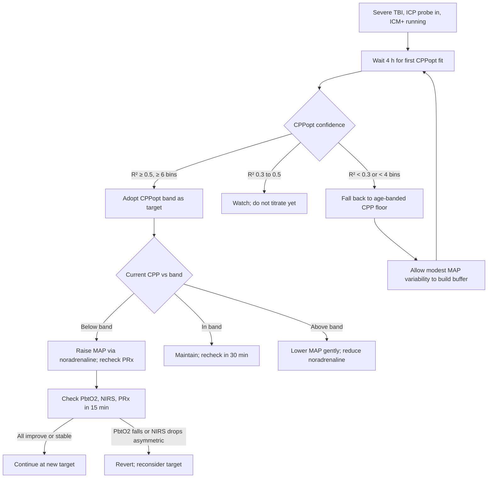

<Callout type="reference">
**Acronyms used on this page**

- **TBI**: traumatic brain injury (severe = GCS 3 to 8)
- **CPP**: cerebral perfusion pressure = MAP minus ICP (mmHg)
- **MAP**: mean arterial pressure
- **ICP**: intracranial pressure
- **CPPopt**: continuously-computed optimal CPP, the vertex of the (CPP, PRx) U-curve
- **MAPopt**: when ICP is absent, the equivalent MAP target band
- **PRx**: pressure reactivity index, moving-window Pearson correlation between MAP and ICP
- **PbtO2**: brain tissue oxygen partial pressure (mmHg)
- **NIRS**: near-infrared spectroscopy regional tissue oxygenation
- **rSO2**: regional oxygen saturation, the NIRS readout
- **Mx**: mean-flow autoregulation index, TCD-MFV vs CPP correlation
- **ORx**: tissue-oxygen reactivity index, PbtO2 vs CPP correlation
- **ICM+**: Cambridge multimodal monitoring software (the reference CPPopt platform)
- **COGiTATE**: 2024 feasibility trial of CPPopt-targeting in severe adult TBI
- **PBTF**: Pediatric Brain Trauma Foundation (guideline-producing body)
- **DC**: decompressive craniectomy
</Callout>

<TldrCard>
**The 60-second version.** In severe TBI, the brain has a **patient-specific perfusion sweet spot** at which autoregulation works best. CPPopt is the vertex of a continuously-fit U-curve relating CPP to PRx over the prior 4 hours. The COGiTATE protocol targets CPP within ±5 mmHg of CPPopt, using vasopressors and ICP control to move the patient into the band. **CPPopt is data-derived**: a flat CPP destroys the data and erases the curve. Allow modest CPP variation. **Confidence matters**: don't titrate to a low-R² fit. **The age-banded CPP floor** is the safety net when CPPopt is unavailable. In pediatrics, CPPopt is feasible (Tas 2022, 2024) but the evidence base is thinner than adult. Pair CPPopt with PbtO2 and NIRS for cross-validation; convergent improvement is the bedside argument that the manoeuvre was right.
</TldrCard>

## 1. Three patient vignettes

### Vignette A. Canonical school-age severe TBI

**Liam, 12 years old, 40 kg.** Severe TBI from a high-speed bicycle vs car. GCS 6 at scene, intubated, paralysed, frontal triple-bolt with ICP probe + PbtO2 + brain temperature placed on arrival. Bilateral frontal NIRS pads. Continuous arterial line. RASS −5, deep sedation. Day 2. Current state: **ICP 18 mmHg (acceptable), MAP 75, CPP 57, PbtO2 18, PRx hovering at +0.18**. ICM+ on the bedside computer has been collecting (CPP, PRx) pairs since hour 0; at hour 4 it reports a parabolic fit with R² 0.68 and **CPPopt 71 mmHg, target band 66 to 76**. The team must decide: lift CPP into the band by raising MAP with noradrenaline, or stay on the fixed CPP > 50 protocol the unit has used for a decade? <Cite id="aries2012cppopt" /> <Cite id="beqiri2024_cogitate" />

### Vignette B. Toddler with severe TBI

**Riya, 3 years old, 14 kg.** Severe TBI from a fall down a stairwell. GCS 5 at scene, frontal ICP bolt placed, no PbtO2 (the unit does not stock pediatric-sized PbtO2 probes). Day 1. ICP 22, MAP 70, CPP 48, PRx +0.30. The age-banded CPP floor for a 3-year-old is 50 mmHg; she is below it. The ICM+ buffer has only 90 minutes of data; CPPopt is not yet computable. The team starts a noradrenaline infusion at 0.05 mcg/kg/min to lift MAP, then begins second-line ICP measures (3% saline 3 mL/kg, head-of-bed 30 degrees, normothermia). By hour 4 they have a low-confidence CPPopt of 58 mmHg (R² 0.42, only 3 bins). They stay on the age-floor strategy until confidence builds: target CPP > 55 mmHg empirically. The toddler-specific point: CPPopt in young children may be lower than adult numbers; do not transpose adult thresholds. <Cite id="kochanek2019_pbtf4" /> <Cite id="tas2022peds" /> <Cite id="tas2024_pediatric_cppopt" />

### Vignette C. Atypical: CPPopt looks beautiful but PbtO2 says no

**Hana, 15 years old.** Severe TBI day 3, triple-bolt in. ICM+ reports CPPopt 75, band 70 to 80, current CPP 76, PRx +0.05. Looks perfect. But **PbtO2 is 14 mmHg** (low; target > 20). NIRS rSO2 is 60 / 61 (low end of normal). Haemoglobin 8.2 g/dL. **PbtO2 in the ischaemic range despite a confident CPPopt** is the canonical reason for the discordance triage: tissue oxygen depends on CPP plus haemoglobin plus arterial PO2 plus tissue diffusion plus metabolic demand. CPPopt is a perfusion-pressure target; it does not guarantee tissue oxygenation. Action: transfuse to Hb > 9, raise FiO2, deepen sedation to lower CMRO2, and only then raise CPP if PbtO2 stays low. The lesson: **CPPopt narrows the perfusion target; PbtO2 verifies the tissue actually benefits**. <Cite id="okonkwo2017_boost2" /> <Cite id="bernard2025_boost3" />

---

## 2. The clinical question

In a child with severe TBI, **what is the right CPP target right now, for this brain, this hour?** The classical answer was a fixed age-banded threshold (CPP > 40 for infants, > 50 for older children). The CPPopt answer is a continuously-recomputed band centred on the autoregulation U-curve vertex. The integration question: when do you abandon the fixed threshold and follow the band?

---

## 3. Pathophysiology refresher

The autoregulation U-curve is the bedside operationalisation of the **Lassen plateau**. In a healthy brain, cerebral blood flow is constant across a wide range of CPP (roughly 60 to 150 mmHg in adults; narrower and lower in children). Below the lower limit (LLA), CBF falls passively with CPP (pressure-passive, ischaemic); above the upper limit (ULA), CBF rises passively (pressure-passive, hyperaemic with oedema risk). PRx, the moving-window correlation between MAP and ICP, is the most-used bedside index of autoregulation: negative or near-zero PRx indicates intact reactivity; positive PRx indicates pressure-passivity. <Cite id="lassen1959" /> <Cite id="czosnyka1997prx" /> <Cite id="aries2012" />

**Why a U-curve?** When CPP is below LLA, PRx is positive (vessels are maximally dilated and cannot dilate further). When CPP is above ULA, PRx is again positive (vessels are maximally constricted). In between, PRx is minimised at the perfusion pressure where autoregulatory reserve is greatest. Plot PRx against binned CPP over a 4-hour window and you typically see a U or J shape; the vertex is **CPPopt**. <Cite id="aries2012cppopt" /> <Cite id="aries2012" /> <Cite id="depreitere2014icpdose" />

**Why 4 hours?** Shorter windows give noisy fits (insufficient bin density); longer windows smear over physiological changes (CPPopt drifts with metabolic state, sedation depth, temperature). The 4-hour rolling window is the empirical compromise. <Cite id="aries2012" /> <Cite id="beqiri2024_cogitate" />

**Confidence matters.** The CPPopt algorithm computes a fit quality (R² of the parabola). With < 4 populated CPP bins or R² < 0.3, the fit is unreliable and the algorithm reports "no CPPopt available." This usually happens early in monitoring, after a sedation change, or when CPP has been held flat (no variability means no curve). The bedside response to "no CPPopt" is to fall back to the age-banded floor. <Cite id="beqiri2024_cogitate" /> <Cite id="depreitere2014icpdose" />

**COGiTATE (Beqiri 2024)** randomised 60 severe-adult-TBI patients to CPPopt-targeted care vs standard CPP > 60. The protocol was feasible (89% of CPPopt-time within the band), safe (no excess vasopressor harm), and showed signals of mortality reduction (not powered for outcome). It is the most important recent CPPopt paper and the closest the field has to a controlled trial of the approach. <Cite id="beqiri2024_cogitate" /> <Cite id="beqiri2024cogitate" /> <Cite id="beqiri2024" />

**Pediatric evidence.** Tas 2022 in pediatric severe TBI showed CPPopt is computable and that the **percent time CPP was within ±5 mmHg of CPPopt** correlated with 6-month outcome (the longer in the band, the better the outcome). Tas 2024 extended this with the COGiTATE-Pediatric feasibility framework. The pediatric evidence base is observational; no RCT exists yet. <Cite id="tas2022peds" /> <Cite id="tas2024_pediatric_cppopt" /> <Cite id="tas2025_cogitate_followup" />

**The CPP dose hypothesis.** Guiza 2015 (in adults) showed that the **time-and-magnitude product of CPP outside the autoregulation band** predicted outcome more strongly than mean CPP. The pediatric analogue (Guiza 2017) extended this to children. The implication: a brief CPP excursion outside the band is forgiven; sustained excursions are not. <Cite id="guiza2015dose" /> <Cite id="guiza2015b_dose" /> <Cite id="depreitere2014icpdose" />

---

## 4. The multimodal picture table

| Modality | What it shows | What it adds beyond CPPopt alone |
|---|---|---|
| **CPP** | The current operating point | The lever; the variable being titrated |
| **PRx** | Autoregulation status at current CPP | Confirms which side of the U you are on |
| **CPPopt** | Vertex of the U-curve over the prior 4 h | The patient-specific perfusion target |
| **CPPopt confidence (R², bin count)** | Reliability of the fit | Tells you whether to titrate or fall back |
| **ICP** | Intracranial state | Sets the absolute floor below which you do not titrate up |
| **PbtO2** | Tissue oxygen partial pressure (mmHg) | Direct tissue verification; bypasses haemodynamic theory |
| **ORx** | Tissue-oxygen reactivity (PbtO2 vs CPP) | A second autoregulation surrogate that can corroborate PRx |
| **NIRS rSO2 bilateral** | Regional cortical oxygenation | Asymmetric drop flags regional pathology under one optode |
| **Brain temperature** | Metabolic baseline | Fever raises CMRO2; CPPopt may shift |
| **Mx (if TCD on)** | Macrovascular autoregulation surrogate | Useful when PRx noisy or ICP absent |

The most useful pairings: **CPPopt + PbtO2** (the gold-standard pair: pressure target + tissue verification), **CPPopt + PRx + NIRS** (the non-invasive trio when PbtO2 unavailable), and **CPPopt + ORx** (two autoregulation indices for cross-check).

---

## 5. Decision tree

<Figure
  src="/images/integration/cppopt-targeting/dose-response.svg"
  alt="A U-curve plot of PRx on vertical axis vs CPP on horizontal axis with the vertex labelled CPPopt and a shaded ±5 mmHg band, with arrow showing CPP drifting into the band over a 4-hour window"
  caption="Schematic CPPopt U-curve. PRx (vertical, signed −0.4 to +0.6) plotted against CPP bins (horizontal, 40 to 110 mmHg) over a rolling 4-hour window. The vertex of the parabola is CPPopt; the shaded ±5 mmHg band is the actionable target. Insets: low-confidence early fit (R² 0.3, 4 bins) and high-confidence mature fit (R² 0.78, 8 bins). The dose-response inset shows time below band predicts worse outcome (Guiza dose curve), and time within band predicts better outcome (Tas 2022 pediatric cohort)."
  attribution="MNM-Edu, original schematic. SVG placeholder."
  label="Fig. 1"
/>

---

## 6. Step-by-step bedside actions

1. **Verify the multimodal hub is recording synchronously.** ICM+ (or local equivalent) must receive ICP, MAP, and ideally PbtO2 at 50 to 100 Hz with timestamps aligned.
2. **Allow the first 4-hour buffer to fill.** Do not chase a CPP target during the buffer-fill; stay on the age-banded floor and let natural Mayer-wave variability populate the (CPP, PRx) cloud.
3. **At hour 4 check confidence**: R² and bin count. If R² ≥ 0.5 and bin count ≥ 6, adopt the band as the target.
4. **Move CPP into the band gently.** A 10 mmHg upward move over 30 minutes (titrate noradrenaline) is safer than a single bolus. Watch ICP for paradoxical rise (vasodilatory cascade if autoregulation is broken).
5. **Recheck PbtO2 and NIRS at 15 minutes.** Convergent improvement = the move was right. Divergent (PbtO2 falls, NIRS drops asymmetric) = stop, reconsider.
6. **Allow modest CPP variation through the day.** A flat CPP erases the curve. Mayer-wave variability of ±5 to 10 mmHg around the target is desirable; do not aggressively damp it.
7. **Re-evaluate confidence every 30 to 60 minutes.** Drug changes, sedation holds, fever, and seizures all shift the curve. A sudden loss of confidence is a signal to investigate, not to ignore.
8. **When CPPopt drifts**, treat the new band as the new target with 30-minute averaging. Do not chase minute-by-minute changes (this is noise, not signal).
9. **Document CPPopt at every nursing handover** with the band, current CPP, current PRx, and current PbtO2. The bedside team must understand the target.
10. **Plan for sedation holds**: pre-empt the loss of CPPopt during the daily neurological exam; revert to the age-banded floor for the duration; document and reconverge afterwards.

**Drug doses commonly used in CPP titration:**
- **Noradrenaline**: 0.02 to 0.5 mcg/kg/min in children; titrate in 0.02 to 0.05 mcg/kg/min increments
- **Vasopressin**: 0.0001 to 0.002 units/kg/min as a second pressor when noradrenaline alone is insufficient
- **Phenylephrine**: 0.1 to 2 mcg/kg/min bolus or infusion (less commonly used in pediatrics)
- **Fluid bolus**: 5 to 10 mL/kg crystalloid; useful for absolute hypovolaemia, not as a chronic CPP-raiser

---

## 7. Management ladder and endpoints

| Tier | Intervention | Endpoint to escalate |
|---|---|---|
| 0 | Establish multimodal monitoring, fill the buffer | First confident CPPopt fit |
| 1 | Adopt CPPopt band; titrate noradrenaline to band | PbtO2 still < 20 despite in-band CPP |
| 2 | Add second pressor (vasopressin) for refractory hypotension | Pressor escalation > 0.3 mcg/kg/min noradrenaline + vasopressin |
| 3 | If ICP rising (vasodilatory cascade), revert to lower CPP target | Sustained ICP > 22 mmHg despite tier 2 measures |
| 4 | Tier-2 ICP measures (3% saline, mannitol, mild hyperventilation) | Refractory ICP > 25 mmHg for > 30 min |
| 5 | Decompressive craniectomy (per local guideline) | Salvage; ongoing refractory ICP |

**Success looks like**: CPP > 80% of the time within the CPPopt band, PRx near zero, PbtO2 > 20, NIRS symmetric, ICP < 22, no new infarct on imaging, GCS recovery if survivable injury.

**Failure looks like**: refractory low PbtO2 despite optimal CPP (microvascular dysfunction), ICP rising paradoxically as CPP raised (lost autoregulation), or sustained CPP outside the band > 20% of the time (Guiza dose curve predicts worse outcome).

<AlgorithmDisclaimer />

---

## 8. Variant subsections

### 8.1 Severe TBI (the validated home)

The original CPPopt setting. Aries 2012 (adult) showed retrospective association between % time within band and 6-month outcome. Depreitere 2014 extended this. COGiTATE 2024 is the first prospective controlled feasibility study. All this evidence is adult severe TBI; pediatric inference is by analogy plus the Tas series. <Cite id="aries2012cppopt" /> <Cite id="depreitere2014icpdose" /> <Cite id="beqiri2024_cogitate" />

### 8.2 SAH (emerging)

In aneurysmal SAH, CPPopt computation is feasible but the U-curve is often distorted by vasospasm (vessels are constricted regardless of pressure). PRx may be flat through vasospasm even when DCI is developing (see [TCD vs ICP vasospasm](/integration/tcd-vs-icp-vasospasm/)). Use CPPopt cautiously in the vasospasm window; pair with TCD and qEEG. <Cite id="rivera-lara2017autoreg" />

### 8.3 Pediatric severe TBI

The PBTF 4th-edition guidelines (Kochanek 2019) endorse CPP-guided care with age-banded floors (50 mmHg for older children, 40 for infants and toddlers). CPPopt is mentioned as an emerging adjunct, not standard. Tas 2022 and 2024 are the pediatric feasibility papers. Tasker 2023 PCCM review puts CPPopt in tier 2 of the pediatric MMM hierarchy. <Cite id="kochanek2019_pbtf4" /> <Cite id="tas2022peds" /> <Cite id="tas2024_pediatric_cppopt" /> <Cite id="tasker2023_pccm_review" />

### 8.4 When CPPopt is unobtainable

Common reasons CPPopt fails to compute: a flat CPP (no variability), too few CPP bins populated, R² < 0.3 (poor parabolic fit), a phase change in physiology (post-craniectomy, post-sedation change), or a software glitch. The fallback is always the age-banded floor: 50 mmHg for children > 5 years, 40 mmHg for younger. Document the fallback in the chart. <Cite id="kochanek2019_pbtf4" />

### 8.5 After decompressive craniectomy

After DC, ICP often falls dramatically (effective volume increase). PRx behaviour changes (the cranium is now open, so the MAP-ICP correlation no longer reflects autoregulation in the same way). CPPopt may become uncomputable or may shift abruptly to a new band. The bedside team should re-establish baseline CPPopt over the first 4 to 6 hours post-DC and watch for the brain-bulge complication (sustained tissue herniation through the craniectomy defect). <Cite id="hutchinson2016" /> <Cite id="cooper2011" />

### 8.6 Discordance: CPPopt and PbtO2 disagree

Hana's vignette (C). CPPopt says one thing; PbtO2 says another. The differential: low haemoglobin (transfuse), low arterial PO2 (raise FiO2), high CMRO2 (deepen sedation, treat fever), microvascular dysfunction (no fix; supportive). The discordance is informative, not a defect; it forces you to broaden the diagnostic frame beyond perfusion pressure alone. See [PRx vs ORx discordance](/integration/prx-vs-orx-discordance/) for a deeper treatment.

---

## 9. Multimodal integration matrix

| Pair | What you gain |
|---|---|
| **CPPopt + ICP** | The basic infrastructure: ICP provides the floor; CPPopt provides the target |
| **CPPopt + PRx** | The U-curve itself: PRx is the dependent variable in the parabola |
| **CPPopt + PbtO2** | Pressure target + tissue verification. Convergent change = right move; divergent = reconsider. <Cite id="okonkwo2017_boost2" /> |
| **CPPopt + ORx** | Two autoregulation indices: one MAP-ICP based (PRx), one PbtO2-CPP based (ORx). Discordance is itself diagnostic. <Cite id="brady2010orx" /> |
| **CPPopt + NIRS** | Regional cortical oxygenation as a check on the global perfusion target. <Cite id="davies2017nirs" /> <Cite id="andresen2014nirs" /> |
| **CPPopt + Mx (TCD)** | Mx is the non-invasive analogue of PRx; useful for cross-validation or when no ICP probe |
| **CPPopt + brain temp** | Fever shifts CPPopt upward (raised CMRO2); cooling shifts it downward |
| **CPPopt + arterial line waveform shape** | Mayer-wave variability is required for CPPopt to compute; damped waveforms (kinked line) prevent computation |

---

## 10. Worked alternative scenarios

### 10.1 What if the patient is hyperaemic, not ischaemic?

Liam at day 5: ICP 12, MAP 95, CPP 83, PRx +0.10. CPPopt 65, band 60 to 70. **Current CPP is above the band.** PbtO2 is 35 (high). NIRS rSO2 78%. This is hyperaemia; the response is to **lower MAP gently** (wean noradrenaline) into the band. Hyperaemic CPP carries oedema risk and is not benign just because the brain looks oxygenated. The CPPopt framework catches this where a fixed floor (CPP > 50) would have missed it.

### 10.2 What if CPPopt drifts upward through the day?

CPPopt at hour 4: 70. Hour 12: 75. Hour 20: 82. The upward drift over 16 hours signals **a shift in the brain's autoregulation envelope**, often reflecting evolving cerebral oedema, rising metabolic demand from fever, or weaning of sedation. The action: investigate (temperature, sedation, fluid balance, ICP trend), and follow the band. Do not anchor on the initial CPPopt; the value is **the current 4-hour vertex**, not the day-1 number. <Cite id="aries2012" />

### 10.3 What if you cannot compute CPPopt at all?

A bedside unit without ICM+, or a patient on V-V ECMO with damped arterial waveforms. The fallback is the age-banded CPP floor (PBTF guideline) plus the principle: vary MAP modestly through the day to learn the patient's response, watch ICP for paradoxical rises (lost autoregulation marker), use NIRS and (if available) PbtO2 as bedside surrogates. The Liam protocol degrades gracefully to a "fixed floor plus surveillance" strategy when the CPPopt machine is off. <Cite id="kochanek2019_pbtf4" />

---

## 11. Outcome data

- **Aries 2012**: in 327 adult severe TBI patients, increased deviation of mean CPP from CPPopt was associated with worse 6-month outcome (mortality and unfavourable Glasgow Outcome Scale). <Cite id="aries2012cppopt" /> <Cite id="aries2012" />
- **Depreitere 2014**: the "ICP dose" concept extended to CPP: time-and-magnitude product outside the autoregulation band predicts outcome. <Cite id="depreitere2014icpdose" />
- **Guiza 2015 / 2017**: dose-response curves for ICP and CPP across hundreds of patients confirm thresholds and time exposure as outcome predictors. <Cite id="guiza2015dose" /> <Cite id="guiza2015b_dose" />
- **COGiTATE (Beqiri 2024)**: 60 adult severe TBI patients randomised to CPPopt vs CPP > 60. Feasibility met (89% of CPPopt time in band), safety established, signal of mortality benefit (not powered for outcome). <Cite id="beqiri2024_cogitate" /> <Cite id="beqiri2024cogitate" />
- **Donnelly 2017**: MAPopt as the non-invasive analogue of CPPopt; feasible in patients without ICP. <Cite id="donnelly2017mapopt" />
- **Tas 2022**: pediatric severe TBI; % time CPP within ±5 mmHg of CPPopt correlated with 6-month outcome. <Cite id="tas2022peds" />
- **Tas 2024 / 2025**: pediatric COGiTATE feasibility and follow-up; CPPopt-targeted care is computable and feasible in selected children. <Cite id="tas2024_pediatric_cppopt" /> <Cite id="tas2025_cogitate_followup" />

---

## 12. Pitfalls

- **Acting on low-confidence fits.** R² < 0.5 or < 4 populated bins = do not titrate; wait for confidence or fall back to floor.
- **Flat CPP destroys the data.** Aggressive single-target therapy that holds CPP constant prevents the algorithm from finding the curve. Allow modest variability.
- **Chasing noise.** Minute-by-minute CPPopt changes are within the noise floor; use 30-minute averaging or 1-hour smoothing for titration decisions.
- **Transposing adult thresholds.** Pediatric CPPopt is often lower than adult values; do not anchor to "CPP > 70" because that is the adult ICU norm.
- **Forgetting PbtO2 verification.** A confident CPPopt with low PbtO2 (Vignette C) means the perfusion target is not sufficient. Transfuse, oxygenate, deepen sedation before raising CPP further.
- **Ignoring the dose curve.** Brief excursions outside the band are tolerated; sustained excursions (> 20% of time) predict worse outcome. Document time-in-band as a quality metric.
- **Aggressive pressor escalation.** Noradrenaline > 0.5 mcg/kg/min carries cardiac and splanchnic risk; consider whether the patient is salvageable rather than escalating indefinitely.
- **Loss of CPPopt during exams.** Sedation holds, intubation changes, and seizures all break the curve. Pre-empt and document the fall-back to age-floor; do not oscillate the pressor during the gap.

---

## 13. Pediatric considerations

<Pediatric>
**Five pediatric-specific points.**

1. **Age-banded CPP floors** (PBTF 4th edition): 40 mmHg for infants and toddlers, 50 mmHg for school-age, 60 mmHg for adolescents. These are minimum acceptable; CPPopt may set the target higher. <Cite id="kochanek2019_pbtf4" />

2. **Autoregulation in children is narrower and lower.** The Lassen plateau in a healthy 5-year-old is approximately MAP 50 to 100 mmHg, vs adult 60 to 150. CPPopt vertices are often in the 50 to 70 range in school-age severe TBI vs 70 to 90 in adults. Anchor expectations to age, not to adult numbers. <Cite id="brady2009" /> <Cite id="brady2007" />

3. **PbtO2 probes**. Pediatric-sized probes exist but are not universally stocked. If PbtO2 is unavailable, lean more heavily on bilateral NIRS for tissue verification.

4. **Pediatric COGiTATE evidence is observational.** Tas 2022 and 2024 are feasibility and association papers; no RCT. The pediatric trauma community is moving toward CPPopt-guided care but the evidence base is weaker than adult. <Cite id="tas2022peds" /> <Cite id="tas2024_pediatric_cppopt" />

5. **Drug doses are age-banded.** Noradrenaline 0.02 to 0.5 mcg/kg/min; titrate cautiously in young infants (immature myocardium, narrower margin of safety).
</Pediatric>

---

## 14. Combine with

- [PRx and autoregulation foundations](/foundations/autoregulation/): the mechanism behind the U-curve.
- [ICP monitoring](/modalities/icp/): the upstream requirement for PRx and CPPopt.
- [PbtO2](/modalities/pbto2/): the gold-standard tissue verifier.
- [NIRS](/modalities/nirs/): the non-invasive tissue surrogate.
- [TCD / Mx](/modalities/tcd/): non-invasive autoregulation cross-validation.
- [Osmotherapy ICP NIRS](/integration/osmotherapy-icp-nirs/): when CPPopt cannot be achieved with pressors alone.
- [PbtO2-CPP titration](/integration/pbto2-cpp-titration/): the convergent-discordant decision tree.
- [PRx vs ORx discordance](/integration/prx-vs-orx-discordance/): when two autoregulation indices disagree.
- [Discordance triage](/integration/discordance-triage/): the general framework for multimodal disagreement.

---

<DeepDive>

## 15. Evidence summary and recent literature (2022 to 2025)

### Foundational

| Topic | Reference | Grade |
|---|---|---|
| Lassen plateau | <Cite id="lassen1959" /> | foundational |
| PRx | <Cite id="czosnyka1997prx" /> | A |
| Mx | <Cite id="czosnyka1996mx" /> | B |
| CPPopt concept | <Cite id="aries2012cppopt" /> <Cite id="aries2012" /> | B |
| ICP and CPP dose | <Cite id="guiza2015dose" /> <Cite id="depreitere2014icpdose" /> | B |
| MAPopt | <Cite id="donnelly2017mapopt" /> | B |
| Pediatric PBTF guidelines | <Cite id="kochanek2019_pbtf4" /> <Cite id="kochanek2019pbtf" /> | expert |
| Pediatric autoregulation | <Cite id="brady2009" /> <Cite id="brady2007" /> | B |

### Recent literature (2022 to 2025)

- **Beqiri 2024 COGiTATE**: the prospective feasibility RCT in 60 adult severe TBI patients. Feasibility met, signal of mortality benefit; the trial that legitimises CPPopt-guided care for further study. <Cite id="beqiri2024_cogitate" /> <Cite id="beqiri2024cogitate" />
- **Tas 2022, 2024, 2025**: the pediatric CPPopt arc. Feasibility, association with outcome, and COGiTATE-Pediatric framework. <Cite id="tas2022peds" /> <Cite id="tas2024_pediatric_cppopt" /> <Cite id="tas2025_cogitate_followup" />
- **Helbok 2024 pediatric MMM update**: places CPPopt as a tier-2 metric in pediatric MMM bundles. <Cite id="helbok2024_pediatric_mmm" />
- **Figaji 2025 pediatric MMM consensus**: similar placement; recommends CPPopt-trained centres adopt it; emphasises the importance of PbtO2 verification. <Cite id="figaji2025_mmm_pediatric_consensus" />
- **Tasker 2023 PCCM review**: integrative pediatric MMM piece; CPPopt in the tier-2 framework. <Cite id="tasker2023_pccm_review" /> <Cite id="tasker2023mnm" />
- **Hawthorne 2014 ICP review**: still-relevant context on the ICP dose hypothesis and how it primes CPP-dose thinking. <Cite id="hawthorne2014icp" />
- **Chesnut 2012 best-practice**: the landmark BEST-TRIP trial of ICP-guided vs symptom-guided care (Bolivia / Ecuador); informs the wider question of how aggressively to titrate to MMM-derived targets. <Cite id="chesnut2012best" />

</DeepDive>

---

## 16. Self-check

<Quiz
  questions={[
    {
      id: 'q1',
      prompt: 'A 12-year-old severe TBI day 2, triple-bolt in. ICP 18, MAP 75, CPP 57, PRx +0.18, PbtO2 18. ICM+ reports CPPopt 71 mmHg with band 66 to 76, R² 0.68, 7 populated bins. What is the most defensible next action?',
      options: [
        { id: 'a', label: 'Stay on the CPP > 50 fixed-floor protocol; CPPopt has insufficient evidence in pediatrics' },
        { id: 'b', label: 'Raise MAP gently with noradrenaline to lift CPP into the 66 to 76 band, recheck PbtO2 and NIRS in 15 minutes' },
        { id: 'c', label: 'Lower MAP to take pressure off the brain' },
        { id: 'd', label: 'Bolus 5 mL/kg of normal saline and reassess' },
      ],
      answer: 'b',
      explanation: 'R² 0.68 and 7 bins is a confident fit. Current CPP (57) is below the band (66 to 76). The right action is to lift CPP into the band gently and verify with tissue surrogates (PbtO2, NIRS). Sticking to the fixed floor wastes the patient-specific information; lowering MAP makes things worse; a saline bolus is unlikely to lift CPP durably and risks fluid overload.',
    },
    {
      id: 'q2',
      prompt: 'A 15-year-old severe TBI day 3. CPPopt 75, band 70 to 80, current CPP 76, PRx +0.04. PbtO2 is 14 mmHg (low). Haemoglobin 8.2 g/dL, FiO2 0.4, SpO2 98%, brain temperature 37.8. What is the single best next step?',
      options: [
        { id: 'a', label: 'Raise CPP higher, target 85; PbtO2 is low so CPP must be insufficient' },
        { id: 'b', label: 'Accept the discrepancy; CPPopt is the target, PbtO2 is a confounder' },
        { id: 'c', label: 'Transfuse to Hb > 9, raise FiO2 to 0.6, deepen sedation, treat fever; then reassess PbtO2 before raising CPP' },
        { id: 'd', label: 'Stop monitoring PbtO2; the probe is faulty' },
      ],
      answer: 'c',
      explanation: 'Low PbtO2 despite a confident CPPopt within band means perfusion pressure is not the limiting variable. Tissue oxygen depends on CPP plus haemoglobin plus arterial PO2 plus tissue diffusion plus metabolic demand. Address the non-CPP variables first (transfuse, oxygenate, deepen sedation, treat fever) before reflexively raising CPP. Raising CPP into pressor-toxic territory without first correcting these is a common pitfall.',
    },
    {
      id: 'q3',
      prompt: 'During the morning sedation hold for a daily neurological exam, the CPPopt buffer fills with outlier points and the algorithm reports "no CPPopt available" for 20 minutes. Current CPP is 65, PRx briefly +0.35 during the hold, ICP transiently rose to 24 then settled. What is the right protocol response?',
      options: [
        { id: 'a', label: 'Oscillate the noradrenaline up and down trying to recompute CPPopt faster' },
        { id: 'b', label: 'Continue prior CPPopt target band while the new buffer rebuilds; fall back to age-banded CPP floor as a safety net' },
        { id: 'c', label: 'Stop CPPopt monitoring entirely; the algorithm is unreliable' },
        { id: 'd', label: 'Re-sedate immediately to recompute CPPopt regardless of the exam' },
      ],
      answer: 'b',
      explanation: 'Loss of CPPopt during predictable interventions (sedation holds, intubation, surgery) is expected. The protocol response is to fall back to the age-banded floor as a safety net while the 4-hour buffer trims the outliers and reconverges. Do not oscillate the pressor (this destabilises the brain and the algorithm); do not abandon CPPopt; do not skip the exam for the sake of the monitor.',
    },
  ]}
/>
