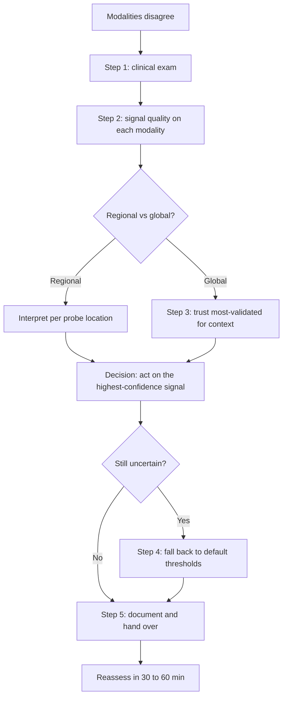

<Callout type="reference">
**Acronyms used on this page**

- **MNM / MMM**: multimodal neuromonitoring / multimodal monitoring
- **ICP / CPP / MAP**: intracranial pressure / cerebral perfusion pressure / mean arterial pressure
- **PRx / ORx / Mx / Px**: pressure / oxygen / mean-flow / PbtO2 reactivity indices
- **NIRS / rSO2**: near-infrared spectroscopy / regional cerebral oxygen saturation
- **TCD / MFV / PI**: transcranial Doppler / mean flow velocity / pulsatility index
- **PbtO2**: brain tissue oxygen tension
- **cEEG / aEEG**: continuous EEG / amplitude-integrated EEG
- **NPi**: neurological pupil index
- **GCS**: Glasgow Coma Scale
- **TBI / SAH / HIE**: traumatic brain injury / subarachnoid haemorrhage / hypoxic-ischaemic encephalopathy
- **PICU**: paediatric intensive care unit
- **MD**: cerebral microdialysis
- **AHA**: American Heart Association
- **ICU**: intensive care unit
</Callout>

<TldrCard>
**The 60-second version.** When multimodal monitors disagree at the bedside (ICP says one thing, NIRS another, TCD a third), the triage hierarchy is: (1) **clinical exam first**: GCS, pupils, focal signs, NPi; (2) **check signal quality** on every modality (transducer, probe contact, calibration, drift); (3) **trust the modality with the strongest validation base in the population at hand** (ICP and PRx in adult and paediatric TBI; ORx in paediatric ECMO; cEEG for cortical function); (4) **fall back to default CPP thresholds** when uncertainty is high; (5) **document the discordance** for the next shift. Most "discordances" are signal-quality problems or are real physiological signals telling you something about regional injury, microvascular shunting, or autoregulation. Pediatric-specific consensus formalises resource-stratified bundles and discordance interpretation. The widget `MultimodalDiscordance` lets the trainee work through canonical discordance scenarios.
</TldrCard>

## 1. Three patient vignettes

### Vignette A. Three discordances in one shift

Daniel, **11 years, 33 kg**, severe TBI day 4 with ICP probe, bilateral NIRS, TCD probe, cEEG, NPi every 2 h. Across one nursing shift: (i) **ICP 22 (rising), NIRS rSO2 unchanged at 65%** (discordance 1: ICP says raised pressure, NIRS says oxygen delivery preserved); (ii) **TCD MFV stable at 80, PI 1.3** (discordance 2: TCD does not corroborate the ICP rise); (iii) **NPi falling from 3.8 to 2.4 on the right side** (discordance 3: pupillometry shifts in one direction while other modalities are stable). Total time to interpret all three: 20 minutes. **Question: how does the bedside team structure the response when three discordances arrive at once?** <Cite id="leroux2014_neurocrit_consensus" /> <Cite id="figaji2025_mmm_pediatric_consensus" />

### Vignette B. The mismatched ECMO patient

Esmé, **4 years, 16 kg**, VA-ECMO post-cardiac arrest day 3. Non-pulsatile circulation. NIRS bilateral 65% (intact). TCD shows minimal flow signal on the right (poor window or genuine flow change). cEEG continuous on both sides. ICP not measured (ECMO). NPi 3.5 bilaterally. **Question: when one of the modalities cannot give a signal (TCD on the right), how do we triage the remaining modalities, and what does this teach about modality robustness?** <Cite id="larovere2017_ecmo" /> <Cite id="lorusso2017_elso_neuro" />

### Vignette C. The two-monitor agreement, one-monitor outlier

Imani, **8 years, 26 kg**, severe TBI day 2. ICP 14, PRx +0.05 (intact), bilateral NIRS rSO2 70/72 (symmetric), cEEG continuous, NPi 4.0 bilaterally; PbtO2 18 (borderline low). **Question: five modalities agree on "stable, intact autoregulation, adequate perfusion"; one modality (PbtO2) is the outlier. Is PbtO2 a true signal of regional tissue oxygen distress, or is it a probe artefact?** <Cite id="okonkwo2017_boost2" /> <Cite id="figaji2024_pbto2_peds" />

---

## 2. The clinical question

For each of these children: **when multimodal monitors disagree, what is the structured triage that converts noisy multimodal data into a bedside decision, and how does the structure differ across resource settings and patient subtypes?**

---

## 3. Background

Multimodal neuromonitoring in the modern neuro-ICU produces an information stream that can include ICP, MAP, CPP, PRx, NIRS rSO2, ORx, TCD MFV and PI, Mx, PbtO2, Px, cEEG, NPi, microdialysis L/P and glucose, and clinical exam every 1 to 2 hours. With this many channels, disagreement is the norm, not the exception. The clinical task is to interpret disagreement, not to demand perfect concordance.

**Three principles from the consensus literature.**

The 2014 Neurocritical Care Society and ESICM MMM consensus established that no single modality is the gold standard for all aspects of brain monitoring; the value of multimodality lies in cross-validation. <Cite id="leroux2014_neurocrit_consensus" />

The 2025 Figaji paediatric MMM consensus formalised a resource-stratified approach: bundles defined by available resources, with explicit guidance on how to interpret combinations and discordances. <Cite id="figaji2025_mmm_pediatric_consensus" />

The 2024 Helbok paediatric MMM update emphasised the role of clinical exam as the anchor for interpretation; even with the most sophisticated monitoring stack, clinical exam is the modality with the longest validation history and the lowest cost. <Cite id="helbok2024_pediatric_mmm" />

**Sources of discordance.** Disagreement between modalities arises from several mechanisms:

1. **Signal quality issues.** Probe drift, transducer zero error, electrode contact problems, motion artefact, sensor displacement. These are the most common cause of apparent discordance and the first to check.
2. **Regional vs global measurements.** ICP is global (whole intracranial space); NIRS is regional (frontal cortex under the probe); TCD is vessel-specific (MCA, ACA, PCA); PbtO2 is local (within millimetres of the probe). Regional injury or focal disease produces real regional discordance.
3. **Macrovascular vs microvascular physiology.** PRx (macro) and ORx (micro) can disagree in sepsis-driven shunting and other microvascular pathologies.
4. **Time-scale differences.** PRx integrates over 5 to 30 minutes; clinical exam is instantaneous; NIRS shows changes within seconds. Different modalities respond on different time-scales.
5. **Calibration and reference values.** PRx thresholds (0.0 to +0.3 borderline; > +0.3 impaired) and ORx thresholds (similar) are population-derived and have individual variation.
6. **True physiological signals.** Discordance is sometimes the real signal: sepsis microvascular shunting, regional injury, autoregulation transition, or evolving brain injury.

**Why does triage matter?** The bedside team often has minutes, not hours, to interpret the multimodal stack and act. A structured triage prevents action paralysis (waiting for full concordance) and over-reaction (treating every transient discordance). The goal is reliable, justifiable, time-bounded bedside decisions.

---

## 4. The multimodal picture

| Modality | Validation strength | Common discordance scenarios | Signal quality checks |
|---|---|---|---|
| **ICP (invasive)** | Strongest in adult and paediatric TBI | Probe drift, zero error, intracranial blood near probe; regional vs global discordance after craniectomy | Transducer zero; ICP waveform morphology; calibration |
| **CPP (derived from ICP and MAP)** | As reliable as ICP and MAP | Inherits both ICP and MAP issues | Both upstream signals |
| **PRx** | Strong in adult TBI; emerging in paediatric | Sepsis-driven microvascular shunting (PRx-ORx); regional after craniectomy | ICP and MAP signal quality; window length |
| **NIRS rSO2** | Moderate; bedside trend more validated than absolute number | Scalp contamination; haematoma under probe; ambient light; movement | Probe contact, hair interference, lighting |
| **ORx** | Moderate; strongest in paediatric ECMO | NIRS contamination; sepsis; regional asymmetry | NIRS quality; ICP/MAP quality |
| **TCD MFV** | Strong in vasospasm (SAH) and brain-death; moderate in TBI | Window quality, operator-dependence, vessel selection | Insonation depth and angle; vessel confirmation |
| **TCD PI** | Triage tool, not measurement; moderate | Hypocapnia, vasoconstriction; non-specific | Same as MFV |
| **Mx (TCD autoregulation)** | Emerging; growing paediatric base | TCD signal quality; window length | Same as MFV; continuous monitoring duration |
| **PbtO2** | Strong in adult TBI (BOOST-II/III); emerging in paediatric | Probe placement (peri-contusional vs distal); probe trauma; calibration | Probe placement on imaging; insertion trauma reduction over 24 to 48 h |
| **Px (PbtO2-CPP correlation)** | Emerging; regional | Same as PbtO2 | Same as PbtO2 |
| **cEEG** | Strong for seizures (ictal-interictal continuum) | Sedation effects; technical artefact; reduced-channel limitations | Electrode contact, montage, technician quality |
| **NPi** | Strong as objective pupillometry | Cataracts, surgery, pre-existing asymmetry; opioid effects | Baseline known; bilateral measurement |
| **Clinical exam** | Foundational | Sedation, paralysis, intubation limit components | Quantified scales (GCS, FOUR); structured trending |

---

## 5. Decision tree

<Figure
  src="/images/integration/discordance-triage/flowchart.svg"
  alt="Multimodal discordance triage flowchart showing the five-step process: clinical exam, signal quality, regional vs global, modality validation, default thresholds"
  caption="The five-step multimodal discordance triage. Step 1: clinical exam is the anchor; the modality with the longest validation history and the lowest cost. Step 2: signal quality on every modality (probe contact, transducer zero, drift, artefact). Step 3: regional vs global; regional discordance is often real and informs regional therapy. Step 4: trust the modality with the strongest validation base in this population. Step 5: when uncertain, fall back to default CPP and ICP thresholds. Document the discordance and the decision."
  attribution="MNM-Edu, adapted from Leroux 2014 MMM consensus and Figaji 2025 paediatric MMM consensus. SVG placeholder."
  label="Fig. 1"
/>

<AlgorithmDisclaimer />

---

## 6. Step-by-step bedside actions

For Daniel (11 y, severe TBI, three discordances). Times are from the first observed discordance.

1. **0 to 5 min: pause; do not act on a single transient value.** Confirm the discordance is sustained over 2 to 3 consecutive 5-minute windows. Single-window outliers are usually artefact.
2. **5 to 15 min: clinical exam.** Quantified GCS (eye, motor, verbal where possible); pupillary exam with the pupillometer; focal signs (asymmetric movement, posturing); NPi trend. Document.
3. **15 to 20 min: signal quality check across all monitors.**
   - **ICP**: transducer zeroed against atmosphere; waveform morphology (P1 sharp, P2 smaller, P3 smaller still in healthy compliance); no damping.
   - **NIRS**: probe contact (no lifting; no hair interference; no ambient light leak); recent reapplication if needed.
   - **TCD**: insonation depth and angle; spectral envelope quality; vessel identity confirmed (carotid tap response).
   - **PbtO2** if present: probe position on imaging; recent calibration; not recently inserted (probe trauma settles over 24 to 48 h).
   - **cEEG**: technician notes; electrode contact; montage; artefact-free epochs.
4. **20 to 25 min: regional vs global interpretation.** Is the discordance regional (one probe shows something the others do not, but the others are in a different anatomic location)? Or global (all probes in similar regions but reading differently)? Regional discordance is often informative (focal injury, evolving haematoma, vasospasm) and is interpreted locally.
5. **25 to 30 min: modality validation hierarchy for the population.** In paediatric severe TBI: clinical exam, ICP, and PRx are the most validated. NIRS rSO2 trending is validated. TCD vasospasm detection is validated. NPi is validated for objective brainstem function. cEEG is validated for seizures.
6. **30 to 40 min: act on the highest-confidence signal.** For Daniel: the ICP rise is sustained, ICP is the most-validated TBI modality, clinical exam shows falling NPi on the right (regional sign), and TCD does not contradict the ICP rise (PI 1.3 is consistent with elevated distal resistance). **Plan: empirical osmotherapy (3% saline 5 mL/kg = 165 mL), urgent CT head, consider sedation deepening, watch the right NPi trend.**
7. **40 to 60 min: post-action reassessment.** Recheck all modalities after osmotherapy. Has ICP fallen? Has NPi recovered? Has clinical exam improved? Document.
8. **60 to 90 min: imaging if not already.** CT head for the discordance investigation; especially when regional signs (NPi asymmetry) suggest a focal lesion.
9. **Ongoing: document the discordance interpretation in the chart.** The next shift should not have to rediscover the discordance from scratch. Pattern recognition over hours is the bedside skill.
10. **Family communication.** Brief the family if a significant intervention occurred; align with the broader prognostic conversation.

---

## 7. Management endpoints

**Success looks like:** the discordance is interpreted and acted on; the action produces an observable change (ICP falls, NPi recovers, NIRS asymmetry resolves); subsequent discordances are interpreted in the context of the established pattern.

**Failure looks like:** the discordance is dismissed without investigation; action is taken on a single transient value; signal quality is not checked; subsequent shifts rediscover the same discordance.

**When to escalate:**
- Sustained discordance with clinical deterioration, urgent imaging and consultant review.
- Suspected probe malfunction in a critical modality, replace or recalibrate; bridge with non-invasive substitute.
- Multiple modalities deteriorating together (concordant worsening), this is no longer discordance but real global decline; escalate aggressively.

**When to de-escalate:**
- Discordance resolves (signal quality fix; physiology recovers).
- Patient stable; modalities trending back toward baseline.
- Family communication current.

---

## 8. Variant subsections

### 8.1 The "everything looks fine but the patient does not" scenario

Multimodal monitors show acceptable values; clinical exam is deteriorating. This is the most concerning discordance: the patient knows something the monitors do not. The clinical exam is the anchor. Possible explanations: subtle seizure activity (get cEEG on if not already); evolving regional ischaemia missed by NIRS probe placement; medication effect; metabolic disturbance not yet captured by labs; psychological state in the conscious patient. Trust the clinical exam and investigate broadly.

### 8.2 The "monitors look bad but the patient is fine" scenario

Multimodal monitors show worrying values; clinical exam is stable or improving. Possible explanations: signal quality issue across multiple modalities (movement artefact, repositioning); medication effect (e.g., bolus of vasopressor altering all upstream variables briefly); recovery phase (post-osmotherapy ICP can drop quickly; PRx can take longer to normalise). Check signal quality; recheck in 30 to 60 minutes; do not over-react.

### 8.3 The persistent unilateral NIRS asymmetry

One NIRS probe consistently reads 10 to 15% lower than the contralateral side over hours. Differential diagnosis: focal injury under the lower probe; scalp pathology (haematoma, oedema); probe positioning over different cortex; chronic asymmetry from prior injury. Action: ultrasound under the probe to exclude scalp haematoma; verify probe positioning; CT if a focal lesion is suspected.

### 8.4 PRx-NIRS-TCD all suggest different autoregulation states

PRx +0.2 (borderline), ORx +0.5 (impaired), Mx 0.0 (intact). The three indices sample three different physiological windows. The interpretation: macrovascular (Mx) is intact at the proximal vessel level; ICP-MAP correlation (PRx) is borderline; tissue-level (ORx) is impaired. The pattern fits microvascular dysfunction (sepsis, evolving inflammation). The action: investigate the inflammatory driver; trust the macrovascular indices for CPP targeting; do not over-react to the tissue-level signal without investigating the cause.

### 8.5 PbtO2 outlier when other modalities agree

Five modalities agree on "stable"; PbtO2 reads low. Possible explanations: probe in peri-contusional tissue (true regional signal; should target higher CPP for this region per BOOST-II / BOOST-III); recently inserted probe (the 24 to 48 hour settling period); probe malfunction. Imaging to verify probe position; calibration check; if real, raise CPP or address the upstream haemodynamic cause. <Cite id="okonkwo2017_boost2" /> <Cite id="bernard2025_boost3" /> <Cite id="figaji2024_pbto2_peds" />

### 8.6 cEEG showing seizures while clinical exam appears stable

Non-convulsive seizures in a sedated patient. Discordance is between cEEG (showing electrographic ictus) and clinical exam (stable, sedated, paralysed). The cEEG is correct; the clinical exam is uninformative under paralysis and sedation. Treat the NCSE; do not delay because the patient "looks fine". <Cite id="claassen2004" /> <Cite id="hirsch2021acns" />

---

## 9. Multimodal integration matrix

| Pair | What you gain | Worked scenario |
|---|---|---|
| **ICP + NIRS** | Macro pressure plus tissue oxygen; discordance flags microvascular issue | Daniel discordance 1 |
| **ICP + TCD** | Pressure plus flow velocity; cross-validates raised ICP | Daniel discordance 2 |
| **NPi + clinical exam** | Quantified brainstem function plus the wider exam | Daniel discordance 3 |
| **cEEG + sedation state** | Cortical function in the paralysed patient | NCSE detection |
| **PbtO2 + ICP** | Tissue oxygen plus pressure; BOOST-II framework | The PbtO2 outlier scenario |
| **All modalities + time** | Pattern across hours is the most powerful evidence | Multi-shift discordance interpretation |

---

## 10. Worked alternative scenarios

### 10.1 What if all monitors agree on rapid deterioration?

Concordant worsening across modalities is no longer discordance; it is global deterioration. Escalate aggressively: imaging, surgical consult, ICP-directed therapy, family communication. The discordance triage was for when monitors disagree; concordance changes the action.

### 10.2 What if signal quality is degraded across multiple monitors simultaneously?

Possible causes: bed movement, repositioning, suctioning, family contact. Check the nursing notes for recent activity. Recheck values 5 to 10 minutes after the perturbation. If signals settle, the discordance was movement-related; if they persist, investigate physiologically.

### 10.3 What if there is a new monitor of uncertain validation?

Emerging modalities (skin-on-temple non-invasive ICP devices, novel NIRS subtraction algorithms, automated qEEG seizure detection) have less validation base. Treat their signals as supportive, not primary, until validated. The 2025 paediatric MMM consensus explicitly addresses this issue.

---

## 11. Outcome data

- **Leroux 2014 MMM consensus:** the foundational document on multimodal monitoring; no single modality is gold standard for all aspects; the value of multimodality is cross-validation. <Cite id="leroux2014_neurocrit_consensus" />
- **Figaji 2025 paediatric MMM consensus:** resource-stratified bundles; explicit guidance on combination interpretation and discordance. <Cite id="figaji2025_mmm_pediatric_consensus" />
- **Helbok 2024 paediatric MMM update:** clinical exam as the anchor; emphasises the role of structured trending. <Cite id="helbok2024_pediatric_mmm" />
- **BOOST-II (Okonkwo 2017):** the regional PbtO2 outlier scenario; BOOST-II showed that PbtO2-directed CPP management is feasible and may improve outcomes; informs how to interpret PbtO2 outliers. <Cite id="okonkwo2017_boost2" />
- **BOOST-3 (Bernard 2025):** continues the PbtO2-directed line of evidence. <Cite id="bernard2025_boost3" />
- **NIRS limitations (Andresen 2014; Davies 2017):** addresses signal quality issues; informs the signal-quality step of triage. <Cite id="andresen2014nirs" /> <Cite id="davies2017nirs" />
- **Brady 2010 paediatric ORx; Lee 2009 non-invasive autoregulation:** the validation base for non-invasive autoregulation indices. <Cite id="brady2010orx" /> <Cite id="lee2009ndnirs" />
- **Rivera-Lara 2017 autoregulation review:** comprehensive review of indices and their respective strengths. <Cite id="rivera-lara2017autoreg" />
- **Cerebral microdialysis consensus (Hutchinson 2015):** addresses the role of MD in the multimodal stack and the importance of regional interpretation. <Cite id="hutchinson2015_md" />

---

## 12. Pitfalls

- **Treating discordance as error.** Discordance is information; interpret it.
- **Demanding concordance before acting.** The bedside often requires action on the highest-confidence signal before all modalities agree.
- **Ignoring signal quality.** Probe contact, transducer zero, electrode drift are the most common cause of apparent discordance.
- **Acting on a single 5-minute window.** Confirm sustained discordance over 2 to 3 windows before major action.
- **Forgetting clinical exam.** The exam is the anchor; quantified GCS and NPi every 1 to 2 hours is the floor.
- **Mistaking regional for global.** ICP is global; NIRS and PbtO2 are regional. Anatomical context matters.
- **Over-reliance on the newest monitor.** Validation matters; emerging modalities are supportive, not primary.
- **Failing to document the discordance interpretation.** The next shift should inherit the analysis, not redo it.

---

## 13. Pediatric considerations

<Pediatric>
**Pediatric discordance triage has features distinct from the adult version.**

- **Pediatric-specific thresholds** are less well-established than in adults; the consensus is to use age-banded thresholds where available and to lean on within-patient trending elsewhere.
- **NIRS scalp contamination is smaller in children** (thinner scalp, thinner skull) but still significant.
- **Pediatric ICP probes** are placed similarly to adult probes; the most validated is the parenchymal monitor in non-eloquent frontal cortex.
- **Pediatric PbtO2** has a smaller validation base than adult; the 2024 paediatric PbtO2 review consolidates current practice. <Cite id="figaji2024_pbto2_peds" />
- **Pediatric NPi** has a growing validation base. <Cite id="freeman2020_pediatric_pupil" />
- **Resource-limited paediatric settings** rely more heavily on non-invasive indices; the Figaji 2025 consensus formalises this. <Cite id="figaji2025_mmm_pediatric_consensus" />
- **Family involvement** in paediatric MNM is greater than in adult; family observations can be valuable bedside information.
- **Pediatric clinical exam** has distinct features (open fontanelle in infants, developmental baseline considerations); quantified scales must be age-appropriate.
</Pediatric>

---

## 14. Combine with

- [ICP modality page](/modalities/icp/): invasive ICP, waveform morphology, calibration.
- [NIRS modality page](/modalities/nirs/): rSO2 interpretation, scalp contamination.
- [TCD / TCCD modality page](/modalities/tcd/): MFV, PI, vessel-specific monitoring.
- [PbtO2 modality page](/modalities/pbto2/): tissue oxygen, BOOST-II and BOOST-III.
- [Pupillometry / NPi page](/modalities/pupillometry/): quantified pupillometry.
- [Integration: PRx vs ORx discordance](/integration/prx-vs-orx-discordance/): the specific PRx-ORx case.
- [Integration: Resource-limited bedside MNM](/integration/resource-limited-bedside/): triage when fewer modalities are available.
- [Foundations: autoregulation](/foundations/autoregulation/): the Lassen curve and the indices.

---

<DeepDive>

## 15. Evidence summary

| Topic | Source | Grade |
|---|---|---|
| MMM consensus (general) | <Cite id="leroux2014_neurocrit_consensus" /> | expert |
| Pediatric MMM consensus | <Cite id="figaji2025_mmm_pediatric_consensus" /> | expert |
| Pediatric MMM update | <Cite id="helbok2024_pediatric_mmm" /> | review |
| Cerebral microdialysis consensus | <Cite id="hutchinson2015_md" /> | expert |
| Autoregulation review | <Cite id="rivera-lara2017autoreg" /> | review |
| ORx (paediatric ECMO) | <Cite id="brady2010orx" /> | C |
| Non-invasive autoregulation (NIRS) | <Cite id="lee2009ndnirs" /> | C |
| Microdialysis and autoregulation | <Cite id="oddo2017" /> | C |
| NIRS limitations | <Cite id="andresen2014nirs" /> | review |
| NIRS in acute injury | <Cite id="davies2017nirs" /> | B |
| BOOST-II | <Cite id="okonkwo2017_boost2" /> | A |
| BOOST-3 | <Cite id="bernard2025_boost3" /> | A |
| Pediatric PbtO2 | <Cite id="figaji2024_pbto2_peds" /> | B |
| Pediatric ECMO TCD | <Cite id="larovere2017_ecmo" /> | C |
| ELSO neurological consensus | <Cite id="lorusso2017_elso_neuro" /> | expert |
| ECMO outcomes | <Cite id="cho2024_ecmo_outcomes" /> | C |
| ACNS pediatric cEEG | <Cite id="herman2015acns_ceeg" /> | expert |
| ACNS standardised nomenclature | <Cite id="hirsch2021acns" /> | expert |
| NCSE in coma (Claassen 2004) | <Cite id="claassen2004" /> | B |
| Pediatric pupillometry | <Cite id="freeman2020_pediatric_pupil" /> | C |
| ICU NPi (Oddo 2018) | <Cite id="oddo2018_npi_orange" /> | B |

## 16. Recent literature (2022 to 2025)

- **Figaji 2025 paediatric MMM consensus** formalises the resource-stratified discordance triage. <Cite id="figaji2025_mmm_pediatric_consensus" />
- **Helbok 2024 paediatric MMM update** addresses the integration of emerging modalities into the triage framework. <Cite id="helbok2024_pediatric_mmm" />
- **BOOST-3 (Bernard 2025)** extends BOOST-II PbtO2-directed care to a larger trial; informs the regional PbtO2 outlier scenario. <Cite id="bernard2025_boost3" />
- **Pediatric PbtO2 review (Figaji 2024)** consolidates current practice; addresses signal interpretation and placement effects. <Cite id="figaji2024_pbto2_peds" />
- **Smartphone-based pupillometry** and other emerging low-cost modalities are entering the triage framework with provisional status.
- **Automated qEEG seizure detection** is improving; positive predictive value varies and is supportive rather than primary in current practice.

</DeepDive>

---

## 17. Self-check

<Quiz
  questions={[
    {
      id: 'q1',
      prompt: 'Daniel, 11 y, severe TBI day 4. ICP rises from 14 to 22 over 30 min. NIRS rSO2 unchanged at 65%. TCD MFV stable, PI 1.3. NPi falling from 3.8 to 2.4 on the right. Per the multimodal discordance triage, what is the most appropriate action?',
      options: [
        { id: 'a', label: 'Wait for all monitors to agree before acting' },
        { id: 'b', label: 'Confirm sustained discordance, check signal quality, then act on the highest-confidence signal: ICP rise plus NPi asymmetry suggest evolving lesion; empirical osmotherapy and urgent CT' },
        { id: 'c', label: 'Trust NIRS only (oxygen delivery preserved); no action' },
        { id: 'd', label: 'Trust TCD only (no flow change); no action' },
      ],
      answer: 'b',
      explanation: 'The discordance triage prioritises clinical exam (falling NPi), then signal quality, then the most-validated modality for the context (ICP in severe TBI). The combination of sustained ICP rise plus regional NPi asymmetry suggests an evolving lesion (possibly hemispheric oedema or new mass) that warrants empirical osmotherapy and urgent CT. Waiting for full concordance delays action; trusting only one monitor when others provide context is also wrong.',
    },
    {
      id: 'q2',
      prompt: 'Imani, 8 y, severe TBI day 2. Five modalities agree on stable, intact autoregulation, adequate perfusion. PbtO2 reads 18 (borderline low). The PbtO2 probe was inserted 36 h ago. What is the most appropriate next step?',
      options: [
        { id: 'a', label: 'Ignore PbtO2 since other modalities agree' },
        { id: 'b', label: 'Verify probe placement on imaging; if peri-contusional, consider regional CPP target raise per BOOST-II; if probe trauma still settling, watch trend over 12 h; do not blindly trust or dismiss' },
        { id: 'c', label: 'Raise CPP immediately to 75 mmHg' },
        { id: 'd', label: 'Replace the PbtO2 probe' },
      ],
      answer: 'b',
      explanation: 'The single-outlier modality requires interpretation, not dismissal or blind action. Verify probe placement on imaging (peri-contusional vs distal); if peri-contusional, the low PbtO2 is a real regional signal informing regional therapy per BOOST-II / BOOST-III. If recently inserted, allow 24 to 48 h for the probe trauma to settle. Aggressive immediate action on a single outlier risks both under- and over-treatment.',
    },
    {
      id: 'q3',
      prompt: 'In the paediatric MMM consensus (Figaji 2025), what is the recommended approach when invasive monitoring is not available in a resource-limited centre?',
      options: [
        { id: 'a', label: 'Refer all patients to a tertiary centre' },
        { id: 'b', label: 'A resource-stratified bundle: clinical exam plus non-invasive ICP surrogates (ONSD, TCD PI) plus reduced-channel aEEG plus NIRS where available; sequential trending more than single snapshots' },
        { id: 'c', label: 'Use invasive ICP regardless of resources' },
        { id: 'd', label: 'Skip neurological monitoring' },
      ],
      answer: 'b',
      explanation: 'The Figaji 2025 paediatric MMM consensus formalises resource-stratified bundles. In a low-resource setting, the minimum viable bundle combines structured clinical exam, non-invasive ICP surrogates (ONSD ultrasound, TCD PI), reduced-channel aEEG, and NIRS where available. The emphasis is on sequential trending: a rising ONSD over hours is more informative than a single value. Transfer to a tertiary centre is appropriate when the bundle indicates deterioration and local resources are exhausted, but is not the default for every patient.',
    },
  ]}
/>
