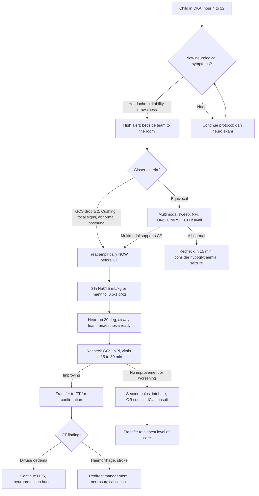

<Callout type="reference">
**Acronyms used on this page**

- **DKA**: diabetic ketoacidosis
- **CE**: cerebral oedema (in this context, the DKA-associated complication)
- **T1DM / T2DM**: type 1 / type 2 diabetes mellitus
- **GCS**: Glasgow coma scale
- **ONSD**: optic nerve sheath diameter (bedside ultrasound)
- **TCD / TCCD**: transcranial Doppler / transcranial colour-coded duplex
- **PI**: pulsatility index
- **MFV / EDV / PSV**: mean flow velocity / end-diastolic velocity / peak systolic velocity (cm/s)
- **NIRS**: near-infrared spectroscopy
- **rSO2**: regional oxygen saturation
- **NPi**: neurological pupil index (pupillometer-derived, 0 to 5)
- **HTS**: hypertonic saline (3% NaCl is the pediatric workhorse)
- **CT**: computed tomography
- **MAP / ICP / CPP**: mean arterial / intracranial / cerebral perfusion pressure
- **PECARN**: Pediatric Emergency Care Applied Research Network
- **AHA**: American Heart Association
</Callout>

<TldrCard>
**The 60-second version.** DKA-associated cerebral oedema affects approximately 0.5 to 1% of pediatric DKA admissions; mortality 20 to 25%, severe neurological morbidity 25%. **The classic presentation**: 4 to 12 hours into rehydration, headache, irritability, then **GCS drop ≥ 2**, then Cushing pattern (rising BP, bradycardia), then pupillary signs. **The multimodal sweep**: GCS (the primary trigger; Glaser 2001 criteria), pupillometry (NPi drops bilaterally then asymmetric), bedside ONSD (rises above 5.0 to 5.5 mm), bilateral NIRS (symmetric drop suggests global oedema), TCD PI (rises 0.9 to 1.5+ as ICP rises). **Treat first, image after**: 3% NaCl 5 mL/kg or mannitol 0.5 to 1 g/kg, head-up 30 degrees, anaesthesia ready. Avoid hyperventilation, slow correction of sodium and glucose (≤ 5 mmol/L/h each), maintain MAP, recognise the Cushing triad early. The bedside team makes the diagnosis; tertiary monitors confirm but do not delay treatment.
</TldrCard>

## 1. Three patient vignettes

### Vignette A. Canonical school-age new-onset T1DM

**Asher, 9 years old, 28 kg.** Presents with 3 days of polyuria, vomiting, and confusion. ED: pH 6.91, HCO3 4 mmol/L, glucose 38 mmol/L, sodium-corrected 142, BUN 14 mmol/L (raised), GCS 12. PECARN risk factors: new-onset, severe acidosis, elevated BUN, low PaCO2, age < 5 to 10 years (Asher just above the highest-risk band but new-onset is the dominant risk). Started on local DKA protocol: 10 mL/kg crystalloid bolus (single, since shocked at arrival), then 0.9% saline at 1.5 times maintenance, insulin 0.05 units/kg/h after the first hour. Hour 4 of rehydration: the bedside nurse reports Asher complained of headache 30 minutes earlier, then became irritable, then sleepier. **GCS now 9** (E2 V2 M5). Glucose 18, sodium-corrected 138 (down from 142, a worrying drop), HR 72 (was 110), BP 130/80 (was 105/65). The bedside team activates the cerebral oedema protocol. Modalities available at this regional PICU: clinical exam, bedside pupillometer (donated), ONSD ultrasound (intensivist-performed), bilateral NIRS pads. No invasive ICP, no continuous EEG, no TCD on this shift. The question: is this DKA-CE, and what to do in the next 10 minutes? <Cite id="glaser2001" /> <Cite id="kuppermann2018_pecarn_dka" /> <Cite id="glaser2024_dka_review" />

### Vignette B. Toddler in DKA

**Maya, 3 years old, 14 kg.** Known T1DM diagnosed 6 months ago; admitted with DKA after a gastroenteritis episode disrupted insulin dosing. pH 7.05, HCO3 8, glucose 28, sodium-corrected 138, GCS 13 at admission. Started on rehydration. Hour 6: the nurse notes Maya is "less responsive than expected." GCS 11. Bradycardia developing. The toddler-specific challenges: GCS scoring under age 5 uses pediatric-modified scale; small head means ONSD threshold may be lower (4.5 to 5.0 mm); pupillometer norms are similar to adults; vascular access for HTS is harder. The team gives **3% NaCl 4 mL/kg = 56 mL through a working peripheral cannula**, anaesthesia ready, head-up 30 degrees. NPi 3.8 / 3.7 (sluggish, mild bilateral drop). ONSD 5.3 mm (above the under-5 threshold of 5.0). NIRS symmetric at 62%. Glucose corrected slowly to 17 mmol/L. The toddler-specific lesson: lower ONSD threshold, modified GCS, and the recognition that **DKA-CE in younger children is higher-risk** (PECARN data show age < 5 is an independent risk factor). <Cite id="kuppermann2018_pecarn_dka" /> <Cite id="muir2004" />

### Vignette C. Atypical: silent rise on TCD PI without GCS drop

**Daniyal, 12 years old, 42 kg.** Known T1DM, DKA after running out of insulin during a holiday. pH 7.00, HCO3 6, glucose 32, sodium-corrected 140. Hour 5 of rehydration: GCS still 14, oriented and answering questions. No headache. Nurse describes him as "a little quiet." TCD performed by an enthusiastic medical resident: **PI rising 0.9 to 1.5 over 90 minutes on the right MCA**. NIRS 60 / 61 (slight bilateral drop from 65 / 65 at admission). ONSD 5.5 mm (rising). Pupillometry NPi 3.8 / 3.8. HR has fallen from 105 to 88; BP risen from 110 / 70 to 124 / 80. **The vital signs are entering Cushing territory without a major GCS drop**. The team activates the cerebral oedema protocol on the **multimodal evidence alone**: pre-emptive HTS 5 mL/kg = 210 mL over 20 minutes, head-up, anaesthesia ready. CT after stabilisation shows early cerebral oedema with effaced sulci. The lesson: **TCD PI and Cushing vital signs can precede the dramatic GCS drop**; an attentive multimodal sweep catches the trajectory earlier than waiting for the classical clinical picture. <Cite id="glaser2001" />

---

## 2. The clinical question

In a child with DKA developing new neurological symptoms 4 to 12 hours into rehydration, **how do you confirm cerebral oedema fast enough to act before herniation?** The integration question is the sequence: clinical exam first, pupillometry and ONSD next, NIRS and TCD if available, and **treatment before imaging**.

---

## 3. Pathophysiology refresher

DKA-associated cerebral oedema is the leading cause of death and severe neurological morbidity in pediatric DKA. Incidence is approximately 0.5 to 1% of DKA admissions; mortality 20 to 25%; severe neurological disability 25%. Risk factors (PECARN, Glaser cohorts) include: **age < 5 years**, **new-onset T1DM**, **severe acidosis** (pH < 7.10), **elevated BUN**, **low PaCO2** (severe hyperventilation), and historically (now debated) rapid sodium correction or excessive fluid administration. <Cite id="glaser2001" /> <Cite id="kuppermann2018_pecarn_dka" /> <Cite id="glaser2024_dka_review" />

**Mechanism**: the picture is incompletely understood but combines (1) vasogenic oedema from BBB dysfunction in a brain conditioned to high osmolality, (2) cytotoxic injury from osmotic gradients across cell membranes as plasma osmolality falls during rehydration, (3) cerebral hypoperfusion during initial shock with reperfusion injury during rehydration, and (4) inflammatory and endothelial dysfunction. The historic narrative blamed aggressive fluid replacement; the **PECARN FLUID trial (Kuppermann 2018)** clarified that within reasonable bounds, neither sodium concentration nor rate of fluid administration changes neurological outcome, suggesting the oedema is more about the underlying pathophysiology and less about iatrogenic fluid management. **Slow correction of sodium and glucose (≤ 5 mmol/L/h each) remains standard**, both for the cerebral oedema concern and for systemic safety. <Cite id="kuppermann2018_pecarn_dka" /> <Cite id="muir2004" />

**The clinical trajectory** is the diagnostic anchor. Glaser 2001 derived the **diagnostic criteria** from a case-control study:
- **Abnormal motor or verbal response to pain**
- **Decorticate or decerebrate posturing**
- **Cranial nerve palsy** (especially III, IV, VI)
- **Abnormal respiratory pattern** (grunting, tachypnoea, Cheyne-Stokes, apnoeustic)

Plus the **major criteria** in the bedside operational sense (the most-used trigger):
- **Altered mental status / fluctuating consciousness**, particularly GCS drop ≥ 2
- **Sustained heart rate decrease** not attributable to improved volume status (Cushing component)
- **Age-inappropriate incontinence**

**Pre-treatment warning signs** that should prompt the multimodal sweep: headache (especially severe or sudden), persistent vomiting after correction begins, bradycardia or rising blood pressure (Cushing), falling GCS even by 1 point, pupillary changes, incontinence, new focal signs. <Cite id="glaser2001" /> <Cite id="muir2004" />

**ONSD as a non-invasive ICP surrogate**: cerebrospinal fluid surrounds the optic nerve and transmits intracranial pressure changes. The optic nerve sheath dilates when ICP rises above approximately 20 mmHg. **Threshold**: > 5.0 to 5.5 mm in children 1 to 15 years (Padayachy 2012, 2016); under 1 year approximately 4.5 mm. Measurement: linear high-frequency probe, 3 mm posterior to the globe, both eyes, average two measurements per eye. <Cite id="padayachy2012" /> <Cite id="padayachy2016_pediatric_onsd" /> <Cite id="robba2018_onsd_review" />

**TCD PI in raised ICP**: PI rises as cerebrovascular distal resistance rises. In DKA-CE, PI > 1.4 is suggestive of raised ICP; **a rise from baseline of 50%** is more informative than the absolute number. PI is not ICP (de Riva 2012 caveat); use it as a triage, not a measurement. <Cite id="deriva2012_pi" /> <Cite id="bellner2004" />

**NIRS in DKA-CE**: bilateral symmetric drop suggests global cerebral oedema; asymmetric drop suggests focal pathology (uncommon in DKA-CE; more typical of stroke). NIRS trend matters more than the absolute number.

**Pupillometry NPi**: a drop from baseline NPi 4.5 to 3.5 is meaningful; a drop to < 3.0 with sluggish response suggests early herniation. Asymmetric NPi drop signals uncal herniation; bilateral drop signals diencephalic compromise. <Cite id="oddo2018_npi_orange" /> <Cite id="oddo2018" />

---

## 4. The multimodal picture table

| Modality | Suggests cerebral oedema | What it rules out | What it adds |
|---|---|---|---|
| **GCS** | Drop ≥ 2 from highest pre-event | Subclinical seizure (some overlap) | The primary trigger (Glaser criterion) |
| **Vital signs** | Bradycardia, rising BP (Cushing) | Sepsis (different pattern) | Earliest physiological sign |
| **Pupillometry NPi** | Bilateral drop, then asymmetric | Sedation alone | Quantifies "sluggish" pupil |
| **ONSD** | > 5.0 to 5.5 mm in 1-15 y; > 4.5 mm < 1 y | Acute / chronic distinction | Non-invasive ICP surrogate |
| **TCD PI** | > 1.4 or ≥ 50% rise from baseline | Specificity for ICP | Triage to imaging / treatment |
| **TCD EDV** | Falling EDV signals rising distal resistance | Healthy waveform | Earliest TCD change |
| **NIRS bilateral** | Symmetric drop = global; asymmetric = focal | Pure hypotension | Regional vs global |
| **Bedside neuro exam** | New focal signs, posturing, cranial nerve palsies | Hypoglycaemia, subclinical seizure | Direct clinical evidence |
| **Glucose, sodium** | Falling rapidly may be contributory; not diagnostic | Hypoglycaemia (different cause of GCS drop) | Safety guardrails |
| **CT (after stabilisation)** | Effaced sulci, slit ventricles, decreased grey-white differentiation | Haemorrhage, stroke, abscess | Confirmation; not for diagnosis |

The most useful pairings: **GCS + vital signs** (the diagnostic core), **pupillometry + ONSD** (early ICP surrogates), and **NIRS + TCD PI** (when both available).

---

## 5. Decision tree

<Figure
  src="/images/integration/dka-cerebral-edema/timeline.svg"
  alt="Timeline of DKA cerebral oedema showing hour 0 admission, hour 4 headache and irritability, hour 4:30 GCS drop and Cushing pattern, multimodal sweep findings, HTS bolus, and improvement at hour 4:30 to 8:00"
  caption="DKA cerebral oedema timeline. Hour 0: admission, DKA criteria met, rehydration started. Hour 4: subtle warning signs (headache, irritability). Hour 4:15: bedside nurse triggers the team. Hour 4:30: Glaser criteria met (GCS drop, Cushing); multimodal sweep documents NPi drop, raised ONSD, symmetric NIRS drop, raised TCD PI; HTS bolus given before CT. Hour 5: GCS recovering, sodium 145; transfer to CT confirms diffuse oedema. Hour 8: second dip, second bolus, anaesthesia intubates; PICU admission. Day 2: slow improvement. Day 5: extubated, returning to baseline. The shaded box from hour 4 to hour 8 is the time-critical window where MNM-supported recognition pre-empts herniation."
  attribution="MNM-Edu, original schematic. SVG placeholder."
  label="Fig. 1"
/>

---

## 6. Step-by-step bedside actions

1. **Document baseline GCS, NPi, NIRS, ONSD, vital signs** at admission and hourly during the first 12 hours of rehydration. All subsequent values are interpreted as deltas.
2. **Brief the bedside nurse on warning signs**: headache, persistent vomiting after correction, bradycardia, rising BP, falling GCS even by 1 point, pupillary changes, incontinence, new focal signs. Document in the chart for handover.
3. **When any warning sign appears**, perform the **multimodal sweep within 5 minutes**: GCS, NPi bilateral, ONSD bilateral, NIRS bilateral, vital signs, glucose, sodium (point of care).
4. **Apply Glaser criteria**: GCS drop ≥ 2, Cushing pattern, cranial nerve palsy, abnormal posturing, abnormal respiratory pattern, age-inappropriate incontinence. Any one major criterion plus two minor warrants the cerebral oedema protocol.
5. **Treat before CT**: the time-critical diagnosis. **3% NaCl 5 mL/kg over 10 to 20 minutes** (central line preferred but peripheral acceptable for first dose); for Asher at 28 kg, 140 mL. Mannitol 0.5 to 1 g/kg is the alternative.
6. **Reduce IV fluid rate** to maintenance only. **Head-up 30 degrees, neck neutral, avoid flat positioning.** **Airway team ready**; anaesthesia called.
7. **If GCS ≤ 8 sustained**, intubate, but **maintain normocapnia** (PaCO2 35 to 40). Avoid hyperventilation (vasoconstriction, ischaemia).
8. **Recheck sodium, glucose, ABG** in 30 minutes post-bolus. Target sodium rise of 2 to 5 mmol/L per dose. Sodium ceiling 150 to 155 in this acute window.
9. **Transfer to CT** once stabilised (post-bolus, airway secure if needed). CT confirms diffuse oedema (effaced sulci, slit ventricles, decreased grey-white differentiation). Look for alternative diagnoses (haemorrhage, stroke, abscess) on the way.
10. **Continue neuroprotection bundle**: normothermia (paracetamol PR + tepid sponging), normocapnia, normoxia, sodium 145 to 155, slow glucose correction (≤ 5 mmol/L/h), CPP maintained, head-up.

---

## 7. Management ladder and endpoints

| Tier | Intervention | Endpoint |
|---|---|---|
| 0 | Baseline MNM at admission; hourly neuro exam; nurse warning-sign awareness | Baseline established |
| 1 | Warning sign appears: multimodal sweep | Glaser criteria assessed |
| 2 | Glaser criteria met: HTS or mannitol bolus, head-up, airway team | Bolus delivered |
| 3 | Reassess at 15 to 30 min; CT after stabilisation | Improvement documented or escalation triggered |
| 4 | Second bolus, intubation, sodium ceiling approached | ICU-level care |
| 5 | Refractory or rapid progression: ICU transfer, neurosurgical consult, palliative care if appropriate | Plan determined |

**Success** looks like: GCS recovering within 30 minutes of HTS, NPi normalising, ONSD falling, normalisation of vital signs, eventual extubation within 24 to 48 hours, discharge from PICU within 5 days, full neurological recovery.

**Failure** looks like: refractory neurological deterioration despite escalating HTS and supportive care; brainstem signs progressing; CT showing diffuse oedema with herniation; transition to either heroic ICP control measures or compassionate care.

<AlgorithmDisclaimer />

---

## 8. Variant subsections

### 8.1 New-onset T1DM vs known diabetes

**New-onset T1DM** is the highest-risk presentation; the brain has been chronically hyperglycaemic and hyperosmolar for days or weeks, and adaptive solutes (idiogenic osmoles) make the brain vulnerable to rapid plasma osmolality changes during rehydration. **Known diabetes with intercurrent DKA** has somewhat lower risk because the brain is less chronically adapted. The treatment approach is identical; the surveillance threshold should be lower in new-onset. <Cite id="kuppermann2018_pecarn_dka" />

### 8.2 Severity-stratified rehydration

The historic narrative (excessive fluid causes cerebral oedema) was clarified by the PECARN FLUID trial: within reasonable bounds (10 to 20 mL/kg initial bolus, then 1.25 to 1.5 times maintenance), the rate and sodium concentration of rehydration do not affect neurological outcome. **Avoid overly aggressive bolus volumes** (> 20 mL/kg) and **avoid sodium correction faster than 5 mmol/L/h**; otherwise the historic concerns appear less rate-dependent than once thought. <Cite id="kuppermann2018_pecarn_dka" />

### 8.3 Recognition timing windows

The classic window for DKA-CE is **4 to 12 hours into rehydration**. Cases outside this window do occur (early at presentation, or up to 24 hours in). The clinical trajectory (headache → irritability → drowsiness → GCS drop → Cushing → pupillary signs) typically unfolds over 1 to 4 hours. The team should maintain vigilance throughout the first 24 hours of treatment, not just at hour 4 to 12.

### 8.4 Refractory cases

When initial HTS fails to improve GCS or vital signs within 30 minutes, escalate: second bolus, intubation (maintain normocapnia), brief hyperventilation as a bridge to herniation control only (PaCO2 30 to 35 transiently), continuous HTS infusion to maintain sodium 145 to 155, transfer to tertiary PICU for invasive ICP monitoring if available. Refractory cases account for the bulk of DKA-CE mortality.

### 8.5 Hypoglycaemia and seizure as differentials

A child in DKA who becomes confused or drowsy can have hypoglycaemia (treatment-induced) or a subclinical seizure rather than (or in addition to) cerebral oedema. Always check glucose at the bedside before assuming CE. Subclinical seizures from osmotic shifts are uncommon but documented; cEEG is not standard in DKA-CE workup unless seizure is clinically suspected. The decision tree branches early on bedside glucose and clinical posture; cerebral oedema remains the dominant concern in the absence of other explanations.

### 8.6 Resource-limited recognition

In regional centres without pupillometry, ONSD, or NIRS, **clinical exam plus vital signs** remain the diagnostic foundation. The Glaser criteria are bedside criteria that need no equipment. The MNM modalities support, do not replace, the clinical recognition. A regional team with a vigilant nurse, a senior physician, and bedside HTS available can manage the most dangerous hour of DKA-CE without tertiary monitors. <Cite id="muir2004" />

---

## 9. Multimodal integration matrix

| Pair | What you gain |
|---|---|
| **GCS + vital signs** | The Glaser core; sufficient to trigger treatment without tertiary monitors |
| **GCS + pupillometry** | Quantifies the bedside neuro exam; documentable for handover |
| **Pupillometry + ONSD** | Two non-invasive ICP surrogates that move together early |
| **ONSD + TCD PI** | Both rise with ICP; ONSD is anatomic, TCD PI is haemodynamic |
| **NIRS bilateral + clinical exam** | Symmetric NIRS drop supports global oedema; useful confirmatory |
| **MNM sweep + sodium and glucose trajectory** | Rules out treatment-induced metabolic confounders |
| **MNM sweep + CT post-stabilisation** | CT confirms diagnosis and excludes alternatives (haemorrhage, stroke) |
| **MNM sweep + airway team activation** | The MNM-supported recognition triggers airway team mobilisation in parallel with treatment |

---

## 10. Worked alternative scenarios

### 10.1 What if the GCS drop is actually hypoglycaemia?

Asher at hour 4: GCS 9, point-of-care glucose 2.8 mmol/L. **This is hypoglycaemia, not cerebral oedema** (treatment-induced; the insulin infusion may need re-titration). Give 5 mL/kg of 10% dextrose (1.4 g/kg of glucose), recheck glucose in 10 minutes, expect GCS recovery. Defer HTS until glucose is normalised. The bedside team must check glucose **before** the multimodal sweep concludes "cerebral oedema."

### 10.2 What if the deterioration is subclinical seizure?

A 6-year-old in DKA, hour 8 of rehydration, GCS 11 → 7 over 30 minutes; no Cushing pattern. The bedside team applies a 4-channel limited EEG and sees **continuous rhythmic 3 Hz activity over the right hemisphere**. This is non-convulsive status epilepticus, not (purely) cerebral oedema. Load levetiracetam 60 mg/kg; consider HTS in parallel if Glaser criteria are also met. cEEG is not standard in DKA-CE workup, but should be considered when the clinical picture is atypical or the patient is paralysed for intubation.

### 10.3 What if the CT is normal?

Asher post-stabilisation: GCS recovered to 12, NPi normalised, vitals normal. CT shows no oedema, no haemorrhage, normal ventricles. **The CT may be normal even in cerebral oedema** (early changes can be subtle; the CT is more sensitive 6 to 24 hours later). Do not retroactively un-treat; the bedside picture met Glaser criteria, treatment was indicated. Continue neuroprotection, repeat CT or MRI in 12 to 24 hours if clinically warranted, and follow the trajectory. The MNM-supported empirical treatment is the right answer even when imaging is initially negative.

---

## 11. Outcome data

- **Glaser 2001**: case-control study deriving the diagnostic criteria; baseline cohort for understanding clinical features and risk factors. <Cite id="glaser2001" />
- **Muir 2004**: pediatric DKA cerebral oedema review; emphasises clinical recognition, bedside treatment, and the limits of imaging. <Cite id="muir2004" />
- **Kuppermann 2018 PECARN FLUID trial**: 1389 children in DKA randomised to fluid rate and sodium content variations; no detectable difference in neurological outcome; clarifies the role of rehydration practices. <Cite id="kuppermann2018_pecarn_dka" />
- **Glaser 2024 review**: contemporary synthesis of DKA-CE epidemiology, mechanism, recognition, and treatment. <Cite id="glaser2024_dka_review" />
- **Padayachy 2012, 2016**: pediatric ONSD reference data and threshold > 5.0 to 5.5 mm in 1-15 years. <Cite id="padayachy2012" /> <Cite id="padayachy2016_pediatric_onsd" />
- **Robba 2018 ONSD review**: synthesises ONSD as a non-invasive ICP marker. <Cite id="robba2018_onsd_review" /> <Cite id="robba2018peds" />
- **Tasker 2018 pediatric cEEG**: not specifically DKA but relevant for the seizure differential. <Cite id="tasker2018" />

---

## 12. Pitfalls

- **Waiting for the classical clinical picture before treating.** Treat on Glaser criteria; do not wait for blown pupils.
- **Delaying treatment for CT.** Treat first, image after. The transport risk in a deteriorating patient is real.
- **Forgetting bedside glucose check.** Hypoglycaemia is the most important confounder; check before treating empirically.
- **Hyperventilating prophylactically.** Marion 2002 and others show worse outcome with sustained hyperventilation; brief bridge only.
- **Correcting sodium and glucose too fast.** ≤ 5 mmol/L/h each; faster correction risks osmotic demyelination and worsening oedema.
- **Aggressive fluid resuscitation.** A single 10 mL/kg bolus only if shocked; otherwise maintain at 1.25 to 1.5 times maintenance.
- **Underestimating the nurse's vigilance.** The most important diagnostic input is the nurse who notices the headache or the irritability; the multimodal sweep is the confirmation, not the trigger.
- **Reading NIRS in isolation.** A symmetric NIRS drop is supportive but the GCS and vital signs are the diagnosis.
- **Forgetting alternative diagnoses.** Haemorrhage, stroke, abscess, and metabolic encephalopathy can mimic DKA-CE; the CT after stabilisation rules these in or out.

---

## 13. Pediatric considerations

<Pediatric>
**Six pediatric-specific points.**

1. **Age < 5 years is an independent risk factor** for DKA-CE. Lower threshold for the multimodal sweep; consider closer monitoring throughout the first 24 hours of treatment.

2. **GCS scoring under age 5 uses the pediatric-modified scale**. The standard adult GCS underestimates infants and toddlers; the pediatric GCS (modified verbal response) is more accurate.

3. **ONSD thresholds are age-banded**: under 1 year approximately 4.5 mm; 1 to 15 years 5.0 to 5.5 mm. Adult cutoffs do not transfer.

4. **HTS doses are per-kg**: 3% NaCl 3 to 5 mL/kg over 10 to 20 minutes; mannitol 0.5 to 1 g/kg. Central line preferred but peripheral acceptable for first rescue dose.

5. **The bedside nurse is the diagnostic key**. A vigilant nurse noticing the headache, the irritability, or the subtle GCS drop initiates the cascade. Train and trust them.

6. **Family communication**: cerebral oedema in DKA is sudden and frightening for families. Have a clinician present at the bedside throughout the acute phase; explain the protocol; involve palliative care if outcome is uncertain. <Cite id="meert2015_palliative_care" />
</Pediatric>

---

## 14. Combine with

- [Clinical exam and GCS](/modalities/clinical-exam/): the diagnostic backbone.
- [Pupillometry](/modalities/pupillometry/): NPi quantification.
- [ONSD ultrasound](/modalities/onsd/): non-invasive ICP surrogate.
- [NIRS](/modalities/nirs/): regional / global oxygenation.
- [TCD / TCCD modality page](/modalities/tcd/): PI as ICP triage.
- [Osmotherapy integration](/integration/osmotherapy-icp-nirs/): the HTS bolus physiology in detail.
- [Meningitis / encephalitis integration](/integration/meningitis-encephalitis/): adjacent acute encephalopathy.
- [Resource-limited bedside integration](/integration/resource-limited-bedside/): when tertiary monitors are unavailable.

---

<DeepDive>

## 15. Evidence summary and recent literature (2022 to 2025)

### Foundational

| Topic | Reference | Grade |
|---|---|---|
| Glaser diagnostic criteria | <Cite id="glaser2001" /> | B |
| DKA-CE review (Muir) | <Cite id="muir2004" /> | review |
| PECARN FLUID trial | <Cite id="kuppermann2018_pecarn_dka" /> | A |
| Glaser 2024 review | <Cite id="glaser2024_dka_review" /> | review |
| Pediatric ONSD | <Cite id="padayachy2012" /> <Cite id="padayachy2016_pediatric_onsd" /> | B |
| ONSD as ICP surrogate | <Cite id="robba2018_onsd_review" /> | review |
| TCD PI as ICP triage | <Cite id="bellner2004" /> <Cite id="deriva2012_pi" /> | B / review |
| Pupillometry NPi | <Cite id="oddo2018_npi_orange" /> <Cite id="oddo2018" /> | B |

### Recent literature (2022 to 2025)

- **Glaser 2024 review**: the most current synthesis of DKA-CE pathophysiology, recognition, and treatment; integrates PECARN data with the older Glaser criteria. <Cite id="glaser2024_dka_review" />
- **Helbok 2024 pediatric MMM update**: places non-invasive ICP surrogates (ONSD, TCD PI, NIRS) in the bedside DKA-CE bundle. <Cite id="helbok2024_pediatric_mmm" />
- **Figaji 2025 pediatric MMM consensus**: same framework for non-invasive ICP surrogates in DKA-CE. <Cite id="figaji2025_mmm_pediatric_consensus" />
- **Tasker 2023 PCCM review**: integrative pediatric MMM piece; DKA-CE in the broader acute encephalopathy framework. <Cite id="tasker2023_pccm_review" />
- **Kerscher 2023**: pediatric pupillometry NPi reference data. <Cite id="kerscher2023" /> <Cite id="kerscher2023_npi" />
- **Robba 2018 ONSD pediatric**: pediatric-specific synthesis of ONSD as ICP surrogate. <Cite id="robba2018peds" />

</DeepDive>

---

## 16. Self-check

<Quiz
  questions={[
    {
      id: 'q1',
      prompt: 'A 9-year-old in DKA, hour 4 of rehydration. The bedside nurse reports headache 30 minutes ago, then irritability, now drowsiness. GCS dropped from 14 to 9 over 30 minutes; HR fell from 110 to 72; BP rose from 105/65 to 130/80. Glucose 18, sodium 138, point-of-care glucose just confirmed. What is the best next action?',
      options: [
        { id: 'a', label: 'Transfer to CT first; treat after imaging confirms cerebral oedema' },
        { id: 'b', label: 'Give 3% NaCl 5 mL/kg over 20 min, head-up 30 degrees, anaesthesia team to bedside; CT after stabilisation' },
        { id: 'c', label: 'Hyperventilate to PaCO2 28 prophylactically' },
        { id: 'd', label: 'Repeat the glucose check; this is likely hypoglycaemia' },
      ],
      answer: 'b',
      explanation: 'Glaser criteria met (GCS drop ≥ 2, Cushing pattern). Treat before CT, the time-critical window does not allow imaging delay. HTS 5 mL/kg is first-line; head-up 30 degrees and airway team readiness are parallel actions. Glucose has already been checked. Prophylactic hyperventilation is harmful (vasoconstriction, ischaemia). CT after stabilisation confirms or excludes alternative diagnoses but does not change the immediate action.',
    },
    {
      id: 'q2',
      prompt: 'A 12-year-old in DKA at hour 5 of rehydration. GCS still 14, oriented. Subtle: HR fell from 105 to 88, BP rose from 110/70 to 124/80, TCD PI rose from 0.9 to 1.5 over 90 minutes, ONSD 5.5 mm, NIRS 60 / 61 (down from 65 / 65). Pupillometry NPi 3.8 / 3.8 (mild drop). What is the most defensible next step?',
      options: [
        { id: 'a', label: 'Continue rehydration; GCS is normal' },
        { id: 'b', label: 'Pre-emptive 3% NaCl 5 mL/kg, head-up 30 degrees, anaesthesia ready; CT after stabilisation' },
        { id: 'c', label: 'Order CT first to confirm cerebral oedema before treating' },
        { id: 'd', label: 'Give a 10 mL/kg fluid bolus to stabilise haemodynamics' },
      ],
      answer: 'b',
      explanation: 'The multimodal sweep shows a Cushing-pattern with rising TCD PI, raised ONSD, and bilateral NIRS drop, even though the GCS has not yet dropped substantially. This is the prodromal phase of DKA-CE; pre-emptive treatment is appropriate. Waiting for the classical GCS drop forfeits the recognition window. CT delays treatment; fluid bolus could worsen oedema.',
    },
    {
      id: 'q3',
      prompt: 'A 4-year-old in DKA. Hour 6 of rehydration. GCS 11 (was 14). NPi 3.8 / 3.7, sluggish. ONSD 5.3 mm. Heart rate falling. Sodium 138 (was 142 at admission). Glucose 16 (was 30). What rate of sodium and glucose correction should you target going forward?',
      options: [
        { id: 'a', label: 'Sodium 10 mmol/L/h, glucose 10 mmol/L/h to correct quickly' },
        { id: 'b', label: 'Sodium ≤ 5 mmol/L/h, glucose ≤ 5 mmol/L/h to minimise osmotic shifts' },
        { id: 'c', label: 'Bolus 0.9% saline to restore sodium to 145 rapidly' },
        { id: 'd', label: 'Stop insulin temporarily to prevent further glucose fall' },
      ],
      answer: 'b',
      explanation: 'Slow correction of sodium and glucose, each at ≤ 5 mmol/L/h, is the standard pediatric DKA recommendation, both for the cerebral oedema concern and for systemic safety. Rapid correction risks osmotic demyelination and worsening cerebral oedema. Stopping insulin entirely risks ketoacidosis recurrence; the insulin rate can be adjusted but should continue. Bolus sodium correction is not the standard approach.',
    },
  ]}
/>
