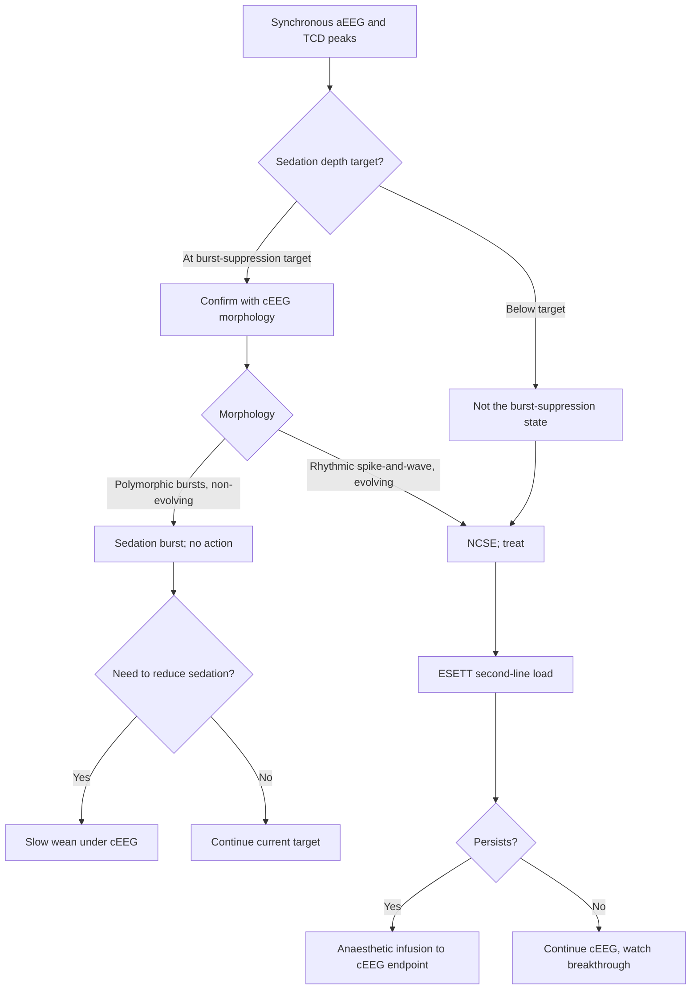

<Callout type="reference">
**Acronyms used on this page**

- **NCSE / CSE**: non-convulsive / convulsive status epilepticus
- **cEEG / aEEG / qEEG**: continuous EEG / amplitude-integrated EEG / quantitative EEG
- **TCD / TCCD**: transcranial Doppler / transcranial color-coded duplex
- **MFV / PSV / EDV / PI**: mean flow velocity / peak systolic / end-diastolic / pulsatility index
- **NIRS / rSO2**: near-infrared spectroscopy / regional cerebral oxygen saturation
- **BSR**: burst-suppression ratio
- **CMRO2 / CBF / CBV**: cerebral metabolic rate of oxygen / cerebral blood flow / cerebral blood volume
- **TBI / HIE / SAH**: traumatic brain injury / hypoxic-ischaemic encephalopathy / subarachnoid haemorrhage
- **ICP / CPP / MAP**: intracranial pressure / cerebral perfusion pressure / mean arterial pressure
- **ACNS**: American Clinical Neurophysiology Society
- **NPi**: neurological pupil index
- **NORSE / FIRES**: new-onset refractory SE / febrile infection-related epilepsy syndrome
</Callout>

<TldrCard>
**The 60-second version.** A sedated and ventilated PICU patient shows intermittent narrowing of the aEEG envelope every 3 to 5 minutes, with synchronous TCD systolic peaks in the middle cerebral artery. Two diagnostic possibilities: (a) sedation-induced burst-suppression where the bursts produce transient CMRO2 spikes and therefore transient TCD MFV rises; (b) non-convulsive status epilepticus where rhythmic ictal discharges drive the metabolic-flow couple. The discriminator is **full-montage cEEG before any action**: if the burst is morphologically a sedation burst (high-amplitude polymorphic theta-delta on a flat background), keep the sedation; if it is morphologically an ictal discharge (rhythmic spike-and-wave or evolving rhythm), treat as NCSE. NIRS asymmetry and pupillometry NPi add localising and prognostic information. Decision: hold or reduce sedation only when ictal morphology is confirmed; treat NCSE as you would treat CSE (ESETT-validated second-line, then anaesthetic infusion to cEEG endpoint).
</TldrCard>

## 1. Three patient vignettes

### Vignette A. The canonical sedated TBI

Aiden, **8 years old, 28 kg**, severe TBI day 3 after a bicycle-versus-car collision. Intubated, sedated on midazolam infusion 0.1 mg/kg/h plus fentanyl. ICP monitor in place at 12 mmHg, CPP 65. Bedside aEEG shows a baseline narrow trace (sedation effect) with intermittent envelope rises every 3 to 5 minutes lasting 30 to 90 seconds; synchronous TCD shows MFV briefly rising from 70 to 110 cm/s in the right MCA. The bedside nurse asks: is this non-convulsive status, or sedation bursting through? Full-montage cEEG is hooked up and shows **rhythmic 1.5 Hz spike-and-wave** in the right hemisphere during the envelope rises, evolving in frequency and morphology. **This is NCSE.** Levetiracetam load is started. <Cite id="claassen2004" /> <Cite id="herman2015acns_ceeg" />

### Vignette B. The 6-month-old post-arrest

Ravi, **6 months old, 8 kg**, post-cardiac-arrest day 2 after a witnessed cardiac arrest secondary to a long-QT episode. Hypothermia 33 C complete, now at 36 C. Sedated on midazolam infusion for shivering. aEEG envelope shows a discontinuous pattern with sharp clusters every 2 to 4 minutes; bilateral TCD shows MFV at 60 cm/s baseline with brief rises to 95. cEEG confirms **bilateral periodic discharges at 1 to 2 Hz** with no clear evolution, lateralised epileptiform discharges with morphology consistent with the ictal-interictal continuum. The team must decide: is this electrographic seizure that needs treatment, or post-anoxic burst-suppression that needs time? **The Hirsch 2021 ACNS nomenclature** is the bridge: the pattern is GPDs (generalised periodic discharges), at the high-risk end of the IIC. Treatment is appropriate. <Cite id="hirsch2021acns" /> <Cite id="topjian2021aha_pediatric" />

### Vignette C. The misleading sedation burst

Maya, **11 years old, 38 kg**, post-cardiac arrest after a near-drowning, day 3, on a midazolam plus pentobarbital infusion targeted to burst-suppression with BSR 70%. aEEG shows the classic burst-suppression envelope with peaks every 4 to 6 seconds; TCD shows synchronous MFV rises 60 to 95 cm/s. The covering night-shift senior wonders: should we treat this as NCSE? **Full-montage cEEG** shows **non-rhythmic polymorphic theta-delta bursts on a flat background**, exactly as expected for the prescribed BSR target. This is the desired sedation pattern, not NCSE. The TCD-MFV rises are the metabolic signature of the bursts (transient flow-metabolism coupling during the active phase). **No action taken; continue at the current target.** <Cite id="claassen2004" /> <Cite id="foreman2022" />

---

## 2. The clinical question

For the sedated PICU patient with synchronous aEEG and TCD intermittent rises, **how do we distinguish sedation-induced burst activity from non-convulsive status epilepticus, and what role does TCD play beyond cEEG?**

---

## 3. Pathophysiology refresher

The cerebral metabolic rate of oxygen (CMRO2) and the cerebral blood flow (CBF) are normally tightly coupled (flow-metabolism coupling). When CMRO2 rises, CBF rises a few seconds later through a metabolic vasodilator cascade (local lactate, adenosine, K+, nitric oxide, prostaglandins). When CMRO2 falls, CBF falls. This is the physiological substrate for the TCD-aEEG relationship in this scenario.

**During a seizure**, neuronal firing increases roughly threefold in the active focus, lifting regional CMRO2 by 50 to 100%. CBF rises in parallel (in autoregulated brain) or fails to rise (in disautoregulated brain, producing post-ictal hypoperfusion). The TCD MFV picks up the rise as a transient MFV peak, often seen 1 to 5 seconds after the EEG ictal onset.

**During a sedation burst**, the burst is itself a brief period of neuronal activity emerging from a quiescent suppressed background. Polymorphic theta-delta bursts of high amplitude consume metabolic substrate; CMRO2 rises; CBF rises briefly. The TCD MFV signature is similar in waveform shape to the ictal signature, but the magnitude is typically smaller (the burst recruits fewer neurons than a true ictal discharge), and the morphology is non-evolving (each burst looks like the previous one).

**Why aEEG alone cannot distinguish.** aEEG compresses 10 to 15 minutes of cortical activity into a one-screen envelope. It captures the amplitude envelope but loses the morphology and the rhythmicity. An ictal saw-tooth envelope is morphologically very similar to a burst-suppression envelope at low temporal resolution. The ACNS pediatric cEEG indications are explicit: **aEEG is a screening tool; full-montage cEEG is the diagnostic standard for NCSE**. <Cite id="herman2015acns_ceeg" /> <Cite id="hirsch2021acns" />

**Why TCD adds value.** TCD adds three pieces of information aEEG does not provide: (i) **timing of the metabolic-flow response** (how delayed; whether the flow peak follows or precedes the envelope peak); (ii) **localisation** (which hemisphere has the larger MFV rise; useful when cEEG montage is reduced); (iii) **autoregulation status** (Mx-style correlation of MFV with MAP across the ictal cycle informs whether the brain is still autoregulating). <Cite id="claassen2004" /> <Cite id="foreman2012" />

**Why NIRS adds further value.** NIRS rSO2 falls in the hemisphere that is metabolising more than its flow can supply, and the asymmetry timing relative to EEG and TCD informs the autoregulation question. <Cite id="davies2017nirs" />

---

## 4. The multimodal picture

| Monitor | What you see in sedation burst | What you see in NCSE | Discriminating feature |
|---|---|---|---|
| **Full-montage cEEG** | Polymorphic theta-delta bursts on a flat background; non-evolving; non-rhythmic | Rhythmic spike-and-wave or evolving discharges; spatial migration | Morphology and rhythmicity |
| **aEEG envelope** | Saw-tooth rises every 3 to 8 seconds, low to moderate amplitude | Saw-tooth rises every 2 to 60 seconds, variable amplitude | Cannot distinguish reliably; both produce envelope narrowing or rises |
| **TCD MFV** | Small MFV rise (10 to 20%) synchronous with burst | Larger MFV rise (30 to 60%); may have post-ictal hypoperfusion (MFV drop) | Magnitude and post-ictal trajectory |
| **TCD PI** | Stable, no consistent change | Falls during ictus (vasodilation), recovers after | PI dynamics |
| **NIRS rSO2** | Small rises (1 to 3%) symmetric | Larger rises (3 to 8%) often asymmetric; may fall in post-ictal phase | Asymmetry direction |
| **NPi (pupillometry)** | Stable | May fall transiently with post-ictal hemiparesis | Trend over hours |
| **ICP** | Stable | May rise 2 to 5 mmHg per seizure event | Cumulative rise across events |
| **Clinical exam** | Unhelpful (paralysed or sedated) | Unhelpful | Both equally limited |

---

## 5. Decision tree

<Figure
  caption="NCSE diagnostic and treatment pathway. Suspected NCSE on continuous EEG (rhythmic discharges &gt; 2.5 Hz, periodic discharges with spatiotemporal evolution, or focal slowing with reactivity loss) triggers a benzodiazepine trial; pattern resolution with clinical improvement clinches the diagnosis. NCSE-driven flow swings on TCD (large MFV rises with post-ictal undershoot) and small rises during sedation-induced burst-suppression are the bedside corollary; turning down sedation and re-reading is the first move when the picture is ambiguous."
  attribution="MNM-Edu, original schematic."
  label="Fig. 1"
>
  <NCSEPathway />
</Figure>

<AlgorithmDisclaimer />

---

## 6. Step-by-step bedside actions

For Aiden (8 y, 28 kg, sedated TBI with intermittent aEEG narrowing). Times are from the first reported envelope change.

1. **0 to 10 min: gather the trace, hold action.** Do not adjust sedation or treat empirically before the full-montage cEEG is reviewed. Bedside aEEG alone is not a diagnostic standard. Page neurology and the on-call cEEG technician.
2. **10 to 30 min: get full-montage cEEG on.** Hook up the full 21-electrode montage; the morphology snapshot is the diagnostic standard. Print or screenshot the most recent envelope-narrowing event for the neurology read.
3. **30 to 60 min: review morphology.** Rhythmic spike-and-wave with evolution in frequency, amplitude, or location = NCSE. Polymorphic theta-delta bursts on a flat background, non-rhythmic, non-evolving = sedation burst. The Hirsch 2021 ACNS nomenclature is the reference. <Cite id="hirsch2021acns" />
4. **NCSE confirmed: treat per the SE pathway.** Levetiracetam 60 mg/kg IV over 10 min as ESETT-validated second-line (assuming benzodiazepine load already given as part of sedation). For Aiden's 28 kg: 1680 mg, max 4500 mg adult ceiling. <Cite id="glauser2016esett" /> <Cite id="kapur2019eclipse_se" />
5. **Sedation burst confirmed: no action; continue target.** If the target is burst-suppression with BSR 50 to 90%, the pattern is expected. Document and continue.
6. **Synchronously check the TCD trace.** The TCD MFV rise magnitude (>30%) and the post-ictal undershoot (drop below baseline for 30 to 60 seconds) support NCSE; small symmetric rises with no undershoot support burst.
7. **NIRS asymmetry check.** If rSO2 falls >5% on the affected hemisphere during the rise and undershoots after, NCSE is more likely.
8. **ICP trend.** Cumulative ICP rise across multiple events (e.g., baseline 12 climbing to 18 over 30 minutes of events) supports NCSE-driven secondary injury.
9. **NPi (pupillometry) at the next 2-hour neurocheck.** Falling NPi (especially asymmetric) suggests evolving structural change beyond pure NCSE; consider repeat imaging.
10. **Reassess at 4 to 6 hours.** Persistent rhythmic ictal discharges despite second-line: escalate to anaesthetic infusion (midazolam 0.2 mg/kg bolus then 0.1 to 2 mg/kg/h), targeting cEEG seizure cessation.

---

## 7. Management ladder and endpoints

**Success looks like:** cEEG morphology resolves (no more evolving rhythmic discharges); aEEG envelope normalises; TCD MFV peaks return to expected sedation baseline; NIRS symmetry restored; ICP stable; haemodynamics stable on titrated infusion.

**Failure looks like:** breakthrough electrographic seizures within 6 hours; NIRS asymmetry persisting or worsening; rising NPi asymmetry; rising ICP; new focal deficit when sedation lightened.

**When to escalate:**
- Persistent NCSE despite second-line, start midazolam infusion to cEEG endpoint.
- Persistent NCSE despite midazolam at 1 mg/kg/h, add ketamine (1 to 3 mg/kg bolus then 1 to 5 mg/kg/h) or switch to pentobarbital.
- Persistent NCSE more than 24 h, declare SRSE; broaden workup; consider immunotherapy and ketogenic diet.

**When to de-escalate:**
- cEEG seizure-free for 24 h at the target BSR; slow wean (20 to 30% per 6 to 12 h).
- Reversible drivers (fever, electrolytes, infection) addressed.
- Family goals-of-care conversation current.

---

## 8. Variant subsections

### 8.1 Post-cardiac-arrest NCSE in the cooled child

Up to 30% of comatose post-arrest children have electrographic seizures on cEEG; many are non-convulsive. The cooled child cannot generate the autonomic surges that hint at seizure clinically. TCD adds value by detecting the MFV-CMRO2 couple even when the cortex is suppressed by hypothermia. NIRS asymmetry is similarly informative. Treatment improves seizure burden; whether it improves outcome remains uncertain. <Cite id="topjian2021aha_pediatric" /> <Cite id="naim2023_brain_injury_pccm" />

### 8.2 Ictal-interictal continuum patterns

The 2021 ACNS standardised nomenclature defines patterns that lie between definite seizure and definite background (GPDs, LPDs, BIPDs, GRDA, LRDA). Whether to treat is a clinical decision that integrates the cEEG pattern with the clinical state, TCD MFV behaviour, NIRS asymmetry, and ICP trend. Treat aggressively when (a) the pattern is rhythmic and high-frequency, (b) the TCD-NIRS signature supports active metabolism-flow demand, or (c) there is a treatable downstream injury (rising ICP, new deficit). <Cite id="hirsch2021acns" />

### 8.3 Sedation burst with paradoxical TCD swings

A child at deep sedation with burst-suppression target may show TCD MFV swings of 30 to 50% with each burst. This is not pathological; it is the metabolic signature of the burst itself. The discriminator is the cEEG morphology and the *non-evolving* nature of the bursts. Continue at target.

### 8.4 NCSE in NORSE/FIRES

In febrile-prodrome refractory SE, the cEEG often shows multifocal evolving discharges that wax and wane over hours. The TCD MFV rises are often bilateral and shifting (the focus migrates). aEEG envelope is wide. Treatment is per the RSE/SRSE pathway with early ketogenic diet and immunotherapy. <Cite id="trinka2015_status_definition" />

### 8.5 NCSE after meningitis or encephalitis

Particularly common in HSV encephalitis and bacterial meningitis with cortical involvement. The TCD-NIRS pair adds vasculitic vasospasm detection (rising MFV without flow-metabolism coupling correlation). The treatment ladder is identical to standard NCSE; the workup must include the infectious driver. <Cite id="vandebeek2016eu_meningitis" /> <Cite id="tunkel2017idsa_encephalitis" />

### 8.6 NCSE on ECMO

VA-ECMO produces a non-pulsatile baseline TCD; intermittent MFV peaks during sedation bursts or NCSE may be difficult to distinguish from circuit-related flow swings. cEEG morphology and NIRS asymmetry are the discriminators. The HITS-detection capability of TCD on ECMO is unrelated but a useful concurrent finding. <Cite id="lorusso2017_elso_neuro" /> <Cite id="cho2024_ecmo_outcomes" />

---

## 9. Multimodal integration matrix

| Pair | What you gain | Worked scenario |
|---|---|---|
| **cEEG + aEEG** | aEEG runs 24/7; cEEG is read intermittently. Envelope changes prompt cEEG review | Aiden, the canonical TBI |
| **cEEG + TCD** | Morphology plus metabolic-flow couple; localisation, magnitude, post-ictal hypoperfusion | All NCSE cases |
| **cEEG + NIRS** | Hemispheric asymmetry localises the active focus; rSO2 drop magnitude estimates severity | NCSE in TBI or HIE |
| **TCD + NIRS** | Cross-validation of flow-metabolism couple; if both rise together, the seizure is metabolically active; if TCD rises but NIRS does not, suspect impaired autoregulation | The post-arrest cooled patient |
| **cEEG + Pupillometry** | NPi adds a focal-injury sentinel that survives paralysis | Long midazolam runs in SE |
| **All four (cEEG + TCD + NIRS + NPi)** | The complete multimodal seizure-and-injury assessment | The high-stakes SRSE case |

---

## 10. Worked alternative scenarios

### 10.1 What if the aEEG narrowing is actually electrode artefact?

An obese 14-year-old with sweating and movement artefact on aEEG. The narrowing event is repetitive and synchronous with TCD MFV peaks, but the morphology on full-montage cEEG shows muscle artefact and electrode-pop, not rhythmic activity. Reapply electrodes, dry the scalp, sedate further if movement is driving the artefact; the TCD MFV peaks are likely cardiac variability captured by the bedside trend.

### 10.2 What if the TCD rises but the cEEG is silent?

A 7-year-old on burst-suppression for pentobarbital coma. aEEG envelope is narrow and flat; cEEG morphology is isoelectric; yet TCD MFV is showing 30% rises every 4 to 5 minutes. The most likely explanation is cardiac variability captured at low temporal resolution, an autonomic surge from light anaesthesia, or systemic vasoactive boluses (e.g., nurse-administered noradrenaline pulse). Check the haemodynamic trace concurrently; the TCD swings should correlate with MAP swings.

### 10.3 What if the TCD MFV peaks but PI does not fall?

In a true ictal flow-metabolism couple, PI typically falls (vasodilation) during the discharge and recovers afterward. If MFV rises but PI is stable or rising, the pattern is more consistent with proximal vessel stenosis, vasospasm, or hyperaemia from a different driver (fever, sympathetic surge), not NCSE.

---

## 11. Outcome data

- **Claassen 2004**: in a series of adults with coma post-arrest or post-injury, electrographic seizures were detected in 19% within the first 24 h of cEEG, with **8% of those being NCSE**. Almost all required cEEG to detect; clinical exam was negative. <Cite id="claassen2004" />
- **Foreman 2012, 2022 reviews**: cEEG yield in modern PICUs is 10 to 40% depending on indication. Highest in suspected SE; intermediate in post-cardiac arrest; lower in routine neuroprognostication. <Cite id="foreman2012" /> <Cite id="foreman2022" />
- **Hirsch 2021 ACNS nomenclature**: improved inter-rater reliability for periodic and rhythmic patterns (kappa values 0.6 to 0.8 for most common patterns versus 0.3 to 0.5 in earlier classifications). This matters because pattern classification drives treatment decisions. <Cite id="hirsch2021acns" />
- **Topjian 2021 pediatric AHA**: cEEG is recommended for the comatose post-arrest child; treatment of electrographic seizures is recommended; the magnitude of outcome benefit is uncertain. <Cite id="topjian2021aha_pediatric" />
- **Naim 2023 PCCM**: seizure burden after pediatric cardiac arrest correlates with 12-month neurological outcome; the relationship is strongest for status, weaker for non-status seizures. <Cite id="naim2023_brain_injury_pccm" />
- **ESETT (Kapur 2019; Glauser 2016)**: second-line AED equivalence holds whether the seizing is convulsive or non-convulsive. Treatment ladder is the same. <Cite id="kapur2019eclipse_se" /> <Cite id="glauser2016esett" />

---

## 12. Pitfalls

- **Treating aEEG narrowing as diagnostic.** The aEEG envelope cannot reliably distinguish sedation burst from ictal activity. Always confirm with full-montage cEEG before action.
- **Treating sedation bursts as NCSE.** A patient at a target BSR will show TCD MFV swings; do not over-treat the desired state.
- **Lightening sedation before cEEG.** Lightening sedation when NCSE is suspected risks both a clinical seizure and the misinterpretation of the lightened-sedation EEG as the baseline.
- **Hyperventilating to manage suspected ICP rises.** NCSE drives small ICP rises by raising CBV; treat the seizure, not the CO2.
- **Forgetting the reversible drivers.** Fever, hypoglycaemia, hyponatraemia, sepsis, and AED non-adherence (or extravasation) all trigger or sustain NCSE.
- **Believing a normal NPi rules out NCSE.** NCSE without focal mass effect or oedema produces little change in NPi; preserved NPi is consistent with NCSE.
- **Using PI as ICP.** During NCSE, PI behaviour is dominated by vasodilation, not by raised intracranial pressure; do not invert the Bellner regression in this physiology. <Cite id="bellner2004" />
- **Ignoring the ictal-interictal continuum patterns.** GPDs, LPDs, and BIPDs at the high-risk end of the IIC (high frequency, evolving, with mass effect or clinical change) deserve treatment; not all are benign. <Cite id="hirsch2021acns" />

---

## 13. Pediatric considerations

<Pediatric>
**Pediatric NCSE detection is different in important ways.**

- **Skull thickness varies more by age**, affecting both EEG amplitude and TCD insonation windows. Get a baseline assessment when the child is admitted.
- **CMRO2 per gram of brain is highest in early childhood**, so the metabolic-flow couple during a seizure is more vigorous; TCD MFV swings can be larger than in adults.
- **First-line AED choices differ** by age (neonates: phenobarbital; older children: levetiracetam, fosphenytoin, or valproate).
- **Valproate is contraindicated** in suspected mitochondrial disease.
- **Propofol infusion syndrome ceiling** is stricter; pentobarbital is preferred for prolonged paediatric infusions.
- **Pediatric cEEG availability** is the binding constraint in many regional PICUs. Reduced-channel aEEG bridges the gap but does not replace full-montage cEEG.
- **NORSE/FIRES** is over-represented in children versus adults; consider early in any febrile-prodrome RSE.
</Pediatric>

---

## 14. Combine with

- [EEG / aEEG modality page](/modalities/eeg/): full montage versus reduced, morphology, ACNS nomenclature.
- [TCD / TCCD modality page](/modalities/tcd/): MFV, PI, the flow-metabolism couple.
- [NIRS modality page](/modalities/nirs/): rSO2 asymmetry as a localising tool.
- [Pupillometry / NPi page](/modalities/pupillometry/): the focal-injury sentinel that survives paralysis.
- [Integration: Refractory status epilepticus](/integration/refractory-status-epilepticus/): the full RSE/SRSE pathway.
- [Integration: HIE post-arrest](/integration/mnm-in-the-newborn/): the cooled child with electrographic seizures.
- [Foundations: flow-metabolism coupling](/foundations/cerebral-metabolism/): why CMRO2 and CBF move together (and when they do not).

---

<DeepDive>

## 15. Evidence summary

| Topic | Source | Grade |
|---|---|---|
| Original cEEG in coma | <Cite id="claassen2004" /> | B |
| cEEG indications review | <Cite id="foreman2012" /> <Cite id="foreman2022" /> | review |
| ACNS pediatric cEEG indications | <Cite id="herman2015acns_ceeg" /> | expert |
| ACNS standardised nomenclature | <Cite id="hirsch2021acns" /> | expert |
| ESETT and Eclipse-SE | <Cite id="glauser2016esett" /> <Cite id="kapur2019eclipse_se" /> | A |
| SE operational definition | <Cite id="trinka2015_status_definition" /> | expert |
| AHA pediatric post-arrest | <Cite id="topjian2021aha_pediatric" /> | expert |
| Brain injury after pediatric arrest | <Cite id="naim2023_brain_injury_pccm" /> | review |
| TCD basics (Bellner et al for PI) | <Cite id="bellner2004" /> | C |
| NIRS in acute injury | <Cite id="davies2017nirs" /> | B |
| ECMO neurological consensus | <Cite id="lorusso2017_elso_neuro" /> | expert |
| ECMO outcomes (Cho 2024) | <Cite id="cho2024_ecmo_outcomes" /> | C |
| Meningitis (van de Beek) | <Cite id="vandebeek2016eu_meningitis" /> | expert |
| Encephalitis (Tunkel IDSA) | <Cite id="tunkel2017idsa_encephalitis" /> | expert |

## 16. Recent literature (2022 to 2025)

- **Foreman 2022 review** updates the case for cEEG in the modern PICU. Reduced-channel continuous trace is the bridge tool; full montage remains the diagnostic standard. <Cite id="foreman2022" />
- **Hirsch 2021 ACNS nomenclature** is now the standard for IIC pattern reporting; treatment decisions hinge on the pattern classification. <Cite id="hirsch2021acns" />
- **Topjian 2021 AHA pediatric post-arrest** standardises cEEG monitoring expectations across centres. <Cite id="topjian2021aha_pediatric" />
- **Naim 2023 PCCM** quantifies the seizure-burden to outcome relationship in pediatric cardiac arrest. <Cite id="naim2023_brain_injury_pccm" />
- **TCD-EEG synchronous monitoring** is increasingly available with combined acquisition platforms; the published case series are small but growing.
- **NIRS-EEG localising studies** in pediatric SE show that hemispheric rSO2 asymmetry correlates with the cEEG focus in about 70% of focal cases. <Cite id="davies2017nirs" />

</DeepDive>

---

## 17. Self-check

<Quiz
  questions={[
    {
      id: 'q1',
      prompt: 'Aiden, 8 y, 28 kg, severe TBI day 3, sedated on midazolam infusion. Bedside aEEG shows envelope rises every 4 min; TCD MCA MFV rises from 70 to 110 cm/s during each event. Full-montage cEEG shows rhythmic 1.5 Hz spike-and-wave evolving in frequency during each rise. Best next step?',
      options: [
        { id: 'a', label: 'Increase sedation; this is sedation breakthrough' },
        { id: 'b', label: 'Load levetiracetam 60 mg/kg IV; treat as NCSE' },
        { id: 'c', label: 'Hyperventilate to PaCO2 30 to reduce CBV' },
        { id: 'd', label: 'Order CT head urgently' },
      ],
      answer: 'b',
      explanation: 'Rhythmic spike-and-wave with evolution in frequency is the diagnostic standard for NCSE per the ACNS nomenclature. The TCD MFV rise (30% above baseline) and the synchronous aEEG envelope change support the diagnosis. Treatment ladder is identical to convulsive SE: ESETT-validated second-line first (levetiracetam, fosphenytoin, or valproate at full dose). Hyperventilation worsens regional ischaemia. CT may be appropriate later but is not the immediate priority.',
    },
    {
      id: 'q2',
      prompt: 'Maya, 11 y, post-drowning HIE day 3, on midazolam plus pentobarbital with target BSR 70%. aEEG shows the expected burst-suppression envelope. TCD MFV rises 60 to 95 cm/s with each burst. Full-montage cEEG shows polymorphic theta-delta bursts on a flat background, non-rhythmic and non-evolving. What is the correct interpretation?',
      options: [
        { id: 'a', label: 'NCSE; load second-line AED' },
        { id: 'b', label: 'Sedation burst pattern at target; no action' },
        { id: 'c', label: 'Light sedation; deepen to isoelectric' },
        { id: 'd', label: 'Cerebral vasospasm; angiography' },
      ],
      answer: 'b',
      explanation: 'Polymorphic theta-delta bursts on a flat background, non-rhythmic and non-evolving, are the expected morphology for burst-suppression at the target BSR. The TCD MFV swings are the metabolic-flow signature of the burst itself, not NCSE. Continue at target. Deepening to isoelectric is not the goal (preserves no background; haemodynamic risk).',
    },
    {
      id: 'q3',
      prompt: 'A 6-month-old post-arrest day 2, rewarmed, on midazolam infusion. cEEG shows bilateral periodic discharges at 1 to 2 Hz with no clear evolution; aEEG shows discontinuous sharps every 2 to 4 min; TCD MFV rises with each event. Per the 2021 ACNS nomenclature, what pattern is this and how should it be approached?',
      options: [
        { id: 'a', label: 'Definite electrographic seizure; treat as NCSE' },
        { id: 'b', label: 'GPDs at the high-risk end of the IIC; treatment is reasonable' },
        { id: 'c', label: 'Burst-suppression pattern; expected sedation state' },
        { id: 'd', label: 'Brain death pattern; ancillary tests' },
      ],
      answer: 'b',
      explanation: 'Generalised periodic discharges (GPDs) at 1 to 2 Hz with no clear evolution sit on the ictal-interictal continuum (IIC). When paired with synchronous TCD MFV rises (active flow-metabolism couple), the pattern is at the high-risk end of the IIC and treatment is reasonable, particularly in the post-arrest setting where seizure burden correlates with outcome. Brain-death pattern is electrocerebral inactivity, not GPDs.',
    },
  ]}
/>
