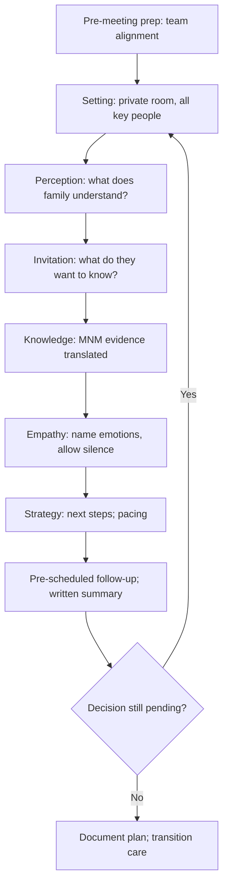

<Callout type="reference">
**Acronyms used on this page**

- **MNM / MMM**: multimodal neuromonitoring / multimodal monitoring
- **HIE**: hypoxic-ischaemic encephalopathy
- **TBI**: traumatic brain injury
- **PICU**: paediatric intensive care unit
- **WLST**: withdrawal of life-sustaining therapy
- **DCD**: donation after circulatory death
- **NPi**: neurological pupil index
- **cEEG / aEEG**: continuous EEG / amplitude-integrated EEG
- **TCD**: transcranial Doppler
- **NIRS / rSO2**: near-infrared spectroscopy / regional cerebral oxygen saturation
- **MRI**: magnetic resonance imaging
- **SSEP**: somatosensory evoked potentials
- **GCS / FOUR**: Glasgow Coma Scale / Full Outline of UnResponsiveness
- **CPR**: cardiopulmonary resuscitation
- **AHA**: American Heart Association
- **SPIKES / NURSE**: communication frameworks (Setting, Perception, Invitation, Knowledge, Empathy, Strategy / Naming, Understanding, Respecting, Supporting, Exploring)
</Callout>

<TldrCard>
**The 60-second version.** Three conversations dominate the family-communication landscape in paediatric neurocritical care: (1) HIE prognosis after cooling; (2) brain-death disclosure; (3) goals-of-care and withdrawal-of-life-sustaining-therapy. Each draws on multimodal evidence (cEEG continuity, MRI patterns, TCD waveforms, NPi trajectory, clinical exam) and each is a high-stakes communication moment where the wrong word, the wrong rhythm, or the wrong framing causes harm that lasts. The Meert 2015 palliative care work in PICU established the importance of structured conversation; the AHA 2021 pediatric post-arrest guideline anchors the prognostic timing question. The principles: be honest about uncertainty without retreating into vague hedging; pace the conversation across multiple meetings; translate MNM evidence into observable bedside changes the family can witness; ask the family what they want to understand before delivering a prepared script; offer hope where it exists, withhold false reassurance.
</TldrCard>

## 1. Three patient vignettes

### Vignette A. The HIE prognosis conversation, day 5

Asanga, **3 days old, term, 3.4 kg**, severe HIE after a placental abruption. Cooled to 33.5 C for 72 h, completed rewarming yesterday. Day 5 MRI: extensive cortical and basal ganglia injury with restricted diffusion in the thalamus and posterior limb of the internal capsule. cEEG over the cooling and rewarming period showed a discontinuous to burst-suppression background that never returned to continuous. Clinical exam: no spontaneous movement, no response to pain, no suck or root, pupils 3 mm sluggish bilaterally. The family meeting today involves both parents and the maternal grandmother. **Question: what is the conversation, what evidence is presented, and what are the next decision points the family is being asked to consider?** <Cite id="shankaran2005hie_nichd" /> <Cite id="topjian2021aha_pediatric" />

### Vignette B. Brain death disclosure in a 13-year-old

Aliyah, **13 years, 48 kg**, severe TBI from a motor vehicle accident, day 5. Pentobarbital infusion was discontinued 36 h ago for washout. Today's clinical exam meets brain-death criteria: no brainstem reflexes, no cough or gag, no response to pain, apnoea test positive (PaCO2 risen from 40 to 64 with no respiratory effort). Ancillary TCD showed reverberating flow. The family was informed yesterday that the exam was being performed. **Question: how is the diagnosis communicated to the family today; what role do the ancillary tests play; what are the next conversations (organ donation, when to discontinue ventilation)?** <Cite id="greer2020_braindeath" /> <Cite id="nakagawa2011peds_bd" />

### Vignette C. The WLST conversation in a complex multi-organ patient

Mateo, **7 years, 24 kg**, severe TBI day 8 with refractory raised ICP, decompressive craniectomy day 3, post-craniectomy infection, refractory shock requiring three vasopressors, anuric on CRRT. The neurosurgical team is unable to offer further intervention. cEEG shows electrocerebral silence. NPi 0.4 bilaterally. MRI shows extensive cortical and brainstem injury. The family meeting tonight will introduce the consideration of redirecting goals of care. **Question: how is this conversation structured; how does the MNM evidence support the recommendation; how is the family supported through the decision?** <Cite id="meert2015_palliative_care" />

---

## 2. The clinical question

For each of these families: **how do we communicate complex MNM evidence honestly, support decision-making without coercing it, and pace the conversation across the days that the decision requires?**

---

## 3. Background

Family communication in paediatric neurocritical care has been studied formally since the early 2000s. Three principles emerge consistently across the literature.

**First, families want honesty about uncertainty.** Vague hedging ("only time will tell", "we will have to see") is heard as evasion. Specific honesty ("the MRI shows that areas of the brain that control movement and awareness are damaged; we cannot know exactly how this will affect Asanga in five years, but the patterns we see now make us worried about significant difficulties") is heard as professional candour. <Cite id="meert2015_palliative_care" />

**Second, families need pacing.** Decisions made under acute distress are made differently than decisions made with time to absorb information. The first conversation introduces the evidence; the second clarifies what is being asked of the family; the third invites them to share what they understand and what they wish for. Most families need at least three conversations spread across days to settle into a coherent decision.

**Third, the MNM evidence is most useful when translated into bedside-observable changes.** A graph of NPi over time is more useful than the abstract concept of "the brainstem reflexes are absent". An MRI image showing the affected areas is more useful than a verbal description. The family who can see the evidence is the family who can participate in the decision. The cEEG showing a flat trace next to a healthy trace is a powerful visual; use it where appropriate.

**Why MNM evidence in particular matters.** Family decisions about prognosis and goals of care turn on confidence in the evidence presented. MNM evidence (cEEG continuity, MRI patterns, TCD waveforms, NPi, NIRS asymmetry) provides multiple independent lines pointing toward or away from a prognosis. Concordant evidence is more compelling than any single test. Discordant evidence is itself information, and is honestly presented as such. The 2021 AHA paediatric post-arrest guideline anchors the prognostic timing question: definitive prognostication should not be attempted before 24 hours, is most reliable at 72 hours to 5 days, and should incorporate multiple modalities. <Cite id="topjian2021aha_pediatric" /> <Cite id="naim2023_brain_injury_pccm" />

**Cultural and family-system considerations.** The decision-maker in the family may not be the parent in the room; cultural expectations about who speaks, who consents, and how news is delivered vary widely. Asking openly ("Is there anyone else who needs to be part of this conversation? Is there a way you prefer to receive difficult news?") is a small step that prevents large harms.

---

## 4. The multimodal picture

| Conversation type | Key MNM evidence | What the family is being asked |
|---|---|---|
| **HIE prognosis (day 5)** | MRI day 4 to 7 (most prognostic); cEEG continuity trajectory; clinical exam (Sarnat staging); NPi trend | To understand the prognosis; to consider goals of care |
| **Brain-death disclosure** | Clinical exam (brainstem reflexes, apnoea test); ancillary TCD or EEG when needed; complete documentation | To accept the diagnosis; to consider organ donation; to choose timing of ventilator discontinuation |
| **WLST in severe injury** | cEEG continuity; MRI extent; clinical trajectory; multi-organ status; NPi | To consider whether continuing treatment serves the child's interests |
| **Goals-of-care for chronic catastrophic disease** | Disease trajectory; functional assessment; cumulative reversible vs irreversible burden | To articulate what kind of life and care they hope for |

---

## 5. Conversation structures

<Figure
  src="/images/integration/family-communication-mnm/conversation-templates.svg"
  alt="Two-column communication template showing 'Say this' and 'Avoid this' phrasings for HIE prognosis, brain-death disclosure, and WLST conversations"
  caption="Two-column conversation templates: HIE prognosis, brain-death disclosure, and WLST. The left column shows preferred phrasings rooted in specific MNM evidence and honest uncertainty. The right column shows phrasings to avoid (vague hedging, false reassurance, coercive framing). The templates are starting points, not scripts; adapt to the family."
  attribution="MNM-Edu, adapted from Meert 2015 paediatric palliative care framework. SVG placeholder."
  label="Fig. 1"
/>

<AlgorithmDisclaimer />

---

## 6. Step-by-step conversation actions

For Asanga's HIE prognosis conversation (day 5 post-cooling). The structure follows SPIKES, adapted for paediatric multimodal evidence.

1. **Pre-meeting team alignment (15 min before).** The intensivist, neonatologist (or paediatric neurologist), bedside nurse, and (where available) palliative care representative meet briefly to agree on (a) the prognosis being communicated, (b) the MNM evidence being shown, (c) who is leading, (d) what the family is being asked to consider, (e) the next meeting time.
2. **Setting (find the right room).** Private space with chairs for everyone. Tissues. A computer or tablet to show MRI images if appropriate. Pager off, no interruptions. Allocate 45 to 60 minutes minimum.
3. **Perception (what does the family understand?).** Open with: "Tell me what you understand about Asanga's situation right now." Listen. The gap between what the family knows and what you need to communicate informs the rest of the conversation.
4. **Invitation (what do they want to know?).** "What would be most helpful for you to understand from us today?" Some families want detailed evidence; some want the bottom line; some want both. Ask, do not assume.
5. **Knowledge (deliver the evidence in plain language).** "The MRI yesterday shows that there is damage in several parts of Asanga's brain, including areas that control awareness and movement." Show the image if appropriate, pointing gently to the affected regions. "The cEEG, which is a brainwave monitor, has not shown the kind of activity we hope to see by this point after birth." Pause. Translate the NPi trend into observable terms.
6. **Empathy (name the emotion, allow silence).** "This is very hard to hear." Pause. Silence is the right response to weeping or stunned silence; do not fill the space with more information.
7. **Strategy (what is the next step?).** "We are going to continue to support Asanga today and tomorrow. We would like to meet again on (day) when we can talk about what the next days might look like and what is most important to you." Be specific about the next meeting; do not leave it open.
8. **Document (in the chart and on a single-page family summary).** What was discussed, who was present, what evidence was shared, what the family said, what the next step is. The single-page family summary is something the family can take with them.
9. **Pre-schedule the next meeting.** Within 24 to 48 hours, depending on the trajectory.
10. **Notify the rest of the team** of the agreed pacing and decisions, so that bedside conversations are coherent with the family meeting.

For brain-death disclosure (Aliyah), the structure is similar but the strategy step includes the next decision (organ donation discussion, timing of ventilator discontinuation) and the perception step often involves correcting misunderstanding ("but she is still breathing on the machine; how can she be dead?"). Brain-death disclosure is best done by the team that did the exam, with a nurse and (where available) social worker or chaplain in the room, with time allocated for the family to be at the bedside afterward.

For WLST (Mateo), the strategy step is the most carefully paced. The recommendation to redirect goals of care is a *recommendation*, not an instruction; the family makes the decision and the team supports it, whichever way it goes. Time-limited trials of further treatment with pre-defined endpoints are an option if the family is uncertain.

---

## 7. Conversation principles and what to avoid

**Principles:**
- **Be specific about evidence.** Not "the brain is severely injured" but "the MRI shows damage in these specific areas, which control these specific functions".
- **Be specific about uncertainty.** Not "only time will tell" but "we cannot predict exactly how this will affect Asanga at age 5; what we can say is that the patterns we see make us worried about significant difficulties in walking and communicating".
- **Use the family's words.** If they call the child by name, you call the child by name. If they refer to the brain damage as "the injury", use the same word.
- **Pace.** Most families need at least three meetings to settle.
- **Offer hope where it exists.** If the prognosis is uncertain, say so. If there is hope for meaningful recovery, name it. False hope harms; appropriate hope sustains.
- **Withhold false reassurance.** "He'll be fine" is not a phrase to use when MNM evidence suggests otherwise.

**What to avoid:**
- **Vague hedging** that the family hears as evasion ("we don't know"; "we'll have to see"; "every patient is different").
- **Coercive framing** ("you wouldn't want her to suffer, would you?"). The family makes the decision; the team supports it.
- **Premature prognostication.** Prognosis at 24 hours is less reliable than at 72 hours to 5 days. Wait when you can wait. <Cite id="topjian2021aha_pediatric" />
- **Delivering bad news to one parent without the other present** (unless the family has explicitly arranged otherwise).
- **Disagreeing among the team in front of the family.** Resolve disagreements in the team meeting before the family meeting.
- **Forgetting siblings.** Siblings need age-appropriate explanation and inclusion.

---

## 8. Variant subsections

### 8.1 The post-cardiac-arrest prognosis conversation

In the cooled post-arrest child, the AHA 2021 pediatric guideline recommends that definitive prognostication not be attempted before 24 hours, and that the most reliable prognostic window is 72 hours to 5 days after rewarming. Multimodal evidence (cEEG continuity, MRI day 5 to 7, NPi trajectory, clinical exam) is integrated; no single modality is sufficient. The family conversation pacing follows the prognostic timing: an initial conversation about the situation and the cooling protocol, a second around rewarming, a third around prognostication after MRI. <Cite id="topjian2021aha_pediatric" /> <Cite id="moler2015thapca_oh" /> <Cite id="naim2023_brain_injury_pccm" />

### 8.2 The new-onset RSE / FIRES conversation

A previously well child with febrile-prodrome refractory SE that becomes super-refractory. The family transitions from "she had a fever" to "she is in a medically induced coma" over 48 hours. The communication is paced: first conversation introduces the diagnosis (refractory status); second introduces SRSE; third (if it gets there) introduces the longer-term uncertainty and the possible recovery trajectory (which is often substantial in FIRES, with months of recovery time). The MNM evidence (cEEG, MRI evolution) anchors the pacing.

### 8.3 The chronic disease decompensation conversation

A child with chronic mitochondrial disease (Leigh syndrome) admitted with acute decompensation. The family is experienced with the disease; the conversation is not introducing the diagnosis but rather updating the trajectory. The question is often "what kind of life is good enough" rather than "what is wrong". Goals-of-care conversations may have started months ago; this admission is a chapter, not the whole book. <Cite id="parikh2017_mito_consensus" /> <Cite id="wedatilake2013_leigh" />

### 8.4 The brain-death conversation with cultural variation

Brain-death acceptance varies across cultures, religions, and individual families. In some communities, ventilator discontinuation after brain death is rapid; in others, families request continued ventilation for hours to days while extended family arrive. Honest disclosure of the diagnosis is independent of the family's response; the team supports the family's processing time within reasonable limits. The Greer 2020 World Brain Death Project framework includes cultural considerations explicitly. <Cite id="greer2020_braindeath" />

### 8.5 The DCD conversation

When brain-death criteria are not met but WLST is being considered, donation after circulatory death (DCD) may be discussed. The conversation about DCD is *separated* from the conversation about WLST: the WLST decision is made first, on its own terms; the DCD option is introduced afterward by a separate team (organ retrieval coordinator), explicitly to avoid coercion. The MNM evidence supporting the WLST recommendation is the same evidence that would be discussed in the WLST conversation; DCD is a downstream decision. <Cite id="meert2015_palliative_care" />

### 8.6 The conversation with the family of a survivor with severe disability

Not all conversations are about prognostication or end-of-life. The child who survives severe TBI with profound disability requires a different conversation: about the long-term care trajectory, the family's resources, what support is available, what decisions remain. The MNM evidence (the trajectory of NPi, cEEG, MRI, clinical exam) supports the family's understanding of the trajectory.

---

## 9. Multimodal integration matrix

| Pair | What you communicate | Worked scenario |
|---|---|---|
| **MRI + cEEG** | Anatomic injury plus functional state; powerful concordant evidence when both are severe | HIE day 5 prognosis |
| **NPi + clinical exam** | Quantified brainstem function; supports brain-death and WLST conversations | Brain-death disclosure |
| **TCD + clinical exam** | Cerebral haemodynamic status; ancillary brain-death testing | Brain-death exam where apnoea test is contraindicated |
| **cEEG + clinical trajectory** | Day-on-day change in cortical function; supports prognostic conversations | Post-arrest day 3 versus day 5 |
| **NIRS + clinical exam** | Tissue perfusion-extraction balance; useful for autoregulation-related conversations | The discordance scenario in sepsis |
| **All modalities + time** | Trajectory across hours and days is the most powerful evidence | Pacing the WLST conversation |

---

## 10. Worked alternative scenarios

### 10.1 What if the family wants more time after a brain-death disclosure?

Reasonable requests for time (hours to a small number of days) to allow extended family to arrive are accommodated within local hospital policy. Brain death is a determination of death; the body is being ventilated post-mortem during this period. The communication is clear about this distinction: continuing ventilation is for the family's process, not for the child (who is now deceased). Some jurisdictions limit this period; others are flexible.

### 10.2 What if the family rejects the prognostic evidence?

Rejection of evidence is not a failure of communication; it is a stage of grief. The team continues to support the family with consistent honest evidence, paced across multiple meetings. Bringing in trusted second opinions (another senior intensivist, neurology, palliative care, chaplaincy) may help. Time often does the work that no single conversation can do.

### 10.3 What if family members disagree?

Family disagreement about the decision is common. The team's role is to provide consistent evidence and to support the family's own decision-making process, not to mediate the family's internal conflict (unless asked to). Social work, chaplaincy, or family meetings with a trained facilitator may help. When the disagreement persists and a decision is required, hospital ethics committees can provide guidance.

---

## 11. Outcome data

- **Meert 2015 paediatric palliative care in PICU:** structured conversation, family-team consistency, and pacing across multiple meetings are associated with reduced family distress and improved decision-making confidence in PICU end-of-life care. <Cite id="meert2015_palliative_care" />
- **AHA 2021 pediatric post-arrest:** definitive prognostication should not be attempted before 24 hours; multimodal evidence integration is recommended; 72 hours to 5 days is the most reliable prognostic window. <Cite id="topjian2021aha_pediatric" />
- **THAPCA out-of-hospital trial (Moler 2015):** the absence of a survival benefit from hypothermia in paediatric out-of-hospital cardiac arrest is part of the prognostic conversation; cooling does not guarantee good outcome but is part of standard care. <Cite id="moler2015thapca_oh" />
- **Naim 2023 brain injury after pediatric arrest:** seizure burden correlates with outcome; this informs the conversation about cEEG monitoring and seizure treatment. <Cite id="naim2023_brain_injury_pccm" />
- **Brain-death determination (Greer 2020 World Brain Death Project):** standardised approach including cultural considerations; ancillary testing role defined. <Cite id="greer2020_braindeath" />
- **Pediatric brain-death (Nakagawa 2011 SCCM and AAP):** dual examination requirement, observation periods by age, apnoea test specifics. <Cite id="nakagawa2011peds_bd" />
- **Pediatric MMM consensus (Figaji 2025):** addresses communication of multimodal evidence as part of the consensus recommendations. <Cite id="figaji2025_mmm_pediatric_consensus" />

---

## 12. Pitfalls

- **Bringing too many people to the meeting.** Large team meetings can be intimidating; aim for the smallest core needed (intensivist, bedside nurse, palliative or social work, family).
- **Reading from a script.** The conversation is responsive; the template is a starting point only.
- **Avoiding the word "death" or "dying"** when those words are accurate. Euphemisms ("not going to make it", "passed") are sometimes appropriate but can be confusing; clarity is kindness.
- **Pacing too fast.** Decisions made in the first conversation are often regretted; pacing supports better decision-making.
- **Pacing too slow.** Prolonged uncertainty has its own harms; clear next-meeting timing helps.
- **Forgetting the bedside nurse.** The nurse who has been with the family for days has more context than any consultant; brief them and include them.
- **Disagreeing in front of the family.** Resolve in pre-meeting; present a consistent recommendation.
- **Disregarding cultural and religious context.** Ask, do not assume; some communities make decisions collectively, some via a specific elder or religious advisor.
- **Forgetting siblings.** Siblings need age-appropriate explanation; child-life specialists are invaluable where available.

---

## 13. Pediatric considerations

<Pediatric>
**Pediatric family communication has distinct features.**

- **The decision-maker is rarely the patient.** The child's voice (where age-appropriate) is part of the conversation but the decision belongs to the parents or guardians.
- **Parental decision-making is asymmetric.** Both parents may not be in the room or in agreement; the conversation pacing accommodates this.
- **Siblings need their own age-appropriate communication.** Child-life specialists, school liaisons, and family-support workers help.
- **Grandparents often play a major role** in decision-making, particularly in some cultural contexts.
- **The hospital chaplaincy** is a resource regardless of family religion; trained chaplains support secular families effectively.
- **Bereavement support** continues after discharge or death; structured follow-up at 6 weeks, 3 months, and 12 months is standard in many paediatric units.
- **MNM evidence presentation** must be in lay terms. The MRI image showing affected areas is powerful; the cEEG continuity trace can be shown; the NPi trend graph is concrete; numbers without translation are not useful.
- **Documentation matters.** Single-page family summaries after each meeting; copies to the family if they wish.
</Pediatric>

---

## 14. Combine with

- [Integration: Brain-death MNM](/integration/brain-death-mnm/): the ancillary testing pathway.
- [Integration: WLST and organ donation](/integration/wlst-organ-donation/): the DCD pathway and conversation separation.
- [Integration: HIE post-arrest](/integration/mnm-in-the-newborn/): the prognostic timing for cooled children.
- [Integration: Refractory status epilepticus](/integration/refractory-status-epilepticus/): family conversations during prolonged ICU stays.
- [EEG / aEEG modality page](/modalities/eeg/): the visual evidence for cEEG continuity in family conversations.
- [Pupillometry / NPi page](/modalities/pupillometry/): the trend graph for brainstem function.
- [Foundations: prognostic timing](/foundations/prognostic-timing/): when the evidence is reliable.

---

<DeepDive>

## 15. Evidence summary

| Topic | Source | Grade |
|---|---|---|
| Pediatric palliative care in PICU | <Cite id="meert2015_palliative_care" /> | expert |
| AHA pediatric post-arrest care | <Cite id="topjian2021aha_pediatric" /> | expert |
| THAPCA out-of-hospital | <Cite id="moler2015thapca_oh" /> | A |
| Brain injury after pediatric arrest | <Cite id="naim2023_brain_injury_pccm" /> | review |
| Brain death (World Brain Death Project) | <Cite id="greer2020_braindeath" /> | expert |
| Pediatric brain death (Nakagawa 2011) | <Cite id="nakagawa2011peds_bd" /> | expert |
| Pediatric MMM consensus | <Cite id="figaji2025_mmm_pediatric_consensus" /> | expert |
| Pediatric MMM update | <Cite id="helbok2024_pediatric_mmm" /> | review |
| HIE NICHD hypothermia trial | <Cite id="shankaran2005hie_nichd" /> | A |
| Mitochondrial disease (Parikh 2017) | <Cite id="parikh2017_mito_consensus" /> | expert |
| Leigh syndrome natural history | <Cite id="wedatilake2013_leigh" /> | C |
| ACNS cEEG indications (for evidence presentation) | <Cite id="herman2015acns_ceeg" /> | expert |
| Pediatric pupillometry | <Cite id="freeman2020_pediatric_pupil" /> | C |
| ICU NPi (Oddo 2018) | <Cite id="oddo2018_npi_orange" /> | B |

## 16. Recent literature (2022 to 2025)

- **Family-centred prognostic conversation studies** continue to emphasise pacing and multimodal evidence presentation. <Cite id="meert2015_palliative_care" /> (still the reference standard; 2022 to 2025 work extends this).
- **AHA 2021 pediatric guideline** anchors the prognostic timing question. <Cite id="topjian2021aha_pediatric" />
- **Naim 2023 PCCM** addresses the seizure-outcome relationship, informing family conversations about cEEG-detected seizures. <Cite id="naim2023_brain_injury_pccm" />
- **Helbok 2024 paediatric MMM update** discusses the importance of communicating multimodal evidence to families in plain language. <Cite id="helbok2024_pediatric_mmm" />
- **Pediatric MMM consensus (Figaji 2025)** explicitly addresses the role of evidence communication in multidisciplinary care. <Cite id="figaji2025_mmm_pediatric_consensus" />
- **Bereavement support models** are increasingly standardised in paediatric units, with structured 6-week, 3-month, and 12-month follow-up.

</DeepDive>

---

## 17. Self-check

<Quiz
  questions={[
    {
      id: 'q1',
      prompt: 'Asanga, day 5 after severe HIE and 72 h cooling. Day 5 MRI shows extensive cortical and basal ganglia injury. cEEG never returned to continuous background. Clinical exam shows no response to pain, no suck or root, sluggish pupils. Per the AHA 2021 pediatric guideline and current best practice, when is the most reliable prognostic window for a conversation with the family?',
      options: [
        { id: 'a', label: 'Within the first 24 hours after the arrest' },
        { id: 'b', label: 'Immediately after rewarming' },
        { id: 'c', label: 'Approximately 72 hours to 5 days, integrating multiple modalities' },
        { id: 'd', label: 'Wait until 30 days post-injury' },
      ],
      answer: 'c',
      explanation: 'The AHA 2021 pediatric post-arrest guideline recommends that definitive prognostication not be attempted before 24 hours and that the most reliable window is 72 hours to 5 days post-rewarming, integrating multiple modalities (cEEG continuity, MRI, NPi, clinical exam). Prognostication earlier is unreliable; delay beyond 5 to 7 days adds little.',
    },
    {
      id: 'q2',
      prompt: 'Aliyah, 13 y, has met brain-death criteria. The family arrives and asks "but she is still breathing on the machine; how can she be dead?" What is the most appropriate response?',
      options: [
        { id: 'a', label: 'Explain that the ventilator is breathing for her, but her brain has irreversibly stopped functioning; offer to walk through the exam findings and the ancillary TCD evidence' },
        { id: 'b', label: 'Tell them the diagnosis is correct and ask them to accept it' },
        { id: 'c', label: 'Defer the conversation to neurology' },
        { id: 'd', label: 'Avoid the word "dead" until they understand' },
      ],
      answer: 'a',
      explanation: 'The misunderstanding (the family equates breathing with being alive) is one of the most common in brain-death disclosure. The appropriate response is patient explanation: the ventilator is delivering breaths, but the brain that would normally drive breathing has irreversibly stopped functioning. Walking through the exam findings (the absent brainstem reflexes, the apnoea test, the ancillary TCD showing reverberating flow) supports understanding. Avoiding the word "dead" is unhelpful long-term; clarity is kindness.',
    },
    {
      id: 'q3',
      prompt: 'Mateo, 7 y, severe TBI with refractory raised ICP, post-decompressive craniectomy infection, anuric on CRRT, electrocerebral silence on cEEG. The team is considering recommending WLST. The family has not yet been approached about organ donation. When is the appropriate time to introduce DCD as an option?',
      options: [
        { id: 'a', label: 'In the same conversation as the WLST recommendation, to streamline decisions' },
        { id: 'b', label: 'After the WLST decision is made, by a separate team (organ retrieval coordinator) to avoid coercion' },
        { id: 'c', label: 'Before the WLST conversation, so the family knows their options' },
        { id: 'd', label: 'Only after withdrawal has been initiated' },
      ],
      answer: 'b',
      explanation: 'The standard recommendation is to separate the WLST conversation from the DCD conversation, with the DCD discussion led by a separate team (organ retrieval coordinator) after the WLST decision is made on its own terms. This prevents the perception that the WLST recommendation is motivated by organ availability, and supports the family in making each decision freely. Variations exist in some jurisdictions but the principle of conversation separation is consistent.',
    },
  ]}
/>
