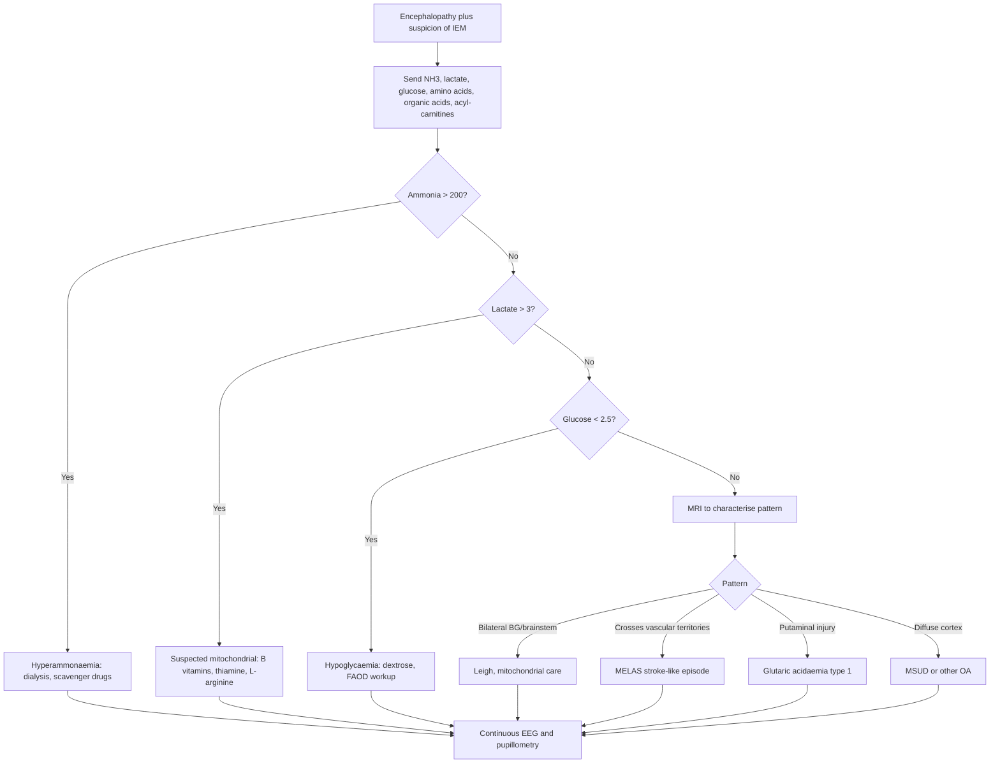

<Callout type="reference">
**Acronyms used on this page**

- **IEM**: inborn error of metabolism
- **MELAS**: mitochondrial encephalomyopathy, lactic acidosis, stroke-like episodes
- **MERRF**: myoclonic epilepsy with ragged red fibres
- **POLG**: polymerase-gamma (mitochondrial DNA polymerase) gene
- **OXPHOS**: oxidative phosphorylation
- **CSF**: cerebrospinal fluid
- **L/P ratio**: lactate-to-pyruvate ratio (cerebral microdialysis or CSF)
- **MRS**: magnetic resonance spectroscopy
- **MRI / DWI / SWI**: magnetic resonance imaging / diffusion-weighted / susceptibility-weighted
- **cEEG / aEEG**: continuous EEG / amplitude-integrated EEG
- **NIRS / rSO2**: near-infrared spectroscopy / regional cerebral oxygen saturation
- **CMRO2 / CBF**: cerebral metabolic rate of oxygen / cerebral blood flow
- **ICP / CPP**: intracranial pressure / cerebral perfusion pressure
- **UCD**: urea cycle defect
- **OA**: organic acidaemia
- **VLCAD / MCAD**: very-long-chain / medium-chain acyl-CoA dehydrogenase deficiency
- **GA1**: glutaric acidaemia type 1
- **MSUD**: maple syrup urine disease
- **CHOP**: cyclophosphamide-doxorubicin (not used here; do not confuse with the hospital acronym)
- **PICU**: paediatric intensive care unit
- **NORSE / FIRES**: new-onset refractory SE / febrile infection-related epilepsy syndrome
</Callout>

<TldrCard>
**The 60-second version.** Acute encephalopathy in a child with an inborn error of metabolism is not the encephalopathy of TBI, sepsis, or post-arrest. The driver is the metabolic defect plus its precipitant (fever, fasting, infection, drug, surgery, anaesthetic). The MNM bundle differs: cEEG yields a high rate of electrographic seizures (mitochondrial disease in particular) that respond poorly to standard AEDs; NIRS rSO2 is often *high* with simultaneous L/P elevation (the brain cannot extract oxygen because the OXPHOS chain is broken); CSF or microdialysis lactate is the marker of cellular distress; MRI patterns are diagnostic for many subtypes (Leigh: bilateral basal ganglia and brainstem T2 hyperintensities; MELAS: cortical stroke-like lesions crossing vascular territories; GA1: bilateral putaminal injury). Specific therapies (B vitamin cocktails, carnitine, sodium benzoate for hyperammonaemia, dialysis for acute decompensation) matter more than ICP titration; standard AEDs are blunt instruments. Valproate is contraindicated in many mitochondrial disorders. Goal: rapid recognition, source-control of the precipitant, specific antidote where available, and supportive MNM-guided care.
</TldrCard>

## 1. Three patient vignettes

### Vignette A. Rafa, 18 months, Leigh syndrome decompensation

Rafa, **18 months, 11 kg**, six months of motor regression (lost the ability to sit). One week of febrile gastroenteritis; today admitted with diminished alertness, opisthotonic posturing, and intermittent stereotyped extensor movements. Lactate **5.4 mmol/L**, ammonia 60 micromol/L (normal), glucose 4.2. MRI: bilateral symmetric T2 hyperintensities in the putamen, caudate head, and dorsal pons. **Leigh syndrome** is the working diagnosis. cEEG shows multifocal periodic discharges with bursts of rhythmic activity. aEEG envelope is wide and chaotic. NIRS rSO2 is **88%** bilaterally (high, not low); SpO2 is 99%. **Question: this looks like a Leigh decompensation; what does the MNM bundle add and how does management diverge from standard PICU encephalopathy?** <Cite id="parikh2017_mito_consensus" /> <Cite id="wedatilake2013_leigh" />

### Vignette B. Asha, 6 weeks, urea cycle defect with hyperammonaemia

Asha, **6 weeks, 4.0 kg**, well at birth, presented today with poor feeding, lethargy, and tachypnoea. Glucose normal, ammonia **480 micromol/L**, blood gas with respiratory alkalosis and elevated anion gap. Suspected urea cycle defect (later confirmed as OTC deficiency). Intubated for airway protection. **Cerebral oedema** is the dominant secondary injury in acute hyperammonaemia; ammonia drives glutamate, glutamine, and astrocyte swelling. Bedside aEEG shows a discontinuous trace with no clear seizure activity. **Question: in hyperammonaemic coma, the immediate priorities are emergency dialysis, sodium benzoate, sodium phenylacetate, and arginine; what role does MNM play in monitoring oedema during ammonia clearance?** <Cite id="parikh2017_mito_consensus" />

### Vignette C. Diego, 11 years, MELAS stroke-like episode

Diego, **11 years, 38 kg**, known MELAS (m.3243A>G mtDNA mutation, diagnosed at 7). Two days of frontal headache, then sudden visual field defect and confusion. CT shows no haemorrhage. MRI: cortical and subcortical T2/FLAIR hyperintensity in the left parieto-occipital region **crossing vascular territories** (does not respect MCA-PCA boundaries). MRS over the lesion shows a prominent lactate peak. cEEG shows focal periodic discharges over the affected region. **Question: this is a MELAS stroke-like episode, not arterial occlusion; thrombolysis is contraindicated. What is the right monitoring bundle and what therapeutic options exist (L-arginine, citrulline, anti-seizure management)?** <Cite id="parikh2017_mito_consensus" />

---

## 2. The clinical question

For each of these children: **how do we recognise that an encephalopathy is metabolic rather than structural or infectious, what does the MNM bundle look like in metabolic disease, and which therapeutic levers belong to the IEM playbook rather than the PICU general-encephalopathy playbook?**

---

## 3. Pathophysiology refresher

Inborn errors of metabolism are a diverse group of single-gene disorders affecting catabolic and anabolic pathways. The acute encephalopathies cluster into a small number of mechanistic categories.

**Energy failure (mitochondrial disease and OXPHOS defects).** The OXPHOS chain is broken at one of its five complexes (or in mtDNA depletion syndromes, the entire chain is reduced in quantity). ATP production from glucose oxidation falls; the brain shifts to anaerobic glycolysis; lactate rises; CMRO2 is high but the cells cannot use the oxygen they receive. The bedside signature is **paradoxically high tissue oxygen saturation** (NIRS rSO2 high or normal) with simultaneously elevated CSF or microdialysis lactate. Areas of high baseline metabolism (basal ganglia, brainstem nuclei, cortex) are most vulnerable. The Leigh syndrome MRI pattern (bilateral symmetric T2 hyperintensities in deep gray) reflects this regional vulnerability. <Cite id="wedatilake2013_leigh" />

**Intoxication (organic acidaemias, urea cycle defects, MSUD).** A precursor metabolite or its derivative accumulates to neurotoxic levels. In urea cycle defects, ammonia drives glutamine accumulation in astrocytes and brain oedema. In MSUD, branched-chain amino acids and their ketoacids do similar work. In glutaric acidaemia type 1, glutaric acid and 3-hydroxyglutaric acid are neurotoxic to the striatum. The bedside signature is encephalopathy, sometimes seizures, sometimes oedema; the diagnosis is biochemical (ammonia, amino acids, organic acids, acyl carnitines).

**Reduced substrate (fatty acid oxidation defects, ketogenesis defects, hypoglycaemia syndromes).** During catabolic stress (fasting, fever, illness), the patient cannot generate enough substrate for the brain. Hypoglycaemia, hyperammonaemia, and rhabdomyolysis are the typical biochemical signatures. cEEG shows generalised slowing with breakthrough seizures.

**Why does MNM differ from standard ICU encephalopathy?**
- **NIRS rSO2 is unreliable as a perfusion proxy.** In OXPHOS defects, rSO2 may be high not because perfusion is adequate but because extraction is impaired. The NIRS-lactate correlation is the discriminator. <Cite id="davies2017nirs" />
- **cEEG seizures are common and refractory.** Mitochondrial disease has a high yield of electrographic seizures (50 to 70% in severely affected children); these respond poorly to standard AEDs. <Cite id="hirsch2021acns" /> <Cite id="herman2015acns_ceeg" />
- **Microdialysis (in centres with it) shows elevated L/P ratio (greater than 30) and elevated absolute lactate.** This is the cellular signature of failed mitochondrial respiration. <Cite id="hutchinson2015_md" />
- **MRI patterns are diagnostic** for many subtypes; the pattern guides which biochemical panel to send and which specific therapy to start.
- **Specific antidotes matter.** L-arginine for MELAS, sodium benzoate plus phenylacetate plus arginine for urea cycle defects, dialysis for severe hyperammonaemia, B vitamin cocktail for unspecified mitochondrial disease, thiamine 100 mg for any unexplained encephalopathy. <Cite id="parikh2017_mito_consensus" />
- **Drug avoidance matters.** Valproate is contraindicated in POLG mutations (fatal hepatotoxicity); some anaesthetics (sevoflurane) can trigger malignant hyperthermia-like crises in mitochondrial disease.

---

## 4. The multimodal picture

| Monitor | What it shows in IEM encephalopathy | What this rules in or out |
|---|---|---|
| **cEEG (full montage)** | Multifocal periodic discharges; focal or generalised seizures; burst-suppression with low background; in mitochondrial disease, rhythmic delta over basal ganglia or brainstem | Active electrographic seizures (yield 30 to 70%); pattern hints at substrate (mitochondrial vs hyperammonaemic) |
| **aEEG (reduced)** | Discontinuous or low-voltage trace; saw-tooth ictal envelope during seizures | Bedside trigger for cEEG review |
| **Clinical exam** | Pupil abnormalities (mitochondrial: small, sluggish, sometimes asymmetric); abnormal movements (dystonia, opisthotonos, stereotypies); altered tone | Pattern recognition for substrate |
| **NIRS rSO2** | Often *high* (60 to 90%) with poor extraction (mitochondrial); falls late with oedema; may be low in hyperammonaemic cerebral oedema | The NIRS-lactate discordance is informative |
| **CSF or microdialysis lactate** | Elevated (greater than 2.0 mmol/L CSF; greater than 3 to 5 mmol/L microdialysis) with elevated L/P (greater than 30) | Cellular distress; mitochondrial dysfunction (cellular) vs ischaemia (cellular plus high L/P) |
| **ICP (if placed)** | Usually normal in mitochondrial decompensation; elevated in hyperammonaemic cerebral oedema | Drives the urgency of dialysis in UCD |
| **Pupillometry NPi** | Often abnormal at baseline (mitochondrial); falling NPi flags progression | Baseline matters more than absolute value |
| **MRI / MRS** | Leigh: bilateral basal ganglia and brainstem T2; MELAS: cortical lesions crossing vascular territories; MRS lactate peak | Subtype identification; specific therapy guidance |
| **Ammonia, lactate, glucose, anion gap** | Elevated ammonia (UCD, OA, MCAD); elevated lactate (mitochondrial, OA); hypoglycaemia (FAOD, MCAD); raised anion gap (OA, mitochondrial) | The biochemical signature that triages within IEM |

---

## 5. Decision tree

<Figure
  src="/images/integration/inborn-errors-encephalopathy/leigh-mri.svg"
  alt="Leigh syndrome MRI schematic showing bilateral symmetric T2 hyperintensities in the putamen, caudate head, midbrain, and dorsal pons, with subtype contrasts for MELAS and GA1"
  caption="MRI pattern schematic. Leigh syndrome: bilateral symmetric T2/FLAIR hyperintensities in the putamen, caudate head, substantia nigra, periaqueductal gray, dorsal pons, and medullary olives. MELAS: cortical and subcortical T2/FLAIR hyperintensity crossing arterial territories, often parieto-occipital, with MRS lactate peak. GA1: bilateral putaminal injury with frontotemporal cortical atrophy. The pattern guides the biochemical panel and the specific therapy."
  attribution="MNM-Edu, original schematic. SVG placeholder."
  label="Fig. 1"
/>

<AlgorithmDisclaimer />

---

## 6. Step-by-step bedside actions

For Rafa (18 months, 11 kg, suspected Leigh decompensation). Times are from PICU admission.

1. **0 to 15 min: stabilise.** Airway, breathing, circulation. Glucose finger-prick (target 4 to 8 mmol/L). Avoid hypothermia and hyperpyrexia (both worsen mitochondrial dysfunction). Avoid valproate (POLG contraindication) and depolarising muscle relaxants (suxamethonium triggers malignant hyperthermia-like reactions in some mitochondrial disease).
2. **15 to 30 min: targeted biochemistry.** Send ammonia, lactate, pyruvate, blood gas with anion gap, glucose, electrolytes, liver function, creatinine kinase, plasma amino acids, urine organic acids, acyl carnitine profile, total and free carnitine. CSF for lactate, glucose, protein, cells. **Save extra plasma and CSF for later analysis.**
3. **30 to 60 min: empirical specific therapies based on biochemical pattern.**
   - **Hyperammonaemia (NH3 greater than 200):** sodium benzoate plus phenylacetate plus arginine HCl per UCD protocol; emergency dialysis if NH3 greater than 500 or rising; carnitine 100 mg/kg if organic acidaemia suspected.
   - **Suspected mitochondrial (lactate greater than 3, suggestive MRI):** thiamine 100 mg IV, riboflavin 100 mg, coenzyme Q10 100 mg, L-carnitine 100 mg/kg; biotin 10 mg if biotinidase deficiency is in the differential.
   - **Hypoglycaemia (glucose less than 2.5):** dextrose 10% 2 mL/kg bolus, then continuous infusion at 6 to 8 mg/kg/min; collect samples *before* the bolus (it disturbs the diagnostic biochemistry).
4. **30 to 60 min: get cEEG on.** Full-montage. Yield is high in mitochondrial disease. Reduced-channel aEEG is the bridge.
5. **30 to 60 min: MRI as soon as the patient is stable.** Include MRS over a representative lesion to look for lactate peak. DWI for acute MELAS stroke-like episode (restricted diffusion, often resolves over weeks unlike arterial stroke). SWI for haemorrhage.
6. **60 to 120 min: confirm or refine the diagnosis.** A pattern (Leigh, MELAS, GA1, UCD, MSUD) plus the biochemistry suggests a working diagnosis; arrange targeted genetic testing (PCR panel, mitochondrial DNA sequencing, whole-exome sequencing) and metabolic team consultation.
7. **Ongoing: NIRS interpretation.** Track rSO2 trends but do not interpret in isolation. Pair with lactate trend. A rising lactate with high rSO2 in mitochondrial decompensation is *not* reassurance; it is the metabolic crisis signature.
8. **Ongoing: cEEG-guided AED choice.** Levetiracetam, phenobarbital, lacosamide are reasonable first-line in mitochondrial disease. **Valproate is contraindicated** in POLG (test sent; assume positive until known otherwise). Avoid topiramate (CO2-driven cerebral effects).
9. **Ongoing: source control of the precipitant.** Fever (paracetamol; mechanical cooling); infection (cultures, empirical antibiotics if any concern); fasting (D10 infusion to prevent further catabolism).
10. **24 to 48 h: reassess.** If improving, slow wean of supportive therapy; continue specific therapy. If worsening, broaden the workup; consider dialysis if not already; review the AED stack.

---

## 7. Management ladder and endpoints

**Success looks like:** lactate falling toward 2; ammonia falling below 200; cEEG seizures controlled; aEEG envelope normalising; clinical exam improving (return of tone, eye opening, response to stimulation); MRI not progressing on day 3 to 5 follow-up.

**Failure looks like:** rising lactate despite specific therapy; persistent or worsening encephalopathy; new neurological deficit; MRI progression; uncontrolled electrographic seizures; multi-organ failure (liver, kidney).

**When to escalate:**
- Hyperammonaemic coma not responding to scavengers, dialysis (CRRT or intermittent haemodialysis).
- Status epilepticus, anaesthetic infusion (midazolam first; avoid valproate; pentobarbital for super-refractory).
- MELAS stroke-like episode in deterioration, L-arginine IV (100 to 500 mg/kg/day depending on age and centre), citrulline supplementation, consider experimental therapies.
- Refractory ICP rise in cerebral oedema, hyperosmolar therapy (hypertonic saline preferred over mannitol when oedema is osmotic in origin).

**When to de-escalate:**
- Lactate and ammonia normalised.
- cEEG seizure-free for 24 h.
- Patient transitioning out of crisis, oral or NG specific therapy resumed.
- Family conversation about long-term prognosis updated.

---

## 8. Variant subsections

### 8.1 Leigh syndrome and OXPHOS defects

Leigh syndrome is a clinical-radiological-biochemical phenotype, not a single gene; over 80 genes are associated. MRI signature: bilateral symmetric T2/FLAIR hyperintensities in basal ganglia, brainstem nuclei, and midbrain. Lactate elevated in plasma, CSF, and MRS. cEEG shows multifocal periodic discharges. Treatment: B vitamin cocktail (thiamine, riboflavin, coenzyme Q10, biotin, carnitine); avoid mitochondrial-toxic drugs; specific therapies for known mutations (e.g., dichloroacetate for PDH deficiency). Prognosis: median survival 5 to 10 years with active care; mode of death is usually a respiratory or autonomic crisis. <Cite id="wedatilake2013_leigh" /> <Cite id="parikh2017_mito_consensus" />

### 8.2 MELAS

Maternally inherited m.3243A>G mutation (80%) or other mtDNA mutations. Presentation: stroke-like episodes that cross vascular territories, often with hemianopia or focal seizures. MRI: cortical and subcortical T2/FLAIR hyperintensity; DWI restricted (acute) often resolves over weeks (unlike arterial stroke); MRS lactate peak. Treatment: **L-arginine IV 0.5 g/kg/day** (or 500 mg/kg/day for hospitalised acute crisis per Japanese consensus); citrulline; reasonable AED control; supportive care. Thrombolysis is contraindicated (no thrombus to lyse). Recurrence is the rule; long-term L-arginine maintenance reduces frequency. <Cite id="parikh2017_mito_consensus" />

### 8.3 Urea cycle defects

OTC deficiency (X-linked, most common), CPS1, ASS1 (citrullinaemia), ASL, ARG1. Presentation depends on severity and timing. Neonatal-onset is the most severe; later presentations are often triggered by catabolic stress, high protein intake, or drugs (valproate). The acute pathway is the same regardless of subtype: **stop protein, give dextrose, sodium benzoate plus phenylacetate plus arginine HCl, dialysis if NH3 greater than 500 or rising**. NIRS may show falling rSO2 with rising ICP in cerebral oedema. cEEG: generalised slowing, breakthrough seizures with high ammonia. <Cite id="parikh2017_mito_consensus" />

### 8.4 Organic acidaemias

Methylmalonic acidaemia (MMA), propionic acidaemia (PA), isovaleric acidaemia (IVA), 3-methylcrotonyl-CoA carboxylase deficiency. Presentation: metabolic acidosis, hyperammonaemia, encephalopathy. Treatment: stop protein, IV dextrose, carnitine 100 mg/kg, B12 (specifically for MMA), biotin (for some), dialysis for severe acidosis or hyperammonaemia. cEEG often shows generalised slowing with seizures during decompensation. Long-term: protein restriction, carnitine, B vitamins, metabolic team follow-up.

### 8.5 Glutaric acidaemia type 1 (GA1)

Glutaric acid and 3-hydroxyglutaric acid accumulation; striatal neurotoxicity during catabolic crises (typically before age 6). Presentation: acute dystonia after a febrile illness, with bilateral putaminal MRI injury. Prevention: protein restriction (low lysine and tryptophan), carnitine, prompt management of intercurrent illness with high-calorie fluids. Acute management: stop protein, IV glucose, carnitine 200 mg/kg, intensive support to prevent striatal injury (the window for prevention is in the first 6 to 24 h of the crisis).

### 8.6 Maple syrup urine disease (MSUD)

Branched-chain amino acid accumulation (leucine, isoleucine, valine). Neonatal onset: poor feeding, lethargy, ketosis with sweet-smelling urine, opisthotonos. Treatment: stop protein, IV glucose plus insulin, branched-chain-free amino acid formula, dialysis for severe encephalopathy. Long-term: BCAA-restricted formula, intensive metabolic care during illness. cEEG may show distinctive "comb-like" rhythm at the height of decompensation.

---

## 9. Multimodal integration matrix

| Pair | What you gain | Worked scenario |
|---|---|---|
| **cEEG + biochemistry** | Confirms electrographic seizures; correlates seizure burden with ammonia or lactate trend | Hyperammonaemic UCD with breakthrough seizures |
| **cEEG + NIRS** | NIRS rSO2 trend separates mitochondrial (high rSO2 with seizures) from hyperammonaemic (falling rSO2 with oedema) | The discriminator scenario |
| **MRI + MRS** | Anatomic pattern plus lactate peak; specific diagnosis | MELAS versus arterial stroke |
| **Lactate (CSF or MD) + NIRS** | Cellular distress plus tissue oxygen; mitochondrial = high lactate + high rSO2; ischaemia = high lactate + low rSO2 | The OXPHOS discriminator |
| **Pupillometry + clinical exam** | Baseline pupillometry in chronic disease; trend with acute deterioration | Rafa, the Leigh decompensation |
| **cEEG + ICP** | Seizures driving ICP rises in hyperammonaemic oedema; treat both | Severe UCD in cerebral oedema |

---

## 10. Worked alternative scenarios

### 10.1 What if the lactate is high but there is no IEM?

A 4-year-old with septic shock has a lactate of 6 and encephalopathy. Sepsis-driven hypoperfusion produces a high L/P with low rSO2 (the perfusion-extraction signature). Mitochondrial disease produces high L/P with high or normal rSO2 (the extraction signature). The discriminator is the haemodynamic context and the response to resuscitation: sepsis lactate falls with fluid plus vasopressor; mitochondrial lactate does not.

### 10.2 What if the MRI is normal early?

In MELAS, the DWI restriction can be subtle in the first 24 to 48 h; repeat MRI at 3 to 5 days often shows the full extent. In Leigh syndrome, the MRI can be normal in the first few years of life; repeat imaging over months shows the bilateral symmetric T2 progression. A normal MRI does not exclude an IEM; the biochemistry and the genetics do.

### 10.3 What if the diagnosis is autoimmune encephalitis?

Acute encephalopathy with seizures in a previously well child has a broad differential. Anti-NMDA encephalitis presents with behavioural change, movement disorder, and seizures; MRI is often normal or shows mesial temporal T2 changes. CSF anti-NMDA antibody is diagnostic; treatment is immunotherapy. The MNM bundle is similar to NORSE/FIRES (early ketogenic diet, anaesthetic infusion to cEEG endpoint). Send the antibody panel in parallel with the IEM workup; the two differentials are not mutually exclusive.

---

## 11. Outcome data

- **Parikh 2017 mitochondrial medicine consensus**: B vitamin cocktails are recommended; specific evidence for any single agent is sparse; avoid mitochondrial-toxic drugs (valproate in POLG, propofol prolonged infusion, sevoflurane in known sensitivity). <Cite id="parikh2017_mito_consensus" />
- **Wedatilake 2013 Leigh syndrome**: median survival 5 to 10 years in modern series with active care; mode of death is often respiratory or autonomic; cardiac involvement is a major prognostic factor. <Cite id="wedatilake2013_leigh" />
- **cEEG yield in mitochondrial disease**: case series suggest electrographic seizure detection in 30 to 70% of children with mitochondrial disease who undergo cEEG during decompensation. <Cite id="herman2015acns_ceeg" /> <Cite id="hirsch2021acns" />
- **NIRS in mitochondrial disease**: published case series describe paradoxically elevated rSO2 with elevated lactate during decompensation; the NIRS-lactate discordance is the bedside flag. <Cite id="davies2017nirs" />
- **Microdialysis L/P ratio**: in TBI and SAH, L/P greater than 30 to 40 marks cellular distress; in mitochondrial disease, L/P is typically elevated chronically and rises further during decompensation. <Cite id="hutchinson2015_md" />
- **Hyperammonaemic encephalopathy outcomes**: severity and duration of ammonia elevation correlate with neurological outcome; early dialysis improves outcomes in neonates with NH3 greater than 500 micromol/L. <Cite id="parikh2017_mito_consensus" />

---

## 12. Pitfalls

- **Treating high NIRS rSO2 as adequate perfusion in mitochondrial disease.** Extraction is the problem, not delivery; the brain cannot use the oxygen it has.
- **Using valproate in suspected mitochondrial disease.** POLG-related hepatotoxicity is fatal; default to levetiracetam, phenobarbital, or lacosamide.
- **Forgetting the diagnostic samples before specific therapy.** Once dextrose or carnitine is given, the metabolic snapshot is lost. Send the panel first; act second.
- **Missing the MELAS pattern as arterial stroke.** Crossing vascular territories, MRS lactate peak, and chronic presentation distinguish MELAS from acute arterial stroke. Thrombolysis is contraindicated.
- **Believing AEDs alone will control seizures in IEM.** Source control of the metabolic crisis (dextrose, dialysis, scavengers) usually does more than any AED.
- **Ignoring fever, infection, and fasting.** These are the precipitants; ignoring them sustains the crisis.
- **Anaesthetic choice in mitochondrial disease.** Avoid prolonged propofol (PRIS risk plus mitochondrial inhibition); avoid sevoflurane if malignant-hyperthermia-like sensitivity is known; midazolam and ketamine are generally acceptable.
- **Premature prognostication.** Many IEM crises that look catastrophic in the first 24 to 48 h recover substantially with specific therapy; defer family discussions about long-term outcome until biochemistry has settled and the genetic diagnosis is clear.

---

## 13. Pediatric considerations

<Pediatric>
**IEM is a pediatric specialty; the MNM bundle reflects that.**

- **Age-banded presentation matters.** Neonatal: UCD, MSUD, OA, fatty-acid-oxidation defects often present in the first week. Infants and toddlers: Leigh syndrome, GA1, MCAD often present 6 to 36 months with catabolic-stress decompensations. Older children: MELAS may first present in school age.
- **Specific drug doses are weight-banded** and small-volume IV preparations are needed in infants; pharmacy must be on the rota.
- **Dialysis access in neonates** can be difficult; CRRT is often used in PICU; older children may go to intermittent haemodialysis in the renal unit.
- **MRI under sedation** is often required; protect the airway and avoid mitochondrial-toxic anaesthetics.
- **Family-centred long-term care.** Most IEM are chronic genetic conditions; the acute decompensation is a chapter in a longer story. Multidisciplinary care (metabolic team, dietitian, genetics, neurology, palliative care) is essential.
- **Genetic counselling** for siblings and parents is part of the discharge plan.
- **Newborn screening** has changed presentation patterns for many IEMs (MCAD, MSUD, OA, biotinidase, PKU now picked up presymptomatically); the late-presenting cases are typically the ones missed by screening or with later-onset variants.
</Pediatric>

---

## 14. Combine with

- [EEG / aEEG modality page](/modalities/eeg/): full-montage versus reduced; ACNS nomenclature.
- [NIRS modality page](/modalities/nirs/): rSO2 interpretation in metabolic disease.
- [Cerebral microdialysis page](/modalities/microdialysis/): L/P ratio, glucose, glutamate, glycerol.
- [Integration: Refractory status epilepticus](/integration/refractory-status-epilepticus/): when the IEM seizures become RSE.
- [Integration: Family communication MNM](/integration/family-communication-mnm/): conversations about chronic genetic disease and acute crisis.
- [Foundations: cerebral metabolism](/foundations/cerebral-metabolism/): the OXPHOS chain, lactate, oxygen extraction.

---

<DeepDive>

## 15. Evidence summary

| Topic | Source | Grade |
|---|---|---|
| Mitochondrial medicine consensus | <Cite id="parikh2017_mito_consensus" /> | expert |
| Leigh syndrome natural history | <Cite id="wedatilake2013_leigh" /> | C |
| cEEG indications (ACNS pediatric) | <Cite id="herman2015acns_ceeg" /> | expert |
| ACNS standardised nomenclature | <Cite id="hirsch2021acns" /> | expert |
| NIRS in acute injury | <Cite id="davies2017nirs" /> | B |
| Cerebral microdialysis consensus | <Cite id="hutchinson2015_md" /> | expert |
| ESETT (for breakthrough SE) | <Cite id="glauser2016esett" /> <Cite id="kapur2019eclipse_se" /> | A |
| Pupillometry NPi | <Cite id="oddo2018_npi_orange" /> | B |
| Pediatric pupillometry | <Cite id="freeman2020_pediatric_pupil" /> | C |
| MMM consensus (general) | <Cite id="leroux2014_neurocrit_consensus" /> | expert |
| Pediatric MMM consensus | <Cite id="figaji2025_mmm_pediatric_consensus" /> | expert |
| Pediatric MMM update | <Cite id="helbok2024_pediatric_mmm" /> | review |

## 16. Recent literature (2022 to 2025)

- **Hirsch 2021 ACNS** standardised nomenclature now includes the IIC patterns commonly seen in mitochondrial disease decompensations. <Cite id="hirsch2021acns" />
- **Foreman 2022 cEEG review** discusses high-yield indications including encephalopathy of uncertain cause; mitochondrial disease is in the differential for many of these. <Cite id="foreman2022" />
- **Helbok 2024 pediatric MMM update** discusses the role of NIRS and microdialysis in non-traumatic encephalopathies. <Cite id="helbok2024_pediatric_mmm" />
- **Figaji 2025 pediatric MMM consensus** addresses resource-stratified bundles, including the role of bedside monitoring in IEM decompensations. <Cite id="figaji2025_mmm_pediatric_consensus" />
- **Genetic testing turnaround times** have improved to days rather than weeks for many panels, shifting management from empirical to targeted in the first week.
- **Newborn screening expansions** continue; the late-presenting IEM phenotype is increasingly the residual after screening misses or late-onset variants.

</DeepDive>

---

## 17. Self-check

<Quiz
  questions={[
    {
      id: 'q1',
      prompt: 'Rafa, 18 months, 11 kg, regression over six months, now febrile and obtunded. Lactate 5.4, ammonia 60 (normal), MRI shows bilateral symmetric putaminal and brainstem T2 hyperintensities. Which AED should be avoided pending genetic confirmation?',
      options: [
        { id: 'a', label: 'Levetiracetam' },
        { id: 'b', label: 'Phenobarbital' },
        { id: 'c', label: 'Valproate' },
        { id: 'd', label: 'Lacosamide' },
      ],
      answer: 'c',
      explanation: 'The MRI is classic for Leigh syndrome; POLG mutations are one of the more common mitochondrial DNA polymerase causes. Valproate is contraindicated in POLG-related mitochondrial disease because of fatal hepatotoxicity. Default to levetiracetam (or phenobarbital, lacosamide) as first-line until genetic testing returns. Avoid prolonged propofol; avoid sevoflurane where possible.',
    },
    {
      id: 'q2',
      prompt: 'Asha, 6 weeks, has poor feeding, lethargy, and respiratory alkalosis. Ammonia is 480 micromol/L. After airway protection, what is the immediate priority?',
      options: [
        { id: 'a', label: 'Lumbar puncture and broad-spectrum antibiotics' },
        { id: 'b', label: 'Stop protein, give IV dextrose plus sodium benzoate, phenylacetate, and arginine; arrange emergency dialysis' },
        { id: 'c', label: 'CT head to rule out haemorrhage' },
        { id: 'd', label: 'IV valproate to control seizures' },
      ],
      answer: 'b',
      explanation: 'Acute hyperammonaemia is a metabolic emergency. The priorities are to stop protein intake (no more ammonia substrate), provide IV dextrose to drive anabolism, give ammonia scavengers (benzoate plus phenylacetate plus arginine), and arrange dialysis if NH3 is greater than 500 or rising. Valproate is contraindicated in UCD (worsens hyperammonaemia). Antibiotics may be appropriate as part of sepsis-mimic workup but are not the immediate metabolic priority.',
    },
    {
      id: 'q3',
      prompt: 'Diego, 11 y, known MELAS, presents with a left visual field defect and confusion. MRI shows T2 hyperintensity in the left parieto-occipital cortex crossing vascular territories; MRS shows a lactate peak over the lesion. What is the appropriate acute therapy?',
      options: [
        { id: 'a', label: 'IV thrombolysis with alteplase' },
        { id: 'b', label: 'Mechanical thrombectomy' },
        { id: 'c', label: 'IV L-arginine and supportive care' },
        { id: 'd', label: 'IV valproate for seizure control' },
      ],
      answer: 'c',
      explanation: 'This is a MELAS stroke-like episode, not an arterial stroke. The lesion crosses vascular territories and the MRS lactate peak confirms metabolic origin. Thrombolysis and thrombectomy are contraindicated (no thrombus to lyse or retrieve). IV L-arginine 0.5 g/kg/day (or higher per protocol) is the recommended specific therapy; supportive care, AED control if seizures occur (avoid valproate in MELAS as well), and long-term L-arginine maintenance reduce recurrence.',
    },
  ]}
/>
