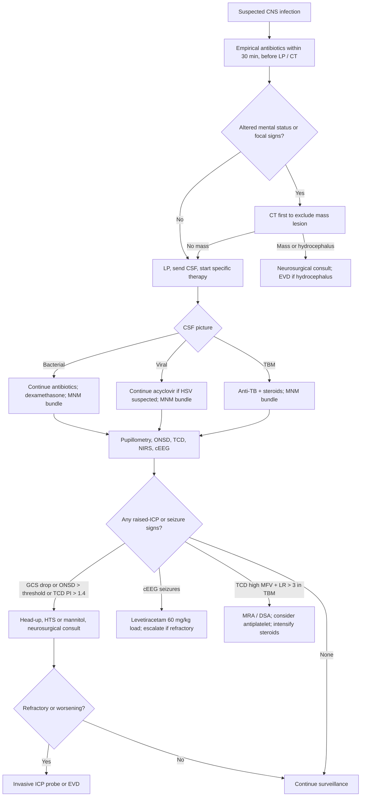

<Callout type="reference">
**Acronyms used on this page**

- **CNS**: central nervous system
- **CSF**: cerebrospinal fluid
- **LP**: lumbar puncture
- **CT / MRI**: computed tomography / magnetic resonance imaging
- **EVD**: external ventricular drain
- **ICP / CPP / MAP**: intracranial / cerebral perfusion / mean arterial pressure
- **ONSD**: optic nerve sheath diameter
- **TCD**: transcranial Doppler
- **PI**: pulsatility index
- **MFV / EDV / PSV**: mean flow velocity / end-diastolic / peak systolic velocity (cm/s)
- **LR**: Lindegaard ratio
- **NIRS / rSO2**: near-infrared spectroscopy / regional oxygen saturation
- **NPi**: neurological pupil index (0 to 5)
- **cEEG / aEEG**: continuous EEG / amplitude-integrated EEG
- **NCSE**: non-convulsive status epilepticus
- **HSV**: herpes simplex virus
- **TBM**: tuberculous meningitis
- **IDSA**: Infectious Diseases Society of America
- **AAN**: American Academy of Neurology
</Callout>

<TldrCard>
**The 60-second version.** Bacterial meningitis and viral encephalitis can both cause **raised ICP** (cerebral oedema, ventriculitis, hydrocephalus), **hydrocephalus**, **vasculitic vasospasm or stroke**, and **non-convulsive seizures**, all of which independently worsen outcome. **The multimodal sweep**: GCS / Sarnat-like staging, pupillometry, bedside ONSD (> 5.0 to 5.5 mm in 1 to 15 years), TCD (PI > 1.4 for raised ICP; LR > 3 for vasospasm), bilateral NIRS, and continuous EEG (subclinical seizures occur in 10 to 30% of pediatric CNS infections). **Antibiotics within 30 minutes of suspicion** is non-negotiable; do not delay for LP or CT. **Dexamethasone** before or with antibiotics in pneumococcal meningitis improves outcome (adults; pediatric evidence weaker but supportive). MNM informs the decision to place an EVD for hydrocephalus, to escalate to invasive ICP monitoring, and to manage haemodynamics. The integration question is when to step from non-invasive surveillance to invasive monitoring; the answer is sustained raised ICP signs not responding to first-line measures.
</TldrCard>

## 1. Three patient vignettes

### Vignette A. Canonical school-age pneumococcal meningitis

**Idris, 4 years old, 16 kg.** Presents with 2 days of fever, headache, vomiting, and progressive irritability. ED: temperature 39.4, GCS 11 (E3 V3 M5), neck stiffness, Kernig and Brudzinski positive. CT (before LP given altered mental status) shows no mass lesion, no acute hydrocephalus, no contraindication to LP. Empirical antibiotics (ceftriaxone 100 mg/kg + vancomycin 60 mg/kg/day in 4 divided doses) and dexamethasone 0.15 mg/kg q6h given **before LP** to avoid delay. LP: cloudy fluid, opening pressure 32 cm H2O (raised), 1,800 WBC with 95% polymorphs, glucose 0.8 (CSF/serum ratio 0.2), protein 3.4 g/L, Gram stain positive for Gram-positive diplococci. Culture grows Streptococcus pneumoniae sensitive to ceftriaxone. PICU admission: bedside MNM bundle includes pupillometry q4h, ONSD ultrasound twice daily, bilateral NIRS, intermittent TCD by intensivist, continuous EEG (for non-convulsive seizure surveillance). Day 2: GCS drifts from 11 to 9; bedside ONSD now 5.4 mm bilaterally (was 4.8); TCD PI right MCA 1.5 (was 0.9). The question: confirm raised ICP non-invasively, escalate to invasive ICP monitoring, manage haemodynamics, and decide on hydrocephalus pathway. <Cite id="tunkel2004_idsa_meningitis" /> <Cite id="vandebeek2016eu_meningitis" /> <Cite id="brouwer2010_dexamethasone_meta" />

### Vignette B. Infant with viral encephalitis

**Sofia, 11 months, 9 kg.** Presents with 24 hours of fever, lethargy, and one witnessed generalised tonic-clonic seizure. ED: temperature 39.1, GCS 9, no neck stiffness (less reliable in infants), bulging anterior fontanelle, focal twitching of the right face on arrival. CT normal; LP performed: opening pressure 26 cm H2O, 50 WBC with 80% lymphocytes, glucose 3.2 (CSF/serum ratio 0.6), protein 0.9 g/L, HSV PCR sent. Empirical acyclovir 60 mg/kg/day in 3 doses started immediately given suspected HSV encephalitis; empirical antibiotics also (bacterial cannot be excluded clinically). cEEG: focal right temporal slowing with intermittent right temporal seizures (subclinical, given the generalised seizure on arrival had resolved). Levetiracetam 60 mg/kg load. MRI day 2: right temporal T2 hyperintensity consistent with HSV encephalitis. PCR returns positive for HSV-1. The infant-specific point: **non-convulsive seizures dominate** the early phase; cEEG is essential; the bulging fontanelle is the bedside ICP surrogate when ONSD is not available; the encephalitis differential is broader (HSV, other herpes viruses, enteroviruses, arboviruses, autoimmune). <Cite id="tunkel2017idsa_encephalitis" />

### Vignette C. Atypical: tuberculous meningitis with vasculitic vasospasm

**Aman, 8 years old, 24 kg.** 3 weeks of low-grade fever, weight loss, and intermittent confusion; recent migration history from a high-TB-prevalence region. CT shows basal meningeal enhancement and early hydrocephalus. LP: opening pressure 28 cm H2O, 200 WBC with 60% lymphocytes, glucose 1.4 (low), protein 4.2 g/L (high). Acid-fast bacilli smear negative; Xpert MTB/RIF positive. Tuberculous meningitis confirmed. Started on intensive-phase TB therapy (HRZE) plus prednisolone 2 mg/kg/day. Day 4: GCS drift from 13 to 10; right-sided weakness develops. TCD shows MCA MFV 165 cm/s on the left (was 95); Lindegaard ratio 3.8. MRI / MRA: left MCA narrowing consistent with **vasculitic vasospasm**, basal meningeal enhancement, and small left basal ganglia infarct. The TB-meningitis-specific point: vasculitic vasospasm of the basal arteries is a recognised complication; MNM (especially TCD) can detect it; hydrocephalus is common (often requiring EVD); steroid response variable. The lesson: **CNS infection can mimic the SAH-vasospasm picture**, with the same TCD-detected pattern but different treatment (anti-TB therapy plus steroids, plus consideration of antiplatelet for the stroke component). <Cite id="vandebeek2016eu_meningitis" /> <Cite id="tunkel2004_idsa_meningitis" />

---

## 2. The clinical question

In a child with bacterial meningitis or viral encephalitis showing GCS drift or neurological signs, **how do you confirm raised ICP non-invasively, detect non-convulsive seizures, and decide when to escalate to invasive ICP monitoring or surgical CSF diversion?** The integration question is the timing and sequencing of the non-invasive multimodal sweep vs invasive monitoring.

---

## 3. Pathophysiology refresher

Bacterial meningitis produces a **purulent leptomeningeal inflammation** that obstructs CSF circulation (communicating hydrocephalus), provokes cerebral oedema (vasogenic and cytotoxic), and can vasoconstrict (vasculitic narrowing) or thrombose (septic) basal arteries. Pneumococcal and meningococcal meningitis remain the most common bacterial aetiologies in older children; group B streptococcus and E. coli dominate in neonates; Haemophilus influenzae has been substantially reduced by Hib vaccination. <Cite id="tunkel2004_idsa_meningitis" /> <Cite id="vandebeek2016eu_meningitis" />

**Viral encephalitis** produces a **parenchymal inflammation** that swells brain tissue, provokes seizures (especially temporal lobe in HSV), and can cause focal infarction or haemorrhage. HSV is the leading treatable cause and accounts for substantial morbidity if treatment is delayed; enteroviruses, arboviruses (West Nile, Japanese encephalitis), and emerging autoimmune encephalitis (anti-NMDA receptor) round out the differential. <Cite id="tunkel2017idsa_encephalitis" />

**Raised ICP in CNS infection** comes from multiple mechanisms: communicating hydrocephalus (basal cisternal obstruction), cerebral oedema (vasogenic and cytotoxic), purulent ventriculitis, vasogenic oedema from inflammatory cytokines, and (in TBM) tuberculomas or abscess. Untreated raised ICP causes herniation and death; recognition is therefore essential.

**Non-invasive ICP surrogates in CNS infection**:
- **GCS / pediatric GCS / Sarnat-like staging**: the primary trigger.
- **Pupillometry NPi**: bilateral drop signals diencephalic compromise; asymmetric drop signals uncal herniation.
- **ONSD bedside ultrasound**: > 5.0 to 5.5 mm in 1 to 15 years, > 4.5 mm in infants under 1 year. Sensitivity 80 to 90%, specificity 80 to 95% for raised ICP. <Cite id="padayachy2012" /> <Cite id="padayachy2016_pediatric_onsd" /> <Cite id="robba2018_onsd_review" />
- **TCD PI**: > 1.4 or rise > 50% from baseline suggests raised ICP. PI is not ICP (de Riva caveat) but is informative as a triage. <Cite id="bellner2004" /> <Cite id="deriva2012_pi" />
- **NIRS bilateral**: symmetric drop with raised ICP and falling CPP.

**Non-convulsive seizures and status epilepticus** occur in **10 to 30% of pediatric CNS infections**. Continuous EEG is the diagnostic gold standard; aEEG (60 to 80% sensitivity) is a resource-limited alternative. **Subclinical seizures independently worsen outcome** and warrant aggressive treatment. <Cite id="herman2015acns_ceeg" /> <Cite id="claassen2013" />

**Antibiotic and adjunctive therapy:**

- **Antibiotics within 30 minutes of suspicion**, ideally within 1 hour of arrival. Do not delay for LP or CT. <Cite id="tunkel2004_idsa_meningitis" /> <Cite id="vandebeek2016eu_meningitis" />
- **Empirical cover** depends on age: ceftriaxone + vancomycin for older children (pneumococcus, meningococcus); ampicillin + cefotaxime + gentamicin for neonates (GBS, E. coli, Listeria).
- **Dexamethasone 0.15 mg/kg q6h for 4 days, before or with antibiotics**, improves outcome in adult pneumococcal meningitis (de Gans 2002; van de Beek meta-analyses). Pediatric evidence is weaker but generally supportive; current guidelines recommend in pneumococcal meningitis. <Cite id="brouwer2010_dexamethasone_meta" />
- **Acyclovir 60 mg/kg/day in 3 doses** for suspected HSV encephalitis, started empirically before PCR returns. Delay independently worsens outcome.
- **Anti-TB therapy** for TBM (HRZE intensive phase) plus **steroids** (prednisolone 2 mg/kg/day) reduces mortality.

---

## 4. The multimodal picture table

| Modality | Bacterial meningitis | Viral encephalitis | TBM | What it adds |
|---|---|---|---|---|
| **GCS** | Falls with raised ICP | Falls; can fluctuate | Insidious decline | Primary clinical anchor |
| **Vital signs** | Fever, Cushing if raised ICP | Fever, may have Cushing | Low-grade fever, chronic course | Trajectory matters |
| **Pupillometry NPi** | Bilateral drop = diencephalic; asymmetric = herniation | Same | Same | Brainstem sentinel |
| **ONSD** | Rises early with raised ICP | Rises with parenchymal swelling | Rises with hydrocephalus | Non-invasive ICP surrogate |
| **TCD PI** | Rises with raised ICP / falling CPP | Variable | Vasculitic spasm pattern (high MFV, high LR) | Both ICP triage and vasospasm detection |
| **TCD MFV / LR** | Usually unchanged unless vasculitis | Usually unchanged | High MFV with LR > 3 = TBM vasospasm | TBM-specific |
| **NIRS bilateral** | Symmetric drop with raised ICP | Variable; focal pathology asymmetric | Symmetric drop with hydrocephalus | Regional vs global |
| **cEEG** | Slow background, seizures common | Focal seizures (HSV temporal), encephalopathy | Slow background, occasional seizures | NCSE detection |
| **LP CSF analysis** | Polymorphs, low glucose, high protein, positive Gram / culture | Lymphocytes, normal glucose, mildly raised protein, positive PCR | Lymphocytes, low glucose, very high protein, positive Xpert MTB/RIF | Aetiological diagnosis |
| **CT** | Normal or hydrocephalus or abscess | Often normal or focal oedema | Basal meningeal enhancement, hydrocephalus | Pre-LP exclusion of mass lesion |
| **MRI** | Confirms complications | T2 hyperintensity temporal in HSV | Basal meningeal enhancement, infarcts | Definitive imaging |

The most useful pairings: **GCS + pupillometry + ONSD** (the bedside non-invasive ICP triad), **TCD + ONSD** (haemodynamic + anatomic ICP surrogates), and **cEEG + NIRS** (subclinical seizure detection + regional surveillance).

---

## 5. Decision tree

<Figure
  src="/images/integration/meningitis-encephalitis/icp-pathway.svg"
  alt="Pathway from suspected CNS infection through empirical antibiotics, LP, multimodal sweep, and decision to escalate to invasive ICP monitoring or EVD"
  caption="From suspicion to MNM-supported management of CNS infection. Top: empirical antibiotics within 30 minutes (the universal first action). Middle: LP after CT in altered patients; CSF analysis dictates specific therapy. Bottom: bedside MNM bundle (pupillometry, ONSD, TCD PI, NIRS, cEEG) with thresholds for escalation. Red branches indicate triggers to invasive ICP monitoring or EVD placement; blue branches indicate continued non-invasive surveillance. The TBM branch shows the vasculitic vasospasm pathway with TCD detection and MRA confirmation."
  attribution="MNM-Edu, original schematic. SVG placeholder."
  label="Fig. 1"
/>

---

## 6. Step-by-step bedside actions

1. **Empirical antibiotics within 30 minutes of suspicion**, before LP or CT. Standard pediatric empirical cover: ceftriaxone 100 mg/kg + vancomycin 60 mg/kg/day in 4 divided doses; ampicillin + cefotaxime + gentamicin in neonates.
2. **Dexamethasone 0.15 mg/kg q6h** before or with the first antibiotic dose in suspected bacterial meningitis; continue 4 days if pneumococcus confirmed. For TBM, prednisolone 2 mg/kg/day.
3. **Empirical acyclovir 60 mg/kg/day in 3 doses** if HSV encephalitis is suspected (focal seizures, focal MRI changes, temporal lobe involvement); do not wait for PCR.
4. **CT before LP** if altered mental status, focal neurological signs, papilloedema, immunocompromised, recent seizure, or persistently low GCS, to exclude a mass lesion.
5. **LP with opening pressure**, send CSF for cell count and differential, glucose, protein, Gram stain, culture, PCR panel (HSV, enterovirus, others as indicated), and Xpert MTB/RIF if TB suspected. Save spare CSF for autoimmune workup if encephalitis differential is broad.
6. **PICU admission with MNM bundle**: pupillometry q4h, ONSD twice daily, intermittent TCD daily, bilateral NIRS, continuous EEG (or aEEG if cEEG unavailable). Hourly GCS by bedside nurse.
7. **If raised-ICP signs** (GCS drop, ONSD > threshold, TCD PI > 1.4, Cushing pattern): head-up 30 degrees, HTS 3 mL/kg or mannitol 0.5 g/kg, neurosurgical consult.
8. **If cEEG shows seizures** (convulsive or non-convulsive): levetiracetam 60 mg/kg load, escalate to phenobarbital 20 mg/kg or midazolam infusion if refractory.
9. **If TBM with high MCA MFV and LR > 3**: MRA or DSA, consider antiplatelet for stroke prevention, intensify steroid dose, neurology consult.
10. **Escalate to invasive ICP monitoring or EVD** when raised-ICP signs are sustained despite first-line measures, when hydrocephalus develops, or when surgical decision-making requires precise ICP measurement.

---

## 7. Management ladder and endpoints

| Tier | Intervention | Endpoint |
|---|---|---|
| 0 | Empirical antibiotics within 30 min; dexamethasone or acyclovir as indicated | Drug delivered |
| 1 | LP after CT; specific therapy adjusted to aetiology | CSF diagnosis confirmed |
| 2 | PICU MNM bundle: pupillometry, ONSD, TCD, NIRS, cEEG | Baseline established |
| 3 | First-line measures for raised ICP (head-up, HTS, mannitol) | ICP signs improving |
| 4 | Invasive ICP probe, EVD for hydrocephalus | Direct ICP guidance |
| 5 | Decompressive craniectomy or external ventricular drainage for refractory cases | Salvage |

**Success** looks like: pathogen identified, appropriate therapy delivered, neurological recovery, no new infarct, no chronic hydrocephalus requiring permanent shunt.

**Failure** looks like: refractory raised ICP requiring escalating intervention, vasculitic infarction, sequelae including cognitive and motor deficits, requiring rehabilitation.

<AlgorithmDisclaimer />

---

## 8. Variant subsections

### 8.1 Bacterial meningitis (pneumococcal, meningococcal)

The most common bacterial aetiologies in older children. Pneumococcal: high mortality (5 to 15%), high sequelae rate (hearing loss in 20 to 30%, neurological deficits 10 to 20%). Meningococcal: rapid haemodynamic collapse (purpura fulminans), the dominant early concern. Empirical cover ceftriaxone + vancomycin until susceptibilities return; de-escalate as appropriate. Dexamethasone before or with antibiotics. MNM bundle as described. <Cite id="vandebeek2016eu_meningitis" /> <Cite id="brouwer2010_dexamethasone_meta" />

### 8.2 Viral encephalitis (HSV, enteroviruses, arboviruses, autoimmune)

HSV is the leading treatable cause; acyclovir 60 mg/kg/day in 3 doses, continued until HSV PCR returns negative or for 21 days if positive. cEEG essential for non-convulsive seizure detection (HSV famously involves the temporal lobe and provokes complex partial seizures). MRI day 2 to 3 is often diagnostic (T2 / FLAIR hyperintensity in temporal lobe). Autoimmune encephalitis (anti-NMDA receptor most common in adolescents) presents with subacute personality change, psychiatric symptoms, dyskinesias, and seizures; requires immunotherapy. <Cite id="tunkel2017idsa_encephalitis" />

### 8.3 Tuberculous meningitis

Insidious onset, basal meningeal enhancement, hydrocephalus, vasculitic vasospasm of the basal arteries, and high mortality without treatment. Diagnosis: Xpert MTB/RIF on CSF (sensitivity ~80%), AFB smear (less sensitive), MGIT culture (gold standard but slow). Treatment: HRZE intensive phase plus steroids. Hydrocephalus often requires EVD. Vasculitic vasospasm detected by TCD (high MFV with LR > 3) can be managed with antiplatelet therapy. <Cite id="vandebeek2016eu_meningitis" />

### 8.4 Hydrocephalus management

Acute communicating hydrocephalus is common in bacterial meningitis (especially pneumococcal) and TBM. Bedside signs: bulging fontanelle in infants, rapid head growth, papilloedema, falling GCS. Confirmation: CT or MRI showing ventricular enlargement out of proportion to atrophy. **EVD is the bedside intervention**: relieves raised ICP, allows CSF sampling, and bridges to permanent shunt if needed. MNM continues to inform CPP and ICP management with the EVD in place.

### 8.5 Vasculitic vasospasm

TBM, occasionally pneumococcal meningitis (post-infectious), can cause vasculitic narrowing of basal arteries with secondary infarction. TCD detects rising MCA MFV with LR > 3 (analogous to the SAH-vasospasm pattern in [TCD vs ICP vasospasm](/integration/tcd-vs-icp-vasospasm/)). MRA or DSA confirms. Management: anti-TB and steroids for TBM; antiplatelet for stroke prevention; rarely intra-arterial therapy. The same MNM principles apply as in SAH vasospasm. <Cite id="vandebeek2016eu_meningitis" />

### 8.6 Post-treatment monitoring

Beyond the acute phase, the MNM bundle continues to track recovery: GCS evolution, EEG normalisation, ONSD trend, NIRS stability. Outpatient follow-up: hearing assessment (especially after pneumococcal meningitis), neuropsychological assessment, MRI at 6 to 12 weeks to assess sequelae, immunisation status review.

---

## 9. Multimodal integration matrix

| Pair | What you gain |
|---|---|
| **GCS + pupillometry + ONSD** | The bedside non-invasive ICP triad; sufficient for early action |
| **ONSD + TCD PI** | Two non-invasive ICP surrogates; concordant rise strengthens the case |
| **TCD MFV + Lindegaard** | Detects TBM vasculitic vasospasm; same logic as SAH vasospasm |
| **cEEG + clinical exam** | Subclinical seizures common; cEEG is the only way to detect |
| **NIRS bilateral + clinical exam** | Symmetric NIRS drop supports global ICP rise |
| **MNM bundle + LP CSF analysis** | The CSF gives the aetiology; MNM gives the trajectory |
| **MNM bundle + MRI** | MRI is definitive for parenchymal changes; MNM tracks daily |
| **MNM + EVD decision** | The decision to escalate from non-invasive surveillance to invasive monitoring rests on the multimodal evidence |

---

## 10. Worked alternative scenarios

### 10.1 What if the "meningitis" is actually subarachnoid haemorrhage?

A 13-year-old presents with "worst headache of life," vomiting, photophobia, neck stiffness, GCS 13. LP shows xanthochromic CSF with > 100,000 RBC. **This is SAH, not bacterial meningitis.** The MNM bundle pivots: TCD becomes the central modality for vasospasm surveillance (days 4 to 14), and the antibiotic-and-steroid plan is replaced by aneurysm workup and vasospasm management. See [TCD vs ICP vasospasm integration](/integration/tcd-vs-icp-vasospasm/) for the full pathway. The lesson: not every "meningitis-like" presentation is meningitis; xanthochromia on LP is the deciding finding.

### 10.2 What if the encephalitis is autoimmune (anti-NMDA receptor)?

A 14-year-old presents with subacute personality change, psychiatric symptoms, dyskinesias, and seizures over 3 weeks. CSF: lymphocytic pleocytosis, mildly elevated protein. HSV PCR negative. MRI normal or shows mild medial temporal hyperintensity. cEEG shows the **extreme delta brush** pattern (pathognomonic). Anti-NMDA receptor antibodies positive. **Treat with immunotherapy** (steroids, IVIG, plasmapheresis, rituximab) and supportive care. MNM bundle continues; cEEG is essential. Tumour workup (ovarian teratoma in adolescent females) is important. <Cite id="tunkel2017idsa_encephalitis" />

### 10.3 What if the "encephalitis" is actually metabolic?

A 6-year-old presents with subacute encephalopathy, vomiting, and altered mental status. CSF normal; HSV PCR negative. MRI shows symmetric basal ganglia signal abnormality. Ammonia is markedly elevated. **This is metabolic encephalopathy**, possibly urea cycle defect, organic acidaemia, or mitochondrial disease. The MNM bundle remains in place but the differential diagnostic pivot drives metabolic and genetic workup; treatment is the underlying metabolic disease. See [inborn errors of metabolism encephalopathy integration](/integration/inborn-errors-encephalopathy/) for the full pathway. <Cite id="parikh2017_mito_consensus" />

---

## 11. Outcome data

- **van de Beek 2016 EU guidelines**: comprehensive synthesis of bacterial meningitis management in Europe; emphasises early antibiotics, dexamethasone in pneumococcal, intensive supportive care. <Cite id="vandebeek2016eu_meningitis" />
- **Tunkel 2004 IDSA bacterial meningitis**: foundational US guideline; early antibiotic timing, empirical cover by age, dexamethasone recommendations. <Cite id="tunkel2004_idsa_meningitis" />
- **Tunkel 2017 IDSA encephalitis**: comprehensive viral encephalitis management; acyclovir empirical, cEEG for seizure detection, broad diagnostic workup. <Cite id="tunkel2017idsa_encephalitis" />
- **Brouwer 2010 dexamethasone meta-analysis**: dexamethasone reduces mortality in adult pneumococcal meningitis; pediatric data weaker but generally supportive. <Cite id="brouwer2010_dexamethasone_meta" />
- **Padayachy 2012, 2016**: pediatric ONSD reference data and clinical utility. <Cite id="padayachy2012" /> <Cite id="padayachy2016_pediatric_onsd" />
- **Herman 2015 ACNS critical-care EEG terminology**: standard nomenclature for cEEG patterns; informs the meningitis / encephalitis seizure differential. <Cite id="herman2015acns_ceeg" />

---

## 12. Pitfalls

- **Delaying antibiotics for LP or CT.** Antibiotics within 30 minutes; LP and CT are diagnostic but should not delay therapy.
- **Missing non-convulsive seizures.** cEEG is essential; clinical observation alone misses NCSE in 30 to 50% of cases.
- **Reading ONSD without age-banded thresholds.** Pediatric ONSD thresholds are lower than adult; under 1 year ~ 4.5 mm, 1 to 15 years 5.0 to 5.5 mm.
- **Forgetting acyclovir in suspected HSV.** Empirical acyclovir before PCR returns; delay independently worsens outcome.
- **Underestimating TBM.** Insidious onset, basal cisternal enhancement, vasculitic vasospasm, hydrocephalus; consider in any prolonged subacute meningitis or in epidemiologically appropriate patients.
- **Skipping the autoimmune encephalitis differential.** Adolescent female with subacute personality change, dyskinesias, seizures = consider anti-NMDA receptor.
- **Forgetting hearing assessment after pneumococcal meningitis.** 20 to 30% hearing loss rate; early audiology is part of recovery care.
- **Inadequate EVD management.** If EVD placed, drift, infection, and over-drainage are all risks; consult neurosurgery for management protocols.
- **Failing to escalate to invasive ICP monitoring** when non-invasive signs are sustained; the threshold should be lower in pediatric CNS infection than in TBI.

---

## 13. Pediatric considerations

<Pediatric>
**Six pediatric-specific points.**

1. **Empirical antibiotic cover is age-banded**:
   - Neonate (< 1 month): ampicillin + cefotaxime + gentamicin (covers GBS, E. coli, Listeria)
   - Infant > 1 month: ceftriaxone + vancomycin (covers pneumococcus, meningococcus, H. flu)
   - Older child: same as infant
   - Add ampicillin if Listeria risk persists

2. **Pediatric ONSD thresholds are lower** than adult: ~ 4.5 mm under 1 year, 5.0 to 5.5 mm in 1 to 15 years.

3. **The bulging fontanelle** is the bedside ICP surrogate in infants; do not skip the fontanelle exam.

4. **Acyclovir dose in pediatrics**: 60 mg/kg/day in 3 doses (vs adult 30 mg/kg/day in 3 doses); the higher dose is needed for CSF penetration in pediatric encephalitis.

5. **Vaccination status matters**: pneumococcal conjugate vaccine, Hib vaccine, meningococcal vaccine. Check immunisation history; refer for completion if gaps identified.

6. **Hearing assessment** after pneumococcal meningitis is standard; sensorineural hearing loss can be delayed but should be screened.

</Pediatric>

---

## 14. Combine with

- [Clinical exam and GCS](/modalities/clinical-exam/): the clinical anchor.
- [Pupillometry](/modalities/pupillometry/): NPi quantification.
- [ONSD ultrasound](/modalities/onsd/): non-invasive ICP surrogate.
- [TCD / TCCD modality page](/modalities/tcd/): PI as ICP triage and MFV / LR for vasculitic vasospasm.
- [NIRS](/modalities/nirs/): regional / global oxygenation.
- [Continuous EEG](/modalities/eeg/): essential for non-convulsive seizure detection.
- [TCD vs ICP vasospasm integration](/integration/tcd-vs-icp-vasospasm/): the SAH-vasospasm parallel for TBM vasculitic vasospasm.
- [DKA cerebral oedema integration](/integration/dka-cerebral-edema/): the adjacent acute encephalopathy.
- [Refractory status epilepticus integration](/integration/refractory-status-epilepticus/): when seizures dominate.

---

<DeepDive>

## 15. Evidence summary and recent literature (2022 to 2025)

### Foundational

| Topic | Reference | Grade |
|---|---|---|
| IDSA bacterial meningitis | <Cite id="tunkel2004_idsa_meningitis" /> | expert |
| EU bacterial meningitis | <Cite id="vandebeek2016eu_meningitis" /> | expert |
| IDSA encephalitis | <Cite id="tunkel2017idsa_encephalitis" /> | expert |
| Dexamethasone meta-analysis | <Cite id="brouwer2010_dexamethasone_meta" /> | A |
| Pediatric ONSD | <Cite id="padayachy2012" /> <Cite id="padayachy2016_pediatric_onsd" /> | B |
| ACNS critical-care EEG | <Cite id="herman2015acns_ceeg" /> | expert |
| Continuous EEG in critical illness | <Cite id="claassen2013" /> | B |

### Recent literature (2022 to 2025)

- **Helbok 2024 pediatric MMM update**: includes meningitis / encephalitis bundle recommendations with non-invasive ICP surrogates and cEEG. <Cite id="helbok2024_pediatric_mmm" />
- **Figaji 2025 pediatric MMM consensus**: similar framework with explicit attention to TBM vasculitic vasospasm detection. <Cite id="figaji2025_mmm_pediatric_consensus" />
- **Tasker 2023 PCCM review**: integrative pediatric MMM piece; CNS infection chapter. <Cite id="tasker2023_pccm_review" />
- **Naim 2023 PCCM**: pediatric brain injury MNM update; CNS infection applications. <Cite id="naim2023_brain_injury_pccm" />
- **Sansevere 2023 neonatal cEEG**: subclinical seizure detection, relevant for neonatal CNS infection. <Cite id="sansevere2023_neonatal_ceeg" />
- **Robba 2018 ONSD review**: pediatric ONSD as ICP surrogate; current synthesis. <Cite id="robba2018_onsd_review" /> <Cite id="robba2018peds" />

</DeepDive>

---

## 16. Self-check

<Quiz
  questions={[
    {
      id: 'q1',
      prompt: 'A 4-year-old with fever, vomiting, neck stiffness, GCS 11. CT shows no mass or hydrocephalus. LP returns within 60 minutes: cloudy CSF, 1,800 WBC with 95% polymorphs, glucose 0.8, protein 3.4 g/L, Gram-positive diplococci on Gram stain. He has already received ceftriaxone and vancomycin within 30 minutes of arrival. Day 2 in PICU, GCS drifts to 9, ONSD now 5.4 mm bilaterally (was 4.8), TCD PI right MCA 1.5 (was 0.9). What is the most appropriate next step?',
      options: [
        { id: 'a', label: 'Wait and reassess in 2 hours; antibiotics need time to work' },
        { id: 'b', label: 'Head-up 30 degrees, HTS 3% NaCl 3 mL/kg over 10 to 20 min, neurosurgical consult; consider invasive ICP monitoring or EVD if signs persist' },
        { id: 'c', label: 'Lumbar puncture to recheck CSF parameters' },
        { id: 'd', label: 'Lower the dexamethasone dose' },
      ],
      answer: 'b',
      explanation: 'The multimodal sweep shows raised ICP signs (ONSD above threshold, TCD PI > 1.4, GCS drift). The bedside response is head-up, HTS, and surgical consult. Repeat LP risks herniation. Lowering dexamethasone is the opposite of what is needed. Waiting is unsafe with progressive signs.',
    },
    {
      id: 'q2',
      prompt: 'An 11-month-old with 24 h of fever, lethargy, one generalised seizure, bulging fontanelle. LP normal opening pressure for age, 50 WBC with 80% lymphocytes, normal CSF/serum glucose ratio, mildly elevated protein. HSV PCR pending. What is the most appropriate empirical regimen while awaiting PCR?',
      options: [
        { id: 'a', label: 'Stop antibiotics; CSF picture is viral' },
        { id: 'b', label: 'Continue empirical antibiotics + start acyclovir 60 mg/kg/day in 3 divided doses immediately; start continuous EEG' },
        { id: 'c', label: 'Wait for HSV PCR to return before starting acyclovir' },
        { id: 'd', label: 'Give a steroid burst to reduce inflammation' },
      ],
      answer: 'b',
      explanation: 'HSV encephalitis is the leading treatable cause of viral encephalitis; empirical acyclovir is started immediately, not after PCR returns, because delay independently worsens outcome. Antibiotics should continue until bacterial meningitis is excluded; the CSF picture can be early or partially-treated bacterial. cEEG detects the non-convulsive seizures that are common in HSV (especially temporal lobe).',
    },
    {
      id: 'q3',
      prompt: 'An 8-year-old recently arrived from a high-TB-prevalence region. 3 weeks of low-grade fever, weight loss, intermittent confusion. CT shows basal meningeal enhancement and early hydrocephalus. CSF: 200 WBC mostly lymphocytes, glucose 1.4, protein 4.2 g/L. Xpert MTB/RIF positive. Day 4 of intensive HRZE: GCS drops, right-sided weakness develops. TCD: left MCA MFV 165 cm/s (was 95); LR 3.8. What is the most likely explanation and best next step?',
      options: [
        { id: 'a', label: 'Antibiotic resistance; switch TB regimen' },
        { id: 'b', label: 'Vasculitic vasospasm of the left MCA from TBM; MRA / DSA to confirm; intensify steroids; consider antiplatelet for stroke prevention' },
        { id: 'c', label: 'Acute hydrocephalus alone; place an EVD' },
        { id: 'd', label: 'Drug-induced encephalopathy; stop all anti-TB medication' },
      ],
      answer: 'b',
      explanation: 'TBM-related vasculitic vasospasm of the basal arteries produces the same TCD pattern as SAH vasospasm (high MFV with LR > 3) and can progress to infarction. MRA / DSA confirms. Treatment is intensified steroids and consideration of antiplatelet for stroke prevention; some centres use intra-arterial therapy. Stopping anti-TB medication would lose disease control. Hydrocephalus may co-exist and require EVD, but does not explain the TCD findings of vessel narrowing.',
    },
  ]}
/>
