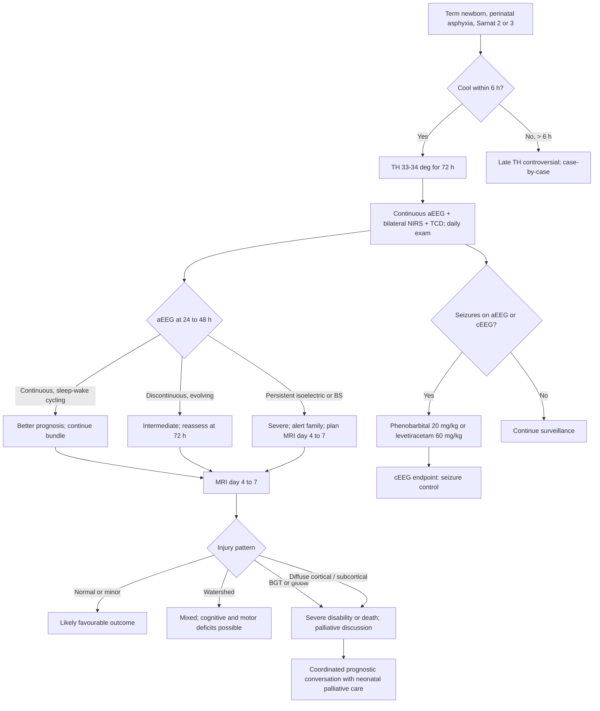

<Callout type="reference">
**Acronyms used on this page**

- **HIE**: hypoxic-ischaemic encephalopathy (term newborn diagnosis after perinatal asphyxia)
- **NE**: neonatal encephalopathy (broader clinical term; HIE is a specific aetiology)
- **TH**: therapeutic hypothermia (also "cooling")
- **aEEG**: amplitude-integrated EEG
- **cEEG**: continuous full-montage EEG
- **NIRS**: near-infrared spectroscopy
- **rSO2**: regional oxygen saturation
- **TCD / TCCD**: transcranial Doppler / colour-coded duplex
- **MFV / PI**: mean flow velocity / pulsatility index
- **HU**: head ultrasound (through anterior fontanelle)
- **MRI**: magnetic resonance imaging
- **DWI**: diffusion-weighted imaging
- **HIE Sarnat**: clinical staging (1 mild, 2 moderate, 3 severe)
- **TOBY / NICHD / CoolCap**: foundational hypothermia trials
- **PPHN**: persistent pulmonary hypertension of the newborn
</Callout>

<TldrCard>
**The 60-second version.** Term newborn HIE: cool to 33 degrees for 72 hours, started within 6 hours of birth, in a Sarnat 2 to 3 clinical picture. **MNM bundle**: continuous aEEG (background continuity, sleep-wake cycling, seizures), bilateral NIRS (rSO2 trajectory; luxury perfusion in severe HIE shows rSO2 > 85% paradoxically), TCD pulsatility (low PI with high diastolic flow = luxury perfusion), serial neuro exam (Sarnat stage), and **MRI day 4 to 7** (the prognostic anchor). The trajectory: aEEG often isoelectric in first 24 h, evolves to discontinuous then continuous over 48 to 72 h in survivors; persistent isoelectric at 36 to 48 h = very poor prognosis. The pediatric / neonatal point: **prognostication requires the bundle**, not any single test. **Day 4 to 7 MRI** is the most predictive single modality; aEEG + clinical exam + MRI converge on the prognostic conversation with the family.
</TldrCard>

## 1. Three patient vignettes

### Vignette A. Canonical Sarnat 2 cooled HIE

**Layla, term (39+5 weeks), 3.4 kg, day 2 (post-natal hour 36).** Born by emergency caesarean for prolonged decelerations; Apgars 2 / 4 / 6, cord pH 6.91, base deficit 18, lactate 9.2 mmol/L. Required positive-pressure ventilation, intubation, 5 minutes of chest compressions. Sarnat stage 2 encephalopathy at 1 hour (hypotonia, weak suck, abnormal Moro, intermittent agitation). Met TOBY / NICHD cooling-eligibility criteria. Cooling started at 4 hours of life; on day 2 currently at 33.5 degrees, paralysed and sedated for cooling. aEEG over 36 hours: initial **isoelectric** trace, evolved by hour 18 to **discontinuous** (bursts > 10 microvolts separated by < 5 microvolt interburst intervals), now showing early **sleep-wake cycling** at hour 36. NIRS rSO2 bilateral 78 / 79 (a touch on the high side; cooling raises rSO2 by ~3 to 5% via reduced CMRO2). TCD MCA: PSV 65, EDV 35, **PI 0.65** (low, reflecting reduced cerebral vascular resistance and reperfusion). Pupils PERLA, NPi 4.0 / 4.0. The question: how does the bundle predict day-7 MRI and 18-month outcome? <Cite id="shankaran2005hie_nichd" /> <Cite id="toet1999" /> <Cite id="hellstromwestas2006" />

### Vignette B. Premature (33-week) NE-like presentation

**Khalid, born at 33 weeks, 1.6 kg, day 3.** No clear perinatal asphyxia; intrauterine growth restriction with placental insufficiency. Sarnat-like clinical picture (hypotonia, abnormal feeding behaviour), but premature infants are generally **excluded from therapeutic hypothermia** (the cooling trials enrolled ≥ 36 weeks). aEEG patterns are different in preemies: more discontinuity is normal, sleep-wake cycling emerges later. Bilateral NIRS rSO2 65 / 62 (lower than term norms; preterm baseline is 55 to 75%). Head ultrasound: bilateral periventricular echo-densities suggestive of evolving PVL. The team focuses on neuroprotection (avoid hypotension, treat seizures aggressively, normothermia), serial HU surveillance for IVH and PVL, and MRI at term-equivalent age. The premature point: **cooling is not standard**, the MNM bundle is different (more weight on HU than MRI in the acute phase), and the prognostic conversation is more uncertain. <Cite id="pressler2017neonatal" /> <Cite id="sansevere2023_neonatal_ceeg" />

### Vignette C. Atypical: severe HIE with luxury perfusion masking depth of injury

**Yusra, term (40+1), 3.2 kg, day 2.** Sarnat stage 3 (deep coma, no spontaneous movement, no brainstem reflexes except weak pupillary, frequent seizures). Cooled. **NIRS rSO2 bilateral 90 / 91%** (very high, "luxury perfusion"). TCD: **PI 0.32**, EDV 65, MFV 95 (high diastolic flow, very low pulsatility). aEEG isoelectric since hour 0 with no evolution at hour 48. The paradox: the brain looks "well oxygenated" on NIRS, but is functionally dead on aEEG. **Luxury perfusion in HIE is a bad prognostic sign**: blood flows through a brain whose metabolic demand has collapsed; the high rSO2 reflects loss of extraction, not adequate function. Pair this with the aEEG and the picture is one of severe injury despite reassuring oxygenation numbers. MRI day 5: extensive bilateral basal ganglia, thalamus, perirolandic, hippocampal, and subcortical white-matter signal abnormality on DWI. The prognostic conversation: severe injury, very poor outcome anticipated; transition to compassionate care discussions in coordination with neonatal palliative care. The lesson: **NIRS rSO2 alone is not reassuring in HIE; pair with aEEG and the clinical exam**. <Cite id="kirschen2020_pedshie_tcd" /> <Cite id="toet1999" />

---

## 2. The clinical question

In the term newborn with HIE under cooling, **what does each modality contribute to acute neuroprotection, and how does the multimodal bundle frame the day 4 to 7 prognostic conversation with the family?** The integration question is how aEEG, NIRS, TCD, clinical exam, and MRI combine into a single coherent prognostic narrative.

---

## 3. Pathophysiology refresher

Hypoxic-ischaemic encephalopathy in the term newborn results from a perinatal sentinel event (placental abruption, prolapsed cord, severe shoulder dystocia, uterine rupture) that interrupts placental gas exchange. The fetus tolerates short interruptions through redistribution of cardiac output (brain-sparing); prolonged interruption (typically > 20 to 30 minutes) overwhelms compensation and produces a global hypoxic-ischaemic insult. Subsequent **reperfusion injury** in the first 6 to 48 hours involves excitotoxicity, oxidative stress, mitochondrial dysfunction, and delayed apoptosis. **Therapeutic hypothermia interrupts this cascade** by lowering cerebral metabolic rate (CMRO2 falls ~6 to 8% per degree), reducing excitotoxicity, and dampening apoptotic signalling. Cooling within 6 hours of birth for 72 hours at 33 to 34 degrees core temperature is the standard intervention. <Cite id="shankaran2005hie_nichd" /> <Cite id="moler2015thapca" />

**The aEEG trajectory in HIE** is the bedside backbone of acute monitoring. **Toet 1999** established the four canonical background patterns:

1. **Continuous normal voltage (CNV)**: lower border > 5 microvolts, upper border > 10 microvolts. Normal or mild HIE.
2. **Discontinuous (DC)**: lower border < 5 microvolts, upper border > 10 microvolts. Moderate HIE.
3. **Burst-suppression (BS)**: low-voltage background interrupted by high-amplitude bursts. Severe HIE.
4. **Continuous low voltage (CLV) or isoelectric / flat**: both borders < 5 microvolts or < 2 microvolts (flat). Very severe HIE.

**The evolution matters more than the initial pattern**: a previously isoelectric trace evolving to discontinuous by 24 to 48 hours is consistent with recovery; persistent isoelectric or burst-suppression at 36 to 48 hours indicates very severe injury. **Sleep-wake cycling** typically emerges by 24 to 72 hours in cooled infants with recovery potential. <Cite id="toet1999" /> <Cite id="hellstromwestas2006" />

**NIRS rSO2 in HIE** behaves counterintuitively. In severe HIE with luxury perfusion, rSO2 is **paradoxically high** (often 85 to 95%) because the brain has lost its ability to extract oxygen (collapsed metabolic demand). A "reassuring" high NIRS in a deeply encephalopathic newborn is therefore a bad sign, not a good one. The interpretation requires the aEEG and clinical context. Conversely, a low rSO2 (< 50%) suggests hypoperfusion or extraction beyond delivery; both are concerning. <Cite id="hyttel2015" /> <Cite id="davies2017nirs" /> <Cite id="kirschen2020_pedshie_tcd" />

**TCD in HIE** also has counterintuitive patterns. **Low PI with high EDV** = luxury perfusion (reduced cerebral vascular resistance from injured vessels), often seen days 1 to 3 in severe HIE and associated with poor outcome. **High PI with low EDV** = high cerebrovascular resistance, often raised ICP from oedema, also associated with poor outcome. Normal PI (0.65 to 0.95 in term newborns) with normal MFV is reassuring. <Cite id="kirschen2020_pedshie_tcd" />

**MRI day 4 to 7** is the single most predictive modality. The injury pattern reveals the mechanism and severity: **basal ganglia and thalamus (BGT) pattern** suggests acute profound hypoxia-ischaemia (worst prognosis); **watershed pattern** (parasagittal cortex and subcortical white matter) suggests partial prolonged hypoxia-ischaemia (better prognosis if isolated); **diffuse cortical / subcortical** pattern suggests severe global injury; **normal MRI** in a clinically encephalopathic infant has good prognostic implications. <Cite id="shankaran2005hie_nichd" /> <Cite id="moler2017thapca" />

**The Sarnat clinical staging** remains the primary clinical anchor: stage 1 (mild, hyperalert), stage 2 (moderate, lethargic, hypotonic, weak suck, frequent seizures), stage 3 (severe, deep coma, no spontaneous movement, absent brainstem reflexes). Stages 2 and 3 are cooling-eligible; stage 1 is generally not. <Cite id="shankaran2005hie_nichd" />

**Seizures in HIE** occur in 30 to 50%. Most are subclinical (cooling and sedation mask convulsive activity). cEEG is the gold standard; aEEG detects 60 to 80%. Treatment: phenobarbital 20 mg/kg loading is the historical first-line; levetiracetam 60 mg/kg is increasingly used (less sedation, better cognitive profile). <Cite id="pressler2017neonatal" /> <Cite id="herman2015acns_ceeg" />

---

## 4. The multimodal picture table

| Modality | Mild HIE | Severe HIE recovering | Severe HIE not recovering | What it adds |
|---|---|---|---|---|
| **aEEG continuity** | Continuous, sleep-wake cycling by 24 h | Initial discontinuous, evolving to continuous by 72 h | Persistent isoelectric or burst-suppression at 48 h | Most-used bedside |
| **cEEG seizures** | Rare | Occasional, treatable | Frequent, status epilepticus | Definitive seizure detection |
| **NIRS rSO2** | 65 to 75% (normal term) | 65 to 80% | Paradoxically high (85 to 95%, luxury perfusion) | Easy to misread alone |
| **TCD PI** | 0.65 to 0.95 (normal) | Normalising | Low (< 0.5, luxury) or very high (> 1.4) | Cerebrovascular resistance |
| **TCD MFV** | Age-appropriate (~25 cm/s term) | Recovering | Variable | Trends informative |
| **Pupillometry NPi** | 3.5 to 5 | 3.5 to 5 | 0 to 2, sluggish | Brainstem function |
| **Sarnat clinical stage** | 1 | 2 | 3 | Primary clinical anchor |
| **Head ultrasound** | Often normal | Variable echogenicity | Echogenic basal ganglia, thalamus | Bedside imaging |
| **MRI day 4 to 7** | Normal or minor changes | Watershed or focal injury | BGT pattern, extensive cortical / subcortical | **The single most predictive modality** |
| **Clinical exam evolution** | Recovers by 24 h | Slow improvement | No improvement, multi-organ failure | The reality check |

The most useful pairings in neonatal HIE: **aEEG + clinical exam + MRI** (the canonical prognostic triad), **NIRS + aEEG** (catches luxury perfusion), and **cEEG + aEEG** (seizure detection plus continuity trajectory).

---

## 5. Decision tree

<Figure
  caption="Post-arrest neuroprognostication pathway. After ROSC and rewarming, a multimodal decision tree integrates 72-hour clinical exam, aEEG continuity, NIRS trajectory, SSEP, and day-4-to-7 MRI. The same pathway applies to neonatal HIE after a 72-hour cooling cycle: the convergent signals (continuous aEEG with sleep-wake cycling, recovering NIRS, present SSEP N20, and a non-BGT MRI pattern) define a favourable phenotype; bilaterally absent N20, persistent burst-suppression, and a BGT-pattern MRI define a poor-outcome phenotype that supports honest family conversation about life-sustaining therapy."
  attribution="MNM-Edu, original schematic."
  label="Fig. 1"
>
  <PostArrestProgPathway />
</Figure>

---

## 6. Step-by-step bedside actions

1. **Start cooling within 6 hours of birth** for eligible infants (TOBY / NICHD: pH ≤ 7.00 OR base deficit ≥ 16 PLUS Apgars ≤ 5 at 10 minutes OR continued resuscitation PLUS Sarnat 2 to 3 encephalopathy). Target core 33 to 34 degrees for 72 hours.
2. **Place continuous aEEG immediately**. Two-channel (C3-P3, C4-P4) for amplitude; expand to multi-channel cEEG if seizures suspected. Record continuously through cooling and rewarming.
3. **Bilateral NIRS pads on**, frontal placement; document baseline rSO2 in the first 6 hours; expect cooling to raise rSO2 by 3 to 5%.
4. **Daily TCD MCA** for PI and MFV; document baseline; interpret in the context of clinical state.
5. **Daily neurological exam by a senior physician**: pupillary, gag, suck, posture, tone, spontaneous movement, primitive reflexes; document the Sarnat stage trajectory.
6. **Treat seizures aggressively**. Phenobarbital 20 mg/kg loading (may give second 10 mg/kg dose if persistent); levetiracetam 60 mg/kg an emerging alternative; midazolam 0.05 to 0.2 mg/kg/h infusion for refractory.
7. **Avoid hyperthermia** during rewarming (the rebound risk); aim for ≤ 0.5 degrees per hour rewarming rate; document.
8. **Day 4 to 7 MRI** with DWI, T1, T2, MR spectroscopy if available. Interpret with neuroradiology; the injury pattern is the primary prognostic input.
9. **Coordinate the prognostic conversation** with neonatal palliative care, the bedside nurse, and family liaison. Use the multimodal evidence (aEEG, MRI, clinical exam, NIRS) to support an honest evidence-based discussion.
10. **Plan post-discharge follow-up** at 6, 12, and 24 months with developmental assessment; the day 4 to 7 MRI predicts but does not perfectly determine outcome.

---

## 7. Management ladder and endpoints

| Tier | Intervention | Endpoint |
|---|---|---|
| 0 | Cooling within 6 h, aEEG, NIRS, TCD, daily exam, seizure surveillance | Bundle established |
| 1 | Aggressive seizure treatment when detected | Seizure freedom on aEEG / cEEG |
| 2 | Maintain cooling 72 h; avoid rewarming overshoot | Successful cooling completed |
| 3 | Day 4 to 7 MRI | Injury pattern characterised |
| 4 | Multidisciplinary prognostic conversation | Family informed, plan made |
| 5 | If severe injury incompatible with meaningful recovery: compassionate care transition | Coordinated end-of-life care or transition home with palliative support |

**Success** looks like: completed cooling without complications, evolving aEEG continuity, MRI without major injury or with limited watershed only, age-appropriate developmental milestones at 12 to 24 months.

**Failure** looks like: persistent isoelectric aEEG at 72 hours, BGT pattern on MRI, severe multi-organ failure, leading to compassionate care transitions.

<AlgorithmDisclaimer />

---

## 8. Variant subsections

### 8.1 The cooling bundle in detail

The NICHD (Shankaran 2005), CoolCap, and TOBY trials established **whole-body cooling at 33.5 degrees for 72 hours** as the standard of care for moderate-to-severe HIE in term infants when started within 6 hours of birth. Number needed to treat: approximately 7 for prevention of death or severe disability at 18 months. Cooling reduces CMRO2, dampens excitotoxicity, and limits the delayed phase of apoptotic neuronal death. <Cite id="shankaran2005hie_nichd" />

### 8.2 aEEG interpretation in detail

aEEG compresses 2 to 4 EEG channels into a single time-amplitude plot. The four canonical patterns (CNV, DC, BS, CLV / isoelectric) form a severity hierarchy. **Sleep-wake cycling** (the slow rhythmic 30 to 60 minute oscillation of the amplitude envelope) emerging by 36 to 72 hours predicts favourable outcome. Persistent isoelectric beyond 36 hours indicates severe injury. <Cite id="toet1999" /> <Cite id="hellstromwestas2006" /> <Cite id="tsuchida2013neonatal" />

### 8.3 NIRS interpretation in HIE

Normal term newborn rSO2 is 65 to 75%. **Luxury perfusion** (> 85%, often > 90% in severe HIE) reflects collapsed metabolic demand; counterintuitively a bad sign. **Hypoperfusion** (rSO2 < 50%) signals inadequate delivery or excess extraction; also bad. **NIRS asymmetry** > 5 to 8% suggests focal pathology (uncommon in HIE; more common in stroke). The interpretation always requires the aEEG and clinical context. <Cite id="hyttel2015" /> <Cite id="hyttel2015safeboosc" /> <Cite id="davies2017nirs" />

### 8.4 TCD patterns in HIE

Term newborn TCD MCA: PSV ~ 45, EDV ~ 15, MFV ~ 25 cm/s, PI ~ 0.7 to 0.95. **Low PI with high EDV (PI < 0.5, EDV > 30)** = luxury perfusion (bad). **High PI with low EDV (PI > 1.4, EDV < 10)** = high resistance (raised ICP from oedema; bad). Normal PI with low MFV = generalised hypoperfusion. Daily TCD is feasible through thin temporal windows and the anterior fontanelle. <Cite id="kirschen2020_pedshie_tcd" />

### 8.5 Seizures in HIE

30 to 50% of cooled HIE infants develop seizures, most subclinical. cEEG detects > 95%; aEEG ~ 60 to 80%. Phenobarbital 20 mg/kg load remains first-line by tradition; levetiracetam 60 mg/kg is increasingly used (less sedation, less aEEG depression, better neurodevelopmental signal in trials). NeoLEV2 and other trials are establishing the comparative evidence base. Seizure burden correlates with worse outcome independent of MRI. <Cite id="pressler2017neonatal" />

### 8.6 The day 4 to 7 MRI

The MRI is **the single most predictive modality** in neonatal HIE. Patterns:
- **BGT (basal ganglia and thalamus) pattern**: acute profound asphyxia; worst outcome; severe motor and cognitive disability or death.
- **Watershed (parasagittal cortex and subcortical white matter) pattern**: partial prolonged asphyxia; better than BGT; motor and cognitive deficits variable.
- **Diffuse cortical / subcortical**: severe global; very poor outcome.
- **Focal infarct**: not classic HIE; consider stroke aetiology.
- **Normal MRI** with severe clinical encephalopathy: rare; may indicate metabolic disease, mimic, or recovery beyond the MRI window.

MR spectroscopy adds lactate / NAA ratio in the basal ganglia as a quantitative prognostic marker. <Cite id="shankaran2005hie_nichd" /> <Cite id="moler2017thapca" />

---

## 9. Multimodal integration matrix

| Pair | What you gain |
|---|---|
| **aEEG + clinical exam (Sarnat)** | The canonical bedside bundle: trajectory + staging together predict more than either alone |
| **aEEG + NIRS** | Catches luxury perfusion; high rSO2 with isoelectric aEEG = severe injury despite reassuring oxygenation |
| **aEEG + cEEG** | aEEG flags the trajectory; cEEG characterises seizures |
| **aEEG + day 4-7 MRI** | The strongest prognostic pair; concordant findings give the family clear evidence |
| **NIRS + TCD** | Tissue oxygenation + cerebrovascular resistance; the luxury-perfusion pattern shows in both |
| **TCD + clinical exam** | Cerebrovascular state + brain function; useful for daily trajectory |
| **HU + MRI** | HU as bedside surveillance; MRI as definitive characterisation |
| **MNM bundle + neonatal palliative care** | The MNM provides honest evidence for the prognostic conversation |

---

## 10. Worked alternative scenarios

### 10.1 What if the aEEG looks better than the clinical exam?

A term newborn day 2 of cooling, aEEG shows discontinuous evolving toward continuous with early sleep-wake cycling; clinical exam still Sarnat 3 (deep coma, no movement). **The discordance is informative**: clinical exam may be lagging because of sedation; the aEEG is suggesting recovery. Continue cooling, defer prognostic conversation until day 4 to 7 MRI, expect clinical improvement as sedation wears off. The MRI is the tiebreaker.

### 10.2 What if the MRI is normal but the clinical exam is severe?

A term newborn day 5, clinical Sarnat 3 (no improvement), but MRI shows no definite injury. The differential: **metabolic encephalopathy** (urea cycle defect, organic acidaemia, mitochondrial disease; check ammonia, lactate, plasma amino acids, urine organic acids), **non-accidental injury** (subdural collections may not show on day 5 MRI), **prolonged ictal-postictal state** (review cEEG), or **mimic** (channelopathy, hyperammonaemia). The MNM bundle now redirects toward metabolic workup and genetic testing. <Cite id="parikh2017_mito_consensus" />

### 10.3 What if cooling is started after 6 hours?

A term newborn transferred from a peripheral hospital at 9 hours of life. Outside the conventional cooling window. Late cooling (6 to 24 hours after birth) is controversial; some evidence suggests benefit in selected infants, but the trials were inconsistent. The team should follow local protocols and individualise. MNM bundle remains as for in-window cooling; the prognostic implications are similar by aEEG / clinical exam / MRI trajectory.

---

## 11. Outcome data

- **Shankaran 2005 NICHD**: whole-body cooling reduced death or moderate-to-severe disability at 18 to 22 months from 62% to 44% (NNT 7). The foundational pediatric HIE trial. <Cite id="shankaran2005hie_nichd" />
- **Toet 1999**: aEEG patterns at 3 to 6 hours of life predict outcome in HIE; CNV very good, DC intermediate, BS or CLV very poor. <Cite id="toet1999" />
- **Hellstrom-Westas 2006**: review and reference patterns for aEEG in term and preterm newborns. <Cite id="hellstromwestas2006" />
- **Moler 2015, 2017 (THAPCA)**: pediatric cardiac arrest cooling trial; provides comparator evidence for the broader HIE / post-arrest population. <Cite id="moler2015thapca" /> <Cite id="moler2017thapca" />
- **Pressler 2017**: neonatal seizure detection and treatment guidelines; aEEG and cEEG roles. <Cite id="pressler2017neonatal" />
- **Sansevere 2023**: neonatal cEEG; subclinical seizures common; aEEG inadequate for some seizure types. <Cite id="sansevere2023_neonatal_ceeg" />
- **Kirschen 2020**: pediatric TCD in HIE / post-arrest; luxury perfusion patterns and prognosis. <Cite id="kirschen2020_pedshie_tcd" />
- **Naim 2023**: pediatric brain injury MNM update; neonatal applications. <Cite id="naim2023_brain_injury_pccm" />

---

## 12. Pitfalls

- **Trusting NIRS rSO2 in isolation.** Luxury perfusion looks reassuring; the aEEG and clinical exam must be paired.
- **Missing subclinical seizures.** aEEG detects 60 to 80%; switch to cEEG when seizures suspected or clinical evolution is poor.
- **Rewarming too fast.** Aim ≤ 0.5 degrees per hour; faster rewarming can precipitate seizures and may worsen injury.
- **Skipping the day 4 to 7 MRI.** It is the most predictive single test; image even if the clinical course looks favourable, because the MRI changes the conversation about long-term follow-up.
- **Phenobarbital sedation confounding aEEG.** Use the lowest effective dose; consider levetiracetam if available.
- **Treating only convulsive seizures.** Most HIE seizures are subclinical; aEEG / cEEG is the standard for detection.
- **Cooling complications missed.** Hypotension, bradycardia, coagulopathy, thrombocytopenia, electrolyte abnormalities are common during cooling; monitor and treat.
- **Prognosticating too early.** Day 1 to 2 trajectory is informative but not definitive; the family conversation should wait for the MRI and a coherent multimodal picture.
- **Forgetting metabolic differential.** A "normal MRI" in severe encephalopathy mandates a metabolic workup; do not assume HIE without confirming the perinatal asphyxia history.

---

## 13. Pediatric considerations

<Pediatric>
**Six neonatal-specific points.**

1. **Cooling eligibility is strict**: term (≥ 36 weeks gestation), within 6 hours of birth, evidence of asphyxia (pH, base deficit, Apgars) plus Sarnat 2 or 3 encephalopathy. Preterm infants are not cooled in standard protocols.

2. **The aEEG trajectory matters more than the initial pattern**. Evolution to continuity with sleep-wake cycling by 36 to 72 hours predicts favourable outcome.

3. **Luxury perfusion on NIRS and TCD is a bad sign in HIE**, not a good one. The high rSO2 and low PI reflect collapsed metabolic demand.

4. **MRI day 4 to 7 is the prognostic anchor**. Image even when the clinical trajectory looks favourable; the MRI guides long-term developmental follow-up.

5. **Seizures are mostly subclinical** and require aEEG or cEEG to detect. Treat aggressively; seizure burden independently worsens outcome.

6. **Family communication is integral to the bundle**, not separate. Neonatal palliative care should be involved early, especially for severe HIE; the multimodal evidence supports honest conversations rather than vague reassurance or premature pessimism. <Cite id="meert2015_palliative_care" />
</Pediatric>

---

## 14. Combine with

- [aEEG and continuous EEG](/modalities/ceeg/): the bedside electrophysiology backbone.
- [NIRS](/modalities/nirs/): rSO2 interpretation including luxury perfusion.
- [TCD](/modalities/tcd/): neonatal PI and MFV patterns.
- [Pupillometry](/modalities/pupillometry/): brainstem function in encephalopathy.
- [MNM on ECMO integration](/integration/mnm-on-ecmo/): neonatal ECMO MNM bundle overlaps.
- [Brain death MNM integration](/integration/brain-death-mnm/): when HIE progresses to brain death.
- [Family communication MNM](/integration/family-communication-mnm/): the prognostic conversation framework.
- [Inborn errors of metabolism integration](/integration/inborn-errors-encephalopathy/): the metabolic differential.

---

<DeepDive>

## 15. Evidence summary and recent literature (2022 to 2025)

### Foundational

| Topic | Reference | Grade |
|---|---|---|
| NICHD cooling trial | <Cite id="shankaran2005hie_nichd" /> | A |
| aEEG patterns and prognosis | <Cite id="toet1999" /> <Cite id="hellstromwestas2006" /> | B |
| THAPCA (post-arrest) | <Cite id="moler2015thapca" /> <Cite id="moler2017thapca" /> | A |
| Neonatal seizures | <Cite id="pressler2017neonatal" /> | expert |
| TCD in HIE | <Cite id="kirschen2020_pedshie_tcd" /> | C |
| NIRS in neonates | <Cite id="hyttel2015" /> <Cite id="hyttel2015safeboosc" /> | B |
| ACNS critical-care EEG (neonatal) | <Cite id="tsuchida2013neonatal" /> | expert |

### Recent literature (2022 to 2025)

- **Sansevere 2023**: neonatal cEEG detects subclinical seizures missed by aEEG; ECMO and HIE both cited. <Cite id="sansevere2023_neonatal_ceeg" />
- **Naim 2023 PCCM**: pediatric brain injury monitoring update; integrates neonatal HIE applications. <Cite id="naim2023_brain_injury_pccm" />
- **Helbok 2024 pediatric MMM update**: neonatal HIE in the broader pediatric MMM framework. <Cite id="helbok2024_pediatric_mmm" />
- **Figaji 2025 pediatric MMM consensus**: neonatal HIE bundle recommendations; aEEG, NIRS, TCD, MRI. <Cite id="figaji2025_mmm_pediatric_consensus" />
- **Tasker 2023 PCCM review**: integrative pediatric MMM review; neonatal HIE chapter. <Cite id="tasker2023_pccm_review" />
- **Plomgaard 2024 SafeBoosC III**: NIRS-guided care in preterm infants; relevant to broader neonatal NIRS evidence base. <Cite id="plomgaard2024_safeboosc3" />

</DeepDive>

---

## 16. Self-check

<Quiz
  questions={[
    {
      id: 'q1',
      prompt: 'A term newborn day 2 of cooling for moderate HIE. NIRS rSO2 bilateral 90 / 91%, TCD PI 0.32, aEEG isoelectric for 48 hours. Pupillometry NPi 1.5 / 1.5. What is the most defensible interpretation?',
      options: [
        { id: 'a', label: 'The brain is well oxygenated; favourable trajectory' },
        { id: 'b', label: 'Luxury perfusion pattern with persistent isoelectric aEEG, indicating severe injury despite reassuring oxygenation numbers; plan MRI day 4 to 7 and begin prognostic conversation' },
        { id: 'c', label: 'NIRS probe artefact; replace and reassess' },
        { id: 'd', label: 'Sedation effect; reduce sedation' },
      ],
      answer: 'b',
      explanation: 'High rSO2 with low TCD PI in severe HIE is the luxury perfusion pattern: blood flow without metabolic demand. Combined with persistent isoelectric aEEG at 48 hours and reduced pupillary reactivity, this is severe injury. MRI day 4 to 7 is the prognostic anchor. Reading NIRS in isolation here is a textbook error; the aEEG plus clinical exam provide the context.',
    },
    {
      id: 'q2',
      prompt: 'A term newborn day 2 of cooling. aEEG evolves from isoelectric (hour 0) to discontinuous (hour 18) to early sleep-wake cycling (hour 36). NIRS rSO2 78 / 79, TCD PI 0.7. Pupillometry NPi 4.0 / 4.0. Clinical Sarnat 2 with intermittent agitation. What does this multimodal picture suggest?',
      options: [
        { id: 'a', label: 'Severe injury; plan compassionate care discussion' },
        { id: 'b', label: 'Favourable trajectory consistent with recovery; continue cooling and bundle; defer prognostic conversation until day 4 to 7 MRI' },
        { id: 'c', label: 'Hyperaemic injury; reduce cooling' },
        { id: 'd', label: 'Status epilepticus; load with phenobarbital' },
      ],
      answer: 'b',
      explanation: 'Evolution from isoelectric to discontinuous to sleep-wake cycling within 36 hours is the favourable aEEG trajectory. Normal NIRS rSO2 and normal TCD PI together with normal pupillometry support recovery potential. MRI day 4 to 7 will confirm the prognosis. Premature discontinuation of cooling or jumping to a poor prognosis are both wrong.',
    },
    {
      id: 'q3',
      prompt: 'A term newborn day 5, persistent Sarnat 3 (deep coma, no spontaneous movement). MRI today shows no definite parenchymal abnormality. aEEG persistently isoelectric. What is the most appropriate workup?',
      options: [
        { id: 'a', label: 'Repeat MRI in 24 hours; injury may not be visible yet' },
        { id: 'b', label: 'Declare poor prognosis; the MRI was wrong' },
        { id: 'c', label: 'Metabolic and genetic workup: ammonia, lactate, plasma amino acids, urine organic acids, mitochondrial workup; consider non-accidental injury workup; consider prolonged ictal state' },
        { id: 'd', label: 'Begin compassionate care discussion immediately' },
      ],
      answer: 'c',
      explanation: 'A normal MRI in severe clinical encephalopathy is unusual for HIE. The differential broadens to metabolic disease (urea cycle, organic acidaemia, mitochondrial), non-accidental injury (acute subdural may not yet show), or prolonged ictal-postictal state. The workup is metabolic-genetic, not premature MRI repeat (the day 4 to 7 MRI is usually informative if there is HIE) and not premature prognostication. Compassionate care discussions follow the workup, not precede it.',
    },
  ]}
/>
