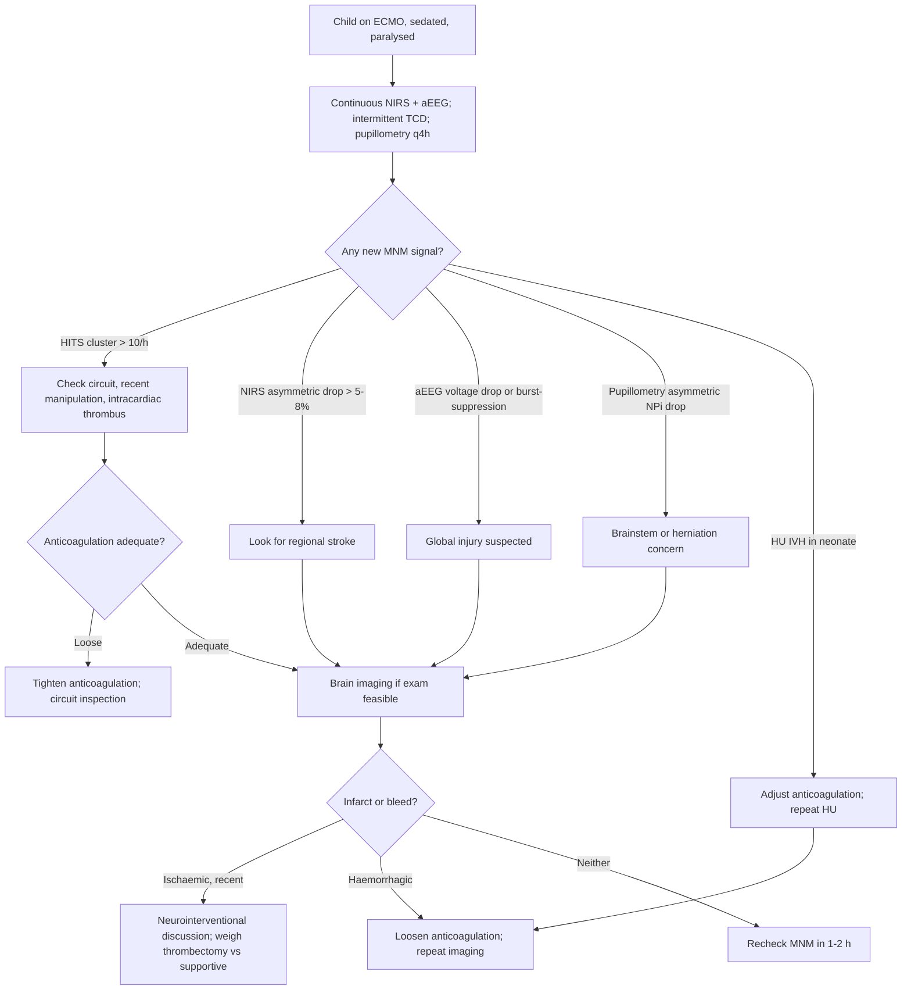

<Callout type="reference">
**Acronyms used on this page**

- **ECMO**: extracorporeal membrane oxygenation
- **VA-ECMO**: veno-arterial (cardiac + respiratory support; non-pulsatile or partially pulsatile)
- **VV-ECMO**: veno-venous (respiratory support only; preserves native cardiac output and pulsatility)
- **eCPR**: extracorporeal cardiopulmonary resuscitation (VA-ECMO initiated during arrest)
- **TCD / TCCD**: transcranial Doppler / transcranial color-coded duplex
- **HITS**: high-intensity transient signals (TCD-detected emboli, gas or solid)
- **PI**: pulsatility index (high in VV with pulsatile cardiac output; near zero in fully-supported VA)
- **MFV**: mean flow velocity
- **aEEG**: amplitude-integrated EEG (compressed display)
- **cEEG**: continuous full-montage EEG
- **NIRS**: near-infrared spectroscopy
- **rSO2**: regional oxygen saturation
- **ICH**: intracranial haemorrhage
- **AIS**: arterial ischaemic stroke
- **ACT / aPTT**: activated clotting time / activated partial thromboplastin time
- **ELSO**: Extracorporeal Life Support Organization
- **PRBC**: packed red blood cells
- **GCS**: Glasgow coma scale
</Callout>

<TldrCard>
**The 60-second version.** ECMO predisposes to stroke (haemorrhagic and ischaemic), seizures, and global hypoxic-ischaemic injury, in **15 to 30%** of children on the circuit. The neurological exam is muted by sedation and paralysis, so multimodal monitoring is essential. **The bedside MNM bundle on ECMO**: continuous bilateral NIRS, aEEG or cEEG, intermittent TCD (especially for HITS counting in VA-ECMO), pupillometry every 4 hours, and serial neuro exam off sedation when feasible. **Three patterns to watch**: (1) HITS cluster on TCD (embolic shower); (2) aEEG voltage drop or burst-suppression (global injury); (3) NIRS asymmetry or persistent low value (regional ischaemia, often M1-MCA). When two patterns converge, image. **VA-ECMO has a higher stroke rate than VV** (non-pulsatile flow, central cannulation risk, left-ventricular distension). **Anticoagulation is the central tension**: too little anticoagulation = clot and stroke; too much = bleed. MNM informs the anticoagulation conversation.
</TldrCard>

## 1. Three patient vignettes

### Vignette A. Canonical school-age VA-ECMO post-arrest

**Daniyal, 6 years old, 22 kg.** Out-of-hospital cardiac arrest from drowning; eCPR initiated in the emergency department after 35 minutes of CPR. VA-ECMO via the right femoral artery and vein. Day 3: stable circuit, ACT 180 seconds, aPTT 65, no bleeding. RASS −4, intermittent paralysis. Modalities: bilateral frontal NIRS pads, aEEG, intermittent TCD twice daily by a dedicated technologist, pupillometry every 4 hours. On day 3 morning the TCD technologist reports **a cluster of 10 HITS on the right MCA over 1 hour** (well above the usual background of 1 to 2 per hour on a stable circuit). aEEG continuity grade is unchanged. NIRS L 68 / R 60 (asymmetry approaching 8%, R lower). Pupils symmetric NPi 4.2 / 4.0. No clinical exam change (sedated). The question: clinically silent embolus burden or impending stroke? <Cite id="lorusso2017_elso_neuro" /> <Cite id="larovere2017_ecmo" />

### Vignette B. Neonatal VV-ECMO for severe meconium aspiration

**Layla, term newborn, day of life 4, on VV-ECMO for severe persistent pulmonary hypertension after meconium aspiration.** Right internal jugular dual-lumen cannula. Pulsatile native cardiac output preserved (PI on TCD ~ 0.8, lower than off-ECMO but present). Sedated and paralysed. Modalities: continuous aEEG (the neonatal mainstay), bilateral neonatal NIRS pads, daily head ultrasound (anterior fontanelle still open), intermittent TCD. Day 4 ultrasound shows a small right-sided intraventricular haemorrhage (grade II); aEEG remains continuous, normal voltage; NIRS symmetric. Anticoagulation target was aPTT 50 to 60; the team relaxes to 40 to 50 given the ICH and reassesses with a repeat ultrasound at 24 hours. The neonatal-specific point: ICH is the dominant neurological complication on neonatal ECMO and is often clinically silent; serial head ultrasound is the bedside primary surveillance tool, supplemented by aEEG continuity. <Cite id="cho2024_ecmo_outcomes" /> <Cite id="lorusso2017_elso_neuro" />

### Vignette C. Atypical: silent left M1 stroke

**Yara, 4 years old, 18 kg.** VA-ECMO day 5 for refractory cardiogenic shock from acute myocarditis. The circuit is stable; aPTT 70 seconds. Routine TCD shows a sudden **absence of the left MCA signal** (previously normal MFV 75 cm/s); the right MCA is unchanged at 70 cm/s. **NIRS L 48% / R 64%** (asymmetry 16%, well above any threshold). aEEG over the left hemisphere is suppressed compared with right. Pupillometry NPi 3.0 / 4.2 (subtle asymmetry, R higher). The team performs an urgent CT-angiography: **left M1 occlusion**. This is the silent stroke the modalities together caught despite a fully sedated, paralysed patient with no clinical exam to drift. Decision: discuss with neurointerventional; in this setting (anticoagulated, on circuit) thrombectomy is technically feasible but high-risk; the team chooses anticoagulation optimisation and supportive care given the timing (presumed > 6 hours from ictus). MRI day 7 confirms M1 territory infarct. The bedside lesson: **the four-modality bundle (TCD + NIRS + aEEG + pupillometry) caught the stroke that the clinical exam could not see**. <Cite id="cho2024_ecmo_outcomes" />

---

## 2. The clinical question

In a child on ECMO with a clinically muted exam (sedation, paralysis, post-arrest), **how do you detect evolving neurological injury before it becomes irreversible?** The integration question is which combination of TCD, aEEG, NIRS, pupillometry, and serial exam catches the most neurological events at the bedside, and how the multimodal pattern guides the anticoagulation balance.

---

## 3. Pathophysiology refresher

ECMO predisposes to neurological injury through several mechanisms. **Embolic events** arise from circuit-generated micro-emboli (gas bubbles, fibrin, platelet aggregates) and from the cannulation site (especially central cannulation of the carotid in neonates). **Ischaemic stroke** from low cerebral perfusion can develop during run-in or with circuit failure; in VA-ECMO with central or right common carotid cannulation, ipsilateral middle cerebral artery flow may be compromised. **Haemorrhagic stroke** results from systemic anticoagulation against a backdrop of consumptive coagulopathy and platelet dysfunction. **Global hypoxic-ischaemic injury** is common in eCPR survivors. **Seizures** occur in 10 to 20% of children on ECMO, often non-convulsive given paralysis. <Cite id="lorusso2017_elso_neuro" /> <Cite id="cho2024_ecmo_outcomes" /> <Cite id="naim2023_brain_injury_pccm" />

**VA-ECMO physiology and TCD.** Fully-supported VA-ECMO produces a **non-pulsatile** arterial waveform; the native heart may eject little or nothing. The TCD spectral envelope flattens (low PI, often < 0.3), the systolic peak disappears, and the trace looks like a low-amplitude oscillating line at the support flow rate. Recovery of native pulsatility (rising PI, returning systolic peak) is a positive sign of cardiac recovery. The MFV remains computable and is a useful index of cerebral blood velocity. <Cite id="larovere2017_ecmo" />

**HITS detection.** TCD detects micro-emboli passing under the probe as high-intensity transient signals: brief (< 300 ms), high-amplitude (> 3 dB above background) Doppler artefacts. Background rate on a stable circuit is typically 1 to 3 per hour; a **cluster of > 5 per hour, or > 10 over 1 hour, is suggestive of an embolic shower** that warrants investigation (circuit thrombus, gas entrainment, recent line manipulation, or an active intracardiac thrombus). HITS counting requires a dedicated technologist or fixed-headframe monitoring; it is not a routine bedside measurement. <Cite id="larovere2017_ecmo" /> <Cite id="lorusso2017_elso_neuro" />

**NIRS on ECMO.** Bilateral frontal NIRS is the most-used bedside neurological monitor on ECMO. The interpretation is **asymmetry-based**: a persistent difference > 5 to 8% between hemispheres flags regional ischaemia. Common patterns: right > left (ipsilateral right common carotid cannulation in some neonates, lowering left hemisphere flow), or new asymmetry suggesting embolic stroke. A **bilateral fall below 40%** is concerning for global hypoperfusion; absolute values < 40 to 45% predict worse outcome in pediatric ECMO cohorts. <Cite id="naim2023_brain_injury_pccm" /> <Cite id="davies2017nirs" />

**aEEG continuity.** Amplitude-integrated EEG compresses the EEG trace into a continuity grade: continuous normal voltage, discontinuous, burst-suppression, low voltage, isoelectric. The trajectory matters: a previously continuous trace becoming discontinuous or burst-suppression is a marker of evolving injury. Sansevere 2023 demonstrated that **continuous EEG on ECMO** detects subclinical seizures in 10 to 15% of pediatric ECMO patients and that abnormal background predicts worse outcome. <Cite id="sansevere2023_neonatal_ceeg" /> <Cite id="sansevere2023" /> <Cite id="naim2023_brain_injury_pccm" />

**The anticoagulation tension.** ECMO requires systemic anticoagulation (usually unfractionated heparin titrated to ACT, aPTT, or anti-Xa). Too little anticoagulation: circuit clotting, embolic stroke. Too much: intracranial haemorrhage, the leading cause of death on neonatal ECMO. The MNM stack informs the conversation: a rising HITS rate or asymmetric NIRS argues for tighter anticoagulation; a new haemorrhage on head ultrasound argues for loosening it. <Cite id="lorusso2017_elso_neuro" />

---

## 4. The multimodal picture table

| Modality | Embolic event | Ischaemic stroke | Haemorrhagic stroke | Global HIE | What it adds |
|---|---|---|---|---|---|
| **TCD HITS** | Cluster > 5 to 10/hr | Often after embolic shower | Not directly detected | Not detected | Earliest embolic signal |
| **TCD MFV / spectrum** | Unchanged unless major vessel | Loss of signal in occluded vessel | Variable | Reduced | Vessel-level patency |
| **TCD PI** | Unchanged | Variable | May fall (raised ICP) | Variable | Distal resistance proxy |
| **NIRS asymmetry** | If shower affects one side | Asymmetric drop > 5 to 8% | Often asymmetric drop | Symmetric drop | Regional surveillance |
| **NIRS absolute** | Variable | Side-specific fall | Side-specific fall | Bilateral fall < 40% | Global / regional |
| **aEEG continuity** | Unchanged unless major | Asymmetric suppression | Asymmetric or global | Global suppression, burst-suppression | Cortical function |
| **cEEG** | May show seizures | Slowing, attenuation, seizures | Slowing, blood-pattern artefact | Suppression to isoelectric | Seizure detection |
| **Pupillometry** | Often stable | Asymmetric NPi drop late | Asymmetric NPi drop | Bilateral NPi drop | Brainstem sentinel |
| **Head ultrasound (neonates)** | Not detected | Variable visualisation | Excellent for IVH | Excellent for parenchymal injury | Primary bedside imaging in neonates |
| **CT / MRI** | Not detected directly | Confirms infarct | Confirms haemorrhage | Confirms injury pattern | Definitive imaging |
| **Serial exam off sedation** | Variable | Focal deficit if any signal | Focal deficit | Coma | The reality check, when feasible |

The most useful pairings on ECMO: **TCD HITS + NIRS asymmetry** (embolic-shower-to-stroke conversion), **aEEG + cEEG** (global function plus seizure detection), and **NIRS + head ultrasound** (neonatal-specific bundle).

---

## 5. Decision tree

<Figure
  src="/images/integration/mnm-on-ecmo/embolus-detection.svg"
  alt="Schematic of HITS detection on TCD during ECMO, with a strip chart showing a cluster of high-intensity transient signals against a baseline of one or two per hour, and a corresponding NIRS asymmetry trend"
  caption="HITS detection on ECMO. Top: TCD MCA spectral envelope with annotated HITS (brief high-amplitude artefacts). Background rate of 1 to 3 HITS per hour is typical; a cluster of > 5 in a short window flags an embolic shower. Middle: HITS rate per hour over 24 hours, with the cluster at hour 14 marked. Bottom: bilateral NIRS rSO2 trend; ipsilateral side begins to fall 30 to 90 minutes after the HITS cluster as small distal emboli reduce regional perfusion. The convergent signal (HITS cluster + delayed NIRS asymmetry) is the bedside trigger for imaging."
  attribution="MNM-Edu, original schematic. SVG placeholder."
  label="Fig. 1"
/>

---

## 6. Step-by-step bedside actions

1. **Establish the MNM bundle on day 0 of ECMO**: bilateral NIRS, aEEG (or cEEG if seizure risk high), pupillometry q4h, daily head ultrasound (if fontanelle open), intermittent TCD twice daily by a trained operator.
2. **Document baseline NIRS, aEEG continuity, TCD MFV and PI, NPi** in the first 6 hours on circuit. All subsequent values interpreted as deltas.
3. **Daily sedation hold when safe** to enable a brief clinical exam (motor response, brainstem reflexes, pupillary check). On ECMO this is rarely possible in unstable circuits but should be planned when stability allows.
4. **Watch for the three canonical patterns**:
   - HITS cluster > 5 per hour (or > 10 over 1 hour) on TCD
   - Asymmetric NIRS drop > 5 to 8% sustained > 30 minutes
   - aEEG voltage drop, new discontinuity, or burst-suppression
5. **When any pattern triggers**, walk the differential before imaging: sensor / probe drift, MAP change, sedation, circuit event. Document what you ruled out.
6. **If two patterns converge** (e.g., HITS + NIRS asymmetry, or aEEG + NIRS asymmetry), **image** (head CT or MRI). The transport risk on ECMO is real; weigh against the diagnostic gain.
7. **Anticoagulation adjustment**: convene the ECMO and neurology teams. New ICH = consider lowering anticoagulation target (ACT 160 to 180 rather than 180 to 200). New infarct with embolic shower = consider tightening (anti-Xa 0.3 to 0.7 IU/mL, ACT > 200), if no bleeding.
8. **Seizure management on ECMO**: levetiracetam 60 mg/kg load is the workhorse; phenobarbital is avoided when possible (hepatic sedation, drug interactions). Continuous EEG to confirm response.
9. **Family conversation**: neurological injury rate on ECMO is 15 to 30%; the team should be transparent early. The MNM stack provides honest evidence for prognostic conversations.
10. **At decannulation**, repeat MRI within 7 days to characterise any acquired injury for prognostic and rehabilitation planning.

---

## 7. Management ladder and endpoints

| Tier | Intervention | Endpoint |
|---|---|---|
| 0 | Continuous bilateral NIRS, aEEG, daily HU (neonates), q4h pupillometry, intermittent TCD | Baseline established |
| 1 | Walk differential when single modality changes | Excluded artefact or transient |
| 2 | Bedside team review when two modalities converge | Convergent pattern confirmed |
| 3 | Imaging (CT, MRI), neurology consult | Diagnosis established |
| 4 | Anticoagulation adjustment, seizure treatment, circuit review | Targeted to lesion type |
| 5 | Neurointerventional discussion (thrombectomy in selected cases), DC for malignant infarct | Salvage; very selected cases |

**Success** looks like: no clinical neurological deterioration during ECMO, normal MRI at decannulation, age-appropriate developmental trajectory.

**Failure** looks like: large infarct or haemorrhage on imaging, refractory seizures, global hypoxic-ischaemic pattern incompatible with meaningful recovery, leading to WLST discussion.

<AlgorithmDisclaimer />

---

## 8. Variant subsections

### 8.1 VA-ECMO non-pulsatile considerations

Full VA support flattens the TCD pulsatility (PI < 0.3); the spectral envelope is a low-amplitude oscillation around the mean velocity. Mx-based autoregulation (TCD MFV vs MAP correlation) becomes unreliable because MAP itself is non-pulsatile. NIRS and aEEG become disproportionately important. Carotid cannulation (rarely used now in older children) historically caused ipsilateral ischaemia; modern femoral or jugular approaches preserve cerebral inflow. Left-ventricular distension (the failing native heart cannot eject against the high arterial circuit pressure) raises pulmonary venous pressure and can cause cardiac thrombus, a source of embolic stroke. <Cite id="larovere2017_ecmo" />

### 8.2 VV-ECMO

VV preserves native cardiac output and pulsatility; TCD looks closer to normal. Neurological injury rate is lower than VA but not zero (5 to 15%, mostly haemorrhagic). Anticoagulation requirements are similar (heparin target ACT 180 to 200 or anti-Xa 0.3 to 0.7). NIRS is still essential; cannulation site (right internal jugular) does not compromise cerebral inflow.

### 8.3 Embolic detection (HITS)

Requires a dedicated TCD technologist or fixed-headframe continuous monitoring. Manual handheld twice-daily TCD does not adequately quantify HITS rate. The decision to invest in HITS surveillance is centre-specific; the literature supports it as a marker of stroke risk in adult VA-ECMO and is emerging in pediatric. Counting protocol: 30-minute monitoring of one MCA, with the technologist annotating each HITS by intensity and duration. Background rate < 3 per hour; clusters > 5 in 30 minutes warrant investigation. <Cite id="larovere2017_ecmo" />

### 8.4 Seizure monitoring

10 to 20% of children on ECMO develop seizures; the majority are non-convulsive given paralysis and sedation. Continuous EEG is the gold standard; aEEG is a reasonable resource-limited substitute that detects 60 to 80% of seizures (misses focal posterior or basal seizures). Subclinical status epilepticus on ECMO predicts worse neurological outcome and warrants aggressive treatment. <Cite id="sansevere2023_neonatal_ceeg" /> <Cite id="herman2015acns_ceeg" />

### 8.5 Central cannulation vs peripheral

Central cannulation (sternotomy, ascending aorta and right atrium) is used in post-cardiotomy ECMO; peripheral (femoral or right internal jugular) is the more common pediatric configuration. Central carries higher bleeding risk and higher stroke risk; peripheral risks limb ischaemia at the access site. The neurological consequences of either are similar in pooled data, but the bleeding risk profile differs. <Cite id="lorusso2017_elso_neuro" />

### 8.6 Decannulation and post-ECMO surveillance

Immediately after decannulation, the brain is re-exposed to the patient's native circulation (pulsatile, on the heart's recovered or recovering function). NIRS may show transient swings; aEEG should return to baseline if the patient was not neurologically injured during the run. **MRI within 7 days of decannulation** is recommended in many pediatric centres to characterise acquired injury; the literature shows previously undetected small infarcts in 20 to 40% of survivors. <Cite id="naim2023_brain_injury_pccm" />

---

## 9. Multimodal integration matrix

| Pair | What you gain |
|---|---|
| **TCD HITS + NIRS asymmetry** | The classic embolic-to-stroke conversion sequence; HITS first, NIRS asymmetry 30 to 90 min later |
| **TCD spectrum + clinical exam (when off sedation)** | Confirms vessel-level patency and brain function together |
| **aEEG + cEEG** | aEEG flags the trend; cEEG diagnoses specific events |
| **NIRS + aEEG** | Regional hypoperfusion + cortical function; convergent change is a strong stroke signal |
| **NIRS + head ultrasound (neonates)** | Surface and deep imaging combine in the neonatal MNM bundle |
| **Pupillometry + cEEG** | Brainstem and cortex; both abnormal = severe global injury |
| **MNM bundle + MRI at decannulation** | The diagnostic closure of an ECMO run; characterises acquired injury |
| **MNM + anticoagulation monitoring** | The MNM stack informs the anticoagulation balance; the most consequential daily decision |

---

## 10. Worked alternative scenarios

### 10.1 What if the HITS cluster is gas, not solid emboli?

A 12-year-old VA-ECMO patient. TCD shows 15 HITS in 30 minutes after a circuit oxygenator change. NIRS unchanged bilaterally. aEEG unchanged. The HITS are likely **gas emboli** from the circuit change, which the brain often clears without infarction if the cluster resolves. Action: monitor closely for 4 hours, repeat TCD, expect HITS rate to fall to baseline. If NIRS or aEEG deteriorates, the picture changes to embolic stroke and you image.

### 10.2 What if aEEG suddenly drops without HITS or NIRS change?

A neonate on VV-ECMO day 5 develops sudden aEEG burst-suppression. NIRS unchanged. No HITS. The differential: subclinical seizure (paradoxically aEEG narrows during ictal-postictal cycling), sedation change, or evolving global injury. **Action**: switch to cEEG to characterise; check sedation, check temperature (hypothermia depresses aEEG), check ABG. If subclinical status, load levetiracetam. If sustained suppression with no reversible cause, head ultrasound (in neonates) or CT (in older children) to look for diffuse injury.

### 10.3 What if NIRS bilaterally falls slowly over 12 hours?

A 9-year-old VA-ECMO day 7. NIRS L 65 / R 67 at hour 0; L 50 / R 52 at hour 12. Symmetric bilateral fall. The differential: anaemia (transfusion threshold reached), inadequate flow (circuit recirculation), worsening native cardiac function with circuit demand exceeding supply, or fever raising CMRO2. Action: check haemoglobin (transfuse if < 8 g/dL), circuit flow audit, ABG, temperature. The aEEG and TCD will lag; the NIRS trend is informative early.

---

## 11. Outcome data

- **Cho 2024**: large pediatric ECMO registry analysis. Neurological injury (stroke, ICH, seizure, HIE) in 22% of pediatric ECMO runs; brain injury independently associated with mortality (OR 3 to 5). <Cite id="cho2024_ecmo_outcomes" />
- **Lorusso 2017 ELSO neurological complications**: foundational analysis of the ELSO registry; details rates of stroke, ICH, seizures across configurations. <Cite id="lorusso2017_elso_neuro" /> <Cite id="lorusso2017" />
- **La Rovere 2017 pediatric ECMO TCD**: feasibility and patterns; PI flattens on full VA; HITS detection valuable; reduced TCD signal predicts cerebral injury. <Cite id="larovere2017_ecmo" />
- **Sansevere 2023 neonatal cEEG**: continuous EEG on ECMO detects subclinical seizures in 10 to 15% of neonates; abnormal background predicts outcome. <Cite id="sansevere2023_neonatal_ceeg" /> <Cite id="sansevere2023" />
- **Naim 2023 PCCM neurological monitoring review**: places MNM as standard of care on pediatric ECMO; recommends NIRS plus aEEG as minimum bundle. <Cite id="naim2023_brain_injury_pccm" /> <Cite id="naim2023" />
- **Davies 2017 pediatric NIRS**: validates NIRS asymmetry > 5 to 8% as the actionable threshold for regional injury. <Cite id="davies2017nirs" />

---

## 12. Pitfalls

- **Relying on clinical exam alone.** Sedation and paralysis mute the exam; MNM is essential.
- **Failing to invest in HITS counting.** Without dedicated technologist or fixed-headframe TCD, HITS rate is uncountable; an embolic shower can be missed.
- **Ignoring small asymmetries.** A 6% NIRS asymmetry sustained over 30 minutes is more informative than a brief 10% transient.
- **Over-tightening anticoagulation.** Tighter heparin reduces embolic risk but raises bleed risk; the MNM stack must inform the balance.
- **Forgetting daily head ultrasound in neonates.** ICH is the dominant neurological complication on neonatal ECMO; HU is the cheap, accessible primary surveillance tool.
- **Hyperventilating to "protect the brain".** Hypocapnia constricts cerebral vessels and worsens ischaemia; maintain normocapnia.
- **Sedation with phenobarbital.** Phenobarbital depresses aEEG (confounds monitoring) and prolongs the muting of the clinical exam; use levetiracetam first.
- **Missing the silent stroke.** A clinically silent patient can still be having an evolving stroke; the four-modality bundle (TCD + NIRS + aEEG + pupillometry) is what catches it.

---

## 13. Pediatric considerations

<Pediatric>
**Five pediatric-specific points.**

1. **Neonates rely on aEEG and head ultrasound** as the primary MNM tools; cEEG is added when seizures are suspected. TCD is feasible but technically demanding through the small temporal window.

2. **Cannulation strategy affects neurological risk.** Right common carotid cannulation (rare now in older children, occasional in neonates) can compromise left hemisphere flow; the NIRS asymmetry to expect is left-lower.

3. **Drug clearance on ECMO is altered.** Levetiracetam (loading 60 mg/kg, maintenance 20 to 40 mg/kg/day) and phenobarbital (loading 20 mg/kg) have unpredictable circuit absorption; aim higher than off-ECMO doses and monitor levels when available.

4. **Sodium and glucose surveillance**: the circuit's volume distribution changes drug and electrolyte handling; sodium and glucose abnormalities can independently affect cerebral water and seizure threshold.

5. **Family communication**: neurological injury rate is high; early transparent conversations about prognostic uncertainty and the role of MNM are essential. The MNM stack provides honest evidence rather than vague reassurance. <Cite id="meert2015_palliative_care" />
</Pediatric>

---

## 14. Combine with

- [NIRS modality page](/modalities/nirs/): the workhorse on ECMO.
- [TCD / TCCD modality page](/modalities/tcd/): HITS detection and vessel-level patency.
- [aEEG and continuous EEG](/modalities/ceeg/): aEEG continuity and seizure detection.
- [Pupillometry](/modalities/pupillometry/): brainstem sentinel when exam is muted.
- [Brain death MNM integration](/integration/brain-death-mnm/): when MNM informs the end-of-care conversation.
- [HIE in the newborn integration](/integration/mnm-in-the-newborn/): related neonatal MNM bundle.
- [Discordance triage](/integration/discordance-triage/): when modalities disagree.
- [Family communication MNM](/integration/family-communication-mnm/): the conversation framework.

---

<DeepDive>

## 15. Evidence summary and recent literature (2022 to 2025)

### Foundational

| Topic | Reference | Grade |
|---|---|---|
| ELSO neurological complications | <Cite id="lorusso2017_elso_neuro" /> <Cite id="lorusso2017" /> | A |
| Pediatric ECMO TCD | <Cite id="larovere2017_ecmo" /> | B |
| Pediatric NIRS | <Cite id="davies2017nirs" /> <Cite id="andresen2014nirs" /> | B |
| cEEG on ECMO | <Cite id="sansevere2023_neonatal_ceeg" /> <Cite id="herman2015acns_ceeg" /> | B |
| Pediatric neuromonitoring consensus | <Cite id="leroux2014_neurocrit_consensus" /> | expert |

### Recent literature (2022 to 2025)

- **Cho 2024**: large pediatric ECMO registry analysis on brain injury and outcome; the most current numbers on rates and mortality association. <Cite id="cho2024_ecmo_outcomes" />
- **Naim 2023 PCCM**: pediatric brain injury during ECMO; MNM bundle recommendations. <Cite id="naim2023_brain_injury_pccm" /> <Cite id="naim2023" />
- **Sansevere 2023 neonatal cEEG**: subclinical seizure detection rates on neonatal ECMO. <Cite id="sansevere2023_neonatal_ceeg" /> <Cite id="sansevere2023" />
- **Helbok 2024 pediatric MMM update**: ECMO chapter places NIRS + aEEG as minimum bundle; cEEG and TCD as tier 2. <Cite id="helbok2024_pediatric_mmm" />
- **Figaji 2025 pediatric MMM consensus**: same framework, with explicit MNM recommendations for ECMO surveillance. <Cite id="figaji2025_mmm_pediatric_consensus" />
- **Tasker 2023 PCCM review**: integrative pediatric MMM review including ECMO. <Cite id="tasker2023_pccm_review" /> <Cite id="tasker2023mnm" />

</DeepDive>

---

## 16. Self-check

<Quiz
  questions={[
    {
      id: 'q1',
      prompt: 'A 6-year-old on VA-ECMO day 3 post-eCPR. The TCD technologist reports 10 HITS on the right MCA over 1 hour (background usually 1 to 2 per hour). NIRS L 68 / R 60, asymmetry 8%. aEEG continuous, pupils symmetric, sedated. What is the most defensible next step?',
      options: [
        { id: 'a', label: 'Ignore the HITS; the patient is clinically stable' },
        { id: 'b', label: 'Urgent CT angiography to look for a right MCA infarct; review circuit and anticoagulation' },
        { id: 'c', label: 'Loosen anticoagulation to reduce HITS' },
        { id: 'd', label: 'Increase sedation to reduce metabolic demand' },
      ],
      answer: 'b',
      explanation: 'A HITS cluster (> 10/hr) plus a developing NIRS asymmetry > 5 to 8% on the same side is the canonical embolic-to-stroke conversion sequence. Imaging is the next defensible step. Ignoring the HITS misses an evolving stroke. Loosening anticoagulation is the opposite of what is needed (HITS suggest embolic source). Increasing sedation does not address the cause.',
    },
    {
      id: 'q2',
      prompt: 'A term newborn on VV-ECMO day 4 for meconium aspiration. Daily head ultrasound shows a new grade II right intraventricular haemorrhage. aEEG continuous, NIRS symmetric, no clinical change (sedated and paralysed). Anticoagulation target was aPTT 50 to 60. What is the most appropriate response?',
      options: [
        { id: 'a', label: 'Continue current anticoagulation target; grade II IVH is benign' },
        { id: 'b', label: 'Loosen anticoagulation target to aPTT 40 to 50 and repeat head ultrasound in 24 h to confirm stability' },
        { id: 'c', label: 'Stop anticoagulation entirely' },
        { id: 'd', label: 'Add prophylactic anti-seizure medication immediately' },
      ],
      answer: 'b',
      explanation: 'A new IVH on neonatal ECMO is the canonical trigger to loosen anticoagulation cautiously and monitor for progression. Stopping anticoagulation entirely risks circuit clotting. Continuing the prior target risks IVH extension. Prophylactic anti-seizure medication is not standard without clinical or aEEG evidence of seizures.',
    },
    {
      id: 'q3',
      prompt: 'A 4-year-old on VA-ECMO day 5 for myocarditis. Routine TCD shows absent left MCA signal; NIRS L 48 / R 64 (asymmetry 16%); aEEG over left hemisphere suppressed; NPi 3.0 / 4.2. What is the convergent multimodal interpretation?',
      options: [
        { id: 'a', label: 'Technical artefact; the TCD operator missed the vessel' },
        { id: 'b', label: 'Silent left M1 ischaemic stroke; image urgently and discuss anticoagulation optimisation; consider neurointerventional consult if within thrombectomy window' },
        { id: 'c', label: 'Sedation effect; reduce sedation and reassess' },
        { id: 'd', label: 'Wait until decannulation MRI; nothing to do now' },
      ],
      answer: 'b',
      explanation: 'Four convergent modalities (TCD vessel loss, NIRS asymmetry, aEEG suppression, pupillometry asymmetry) on the same side is the classic silent stroke picture on ECMO. Imaging is mandatory; thrombectomy may be considered if within window, though anticoagulated patients on ECMO are high-risk for intervention. Waiting until decannulation forfeits any chance of intervention. Sedation does not produce focal hemispheric findings.',
    },
  ]}
/>
