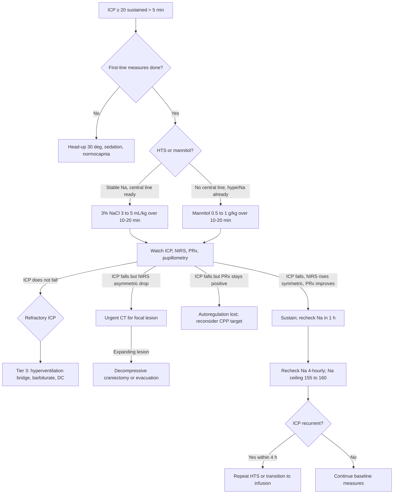

<Callout type="reference">
**Acronyms used on this page**

- **TBI**: traumatic brain injury (severe = GCS 3 to 8)
- **ICP / CPP / MAP**: intracranial / cerebral perfusion / mean arterial pressure
- **NIRS**: near-infrared spectroscopy, regional cortical tissue oxygenation
- **rSO2**: regional oxygen saturation (NIRS readout)
- **PRx**: pressure reactivity index, MAP-ICP correlation autoregulation surrogate
- **HTS**: hypertonic saline (3%, 7.5%, or 23.4% depending on the bolus protocol)
- **PbtO2**: brain tissue oxygen partial pressure (mmHg)
- **BBB**: blood-brain barrier
- **PRBC**: packed red blood cells
- **EVD**: external ventricular drain
- **NPi**: neurological pupil index (pupillometer-derived, 0 to 5 scale)
- **CMRO2**: cerebral metabolic rate for oxygen
- **DC**: decompressive craniectomy
- **PBTF**: Pediatric Brain Trauma Foundation
</Callout>

<TldrCard>
**The 60-second version.** Osmotherapy is the second-tier bedside response to raised ICP after head positioning, sedation, and CO2 control fail. **3% hypertonic saline 3 to 5 mL/kg over 10 to 20 minutes** is the pediatric workhorse. The expected multimodal signature: **ICP falls within 5 to 30 minutes**, **CPP rises**, **NIRS rSO2 transiently rises bilaterally**, **PRx improves**, **pupillometry stable or normalising**. The two failure modes the multimodal stack catches: (1) ICP falls globally but a **regional NIRS drop later** reveals an expanding focal lesion under the unsampled hemisphere; (2) ICP falls but **PRx stays high** suggesting autoregulation is broken, you need lower CPP not higher. **HTS is preferred over mannitol** in pediatric severe TBI in most modern protocols (reflection coefficient ~1.0, less hypotension, no osmotic diuresis). Watch sodium ceiling (155 to 160 mmol/L). Pair with CT if the global signal does not match the regional signal.
</TldrCard>

## 1. Three patient vignettes

### Vignette A. Canonical school-age severe TBI

**Yusuf, 9 years old, 28 kg.** Severe TBI from a high-speed bicycle vs car collision. GCS 6 at scene; intubated, sedated, paralysed for transport. Day 1 of admission. Right frontal Camino bolt (ICP only), bilateral frontal NIRS pads, arterial line for MAP and PRx, pupillometry every 4 hours. Current state at hour 6: **ICP 28, MAP 80, CPP 52, PRx +0.32**. Pupils symmetric, NPi 4.0 / 4.1. NIRS L 58% / R 60% (down from baseline 65 / 66). CPP is below the age-band floor (50 mmHg for 7 to 12 years; PBTF recommendation is to keep it comfortably above the floor in severe TBI). The team decides on **3% NaCl 5 mL/kg = 140 mL over 20 minutes** through the central line. Expected: ICP fall by 30 minutes, NIRS rise modestly, CPP rise, PRx improve. What actually happens at hour 2 changes the case. <Cite id="kochanek2019_pbtf4" /> <Cite id="kochanek2019pbtf" />

### Vignette B. Infant severe TBI

**Ahmad, 14 months, 9 kg.** Severe TBI from an unwitnessed fall (mechanism uncertain; non-accidental injury workup ongoing). GCS 5 at admission. Bifrontal contusions on CT. Anterior fontanelle still open; bedside cranial ultrasound is feasible. Frontal Camino bolt placed (pediatric-sized). Bilateral neonatal NIRS pads (smaller optode footprint). Current state day 1, hour 8: **ICP 22, MAP 62, CPP 40, PRx +0.18**. The age-banded CPP floor is 40 mmHg for an infant; he is on the floor. Sodium baseline 138; urine output 0.5 mL/kg/h (adequate). The team escalates to **3% NaCl 3 mL/kg = 27 mL over 10 minutes** (a smaller per-kg dose given the rapid rise of sodium in infants). Mannitol is the alternative; here HTS is preferred to avoid osmotic diuresis in a young infant whose volume status is fragile. Expected: ICP fall by 20 minutes. The infant-specific point: the open fontanelle allows some compensation, so ICP may not be as informative as in older children; the **bulging fontanelle on bedside exam** is a complementary sign of evolving raised ICP. <Cite id="kochanek2019_pbtf4" /> <Cite id="kochanek2019" />

### Vignette C. Atypical: global ICP falls, regional NIRS reveals an expanding contusion

**Yusuf at hour 2 post-bolus.** Initial response was textbook: ICP 28 → 19 over 30 minutes; NIRS rose to 63 / 64; CPP 67; PRx fell to +0.18; pupillometry unchanged. The team was content. Sodium drawn at 1 hour: 144 mmol/L (target 145 to 150). **At hour 2, L NIRS drops from 63% to 57% over 30 minutes; R unchanged at 64%.** Asymmetry now 7%, approaching the 8 to 10% clinical threshold. ICP holds at 19, CPP 64, PRx +0.12, pupils NPi 4.0 / 4.1. Differential: sedation re-deepening (would raise rSO2, not lower it: inconsistent), MAP drift (checked, stable), HTS rebound (uncommon with HTS, reflection coefficient ~1.0), or **regional pathology evolving under the L optode**. The team repositions the L pad (excludes sensor drift), checks pupillometry (unchanged), confirms PRx stable, then **calls for urgent CT**. CT shows an evolving left frontal contusion with 4 mm midline shift, under the L NIRS pad but **on the contralateral side from the right-sided Camino bolt**. The bolt did not see it. NIRS did. Decision: decompressive craniectomy. **The lesson: a global metric that looks fine does not exclude regional pathology; NIRS asymmetry is the only modality that would have caught this contusion in time.** <Cite id="davies2017nirs" /> <Cite id="andresen2014nirs" />

---

## 2. The clinical question

In a child with raised ICP receiving osmotherapy, **what does each modality show during and after the bolus, and how do you tell a successful response from a masked complication?** The integration question is whether the multimodal trio (ICP + CPP + NIRS, with PRx and pupillometry as supports) confirms uniform brain improvement or reveals a hidden regional problem.

---

## 3. Pathophysiology refresher

Hyperosmolar therapy works by **establishing an osmotic gradient across the blood-brain barrier**. A bolus of hypertonic saline or mannitol raises plasma osmolality by 5 to 10 mOsm/L; free water shifts from brain interstitium and intracellular compartments into plasma, reducing brain volume and lowering ICP within minutes. The **reflection coefficient** of the solute matters: sodium has a reflection coefficient near 1.0 (essentially impermeable across an intact BBB), mannitol approximately 0.9. A higher reflection coefficient preserves the osmotic gradient longer and reduces rebound oedema when the BBB is mildly disrupted, the typical post-TBI state. <Cite id="cottenceau2011" /> <Cite id="mortazavi2012" /> <Cite id="fisher1992" />

**Time course.** ICP begins to fall within 5 to 15 minutes of HTS (faster than mannitol's 15 to 30 minutes) and the effect lasts 4 to 6 hours. Mannitol's effect lasts 2 to 4 hours and is accompanied by an **osmotic diuresis** that can dehydrate, drop MAP, and worsen CPP, the principal reason most modern pediatric protocols favour HTS over mannitol. <Cite id="kochanek2019_pbtf4" /> <Cite id="roberts2019" />

**Why does NIRS rise?** Falling ICP raises CPP at constant MAP. Higher CPP, in a brain with at-least-partially-preserved autoregulation, results in higher cerebral blood flow and more oxygen delivery to the cortex under the optode. The rise is usually 3 to 6% in rSO2 and is **bilaterally symmetric** in global ICP rises. A unilateral rise or fall (asymmetry > 5 to 8%) suggests focal pathology under one optode, the Vignette C scenario. <Cite id="davies2017nirs" /> <Cite id="andresen2014nirs" /> <Cite id="hyttel2015" />

**Why does PRx improve?** PRx is the moving-window correlation between MAP and ICP. When ICP is high and CPP is below the lower autoregulation limit (LLA), vessels are maximally dilated; small MAP changes pass directly into ICP changes (positive PRx). When CPP rises into the autoregulatory plateau, vessels can buffer MAP changes; PRx falls toward zero or negative. A PRx that fails to improve after a successful ICP drop suggests autoregulation is broken at any CPP, a worse prognostic sign. <Cite id="aries2012" /> <Cite id="czosnyka1997prx" />

**Sodium and renal load.** HTS raises plasma sodium predictably (approximately 1 mmol/L per 1 mL/kg of 3%). The ceiling is **155 to 160 mmol/L**; beyond this, the risk of osmotic demyelination on the way down and of renal injury rises. Mannitol does not raise sodium but raises serum osmolality directly and drives an osmotic diuresis. **Check sodium 1 hour post-bolus and 4-hourly thereafter** during active osmotherapy. <Cite id="kochanek2019_pbtf4" />

**Pupillometry adds the brainstem sentinel.** Asymmetric pupil dilation or NPi < 3.0 unilaterally is a marker of uncal herniation; bilateral NPi drop to 0 is end-stage. Pupillometry should be unchanged or improving during a successful osmotherapy response; any deterioration despite an ICP fall is a red flag for ongoing herniation independent of the global ICP. <Cite id="oddo2018_npi_orange" /> <Cite id="oddo2018" />

---

## 4. The multimodal picture table

| Modality | Successful response | Failure or complication | What it adds |
|---|---|---|---|
| **ICP** | Falls 5 to 15 mmHg within 30 min | No fall, or transient fall then rebound | The primary endpoint |
| **CPP** | Rises with falling ICP (constant MAP) | Falls (MAP drop from mannitol diuresis) | Confirms perfusion benefit |
| **NIRS rSO2 bilateral** | Rises 3 to 6% symmetric | Asymmetric drop = regional pathology | Catches focal lesions invisible to ICP |
| **PRx** | Falls toward zero | Stays positive = lost autoregulation | Tells you if you can use CPP as a lever |
| **Pupillometry NPi** | Stable or improving | Asymmetric drop = herniation | Brainstem sentinel |
| **Sodium** | Rises 2 to 5 mmol/L per dose | Climbs above 160 = stop and switch | Safety ceiling |
| **Urine output** | Stable (HTS) or rises (mannitol) | Massive diuresis on mannitol = volume crisis | Mechanism distinguishes HTS from mannitol |
| **PbtO2 (if present)** | Rises with improved CPP | Falls = tissue still hypoperfused | Tissue verification |
| **Clinical exam** | Stable or improving | Worsening despite ICP fall = something else | The reality check |

The most useful pairings: **ICP + bilateral NIRS** (catches regional masked complications), **ICP + CPP + PRx** (confirms the haemodynamic mechanism), **ICP + pupillometry** (brainstem safety net), and **ICP + sodium** (safety ceiling).

---

## 5. Decision tree

<Figure
  src="/images/integration/osmotherapy-icp-nirs/triple-trend.svg"
  alt="Triple-trend strip chart showing ICP falling, NIRS rSO2 rising symmetrically, and CPP rising after HTS bolus, with a second-hour asymmetric NIRS drop on the left flagging an evolving contusion"
  caption="Triple-trend after a 3% HTS bolus at time 0. Top: ICP (mmHg) falls from 28 to 19 over 30 minutes and holds. Middle: bilateral NIRS rSO2 rises from 58 / 60 to 63 / 64 by 30 minutes (symmetric), then the L trace begins to fall at hour 2 while the R holds; asymmetry crosses the 5 to 8% clinical threshold. Bottom: CPP rises from 52 to 67 with MAP stable. The shaded box at hour 2 marks the moment of clinical recognition: the global signals look fine, but the regional NIRS asymmetry triggers the CT that finds an expanding contusion."
  attribution="MNM-Edu, original schematic. SVG placeholder."
  label="Fig. 1"
/>

---

## 6. Step-by-step bedside actions

1. **Verify first-line measures**: head-up 30 degrees, neck neutral (no jugular venous obstruction), adequate sedation (RASS −4 to −5), normocapnia (PaCO2 35 to 40), normoxia, normothermia. Do not skip these; they often resolve mild to moderate ICP rises without escalation.
2. **Confirm trigger criteria**: ICP > 20 mmHg sustained > 5 minutes, or rising trend with falling CPP, or pupillary change.
3. **Choose the agent**:
   - HTS first if sodium < 155, central line in place, no major heart failure or pulmonary oedema concern.
   - Mannitol if no central line and HTS unavailable, or if volume-overloaded (mannitol's diuresis is helpful here).
4. **Calculate the dose**:
   - **3% NaCl: 3 to 5 mL/kg** over 10 to 20 minutes (max single dose typically 250 mL for adolescents). Yusuf at 28 kg: 84 to 140 mL.
   - **Mannitol: 0.5 to 1 g/kg** over 10 to 20 minutes. Yusuf at 28 kg: 14 to 28 g (= 70 to 140 mL of 20% mannitol).
5. **Document baseline multimodal state** in the 5 minutes before the bolus: ICP, MAP, CPP, NIRS L and R, PRx, NPi, sodium.
6. **Administer through a central line** ideally; peripheral 3% is acceptable for one rescue dose but risks extravasation injury.
7. **Recheck multimodal state at 15 min, 30 min, 60 min** post-bolus. Expected: ICP fall by 15 min, plateau by 60 min.
8. **Send sodium at 1 hour** post-bolus, and 4-hourly thereafter during sustained osmotherapy. Stop or switch if sodium > 155 to 160.
9. **If NIRS asymmetry develops**, walk the differential (sensor drift, sedation, MAP, regional pathology) before reaching for imaging. Reposition the pad first; if asymmetry persists despite stable global signals, image.
10. **Plan the next dose or transition to infusion** if ICP rebounds. Continuous 3% NaCl infusion at 0.1 to 1 mL/kg/h is an alternative to repeated bolus.

---

## 7. Management ladder and endpoints

| Tier | Intervention | Endpoint to escalate |
|---|---|---|
| 0 | Head positioning, sedation, normocapnia, normothermia | ICP > 20 sustained > 5 min |
| 1 | First HTS or mannitol bolus | No fall in 30 min, or rebound within 1 h |
| 2 | Second bolus or transition to HTS infusion | Sodium ceiling reached; refractory ICP |
| 3 | Mild hyperventilation bridge (PaCO2 30 to 35) for impending herniation | Brief use only; do not maintain |
| 4 | Barbiturate (pentobarbital) coma | Pharmacological MMM endpoint; cEEG burst-suppression |
| 5 | Decompressive craniectomy | Salvage; refractory raised ICP despite tier 1 to 4 |

**Success** looks like: ICP < 20, CPP within age-band or CPPopt band, PRx near zero, NIRS symmetric, sodium 145 to 155, no new infarct on imaging.

**Failure** looks like: refractory ICP, sodium > 160 with no further effect, expanding focal lesion identified late, sustained NIRS asymmetry not explained by sensor or MAP.

<AlgorithmDisclaimer />

---

## 8. Variant subsections

### 8.1 HTS vs mannitol

| Property | 3% HTS | Mannitol 0.5 g/kg |
|---|---|---|
| Onset | 5 to 15 min | 15 to 30 min |
| Duration | 4 to 6 h | 2 to 4 h |
| Reflection coefficient | ~1.0 | ~0.9 |
| BBB-disruption rebound | Less | More |
| Hypotension risk | Less | More (osmotic diuresis) |
| Volume status effect | Volume-expanding | Volume-depleting |
| Sodium effect | Rises (ceiling 155-160) | Unchanged |
| Renal load | Sodium load | Osmotic diuresis |
| Pediatric protocol preference | First-line in most modern protocols | Alternative when HTS unavailable |

The pediatric tilt toward HTS is driven by three things: better haemodynamic profile (no diuresis), higher reflection coefficient (less rebound), and easier dosing (mL/kg of a stocked 3% bag). Mannitol remains useful in volume-overloaded patients or where HTS is unavailable. <Cite id="cottenceau2011" /> <Cite id="mortazavi2012" /> <Cite id="kochanek2019_pbtf4" />

### 8.2 Age-banded dosing

- **Neonate / infant (< 1 yr)**: HTS 3% at 2 to 3 mL/kg over 10 min; sodium watch every hour for the first 4 hours.
- **Toddler (1 to 3 yr)**: HTS 3% at 3 to 4 mL/kg over 10 to 15 min.
- **School-age (4 to 12 yr)**: HTS 3% at 3 to 5 mL/kg over 15 to 20 min.
- **Adolescent (13 to 18 yr)**: HTS 3% at 3 to 5 mL/kg or 250 to 500 mL adult-style bolus over 20 min.

Mannitol pediatric dose: 0.25 to 1 g/kg, common starting dose 0.5 g/kg over 15 to 20 min.

The younger the child, the smaller the per-kg dose and the more frequent the sodium check. <Cite id="kochanek2019_pbtf4" />

### 8.3 Severe TBI bolus protocol

In severe TBI, osmotherapy is tier-2 in the pediatric ICP escalation ladder. Sequence: head-of-bed elevation, sedation, CSF drainage if EVD present, then HTS bolus. The bolus is a **trial**; if ICP does not fall by 30 minutes, escalate rather than re-dosing. Maintain sodium 145 to 155 with continuous HTS infusion if recurrent doses needed.

### 8.4 DKA pre-emptive osmotherapy

When DKA cerebral oedema is suspected (Glaser criteria), HTS or mannitol is given **before** CT confirmation. See the [DKA cerebral oedema integration](/integration/dka-cerebral-edema/) for the full Asher case. The dose is the same (3% NaCl 5 mL/kg); the urgency is higher because the trajectory from headache to herniation can be 1 to 2 hours.

### 8.5 Post-stroke malignant MCA syndrome

Large MCA infarcts cause swelling and herniation in days 2 to 5. HTS can buy time pending decompressive craniectomy in adolescents and adults; in young children, DC is more often the first option. Pediatric malignant MCA is rare; adult evidence and centre-specific protocols dominate. NIRS asymmetry over the infarct hemisphere is informative. <Cite id="roberts2019" />

### 8.6 Refractory case: sodium ceiling reached

When sodium hits 158 to 160 and ICP is still elevated, options narrow: switch to mannitol (different osmotic mechanism, no further sodium rise), barbiturate coma (deep CMRO2 suppression), or DC. The multimodal monitoring continues to inform: a brain with PRx +0.5 will not benefit from raising CPP; one with stable PRx might. Always include the neurosurgeon in the conversation early.

---

## 9. Multimodal integration matrix

| Pair | What you gain |
|---|---|
| **ICP + bilateral NIRS** | Catches regional masked complications; Vignette C is the canonical example. <Cite id="davies2017nirs" /> |
| **ICP + CPP** | Confirms the perfusion benefit of falling ICP at constant MAP |
| **ICP + PRx** | Tells you whether falling ICP also restores autoregulation, important for next-step CPP decisions |
| **ICP + pupillometry** | Brainstem sentinel; pupillometry can deteriorate even when global ICP falls if herniation continues |
| **ICP + sodium** | Safety ceiling; the rate-limiting variable for sustained HTS therapy |
| **ICP + PbtO2** | Tissue verification; the gold-standard tissue check on the perfusion response |
| **NIRS + clinical exam** | Bilateral NIRS plus a hourly neuro exam catches focal pathology before imaging |
| **CPP + PRx (CPPopt)** | If CPPopt is running, the post-osmotherapy CPP may now be within the CPPopt band, telling you the manoeuvre worked. <Cite id="aries2012cppopt" /> |

---

## 10. Worked alternative scenarios

### 10.1 What if ICP does not fall after the bolus?

Yusuf at 30 min: ICP still 27. CPP 53. NIRS unchanged. Differential: dose too small (rare with 5 mL/kg), HTS leakage (the line was patent), severe BBB disruption (rebound osmotic gradient lost quickly), or **a non-osmotic-responsive cause** like an expanding mass lesion. The action: confirm line patency, repeat sodium (was the bolus actually delivered?), and **escalate to imaging** to look for a surgical lesion. Refractory ICP after a correctly-administered HTS bolus is an indication for urgent CT.

### 10.2 What if NIRS falls instead of rises?

ICP fell from 28 to 19 as expected, but NIRS dropped from 60% bilaterally to 55%. This is **paradoxical** and worth investigating. Possible causes: a vasovagal MAP dip (check MAP), a sedation dose change (rare to fall this way), or a global cerebral perfusion event coincident with the bolus. Walk the differential before assuming HTS caused the drop; HTS rarely lowers NIRS in a brain with intact perfusion.

### 10.3 What if pupillometry deteriorates despite ICP falling?

Yusuf's NPi drops from 4.0 / 4.1 to 3.0 / 4.1 (asymmetric, R now lower) at hour 2, while ICP is holding at 19. **Uncal herniation can progress despite a falling global ICP** if a focal lesion is expanding and herniating against the brainstem. The asymmetric NIRS in Vignette C, plus deteriorating pupillometry, plus stable global ICP, is a near-classic picture of a missed contralateral expanding contusion. Urgent CT, then surgical decision.

---

## 11. Outcome data

- **Roberts 2019 Cochrane review**: pediatric HTS in severe TBI lowers ICP effectively; no clear outcome benefit over mannitol on pooled data, but adverse event profile favours HTS. <Cite id="roberts2019" />
- **Cottenceau 2011 RCT (adult)**: HTS vs mannitol in 47 severe TBI; both lower ICP, HTS lowers it faster and with greater amplitude. <Cite id="cottenceau2011" />
- **Mortazavi 2012 meta-analysis**: 14 studies (largely adult); HTS more effective than mannitol for refractory ICP. <Cite id="mortazavi2012" />
- **Kochanek 2019 PBTF guidelines** (4th edition): HTS recommended as first-line osmotherapy in pediatric severe TBI; mannitol acceptable alternative; sodium ceiling 155 to 160 mmol/L. <Cite id="kochanek2019_pbtf4" /> <Cite id="kochanek2019pbtf" /> <Cite id="kochanek2019" />
- **Fisher 1992**: foundational paper on the reflection-coefficient concept that underlies all osmotherapy. <Cite id="fisher1992" />
- **Davies 2017**: NIRS in pediatric TBI; sensitivity for regional ischaemia, limitations of optode footprint. <Cite id="davies2017nirs" />
- **Andresen 2014**: NIRS validation in pediatric ICU; asymmetric drop > 5 to 8% is the actionable threshold. <Cite id="andresen2014nirs" />

---

## 12. Pitfalls

- **Treating mild ICP rises with osmotherapy.** Tier 0 measures (head-of-bed, sedation, normocapnia) resolve most transient rises; osmotherapy is tier 2 for sustained ICP > 20.
- **Skipping the sodium check.** Sodium climbs predictably; missing it leads to hypernatraemia, with brain shrinkage on the way up and demyelination risk on the way down.
- **Ignoring NIRS asymmetry.** A focal contusion under the unsampled hemisphere is the canonical missed lesion; bilateral NIRS catches it.
- **Repeating boluses without reassessing.** Each bolus is a trial; if the first does not work, investigate rather than repeat. Refractory ICP needs imaging, not more dose.
- **Mannitol diuresis crashes MAP.** Mannitol's osmotic diuresis can drop MAP by 10 to 20 mmHg over the first hour; in a patient with borderline CPP this can cause secondary insult. HTS avoids this.
- **Peripheral HTS in the wrong line.** 3% NaCl can cause extravasation injury through small peripheral cannulae; use a large-bore peripheral or a central line.
- **Ignoring pupillometry while watching the bolt.** The brainstem can herniate even with a falling global ICP; pupillometry is the brainstem-specific check.
- **Hyperventilation as default tier 2.** Sustained hyperventilation worsens outcome (vasoconstriction-induced ischaemia); use only as a brief bridge for impending herniation, not as a chronic ICP-control strategy. <Cite id="marion2002" />

---

## 13. Pediatric considerations

<Pediatric>
**Five pediatric-specific points.**

1. **HTS dose is per-kg, not adult-bolus.** 3% NaCl 3 to 5 mL/kg, capped at adolescent adult-style 250 to 500 mL boluses.

2. **Sodium ceiling is age-tolerant within limits.** Pediatric protocols allow 155 to 160 mmol/L. Beyond 160, switch agents or escalate to barbiturate / DC.

3. **Mannitol's diuresis is more harmful in small children.** Their volume reserve is limited; a 20 mL/kg urine output post-mannitol can crash MAP rapidly. HTS is volume-neutral or volume-expanding, preferred in fragile patients.

4. **Open fontanelle changes the ICP equation.** In infants under approximately 18 months with an open anterior fontanelle, the cranium has some compliance; ICP may underestimate the true intracranial state. **Add bedside fontanelle exam to the multimodal stack** for infants.

5. **NIRS optode size matters.** Neonatal NIRS pads have a smaller footprint and sample only the most superficial cortex. Adult pads on a small infant head can produce non-physiological readings from scalp contamination. Use age-appropriate pads. <Cite id="davies2017nirs" />
</Pediatric>

---

## 14. Combine with

- [ICP monitoring](/modalities/icp/): the foundation for the bolus trigger.
- [NIRS](/modalities/nirs/): bilateral regional surveillance.
- [PRx and autoregulation](/foundations/autoregulation/): why PRx improvement matters.
- [Pupillometry](/modalities/pupillometry/): brainstem sentinel.
- [CPPopt targeting integration](/integration/cppopt-targeting/): how the post-bolus CPP relates to the CPPopt band.
- [DKA cerebral oedema integration](/integration/dka-cerebral-edema/): pre-emptive osmotherapy.
- [Meningitis / encephalitis integration](/integration/meningitis-encephalitis/): non-invasive ICP triggers for osmotherapy.
- [Brain death MNM](/integration/brain-death-mnm/): when osmotherapy is no longer indicated.

---

<DeepDive>

## 15. Evidence summary and recent literature (2022 to 2025)

### Foundational

| Topic | Reference | Grade |
|---|---|---|
| Reflection coefficient | <Cite id="fisher1992" /> | foundational |
| HTS vs mannitol RCT (adult) | <Cite id="cottenceau2011" /> | B |
| Meta-analysis | <Cite id="mortazavi2012" /> | A |
| Cochrane (pediatric) | <Cite id="roberts2019" /> | A |
| PBTF 4th edition | <Cite id="kochanek2019_pbtf4" /> <Cite id="kochanek2019pbtf" /> | expert |
| NIRS in pediatric TBI | <Cite id="davies2017nirs" /> <Cite id="andresen2014nirs" /> | B |
| Hyperventilation harm | <Cite id="marion2002" /> | B |

### Recent literature (2022 to 2025)

- **Helbok 2024 pediatric MMM update**: HTS as first-line osmotherapy; NIRS as regional surveillance; sodium ceiling 155 to 160. <Cite id="helbok2024_pediatric_mmm" />
- **Figaji 2025 pediatric MMM consensus**: same recommendations; emphasises the multimodal stack rather than ICP alone for treatment decisions. <Cite id="figaji2025_mmm_pediatric_consensus" />
- **Tasker 2023 PCCM review**: osmotherapy in the broader pediatric MMM framework; tier-2 escalation with a focus on convergent multimodal endpoints. <Cite id="tasker2023_pccm_review" />
- **Hawthorne 2014 ICP review (still cited)**: ICP-dose framework that underpins the rationale for aggressive control. <Cite id="hawthorne2014icp" />
- **Hartings 2024 SD intervention review**: spreading depolarisations as a parallel mechanism that osmotherapy may also dampen indirectly. <Cite id="hartings2024_sd_intervention" />
- **Kochanek 2019 PBTF (still the operative guideline)**: the most current pediatric severe TBI bundle; HTS, sedation, CSF drainage, and DC in escalating tiers. <Cite id="kochanek2019_pbtf4" />

</DeepDive>

---

## 16. Self-check

<Quiz
  questions={[
    {
      id: 'q1',
      prompt: 'A 9-year-old 28 kg severe TBI day 1, hour 6. ICP 28 mmHg sustained > 5 min, MAP 80, CPP 52, PRx +0.32. NIRS L 58 / R 60 (down from baseline 65 / 66). NPi 4.0 / 4.1. Sodium 138, no central line yet (placed 2 minutes ago). What is the best single next action?',
      options: [
        { id: 'a', label: 'Hyperventilate to PaCO2 28 to lower ICP immediately' },
        { id: 'b', label: 'Give 3% NaCl 5 mL/kg = 140 mL over 20 minutes through the new central line' },
        { id: 'c', label: 'Wait and reassess in 30 minutes; ICP may settle' },
        { id: 'd', label: 'Bolus 20 mL/kg of normal saline first to expand intravascular volume' },
      ],
      answer: 'b',
      explanation: 'Sustained ICP > 20 with low CPP and positive PRx in severe TBI is the tier-2 indication for osmotherapy. HTS is first-line in modern pediatric protocols (better haemodynamic profile, higher reflection coefficient). Hyperventilation is harmful as a chronic strategy. Waiting risks secondary injury. Normal saline bolus would not durably lower ICP and could increase brain water content.',
    },
    {
      id: 'q2',
      prompt: 'Same Yusuf, 2 hours after a successful HTS bolus. ICP holds at 19, CPP 64, PRx +0.12, pupillometry stable. NIRS L drops from 63 to 57 over 30 minutes while R stays at 64. Sensor reposition does not change the reading. What is the most defensible next step?',
      options: [
        { id: 'a', label: 'Repeat HTS bolus; NIRS suggests recurrent oedema' },
        { id: 'b', label: 'Accept the asymmetry; the global metrics are fine' },
        { id: 'c', label: 'Urgent CT to look for an expanding focal lesion under the L optode' },
        { id: 'd', label: 'Decrease sedation to wake the patient for exam' },
      ],
      answer: 'c',
      explanation: 'Sustained asymmetric NIRS drop > 5 to 8%, with stable global signals, is the canonical signature of a regional pathology invisible to a single-side ICP probe. The differential (sensor, sedation, MAP) has been walked; the next defensible step is imaging. Repeating HTS without knowing the cause risks delaying surgical decompression. Decreasing sedation in a patient with unstable ICP physiology is dangerous.',
    },
    {
      id: 'q3',
      prompt: 'A 14-month-old severe TBI day 1. After two HTS boluses, sodium is now 159 mmol/L and ICP is still 25. NIRS symmetric, PRx +0.40, MAP stable. What is the most appropriate next escalation?',
      options: [
        { id: 'a', label: 'Third HTS bolus; sodium ceiling is 165' },
        { id: 'b', label: 'Switch to mannitol 0.5 g/kg (different osmotic mechanism, no further sodium rise), and call neurosurgery to discuss DC' },
        { id: 'c', label: 'Wean sedation to assess clinically' },
        { id: 'd', label: 'Maintain current management; the brain will compensate' },
      ],
      answer: 'b',
      explanation: 'Pediatric sodium ceiling is 155 to 160; 159 is at the ceiling. Refractory ICP at the sodium ceiling, with positive PRx (lost autoregulation), requires escalation: switching osmotic agent buys time without further sodium load, and the neurosurgical conversation about decompressive craniectomy must begin. Continuing HTS risks demyelination on the way down. Weaning sedation worsens the ICP. Waiting is not an option with refractory tier-2 failure.',
    },
  ]}
/>
