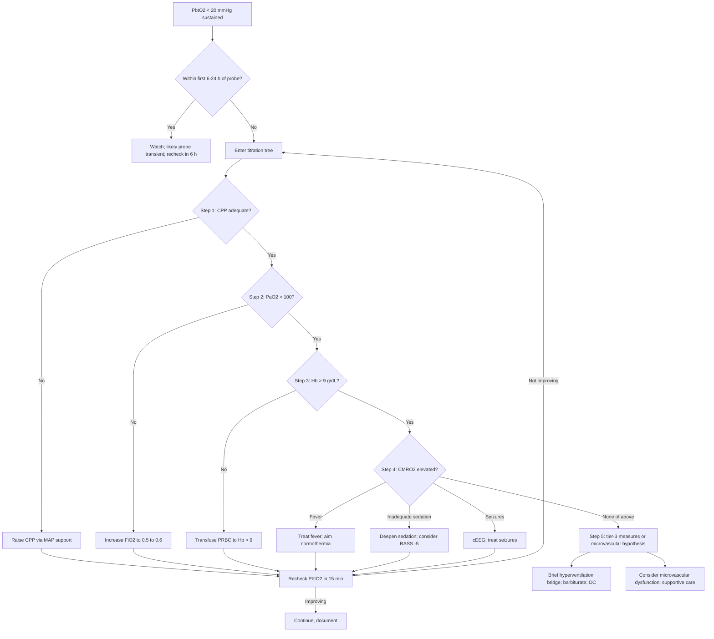

<Callout type="reference">
**Acronyms used on this page**

- **TBI**: traumatic brain injury (severe = GCS 3 to 8)
- **PbtO2**: brain tissue oxygen partial pressure (mmHg)
- **ICP / CPP / MAP**: intracranial / cerebral perfusion / mean arterial pressure
- **PRx**: pressure reactivity index
- **CPPopt**: continuously-computed optimal CPP
- **CMRO2**: cerebral metabolic rate for oxygen
- **CDO2**: cerebral oxygen delivery = CBF × CaO2
- **CaO2**: arterial oxygen content = (Hb × 1.34 × SaO2) + (0.003 × PaO2)
- **FiO2 / PaO2 / SaO2**: fraction of inspired oxygen / arterial PO2 / arterial saturation
- **Hb**: haemoglobin (g/dL)
- **PRBC**: packed red blood cells
- **MD**: microdialysis (lactate / pyruvate ratio, glucose, glutamate)
- **BOOST-II / BOOST3**: Brain Oxygen Optimization in Severe TBI trials
- **PBTF**: Pediatric Brain Trauma Foundation
- **DC**: decompressive craniectomy
- **BOLD**: blood-oxygen-level-dependent (for fMRI surrogates, not used here)
</Callout>

<TldrCard>
**The 60-second version.** In severe TBI, PbtO2 is the **direct measure of brain tissue oxygen partial pressure**, mmHg in the white matter under a parenchymal probe. **Target > 20 mmHg** (some protocols > 15); **< 15 ischaemic**; **< 10 critically low**. PbtO2 depends on **CPP + arterial PO2 + haemoglobin + CMRO2 + tissue diffusion**. The titration tree when PbtO2 is low:
1. Check **CPP** (raise to age-banded floor or to CPPopt band)
2. Check **PaO2** (raise FiO2 if PaO2 < 100)
3. Check **Hb** (transfuse if < 7 to 9 g/dL)
4. Check **CMRO2** (deepen sedation, treat fever, treat seizures)
5. Check **probe trauma** (transient first 6 to 24 hours; recheck)

**BOOST-II** (Okonkwo 2017) showed PbtO2-guided care reduces time below 20 mmHg without harm; **BOOST3** (Bernard 2025) the larger RCT showed feasibility and a signal toward improved outcome. Pediatric evidence (Figaji 2009, 2024) supports PbtO2 in severe TBI. **PbtO2 verifies that CPPopt actually delivers tissue benefit**; without it, CPP titration risks treating the number rather than the brain.
</TldrCard>

## 1. Three patient vignettes

### Vignette A. Canonical adolescent severe TBI, low PbtO2 at adequate CPP

**Hassan, 13 years old, 50 kg.** Severe TBI from a high-speed motor-vehicle collision. GCS 5 at scene; intubated, paralysed, sedated. Day 2 of admission. Right frontal triple-bolt placed on day 1: ICP probe + PbtO2 + brain temperature. Bilateral frontal NIRS pads on. Continuous arterial line. ICM+ running for CPPopt. Day 2 hour 4: **ICP 18 mmHg (acceptable), CPP 65, PRx +0.10, PbtO2 12 mmHg**. NIRS 60 / 61. Hb 8.4 g/dL (recently transfused 2 units PRBC two days ago). PaO2 95, SaO2 96%, FiO2 0.4. Brain temperature 37.6 degrees. Sedation midazolam 0.1 mg/kg/h + fentanyl 2 mcg/kg/h. **PbtO2 is in the ischaemic range despite adequate CPP**; the team enters the titration tree. The question: where in the tree are we? <Cite id="okonkwo2017_boost2" /> <Cite id="bernard2025_boost3" /> <Cite id="figaji2009peds" />

### Vignette B. School-age severe TBI, refractory low PbtO2

**Tariq, 7 years old, 24 kg.** Severe TBI from a fall from height. Day 3. Triple-bolt in. ICP 22 (treated to acceptable), CPP 62, PRx +0.18, PbtO2 9 mmHg (very low). Hb 10.5 g/dL, PaO2 110, brain temperature 37.2 degrees, sedation deepened to RASS −5. The team has already raised CPP to 70 (within CPPopt band of 65 to 75), maintained PaO2 > 100, kept Hb > 10, and deepened sedation, all without PbtO2 improvement. The pediatric-specific point: **refractory low PbtO2 despite optimised macro-variables** suggests microvascular dysfunction or persistent tissue oedema beyond the reach of the macro-titration tree. Options: tier-3 measures (mild hyperventilation to PaCO2 30 to 35 as a bridge, barbiturate coma, decompressive craniectomy), or accept that the brain is not salvageable in the same way macro-targets suggest. The MNM stack, including microdialysis if available (lactate / pyruvate ratio > 25 = anaerobic metabolism), helps decide. <Cite id="figaji2009peds" /> <Cite id="figaji2024_pbto2_peds" /> <Cite id="hutchinson2015_md" />

### Vignette C. Atypical: PbtO2 looks fine but microdialysis says no

**Yasmin, 14 years old, 48 kg.** Severe TBI day 4. Triple-bolt plus microdialysis catheter. ICP 15, CPP 70, PRx 0, PbtO2 24 mmHg (target met). Hb 11.0, PaO2 105, brain temperature 37.0. The PbtO2 reading is reassuring; the macro-physiology is well-controlled. **But microdialysis** shows **lactate / pyruvate ratio of 38** (very high, suggesting anaerobic metabolism) and **brain glucose 0.8 mmol/L** (low). The question: how can PbtO2 be normal yet microdialysis show metabolic crisis? Possible explanations: probe location heterogeneity (PbtO2 and MD catheters in different tissue types; PbtO2 in relatively spared tissue, MD in pericontusional zone), mitochondrial dysfunction (oxygen is present but cannot be used), or low substrate delivery (low brain glucose despite normal blood glucose). The lesson: **PbtO2 is a regional spot measurement; microdialysis adds metabolic verification**. The MNM stack with both is the most complete tissue picture available at the bedside. <Cite id="hutchinson2015_md" /> <Cite id="figajimd" />

---

## 2. The clinical question

In a child with severe TBI receiving PbtO2-targeted care, **what does the titration tree look like at the bedside, and how do the modalities (PbtO2, ICP, CPP, PRx, microdialysis, NIRS) integrate into a single coherent decision sequence?** The integration question is how to use PbtO2 as the tissue-level verification of macro-titration without becoming over-aggressive on any single variable.

---

## 3. Pathophysiology refresher

PbtO2 is the **partial pressure of oxygen in the brain extracellular fluid** under the probe, in mmHg. The probe is typically placed in white matter (frontal lobe, away from contusions) and samples a 7 to 15 mm cylinder. The PbtO2 value reflects the local balance between oxygen delivery and consumption. The determinants are summarised by the Fick equation applied to the brain:

**PbtO2 = f(CBF, CaO2, CMRO2, tissue diffusion)**

where:
- **CBF** depends on CPP and cerebrovascular resistance
- **CaO2 = (Hb × 1.34 × SaO2) + (0.003 × PaO2)**, so it depends on haemoglobin and arterial oxygen
- **CMRO2** depends on temperature, sedation depth, seizure activity, brain injury type
- **Tissue diffusion** depends on oedema, microvascular function, and probe-to-cell distance

A low PbtO2 can therefore arise from low CPP, low Hb, low PaO2, high CMRO2, or impaired diffusion. The titration tree walks through each in order. <Cite id="okonkwo2017_boost2" /> <Cite id="bernard2025_boost3" />

**Thresholds and ranges:**
- **PbtO2 > 25 mmHg**: comfortable; no specific action
- **PbtO2 20 to 25**: target met; maintain current measures
- **PbtO2 15 to 20**: low normal; investigate trends
- **PbtO2 10 to 15**: ischaemic range; titration tree
- **PbtO2 < 10**: critically low; tier-3 measures
- **PbtO2 < 5 sustained**: severe tissue hypoxia; risk of permanent injury

Cumulative time with PbtO2 < 15 to 20 mmHg correlates with worse outcome in both adult (BOOST-II, BOOST3, Okonkwo 2017) and pediatric (Figaji 2009, 2024) cohorts. The dose-response curve is convex: brief excursions are tolerated; sustained low values are not. <Cite id="okonkwo2017_boost2" /> <Cite id="bernard2025_boost3" /> <Cite id="figaji2009peds" /> <Cite id="figaji2024_pbto2_peds" />

**Probe-related transients**: PbtO2 readings in the first 6 to 24 hours after probe placement are often artefactually low (probe-tissue micro-haemorrhage); the value usually rises into the expected range as local oedema settles. A persistent low PbtO2 beyond 24 hours is meaningful. <Cite id="maas1993pbto2" /> <Cite id="adelson2014pbto2" />

**The BOOST trials**: BOOST-II (Okonkwo 2017) randomised 119 adult severe TBI patients to ICP-only vs ICP + PbtO2-guided care; PbtO2-guided arm spent less time below 20 mmHg and had a non-significant mortality reduction. BOOST3 (Bernard 2025) is the larger Phase III RCT (~1100 patients); reported feasibility and a signal toward improved outcome but did not reach statistical significance for the primary endpoint in the intent-to-treat analysis (interpretation ongoing). <Cite id="okonkwo2017_boost2" /> <Cite id="marshall2020boost3" /> <Cite id="bernard2025_boost3" />

**Pediatric evidence**: Figaji 2009 demonstrated feasibility of PbtO2-guided care in pediatric severe TBI. Figaji 2024 updated the evidence: PbtO2 < 15 mmHg correlates with worse outcome; targeting > 20 mmHg is the practical goal in centres with the equipment. Pediatric data are smaller and observational; no RCT exists. <Cite id="figaji2009peds" /> <Cite id="figaji2024_pbto2_peds" />

**Microdialysis** (Hutchinson 2015): a small catheter samples brain extracellular fluid for biochemical analysis. Key readouts: **lactate / pyruvate ratio** (> 25 = anaerobic metabolism; > 40 = severe metabolic crisis), **glucose** (low brain glucose = inadequate substrate delivery), **glutamate** (raised = excitotoxicity), **glycerol** (raised = cell membrane breakdown). MD adds direct metabolic information beyond what PbtO2 alone provides. Pediatric MD evidence is sparse; the technique is mainly used in research and specialised adult centres. <Cite id="hutchinson2015_md" /> <Cite id="figajimd" />

---

## 4. The multimodal picture table

| Modality | Adequate PbtO2 (> 20) | Low PbtO2 (10 to 15) | Critically low (< 10) | What it adds |
|---|---|---|---|---|
| **PbtO2** | > 20 mmHg | 10 to 15 mmHg | < 10 mmHg | Direct tissue oxygen measurement |
| **ICP** | Acceptable | May be raised; investigate | Often raised | Sets the perfusion floor |
| **CPP** | Within age-banded or CPPopt band | May be at lower edge | Often inadequate | The lever |
| **PRx** | Near zero / negative | Variable | Often positive (broken autoregulation) | Tells you if you can lever CPP |
| **CPPopt** | Within band | May not be in band | Often outside band | The patient-specific target |
| **Hb** | > 9 g/dL | May be 7 to 9 | Often < 8 | Oxygen-carrying capacity |
| **PaO2** | > 100 | May be lower | Often inadequate | Direct oxygen tension |
| **FiO2** | Usually 0.3 to 0.5 | May need higher | Often 0.6 to 0.8 | The titration variable |
| **Brain temperature** | 36 to 37 | May be elevated | Often febrile | CMRO2 driver |
| **Sedation depth** | RASS −4 to −5 | May need deepening | Often inadequately deep | CMRO2 driver |
| **Microdialysis L/P ratio (if available)** | < 25 | 25 to 40 | > 40 | Metabolic crisis indicator |
| **NIRS rSO2** | Symmetric, > 60% | Variable | Often falling | Regional surveillance |

The most useful pairings: **PbtO2 + ICP + CPP** (the core titration triangle), **PbtO2 + microdialysis** (when available; tissue oxygen + metabolic verification), and **PbtO2 + CPPopt + PRx** (the integrated autoregulation-tissue framework).

---

## 5. Decision tree

<Figure
  src="/images/integration/pbto2-cpp-titration/boost2-3.svg"
  alt="BOOST-style PbtO2 titration tree showing the 5-step sequence: CPP, FiO2, Hb, CMRO2, and tier-3 escalation, with PbtO2 trend overlays"
  caption="The BOOST-style PbtO2 titration tree. Top: the 5-step sequence: (1) CPP, (2) FiO2, (3) Hb, (4) CMRO2 (fever, sedation, seizures), (5) tier-3 measures. Middle: trend overlays showing PbtO2 response after each intervention; partial responses guide further escalation. Bottom: the BOOST trials' dose-response curve (cumulative time PbtO2 < 15 mmHg vs outcome). The shaded green band is the PbtO2 > 20 target; the amber band is 15 to 20 (low normal); the red band is < 15 (ischaemic). The titration tree's order of operations is informed by the magnitude of expected PbtO2 response: CPP and FiO2 typically produce the largest shifts; Hb transfusion produces a moderate response; sedation and fever produce small but real changes."
  attribution="MNM-Edu, original schematic. SVG placeholder."
  label="Fig. 1"
/>

---

## 6. Step-by-step bedside actions

1. **Verify the PbtO2 probe is functional**: oxygen challenge test (raise FiO2 from baseline to 1.0 for 2 minutes); PbtO2 should rise > 10 mmHg if the probe is healthy. Persistent flat response = probe failure; replace if clinically warranted.
2. **Document baseline PbtO2 trend** over the first 24 hours; identify the natural fluctuation range for this patient.
3. **When PbtO2 < 20 mmHg sustained > 15 minutes**, enter the titration tree.
4. **Step 1: CPP**. Is CPP within the age-banded floor (50 mmHg for school-age, 60 for adolescents) or within the CPPopt band if computed? If not, raise MAP via noradrenaline (0.05 to 0.5 mcg/kg/min). Aim to bring CPP into the band. Recheck PbtO2 in 15 minutes.
5. **Step 2: PaO2**. Check ABG; if PaO2 < 100 mmHg, increase FiO2 to achieve PaO2 100 to 150. Avoid hyperoxia (> 200 may be harmful long-term). Recheck PbtO2.
6. **Step 3: Haemoglobin**. If Hb < 9 g/dL, transfuse 10 to 15 mL/kg PRBC. The transfusion threshold is contentious; PbtO2-guided transfusion often pushes the trigger to 9 g/dL. Recheck PbtO2 30 minutes after transfusion.
7. **Step 4: CMRO2 drivers**:
   - **Fever > 37.5**: paracetamol PR + tepid sponging + cooling blanket; aim normothermia (36 to 37). Each 1 degree above 37 raises CMRO2 by ~10%.
   - **Inadequate sedation**: deepen midazolam + fentanyl; consider RASS −5; reassess motor response off paralysis if safe.
   - **Seizures**: cEEG; treat any electrographic seizures with levetiracetam 60 mg/kg load; subclinical seizures common.
8. **Step 5: Tier-3 measures** if PbtO2 < 15 persists despite Steps 1 to 4:
   - **Brief hyperventilation bridge** (PaCO2 30 to 35) for impending herniation only; not as sustained therapy.
   - **Barbiturate coma**: pentobarbital loading 10 mg/kg over 30 minutes, then 1 to 5 mg/kg/h titrated to burst-suppression on cEEG.
   - **Decompressive craniectomy**: salvage; weighs against neurosurgical risk.
9. **If PbtO2 remains low despite Step 5**, consider microvascular dysfunction; supportive care; honest prognostic conversation with the family.
10. **Document the titration tree** in the chart at each step; the audit trail informs subsequent rounds and team learning.

---

## 7. Management ladder and endpoints

| Tier | Intervention | Endpoint |
|---|---|---|
| 0 | Triple-bolt with PbtO2 placed on arrival; baseline 24 h | Probe functional; baseline established |
| 1 | Maintain PbtO2 > 20 with macro-variable optimisation | PbtO2 > 20 sustained |
| 2 | Step 1 to 4 titration tree | Variable corrected, PbtO2 recovering |
| 3 | Step 5 tier-3 measures (hyperventilation bridge, barbiturate, DC) | PbtO2 recovering or salvage |
| 4 | Microvascular hypothesis acceptance; supportive care | Honest prognostic conversation |
| 5 | Family meeting; possible withdrawal of life-sustaining therapy | Plan determined |

**Success** looks like: PbtO2 > 20 mmHg sustained > 80% of monitoring time, CPP within CPPopt band, no new infarct, GCS recovery commensurate with injury severity.

**Failure** looks like: persistent PbtO2 < 15 mmHg despite optimised macro-variables, microvascular dysfunction pattern, evolving infarction, leading to compassionate care discussions.

<AlgorithmDisclaimer />

---

## 8. Variant subsections

### 8.1 The BOOST trials in detail

**BOOST-II (Okonkwo 2017)**: 119 adult severe TBI patients randomised to ICP-only vs ICP + PbtO2-guided care; PbtO2-guided arm spent less cumulative time below 20 mmHg (the protocol target was reduction in PbtO2 burden). Non-significant mortality reduction; the trial was a Phase II feasibility and dose-finding study. Key contribution: established the protocolised titration tree and showed that PbtO2-guided care is achievable in dedicated centres. <Cite id="okonkwo2017_boost2" />

**BOOST3 (Bernard 2025; protocol Marshall 2020)**: Phase III RCT, ~1100 adult severe TBI patients. Tested whether PbtO2-guided care improves 6-month outcome (Glasgow Outcome Scale Extended) vs ICP-only care. Recent reports indicate feasibility met and a signal toward improved outcome, but the primary endpoint did not reach pre-specified significance; interpretation is ongoing. <Cite id="bernard2025_boost3" /> <Cite id="marshall2020boost3" />

### 8.2 Pediatric PbtO2 evidence

**Figaji 2009**: feasibility study in 52 pediatric severe TBI patients; PbtO2 placement safe; low PbtO2 (< 15 mmHg) associated with worse outcome. The foundational pediatric PbtO2 paper. <Cite id="figaji2009peds" />

**Figaji 2024**: updated pediatric synthesis; reinforces PbtO2 as a tier-2 monitoring modality; targets > 20 mmHg practical; pediatric RCT remains a gap. <Cite id="figaji2024_pbto2_peds" />

**Adelson 2014**: pediatric PbtO2 review; technical considerations including probe placement, transient artefacts. <Cite id="adelson2014pbto2" />

### 8.3 Microdialysis in TBI

Microdialysis (Hutchinson 2015) samples brain extracellular fluid through a small catheter; hourly readouts of lactate, pyruvate, glucose, glutamate, glycerol. Key indices:
- **Lactate / pyruvate ratio (LPR)**: < 25 normal; 25 to 40 elevated; > 40 metabolic crisis (anaerobic metabolism)
- **Brain glucose**: < 0.8 mmol/L = inadequate substrate delivery
- **Glutamate**: > 10 micromolar = excitotoxic
- **Glycerol**: > 100 micromolar = cell membrane breakdown

Pediatric MD experience is sparse; mostly research use in specialised centres. <Cite id="hutchinson2015_md" /> <Cite id="figajimd" />

### 8.4 When CPPopt and PbtO2 disagree

The Hana vignette (from [CPPopt targeting](/integration/cppopt-targeting/)): CPPopt within band, PbtO2 low. The bedside reasoning: macro-perfusion is set correctly; the limiting variable is downstream (Hb, PaO2, CMRO2) or microvascular. The titration tree walks through the non-CPP variables first before reflexively raising CPP further. The PbtO2 verifies that the macro-optimisation actually delivers tissue benefit; when it does not, broaden the diagnostic frame. <Cite id="aries2012cppopt" /> <Cite id="beqiri2024_cogitate" />

### 8.5 Hyperoxia and PbtO2

Raising FiO2 to 1.0 transiently raises PbtO2 (often to > 40 mmHg). Whether sustained hyperoxia is therapeutic or harmful is debated; current consensus is to avoid sustained PaO2 > 200 (free radical injury concerns). Use FiO2 titration to maintain PaO2 100 to 150 for the PbtO2 target; do not chase PbtO2 > 40 mmHg by sustained hyperoxia. <Cite id="bernard2025_boost3" />

### 8.6 Probe placement and trauma transients

Probe placement causes a small local tissue trauma that affects PbtO2 readings for the first 6 to 24 hours. A persistent low PbtO2 in the first 24 hours may simply be the probe settling; recheck at 24 hours before invoking the titration tree. Verify probe function with an oxygen challenge (FiO2 from baseline to 1.0; PbtO2 should rise > 10 mmHg if probe is healthy). Persistent flat response = probe failure; consult neurosurgery for replacement.

---

## 9. Multimodal integration matrix

| Pair | What you gain |
|---|---|
| **PbtO2 + ICP + CPP** | The core triangle; sets the perfusion target |
| **PbtO2 + CPPopt + PRx** | Pressure-passivity check at the tissue level |
| **PbtO2 + Hb** | Reveals when the limiting variable is oxygen-carrying capacity |
| **PbtO2 + PaO2 / FiO2** | The respiratory titration variable |
| **PbtO2 + brain temperature** | CMRO2 driver visible at the bedside |
| **PbtO2 + sedation depth** | CMRO2 lever |
| **PbtO2 + cEEG** | Subclinical seizures raise CMRO2; treating them frees up oxygen |
| **PbtO2 + microdialysis LPR** | Tissue oxygen + metabolic verification; the most complete tissue picture |
| **PbtO2 + NIRS bilateral** | Local + regional surveillance |
| **PbtO2 + clinical exam** | The reality check when sedation is held for an exam |

---

## 10. Worked alternative scenarios

### 10.1 What if PbtO2 falls only when CPP rises?

A 14-year-old severe TBI. PbtO2 22 at CPP 65; PbtO2 17 at CPP 75. **Paradoxical**: raising CPP lowered PbtO2. The likely explanation: at CPP 75 the brain is **above the upper limit of autoregulation**, vasodilation occurs, ICP rises modestly, and the net effect on tissue oxygen is negative (or the rise in ICP cancels the rise in MAP, holding CPP misleadingly steady). The action: re-check ICP at CPP 75 (often rises 2 to 4 mmHg); consider CPPopt re-computation; aim for the band rather than chasing higher CPP. The lesson: more CPP is not always better; the U-curve has a top.

### 10.2 What if PbtO2 is high but microdialysis shows crisis?

The Yasmin vignette (C). PbtO2 24 (target met), but MD LPR 38 (very high) and brain glucose 0.8 (low). The most likely explanation is **regional heterogeneity**: PbtO2 probe in relatively spared tissue; MD catheter in pericontusional or ischaemic tissue. Or **mitochondrial dysfunction**: oxygen present but cannot be used. Or **substrate limitation**: low brain glucose despite normal blood glucose. The action: image to characterise the tissue regions; check blood glucose (raise to 6 to 8 if low); accept that one probe samples one region; consider whether the bigger picture supports salvageable injury or transitioning the conversation. The lesson: PbtO2 is a spot measurement; MD adds metabolic detail; both together are richer than either alone.

### 10.3 What if PbtO2 is fine but ICP is rising?

PbtO2 22, ICP rising from 18 to 26 over an hour, CPP falling from 65 to 55. The brain has not yet declared tissue hypoxia (PbtO2 still 22) but is on the cusp. The action: **treat the ICP first** (head-up, sedation deepening, osmotherapy bolus); the falling CPP will eventually bring PbtO2 down. Do not wait for PbtO2 to confirm the trajectory; the multimodal trend is the trigger. The lesson: PbtO2 verifies; it does not replace the ICP and CPP urgency.

---

## 11. Outcome data

- **Okonkwo 2017 BOOST-II**: 119 adult severe TBI patients; PbtO2-guided care reduced time below 20 mmHg; non-significant mortality reduction; the foundational Phase II trial. <Cite id="okonkwo2017_boost2" />
- **Bernard 2025 BOOST3**: Phase III RCT, ~1100 patients; feasibility met; signal toward improved outcome; primary endpoint interpretation ongoing. <Cite id="bernard2025_boost3" />
- **Marshall 2020 BOOST3 protocol**: methodological reference for the BOOST3 trial. <Cite id="marshall2020boost3" />
- **Figaji 2009 pediatric**: feasibility in 52 pediatric severe TBI patients; PbtO2 < 15 associated with worse outcome. <Cite id="figaji2009peds" />
- **Figaji 2024 pediatric review**: updated synthesis; supports PbtO2 in pediatric severe TBI as tier-2 modality. <Cite id="figaji2024_pbto2_peds" />
- **Adelson 2014**: pediatric PbtO2 technical and clinical review. <Cite id="adelson2014pbto2" />
- **Hutchinson 2015**: microdialysis in adult TBI; consensus on metrics and thresholds. <Cite id="hutchinson2015_md" />

---

## 12. Pitfalls

- **Treating the PbtO2 in the first 24 hours as the truth.** Probe transients are common; verify with oxygen challenge.
- **Reflexively raising CPP to fix low PbtO2.** Step 1 of the tree is CPP, but not above the CPPopt band; check Hb and PaO2 first if those are inadequate.
- **Sustained hyperoxia (PaO2 > 200).** Avoid; titrate FiO2 for PaO2 100 to 150.
- **Ignoring fever and sedation depth.** Both are CMRO2 levers that can produce real PbtO2 improvements; treat aggressively.
- **Missing subclinical seizures.** cEEG catches them; treat with levetiracetam 60 mg/kg load.
- **Forgetting probe placement region.** PbtO2 in relatively spared frontal white matter may differ from pericontusional tissue; image awareness is essential.
- **Over-reliance on PbtO2 alone.** PbtO2 is a regional spot measurement; pair with CPP, ICP, PRx, NIRS, and microdialysis if available.
- **Acting on transient drops.** A 10-minute dip from 22 to 18 is within normal physiological range; sustained > 15 minutes is the trigger for the tree.
- **Skipping the family conversation.** Refractory low PbtO2 is a prognostic marker; transparent conversations about the trajectory and prognosis should occur in parallel with the titration tree.

---

## 13. Pediatric considerations

<Pediatric>
**Six pediatric-specific points.**

1. **Pediatric PbtO2 evidence is observational and feasibility-based.** No RCT. The pediatric standard derives from Figaji 2009, 2024, and PBTF 4th edition; centres adopting PbtO2 should expect tier-2 status with thinner evidence than adult.

2. **Pediatric-sized PbtO2 probes** are available but not universally stocked. Confirm availability before placing a triple-bolt; consult neurosurgery for placement strategy in young children.

3. **Age-banded thresholds for the macro-variables** in the titration tree:
   - CPP: 50 mmHg floor for school-age, 60 for adolescents; or CPPopt band
   - PaO2: > 100 mmHg
   - Hb: > 9 g/dL is typical threshold; some centres > 10 in severe TBI
   - Brain temperature: 36 to 37 (normothermia preferred; mild therapeutic cooling is no longer standard in pediatric severe TBI after the trials of the early 2010s)

4. **Sedation depth** in pediatric severe TBI is typically RASS −4 to −5; the youngest children require careful titration to avoid haemodynamic compromise.

5. **Drug doses for tier-3 measures**:
   - Pentobarbital loading 10 mg/kg over 30 min, then 1 to 5 mg/kg/h titrated to burst-suppression
   - Mannitol 0.5 to 1 g/kg as bridge
   - Decompressive craniectomy per pediatric neurosurgical protocols

6. **Family communication**: PbtO2 is a sophisticated modality that families may find confusing. Explain it as "the brain oxygen probe" and use the trend (improving, stable, worsening) rather than absolute numbers. Coordinate with palliative care for refractory low values. <Cite id="meert2015_palliative_care" />
</Pediatric>

---

## 14. Combine with

- [PbtO2 modality page](/modalities/pbto2/): the foundation for the probe physics and interpretation.
- [ICP monitoring](/modalities/icp/): the upstream variable.
- [CPPopt targeting integration](/integration/cppopt-targeting/): the pressure side of the equation.
- [PRx and autoregulation](/foundations/autoregulation/): the mechanism behind CPPopt.
- [Osmotherapy integration](/integration/osmotherapy-icp-nirs/): when ICP rises require osmotherapy.
- [Microdialysis modality page](/modalities/microdialysis/): the metabolic verification.
- [NIRS](/modalities/nirs/): the regional surveillance.
- [Continuous EEG](/modalities/ceeg/): subclinical seizure detection.
- [PRx vs ORx discordance integration](/integration/prx-vs-orx-discordance/): when two autoregulation indices disagree.
- [Discordance triage](/integration/discordance-triage/): the general multimodal disagreement framework.

---

<DeepDive>

## 15. Evidence summary and recent literature (2022 to 2025)

### Foundational

| Topic | Reference | Grade |
|---|---|---|
| PbtO2 fundamentals | <Cite id="maas1993pbto2" /> | foundational |
| BOOST-II | <Cite id="okonkwo2017_boost2" /> | B |
| BOOST3 protocol | <Cite id="marshall2020boost3" /> | methods |
| Pediatric PbtO2 | <Cite id="figaji2009peds" /> <Cite id="adelson2014pbto2" /> | C |
| Microdialysis consensus | <Cite id="hutchinson2015_md" /> | expert |
| PBTF pediatric guidelines | <Cite id="kochanek2019_pbtf4" /> <Cite id="kochanek2019pbtf" /> | expert |

### Recent literature (2022 to 2025)

- **Bernard 2025 BOOST3**: the Phase III PbtO2 RCT; feasibility met, signal toward improved outcome; the most important recent paper for tier-2 adoption. <Cite id="bernard2025_boost3" />
- **Figaji 2024 pediatric review**: updated pediatric PbtO2 synthesis; tier-2 modality in pediatric MMM. <Cite id="figaji2024_pbto2_peds" />
- **Helbok 2024 pediatric MMM update**: PbtO2 as tier-2 in pediatric MMM bundles. <Cite id="helbok2024_pediatric_mmm" />
- **Figaji 2025 pediatric MMM consensus**: PbtO2 in pediatric severe TBI; targets > 20 mmHg practical; pediatric RCT a remaining gap. <Cite id="figaji2025_mmm_pediatric_consensus" />
- **Tasker 2023 PCCM review**: integrative pediatric MMM piece; PbtO2 as the tissue verifier alongside CPPopt. <Cite id="tasker2023_pccm_review" /> <Cite id="tasker2023mnm" />
- **Hawthorne 2014 (still cited)**: ICP and CPP dose framework that informs PbtO2 thresholds. <Cite id="hawthorne2014icp" />

</DeepDive>

---

## 16. Self-check

<Quiz
  questions={[
    {
      id: 'q1',
      prompt: 'A 13-year-old severe TBI day 2 with triple-bolt. ICP 18, CPP 65, PRx +0.10, PbtO2 12 mmHg. Hb 8.4 g/dL, PaO2 95, brain temperature 37.6, sedation midazolam + fentanyl. Where in the BOOST-style titration tree is the first defensible action?',
      options: [
        { id: 'a', label: 'Raise CPP to 75 with more noradrenaline' },
        { id: 'b', label: 'Transfuse PRBC to Hb > 9, raise FiO2 to achieve PaO2 > 100, treat fever toward normothermia, deepen sedation; then reassess CPP if PbtO2 still low' },
        { id: 'c', label: 'Decompressive craniectomy now' },
        { id: 'd', label: 'Stop the PbtO2 probe; it must be faulty' },
      ],
      answer: 'b',
      explanation: 'CPP is already within an acceptable range; the non-CPP variables (Hb 8.4 is below the typical 9 threshold for PbtO2-guided transfusion, PaO2 95 is borderline, fever raises CMRO2) all need correction first. Reflexively raising CPP without addressing oxygen-carrying capacity or oxygen content wastes pressor-related risk. DC and probe disposal are wrong; the titration tree exists to walk through the variables in order.',
    },
    {
      id: 'q2',
      prompt: 'A 14-year-old severe TBI day 4. PbtO2 24 mmHg (target met). Microdialysis lactate / pyruvate ratio 38 (high), brain glucose 0.8 mmol/L (low). Blood glucose 5.2. ICP 15, CPP 70, PRx 0. What is the most likely explanation for the discordance?',
      options: [
        { id: 'a', label: 'The PbtO2 probe is malfunctioning; rely on microdialysis' },
        { id: 'b', label: 'Regional heterogeneity (PbtO2 in spared tissue, MD in pericontusional / ischaemic tissue) or mitochondrial dysfunction; image to characterise tissue regions and continue tissue-level surveillance' },
        { id: 'c', label: 'Microdialysis is unreliable; ignore it' },
        { id: 'd', label: 'Raise the blood glucose target to 8 to 10' },
      ],
      answer: 'b',
      explanation: 'PbtO2 and microdialysis sample different tissue cylinders; regional heterogeneity is common in TBI. Mitochondrial dysfunction (oxygen present but not utilised) is another possibility. The action is to characterise tissue regions on imaging and acknowledge that one probe samples one region. Raising blood glucose to 8 to 10 is excessive and risks complications. Both modalities have their place; neither is "unreliable."',
    },
    {
      id: 'q3',
      prompt: 'A 7-year-old severe TBI day 3. After raising CPP into the CPPopt band, transfusing to Hb 10.5, raising FiO2 to maintain PaO2 110, treating fever to 37.2, and deepening sedation to RASS −5, PbtO2 remains 9 mmHg. ICP is acceptable at 18. What does this pattern suggest and what is the next step?',
      options: [
        { id: 'a', label: 'The titration tree has failed; continue lowering CPP to reduce demand' },
        { id: 'b', label: 'Persistent low PbtO2 despite optimised macro-variables suggests microvascular dysfunction or refractory injury; consider tier-3 measures (brief hyperventilation bridge, barbiturate coma) and have an honest prognostic conversation with the family' },
        { id: 'c', label: 'Replace the PbtO2 probe immediately' },
        { id: 'd', label: 'Reduce sedation to assess clinically' },
      ],
      answer: 'b',
      explanation: 'Refractory low PbtO2 despite full macro-optimisation suggests microvascular dysfunction or severe injury beyond the reach of the titration tree. The next step is to consider tier-3 measures (hyperventilation as a brief bridge, barbiturate coma, decompressive craniectomy) and to begin an honest prognostic conversation with the family. Lowering CPP does not increase tissue oxygen; replacing the probe rarely changes the picture at this stage; reducing sedation in an unstable brain is dangerous.',
    },
  ]}
/>
