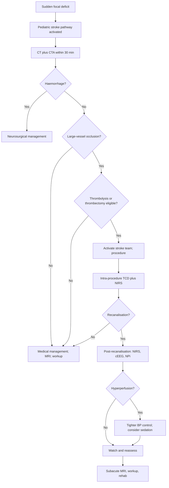

<Callout type="reference">
**Acronyms used on this page**

- **AIS**: arterial ischaemic stroke
- **PedNIHSS**: Pediatric National Institutes of Health Stroke Scale
- **CTA / MRA**: computed tomography angiography / magnetic resonance angiography
- **DWI / FLAIR**: diffusion-weighted imaging / fluid-attenuated inversion recovery
- **MCA / ACA / PCA / BA / VA / ICA**: middle / anterior / posterior cerebral / basilar / vertebral / internal carotid artery
- **M1 / M2**: first / second segment of MCA
- **tPA**: tissue plasminogen activator (alteplase)
- **TCD / TCCD**: transcranial Doppler / transcranial color-coded duplex
- **MFV / PSV / EDV / PI**: mean / peak systolic / end-diastolic flow velocity / pulsatility index
- **HITS**: high-intensity transient signals (TCD-detected emboli)
- **NIRS / rSO2**: near-infrared spectroscopy / regional cerebral oxygen saturation
- **cEEG / aEEG / qEEG**: continuous / amplitude-integrated / quantitative EEG
- **NPi**: neurological pupil index
- **GCS / FOUR**: Glasgow Coma Scale / Full Outline of UnResponsiveness
- **AHA / ASA**: American Heart Association / American Stroke Association
- **PICU**: paediatric intensive care unit
- **MoCA / WISC**: cognitive assessment scales
- **TIPS**: Thrombolysis in Pediatric Stroke study
</Callout>

<TldrCard>
**The 60-second version.** Pediatric arterial ischaemic stroke (AIS) is rare (about 2 per 100,000 children per year) but devastating. Time-to-treatment is critical: each minute of large-vessel occlusion costs an estimated 1.9 million neurons. The TIPS study (Rivkin 2016) and Sun 2020 pediatric thrombectomy cohort established that thrombolysis and thrombectomy are feasible in selected paediatric patients with proximal occlusion and significant neurological deficit, though pediatric-specific protocols and consent processes are required. The multimodal monitoring bundle changes phase: (1) **pre-procedure** (recognition, CTA/MRA, NIHSS-Peds); (2) **intra-procedure** (continuous TCD for recanalisation detection; NIRS for hemispheric perfusion change; angiographic team coordination); (3) **post-recanalisation** (NIRS for hyperperfusion syndrome; cEEG for sub-clinical seizures; clinical exam and NPi for neurological trajectory); (4) **subacute** (MRI for infarct extent, secondary prevention workup). The bundle changes the speed and confidence of decision-making at each phase. Pediatric AIS care now happens in centres with dedicated paediatric stroke teams; transfer pathways from peripheral centres must be designed to minimise time-to-treatment.
</TldrCard>

## 1. Three patient vignettes

### Vignette A. Maya, 8 years, classical M1 MCA occlusion

Maya, **8 years, 26 kg**, healthy until two hours ago. Sudden onset right-arm weakness during a soccer game; on arrival in the ED 70 minutes later, she has right hemiparesis (arm > leg), right facial droop, expressive aphasia, and is alert and frightened. PedNIHSS 14. CT head: no haemorrhage. CTA: left M1 occlusion. The paediatric stroke team is activated. **Question: in the hyperacute period, what is the role of TCD before, during, and after the planned thrombectomy; what is the post-recanalisation monitoring bundle; when does the family conversation happen?** <Cite id="ferriero2019aha_pedstroke" /> <Cite id="sun2020_pediatric_thrombectomy" /> <Cite id="rivkin2016_TIPS" />

### Vignette B. Asher, 6 weeks, neonatal AIS

Asher, **6 weeks, 4.5 kg**, presents with focal right-arm clonic seizures and decreased movement of the right side. Term, no birth complications. MRI: acute left MCA territory infarct. Thrombophilia workup pending. **Question: neonatal AIS is a different pathway (thrombolysis is rarely indicated; the focus shifts to seizure management, secondary prevention workup, and prognostic counselling). What is the MNM bundle, and what does aEEG tell us about prognosis?** <Cite id="larovere2018_pedsais" /> <Cite id="sansevere2023_neonatal_ceeg" />

### Vignette C. Tariq, 14 years, sickle cell disease with moyamoya

Tariq, **14 years, 50 kg**, known sickle cell disease and moyamoya collaterals. Presents with right-arm numbness and brief speech difficulty (TIA versus stroke). MRI shows watershed ischaemia in the borderzone between MCA and ACA on the left. TCD: bilateral MCA TAMMV elevated, with ipsilateral collateral flow visible. **Question: in a child with chronic vasculopathy, what does the MNM bundle add to the standard sickle cell stroke management, and how does management differ from acute embolic stroke?** <Cite id="ferriero2019aha_pedstroke" />

---

## 2. The clinical question

For each of these children: **how does the multimodal monitoring bundle guide the hyperacute management of pediatric arterial ischaemic stroke, and how does the bundle differ between the school-age thrombectomy candidate, the neonate, and the chronic vasculopathy patient?**

---

## 3. Pathophysiology refresher

Pediatric arterial ischaemic stroke differs from adult AIS in epidemiology, mechanism, presentation, and response to treatment.

**Epidemiology.** Adult AIS incidence is about 1 per 1000 per year; paediatric AIS is about 2 per 100,000 per year. Neonatal AIS is more common (about 25 per 100,000 live births) but presents differently. Pediatric AIS has a more diverse aetiology: cardiac (congenital heart disease, post-cardiac surgery), arteriopathy (transient cerebral arteriopathy, moyamoya, dissection, varicella vasculopathy), prothrombotic states (sickle cell, thrombophilia, antiphospholipid syndrome, malignancy), infection (post-varicella, meningitis-related vasculitis), and idiopathic.

**Mechanism.** Adult AIS is most often atherosclerotic large-vessel disease or atrial-fibrillation embolism; paediatric AIS is most often arteriopathy or cardiac embolism. Atherosclerosis is rare in children. Dissection (often post-trauma, even minor) is more common in children. Sickle cell disease causes both large-vessel occlusion (MCA territory) and small-vessel watershed infarction.

**Presentation.** Adult AIS presents typically with the FAST signs (face drooping, arm weakness, speech difficulty, time to call). Pediatric AIS presents with similar signs in school-age children but with a much higher rate of *missed* or *delayed* diagnosis: median time from symptom onset to diagnosis in paediatric series is hours to days, often because the differential is broader (migraine, post-ictal Todd's paralysis, demyelination, conversion disorder) and the index of suspicion is lower. The PedNIHSS quantifies the deficit in a paediatric-appropriate way. Neonatal AIS presents with focal seizures more often than with weakness; the diagnosis is typically made on MRI within the first week of life.

**Treatment evidence.**
- **Thrombolysis (tPA):** the TIPS pilot study (Rivkin 2016) demonstrated feasibility of paediatric tPA dosing (0.9 mg/kg, same as adult, with paediatric-specific exclusions). Subsequent registries have reported safety in selected cases. The evidence base remains observational rather than randomised. <Cite id="rivkin2016_TIPS" />
- **Mechanical thrombectomy:** the Sun 2020 paediatric thrombectomy series and subsequent registries demonstrate feasibility and benefit in proximal large-vessel occlusion when performed in experienced paediatric stroke centres. The time-to-treatment principle holds: faster is better. <Cite id="sun2020_pediatric_thrombectomy" />
- **2019 AHA / ASA paediatric stroke guideline:** consolidates the evidence; recommends a paediatric stroke pathway in dedicated centres; allows thrombolysis and thrombectomy in selected cases with explicit family consent and team experience. <Cite id="ferriero2019aha_pedstroke" />

**Why does multimodal monitoring matter?**
- **Pre-procedure:** confirms the diagnosis (CTA or MRA shows the occlusion); quantifies the deficit (PedNIHSS); estimates penumbra (perfusion imaging in centres that have it).
- **Intra-procedure:** TCD can be used to monitor recanalisation during thrombolysis or thrombectomy; NIRS shows hemispheric perfusion change.
- **Post-recanalisation:** hyperperfusion syndrome (sudden rise in MFV beyond baseline post-reperfusion, with risk of haemorrhagic transformation) is detected by TCD and NIRS; sub-clinical seizures are detected by cEEG; clinical exam tracks neurological recovery.
- **Subacute:** MRI quantifies infarct extent; secondary prevention workup (cardiac, thrombophilia, vasculitis) identifies recurrence risk; cognitive and motor rehabilitation planning begins.

---

## 4. The multimodal picture

| Modality | Pre-procedure | Intra-procedure | Post-recanalisation | Subacute |
|---|---|---|---|---|
| **Clinical exam (PedNIHSS)** | Quantifies deficit | Limited (sedated) | Tracks recovery | Tracks recovery and disability |
| **CT / CTA** | Confirms occlusion; rules out haemorrhage | Not typically | If post-procedure haemorrhage suspected | Follow-up imaging |
| **MRI / MRA / DWI** | Confirms infarct extent and penumbra | Not typically | At 24 to 48 h to quantify infarct | Vasculopathy workup, prognosis |
| **TCD** | Baseline flow; vessel-specific occlusion | Continuous recanalisation monitoring; HITS detection | Hyperperfusion detection; collateral flow | Vasculopathy surveillance (moyamoya, sickle) |
| **NIRS rSO2** | Bilateral baseline | Hemispheric perfusion during procedure | Hyperperfusion or persistent hypoperfusion | Surveillance during physical therapy |
| **cEEG / aEEG** | Pre-procedure if seizure suspected | Not typically | Sub-clinical seizure detection (yield 20 to 30%) | Long-term seizure risk |
| **NPi (pupillometry)** | Baseline | Limited (sedated) | Trend for evolving lesion or oedema | Recovery trajectory |
| **Vital signs / BP** | Aim for normotension pre-tPA; permissive hypertension if no thrombolysis | Tight BP control during procedure | Tighter post-recanalisation BP control to prevent hyperperfusion | Long-term BP management |

---

## 5. Decision tree

<Figure
  src="/images/integration/pediatric-stroke-ais/maya-case.svg"
  alt="Pediatric AIS timeline schematic showing pre-procedure, intra-procedure, post-recanalisation, and subacute phases with multimodal monitoring milestones"
  caption="The Maya case timeline. Hour 0: onset. Hour 1.5: ED arrival, CT and CTA confirm left M1 occlusion. Hour 2: stroke team activated, family consent for thrombectomy. Hour 3: thrombectomy with intra-procedure TCD monitoring; recanalisation TICI 2b. Hour 3 to 24: post-recanalisation NIRS, cEEG, NPi; bilateral TCD for hyperperfusion surveillance; tight BP control. Hour 24 to 48: MRI for infarct extent; PedNIHSS reassessment. Day 3 to 7: rehabilitation planning; secondary prevention workup."
  attribution="MNM-Edu, adapted from Sun 2020 paediatric thrombectomy series. SVG placeholder."
  label="Fig. 1"
/>

<AlgorithmDisclaimer />

---

## 6. Step-by-step bedside actions

For Maya (8 y, 26 kg, left M1 occlusion). Times are from symptom onset.

1. **0 to 60 min: pre-hospital and ED arrival.** Recognise sudden focal deficit; FAST signs; paramedics call ahead. ED: PedNIHSS at door; airway, breathing, circulation; blood draw including glucose, coagulation, type and screen.
2. **60 to 90 min: imaging.** CT head within 30 min of arrival to rule out haemorrhage; CTA from arch to vertex to identify large-vessel occlusion. MR perfusion if available and the patient is stable.
3. **90 to 120 min: paediatric stroke team activation.** Paediatric stroke neurologist, interventional radiology, neurosurgery, anaesthesia, PICU; family meeting for consent (thrombolysis or thrombectomy is a discussion of risks, benefits, alternatives; explicit family consent is required given the evidence base).
4. **120 to 180 min: thrombectomy (if proceeding).** General anaesthesia or conscious sedation per protocol; arterial line; intra-procedure TCD monitoring on the affected side and contralateral side; NIRS bilateral; tight BP control (avoid drops in MAP that worsen ischaemia; avoid rises that risk haemorrhagic transformation). Recanalisation graded by TICI (Thrombolysis in Cerebral Infarction); TICI 2b or 3 is successful.
5. **180 to 240 min: immediate post-recanalisation.** Recovery in PICU. Tight BP control (target systolic at lower end of normal for age; avoid spikes that promote hyperperfusion syndrome). TCD MFV trend on the recanalised side: a rise >50% above baseline within 24 h flags hyperperfusion risk. NIRS rSO2 trend; a sudden rise of >10% on the recanalised side supports hyperperfusion. cEEG started; yield for sub-clinical seizures 20 to 30% in the first 24 h.
6. **4 to 24 h: continuous multimodal monitoring.** TCD repeat every 4 to 6 hours; NIRS continuous; cEEG continuous; NPi every 2 hours; PedNIHSS every 4 hours. Document trend.
7. **24 to 48 h: MRI.** Quantify infarct extent on DWI; assess for haemorrhagic transformation on SWI; reassess vasculature on MRA.
8. **Days 2 to 5: secondary prevention workup.** Echocardiogram (cardiac source); thrombophilia panel; vasculitis workup if arteriopathy suspected; haemoglobin electrophoresis if not known; varicella titres.
9. **Days 3 to 7: rehabilitation planning.** Physical therapy, occupational therapy, speech therapy; school liaison; family support; cognitive baseline.
10. **Discharge planning:** secondary prevention (antiplatelet typically; anticoagulation in selected cases per the AHA paediatric stroke guideline); follow-up cardiology and neurology; school re-integration; outpatient cognitive assessment at 6 to 12 months.

---

## 7. Management ladder and endpoints

**Success looks like:** recanalisation (TICI 2b or 3); PedNIHSS improving over hours and days; no haemorrhagic transformation; no hyperperfusion syndrome requiring intervention; no sub-clinical seizures; rehabilitation begun.

**Failure looks like:** failed recanalisation; haemorrhagic transformation; hyperperfusion syndrome; sub-clinical seizures driving secondary injury; PedNIHSS worsening; complications of the procedure (vessel injury, contrast effect, anaesthesia).

**When to escalate:**
- Hyperperfusion syndrome (rising MFV beyond baseline, rising rSO2, headache, agitation, possibly seizure), tighten BP control, deepen sedation, consider antihypertensives.
- Haemorrhagic transformation, neurosurgical consult, reverse anti-coagulation if applicable, manage as intracerebral haemorrhage.
- Sub-clinical seizures on cEEG, AED loading per the SE pathway.
- Worsening clinical exam without explanation, urgent imaging.

**When to de-escalate:**
- PedNIHSS improving; no new neurological signs; stable haemodynamics.
- MRI shows infarct without significant haemorrhagic transformation.
- cEEG without seizure activity.
- Family conversation about prognosis is current.

---

## 8. Variant subsections

### 8.1 Anterior versus posterior circulation

Anterior circulation strokes (MCA, ACA territory) account for about 80% of paediatric AIS and produce classical hemiparesis, aphasia, hemianopia. Posterior circulation strokes (PCA, basilar, vertebral) are less common but can be more dangerous (basilar occlusion has high mortality without intervention); they present with brainstem signs (cranial nerve deficits, vertigo, ataxia), often missed initially. TCD coverage of both anterior (MCA, ACA, ICA) and posterior (basilar, vertebral) is part of the standard exam.

### 8.2 Thrombectomy-eligible versus not

Thrombectomy is most beneficial for proximal large-vessel occlusion (M1, ICA-T) with significant clinical deficit. The Sun 2020 series and subsequent registries show feasibility and benefit in selected paediatric cases. Eligibility considerations: time from onset (extended windows up to 24 hours considered in selected adult cases with perfusion imaging; paediatric data limited), age and size (vessel size constrains catheter use; most paediatric series include children over 2 years), comorbidity, family consent. <Cite id="sun2020_pediatric_thrombectomy" />

### 8.3 Peri-procedural monitoring

Continuous TCD during thrombectomy (or thrombolysis) detects recanalisation in real time; HITS (high-intensity transient signals) detected on TCD indicate embolic events from the procedure; bilateral NIRS shows hemispheric perfusion change. BP management during the procedure is critical: avoid drops that worsen ischaemia, avoid rises that risk haemorrhagic transformation post-recanalisation. Anaesthesia choice (general versus conscious sedation) is centre-dependent.

### 8.4 Post-recanalisation hyperperfusion syndrome

Sudden restoration of flow to a previously ischaemic region can produce hyperperfusion: MFV rises beyond baseline by >50%, rSO2 rises sharply, the patient develops headache, agitation, possibly seizure or haemorrhagic transformation. Detection is by TCD (rising MFV in the recanalised territory) and NIRS (rising rSO2). Management is tighter BP control, deeper sedation, sometimes antihypertensives. The risk is highest in the first 24 hours but extends to 7 days.

### 8.5 Moyamoya

Chronic stenosis and occlusion of distal ICA and proximal anterior circulation, with collateral vessel network formation. Children with moyamoya are at risk of stroke and TIA, especially with dehydration, hyperventilation (crying), and hypotension. Surveillance TCD (rising MFV through collaterals; stenotic flow patterns); MRA periodically. Acute stroke in moyamoya is managed similarly with attention to BP avoidance of drops; surgical revascularisation (EDAS, EMS, STA-MCA bypass) is considered in selected cases. <Cite id="ferriero2019aha_pedstroke" />

### 8.6 Sickle cell disease

The STOP trial established TCD screening (TAMMV ≥ 200 cm/s) as the standard of care for stroke prevention in children with sickle cell disease ages 2 to 16. Children with abnormal TCDs are placed on chronic transfusion (or, more recently, hydroxyurea per STOP-II HYDRA / SWiTCH evidence). Acute stroke in sickle cell is managed with exchange transfusion to lower HbS to less than 30%; thrombolysis is generally avoided. <Cite id="ferriero2019aha_pedstroke" />

---

## 9. Multimodal integration matrix

| Pair | What you gain | Worked scenario |
|---|---|---|
| **TCD + CTA/MRA** | Vessel-specific flow during the procedure | Maya's thrombectomy |
| **TCD + NIRS** | Macrovascular flow plus tissue oxygen; hyperperfusion detection | Post-recanalisation surveillance |
| **cEEG + clinical exam** | Sub-clinical seizure detection in the sedated post-procedure patient | Sub-clinical seizures with 20 to 30% yield |
| **NIRS + PedNIHSS** | Tissue oxygen trend plus quantified deficit | Long-term surveillance |
| **MRI + PedNIHSS** | Infarct extent plus deficit; prognosis | Day 1 to 2 reassessment |
| **All modalities + time** | The trajectory across hours and days | Recovery prognostication |

---

## 10. Worked alternative scenarios

### 10.1 What if the imaging shows haemorrhagic stroke rather than ischaemic?

Treat as paediatric intracerebral haemorrhage: neurosurgical consult for evacuation or external ventricular drain if hydrocephalus; BP management; coagulation reversal if anticoagulated; imaging for the source (AVM, aneurysm, cavernoma, tumour, coagulopathy). Multimodal monitoring shifts to ICP and CPP management.

### 10.2 What if the patient is outside the thrombectomy window?

Late presentation (more than 6 to 24 hours from onset) limits thrombectomy options. The decision rests on perfusion imaging (penumbra-to-core ratio) and centre experience. Some children with extended-window thrombectomy have benefited per adult-derived criteria; the paediatric evidence is sparse. Medical management focuses on secondary prevention and complications.

### 10.3 What if it is not really a stroke?

Stroke mimics in children: migraine with aura (especially hemiplegic migraine), post-ictal Todd's paralysis, conversion disorder, demyelinating disease (ADEM), hypoglycaemia, infection (meningoencephalitis). MRI (DWI in particular) is the discriminator; if DWI is negative, the differential broadens. The bedside stroke team should consider all of these.

---

## 11. Outcome data

- **AHA / ASA 2019 paediatric stroke guideline:** consolidates evidence; recommends dedicated paediatric stroke pathways and centres; allows thrombolysis and thrombectomy in selected cases. <Cite id="ferriero2019aha_pedstroke" />
- **TIPS (Rivkin 2016):** pilot study of paediatric tPA, demonstrated feasibility of paediatric dosing and protocol; safety signals required ongoing surveillance. <Cite id="rivkin2016_TIPS" />
- **Sun 2020 paediatric thrombectomy:** registry of paediatric thrombectomy cases; demonstrates feasibility, technical success, and outcomes comparable to adult experience in selected centres. <Cite id="sun2020_pediatric_thrombectomy" />
- **Pediatric AIS TCD primers (Larovere 2018):** paediatric TCD use in stroke, including continuous monitoring during procedures, recanalisation detection, and post-recanalisation surveillance. <Cite id="larovere2018_pedsais" />
- **Neonatal AIS series:** present typically with focal seizures; MRI confirms; thrombolysis is rarely indicated; secondary prevention and rehabilitation are the focus. <Cite id="sansevere2023_neonatal_ceeg" />
- **Pediatric MMM consensus (Figaji 2025):** addresses paediatric stroke as one of the integration scenarios. <Cite id="figaji2025_mmm_pediatric_consensus" />
- **Brain injury after pediatric arrest (Naim 2023):** addresses electrographic seizures in the recovery period, relevant to post-stroke cEEG monitoring. <Cite id="naim2023_brain_injury_pccm" />

---

## 12. Pitfalls

- **Missing the diagnosis.** Paediatric stroke is rare and often misdiagnosed in the ED; the index of suspicion must be high for any sudden focal neurological deficit.
- **Delaying imaging.** CT plus CTA within 30 minutes of ED arrival is the standard; perfusion imaging if available and stable.
- **Delaying paediatric stroke team activation.** Treat as a time-critical emergency.
- **Treating without family consent for thrombolysis or thrombectomy.** The evidence base in paediatric stroke is observational rather than randomised; explicit family consent is required.
- **Forgetting post-recanalisation hyperperfusion surveillance.** TCD and NIRS in the first 24 to 48 h detect the rise; tight BP control prevents the consequence.
- **Skipping cEEG in the post-procedure patient.** Sub-clinical seizure yield is 20 to 30%; treatment improves seizure burden.
- **Forgetting secondary prevention workup.** Cardiac, thrombophilia, vasculitis, sickle cell. The workup informs recurrence risk and prevention.
- **Premature prognostication.** Pediatric stroke recovery is often substantial in school-age children; rehabilitation over months changes the trajectory. Family communication should acknowledge uncertainty.
- **Not planning the transfer pathway.** A peripheral hospital cannot perform thrombectomy; the transfer pathway must be designed to minimise time-to-treatment.

---

## 13. Pediatric considerations

<Pediatric>
**Pediatric AIS has distinct features that affect the MNM bundle.**

- **Age-banded thresholds for tPA and thrombectomy.** TIPS used 0.9 mg/kg tPA (same as adult); paediatric thrombectomy registries include children mostly over 2 years; very young children have additional vessel-size considerations.
- **PedNIHSS** is the paediatric-appropriate stroke severity scale (validated for children over 2 years); for younger children, modified versions are used.
- **TCD age-banded MFV norms.** A 6-year-old's healthy MCA MFV is about 100 cm/s; reading paediatric TCD with adult thresholds is the most common pediatric TCD error.
- **Pediatric stroke aetiology** is more diverse (arteriopathy, cardiac, sickle cell, thrombophilia) than adult; the workup is correspondingly broader.
- **Pediatric stroke recovery** is often more substantial than adult; the developing brain has greater plasticity. Rehabilitation extends over months to years.
- **Family consent processes** for thrombolysis and thrombectomy must address the limited paediatric evidence base honestly while supporting time-critical decisions.
- **School re-integration** is part of the recovery; school liaison and educational adaptation are essential.
- **Long-term cognitive assessment** at 6 to 12 months; subtle cognitive sequelae are common even when motor recovery is good.
- **Secondary prevention** uses paediatric-specific dosing (aspirin 1 to 5 mg/kg/day; warfarin or DOAC per cardiology in cardiac sources; chronic transfusion in sickle cell).
</Pediatric>

---

## 14. Combine with

- [TCD / TCCD modality page](/modalities/tcd/): MFV, PI, recanalisation detection, paediatric age-banded norms.
- [NIRS modality page](/modalities/nirs/): rSO2 trending, hyperperfusion detection.
- [EEG / aEEG modality page](/modalities/eeg/): cEEG for sub-clinical seizures.
- [Pupillometry / NPi page](/modalities/pupillometry/): the brainstem trend.
- [Integration: Resource-limited bedside MNM](/integration/resource-limited-bedside/): paediatric AIS care in lower-resource settings.
- [Integration: Discordance triage](/integration/discordance-triage/): when multimodal monitors disagree.
- [Foundations: cerebral autoregulation (perfusion, watershed, hyperperfusion)](/foundations/autoregulation/): autoregulation, hyperperfusion, watershed.

---

<DeepDive>

## 15. Evidence summary

| Topic | Source | Grade |
|---|---|---|
| Pediatric stroke AHA/ASA guideline | <Cite id="ferriero2019aha_pedstroke" /> | expert |
| TIPS paediatric tPA pilot | <Cite id="rivkin2016_TIPS" /> | C |
| Pediatric thrombectomy registry | <Cite id="sun2020_pediatric_thrombectomy" /> | C |
| Pediatric AIS TCD primer | <Cite id="larovere2018_pedsais" /> | expert |
| Neonatal cEEG review | <Cite id="sansevere2023_neonatal_ceeg" /> | review |
| Brain injury after pediatric arrest | <Cite id="naim2023_brain_injury_pccm" /> | review |
| AHA paediatric post-arrest | <Cite id="topjian2021aha_pediatric" /> | expert |
| MMM consensus (general) | <Cite id="leroux2014_neurocrit_consensus" /> | expert |
| Pediatric MMM consensus | <Cite id="figaji2025_mmm_pediatric_consensus" /> | expert |
| Pediatric MMM update | <Cite id="helbok2024_pediatric_mmm" /> | review |
| ACNS pediatric cEEG | <Cite id="herman2015acns_ceeg" /> | expert |
| Pediatric pupillometry | <Cite id="freeman2020_pediatric_pupil" /> | C |
| ICU NPi (Oddo 2018) | <Cite id="oddo2018_npi_orange" /> | B |
| NIRS in acute injury | <Cite id="davies2017nirs" /> | B |
| TCD basics (Bellner for PI) | <Cite id="bellner2004" /> | C |
| Pediatric ECMO TCD | <Cite id="larovere2017_ecmo" /> | C |

## 16. Recent literature (2022 to 2025)

- **Sun 2020 paediatric thrombectomy** and subsequent registry updates have established the procedure as standard of care in experienced paediatric centres. <Cite id="sun2020_pediatric_thrombectomy" />
- **AHA / ASA 2019 paediatric stroke guideline** remains the reference standard. <Cite id="ferriero2019aha_pedstroke" />
- **Helbok 2024 paediatric MMM update** addresses the role of multimodal monitoring in paediatric AIS care. <Cite id="helbok2024_pediatric_mmm" />
- **Figaji 2025 paediatric MMM consensus** integrates paediatric stroke as one of the integration scenarios in the resource-stratified framework. <Cite id="figaji2025_mmm_pediatric_consensus" />
- **Pediatric stroke time-to-treatment** continues to be a quality measure; centre-level performance varies widely; transfer pathway design matters.
- **Paediatric extended-window thrombectomy** is being studied; the adult evidence (DAWN, DEFUSE-3) is being cautiously extended where perfusion imaging supports it.

</DeepDive>

---

## 17. Self-check

<Quiz
  questions={[
    {
      id: 'q1',
      prompt: 'Maya, 8 y, 26 kg, presents 70 min after sudden right hemiparesis with PedNIHSS 14. CT and CTA confirm left M1 occlusion with no haemorrhage. The paediatric stroke team is activated. What is the most appropriate intra-procedure multimodal monitoring approach?',
      options: [
        { id: 'a', label: 'Continuous TCD on the affected side for recanalisation; bilateral NIRS for hemispheric perfusion; arterial line and tight BP control; no cEEG needed during the procedure' },
        { id: 'b', label: 'Continuous cEEG only' },
        { id: 'c', label: 'Pupillometry every 15 minutes' },
        { id: 'd', label: 'NIRS only' },
      ],
      answer: 'a',
      explanation: 'During paediatric thrombectomy, continuous TCD on the affected side detects recanalisation in real time and identifies HITS (embolic events from the procedure); bilateral NIRS shows hemispheric perfusion change; an arterial line allows tight BP control (avoiding drops that worsen ischaemia and rises that risk haemorrhagic transformation post-recanalisation). cEEG and pupillometry are part of the post-procedure bundle but are less informative during the procedure itself under general anaesthesia.',
    },
    {
      id: 'q2',
      prompt: 'Six hours after Maya\'s successful thrombectomy (TICI 2b), TCD shows MFV in the recanalised MCA has risen from 80 to 140 cm/s; NIRS rSO2 on the left has risen from 70% to 82%; she is agitated and the family reports headache. What is the most likely diagnosis and management?',
      options: [
        { id: 'a', label: 'Normal recovery; reassurance' },
        { id: 'b', label: 'Hyperperfusion syndrome; tighten BP control, deepen sedation, consider antihypertensive; surveillance for haemorrhagic transformation; cEEG if seizure suspected' },
        { id: 'c', label: 'Re-occlusion; emergency repeat angiography' },
        { id: 'd', label: 'Migraine; analgesia' },
      ],
      answer: 'b',
      explanation: 'Post-recanalisation hyperperfusion syndrome is signalled by MFV rising beyond baseline (typically more than 50% above baseline), rising rSO2 on the recanalised side, headache, agitation, and risk of haemorrhagic transformation or seizure. Management is tighter BP control, deeper sedation, antihypertensive if needed, and cEEG for seizure surveillance. The risk is highest in the first 24 hours but extends to 7 days.',
    },
    {
      id: 'q3',
      prompt: 'Tariq, 14 y, with known sickle cell disease and moyamoya, presents with right-arm numbness and brief speech difficulty. MRI shows watershed ischaemia between left MCA and ACA territories. What is the most appropriate acute management?',
      options: [
        { id: 'a', label: 'Standard adult tPA dose' },
        { id: 'b', label: 'Mechanical thrombectomy' },
        { id: 'c', label: 'Exchange transfusion to lower HbS to less than 30%; address dehydration; avoid hypotension; multidisciplinary haematology and stroke team management' },
        { id: 'd', label: 'Antiplatelet alone' },
      ],
      answer: 'c',
      explanation: 'In acute stroke in sickle cell disease, exchange transfusion to lower HbS to less than 30% is the standard of care, along with attention to hydration, oxygenation, and avoidance of hypotension (which can worsen watershed ischaemia in moyamoya). Thrombolysis is generally avoided in sickle cell. The paediatric stroke guideline (Ferriero 2019) consolidates these recommendations. Surgical revascularisation (EDAS, STA-MCA bypass) may be considered subacutely for the moyamoya component.',
    },
  ]}
/>
