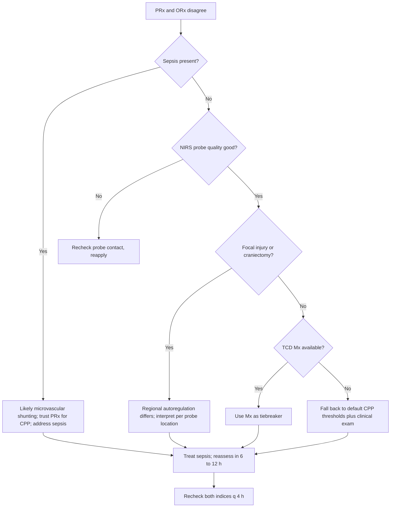

<Callout type="reference">
**Acronyms used on this page**

- **PRx**: pressure reactivity index (moving correlation of ICP with MAP at slow-wave frequencies)
- **ORx**: oxygen reactivity index (moving correlation of NIRS rSO2 with CPP or MAP)
- **Mx**: mean-flow autoregulation index (moving correlation of TCD MFV with CPP or MAP)
- **CPPopt / MAPopt**: optimal cerebral perfusion or mean arterial pressure (the autoregulation U-curve vertex)
- **ICP / CPP / MAP**: intracranial pressure / cerebral perfusion pressure / mean arterial pressure
- **NIRS / rSO2**: near-infrared spectroscopy / regional cerebral oxygen saturation
- **TCD / MFV / PI**: transcranial Doppler / mean flow velocity / pulsatility index
- **TBI / SAH / HIE**: traumatic brain injury / subarachnoid haemorrhage / hypoxic-ischaemic encephalopathy
- **PbtO2**: brain tissue oxygen tension
- **PICU**: paediatric intensive care unit
- **AKI**: acute kidney injury
- **TOI / TSI**: tissue oxygenation index / tissue saturation index (NIRS-derived)
</Callout>

<TldrCard>
**The 60-second version.** PRx (invasive, macrovascular, ICP-MAP correlation) and ORx (non-invasive, tissue-level, NIRS-MAP or NIRS-CPP correlation) can give discordant readings. The PRx-ORx disagreement is not a measurement error; it is a real physiological signal. Discordance most often arises when (a) sepsis drives microvascular shunting (PRx intact, ORx impaired); (b) intracranial mass effect overwhelms autoregulation regionally (ORx may stay intact in unaffected tissue while PRx degrades globally); (c) NIRS scalp and extracranial contamination distorts ORx without affecting PRx; (d) probe placement (PbtO2 in injured versus healthy tissue) changes the autoregulation signal locally. The clinical question is which to trust when they disagree: rule of thumb is to trust the modality with the stronger validation base in the population at hand (PRx in adult TBI; ORx provisionally in pediatric and resource-limited settings; both together in research and high-resource centres). When unsure, fall back to clinical exam plus default CPP thresholds plus the index that has not been contaminated.
</TldrCard>

## 1. Three patient vignettes

### Vignette A. The septic TBI in a 10-year-old

Lila, **10 years, 32 kg**, severe TBI day 3 with ICP 14, MAP 75, CPP 61. PRx 4-hour average has been around 0.0 to 0.1 (intact) since admission. Day 3 she develops fever 39.2 C, lactate 3.2, blood culture positive for Gram-negative bacilli. Sepsis treatment initiated. Over the next 12 hours PRx remains 0.0 to 0.1 (intact); **ORx (from NIRS frontal probes) drifts from -0.1 to +0.4** (impaired). PbtO2 is 22 (acceptable). TCD MFV is unchanged. Clinical exam: unchanged sedation-restricted exam, NPi 4. **Question: PRx and ORx disagree; what is happening, and which to trust for CPP targeting?** <Cite id="brady2010orx" /> <Cite id="lee2009ndnirs" /> <Cite id="rivera-lara2017autoreg" />

### Vignette B. The infant on ECMO

Asher, **6 months, 7.5 kg**, on VA-ECMO post-cardiac arrest, day 2. No ICP monitor (non-pulsatile circulation makes invasive ICP signal interpretation difficult). NIRS rSO2 is bilateral, 70% on the right and 55% on the left. ORx-equivalent (NIRS-MAP correlation) over a 4-hour window is +0.5 on the left (impaired) and 0.0 on the right (intact). TCD shows non-pulsatile flow with HITS (high-intensity transient signals) cluster of 4 in the past hour on the right side. **Question: what does the asymmetric NIRS plus the TCD HITS plus the ORx asymmetry tell us, and what does it change?** <Cite id="larovere2017_ecmo" /> <Cite id="lorusso2017_elso_neuro" />

### Vignette C. The post-craniectomy patient with regional discordance

Marisol, **14 years, 50 kg**, severe TBI with right decompressive craniectomy day 4. The bone flap is off; the brain is exposed to atmospheric pressure on the right. ICP probe is in the left frontal parenchyma. PRx over the past 4 hours is +0.3 (impaired). Bilateral NIRS rSO2: right (under the craniectomy) 68%; left (intact bone) 64%. ORx-equivalent on the right is -0.1 (intact); on the left is +0.4 (impaired). **Question: the regional discordance reflects the regional anatomy; how do we use this information for CPP targeting, and what is the role of bilateral NIRS in the craniectomised patient?** <Cite id="oddo2017" /> <Cite id="andresen2014nirs" />

---

## 2. The clinical question

For each of these children: **why do PRx and ORx disagree, what does the discordance teach about the underlying physiology, and which index should drive CPP or MAP targeting decisions in this patient?**

---

## 3. Pathophysiology refresher

PRx and ORx measure cerebral autoregulation through different physiological windows.

**PRx (pressure reactivity index)** is the moving Pearson correlation between ICP and MAP, computed at slow-wave frequencies (0.05 to 0.005 Hz; 5 to 10 second averages over a 5 to 30 minute window). The mechanism: in an autoregulated brain, an increase in MAP triggers cerebrovascular constriction, which reduces cerebral blood volume, which reduces ICP. Hence MAP and ICP are *negatively* correlated (PRx < 0). In a disautoregulated brain, MAP increases produce CBV increases (passive flow), and ICP rises with MAP (PRx > 0). PRx is the most validated autoregulation index in adult TBI. <Cite id="rivera-lara2017autoreg" />

**ORx (oxygen reactivity index)** is the moving correlation between NIRS rSO2 and CPP (or MAP, where ICP is not measured). The mechanism: in an autoregulated brain, CPP increases drive cerebrovascular constriction in the same way PRx assumes, which keeps tissue oxygen delivery roughly constant; rSO2 stays flat. In a disautoregulated brain, CPP increases drive passive flow rises and tissue oxygenation increases; rSO2 tracks CPP. So ORx > 0 (positive correlation) signals impaired autoregulation. ORx is the non-invasive analogue of PRx, with the advantage of being available at the tissue level via NIRS. <Cite id="brady2010orx" /> <Cite id="lee2009ndnirs" />

**Why can they disagree?**

- **PRx is global (one ICP signal averaged over the intracranial space); ORx is regional (one or two NIRS probes over specific cortex).** Regional autoregulation can differ from global autoregulation in focal injury, after craniectomy, or with regional sepsis-driven shunting.
- **Sepsis-driven microvascular shunting.** In severe sepsis, the microvascular bed develops shunt physiology: arterioles dilate independently of metabolic demand, and oxygen is delivered to tissue regions that do not use it while other regions are under-supplied. The macrovascular response (PRx) may remain intact because the proximal vessels still respond to MAP; the microvascular response (ORx) becomes impaired because the autoregulatory linkage between metabolic demand and tissue oxygenation is broken. PRx intact, ORx impaired is the classical sepsis signature.
- **NIRS scalp and extracranial contamination.** NIRS samples a path that includes scalp, skull, and superficial cortex. Up to 30% of the signal in some configurations comes from extracranial tissue. Scalp perfusion is autoregulated differently from intracranial perfusion, and contamination distorts the ORx signal. PRx is unaffected. <Cite id="davies2017nirs" />
- **Probe placement.** PbtO2-based autoregulation indices (Px) depend on which tissue is being sampled (peri-contusional, distal-from-injury, healthy contralateral). Px in injured tissue may be impaired while a global index like PRx is intact. NIRS placement matters similarly: an NIRS probe over an unaffected region may show intact ORx while the rest of the brain is impaired.
- **Time scales.** PRx and ORx integrate over different windows; transient changes in MAP may affect one before the other.
- **Calibration and signal quality.** PRx requires a stable ICP signal; ORx requires a clean NIRS signal. Both degrade with motion artefact, electrode drift, or sensor displacement.

**Why does it matter clinically?** When PRx and ORx disagree, the underlying physiology is informative. Sepsis-driven shunting is a real phenomenon, not an artefact, and it changes management (the macrovascular CPP target may be met while the tissue is still oxygen-distressed). Probe placement matters; regional discordance after craniectomy reflects regional anatomy. NIRS contamination is technical and can be mitigated. The clinical task is to interpret the disagreement, not dismiss it.

---

## 4. The multimodal picture

| Modality / index | What it measures | Strengths | Weaknesses |
|---|---|---|---|
| **PRx** | Global ICP-MAP correlation at slow-wave frequencies | Most validated; integrates over whole intracranial space | Requires invasive ICP; global average masks regional differences |
| **ORx** | Regional NIRS-CPP correlation at slow-wave frequencies | Non-invasive; regional; available without ICP | Less validated; affected by scalp contamination; regional |
| **Mx (TCD)** | TCD MFV-CPP correlation | Non-invasive; macrovascular; reflects large-vessel autoregulation | Requires good TCD window; operator-dependent |
| **Px (PbtO2)** | PbtO2-CPP correlation | Tissue-level oxygen autoregulation | Highly local; depends on probe placement |
| **rSO2 trend** | NIRS tissue oxygen | Bedside trend; asymmetry informative | Affected by scalp contamination |
| **CPP** | MAP minus ICP | Direct perfusion pressure | Single threshold misses individual variation |
| **Clinical exam** | Neurological function | Foundational | Limited under sedation |

---

## 5. Decision tree

<Figure
  src="/images/integration/prx-vs-orx-discordance/mechanism.svg"
  alt="Schematic showing macrovascular and microvascular autoregulation as two parallel systems, with sepsis-driven microvascular shunting producing PRx intact and ORx impaired"
  caption="Mechanism schematic. Top: in healthy autoregulation, MAP changes drive proximal arteriolar constriction (macrovascular response captured by PRx) and metabolic-demand-matched microvascular flow (captured by ORx). Middle: in TBI with intact autoregulation, both systems respond. Bottom: in sepsis, microvascular shunting occurs (arterioles dilate independently of metabolism; oxygen delivery decouples from metabolic demand); PRx may remain intact (macrovascular response preserved) while ORx becomes impaired (tissue oxygenation tracks CPP passively). NIRS scalp contamination, probe placement, and regional craniectomy effects produce additional sources of PRx-ORx discordance."
  attribution="MNM-Edu, original schematic adapted from Brady 2010 and Lee 2009 conceptual frameworks. SVG placeholder."
  label="Fig. 1"
/>

<AlgorithmDisclaimer />

---

## 6. Step-by-step bedside actions

For Lila (10 y, 32 kg, septic TBI with PRx intact, ORx impaired). Times are from sepsis onset.

1. **0 to 30 min: confirm the discordance.** Re-check NIRS probe contact, reapply if any loose pad. Verify ICP transducer zero. Recompute PRx and ORx in the next 5-minute window with fresh signal. If discordance persists, it is real.
2. **30 to 60 min: address the sepsis.** Source control (cultures, empirical antibiotics already started, lactate trend, fluid responsiveness assessment, vasopressor titration to MAP target). The most likely mechanism is sepsis-driven microvascular shunting; treating the sepsis is the primary intervention.
3. **60 to 90 min: which index drives CPP for the next 6 to 12 hours?** Default to **PRx** (more validated, less contaminated by sepsis-related microvascular changes) for the CPP / MAPopt target. Monitor ORx as a secondary signal.
4. **60 to 90 min: cross-check with TCD Mx.** If available, TCD-based Mx provides a non-invasive macrovascular index that should agree with PRx in pure macrovascular autoregulation. Mx agreement with PRx supports the macrovascular-intact interpretation.
5. **60 to 120 min: PbtO2 if available.** PbtO2 less than 20 mmHg in this physiology adds tissue-level evidence; PbtO2 acceptable with PRx intact and ORx impaired supports the microvascular-shunting interpretation rather than true autoregulation failure.
6. **6 to 12 h: reassess.** With sepsis treatment, ORx should recover if microvascular shunting is the mechanism. Persistent ORx impairment after 12 h of effective sepsis treatment suggests an alternative driver (probe contamination, regional injury, true autoregulation failure progressing).
7. **NIRS technical review.** If discordance persists, check for probe drift, oedema under the probe, hair interference, lighting interference. Re-position probes if necessary.
8. **Document and hand over.** Brief the next shift on the discordance interpretation and the chosen CPP target.
9. **If CPP target shifts:** raise CPP by 5 mmHg if ORx and clinical exam jointly suggest under-perfusion despite PRx-intact macrovascular response. Avoid large MAP excursions; small stepwise changes.
10. **Long-term:** the PRx-ORx discordance during sepsis is a known phenomenon; document its occurrence and resolution in the patient summary.

---

## 7. Management endpoints

**Success looks like:** discordance resolves with sepsis treatment; ORx returns toward 0.0 to -0.1; PRx remains stable; CPP is in the targeted range; PbtO2 acceptable; clinical exam stable.

**Failure looks like:** persistent ORx impairment despite sepsis treatment; PRx degrades (autoregulation now globally impaired); clinical deterioration; rising ICP; falling PbtO2.

**When to escalate:**
- New global autoregulation failure (PRx degrades), increase ICP-directed therapy; consider osmotherapy, sedation deepening, hyperventilation cautiously.
- Persistent tissue-level oxygen distress despite acceptable CPP and PRx, transfusion if anaemic, raise FiO2 if responsive, consider PbtO2-directed CPP raise.
- Refractory shock that prevents CPP targeting, address haemodynamics primarily.

**When to de-escalate:**
- Both indices recover toward intact range.
- Sepsis under control with declining lactate and afebrile.
- Stable haemodynamics with weaning vasopressor.
- Clinical exam improving.

---

## 8. Variant subsections

### 8.1 PRx-Mx discordance (TCD versus invasive)

PRx is global ICP-MAP; Mx is the TCD-MFV-MAP correlation. In intact macrovascular autoregulation, the two should largely agree. Discordance arises when (a) TCD signal quality is poor; (b) the TCD probe is sampling a different region than the ICP transducer represents; (c) the patient has proximal vessel stenosis or vasospasm that affects MFV without affecting ICP. The interpretation: PRx is the gold-standard macrovascular index when available; Mx is the non-invasive fallback. <Cite id="rivera-lara2017autoreg" />

### 8.2 ORx-Mx discordance (NIRS versus TCD, both non-invasive)

In the absence of invasive ICP, ORx and Mx are the two non-invasive autoregulation indices. They sample different windows (tissue versus macrovascular flow) and can disagree. The interpretation: ORx is more sensitive to microvascular changes; Mx is more sensitive to macrovascular changes. Both impaired = global autoregulation failure; ORx impaired only = microvascular failure with macrovascular preservation (sepsis pattern); Mx impaired only = macrovascular failure (rare in pure form; usually accompanies global failure).

### 8.3 PRx-Px discordance (regional PbtO2)

Px uses PbtO2-CPP correlation; PbtO2 is highly local (within a few millimetres of the probe tip). Px in peri-contusional tissue may be impaired while global PRx is intact. This is a known phenomenon in adult TBI literature. The interpretation: regional Px informs regional CPP targeting (e.g., raise CPP further to support the peri-contusional region); global PRx informs the overall MAPopt target. <Cite id="okonkwo2017_boost2" /> <Cite id="figaji2024_pbto2_peds" />

### 8.4 PRx-ORx discordance in HIE post-arrest

In post-cardiac-arrest physiology, PRx and ORx may both be impaired during the early hyperaemic phase; both may recover or both may further degrade depending on injury severity. Discordance in this setting may reflect probe placement asymmetry (one NIRS over more-injured tissue) or post-arrest microvascular dysfunction. <Cite id="topjian2021aha_pediatric" /> <Cite id="naim2023_brain_injury_pccm" />

### 8.5 Post-craniectomy regional discordance

Decompressive craniectomy removes the bone over the affected region. The brain on the craniectomy side is exposed to atmospheric pressure (no skull-vault pressure containment); ICP measured by a left-sided probe represents the contralateral hemisphere. NIRS over the craniectomy side and the intact side will often differ substantially in ORx because the underlying physiology is different. Regional interpretation is essential. <Cite id="andresen2014nirs" />

### 8.6 ORx in resource-limited settings

In centres without invasive ICP, ORx is one of the non-invasive autoregulation indices that can drive MAP targeting. The validation base in paediatric populations is smaller than in adult populations; provisional use with conservative thresholds is the current state. Combination with clinical exam and Mx (where TCD available) increases confidence. <Cite id="figaji2025_mmm_pediatric_consensus" /> <Cite id="helbok2024_pediatric_mmm" />

---

## 9. Multimodal integration matrix

| Pair | What you gain | Worked scenario |
|---|---|---|
| **PRx + ORx** | Macrovascular plus tissue-level; discordance flags microvascular pathology | Lila, septic TBI |
| **PRx + Mx** | Two macrovascular indices; cross-validates autoregulation status | Cross-validation in invasive monitoring setup |
| **ORx + Mx** | Two non-invasive indices; tissue plus macrovascular | The resource-limited centre |
| **PRx + PbtO2** | Global autoregulation plus regional tissue oxygen; BOOST-II style monitoring | Lila with PbtO2 in addition |
| **ORx + clinical exam** | Tissue-level plus neurological function | The bedside autoregulation bundle |
| **All indices together** | Comprehensive picture; concordance increases confidence; discordance prompts interpretation | The research-grade neuro-ICU |

---

## 10. Worked alternative scenarios

### 10.1 What if PRx and ORx both move together?

Concordant indices are the simpler case. Both intact = autoregulation is intact, CPP at the current level is acceptable. Both impaired = autoregulation is broken, the CPP threshold is more critical (defer to default thresholds; investigate cause; aim for narrower MAP control). Concordance does not mean perfect; it means the macrovascular and microvascular responses are matched.

### 10.2 What if PRx is intact but ORx asymmetric?

In a patient with focal injury (contusion, stroke), bilateral NIRS may show one hemisphere with impaired ORx and the other intact. Global PRx may be intact because the unaffected hemisphere dominates the global signal. The interpretation: regional injury produces regional autoregulation failure; consider regional therapeutic targeting (raise CPP modestly to support the affected region) and watch for clinical decline.

### 10.3 What if the NIRS probe is over scalp haematoma?

Scalp haematoma (post-trauma) under a NIRS probe produces aberrant rSO2 readings and unreliable ORx. The clinical clue: localised scalp swelling visible on exam; rSO2 with patterns unrelated to systemic physiology; ORx erratic. Solution: move the NIRS probe to an unaffected scalp location or to the contralateral side.

---

## 11. Outcome data

- **Brady 2010 ORx (paediatric ECMO):** original paediatric ORx validation showed that NIRS-MAP correlation tracks autoregulation status on ECMO; ORx greater than 0.3 identified periods of impaired autoregulation. <Cite id="brady2010orx" />
- **Lee 2009 non-invasive autoregulation (paediatric):** demonstrates that NIRS-derived indices can identify autoregulation status non-invasively in children. <Cite id="lee2009ndnirs" />
- **Rivera-Lara 2017 autoregulation review:** comprehensive review of indices, including PRx, ORx, Mx, Px, and their respective strengths and weaknesses; emphasises that no single index is gold standard in all populations. <Cite id="rivera-lara2017autoreg" />
- **Oddo 2017 microdialysis and autoregulation:** integration of tissue-level monitoring with autoregulation indices; emphasises the value of multimodal interpretation. <Cite id="oddo2017" />
- **Andresen 2014 NIRS in TBI:** NIRS limitations and the scalp-contamination problem; addresses the technical sources of ORx-PRx discordance. <Cite id="andresen2014nirs" />
- **Davies 2017 NIRS in acute injury:** comprehensive review of NIRS interpretation including the signal-contamination issue. <Cite id="davies2017nirs" />
- **BOOST-II (Okonkwo 2017):** PbtO2-directed CPP management trial in adult TBI; demonstrates that regional tissue oxygen targeting can improve outcomes; relevant to Px-PRx discordance. <Cite id="okonkwo2017_boost2" />
- **BOOST-3 (Bernard 2025):** larger trial of PbtO2-directed care building on BOOST-II. <Cite id="bernard2025_boost3" />

---

## 12. Pitfalls

- **Treating discordance as error.** PRx-ORx discordance is information about physiology, not noise.
- **Ignoring sepsis as a driver.** Sepsis-driven microvascular shunting is a known cause of PRx-ORx discordance; treat the sepsis.
- **Believing ORx is "just non-invasive PRx".** They measure different physiology; they are complementary, not interchangeable.
- **Forgetting scalp contamination of NIRS.** Up to 30% of the NIRS signal can be extracranial; this affects ORx without affecting PRx.
- **Single-probe NIRS in focal injury.** Bilateral NIRS is essential when injury is asymmetric; a single probe misses regional discordance.
- **Using PbtO2-derived Px as a global index.** Px is local; do not extrapolate to the whole brain.
- **Aggressive CPP changes based on a single 5-minute window.** Both PRx and ORx require longer windows for reliable interpretation; small stepwise changes with re-assessment are safer than large excursions.
- **Forgetting clinical exam.** When indices disagree, clinical exam is the tiebreaker.

---

## 13. Pediatric considerations

<Pediatric>
**Pediatric autoregulation has distinct features that affect PRx-ORx interpretation.**

- **The autoregulation plateau is narrower and lower in children** than in adults; small MAP changes can move children off the plateau.
- **NIRS scalp contamination is smaller in children** (thinner scalp, thinner skull) but still significant.
- **PRx thresholds in paediatric TBI** are less established than in adults; the +0.0 to +0.3 range is more provisional than fixed.
- **ORx in paediatric ECMO** has the strongest paediatric validation base (Brady 2010); other paediatric contexts have smaller series.
- **Pediatric craniectomy** is relatively more common than in adults; the post-craniectomy regional discordance scenario is well-known to paediatric neurosurgical teams.
- **Mx (TCD-based autoregulation index)** is increasingly available with robotic TCD platforms suitable for paediatric use.
- **Resource-limited paediatric settings** rely on non-invasive indices (ORx, Mx) more heavily than well-resourced settings; the paediatric MMM consensus addresses resource-stratified bundles. <Cite id="figaji2025_mmm_pediatric_consensus" />
- **Family communication about autoregulation** is important when CPP is being titrated; the concept can be explained in lay terms (the brain's ability to keep its own blood flow steady).
</Pediatric>

---

## 14. Combine with

- [NIRS modality page](/modalities/nirs/): rSO2 interpretation, scalp contamination, ORx derivation.
- [PRx modality page](/modalities/prx/): macrovascular autoregulation, CPPopt.
- [TCD / TCCD modality page](/modalities/tcd/): Mx, the TCD-based autoregulation index.
- [PbtO2 modality page](/modalities/pbto2/): tissue oxygen, BOOST-II and BOOST-III.
- [Integration: CPPopt targeting](/integration/cppopt-targeting/): the U-curve approach to CPP titration.
- [Integration: PbtO2-CPP titration](/integration/pbto2-cpp-titration/): the BOOST-style management ladder.
- [Integration: Discordance triage](/integration/discordance-triage/): how to triage when multimodal monitors disagree.
- [Foundations: autoregulation](/foundations/autoregulation/): the Lassen curve, the limits, the indices.

---

<DeepDive>

## 15. Evidence summary

| Topic | Source | Grade |
|---|---|---|
| PRx in adult TBI (original validation) | <Cite id="rivera-lara2017autoreg" /> | review |
| ORx (paediatric ECMO original) | <Cite id="brady2010orx" /> | C |
| Non-invasive autoregulation (NIRS) | <Cite id="lee2009ndnirs" /> | C |
| Microdialysis and autoregulation | <Cite id="oddo2017" /> | C |
| NIRS limitations and contamination | <Cite id="andresen2014nirs" /> | review |
| NIRS in acute injury | <Cite id="davies2017nirs" /> | B |
| BOOST-II (PbtO2-directed CPP) | <Cite id="okonkwo2017_boost2" /> | A |
| BOOST-3 (extended PbtO2-directed) | <Cite id="bernard2025_boost3" /> | A |
| PbtO2 in pediatric TBI | <Cite id="figaji2024_pbto2_peds" /> | B |
| Pediatric ECMO TCD | <Cite id="larovere2017_ecmo" /> | C |
| ECMO neurological consensus | <Cite id="lorusso2017_elso_neuro" /> | expert |
| AHA pediatric post-arrest | <Cite id="topjian2021aha_pediatric" /> | expert |
| Brain injury after pediatric arrest | <Cite id="naim2023_brain_injury_pccm" /> | review |
| Pediatric MMM consensus | <Cite id="figaji2025_mmm_pediatric_consensus" /> | expert |
| Pediatric MMM update | <Cite id="helbok2024_pediatric_mmm" /> | review |
| MMM consensus (general) | <Cite id="leroux2014_neurocrit_consensus" /> | expert |

## 16. Recent literature (2022 to 2025)

- **BOOST-3 (Bernard 2025)** continues the BOOST-II line of evidence on PbtO2-directed CPP management; informs the integration of Px with PRx. <Cite id="bernard2025_boost3" />
- **Helbok 2024 paediatric MMM update** addresses the role of multiple autoregulation indices in paediatric populations. <Cite id="helbok2024_pediatric_mmm" />
- **Figaji 2025 paediatric MMM consensus** formalises the use of autoregulation indices in resource-stratified bundles. <Cite id="figaji2025_mmm_pediatric_consensus" />
- **Naim 2023 PCCM** addresses the post-arrest physiology where PRx-ORx discordance is informative. <Cite id="naim2023_brain_injury_pccm" />
- **TCD-based Mx** continues to be validated in paediatric populations; robotic TCD platforms have made continuous Mx more feasible.
- **NIRS scalp contamination** remains an active area of research; algorithms for extracranial subtraction are improving but not yet standard.

</DeepDive>

---

## 17. Self-check

<Quiz
  questions={[
    {
      id: 'q1',
      prompt: 'Lila, 10 y, severe TBI day 3, develops sepsis with positive blood cultures. Over 12 h, PRx remains 0.0 to 0.1 (intact); ORx drifts from -0.1 to +0.4 (impaired). PbtO2 is 22; CPP is 61. What is the most likely mechanism, and which index should drive CPP targeting?',
      options: [
        { id: 'a', label: 'NIRS probe is faulty; ignore ORx, use PRx' },
        { id: 'b', label: 'Sepsis-driven microvascular shunting; trust PRx for CPP; address sepsis primarily' },
        { id: 'c', label: 'Global autoregulation failure; raise CPP to 75' },
        { id: 'd', label: 'Hyperventilate to PaCO2 30 to reduce CBV' },
      ],
      answer: 'b',
      explanation: 'PRx intact and ORx impaired in the setting of sepsis is the classical microvascular-shunting pattern. The macrovascular autoregulation (PRx) is preserved because proximal arteriolar response to MAP is intact; the microvascular linkage between metabolic demand and tissue oxygenation (ORx) is broken by sepsis-driven shunting. The clinical action is to treat the sepsis primarily and to trust PRx (more validated, less affected by microvascular changes) for CPP targeting. Hyperventilation worsens regional ischaemia.',
    },
    {
      id: 'q2',
      prompt: 'In the post-craniectomy patient, where the bone flap has been removed over the right hemisphere, what would you expect of PRx and bilateral ORx?',
      options: [
        { id: 'a', label: 'PRx and bilateral ORx should be symmetric' },
        { id: 'b', label: 'PRx and bilateral ORx may differ markedly because the underlying physiology is regionally different (the craniectomised side is not pressure-contained); interpret regionally' },
        { id: 'c', label: 'PRx is unreliable after craniectomy; ignore it' },
        { id: 'd', label: 'ORx is contraindicated after craniectomy' },
      ],
      answer: 'b',
      explanation: 'After decompressive craniectomy, the brain on the craniectomised side is exposed to atmospheric pressure rather than skull-vault containment. ICP measured by a single-probe parenchymal monitor (typically placed in the contralateral hemisphere) does not represent the craniectomised side. Bilateral NIRS will often show different ORx between hemispheres because the regional physiology differs. The interpretation is regional: each ORx informs its own hemisphere; the global PRx must be interpreted with knowledge of probe location and anatomy.',
    },
    {
      id: 'q3',
      prompt: 'Asher, 6 months, on VA-ECMO post-cardiac arrest, has asymmetric NIRS (left 55%, right 70%) and asymmetric ORx (left +0.5, right 0.0), plus a TCD HITS cluster of 4 on the right in the past hour. What is the most appropriate interpretation and action?',
      options: [
        { id: 'a', label: 'Symmetric perfusion issue; raise MAP' },
        { id: 'b', label: 'Left-sided hemispheric injury or hypoperfusion with impaired left-side autoregulation; consider urgent CT and review ECMO circuit; address asymmetry' },
        { id: 'c', label: 'NIRS probe error; reapply probes only' },
        { id: 'd', label: 'HITS are normal on ECMO; ignore' },
      ],
      answer: 'b',
      explanation: 'Asymmetric NIRS with asymmetric ORx points to lateralised injury or hypoperfusion on the left. The TCD HITS cluster on the right is concerning for embolic events. The combined picture warrants urgent CT to assess for stroke (likely left hemispheric given the NIRS-ORx pattern, with possible right-sided embolic risk from the HITS), review of the ECMO circuit (cannula position, flow patterns, oxygenator function), and consideration of anti-coagulation adjustment. Ignoring HITS or treating bilaterally without addressing the asymmetry would miss the key finding.',
    },
  ]}
/>
