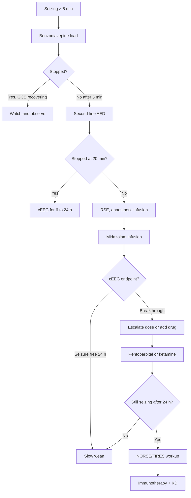

<Callout type="reference">
**Acronyms used on this page**

- **SE**: status epilepticus
- **CSE / NCSE**: convulsive / non-convulsive status epilepticus
- **RSE**: refractory status epilepticus (failed two adequately dosed AEDs)
- **SRSE**: super-refractory status epilepticus (continues or recurs more than 24 h after anaesthetic infusion)
- **NORSE / FIRES**: new-onset refractory SE / febrile infection-related epilepsy syndrome
- **AED**: anti-epileptic drug
- **cEEG / aEEG**: continuous full-montage EEG / amplitude-integrated EEG (reduced-channel envelope)
- **ESETT**: Established Status Epilepticus Treatment Trial
- **ACNS**: American Clinical Neurophysiology Society
- **BSR**: burst-suppression ratio
- **NIRS**: near-infrared spectroscopy
- **CMRO2**: cerebral metabolic rate of oxygen
- **NPi**: neurological pupil index (pupillometry)
- **ICU / PICU**: intensive care unit / paediatric ICU
- **GCS**: Glasgow Coma Scale
</Callout>

<TldrCard>
**The 60-second version.** Refractory status epilepticus (RSE) is seizure activity that has failed both a benzodiazepine and an adequately dosed second-line AED. The two early failure modes are *under-dosing* (Eclipse-SE and ESETT showed median benzodiazepine dose given is well below the weight-based target) and *under-recognition* (50% of convulsive SE that "looks stopped" still has electrographic seizures on cEEG). Get full-montage cEEG on early, ideally within 60 minutes; until it arrives, treat reduced-montage aEEG envelope narrowing as the trigger. Escalate to continuous anaesthetic infusion (midazolam first; pentobarbital, ketamine, or both for super-refractory disease) with a cEEG endpoint of seizure cessation, with or without burst-suppression. Pair NIRS asymmetry and pupillometry NPi for non-EEG sentinels of secondary injury while you titrate the infusion. Outcome is set in the first 60 minutes; the rest of the page is about not losing time.
</TldrCard>

## 1. Three patient vignettes

### Vignette A. Noah, 5 years, the canonical case

Noah, **5 years old, 18 kg**, healthy until six hours ago. Sudden generalised tonic-clonic at home; ambulance called after 5 minutes of seizing. Pre-hospital intramuscular midazolam **5 mg** (0.28 mg/kg, an under-dose). On ED arrival he is still intermittently seizing. Glucose 4.4 mmol/L, electrolytes normal, ABG shows a metabolic acidosis from the convulsive activity itself. He is intubated for airway protection and transferred to the PICU. cEEG is hooked up at the 70-minute mark and shows continuous electrographic seizures despite the paralysis. **Question: he has failed first-line benzodiazepine; what second-line drug, at what dose, and where is the cEEG endpoint that says we can stop?** <Cite id="glauser2016esett" /> <Cite id="kapur2019eclipse_se" />

### Vignette B. Mira, 6 weeks, neonatal RSE

Mira, **6 weeks old, 4.2 kg**, presents from the postnatal ward at 36 hours of life with rhythmic right-arm jerking and intermittent apnoea. Continuous aEEG shows a saw-tooth rhythmic ictal envelope with bursts of suppression in between. She is loaded with **phenobarbital 20 mg/kg IV** (the neonatal first-line per the NEMO trial pathway), then a second 20 mg/kg if breakthrough seizures continue. cEEG confirms an electroclinical dissociation: clinical jerking resolves but rhythmic right hemispheric discharges continue at 1 Hz. **Question: neonatal SE has different drug ordering, different cEEG patterns, and different prognostic implications. Where does Mira fit and what do we add next?** <Cite id="pressler2017neonatal" /> <Cite id="sansevere2023_neonatal_ceeg" />

### Vignette C. Asha, 14 years, NORSE/FIRES presentation

Asha, **14 years old, 52 kg**, well two weeks ago. Five days of low-grade fever, three days of behavioural change, then sudden GTC seizures escalating to status. She has failed midazolam, levetiracetam, valproate, and a midazolam infusion. cEEG shows multifocal, evolving discharges in a bilateral frontal and temporal distribution. CSF: mild lymphocytic pleocytosis, normal protein, no organisms. **MRI** day 3 shows symmetric mesial temporal T2 hyperintensities and cortical ribboning. **Question: this looks like new-onset refractory SE (NORSE) with the febrile-prodrome subgroup (FIRES); what is the parallel workup and how does management differ from ordinary RSE?** <Cite id="trinka2015_status_definition" />

---

## 2. The clinical question

For each of these children: **how do we recognise SE that is not stopping, how do we escalate without losing time, and how do we use bedside multimodal monitoring (cEEG, aEEG, NIRS, pupillometry) to know that we have actually achieved cessation versus chemically paralysed a child whose brain is still seizing?**

---

## 3. Pathophysiology refresher

Status epilepticus is the clinical and electrographic expression of a failure of the brain's inhibitory machinery. Two transitions matter mechanically.

**The first transition: from a self-limiting seizure to SE.** GABA-A receptors are *trafficked* off the post-synaptic membrane after sustained seizure activity. Within 10 to 30 minutes, the same dose of benzodiazepine that would have aborted a single seizure has progressively less effect; the receptors it targets are no longer there. NMDA receptors are *trafficked on*, increasing excitatory drive. This is the mechanistic reason that **early treatment is qualitatively, not just quantitatively, more effective**: the receptor pharmacology changes underneath you while you wait. <Cite id="trinka2015_status_definition" />

**The second transition: from RSE to SRSE.** After 24 hours of continuous seizing, neuronal injury compounds. Hippocampal pyramidal cells (CA1, CA3) and cerebellar Purkinje cells are most vulnerable. Mitochondrial dysfunction, calcium overload, and excitotoxic apoptosis produce both the radiological signature (T2 hyperintensities, restricted diffusion) and the clinical consequence (post-SE cognitive and motor deficits, chronic epilepsy). The longer the seizure goes, the harder it becomes to stop, the worse the substrate of the recovering brain.

**Why does cEEG matter so much?** Two empirical facts. First, **convulsive activity stops before electrographic activity stops** in roughly half of patients with CSE; the muscular contractions damp first but cortical discharges continue. Without cEEG you will believe the seizure ended when it has not. Second, in the **paralysed, ventilated patient on midazolam infusion**, clinical exam is uninformative; cEEG is the only window into whether you have actually achieved cessation. The ACNS pediatric cEEG indications cite SE and RSE as Tier 1 (strongly indicated) precisely because of these two facts. <Cite id="claassen2004" /> <Cite id="herman2015acns_ceeg" /> <Cite id="hirsch2021acns" />

**NIRS and pupillometry come in as sentinels for secondary injury.** Sustained convulsive seizing roughly **doubles regional CMRO2**, outstripping autoregulatory flow reserve in the actively epileptogenic cortex. NIRS rSO2 asymmetry (the affected hemisphere drops first) and a falling NPi (often unilateral with focal injury) flag tissue that is being damaged in real time, even as cEEG documents the discharges. <Cite id="davies2017nirs" /> <Cite id="oddo2018_npi_orange" />

**Pediatric pharmacokinetics differ.** Children clear midazolam, propofol, and pentobarbital faster than adults; weight-banded dosing matters; the propofol-infusion syndrome ceiling (5 mg/kg/h for more than 48 h) is more restrictive in younger children. <Cite id="topjian2021aha_pediatric" />

---

## 4. The multimodal picture

| Monitor | What it shows in RSE | What this rules in or out |
|---|---|---|
| **cEEG (full-montage)** | Continuous or recurrent ictal discharges; evolving rhythmic activity; periodic discharges | Rules in or out NCSE definitively; sets endpoint for anaesthetic titration |
| **aEEG (reduced)** | Saw-tooth envelope rise during seizure; loss of cycling; band narrowing under sedation | Bedside trigger when full cEEG is hours away; cannot diagnose NCSE alone |
| **Clinical exam** | Subtle jerking (eyelids, finger, jaw), autonomic surges, paradoxical bradycardia in the deeply sedated | Unreliable once paralysed; positive findings are useful, negative is not |
| **NIRS rSO2** | Affected hemisphere drops 8 to 15% during prolonged seizure; recovers after cessation | Flags secondary ischaemia in the active focus; asymmetry is the early sign |
| **Pupillometry NPi** | Falls toward 0 to 2 with focal injury or rising ICP; preserved 3 to 5 in pure SE with no mass effect | Rising NPi during weaning supports recovery; falling NPi flags new mass lesion or oedema |
| **ICP (if placed)** | Usually normal in pure SE; rises with FIRES-related oedema or hyponatraemia | Helps separate seizure-driven changes from raised-ICP physiology |
| **Pulse oximetry / capnography** | Desaturation during convulsive phase; hypoventilation post-benzo loading | Airway management trigger |
| **Glucose, electrolytes, ABG** | Hypoglycaemia, hyponatraemia, lactic acidosis, hyperkalaemia | Reversible drivers; recheck every 30 to 60 minutes early on |

---

## 5. Decision tree

<Figure
  src="/images/integration/refractory-status-epilepticus/treatment-ladder.svg"
  alt="Status epilepticus treatment ladder showing benzodiazepine, second-line AED, anaesthetic infusion, and super-refractory salvage layers"
  caption="The pediatric SE treatment ladder. Stage 1 (0 to 5 min): airway, glucose, benzodiazepine. Stage 2 (5 to 20 min): second IV benzodiazepine. Stage 3 (20 to 40 min): ESETT-validated second-line AED (levetiracetam, fosphenytoin, or valproate). Stage 4 (40 to 60 min, established RSE): anaesthetic infusion (midazolam first; add ketamine or switch to pentobarbital if breakthrough). Stage 5 (24 h, SRSE): broaden immunotherapy, ketogenic diet, NORSE workup."
  attribution="MNM-Edu, adapted from ESETT 2019, ACNS 2021, and the Neurocritical Care Society SE pathway. SVG placeholder."
  label="Fig. 1"
/>

<AlgorithmDisclaimer />

---

## 6. Step-by-step bedside actions

For Noah (5 years, 18 kg), the canonical case. Times are from seizure onset.

1. **0 to 5 min: airway, IV, glucose, benzodiazepine.** Lateral position, suction, high-flow oxygen. IV or IO access if not present. Glucose check (target greater than 3.3 mmol/L). **Midazolam 0.2 mg/kg IM** (max 10 mg) or **0.1 mg/kg IV** if access is in. Noah's 18 kg target is 3.6 mg IM or 1.8 mg IV. Pre-hospital under-dosing is the rule, not the exception; document what was actually given. <Cite id="kapur2019eclipse_se" />
2. **5 to 10 min: second benzodiazepine if needed.** Repeat IV midazolam 0.1 mg/kg if still seizing. Two doses maximum before moving to second-line. Recheck airway.
3. **10 to 20 min: second-line AED, ESETT-validated.** Three options have equivalent efficacy in the ESETT trial: **levetiracetam 60 mg/kg IV** (max 4500 mg) over 10 min; **fosphenytoin 20 mg PE/kg IV** (max 1500 mg) at 150 mg PE/min; **valproate 40 mg/kg IV** over 10 min. Levetiracetam is forgiving (no cardiac monitoring required, no infusion-rate hazards, no IV infiltration injury); fosphenytoin needs cardiac monitoring; valproate is contraindicated in suspected mitochondrial disease. Pick one and dose adequately. <Cite id="glauser2016esett" />
4. **20 to 40 min: get cEEG on and look at the trace.** While the second-line is loading, get the cEEG techs in. If full montage is delayed, start a **reduced-channel aEEG** immediately. Treat persistent rhythmic ictal envelope as ongoing SE even if convulsive activity has stopped. <Cite id="herman2015acns_ceeg" />
5. **40 to 60 min: established RSE, anaesthetic infusion.** Persistent electrographic SE after benzodiazepine plus one second-line agent is RSE. Start **midazolam infusion 0.2 mg/kg bolus then 0.1 to 2 mg/kg/h titrated to cEEG endpoint**. Intubate (most are intubated already at this point for airway). Add an arterial line for continuous BP.
6. **60 to 90 min: define and confirm the cEEG endpoint.** Two acceptable endpoints: (a) **seizure cessation with continuous background** (the preferred endpoint when achievable); (b) **burst-suppression** with BSR 50 to 90% for refractory cases where (a) is unobtainable. Pure isoelectric EEG is not the goal; burst-suppression preserves some background.
7. **2 to 6 h: NIRS and pupillometry sentinels.** Bilateral NIRS and 4-hourly pupillometry. NIRS asymmetry greater than 10% in the suspected focus or a falling NPi (less than 3, or asymmetric) flags secondary injury and should prompt imaging.
8. **6 to 24 h: maintain endpoint, watch for breakthrough.** Continuous cEEG review every 4 to 6 hours. Breakthrough discharges trigger escalation: midazolam dose up; add **ketamine 1 to 3 mg/kg bolus then 1 to 5 mg/kg/h**; if pentobarbital is the chosen escalation, **load 5 to 10 mg/kg then 1 to 5 mg/kg/h**.
9. **24 to 48 h: declare SRSE if continuing, broaden workup.** If still seizing after 24 h of anaesthetic infusion: send autoimmune encephalitis panel (anti-NMDA, anti-LGI1, anti-GAD65, paraneoplastic), viral panel, metabolic workup; consider methylprednisolone 30 mg/kg/day; consider IVIG 2 g/kg over 5 days; consider plasmapheresis; consider **ketogenic diet** (start as early as day 3 in SRSE).
10. **48 to 96 h: cautious wean.** When the cEEG has been seizure-free for 24 to 48 hours, wean midazolam by 20 to 30% every 6 to 12 hours under continuous cEEG, looking for breakthrough discharges. If breakthrough, return to the prior step and try again 24 h later. Some children need a 5 to 14 day taper; some wean cleanly in 48 hours.

---

## 7. Management ladder and endpoints

**Success looks like:** seizure cessation on cEEG with preserved background or burst-suppression at BSR 50 to 90%; haemodynamics stable on titrated infusion; NPi recovering toward 4 to 5; NIRS symmetry restored; daily AED levels in target range.

**Failure looks like:** breakthrough electrographic seizures within 6 hours of dose; refractory hypotension on the infusion (consider noradrenaline support; consider switching agent); evolving NIRS asymmetry; falling NPi; new neurological deficit; oedema on imaging.

**When to escalate:**
- Breakthrough at 24 h on midazolam alone, add ketamine or switch to pentobarbital.
- Breakthrough at 48 to 72 h after two infusions, declare SRSE, broaden workup, immunotherapy, consider ketogenic diet.
- Breakthrough at 5 to 7 d, consider compassionate-use agents (perampanel, lacosamide, brivaracetam), specialist centre transfer.

**When to de-escalate:**
- 24 h seizure-free on cEEG with stable BSR target met.
- Hyponatraemia, fever, hypoglycaemia all corrected.
- No active autoimmune or infectious driver requiring escalation.
- AED levels in maintenance range.
- Family conversation about goals of care is current.

---

## 8. Variant subsections

### 8.1 Convulsive versus non-convulsive SE

Convulsive SE (CSE) has visible motor activity and is recognised within minutes. Non-convulsive SE (NCSE) is electrographic seizing without sustained motor signs; it accounts for **roughly half of all post-convulsive comas** and is missed entirely without cEEG. NCSE in the obtunded post-cardiac-arrest patient, the post-TBI patient, or the post-meningitis patient is one of the strongest indications for cEEG in any PICU. <Cite id="claassen2004" /> <Cite id="foreman2012" /> <Cite id="herman2015acns_ceeg" />

### 8.2 Super-refractory SE (SRSE)

Defined as SE that continues 24 hours or recurs after attempted wean from a continuous anaesthetic infusion. Mortality is 30 to 50% even in well-resourced centres. Mainstays of management: (i) broaden the differential (autoimmune, paraneoplastic, metabolic, mitochondrial); (ii) consider second and third anaesthetic agents in combination (midazolam plus ketamine; pentobarbital coma); (iii) ketogenic diet, ideally by day 3 to 5 of SRSE; (iv) immunotherapy stack (steroids, IVIG, plasmapheresis, rituximab); (v) transfer to a centre with experience in NORSE/FIRES.

### 8.3 Anti-NMDA receptor encephalitis and autoimmune-related RSE

Subacute behavioural change, then movement disorder, then orofacial dyskinesias, then RSE. Often young women and adolescent girls; sometimes preceded by HSV encephalitis or ovarian teratoma. CSF anti-NMDA antibody is diagnostic. Treatment: tumour removal if applicable, steroids, IVIG, plasmapheresis, rituximab, cyclophosphamide. Recovery may be slow (weeks to months) but is often substantial.

### 8.4 FIRES (febrile infection-related epilepsy syndrome)

Previously well child, febrile prodrome of 2 to 14 days, then explosive onset RSE that becomes SRSE. MRI is often normal early; later shows mesial temporal T2 hyperintensities. No specific autoantibody usually found; CSF and serum often unremarkable; cytokine storm physiology suspected. Ketogenic diet has reasonable evidence; anakinra (IL-1 receptor antagonist) and tocilizumab (IL-6 inhibitor) are being used in specialist centres. Mortality and long-term morbidity are high. <Cite id="trinka2015_status_definition" />

### 8.5 Neonatal status epilepticus

Different pharmacology and different first-line. **Phenobarbital 20 mg/kg IV** is first-line (NEMO trial); levetiracetam is reasonable second-line; midazolam infusion is the bridge to pyridoxine trial and metabolic workup. cEEG patterns differ (more multifocal, more clinical-electrical dissociation). Pyridoxine-dependent epilepsy needs a single 100 mg dose to exclude; pyridoxal-5-phosphate-responsive forms require 30 mg/kg/day. Long-term prognosis is worse than in older children, particularly when SE follows HIE or cortical malformations. <Cite id="pressler2017neonatal" /> <Cite id="sansevere2023_neonatal_ceeg" />

### 8.6 Post-cardiac-arrest non-convulsive SE

The post-arrest paralysed and cooled patient is the textbook NCSE-misses-it scenario. Up to 30% of comatose post-arrest patients have electrographic SE on cEEG. Treatment improves seizure control; whether it improves outcome in the dead-but-not-yet-declared brain is the subject of TELSTAR-style ongoing trials. Reasonable practice: cEEG on every cooled or recently cooled post-arrest patient; treat electrographic SE if present; cap aggression on the third escalation if the background is severely suppressed. <Cite id="topjian2021aha_pediatric" /> <Cite id="naim2023_brain_injury_pccm" />

---

## 9. Multimodal integration matrix

| Pair | What you gain | Worked scenario |
|---|---|---|
| **cEEG + aEEG** | aEEG runs continuously at the bedside; cEEG is read intermittently. Envelope narrowing on aEEG is the alarm that prompts cEEG review | Reduced-staff overnight at a regional PICU |
| **cEEG + NIRS** | NIRS asymmetry localises the active focus; cEEG confirms electrographic ictus in the same hemisphere | Focal RSE in a child with prior hemispherectomy |
| **cEEG + Pupillometry** | Falling NPi during midazolam wean flags either breakthrough seizure or new mass effect | Day 5 SRSE with new oedema |
| **NIRS + Clinical exam** | Catch the autonomic surge before the cEEG operator sees it | The night shift watching the bedside trace |
| **Pupillometry + ICP** | NPi and ICP both rise together with secondary oedema; either alone is non-specific | FIRES day 4 with rising opening pressure |
| **AED levels + cEEG** | Confirms drug delivery before declaring "RSE" | Suspected non-adherence or extravasation |

---

## 10. Worked alternative scenarios

### 10.1 What if it is not really status?

A 6-year-old with prolonged shivering, eyes deviated, post-anaesthetic emergence. cEEG is normal. Reassess: this is post-anaesthetic delirium, not SE. Do not start a second-line AED; reverse the precipitant. The discriminator is **cEEG before escalation**.

### 10.2 What if the second-line drug is contraindicated?

A 15-month-old with global developmental delay, hypotonia, episodic lactic acidosis. Suspected mitochondrial disease. **Valproate is contraindicated** (POLG1-related hepatotoxicity risk). Use **levetiracetam** first; if breakthrough, **phenobarbital** rather than fosphenytoin (phenytoin is also pro-mitochondrial). Send a metabolic panel; pyridoxine trial 100 mg IV. <Cite id="parikh2017_mito_consensus" />

### 10.3 What if the cEEG endpoint is unobtainable?

A 12-year-old septic patient, post-meningitis RSE, midazolam at 1.5 mg/kg/h with hypotension at MAP 50 needing noradrenaline. Cannot escalate sedation without further haemodynamic compromise. Accept a higher seizure-burden endpoint (intermittent breakthrough discharges acceptable in this physiology), prioritise sepsis source control, broaden cover, manage haemodynamics, and reassess for further sedation escalation once stabilised. The goal is the best achievable, not the textbook ideal.

---

## 11. Outcome data

- **ESETT (Kapur 2019, Glauser 2016):** in the second-line AED trial, levetiracetam, fosphenytoin, and valproate produced clinical seizure cessation in **roughly 50%** at 60 minutes (45% to 52% across arms; no significant difference). The trial settled the long debate about second-line drug choice and reframed the question as one of **dose adequacy and early administration**. <Cite id="glauser2016esett" /> <Cite id="kapur2019eclipse_se" />
- **Time-to-treatment effect (Trinka 2015 definition; multiple cohorts):** every 10-minute delay in benzodiazepine reduces the probability of cessation by **approximately 5%**. Seizure control at 60 minutes drops from 80% (treated within 30 min) to **30 to 40%** (treated after 60 min). The earlier the better, with no plateau. <Cite id="trinka2015_status_definition" />
- **ACNS pediatric cEEG indications (Herman 2015; Hirsch 2021 nomenclature):** cEEG is recommended (Tier 1) for SE / RSE / suspected NCSE. The 2021 ACNS standardised nomenclature has improved inter-rater reliability for ictal-interictal continuum patterns. <Cite id="herman2015acns_ceeg" /> <Cite id="hirsch2021acns" />
- **Neonatal SE (Pressler 2017 NEMO trial):** phenobarbital first-line achieves seizure cessation in roughly 50% of neonates; bumetanide as an adjunct did not improve outcomes in NEMO. <Cite id="pressler2017neonatal" />
- **Post-arrest NCSE (Topjian 2021 AHA, Naim 2023):** electrographic seizures are present in 10 to 30% of comatose post-arrest children; their treatment improves short-term seizure burden, with uncertain effect on neurological outcome. <Cite id="topjian2021aha_pediatric" /> <Cite id="naim2023_brain_injury_pccm" />
- **Foreman 2022 cEEG review:** modern pediatric cEEG yield (proportion of monitored patients with electrographic seizures) is 10 to 40% depending on indication; highest in clinical SE, intermediate in post-cardiac-arrest, lower in routine neuro-checks. <Cite id="foreman2022" />

---

## 12. Pitfalls

- **Under-dosing the benzodiazepine.** Both ESETT and pre-hospital studies (Eclipse-SE) show that the *typical* benzo dose given is 50 to 70% of the weight-based target. Document and re-dose if needed. <Cite id="kapur2019eclipse_se" />
- **Believing the seizure has stopped because the convulsion has stopped.** Roughly half of CSE that "looks stopped" still has electrographic ictus on cEEG. Until cEEG is reviewed, treat as ongoing.
- **Waiting for cEEG before treating.** cEEG informs *what to do next*; do not delay second-line or anaesthetic infusion for the trace. Use clinical and aEEG findings to act.
- **Hyperventilating to manage suspected ICP.** SE is a CMRO2 problem first; hypocapnia worsens regional ischaemia in the active focus. Keep PaCO2 in the normal range.
- **Choosing valproate in suspected mitochondrial disease.** POLG1-related hepatotoxicity is fatal; default to levetiracetam first-line in any infant with lactic acidosis or developmental regression. <Cite id="parikh2017_mito_consensus" />
- **Propofol infusion syndrome in children.** PRIS risk rises sharply above 5 mg/kg/h or beyond 48 h of infusion in children; pentobarbital is the preferred prolonged anaesthetic for paediatric SE.
- **Setting the cEEG endpoint at isoelectric EEG.** Burst-suppression at BSR 50 to 90% is the target; isoelectric brain is *not* the goal and exposes the patient to unnecessary haemodynamic risk.
- **Forgetting electrolyte and glucose monitoring.** SIADH is common; hyponatraemia worsens seizures; correct slowly. Recheck glucose, sodium, calcium, magnesium every 60 minutes early.

---

## 13. Pediatric considerations

<Pediatric>
**Pediatric SE is not adult SE at smaller doses.**

- **Weight-banded dosing** matters; document the actual mg given. The "average" pediatric SE patient gets under-dosed at every stage of the pathway.
- **First-line drug differs by age.** Neonates: phenobarbital. Infants and children: benzodiazepine (midazolam IM, IV, or IN; lorazepam IV; rectal diazepam if no access).
- **Valproate is contraindicated** in suspected mitochondrial disease (use levetiracetam or phenobarbital instead).
- **Propofol infusion syndrome** is a stricter ceiling in children; pentobarbital is the preferred long-duration anaesthetic.
- **Ketogenic diet** can be started as early as day 3 of SRSE in children; centres with paediatric metabolic dietitians get it on faster.
- **Family conversations** should start early. RSE that becomes SRSE has 30 to 50% mortality; talking about goals of care at the 24 h mark is appropriate, not premature.
- **Long-term outcomes** are better in children than in adults with comparable durations of SRSE; recovery may take months and is worth waiting for, especially in NORSE/FIRES.
</Pediatric>

---

## 14. Combine with

- [EEG / aEEG modality page](/modalities/eeg/): full-montage versus reduced-channel, ACNS nomenclature, ictal-interictal continuum.
- [NIRS modality page](/modalities/nirs/): asymmetry as a localising tool during SE.
- [Pupillometry / NPi](/modalities/pupillometry/): bedside neurochecks that survive paralysis.
- [Integration: EEG-TCD non-convulsive seizure pair](/integration/eeg-tcd-non-convulsive/): the discordant aEEG-with-TCD-pulsations scenario.
- [Integration: Family communication](/integration/family-communication-mnm/): conversations during prolonged RSE and SRSE.
- [Foundations: cerebral metabolism](/foundations/cerebral-metabolism/): why SE doubles CMRO2 and what the consequences are.

---

<DeepDive>

## 15. Evidence summary

| Topic | Source | Grade |
|---|---|---|
| ESETT second-line AED trial | <Cite id="glauser2016esett" /> <Cite id="kapur2019eclipse_se" /> | A |
| SE operational definition | <Cite id="trinka2015_status_definition" /> | expert |
| ACNS pediatric cEEG indications | <Cite id="herman2015acns_ceeg" /> | expert |
| ACNS standardised nomenclature | <Cite id="hirsch2021acns" /> | expert |
| NCSE in coma (Claassen 2004) | <Cite id="claassen2004" /> | B |
| cEEG yield in post-arrest | <Cite id="foreman2012" /> <Cite id="foreman2022" /> | B |
| Pediatric AHA post-arrest care | <Cite id="topjian2021aha_pediatric" /> | expert |
| Neonatal SE (NEMO) | <Cite id="pressler2017neonatal" /> | B |
| Neonatal cEEG review | <Cite id="sansevere2023_neonatal_ceeg" /> | review |
| Mitochondrial disease and AEDs | <Cite id="parikh2017_mito_consensus" /> | expert |
| NIRS in acute injury | <Cite id="davies2017nirs" /> | B |
| Pupillometry / NPi | <Cite id="oddo2018_npi_orange" /> | B |
| Pediatric pupillometry | <Cite id="freeman2020_pediatric_pupil" /> | C |
| Brain injury after cardiac arrest | <Cite id="naim2023_brain_injury_pccm" /> | review |

## 16. Recent literature (2022 to 2025)

- **Foreman 2022 review** updates the case for cEEG in the modern PICU; key change since the 2012 piece is the wider availability of reduced-montage continuous trace as a 24/7 bedside resource. <Cite id="foreman2022" />
- **Hirsch 2021 ACNS nomenclature** has improved inter-rater reliability for ictal-interictal continuum patterns, particularly periodic discharges. <Cite id="hirsch2021acns" />
- **Sansevere 2023 neonatal cEEG review** describes the rising adoption of full-montage continuous EEG in level III NICUs and the residual barriers (technician availability overnight, neurology coverage). <Cite id="sansevere2023_neonatal_ceeg" />
- **Topjian 2021 pediatric AHA** consolidates post-arrest cEEG as standard of care for the cooled or recently cooled child. <Cite id="topjian2021aha_pediatric" />
- **Naim 2023 PCCM brain injury after arrest** quantifies the relationship between electrographic seizure burden and 12-month neurological outcome. <Cite id="naim2023_brain_injury_pccm" />

</DeepDive>

---

## 17. Self-check

<Quiz
  questions={[
    {
      id: 'q1',
      prompt: 'Noah, 5 years, 18 kg, has been seizing for 25 minutes. Pre-hospital midazolam 5 mg IM was given, then IV midazolam 0.1 mg/kg in ED with no effect. He is now intubated and cEEG shows continuous generalised spike-and-wave at 2 Hz. What is the most appropriate next step?',
      options: [
        { id: 'a', label: 'Repeat IV midazolam 0.1 mg/kg' },
        { id: 'b', label: 'Load levetiracetam 60 mg/kg IV over 10 minutes' },
        { id: 'c', label: 'Start midazolam infusion at 0.1 mg/kg/h' },
        { id: 'd', label: 'Hyperventilate to PaCO2 25 mmHg to reduce CMRO2' },
      ],
      answer: 'b',
      explanation: 'He has failed adequately dosed benzodiazepine and is now in established SE moving toward refractory. The next step per ESETT is a second-line AED at full dose: levetiracetam 60 mg/kg, fosphenytoin 20 PE/kg, or valproate 40 mg/kg, all equivalent in the trial. Starting an anaesthetic infusion (c) without the second-line step is a missed treatment opportunity. Hyperventilation worsens regional ischaemia and is not indicated.',
    },
    {
      id: 'q2',
      prompt: 'A 14-year-old with 4 days of fever and behavioural change is now in refractory SE on midazolam 1.5 mg/kg/h with breakthrough discharges at 36 h. CSF shows mild lymphocytic pleocytosis with no organism. MRI shows symmetric mesial temporal T2 hyperintensities. What pattern does this describe, and what should be added at this point?',
      options: [
        { id: 'a', label: 'Anti-NMDA encephalitis; add rituximab' },
        { id: 'b', label: 'Bacterial meningitis; broaden antibiotics' },
        { id: 'c', label: 'FIRES; add ketogenic diet and consider immunotherapy and anakinra' },
        { id: 'd', label: 'Mitochondrial disease; switch midazolam to pentobarbital' },
      ],
      answer: 'c',
      explanation: 'Previously well child, febrile prodrome of days, explosive onset SE, mesial temporal T2 hyperintensities on MRI fits the FIRES syndrome. Early ketogenic diet has reasonable evidence; immunotherapy (steroids, IVIG, plasmapheresis) and IL-1 receptor antagonism (anakinra) are reported to help in specialist centres. Anti-NMDA is in the differential and the antibody panel should be sent, but FIRES is the working diagnosis here.',
    },
    {
      id: 'q3',
      prompt: 'A 6-week-old neonate has 30 minutes of rhythmic right-arm clonic activity. aEEG shows a saw-tooth ictal envelope. Glucose, sodium, and calcium are normal. What is the first-line drug?',
      options: [
        { id: 'a', label: 'Lorazepam 0.1 mg/kg IV' },
        { id: 'b', label: 'Phenobarbital 20 mg/kg IV' },
        { id: 'c', label: 'Fosphenytoin 20 PE/kg IV' },
        { id: 'd', label: 'Midazolam 0.1 mg/kg IV' },
      ],
      answer: 'b',
      explanation: 'In neonates, phenobarbital 20 mg/kg IV is first-line per the NEMO trial and consensus pathways, with the option to re-dose to 40 mg/kg total. Benzodiazepines and phenytoin are second-line in this age band. The pharmacokinetics, receptor maturation, and clinical-electrical dissociation pattern of neonatal SE make the adult/older-child algorithm inappropriate.',
    },
  ]}
/>
