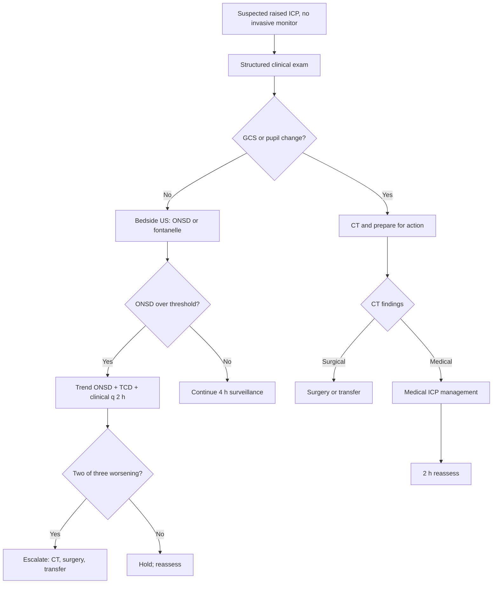

<Callout type="reference">
**Acronyms used on this page**

- **MNM / MMM**: multimodal neuromonitoring / multimodal monitoring
- **ICP / CPP / MAP**: intracranial pressure / cerebral perfusion pressure / mean arterial pressure
- **TCD**: transcranial Doppler
- **MFV / PSV / EDV / PI**: mean / peak systolic / end-diastolic flow velocity / pulsatility index
- **ONSD**: optic nerve sheath diameter (ultrasound)
- **nICP**: non-invasive intracranial pressure estimate
- **cEEG / aEEG**: continuous EEG / amplitude-integrated EEG (reduced channels)
- **NIRS / rSO2**: near-infrared spectroscopy / regional cerebral oxygen saturation
- **NPi**: neurological pupil index
- **GCS**: Glasgow Coma Scale
- **CT / MRI**: computed tomography / magnetic resonance imaging
- **EVD**: external ventricular drain
- **PICU / NICU**: paediatric / neonatal intensive care unit
- **TBI / HIE / SAH / DKA**: traumatic brain injury / hypoxic-ischaemic encephalopathy / subarachnoid haemorrhage / diabetic ketoacidosis
- **LMIC / HIC**: low- and middle-income / high-income countries
</Callout>

<TldrCard>
**The 60-second version.** Most of the world's paediatric neurocritical care happens without invasive ICP, without full-montage cEEG, often without TCD or NIRS. The Figaji 2025 paediatric MMM consensus formalises a *resource-stratified* bundle. The minimum viable bundle at the bedside in a unit without invasive monitoring: (1) **structured clinical exam** every 1 to 2 hours (GCS, focal signs, pupillary check, fontanelle in infants); (2) **ocular ONSD** by bedside ultrasound with age-banded thresholds (greater than 5.0 mm school-age, greater than 4.5 mm 1 to 5 y, greater than 4.0 mm infants); (3) **fontanelle ultrasound** in infants (ventricular size, midline shift, mass effect); (4) **handheld TCD-PI** where available, with the trend more useful than any single number; (5) **bedside pupillometer or NPi** where available, the digitisation step beyond the torch-and-ruler exam. Sequential trending of any of these (every 2 to 4 hours) beats a single snapshot. CT remains the imaging cornerstone in this setting; MRI is for selected cases.
</TldrCard>

## 1. Three patient vignettes

### Vignette A. Amani, 3 years, suspected meningitis in a regional PICU

Amani, **3 years old, 13 kg**, presents to a 6-bed regional PICU with three days of fever, headache, vomiting, and a stiff neck. CT (available) shows mild cerebral oedema with effacement of basal cisterns. CSF is purulent. Antibiotics started in the emergency department. **No invasive ICP monitor available. No full-montage cEEG.** What is available: ultrasound machine, bedside aEEG (4-channel), 2 MHz TCD probe (handheld), portable pupillometer, NIRS. The unit nurse cohorts patients; the intensivist covers PICU and ED. **Question: what is the minimum viable MNM bundle, how often do we reassess, and what triggers transfer to the tertiary centre 4 h away?** <Cite id="figaji2025_mmm_pediatric_consensus" /> <Cite id="cardim2016_nicp_review" />

### Vignette B. Bashir, 6 weeks, suspected raised ICP from haemorrhage

Bashir, **6 weeks, 4.6 kg**, presents to a district hospital after 24 h of poor feeding and a tense fontanelle noted by the parent. **No CT scanner on site.** What is available: bedside ultrasound (with neonatal probe), aEEG, pulse oximetry, glucose monitoring. The fontanelle US shows ventriculomegaly with a hyperechoic lesion suggesting intraventricular haemorrhage with hydrocephalus. Pupils 4 mm reactive bilaterally; fontanelle is tense and non-pulsatile. **Question: in this neonate, what does the fontanelle US tell you about ICP, what is the role of aEEG, and how do we manage during the transfer to the regional unit (estimated 90 minutes by road)?** <Cite id="padayachy2012" />

### Vignette C. Chitra, 9 years, post-TBI in a busy LMIC PICU

Chitra, **9 years, 28 kg**, transferred from a peripheral hospital after a road traffic accident. GCS 9, right pupil 4 mm reactive, left 3 mm reactive. CT shows a small subdural with mild oedema. **No invasive ICP available** at the receiving PICU. The unit has 12 beds, 2 nurses for the shift, and one TCD probe shared between PICU and ED. NIRS is available on one bed. **Question: how do we triage Chitra (does she need an EVD, is medical management adequate, when do we re-image, who needs the NIRS probe most)?** <Cite id="kochanek2019_pbtf4" /> <Cite id="chesnut2012best" />

---

## 2. The clinical question

For each of these children: **what is the minimum viable multimodal bundle at this centre, what is the surveillance interval, and what triggers an escalation that the unit may not be able to provide locally (transfer, surgery, mechanical ventilation)?**

---

## 3. Pathophysiology refresher

The brain in critical illness loses two things at the same time: autoregulatory reserve and the safety margin between supply and demand. Whether the driver is TBI, infection, DKA, HIE, or stroke, the final common pathway is similar: cytotoxic and vasogenic oedema, mass effect, falling CPP, falling tissue oxygen delivery, secondary injury.

The role of monitoring is to detect this cascade early enough to intervene. In a well-resourced centre, intracranial pressure is measured directly, NIRS and PbtO2 give tissue-level information, and cEEG monitors cortex. In a resource-limited centre, the bundle is necessarily indirect: a structured clinical exam captures most of the supratentorial injury; ONSD is a surrogate for ICP greater than 20 mmHg; TCD PI is a surrogate for cerebral resistance; fontanelle US in infants is anatomy plus ICP surrogate; aEEG is the reduced-channel surrogate for cEEG.

**Why does each surrogate work?**

- **ONSD**: the optic nerve is a CNS structure surrounded by subarachnoid space contiguous with the intracranial space. Raised ICP transmits into the perineural subarachnoid space and distends the sheath. Pediatric thresholds: greater than 5.5 mm (over 1 y) or greater than 5.0 mm (under 1 y) correlate with ICP greater than 20 mmHg with sensitivity 0.85 to 0.95 and specificity 0.7 to 0.85 across paediatric series. <Cite id="padayachy2016_pediatric_onsd" /> <Cite id="robba2018_onsd_review" />
- **TCD PI**: distal cerebrovascular resistance rises as ICP rises; the Bellner regression (ICP approximately equal to 10.93 × PI − 1.28) is a triage tool, not a measurement, but a PI greater than 1.4 with low EDV in the right clinical context is highly suggestive of raised ICP. <Cite id="bellner2004" />
- **Fontanelle US in infants**: anatomy (ventriculomegaly, midline shift, mass lesion) plus indirect ICP surrogate (fontanelle tension correlates with ICP in infants).
- **aEEG**: continuity, cycling, and seizure detection in a 2 to 4 channel reduced array; not diagnostic for NCSE but a useful screening tool. <Cite id="herman2015acns_ceeg" />
- **NIRS rSO2**: tissue oxygen saturation in the frontal cortex; falling rSO2 in the affected hemisphere flags worsening perfusion-extraction balance. <Cite id="davies2017nirs" />
- **NPi (pupillometry)**: digitised pupillary reaction that survives ambient lighting and inter-rater variability. <Cite id="oddo2018_npi_orange" />

**The sequential-trending principle.** No single non-invasive measurement is as specific as direct ICP monitoring. The compensation is *trending*: an ONSD that grows from 4.8 to 5.6 over 2 hours is more informative than a single 5.6 measurement, and a TCD PI rising from 1.0 to 1.6 is more informative than a single 1.6. The 2 to 4 hour reassessment interval is the operational expression of this principle.

**The Figaji 2025 paediatric MMM consensus** formalises this approach: bundles are defined by what resources are available, with a minimum viable set for the lowest-resource centre and incremental additions as resources allow. <Cite id="figaji2025_mmm_pediatric_consensus" />

---

## 4. The multimodal picture

| Modality | Available at most resource-limited centres? | What it shows | What it triggers |
|---|---|---|---|
| **Structured clinical exam** | Always | GCS trend, pupillary response, focal signs, fontanelle in infants | Action on any worsening; reassessment interval 1 to 2 h |
| **Pupillometry (manual)** | Always | Pupil size, reactivity, asymmetry | Asymmetry or new fixed dilatation = urgent imaging or surgery |
| **NPi (digital pupillometer)** | Increasingly available | NPi 3 to 5 normal; less than 3 abnormal; less than 0.6 critical | Falling NPi triggers re-evaluation |
| **Bedside ultrasound (ONSD)** | Where US is available | ONSD age-banded thresholds; sequential rise more useful than single value | ONSD greater than threshold prompts CT and management for raised ICP |
| **Fontanelle ultrasound** | In infants where US available | Ventricular size, midline shift, mass effect, IVH | Drives surgical decisions, transfer urgency |
| **Handheld TCD** | Often available | PI, EDV, MFV; trend across hours | Rising PI plus falling EDV plus clinical change = urgent action |
| **Bedside aEEG** | Often available | Continuity, cycling, ictal envelope | Loss of cycling, ictal envelope triggers neurology consult and AED loading |
| **Bedside NIRS** | Sometimes available | rSO2 trend; asymmetry | Asymmetry or falling rSO2 prompts perfusion review |
| **CT (on-site or accessible)** | Variable | Anatomy: oedema, mass, midline shift, ventricular size | Surgical decisions; transfer triggers |
| **MRI** | Selected, often delayed | Detailed anatomy, ischaemia, oedema patterns | Subacute management, prognosis |
| **Invasive ICP, PbtO2, cEEG** | Often absent | Direct measurements | When available, the gold standard |

---

## 5. Decision tree

<Figure
  src="/images/integration/resource-limited-bedside/three-modality-bundle.svg"
  alt="Three-modality bundle schematic showing clinical exam, ONSD ultrasound, and handheld TCD in a regional PICU"
  caption="The minimum viable bundle for a resource-limited PICU. Clinical exam (GCS, pupils, fontanelle, focal signs) every 1 to 2 hours. ONSD by bedside ultrasound every 2 to 4 hours with age-banded thresholds. Handheld TCD PI every 2 to 4 hours. Fontanelle US in infants. The trend across hours is more informative than any single snapshot."
  attribution="MNM-Edu, original schematic. SVG placeholder."
  label="Fig. 1"
/>

<AlgorithmDisclaimer />

---

## 6. Step-by-step bedside actions

For Amani (3 y, 13 kg, suspected bacterial meningitis with cerebral oedema). Times are from PICU admission.

1. **0 to 30 min: structured first assessment.** GCS (start with verbal: opening eyes to voice, withdrawing to pain, slurring words), pupillary exam (size in mm, reactivity yes or no, symmetry), fontanelle in any infant, focal neurological signs (asymmetric tone, posturing, hemiparesis). Document baseline.
2. **30 to 60 min: empirical antibiotics already started in ED, continue.** Adequate dosing: ceftriaxone 100 mg/kg IV (max 4 g), plus vancomycin 15 mg/kg IV (target trough 15 to 20). Steroid co-administration per local protocol (dexamethasone 0.6 mg/kg/day in 4 divided doses for pneumococcal meningitis). <Cite id="brouwer2010_dexamethasone_meta" /> <Cite id="vandebeek2016eu_meningitis" />
3. **60 to 90 min: ONSD ultrasound.** With the linear probe (or curved if linear unavailable), measure ONSD 3 mm posterior to the globe on transverse view. Average of 3 measurements per eye. Age-banded threshold for a 3-year-old: greater than 4.5 to 5.0 mm. Document baseline.
4. **60 to 90 min: TCD if probe available.** MCA insonation through the temporal window. PI, EDV, MFV. Healthy 3-year-old: MFV roughly 85 cm/s, PI 0.7 to 1.0. Document baseline.
5. **60 to 90 min: bedside aEEG.** Reduced-channel array. Continuity (continuous, discontinuous, burst-suppression, isoelectric); cycling (sleep-wake variation); ictal envelope (saw-tooth rises).
6. **60 to 90 min: NIRS if available.** Bilateral frontal probes. Baseline rSO2 (typically 60 to 80% in children); asymmetry less than 10% is normal.
7. **Every 1 to 2 h: structured clinical exam.** GCS, pupils, focal signs; document trend.
8. **Every 2 to 4 h: ONSD plus TCD plus aEEG review.** Trend the numbers. A two-out-of-three rule: if two of ONSD, TCD-PI, and clinical exam are worsening, escalate (CT, mannitol or hypertonic saline, prepare for transfer).
9. **Triggers for CT or transfer:** GCS drop greater than 2; new pupillary asymmetry or unilateral dilation; ONSD rising rapidly toward or above threshold; TCD PI greater than 1.4 with low EDV; loss of aEEG cycling or new ictal envelope; falling rSO2.
10. **Triggers for empirical osmotherapy:** clinical deterioration without immediate CT availability; two-of-three bundle worsening; signs of imminent herniation. Dose: hypertonic saline 3% 5 mL/kg (preferred in meningitis where the blood-brain barrier may be disrupted) or mannitol 0.5 g/kg.

---

## 7. Management ladder and endpoints

**Success looks like:** GCS improving or stable; pupils symmetric and reactive; ONSD stable or falling below threshold; TCD PI falling toward 1.0; aEEG cycling preserved; rSO2 stable.

**Failure looks like:** GCS dropping; new pupillary asymmetry; ONSD continuing to rise despite osmotherapy; TCD PI rising; aEEG losing cycling or new ictal envelope.

**When to escalate (when possible):**
- Failure of medical management plus a transferable patient, urgent transfer to centre with invasive monitoring and neurosurgery.
- Failure plus immediate surgical lesion (haematoma, hydrocephalus) plus on-site theatre, surgery.
- Failure plus no transfer or surgery available, maximum medical management with documentation.

**When to de-escalate:**
- 24 to 48 h of stable or improving exam.
- ONSD and TCD trending normal.
- aEEG cycling restored.
- Source of acute insult under control (antibiotics for infection, oedema resolving, glucose stable).

---

## 8. Variant subsections

### 8.1 Severe TBI in resource-limited PICU

The 2012 BEST-TRIP trial demonstrated that a protocol of imaging plus structured clinical exam was non-inferior to invasive ICP monitoring for moderate to severe TBI in a setting where invasive monitoring was previously rare. This does *not* mean invasive monitoring is unnecessary in all settings, but it does demonstrate that careful structured care without invasive monitoring is a defensible default in resource-limited contexts. The 2019 PBTF guidelines recommend a tiered approach: clinical and imaging, then invasive when available. <Cite id="chesnut2012best" /> <Cite id="kochanek2019_pbtf4" />

### 8.2 Meningitis and encephalitis

Bacterial meningitis with cerebral oedema is the classical case for the non-invasive bundle in this setting. Antibiotics, steroids (for pneumococcal), and bedside ONSD plus TCD plus clinical exam guide the early hours. Tuberculous meningitis adds vasculitic vasospasm as a downstream complication; rising TCD MFV with high LR in the second week is the bedside sign. <Cite id="vandebeek2016eu_meningitis" /> <Cite id="tunkel2017idsa_encephalitis" /> <Cite id="brouwer2010_dexamethasone_meta" />

### 8.3 DKA cerebral oedema

Pediatric DKA cerebral oedema typically presents 4 to 12 hours into rehydration with progressive headache, lethargy, and (later) pupillary signs. Bedside TCD documenting rising PI before pupillary signs appear is the signature of pre-emptive recognition. The 2018 PECARN DKA fluid trial showed that the rate of clinical brain injury is independent of fluid rate within the protocol range, removing some controversy about rehydration speed. <Cite id="kuppermann2018_pecarn_dka" /> <Cite id="glaser2024_dka_review" />

### 8.4 Neonatal HIE without aEEG or full cEEG

In a centre with only clinical exam and intermittent EEG, the Sarnat staging plus clinical seizure monitoring are the bedside tools. Active cooling at 33 to 34 C is now standard of care globally and is feasible in resource-limited centres. Fontanelle US for IVH and hydrocephalus. MRI day 4 to 7 for prognosis where available. <Cite id="shankaran2005hie_nichd" /> <Cite id="sansevere2023_neonatal_ceeg" />

### 8.5 Post-cardiac-arrest in regional PICU

The cooled or recently cooled child is one of the high-yield cEEG indications; in the absence of cEEG, aEEG is the bridge. Clinical exam is unreliable during sedation and cooling. NIRS asymmetry is a useful localising flag. Pupillometry trend is the bedside neurocheck. <Cite id="topjian2021aha_pediatric" /> <Cite id="moler2015thapca_oh" />

### 8.6 Transfer triggers and stabilisation for transit

In any of the above scenarios, transfer to a tertiary centre is the escalation when bedside management is exhausted. Pre-transfer checklist: secured airway, two-large-bore IV access, mannitol or hypertonic saline drawn up and ready, AED ready, vasopressor available, paramedic crew briefed, receiving centre confirmed, family informed. ONSD and TCD repeated immediately pre-departure for handover trend. CT performed if not already.

---

## 9. Multimodal integration matrix

| Pair | What you gain | Worked scenario |
|---|---|---|
| **Clinical exam + ONSD** | Cross-validates raised ICP suspicion; ONSD acts as the "extended exam" | Amani's meningitis bundle |
| **ONSD + TCD-PI** | Two independent non-invasive ICP surrogates; concordance increases confidence | Chitra, TBI without invasive monitor |
| **Fontanelle US + aEEG** | Anatomy plus electrical state in the infant; the two infant-specific tools | Bashir, neonatal IVH |
| **TCD-PI + NIRS** | Macrovascular flow plus tissue oxygen; the autoregulation signal | Post-DKA child during fluid management |
| **Clinical exam + Pupillometry** | Quantifies the pupil exam that survives inter-rater variability | Repeated 2-hourly checks |
| **CT + bedside ultrasound** | Anatomic snapshot plus continuous bedside trending | The standard pairing where CT is available |

---

## 10. Worked alternative scenarios

### 10.1 What if the ONSD is high but the patient looks well?

A 5-year-old with chronic hydrocephalus on a ventriculoperitoneal shunt, baseline ONSD 5.4, current value 5.6, asymptomatic. The thresholds are not absolute; chronic raised ICP from any cause produces ONSD remodelling and the threshold needs to be patient-relative. Look at the trend (is it rising versus baseline?) and the clinical context (any shunt-failure signs?). A static elevated ONSD in a well child does not require action; a rising trend does.

### 10.2 What if the TCD probe gives no signal?

In about 10 to 15% of children (more in older girls with thicker temporal bone), the temporal window is poor and the TCD signal is weak or absent. Options: try the contralateral window; try the suboccipital window for basilar (the head will tell you what is happening centrally); try a different position (head-of-bed flat); use the bedside ONSD plus clinical exam plus aEEG without TCD. The bundle is robust to the loss of one modality.

### 10.3 What if the patient is referred from a centre without imaging?

A 4-year-old with a head injury arrives at the regional PICU with no CT (the referring hospital has none). What is the role of the bedside bundle? ONSD provides a surrogate for raised ICP; if greatly elevated, escalate to imaging at the next-tier centre; if normal, the clinical exam plus bedside trending may allow safe observation while CT is arranged. Fontanelle US in infants. Bedside aEEG for seizure detection. The bundle does not replace CT but bridges the time before it.

---

## 11. Outcome data

- **BEST-TRIP (Chesnut 2012):** in a Bolivian and Ecuadorian PICU and adult ICU setting, protocol-based management without invasive ICP was non-inferior to invasive ICP-guided care for severe TBI. The result rests on careful clinical and imaging surveillance, not on the conclusion that ICP is unimportant. <Cite id="chesnut2012best" />
- **Hawthorne 2014 review:** invasive ICP monitoring availability varies enormously across centres; the question "when does ICP monitoring change management" is highly setting-dependent. <Cite id="hawthorne2014icp" />
- **Padayachy 2016 paediatric ONSD:** thresholds of greater than 5.5 mm (over 1 year) and greater than 5.0 mm (under 1 year) correlate with ICP greater than 20 mmHg with sensitivity 0.85 to 0.95 and specificity 0.7 to 0.85 across paediatric series. <Cite id="padayachy2016_pediatric_onsd" />
- **Robba 2018 ONSD review:** comprehensive review of ONSD in adults and children; recommends ONSD as a useful bedside tool, not a replacement for invasive monitoring. <Cite id="robba2018_onsd_review" />
- **Cardim 2016 nICP review:** comparative review of non-invasive ICP estimators (TCD-PI, ONSD, tympanic, NIRS-based); concludes that combinations are more useful than any single modality. <Cite id="cardim2016_nicp_review" />
- **Figaji 2025 paediatric MMM consensus:** formalises resource-stratified bundles. <Cite id="figaji2025_mmm_pediatric_consensus" />
- **Helbok 2024 paediatric MMM update:** addresses gaps and emerging modalities; emphasises the importance of bedside trending. <Cite id="helbok2024_pediatric_mmm" />

---

## 12. Pitfalls

- **Treating a single ONSD value as diagnostic.** ONSD is a screening tool; the trend matters more. Baseline against the child's earlier scan if available.
- **Believing a normal PI rules out raised ICP.** PI is non-specific in both directions. A normal PI with worsening clinical exam needs further investigation.
- **Skipping the structured clinical exam.** The bundle is built around the exam, not in place of it. Two hourly GCS, pupil, focal exam is the floor.
- **Using TCD as ICP measurement.** The Bellner regression is a triage tool with wide confidence intervals; it is not a replacement for invasive monitoring.
- **Believing imaging alone is the answer.** A CT shows the situation at one moment; the bedside bundle shows the trajectory. Both are needed.
- **Delaying transfer.** When the bundle indicates deterioration and local resources are exhausted, transfer is the escalation. Pre-arrange transfer pathways with tertiary centres in routine business hours.
- **Forgetting fontanelle examination in infants.** A tense, non-pulsatile fontanelle is a reliable sign of raised ICP in infants under 12 to 18 months.
- **Over-interpreting aEEG.** Reduced-channel aEEG screens for major patterns (continuity, cycling, prolonged ictal envelopes); it does not diagnose NCSE definitively.

---

## 13. Pediatric considerations

<Pediatric>
**The resource-limited paediatric bundle has features distinct from the adult version.**

- **Fontanelle ultrasound** is available in infants with an open fontanelle (under 12 to 18 months) and gives both anatomy and ICP surrogate.
- **Age-banded ONSD thresholds.** Approximately 5.5 mm in school-age children, 4.5 to 5.0 mm in toddlers, 4.0 to 4.5 mm in infants. Sequential trending is more useful than threshold-crossing.
- **TCD MFV age curves.** Healthy 4-year-old MFV around 100 cm/s; healthy adult around 55. Reading paediatric TCD with adult thresholds is the single most common error.
- **Weight-banded osmotherapy.** Hypertonic saline 3% at 5 mL/kg; mannitol 0.5 g/kg. Repeat dosing every 4 to 6 hours as needed.
- **Family involvement in resource-limited settings.** Family members are often the primary observers between formal exams; structured handover at every shift change includes the parents in many LMIC PICUs.
- **Transfer logistics.** Pediatric transfer teams may not be available 24/7; planning the transfer pathway during stable hours is essential.
- **Cooling for neonatal HIE** is feasible globally with phase-change devices; the Sarnat staging and clinical seizure monitoring are the bedside tools when aEEG is unavailable.
</Pediatric>

---

## 14. Combine with

- [TCD / TCCD modality page](/modalities/tcd/): MFV, PI, age-banded thresholds.
- [ONSD modality page](/modalities/onsd/): bedside ultrasound technique, paediatric thresholds.
- [Pupillometry / NPi page](/modalities/pupillometry/): digital pupillometer use.
- [NIRS modality page](/modalities/nirs/): rSO2 trending.
- [EEG / aEEG modality page](/modalities/eeg/): reduced-channel aEEG and its limits.
- [Integration: Discordance triage](/integration/discordance-triage/): what to do when modalities disagree.
- [Integration: Meningitis and encephalitis](/integration/meningitis-encephalitis/): worked meningitis case.
- [Integration: DKA cerebral oedema](/integration/dka-cerebral-edema/): worked DKA case.

---

<DeepDive>

## 15. Evidence summary

| Topic | Source | Grade |
|---|---|---|
| BEST-TRIP (TBI without invasive ICP) | <Cite id="chesnut2012best" /> | A |
| ICP monitoring availability and decisions | <Cite id="hawthorne2014icp" /> | review |
| Pediatric ONSD thresholds | <Cite id="padayachy2016_pediatric_onsd" /> | C |
| ONSD review | <Cite id="robba2018_onsd_review" /> | review |
| Pediatric microdialysis (Padayachy 2012) | <Cite id="padayachy2012" /> | C |
| Non-invasive ICP review (Cardim 2016) | <Cite id="cardim2016_nicp_review" /> | review |
| Pediatric MMM consensus | <Cite id="figaji2025_mmm_pediatric_consensus" /> | expert |
| Pediatric MMM update | <Cite id="helbok2024_pediatric_mmm" /> | review |
| MMM consensus (general) | <Cite id="leroux2014_neurocrit_consensus" /> | expert |
| Pediatric severe TBI (PBTF) | <Cite id="kochanek2019_pbtf4" /> | expert |
| Bellner PI for ICP estimation | <Cite id="bellner2004" /> | C |
| Meningitis (van de Beek) | <Cite id="vandebeek2016eu_meningitis" /> | expert |
| Encephalitis (Tunkel IDSA) | <Cite id="tunkel2017idsa_encephalitis" /> | expert |
| Dexamethasone in meningitis | <Cite id="brouwer2010_dexamethasone_meta" /> | A |
| DKA (PECARN fluid trial) | <Cite id="kuppermann2018_pecarn_dka" /> | A |
| DKA review (Glaser 2024) | <Cite id="glaser2024_dka_review" /> | review |
| Neonatal cEEG review | <Cite id="sansevere2023_neonatal_ceeg" /> | review |
| Pediatric pupillometry | <Cite id="freeman2020_pediatric_pupil" /> | C |
| NIRS in acute injury | <Cite id="davies2017nirs" /> | B |

## 16. Recent literature (2022 to 2025)

- **Figaji 2025 paediatric MMM consensus** formalises the resource-stratified bundle: minimum viable to high-resource. <Cite id="figaji2025_mmm_pediatric_consensus" />
- **Helbok 2024 paediatric MMM update** describes emerging bedside tools (handheld TCD, low-cost NIRS, smartphone pupillometry) suitable for resource-limited centres. <Cite id="helbok2024_pediatric_mmm" />
- **Cardim 2023 nICP validation** continues the Brain4Care work on TCD-derived non-invasive ICP. The current consensus is that nICP is a triage tool, not a replacement.
- **DKA management (Glaser 2024 review)** consolidates the PECARN findings: fluid rate within protocol does not change cerebral oedema risk; the risk factor is the severity of presenting acidosis and the patient's age. <Cite id="glaser2024_dka_review" />
- **Pediatric cooling for HIE** continues to expand globally; phase-change cooling devices are now affordable for LMIC centres. <Cite id="shankaran2005hie_nichd" />

</DeepDive>

---

## 17. Self-check

<Quiz
  questions={[
    {
      id: 'q1',
      prompt: 'Amani, 3 y, 13 kg, on day 2 of bacterial meningitis in a regional PICU without invasive ICP. ONSD has gone from 4.6 to 5.4 mm over 4 h. Bedside TCD PI is 1.5 with EDV 18 cm/s. GCS has dropped from 11 to 9. What is the most appropriate action?',
      options: [
        { id: 'a', label: 'Continue current care and reassess in 4 h' },
        { id: 'b', label: 'Order CT and initiate hypertonic saline 3% 5 mL/kg; prepare for transfer to a centre with invasive monitoring' },
        { id: 'c', label: 'Increase antibiotic dose' },
        { id: 'd', label: 'Hyperventilate to PaCO2 25 mmHg to lower ICP' },
      ],
      answer: 'b',
      explanation: 'Two of three bundle elements are worsening (ONSD rising into the abnormal range for a 3-year-old, TCD PI elevated with low EDV) and clinical exam is deteriorating (GCS drop greater than 2). This triggers escalation: imaging, osmotherapy, and preparation for transfer. Hyperventilation below PaCO2 30 is harmful (vasoconstriction worsens regional ischaemia).',
    },
    {
      id: 'q2',
      prompt: 'In the BEST-TRIP trial, what did the comparison of protocol-based clinical management versus invasive ICP-guided care show for moderate to severe TBI?',
      options: [
        { id: 'a', label: 'Protocol-based care was inferior; invasive monitoring is essential' },
        { id: 'b', label: 'Protocol-based care was non-inferior to invasive ICP monitoring in the studied settings' },
        { id: 'c', label: 'Invasive monitoring increased mortality' },
        { id: 'd', label: 'Outcomes were better in the invasive monitoring arm' },
      ],
      answer: 'b',
      explanation: 'BEST-TRIP (Chesnut 2012) showed non-inferiority of protocol-based imaging and clinical management compared with invasive ICP-guided care in adult and adolescent severe TBI in resource-limited centres. The interpretation is that careful structured care without invasive monitoring is a defensible default in this setting, not that ICP monitoring is unnecessary in all settings.',
    },
    {
      id: 'q3',
      prompt: 'Bashir, 6 weeks, presents with tense fontanelle and lethargy. The district hospital has no CT. Bedside fontanelle ultrasound shows ventriculomegaly with a hyperechoic IVH-suggestive lesion. What is the most appropriate immediate action?',
      options: [
        { id: 'a', label: 'Trial of mannitol 0.25 g/kg and reassess at 1 hour' },
        { id: 'b', label: 'Stabilise the airway and circulation, contact the regional neurosurgical unit, arrange urgent transfer; consider osmotherapy en route if deterioration' },
        { id: 'c', label: 'Wait for CT to be available locally' },
        { id: 'd', label: 'Lumbar puncture to relieve pressure' },
      ],
      answer: 'b',
      explanation: 'A neonate with tense fontanelle, lethargy, and US-documented IVH with hydrocephalus likely needs urgent neurosurgical assessment (consideration of EVD or ventricular tap). The district hospital is not equipped for this; the priority is rapid stabilisation and transfer, with osmotherapy reserved for clear deterioration en route. Lumbar puncture is contraindicated when there is mass effect or hydrocephalus (risk of herniation through the foramen magnum).',
    },
  ]}
/>
