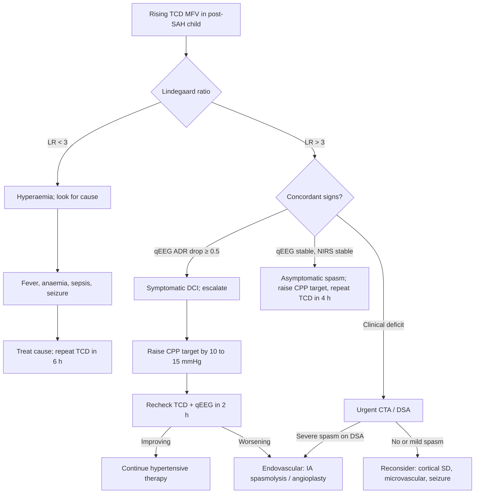

<Callout type="reference">
**Acronyms used on this page**

- **SAH**: subarachnoid haemorrhage (aneurysmal, AVM, or traumatic)
- **DCI**: delayed cerebral ischaemia (clinical or imaging deterioration not due to rebleed or hydrocephalus)
- **TCD**: transcranial Doppler
- **MFV**: mean flow velocity (cm/s)
- **PSV / EDV**: peak systolic / end-diastolic velocity (cm/s)
- **PI**: pulsatility index, (PSV − EDV) / MFV
- **LR**: Lindegaard ratio, MCA MFV ÷ ipsilateral extracranial ICA MFV
- **MCA / ACA / PCA / BA**: middle / anterior / posterior cerebral / basilar artery
- **EVD**: external ventricular drain
- **ICP / CPP / MAP**: intracranial / cerebral perfusion / mean arterial pressure
- **PRx**: moving-window correlation between MAP and ICP (autoregulation index)
- **qEEG**: quantitative EEG (here: alpha-delta ratio, ADR)
- **ADR**: alpha-delta ratio, the canonical qEEG DCI surrogate
- **NIRS**: near-infrared spectroscopy, regional tissue oxygenation
- **DSA / CTA**: digital subtraction / CT angiography
- **DSCA**: dual-coil intra-arterial spasmolysis
</Callout>

<TldrCard>
**The 60-second version.** Day 4 to day 14 after a subarachnoid haemorrhage, you are watching for delayed cerebral ischaemia. **TCD is the bedside sentinel**: rising MCA MFV plus Lindegaard ratio > 3 separates vasospasm from hyperaemia. **ICP and PRx are usually unchanged** at this phase, the pathology is flow-restrictive, not space-occupying. **qEEG ADR halves hours before the clinical exam shifts**. **NIRS shows regional asymmetry**. Two concordant modalities (TCD + qEEG, or TCD + NIRS) move you from "watch" to "treat." Pediatric absolute MFVs are higher than adult thresholds; trend within-child and lean on ratios. The exit ramp is angiographic spasm with concordant multimodal evidence; the alternative ramp is hyperaemia (LR < 3) where you look for sepsis, fever, anaemia, or seizure.
</TldrCard>

## 1. Three patient vignettes

### Vignette A. Canonical pediatric SAH, day 6

**Maya, 12 years old.** Anterior communicating artery aneurysm rupture, coiled day 0. Right frontal EVD on day 1 for acute hydrocephalus, kept for ICP monitoring. Light sedation (RASS −2). Day 6, the morning nurse notices a subtle right-arm drift. Left MCA MFV 95 → 180 cm/s in 12 hours; right MCA 100 → 110. Extracranial left ICA MFV 32. **Left Lindegaard ratio 5.6.** qEEG ADR over the left hemisphere has fallen from 1.4 to 0.6 over the same window. ICP 11 → 12 mmHg. PRx +0.05 throughout. Left rSO2 67 → 62%, right rSO2 unchanged. GCS 14. The question: is this DCI from spasm severe enough to act on, or hyperaemia from fever or anaemia, or both? <Cite id="lindegaard1989" /> <Cite id="claassen2004" /> <Cite id="hoh2023sah_aha" />

### Vignette B. Infant with AVM rupture, day 4

**Hadi, 18 months old, 11 kg.** Cerebellar AVM ruptured into the fourth ventricle. External ventricular drain placed in theatre; AVM partially embolised on day 2. Day 4, the bedside nurse reports increased irritability and a brief vomit. Continuous EEG shows a 25% drop in the relative alpha power over the left posterior leads. TCD through a still-open posterior fontanelle (a useful infant window): basilar artery MFV 88 cm/s (high for age, normal infant basilar is around 50). Posterior circulation Lindegaard equivalent (basilar MFV ÷ extracranial vertebral) cannot be computed cleanly through this window; the team falls back on rate-of-rise (+30% in 8 hours) and the alpha-power drop. ICP 9 mmHg via EVD. Infant pediatric vasospasm thresholds do not exist in the literature; the team escalates haemodynamics empirically (CPP target raised by 10 mmHg) and books urgent CTA. <Cite id="larovere2018_pedsais" /> <Cite id="sandsmark2024_qeeg_dci" />

### Vignette C. Atypical: rising MFV but LR < 3

**Kareem, 14 years old.** Traumatic SAH from a high-speed sports collision; no aneurysm; bifrontal contusions. Day 7, ICU temperature 38.6, haemoglobin 7.8 g/dL after a transfusion two days ago. TCD: right MCA MFV 75 → 145 cm/s in 24 hours. Extracranial ICA MFV 58. **Lindegaard ratio 2.5.** qEEG ADR unchanged. NIRS symmetric. ICP 13. **This is not vasospasm**, this is hyperaemia: fever and post-transfusion anaemia have together driven cerebral blood flow up to maintain oxygen delivery. Treat the cause (paracetamol, evaluate for line infection, transfuse if Hb really is below 8), repeat TCD in 6 hours, do not escalate haemodynamics. The same MFV with LR > 3 would have triggered the spasm pathway; the ratio is what saves you from a misdirected intervention. <Cite id="kontos1989" /> <Cite id="topcuoglu2017_vasospasm" />

---

## 2. The clinical question

In a child several days after an aneurysmal, AVM-related, or traumatic SAH with rising TCD MFV, **is this vasospasm-driven DCI, hyperaemia, or a mimic?** The answer determines whether you escalate haemodynamics, send to angiography, give antibiotics, or simply watch.

---

## 3. Pathophysiology refresher

Subarachnoid blood breakdown products (oxyhaemoglobin, bilirubin, free iron) trigger a vasoactive cascade in the basal cerebral arteries that peaks between days 4 and 14 post-bleed. The mechanism is multifactorial: endothelin-1 release, nitric-oxide scavenging by free haemoglobin, depolarisation-induced calcium influx into smooth muscle, and spreading depolarisations on the cortical surface. The result is **reversible large-artery narrowing**, sometimes accompanied by microvascular dysfunction, both of which lower regional cerebral blood flow distal to the spasm. <Cite id="dreier2017sd_cosbid" /> <Cite id="hartings2020_sd_natural_history" /> <Cite id="rass2021dci_review" />

**Delayed cerebral ischaemia (DCI)** is the clinical or imaging end-product of this process: new focal neurological deficit, a 2-point drop in GCS lasting at least 1 hour, or a new infarct on imaging not attributable to rebleed, hydrocephalus, surgery, or other cause. The crucial point: **angiographic spasm and DCI are not the same**. About 70% of SAH patients have angiographic spasm; only about 30% develop clinical DCI. Conversely, DCI can occur without angiographically detectable large-artery narrowing, driven by microvascular failure, cortical spreading depolarisations, and inflammatory injury. <Cite id="rass2021dci_review" /> <Cite id="connolly2012_sah_aha" />

The continuity equation explains why TCD is informative here. Cerebral blood flow equals velocity multiplied by vessel cross-sectional area. If the M1-MCA narrows by 50%, the cross-sectional area falls by 75% (area scales with the square of the radius), and velocity must rise approximately four-fold to maintain the same flow. So a doubling of MCA MFV with unchanged flow distally implies a roughly 30% diameter reduction at the insonated segment; a tripling implies severe spasm. **The Lindegaard ratio** (MCA MFV ÷ ipsilateral extracranial ICA MFV) cancels out the global cardiac output and haematocrit-driven contribution, leaving the spasm-vs-hyperaemia signal: ratios > 3 indicate intracranial narrowing rather than upstream flow increase. <Cite id="lindegaard1989" /> <Cite id="kontos1989" />

Why does **ICP usually not change** during vasospasm? Spasm narrows the supply pipe; downstream tissue is hypoperfused but not space-occupied. The brain compartment volume does not increase until infarction and oedema develop, which is hours to a day later. So a flat ICP curve does not rule out DCI, and a normal CPP does not rule out tissue ischaemia. This is the multimodal lesson of post-SAH monitoring: you cannot rely on ICP alone. <Cite id="leroux2014_neurocrit_consensus" /> <Cite id="figaji2025_mmm_pediatric_consensus" />

**qEEG ADR** picks up the consequence rather than the cause. As regional CBF falls into the 25 to 35 mL/100 g/min Astrup band, synaptic activity slows, alpha-band power falls, and the ratio of alpha to delta power drops. ADR is sensitive enough to flag a change hours before the bedside exam shifts and is the most-validated qEEG metric in the SAH-DCI literature. <Cite id="claassen2004" /> <Cite id="vespa2010" /> <Cite id="sandsmark2024_qeeg_dci" />

**NIRS** adds regional perfusion information. In post-SAH vasospasm, a 5 to 8% drop in rSO2 over the affected hemisphere is consistent with regional hypoperfusion. The trade-off: NIRS has a shallow penetration depth (the optodes sample only the most superficial 1 to 2 cm of cortex underneath them), so it cannot see deep MCA territory infarction; but for surface-cortex DCI it is informative.

**Pediatric vs adult.** Pediatric MCA absolute MFVs are higher at baseline (peak around 100 cm/s in 4 to 6 year-olds). Adult vasospasm thresholds (MFV > 120, > 180, > 200 for mild, moderate, severe) over-call in children. The pediatric standard is **within-child trending and the Lindegaard ratio**: a 50% rise from baseline with LR > 3 is the bedside operational definition of pediatric vasospasm. <Cite id="larovere2022" /> <Cite id="bode1988peds" />

---

## 4. The multimodal picture table

| Modality | Vasospasm pattern | Hyperaemia pattern | What it rules in / out |
|---|---|---|---|
| **TCD MFV** | Rising (often > 50% above baseline) | Rising | Both rise; needs LR to disambiguate |
| **Lindegaard ratio** | **> 3** (often 4 to 6) | **< 3** | The single most decisive bedside number |
| **TCD PI** | Often unchanged early, then rises with infarct oedema | Falls (low-resistance state) | Late marker either way |
| **TCD asymmetry** | Often > 30% between hemispheres | Usually symmetric | Lateralises pathology |
| **ICP** | Usually unchanged | Usually unchanged | Rules out mass effect; does NOT rule out DCI |
| **PRx** | Usually unchanged | Mildly impaired with fever | Vasospasm is distal-resistance, not autoregulation |
| **qEEG ADR** | Falls hours before clinical exam | Unchanged | Most sensitive early-ischaemia surrogate |
| **NIRS rSO2** | Regional drop (5 to 10% over affected side) | Often symmetric rise | Regional vs global |
| **PbtO2 (if present)** | Falls in affected territory | Stable or rises | Direct tissue confirmation |
| **Clinical exam** | Late drift or deficit | Usually unchanged | Last to change; do not wait for it |

The most important pairings: **TCD + qEEG** (sensitivity for early DCI), **TCD + Lindegaard** (specificity for spasm-vs-hyperaemia), and **TCD + NIRS** (regional confirmation).

---

## 5. Decision tree

<Figure
  src="/images/integration/tcd-vs-icp-vasospasm/timeline.svg"
  alt="Day 0 to day 14 timeline of post-SAH multimodal trajectories: TCD MFV rising from day 4, Lindegaard ratio crossing 3, qEEG ADR falling, NIRS regional drop, ICP flat, clinical exam shift on day 7"
  caption="Day 0 to day 14 post-SAH trajectory. TCD MFV and Lindegaard ratio begin to rise on day 4, peak on day 7 to 8, and resolve by day 12 to 14. qEEG ADR falls 12 to 24 hours after TCD changes and 12 to 36 hours before clinical exam shifts. ICP and PRx are flat throughout the vasospasm window unless infarction supervenes. NIRS shows a regional drop concordant with the affected hemisphere. The shaded action band is days 4 to 14, when daily TCD plus continuous qEEG is the standard pediatric MMM bundle."
  attribution="MNM-Edu, original schematic. SVG placeholder."
  label="Fig. 1"
/>

---

## 6. Step-by-step bedside actions

1. **Daily TCD between days 4 and 14**, twice daily during the peak window (days 6 to 10). Bilateral MCA, ACA, PCA, basilar. Record PSV, EDV, MFV, PI, and Lindegaard ratio on every study.
2. **Document baseline MFV and PI** in the first 24 hours after the bleed. All subsequent values are interpreted as deltas from this baseline.
3. **Set a TCD alert threshold** per patient: 50% MFV rise from baseline, or Lindegaard ratio crossing 3, or absolute MFV > 130 cm/s in a school-age child. Any threshold breach triggers the multimodal sweep.
4. **Run continuous qEEG with ADR display.** Place the ADR window on the same monitor as the TCD trend so the cross-correlation is visible.
5. **When alert triggers**: confirm vessel identity (carotid tap test), record bilaterally, compute Lindegaard, then look at qEEG ADR over the last 6 hours, NIRS asymmetry, and clinical exam.
6. **If two concordant signals** (TCD + qEEG, TCD + NIRS, or TCD + clinical change), escalate. **If TCD alone**, treat it as a watch trigger and repeat in 4 hours.
7. **Hypertensive therapy** (if symptomatic DCI confirmed): raise CPP target by 10 to 15 mmHg using fluids first, then noradrenaline 0.05 to 0.5 mcg/kg/min titrated to MAP. Age-banded CPP floors: 50 mmHg for 1 to 5 years, 55 to 60 for 6 to 14, 60 to 70 for adolescents.
8. **Avoid hypotension at all costs.** Pediatric SAH studies show even brief MAP dips below 60 mmHg correlate with worse outcome in this window. <Cite id="hoh2023sah_aha" />
9. **Call neurointervention** if symptomatic DCI persists after 2 hours of hypertensive therapy. Intra-arterial verapamil (5 to 10 mg) or nicardipine, or balloon angioplasty for proximal spasm.
10. **Recheck TCD + qEEG + clinical exam every 2 to 4 hours** during active management. The exit ramp is two normal studies 6 hours apart with a stable exam.

---

## 7. Management ladder and endpoints

| Tier | Intervention | Endpoint to escalate | Endpoint to de-escalate |
|---|---|---|---|
| 0 | Daily TCD, continuous qEEG, NIRS | Threshold breach (50% MFV rise, LR > 3, ADR fall > 0.5) | Two consecutive normal TCDs, stable exam |
| 1 | Optimise volume (euvolaemia), normocapnia, correct anaemia | Symptomatic DCI: GCS drop, focal deficit | Asymptomatic with stable trend |
| 2 | Hypertensive therapy (raise CPP target +10 to +15 mmHg) | Failure to improve in 2 h; new deficit | TCD improving, qEEG ADR rising, exam normalising |
| 3 | CTA or DSA imaging | Severe spasm on imaging; refractory DCI | No spasm or only mild segmental |
| 4 | Endovascular: IA spasmolysis (verapamil 5 to 10 mg, nicardipine), balloon angioplasty | Recurrent or rebound spasm post-procedure | Sustained MFV reduction; clinical improvement |
| 5 | Intrathecal / cisternal vasodilator infusion (centre-specific) | Salvage; refractory severe DCI | Resolution beyond day 14 |

**Success** looks like: angiographic spasm without infarction, clinical recovery, TCD normalising by day 12 to 14, and no new infarct on day 14 MRI.

**Failure** looks like: new infarct on imaging, sustained clinical deficit, conversion to cerebral salt wasting with secondary hyponatraemia.

<AlgorithmDisclaimer />

---

## 8. Variant subsections

### 8.1 Aneurysmal SAH

The historical setting for clinical TCD vasospasm detection. The Hunt-Hess and Fisher scales predict spasm risk: Fisher 3 (thick clot in a basal cistern) carries the highest risk; Fisher 1 carries minimal risk. TCD twice daily through the spasm window is the AHA / ASA guideline standard. <Cite id="connolly2012_sah_aha" /> <Cite id="hoh2023sah_aha" /> <Cite id="mastantuono2018_tcd" />

Adult MFV thresholds (MCA): < 120 cm/s normal, 120 to 180 mild, 180 to 200 moderate, > 200 severe. These are not directly transferable to children but provide a useful anchor for older adolescents.

### 8.2 AVM-related SAH

Pediatric AVM rupture is more common than aneurysmal SAH in the under-12 population. The bleeding pattern is often intraparenchymal more than basal cistern, and the rate of large-artery vasospasm is lower than after aneurysmal SAH. Distal AVM-related vessels are less commonly insonated by TCD; the bedside utility shifts toward **post-embolisation hyperperfusion** (rising MFV, falling LR, NIRS hyperaemia over the perilesional cortex) and post-surgical monitoring.

### 8.3 Traumatic SAH

Common after high-energy paediatric trauma. Vasospasm rates are 20 to 40%, peak around days 4 to 7. The traumatic-SAH signature differs from aneurysmal: more diffuse spasm, less segmental, more often associated with cortical spreading depolarisations. TCD is still the bedside sentinel; expect the multimodal picture to be muddier because cerebral contusions, diffuse axonal injury, and traumatic ICP rises confound the interpretation. <Cite id="kochanek2019_pbtf4" /> <Cite id="kochanek2019pbtf" />

### 8.4 Pediatric vs adult thresholds

Adult MFV thresholds over-call vasospasm in children. The pediatric standard:

- **Trend within-child**: any 50% rise above the child's day-1 baseline is meaningful.
- **Lindegaard ratio** with the same numerator and denominator (always insonate the extracranial ICA on the same side).
- **Age-band absolutes** as a sanity check: an MCA MFV of 110 cm/s is normal for a 5-year-old, mild vasospasm for a 12-year-old, and moderate vasospasm for an adult. <Cite id="bode1988peds" /> <Cite id="obrien2015" />

### 8.5 MCA vs ACA vs basilar territory

TCD sensitivity for spasm is highest in the MCA (around 85% vs angiography), moderate for the ACA (around 70%), and poor for the posterior circulation (basilar around 50%). For basilar spasm, the **basilar-to-extracranial vertebral artery ratio (BA / VA), the Soustiel modification**, with a cutoff of 2 (mild) or 3 (severe), is the closest analogue of the Lindegaard ratio for the posterior circulation. PCA spasm is hard to detect; rely on qEEG over posterior leads and on imaging if clinically suspected. <Cite id="mastantuono2018_tcd" />

### 8.6 Severe (LR > 6) vs mild (LR 3 to 6) spasm

**LR 3 to 6** is mild to moderate spasm. Most cases respond to hypertensive therapy and resolve over days. Reimage selectively. **LR > 6** is severe spasm, often refractory, frequently progressing to infarction; this is the indication for early angiography and endovascular therapy. The number above which to call neurointervention varies by centre; LR > 6 plus symptomatic DCI is a common operational threshold. <Cite id="lindegaard1989" />

---

## 9. Multimodal integration matrix

| Pair | What you gain |
|---|---|
| **TCD + ICP** | Confirms vasospasm is flow-restrictive, not space-occupying. A stable ICP with rising MFV is the canonical vasospasm fingerprint. |
| **TCD + qEEG (ADR)** | Earliest combined warning. qEEG ADR drop predicts DCI hours before clinical change; TCD localises the vessel. <Cite id="claassen2004" /> <Cite id="sandsmark2024_qeeg_dci" /> |
| **TCD + NIRS** | Macrovascular flow plus regional tissue oxygenation. Concordant regional drop strengthens the case. |
| **TCD + Lindegaard (ipsilateral ICA)** | The single most decisive bedside disambiguation of spasm from hyperaemia. |
| **TCD + PRx** | Usually unhelpful in pure vasospasm (PRx unchanged). Becomes helpful late if infarct oedema raises ICP. |
| **TCD + PbtO2** | Direct microvascular tissue confirmation when available. PbtO2 falling in the affected territory is the gold standard for tissue ischaemia. |
| **TCD + clinical exam** | The final closure: a real DCI episode usually has a clinical correlate even if subtle. |
| **TCD + CTA / DSA** | Imaging confirms or refutes angiographic spasm; the decision to do endovascular therapy depends on this. |

---

## 10. Worked alternative scenarios

### 10.1 What if the rising MFV is sepsis-driven hyperaemia, not spasm?

Kareem (Vignette C) again. Right MCA MFV 75 → 145, LR 2.5, fever 38.6, Hb 7.8, ADR unchanged, NIRS symmetric. **This is hyperaemia, not spasm.** The action: paracetamol, blood cultures, evaluate for line infection, transfuse to Hb 8 to 9, recheck TCD in 6 hours. **Do not escalate haemodynamics**: pushing the MAP higher in a febrile, hyperdynamic child risks raising oxygen delivery to a brain that is already over-perfused, and risks worsening cerebral oedema if there is a parenchymal injury. The bedside lesson: the Lindegaard ratio is not optional, it is decisive.

### 10.2 What if the rising MFV is a cortical spreading depolarisation event?

A 16-year-old, day 8 after a Fisher 3 SAH. Bilateral MCA MFV unchanged at 90 cm/s. qEEG shows a 2-minute episode of suppression spreading across the right hemisphere, then partial recovery. NIRS drops 8% on the right during the episode and recovers over 10 minutes. ICP rises briefly from 12 to 18 then settles. **This is a cortical spreading depolarisation, not vasospasm**. Spreading depolarisations are increasingly recognised as a contributor to DCI independent of large-artery spasm; the management is to optimise CPP, avoid hyperglycaemia, and consider ketamine sedation (which dampens depolarisation frequency in animal models). <Cite id="dreier2017sd_cosbid" /> <Cite id="hartings2020_sd_natural_history" />

### 10.3 What if the deterioration is actually subclinical seizures?

Same Maya at day 6, but the qEEG drop is followed by rhythmic 3 Hz activity over the left frontal region. TCD MFV unchanged at the patient's baseline, NIRS unchanged. **This is non-convulsive status epilepticus, not DCI.** Post-SAH NCSE incidence is 5 to 20% on continuous EEG. The action: load levetiracetam 60 mg/kg, escalate to a continuous infusion if seizures persist, exclude metabolic triggers. See the [EEG / TCD non-convulsive integration](/integration/eeg-tcd-non-convulsive/) scenario for the full walk-through. <Cite id="claassen2013" /> <Cite id="herman2015acns_ceeg" />

---

## 11. Outcome data

- **Mastantuono 2018 meta-analysis** of 17 studies, > 2800 SAH patients: TCD MCA sensitivity 90% (95% CI 79 to 96), specificity 71% (52 to 84) vs DSA for angiographic vasospasm. Lower sensitivity for ACA (around 60%) and basilar (around 50%). <Cite id="mastantuono2018_tcd" />
- **Topcuoglu 2017**: in 244 patients, the rate of MFV rise (> 50 cm/s per 24 h) outperformed absolute MFV thresholds for predicting DCI. Hazard ratio 3.5 (1.9 to 6.5) for DCI in patients exceeding the rate threshold. <Cite id="topcuoglu2017_vasospasm" />
- **Claassen 2004**: qEEG ADR drop of > 50% predicted DCI 1 to 2 days before clinical change in 89% of patients in a 34-patient series. Sensitivity 100%, specificity 76%. <Cite id="claassen2004" />
- **Vespa 2010**: continuous EEG in 89 SAH patients showed alpha-power decrease preceding angiographic spasm in 73% by a mean of 2.9 days. <Cite id="vespa2010" />
- **Sandsmark 2024**: updated meta-analysis of qEEG in DCI, confirming ADR as the best-validated metric; pooled sensitivity 89%, specificity 81%. <Cite id="sandsmark2024_qeeg_dci" />
- **Hoh 2023 AHA / ASA SAH guideline**: TCD recommended as class IIa for vasospasm surveillance; continuous EEG class IIb for high-grade SAH. <Cite id="hoh2023sah_aha" />
- **Connolly 2012 AHA / ASA SAH guideline (prior)**: original class IIa recommendation for TCD; remains the benchmark for adult units. <Cite id="connolly2012_sah_aha" />
- **La Rovere 2022 pediatric TCD review**: pediatric SAH is rare; the modality is most often used in trauma, sickle cell, and AVM contexts in this age group, with ratio-based interpretation strongly preferred. <Cite id="larovere2022" />

---

## 12. Pitfalls

- **Insonating the wrong vessel.** Depth alone is not enough; confirm with the carotid tap test (ipsilateral neck compression dampens the MCA envelope) before recording a number.
- **Forgetting the ICA denominator.** Without Lindegaard, you cannot distinguish vasospasm from hyperaemia. Always insonate the extracranial ICA on the same side.
- **Reading MFV in absolute terms in children.** Pediatric MCA MFV of 110 cm/s would be moderate vasospasm in an adult and normal in a 5-year-old. Use age-band norms and within-child trend.
- **Treating asymptomatic moderate spasm aggressively.** Hypertensive therapy carries cardiopulmonary risk; symptomatic DCI is the indication, not angiographic spasm alone.
- **Missing the hyperaemia mimic.** Fever, anaemia, sepsis, transfusion, and post-surgical hyperaemia all raise MFV. LR < 3 is your protection.
- **Insonation through inadequate windows.** Up to 10% of older patients have inadequate temporal windows. In children windows are usually excellent; in adolescent women with thicker temporal bones, consider TCCD or a contrast agent.
- **Ignoring posterior circulation spasm.** TCD sensitivity is lower; use the BA / VA ratio (Soustiel modification), qEEG over posterior leads, and a lower threshold to image.
- **Confusing PI rise with ICP rise.** In late vasospasm with infarct oedema, both ICP and PI can rise together. Disentangle by measuring ICP directly if a probe is in.

---

## 13. Pediatric considerations

<Pediatric>
**Three pediatric-specific points** that bite on every SAH case:

1. **Aneurysmal SAH is rare** under age 12 (incidence < 0.5 per 100,000 per year). The same vasospasm window applies to **pediatric AVM rupture** (more common at this age), **traumatic SAH** (very common in moderate-to-severe TBI), and post-tumour-resection SAH. The TCD + qEEG + NIRS pattern is similar across aetiologies.

2. **Absolute MFV thresholds do not transfer.** Healthy pediatric MCA MFV peaks around 100 cm/s in 4 to 6 year-olds. Pediatric vasospasm is defined by **within-child trend** (50% rise from baseline) and the **Lindegaard ratio** (> 3), not adult cutoffs.

3. **CPP floors are age-banded.** When escalating to hypertensive therapy:
   - 1 to 5 years: CPP floor 50 mmHg; target 60 to 65 if escalating
   - 6 to 14 years: CPP floor 55 to 60 mmHg; target 65 to 75 if escalating
   - 15 to 18 years: CPP floor 60 to 65 mmHg; target 70 to 80 if escalating

Endovascular access in children is technically feasible from approximately 8 kg but is centre-dependent; younger children often go to surgical clipping or external decompression instead. <Cite id="larovere2022" /> <Cite id="hoh2023sah_aha" />
</Pediatric>

---

## 14. Combine with

- [TCD / TCCD modality page](/modalities/tcd/): the foundation for the TCD numbers cited here.
- [Lindegaard ratio calculator](/modalities/tcd/): the bedside disambiguator.
- [qEEG and continuous EEG](/modalities/eeg/): ADR, alpha variability, and seizure detection.
- [NIRS](/modalities/nirs/): regional tissue oxygenation as a corroborator.
- [PRx, MAP and CPP autoregulation](/foundations/autoregulation/): why PRx is usually flat in pure vasospasm.
- [CPPopt targeting integration](/integration/cppopt-targeting/): when hypertensive therapy is needed, CPPopt frames the target.
- [EEG / TCD non-convulsive seizure pair](/integration/eeg-tcd-non-convulsive/): the seizure-mimic differential.
- [PbtO2 / CPP titration](/integration/pbto2-cpp-titration/): the tissue-confirmation pair.

---

<DeepDive>

## 15. Evidence summary and recent literature (2022 to 2025)

### Foundational

| Topic | Reference | Grade |
|---|---|---|
| Lindegaard ratio | <Cite id="lindegaard1989" /> | A |
| Continuity equation and TCD | <Cite id="kontos1989" /> | foundational |
| qEEG ADR and DCI | <Cite id="claassen2004" /> | B |
| Continuous EEG in SAH | <Cite id="vespa2010" /> | B |
| AHA / ASA SAH guideline (2012) | <Cite id="connolly2012_sah_aha" /> | expert |
| TCD meta-analysis for vasospasm | <Cite id="mastantuono2018_tcd" /> | A |
| Rate of MFV rise outperforms absolute | <Cite id="topcuoglu2017_vasospasm" /> | B |
| DCI review and definition | <Cite id="rass2021dci_review" /> | review |
| Cortical spreading depolarisations | <Cite id="dreier2017sd_cosbid" /> <Cite id="hartings2020_sd_natural_history" /> | B |
| Pediatric TCD reference | <Cite id="larovere2022" /> <Cite id="bode1988peds" /> <Cite id="obrien2015" /> | expert / C |

### Recent literature (2022 to 2025)

- **Hoh 2023 AHA / ASA SAH guideline update**: TCD class IIa for vasospasm; continuous EEG class IIb for high-grade SAH; emphasis on multimodal monitoring in dedicated neuro-ICUs. <Cite id="hoh2023sah_aha" />
- **Sandsmark 2024 qEEG meta-analysis**: updates the qEEG-DCI evidence base; ADR is the best-validated metric with pooled sensitivity 89% and specificity 81%. <Cite id="sandsmark2024_qeeg_dci" />
- **Figaji 2025 pediatric MMM consensus**: places TCD in tier 2 of pediatric MMM bundles, alongside NIRS and continuous EEG. <Cite id="figaji2025_mmm_pediatric_consensus" />
- **Helbok 2024 pediatric MMM update**: confirms TCD as the bedside sentinel for vasospasm in pediatric SAH; recommends ratio-based interpretation. <Cite id="helbok2024_pediatric_mmm" />
- **Tasker 2023 pediatric MMM review**: integrative review including DCI surveillance; reinforces the multimodal bundle approach. <Cite id="tasker2023mnm" /> <Cite id="tasker2023_pccm_review" />
- **Hartings 2024 spreading-depolarisation intervention review**: emerging therapeutic targets for SD-driven DCI; ketamine and methylprednisolone as candidate dampeners. <Cite id="hartings2024_sd_intervention" />
- **Rass 2021 DCI review (still canonical)**: differentiates angiographic spasm from clinical DCI; lists microvascular dysfunction and cortical SDs as independent contributors. <Cite id="rass2021dci_review" />

</DeepDive>

---

## 16. Self-check

<Quiz
  questions={[
    {
      id: 'q1',
      prompt: 'A 12-year-old day 6 after aneurysmal SAH. Left MCA MFV has risen from 90 to 175 cm/s in 12 hours. Extracranial left ICA MFV is 60. qEEG alpha-delta ratio over the left hemisphere has fallen from 1.5 to 0.7. ICP 11 mmHg, PRx +0.04, GCS 14. What is the single best next step?',
      options: [
        { id: 'a', label: 'Wait and repeat TCD in 24 hours; the exam is normal' },
        { id: 'b', label: 'Treat for raised ICP with hypertonic saline' },
        { id: 'c', label: 'Escalate to hypertensive therapy (raise CPP target by 10 to 15 mmHg) and arrange urgent CTA' },
        { id: 'd', label: 'Hyperventilate to PaCO2 30 to reduce flow' },
      ],
      answer: 'c',
      explanation: 'The Lindegaard ratio is 175 / 60 = 2.9, technically borderline but combined with a 90% rise in MFV and a 50% drop in qEEG ADR over the same window, this is symptomatic DCI in the making. ICP is unchanged because vasospasm is flow-restrictive, not space-occupying. Action: escalate haemodynamics and image. Hyperventilation worsens ischaemia; hypertonic is for raised ICP, not for vasospasm. Waiting is wrong when two modalities are concordant.',
    },
    {
      id: 'q2',
      prompt: 'A 14-year-old day 7 after traumatic SAH from a sports collision. Right MCA MFV 75 to 145 cm/s in 24 hours. Extracranial right ICA MFV 58. Temperature 38.6, haemoglobin 7.8 g/dL after a recent transfusion. qEEG ADR unchanged, NIRS symmetric. What is the most likely explanation?',
      options: [
        { id: 'a', label: 'Vasospasm; start hypertensive therapy' },
        { id: 'b', label: 'Hyperaemia from fever and anaemia; treat the cause and recheck' },
        { id: 'c', label: 'Acute hydrocephalus; image and consider EVD' },
        { id: 'd', label: 'Acute rebleed; transfer to angiography' },
      ],
      answer: 'b',
      explanation: 'Lindegaard ratio is 145 / 58 = 2.5, below the 3 cutoff. Fever and anaemia both increase cerebral blood flow to maintain oxygen delivery. qEEG and NIRS are unchanged, supporting global hyperaemia rather than regional ischaemia. Treat the cause (paracetamol, target Hb 8 to 9), recheck TCD in 6 hours. Hypertensive therapy in a hyperaemic, febrile patient risks raising oxygen delivery further and worsening cerebral oedema if there is a contusion.',
    },
    {
      id: 'q3',
      prompt: 'In the pediatric ICU, an 18-month-old day 4 after AVM rupture has rising basilar MFV (88 cm/s) on TCD through a posterior fontanelle window. The team cannot compute a Lindegaard ratio because the extracranial vertebral window is not accessible. ICP via EVD is 9 mmHg, irritable, vomited once. What is the most defensible approach?',
      options: [
        { id: 'a', label: 'Ignore the TCD finding as uninterpretable without a ratio' },
        { id: 'b', label: 'Use within-child rate of rise (30% in 8 hours) plus the clinical change as the trigger; raise CPP empirically and image' },
        { id: 'c', label: 'Apply adult MFV thresholds for the basilar artery' },
        { id: 'd', label: 'Wait for a 50% MFV rise before acting' },
      ],
      answer: 'b',
      explanation: 'In infants, ratios may be unavailable and adult absolutes do not apply. The pediatric standard is within-child trending plus clinical correlation. A 30% MFV rise in 8 hours plus irritability and a vomit warrants empirical CPP escalation and urgent imaging. Waiting for a 50% rise risks infarction. Ignoring TCD because the ratio is unavailable wastes a sensitive signal.',
    },
  ]}
/>
