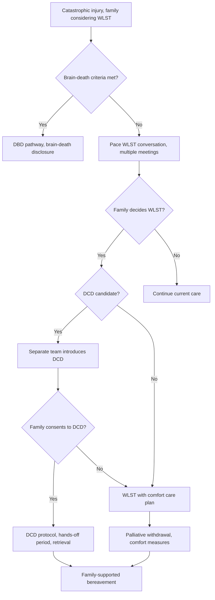

<Callout type="reference">
**Acronyms used on this page**

- **WLST**: withdrawal of life-sustaining therapy
- **DCD**: donation after circulatory death
- **DBD**: donation after brain death
- **MNM / MMM**: multimodal neuromonitoring / multimodal monitoring
- **TBI / HIE**: traumatic brain injury / hypoxic-ischaemic encephalopathy
- **PICU**: paediatric intensive care unit
- **cEEG / aEEG**: continuous EEG / amplitude-integrated EEG
- **TCD**: transcranial Doppler
- **NPi**: neurological pupil index
- **NIRS / rSO2**: near-infrared spectroscopy / regional cerebral oxygen saturation
- **MRI**: magnetic resonance imaging
- **SSEP**: somatosensory evoked potentials
- **GCS**: Glasgow Coma Scale
- **ICU**: intensive care unit
- **AAP / SCCM**: American Academy of Pediatrics / Society of Critical Care Medicine
- **WBDP**: World Brain Death Project (Greer 2020)
</Callout>

<TldrCard>
**The 60-second version.** When a severely injured child is not progressing to brain death but the prognosis is catastrophic, the family may consider redirecting goals of care, which can include withdrawal of life-sustaining therapy (WLST). When WLST is the decided plan, donation after circulatory death (DCD) is one option the family may be offered, alongside continued comfort-focused care or in-hospital death without donation. The two decisions are firewalled: the WLST decision is made first, on its own terms, supported by multimodal evidence; the DCD discussion is led by a separate team (organ retrieval coordinator) afterward to avoid coercion. The MNM evidence supporting WLST (cEEG, MRI, NPi, clinical trajectory) is the same evidence that would inform brain-death conversations; the difference is that brain-death criteria are not met. Pediatric DCD has specific protocols (Maastricht III; the hands-off period after circulatory arrest; pre-mortem heparinisation in some jurisdictions). The retrieval-team firewall and the explicit family consent process are the safeguards. The conversation pacing follows the Meert 2015 paediatric palliative care framework; multiple meetings across days are typical.
</TldrCard>

## 1. Three patient vignettes

### Vignette A. Aliyah, 13 years, severe TBI not progressing to brain death

Aliyah, **13 years, 48 kg**, severe TBI from a motor vehicle accident, day 5. Pentobarbital infusion discontinued 36 h ago for washout. Brain-death exam attempted today: no spontaneous respirations, no cough, no gag, no pupillary or corneal response. However, the apnoea test was inconclusive (PaCO2 rose to 52 with one faint chest wall movement at the 5-minute mark, then no further effort; the test was repeated 4 h later with the same equivocal result). Ancillary TCD shows oscillating flow bilaterally. cEEG shows electrocerebral inactivity. MRI: extensive cortical and brainstem injury. **The team's view is that the prognosis is catastrophic but formal brain-death criteria cannot be confidently declared. The family is being introduced to the consideration of WLST and the option of DCD.** <Cite id="greer2020_braindeath" /> <Cite id="nakagawa2011peds_bd" />

### Vignette B. Rohan, 3 months, severe HIE post-near-drowning

Rohan, **3 months, 6 kg**, near-drowning in a domestic bathtub 7 days ago. Cooled to 33 C for 72 h. Day 7 MRI: extensive cortical and basal ganglia injury with restricted diffusion in the thalami. cEEG: discontinuous to burst-suppression background that never reached continuous. Brain-death criteria are not met (some spontaneous breathing in apnoea test, pupillary reactivity preserved on the right). The family is being supported in their consideration of redirecting goals of care to comfort. DCD is offered as one option. **Question: how does the conversation differ in an infant where brain-death is not met but prognosis is catastrophic; what role does the MNM evidence play; how does the DCD pathway work in this age?** <Cite id="meert2015_palliative_care" /> <Cite id="topjian2021aha_pediatric" />

### Vignette C. Tariq, 9 years, oncology-related catastrophic decompensation

Tariq, **9 years, 26 kg**, refractory leukaemia, day 14 of induction chemotherapy, severe pulmonary haemorrhage and ARDS with refractory hypoxaemia and multi-organ failure. Acute on chronic encephalopathy from CNS leukaemia and methotrexate toxicity. The oncology team's view is that meaningful disease control is unlikely; PICU support is sustaining the child but not progressing toward recovery. The family is considering redirecting to comfort. **DCD is not feasible** because of the leukaemia and infection. **Question: how is the WLST conversation different when DCD is not on the table; what role does MNM evidence play in supporting the family's decision; how is the dying process managed?** <Cite id="meert2015_palliative_care" />

---

## 2. The clinical question

For each of these children: **how do we support the family through the WLST decision, what MNM evidence is presented to support the recommendation, and (where applicable) how is the DCD pathway introduced without coercion?**

---

## 3. Background

Withdrawal of life-sustaining therapy in a severely brain-injured child is one of the most ethically and emotionally complex decisions in paediatric critical care. The decision is the family's, supported by the medical team's evidence and recommendations. The Meert 2015 paediatric palliative care framework anchors the conversation structure; the AHA 2021 pediatric post-arrest guideline anchors the prognostic timing; the Greer 2020 World Brain Death Project and Nakagawa 2011 paediatric brain-death guidelines anchor the boundary between brain-death disclosure and WLST conversations.

**Three pathways at the end of life in paediatric critical care:**

1. **Brain death (DBD pathway).** Brain-death criteria are met by clinical exam (and ancillary tests where required). The patient is declared dead; continued ventilation is for the family's processing time or for organ retrieval, not for the child. Organ donation is an option, structured as donation after brain death (DBD).
2. **WLST without donation.** Brain-death criteria are not met, but the family decides to redirect goals of care to comfort. Life-sustaining therapy is withdrawn; the child dies in time (typically minutes to hours) in a controlled, palliative manner. Death is by cessation of circulation. Organ donation is not pursued.
3. **WLST with DCD.** Same as above, but the family additionally consents to organ donation after circulatory death. The dying process is the same; following circulatory arrest and a defined hands-off period (typically 2 to 5 minutes), retrieval begins.

**Why the firewall matters.** The WLST decision is supported by evidence about the child's prognosis and the family's values; the DCD option introduces the possibility of benefit to other patients. To ensure the WLST decision is not influenced by organ availability, the conversations are separated: WLST first, by the clinical team caring for the child; DCD afterward, by a separate organ retrieval coordinator team. This firewall is foundational to the ethics of paediatric DCD. <Cite id="meert2015_palliative_care" />

**Pediatric DCD specifics.** The Maastricht categories define DCD subtypes; Maastricht III (controlled DCD after WLST) is the most common in paediatric practice. The hands-off period (the interval between cessation of circulation and the start of retrieval) varies by jurisdiction (typically 2 to 5 minutes) and exists to ensure that auto-resuscitation does not occur. Pre-mortem heparinisation is permitted in some jurisdictions and not others; the retrieval team and intensivist follow local protocol. Age-banded DCD outcomes are improving with experience; current paediatric DCD donors include kidneys, livers, and (in selected centres) lungs and hearts. <Cite id="lorusso2017_elso_neuro" />

**The MNM evidence base.** The cEEG continuity trajectory, MRI extent and pattern, NPi trend, clinical exam, and (where used) TCD or SSEP findings together form the evidence base for the prognostic conversation. No single modality is sufficient; concordant evidence across modalities is the standard. The 2021 AHA paediatric guideline and the 2024 paediatric MMM update both emphasise integration. <Cite id="topjian2021aha_pediatric" /> <Cite id="helbok2024_pediatric_mmm" />

---

## 4. The multimodal picture

| Modality | What it shows in catastrophic injury | Role in WLST conversation |
|---|---|---|
| **Clinical exam** | Brainstem reflexes absent or near-absent; no purposeful movement; no response to pain | Foundational evidence; the family can see the exam |
| **NPi (pupillometry)** | NPi less than 1.0, often 0; absent reactivity | Quantified brainstem function; trend graph supports conversation |
| **cEEG** | Electrocerebral inactivity, or low-voltage suppressed background with no reactivity | Visual evidence of cortical function loss |
| **MRI** | Extensive cortical and subcortical injury; brainstem injury | Anatomic correlate; powerful concordant evidence |
| **TCD (ancillary)** | Oscillating flow, systolic spikes only, or absent flow | Ancillary evidence for circulatory arrest where the apnoea test is inconclusive |
| **SSEP (ancillary)** | Absent N20 bilaterally | Cortical responsiveness loss; useful when brain-death equivocal |
| **NIRS rSO2** | Often non-contributory in deep injury; may be elevated (no extraction) | Not typically central to the WLST conversation |
| **Trend across days** | The trajectory across multiple modalities is the most powerful evidence | Anchors prognostic conversation pacing |

---

## 5. Decision tree

<Figure
  src="/images/integration/wlst-organ-donation/dcd-pathway.svg"
  alt="DCD pathway schematic showing the firewall between WLST decision and DCD conversation, with hands-off period and retrieval team handover"
  caption="The DCD pathway. The WLST decision is made first, supported by multimodal evidence and the clinical team. If WLST is decided and the patient is a DCD candidate, a separate team (organ retrieval coordinator) introduces DCD as one option among continued comfort-focused care, in-hospital death without donation, or DCD. The hands-off period after circulatory cessation (typically 2 to 5 minutes, jurisdiction-dependent) precedes retrieval. The retrieval team is firewalled from the WLST decision."
  attribution="MNM-Edu, adapted from Maastricht III pathway and Meert 2015 paediatric palliative framework. SVG placeholder."
  label="Fig. 1"
/>

<AlgorithmDisclaimer />

---

## 6. Step-by-step bedside actions

For Aliyah (13 y, 48 kg, severe TBI with equivocal brain-death exam). Days are from the initial injury.

1. **Day 5, morning: brain-death exam attempted.** Per Nakagawa 2011 paediatric brain-death guidelines, two examinations separated by an age-banded observation period are required for a brain-death determination in children (12 hours for children over 1 year per the 2011 paediatric guidelines, 24 hours in neonates; with required ancillary tests if certain exam components cannot be completed). The exam today is incomplete (apnoea test equivocal). Brain-death determination is not made. <Cite id="nakagawa2011peds_bd" /> <Cite id="greer2020_braindeath" />
2. **Day 5, afternoon: team meeting.** Intensivist, neurology, neurosurgery, palliative care, bedside nurse, organ donation coordinator (briefed but not part of the WLST conversation). Agreement on the prognostic message and the recommendation. The recommendation is *not* "withdraw care" but "consider redirecting goals of care toward comfort, given the catastrophic and irreversible nature of the injury".
3. **Day 5, evening: first family meeting.** SPIKES-structured. Introduce the evidence (the clinical exam, the MRI image, the cEEG record, the NPi trend). Explain that brain-death criteria cannot be confidently declared but that the prognosis is catastrophic. Pause. Ask what they understand and what they want to know. Pre-schedule the next meeting for the next day.
4. **Day 6: bedside support, repeat exam.** Repeat clinical exam (often unchanged); NPi trend; cEEG remains electrocerebral inactivity. Family time at the bedside.
5. **Day 6, evening: second family meeting.** Continue the conversation. The family may begin to ask about what comes next ("if we decide not to continue, what would that look like?"). Describe the WLST process honestly: extubation in a private room, comfort measures (opioid plus benzodiazepine titrated to comfort, often a continuous infusion), family presence supported, time to death typically minutes to hours.
6. **Day 7: third family meeting if needed.** The family has had time to absorb the evidence and to discuss among themselves. They may be ready to express a decision. If decided WLST, the clinical team confirms the plan and the timeline.
7. **DCD discussion (separate team).** Once WLST is decided, the organ retrieval coordinator (not the clinical team) introduces DCD as one option. The coordinator explains the protocol, the hands-off period, what the family can be present for, what happens to the child during retrieval. The family decides. **Documentation:** consent (or refusal) is recorded.
8. **DCD protocol activated (if consented).** The WLST happens in an operating theatre or a designated DCD room. The clinical team (intensivist, nurse) cares for the child during dying; the retrieval team is in the next room or waiting area. Comfort medications are titrated to the child's needs. The retrieval team does not enter the room until after declaration of death and the hands-off period.
9. **After circulatory cessation: hands-off period.** Typically 2 to 5 minutes (jurisdiction-dependent). After this period, death is declared by the clinical team (not the retrieval team) and retrieval begins. The family is supported in a separate room.
10. **Post-retrieval: bereavement care.** The family is supported with structured bereavement; follow-up at 6 weeks, 3 months, 12 months. Anniversary acknowledgements where appropriate.

---

## 7. Management endpoints

**Success looks like:** the family has had adequate time and information to make a coherent decision; the team's recommendation has been honestly presented; the family's choice (whichever it is) has been supported; the dying process has been peaceful, with family presence supported; the family has received bereavement follow-up.

**Failure looks like:** the family feels coerced by the team; the conversation was rushed; the MNM evidence was withheld or sugar-coated; the team disagreed in front of the family; the dying process was not palliative; the family has not received follow-up.

**When to escalate (for the family, not against them):**
- Disagreement within the family that cannot be resolved through team-supported conversation, hospital ethics committee.
- Disagreement between family and team about the recommendation, second opinion (another senior intensivist, neurology, palliative care).
- Refusal to engage with the prognosis evidence, continue current care; revisit in days.

---

## 8. Variant subsections

### 8.1 The brain-death versus WLST boundary

When brain-death criteria are met, the conversation is brain-death disclosure (the child has died); organ donation is structured as DBD if pursued; ventilation continues post-mortem for the family's processing time or for retrieval. When brain-death criteria are not met but prognosis is catastrophic, the conversation is WLST consideration; the child is dying but not yet dead; the family decides whether to redirect care. The two conversations are distinct in content and ethical structure, even when they appear superficially similar. <Cite id="greer2020_braindeath" /> <Cite id="nakagawa2011peds_bd" />

### 8.2 The Maastricht III DCD pathway in paediatric practice

Controlled DCD after WLST is the most common paediatric DCD subtype. The protocol: WLST in a designated location, comfort medication titrated to the child's needs, family presence supported, monitoring of cardiac output and arterial pressure until cessation, hands-off period after asystole, death declaration, retrieval. Organs retrievable include kidneys (commonly), liver, lungs and heart (in selected paediatric centres with experience). Outcomes for paediatric DCD recipients have improved with retrieval team experience. <Cite id="lorusso2017_elso_neuro" />

### 8.3 The retrieval team firewall

The retrieval team is structurally separated from the clinical team caring for the dying child. This separation is essential to the ethics of DCD: the WLST decision is made on its own terms; the DCD option is introduced afterward by a team with no role in the WLST decision; the retrieval team does not enter the room before death is declared and the hands-off period is complete. The clinical team's job is to support the child and the family; the retrieval team's job is to retrieve organs only after the clinical team's job is done.

### 8.4 Pediatric DCD in the under-1-year age group

DCD in infants (including neonatal DCD) is a more recent development, with specific challenges: smaller organs, more delicate retrieval, longer hands-off periods sometimes needed because of more uncertain circulatory cessation timing. Some centres now offer paediatric DCD across all paediatric age groups; others limit to children over a certain age. Local protocols vary; the principles (firewall, family consent, comfort care) are constant. <Cite id="meert2015_palliative_care" />

### 8.5 WLST when DCD is not feasible

In some children, DCD is not feasible (active uncontrolled infection, malignancy, contraindications to organ donation). The WLST conversation is the same in structure: family-centred, multimodal-evidence-supported, paced across multiple meetings. The dying process is palliative; the location may be the PICU bedside, a designated comfort room, or (where families choose and circumstances allow) at home with hospice support.

### 8.6 The role of MNM in supporting WLST conversations

Multimodal evidence (cEEG, MRI, NPi trajectory, clinical exam) provides the basis for the prognostic message. Concordant evidence across modalities is more powerful than any single test. Discordant evidence is itself information and is honestly presented; sometimes discordance changes the recommendation (a child with preserved NPi and partial cEEG continuity may not be a WLST candidate even when MRI is severe). The 2025 paediatric MMM consensus emphasises this integration. <Cite id="figaji2025_mmm_pediatric_consensus" /> <Cite id="helbok2024_pediatric_mmm" />

---

## 9. Multimodal integration matrix

| Pair | What you gain | Worked scenario |
|---|---|---|
| **Clinical exam + MRI** | Anatomic-functional correlation; supports prognostic message | Catastrophic injury day 5 |
| **NPi + cEEG** | Brainstem plus cortical functional state; cross-validates clinical exam | The WLST candidate |
| **TCD + clinical exam** | Cerebral circulatory status; ancillary evidence when apnoea test is incomplete | The equivocal brain-death exam |
| **SSEP + cEEG** | Cortical responsiveness in both stimulus-evoked and spontaneous activity | When ICU sedation has confounded clinical exam |
| **MRI + cEEG + NPi + clinical exam** | The full multimodal package; powerful concordant evidence | The day-5-after-cooling HIE prognostic conversation |
| **Trajectory across days** | The most powerful evidence is the multimodal trend, not any single test | The WLST decision pacing |

---

## 10. Worked alternative scenarios

### 10.1 What if the family declines WLST?

The family's decision is respected. The team continues to provide care, support the family, and revisits the conversation in days. Time often does the work that single conversations cannot. Ethics consultation may be helpful when prolonged disagreement persists.

### 10.2 What if the family wants DCD but the patient is not a candidate?

The clinical team explains why DCD is not feasible (active infection, contraindicated organs, retrieval team unavailable). The conversation may then focus on what the family hoped to achieve through donation (often a sense of meaning or contribution) and on what other forms of legacy may be possible (research donation in some centres, advocacy work, named memorial activities). The family's wishes are respected and supported.

### 10.3 What if the patient's circulation does not cease in the expected time after WLST?

In a small proportion of paediatric WLST cases, the patient continues to have circulation for hours after extubation. The DCD protocol typically defines a time window (often 60 to 120 minutes) beyond which DCD is not pursued; the patient continues to receive comfort care and dies in time, with the family supported. The pre-WLST conversation must include this possibility, so the family is not surprised.

---

## 11. Outcome data

- **Meert 2015 paediatric palliative care in PICU:** structured conversation, family-team consistency, and pacing across multiple meetings are associated with reduced family distress and improved decision-making confidence. <Cite id="meert2015_palliative_care" />
- **AHA 2021 pediatric post-arrest:** definitive prognostication should not be attempted before 24 hours; multimodal evidence integration is recommended; 72 hours to 5 days is the most reliable prognostic window. <Cite id="topjian2021aha_pediatric" />
- **Greer 2020 World Brain Death Project:** standardised approach to brain-death determination including paediatric considerations; explicit cultural and religious accommodations. <Cite id="greer2020_braindeath" />
- **Nakagawa 2011 paediatric brain death (SCCM and AAP):** dual examination requirement, observation periods by age, apnoea test specifics, ancillary testing role. <Cite id="nakagawa2011peds_bd" />
- **ELSO neurological consensus (Lorusso 2017):** addresses neurological assessment on ECMO, including end-of-life considerations and DCD on ECMO support. <Cite id="lorusso2017_elso_neuro" />
- **Pediatric MMM consensus (Figaji 2025; Helbok 2024):** multimodal evidence integration for prognostic conversations. <Cite id="figaji2025_mmm_pediatric_consensus" /> <Cite id="helbok2024_pediatric_mmm" />
- **Naim 2023 PCCM:** seizure burden after pediatric cardiac arrest correlates with 12-month neurological outcome; informs prognostic communication. <Cite id="naim2023_brain_injury_pccm" />

---

## 12. Pitfalls

- **Conflating brain death and WLST.** Brain-death disclosure is informing the family that the child has died. WLST is a decision the family makes about the dying child. The conversations are structurally different.
- **Failing to firewall WLST and DCD conversations.** The DCD discussion should be led by a separate team after the WLST decision is made. The firewall is foundational to the ethics of paediatric DCD.
- **Pacing too fast.** The first conversation introduces the evidence; the second clarifies what is being asked; the third invites the family's perspective. Most families need at least three conversations.
- **Pacing too slow.** Prolonged uncertainty has its own harms; clear next-meeting timing helps.
- **Disagreement within the team in front of the family.** Resolve in pre-meeting; present a consistent recommendation.
- **Withholding the MNM evidence.** The cEEG, MRI, and NPi trend graphs are powerful; show them where appropriate and explain in plain language.
- **Premature prognostication.** Less than 24 hours after the injury is too early; 72 hours to 5 days is the reliable window for cooled post-arrest children.
- **Forgetting bereavement follow-up.** Structured 6-week, 3-month, 12-month follow-up is the standard of care.

---

## 13. Pediatric considerations

<Pediatric>
**Pediatric WLST and DCD have distinct features.**

- **The decision-maker is the parent or guardian**, not the child. The child's voice (where age-appropriate) is part of the conversation but the decision belongs to the family.
- **Pediatric brain-death observation periods** are age-banded (24 h in neonates, 12 h in children over 1 y per Nakagawa 2011) and require dual examinations.
- **Apnoea test in small children** is technically challenging; ancillary TCD or EEG may be needed.
- **Pediatric DCD protocols** vary by centre and jurisdiction; the youngest paediatric DCD cases are now possible in experienced centres.
- **Pediatric retrievable organs** include kidneys, liver, lungs, heart, intestine; the retrieval team experience matters.
- **Family-centred bereavement** continues after discharge; structured follow-up at 6 weeks, 3 months, 12 months.
- **Sibling support** is part of bereavement care; child-life specialists are invaluable where available.
- **MNM evidence presentation** must be in lay terms; visual evidence (MRI image, cEEG trace, NPi trend) supports understanding.
- **Documentation matters.** Single-page family summary after each meeting; signed consent for DCD; clear plans for comfort medication.
</Pediatric>

---

## 14. Combine with

- [Integration: Brain-death MNM](/integration/brain-death-mnm/): the ancillary testing pathway.
- [Integration: Family communication MNM](/integration/family-communication-mnm/): the conversation frameworks.
- [Integration: HIE post-arrest](/integration/mnm-in-the-newborn/): the prognostic timing.
- [Integration: Refractory status epilepticus](/integration/refractory-status-epilepticus/): the long-stay PICU patient where WLST may be considered.
- [Pupillometry / NPi page](/modalities/pupillometry/): the brainstem trend.
- [EEG / aEEG modality page](/modalities/eeg/): the cortical function evidence.

---

<DeepDive>

## 15. Evidence summary

| Topic | Source | Grade |
|---|---|---|
| Brain death (WBDP) | <Cite id="greer2020_braindeath" /> | expert |
| Pediatric brain death (Nakagawa 2011) | <Cite id="nakagawa2011peds_bd" /> | expert |
| Pediatric palliative care in PICU | <Cite id="meert2015_palliative_care" /> | expert |
| AHA pediatric post-arrest care | <Cite id="topjian2021aha_pediatric" /> | expert |
| THAPCA out-of-hospital | <Cite id="moler2015thapca_oh" /> | A |
| Brain injury after pediatric arrest | <Cite id="naim2023_brain_injury_pccm" /> | review |
| Pediatric MMM consensus | <Cite id="figaji2025_mmm_pediatric_consensus" /> | expert |
| Pediatric MMM update | <Cite id="helbok2024_pediatric_mmm" /> | review |
| ELSO neurological consensus | <Cite id="lorusso2017_elso_neuro" /> | expert |
| ECMO outcomes | <Cite id="cho2024_ecmo_outcomes" /> | C |
| MMM consensus (general) | <Cite id="leroux2014_neurocrit_consensus" /> | expert |
| HIE NICHD hypothermia | <Cite id="shankaran2005hie_nichd" /> | A |
| ACNS cEEG indications | <Cite id="herman2015acns_ceeg" /> | expert |
| Pediatric pupillometry | <Cite id="freeman2020_pediatric_pupil" /> | C |
| ICU NPi | <Cite id="oddo2018_npi_orange" /> | B |

## 16. Recent literature (2022 to 2025)

- **Family-centred WLST and DCD studies** continue to refine conversation structure and timing. The Meert 2015 framework remains the reference. <Cite id="meert2015_palliative_care" />
- **AHA 2021 pediatric post-arrest guideline** is the current reference for prognostic timing. <Cite id="topjian2021aha_pediatric" />
- **Naim 2023 PCCM** quantifies the relationship between cEEG-detected seizure burden and outcome, informing WLST conversations. <Cite id="naim2023_brain_injury_pccm" />
- **Helbok 2024 paediatric MMM update** emphasises multimodal evidence integration in prognostic conversations. <Cite id="helbok2024_pediatric_mmm" />
- **Figaji 2025 paediatric MMM consensus** integrates evidence communication into the broader consensus framework. <Cite id="figaji2025_mmm_pediatric_consensus" />
- **Pediatric DCD expansion** continues, with younger ages and more retrievable organ classes (lungs, hearts in experienced centres).
- **Bereavement support models** are increasingly standardised, with structured follow-up replacing ad-hoc contact.

</DeepDive>

---

## 17. Self-check

<Quiz
  questions={[
    {
      id: 'q1',
      prompt: 'Aliyah, 13 y, has an equivocal brain-death exam (apnoea test inconclusive). cEEG is electrocerebral inactivity, NPi 0 bilaterally, TCD shows oscillating flow. The prognosis is catastrophic. The team is preparing to discuss WLST with the family. Per current best practice for WLST and DCD conversations, when should DCD be introduced?',
      options: [
        { id: 'a', label: 'In the same conversation as the WLST recommendation, to allow informed decision-making' },
        { id: 'b', label: 'Before the WLST conversation, so the family knows the options upfront' },
        { id: 'c', label: 'After the WLST decision is made, by a separate team to avoid coercion' },
        { id: 'd', label: 'Only after withdrawal has been initiated' },
      ],
      answer: 'c',
      explanation: 'The firewall between WLST and DCD conversations is foundational to the ethics of paediatric DCD. The WLST decision is made on its own terms, supported by multimodal evidence; the DCD option is then introduced by a separate team (organ retrieval coordinator) so that the WLST decision is not influenced by organ availability. This separation is a constant across jurisdictions, even though specific protocols vary.',
    },
    {
      id: 'q2',
      prompt: 'A 3-month-old with severe HIE and catastrophic MRI is being considered for WLST. The family asks "what would actually happen if we decided to stop?" What is the most appropriate explanation?',
      options: [
        { id: 'a', label: 'We would just stop the medications' },
        { id: 'b', label: 'We would move to a private room, give comfort medications (typically opioid and benzodiazepine titrated to her comfort), remove the breathing tube, support you at the bedside; she would breathe on her own as best she can, and would typically die peacefully within minutes to hours; we would care for her and support you throughout' },
        { id: 'c', label: 'Withdrawal is quick and painless' },
        { id: 'd', label: 'Defer the question to palliative care' },
      ],
      answer: 'b',
      explanation: 'Honest, specific explanation of the dying process supports family decision-making. The conversation includes the location (private room), the medications (opioid and benzodiazepine for comfort, not to hasten death), the extubation, the family presence, the typical timeline (minutes to hours, though variable), and the team support throughout. Vague reassurance or deferral is unhelpful.',
    },
    {
      id: 'q3',
      prompt: 'In a controlled (Maastricht III) DCD pathway, what is the purpose of the hands-off period after circulatory cessation?',
      options: [
        { id: 'a', label: 'To allow the family to say goodbye before retrieval' },
        { id: 'b', label: 'To ensure that auto-resuscitation does not occur and that death is irreversible' },
        { id: 'c', label: 'To reduce ischaemic damage to the organs' },
        { id: 'd', label: 'To allow the retrieval team to set up' },
      ],
      answer: 'b',
      explanation: 'The hands-off period (typically 2 to 5 minutes, jurisdiction-dependent) after circulatory cessation exists to ensure that auto-resuscitation does not occur and that the cessation is irreversible. Only after this period is death declared and retrieval begun. The family farewell is supported separately, and minimising organ ischaemia is a competing consideration that the protocol balances against the certainty-of-death requirement.',
    },
  ]}
/>
