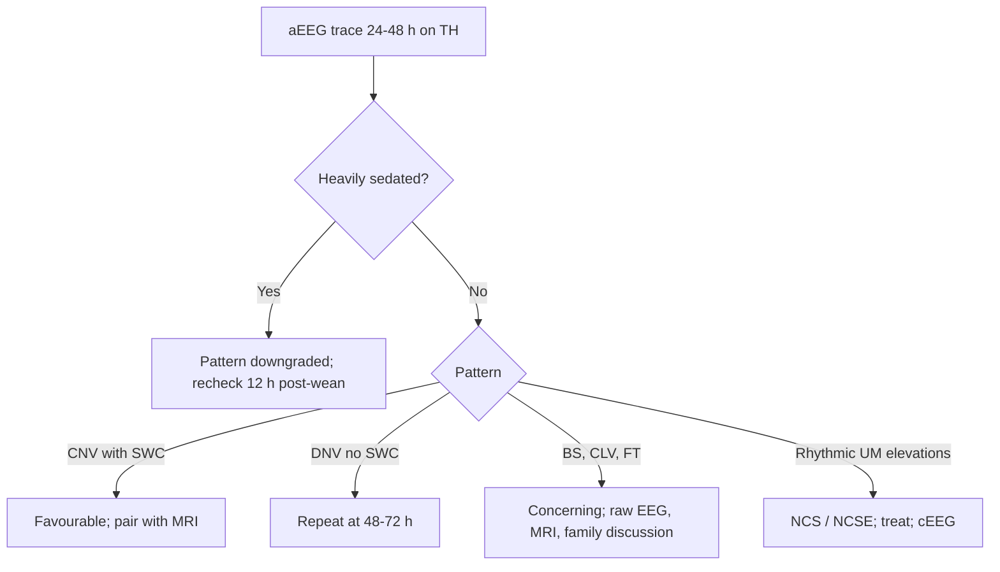

<Callout type="reference">
**Acronyms used on this page**

- **aEEG**: amplitude-integrated EEG (the time-compressed envelope)
- **cEEG**: continuous (full-montage) EEG, the raw signal aEEG is derived from
- **CFM**: cerebral function monitor, the original Maynard 1969 device
- **CNV**: continuous normal voltage
- **DNV**: discontinuous normal voltage
- **BS**: burst-suppression
- **CLV**: continuous low voltage
- **FT**: flat trace (isoelectric)
- **SWC**: sleep-wake cycling
- **HIE**: hypoxic-ischaemic encephalopathy
- **TH**: therapeutic hypothermia
- **NICU**: neonatal intensive care unit
- **PICU**: pediatric intensive care unit
- **NCSE / NCS**: non-convulsive status epilepticus / non-convulsive seizure
- **GA**: gestational age
- **MAP / ICP / CPP**: mean arterial / intracranial / cerebral perfusion pressure
- **SAH**: aneurysmal subarachnoid haemorrhage · **TBI**: traumatic brain injury
- **DCI**: delayed cerebral ischaemia · **MMM / MNM**: multimodal neuromonitoring
</Callout>

<TldrCard>
**The 60-second version.** aEEG is the bandpass-filtered (2–15 Hz), full-wave rectified, semi-log, time-compressed envelope of one or two channels of EEG. It exists because raw EEG over hours is unreadable at the bedside; the envelope compresses 6 hours into a glance. Five canonical neonatal patterns (CNV, DNV, BS, CLV, FT) and the return of **sleep-wake cycling** carry strong prognostic weight in HIE, especially when read at 24–48 hours of cooling. It is a **trend tool**, not a montage. Use it to triage who needs full cEEG, to track recovery and seizure burden in real time, and to provide the family-discussion data point at the prognostic timepoint. Confirm any concerning aEEG finding with raw EEG: aEEG misses focal seizures, is distorted by ECG and movement, and a "good" envelope can mask focal injury.
</TldrCard>

## 1. Bedside vignettes: why this matters

### Vignette A. Term newborn, day 2 of cooling for HIE

A 39-week neonate with a sentinel uterine rupture, Apgars 1/3/5, cord pH 6.83. Therapeutic hypothermia (target core 33.5 °C) started at 2 h of life. At 24 h on the Olympic CFM you see a **discontinuous trace**: upper margin 20–25 µV, lower margin dipping to 3–4 µV every 8–10 seconds. By 48 h the lower margin has lifted to 7 µV, the trace is now **continuous normal voltage**, and a faint sleep-wake cycle is appearing. The clinical question: is the imaging at 72 h going to find diffuse injury, or is this child recovering? <Cite id="toet2002" /> <Cite id="hellstromwestas2006" />

### Vignette B. School-age status epilepticus in the PICU

An 8-year-old presents in convulsive status, treated with lorazepam, levetiracetam, midazolam infusion. Clinical motor activity stops; you put two leads on (C3-P3, C4-P4) for an aEEG strip while waiting for the cEEG technologist. The aEEG envelope shows **rhythmic broadening of the upper margin** every 90 seconds: **NCSE**. The midazolam infusion is up-titrated. When the cEEG arrives 90 minutes later it confirms ongoing electrographic seizures arising from the right central region. The aEEG bought time. <Cite id="herman2015acns_ceeg" /> <Cite id="abend2011" />

### Vignette C. The "lush" envelope that is not reassurance

A 6-month-old infant post-cardiac-arrest after a near-drowning. At 36 hours the aEEG looks **continuous, voltages 15–35 µV**, no obvious burst-suppression. The team is reassured. The neurologist asks for raw cEEG: it shows **alpha-coma rhythm**, a low-amplitude monomorphic alpha frequency unresponsive to noise, eye opening, or pain, classic of severe brainstem and thalamic dysfunction after global hypoxia. The aEEG envelope cannot read frequency content; in alpha-coma it looks deceptively normal. Outcome at 6 months: profound neurodisability. <Cite id="topjian2021aha_pediatric" /> <Cite id="naim2023_brain_injury_pccm" />

---

## 2. What aEEG is, and what it is not

aEEG is **not a separate measurement**. It is a **display transform** of the raw EEG signal, designed so that hours of activity collapse onto a single trend line that a bedside nurse or PICU fellow can read without an electroencephalographer in the room.

The pipeline, in four steps:

1. **Bandpass filter, 2–15 Hz.** This is the most consequential step. It cuts the low-frequency artefact (sweat, eye movement, slow drift) and the high-frequency contamination (EMG, mains noise) while preserving the frequencies where most clinically relevant background activity lives. It also throws away delta-dominant patterns; very slow rhythms (< 2 Hz) are systematically under-represented.
2. **Full-wave rectify.** Negative deflections are flipped positive; the absolute amplitude of the signal becomes the input to the next stage.
3. **Smooth and envelope-detect.** A short moving average smooths the rectified signal; the **upper margin** of the envelope is the peak-to-peak amplitude per epoch (~15-second bin), the **lower margin** is the floor.
4. **Plot on a semi-logarithmic y-axis, time-compressed.** The y-axis runs ~0–100 µV with a linear segment up to ~10 µV and a logarithmic segment above. The x-axis is compressed: a single screen shows 6 hours (one channel) or 12–24 hours (multi-channel). <Cite id="hellstrom2008" />

```math
\text{aEEG}(t) = \text{envelope}_{15\,\text{s}}\big( \,|\,\text{BPF}_{2{-}15\,\text{Hz}}(\text{EEG}(t))\,|\,\big)
```

### What aEEG does well

- **Long view**: compresses hours of activity into a glance.
- **Pattern recognition**: five canonical patterns are taught in under an hour.
- **Bedside-friendly**: a two-lead montage that a nurse can place; output requires no FFT or montage knowledge.
- **Trend prognostication**: time to **return of sleep-wake cycling** in cooled HIE is one of the strongest non-imaging prognostic markers in the first 72 h. <Cite id="toet1999" /> <Cite id="toet2002" />
- **Seizure burden quantification**: rhythmic upper-margin elevations, even brief, flag NCSE and high-burden electrographic seizures.

### What aEEG cannot do

- **Focal seizures** with limited spatial spread can be invisible: the two-lead montage covers a small fraction of cortex.
- **Frequency content** is collapsed into amplitude only: alpha-coma, theta-coma, periodic patterns are unreadable on the envelope alone.
- **Artefact** (movement, ECG, ventilator, high-frequency oscillator) elevates the lower margin and mimics CNV; an envelope that "looks fine" can be misleading without raw EEG cross-check.
- **Adult cortex** generates lower-amplitude background than neonatal cortex; aEEG thresholds for CNV/DNV are derived from neonatal data and do not transfer directly to adults.

<Pearl>
**aEEG is a trend tool, not a montage.** Treat it like a continuous BP cuff: useful for hours of drift, hopeless for the single beat-to-beat decision. When something looks abnormal on aEEG, open the raw EEG window. When it looks fine, periodically open the raw EEG window anyway.
</Pearl>

<Pediatric>
The five aEEG patterns (Hellström-Westas classification) were defined for **term neonates**. In preterm infants ≤ 32 weeks GA the background is naturally discontinuous, the lower margin sits near 2–3 µV, and the trace tracks **gestational-age maturation** more than acute injury. A trace that would mean "severely abnormal" in a term newborn is normal at 28 weeks. The Burdjalov score, not the Hellström-Westas classification, is the right tool for preterm aEEG interpretation. <Cite id="hellstromwestas2006" /> <Cite id="alnaqeeb1999" />
</Pediatric>

---

## 3. Anatomy: where the leads go

<Figure
  src="/images/aeeg/aeeg-patterns.svg"
  alt="Five aEEG patterns side by side: continuous normal voltage, discontinuous normal voltage, burst-suppression, continuous low voltage, flat trace"
  caption="Anatomy of the envelope and five canonical patterns. (a) Continuous normal voltage (CNV): upper > 10 µV, lower > 5 µV, the healthy term-newborn baseline. (b) Discontinuous normal voltage (DNV): upper > 10 µV but lower dips below 5 µV in periodic interruptions. (c) Burst-suppression (BS): a clean baseline with periodic bursts that rise sharply, the marker of severe injury. (d) Continuous low voltage (CLV): both margins suppressed under 10 µV. (e) Flat trace (FT): both margins below 5 µV, electrocerebral inactivity. Sleep-wake cycling (SWC) appears as a slow undulation of the lower margin every 20–60 minutes; its presence in HIE is one of the strongest favourable signs."
  attribution="MNM-Edu, original schematic. SVG placeholder."
  label="Fig. 1"
/>

The **standard aEEG montage** is a single bipolar channel: **P3-P4** in neonates (parietal-parietal), or two bipolar channels (C3-P3 and C4-P4) on multi-channel CFM devices. The two-lead choice is deliberate: most NICU staff can place two leads reliably in under 5 minutes, and the parietal montage straddles watershed territories where global injury shows up earliest.

| Lead | 10–20 location | Why this site |
|---|---|---|
| **P3-P4** (neonate single channel) | Bilateral parietal | Watershed; captures global cortical activity; minimal frontal artefact |
| **C3-P3 / C4-P4** (dual channel) | Centro-parietal each side | Adds hemispheric symmetry; surfaces left-vs-right asymmetry |
| **F3-T3 / F4-T4** (adult ICU) | Frontotemporal | Used in adult ICU sedation monitors; less prognostic data in pediatrics |

Reference electrodes (Cz or AFz) and the ground electrode complete the array. Leads are typically subdermal needles (preterm) or hydrogel patches (term and older). Impedance < 5 kΩ is the bedside target; > 20 kΩ produces unreadable artefact.

<Pitfall>
**Asymmetry on a two-lead aEEG can be a real focal injury or an artefact of one bad electrode.** Before calling left-vs-right asymmetry pathological, check impedances and the raw trace.
</Pitfall>

---

## 4. The signal: anatomy of the envelope

The envelope has three readable features.

1. **Upper margin**: the peak amplitude in each ~15-second epoch. Continuous well-developed background has an upper margin **> 10 µV** in the term newborn and **> 25 µV** in the older child.
2. **Lower margin**: the trough amplitude. A lower margin **> 5 µV** in the term newborn is the threshold for "continuous"; below 5 µV is "discontinuous".
3. **Bandwidth**: the vertical distance between upper and lower margins. Narrow bandwidth (< 5 µV) with both margins low signals **CLV** or **FT**; very wide bandwidth (> 30 µV) with periodic interruptions signals **BS**.

**Sleep-wake cycling (SWC)** appears as a slow, regular undulation of the **lower margin** every 20–60 minutes: a more discontinuous "quiet sleep" phase alternates with a more continuous "active sleep" phase. SWC normally appears by 30 weeks GA in preterm infants and is robust by term. Its **disappearance** is an early marker of acute injury; its **reappearance** after HIE injury is the strongest envelope-based predictor of favourable outcome. <Cite id="hellstrom2008" /> <Cite id="hellstromwestas2006" />

```math
\text{SWC index} = \frac{\text{lower-margin amplitude (active sleep)} - \text{lower-margin amplitude (quiet sleep)}}{\text{mean lower-margin amplitude}}
```

A SWC index > 0.3 is a clean cycle; flat (< 0.1) means no cycling.

---

## 5. The numbers to record: the aEEG six-pack

For every patient, on every shift, log this six-pack into the chart:

| Variable | Symbol | What it tells you |
|---|---|---|
| Upper margin (mean over 1 h) | UM | Background voltage; falls in injury, sedation, post-ictal suppression |
| Lower margin (mean over 1 h) | LM | Continuity; the key threshold for CNV vs DNV |
| Bandwidth (UM − LM) | BW | Narrow + low = CLV/FT; wide + periodic = BS |
| Pattern classification | CNV/DNV/BS/CLV/FT | Hellström-Westas grade |
| Sleep-wake cycling | SWC present / absent | Strongest favourable marker post-HIE |
| Electrographic seizure count and burden | n/hr, %/hr | NCS / NCSE flag; quantify if cEEG available |

Document the **time since insult** with every reading: a BS pattern at 6 hours is much less prognostic than the same pattern at 48 hours after rewarming. Time-stamp every change.

---

## 6. What is normal? Age- and GA-banded reference

Normative aEEG bandwidth and continuity are dominated by **post-menstrual age** in the neonatal period and by **state** (wake / sleep / sedation) thereafter.

| Age / GA | Expected pattern | Lower margin (µV) | Sleep-wake cycling |
|---|---|---|---|
| 24–28 weeks GA | Highly discontinuous; long inter-burst intervals (IBI 20–60 s) | 2–3 | Absent or rudimentary |
| 28–32 weeks GA | Discontinuous; IBI 5–20 s | 3–5 | Emerging |
| 32–36 weeks GA | Mixed CNV/DNV; IBI 2–10 s | 4–7 | Established |
| Term (37–42 weeks) | CNV with clear SWC | > 5 | Present |
| 1–6 months | CNV; SWC mature | 7–12 | Present |
| 6 months – 5 years | CNV; voltages peak | 10–25 | Present |
| 5–18 years | CNV with age-typical alpha background | 10–20 | Present |
| Adult | CNV with alpha background | 10–20 | Present |

Sedation, propofol or pentobarbital coma, and natural deep sleep all push the trace toward **discontinuous** or **burst-suppression**. A neonate at 24 h of cooling with DNV on a midazolam-fentanyl infusion is not the same physiology as the same DNV off all sedation: sedation accounts for at least one-grade downgrade of pattern. <Cite id="herman2015acns_ceeg" />

<Pediatric>
In the preterm population the **Burdjalov maturational score** combines continuity, sleep-wake cycling, amplitude, and bandwidth into a 0–13 ordinal score that tracks gestational-age maturation. A score below the GA-expected band suggests injury beyond what GA explains.
</Pediatric>

---

## 7. What is abnormal? Pattern library

The five Hellström-Westas patterns plus the seizure overlay form the canonical pattern set. The same envelope features carry different prognostic weight at different time-points and on or off sedation.

| Pattern | Defining features | Where you see it | Implication |
|---|---|---|---|
| **Continuous normal voltage (CNV)** | UM > 10, LM > 5 µV, no periodic interruption | Healthy term newborn; recovering HIE post-rewarming | Favourable; pair with SWC for prognostic punch |
| **Discontinuous normal voltage (DNV)** | UM > 10, LM 3–5 µV, periodic dips | Moderate HIE; preterm; sedated child | Borderline; trend over 24 h is the question |
| **Burst-suppression (BS)** | Clean baseline LM < 5 µV with periodic bursts UM > 25 µV | Severe HIE; deep barbiturate coma; status epilepticus suppression target | Severe injury or pharmacologic; time-point and sedation status critical |
| **Continuous low voltage (CLV)** | UM < 10 µV, LM < 5 µV, no periodicity | Severe HIE; profound diffuse injury | Poor; concordant with poor MRI |
| **Flat trace (FT)** | UM < 5 µV, LM < 5 µV | Electrocerebral inactivity | Devastating; brain-death evaluation context |
| **Electrographic seizure overlay** | Rhythmic broadening of UM with abrupt onset/offset, often periodic | NCS / NCSE in any pattern | Treat; quantify burden; cEEG confirmation |
| **Sleep-wake cycling (SWC)** | Slow undulation of LM every 20–60 min | Healthy term and older; recovering HIE | Strongest favourable marker |
| **Loss of SWC** | Flat LM trend | Acute injury; sedation; deep coma | Sensitive marker of clinical change |

### Decision tree: reading the envelope in cooled HIE



<RealWorld>
**The single most prognostic question on the aEEG round is whether sleep-wake cycling has returned by 48–72 hours of cooling.** Children whose SWC returns by 72 h have markedly better neurodevelopmental outcomes at 18 months than those who do not, even when the static pattern at 24 h was the same. Trend beats snapshot. <Cite id="toet1999" /> <Cite id="toet2002" />
</RealWorld>

---

## 8. Try it: interactive widget

<WidgetEmbed name="aEEGGenerator" />

---

## 9. Management: how aEEG drives the bedside decision

aEEG itself does not titrate a drug; it changes the **decisions around** drugs, imaging, and prognostic conversations.

### 9.1 During therapeutic hypothermia for HIE

The 72-hour cooling window is the canonical aEEG-driven workflow.

1. **Place leads within the first hour of cooling** (3-hour upper limit). Earlier placement gives a full evolutionary curve.
2. **Document the pattern at 6, 24, 48, 72 hours** and at any clinical change.
3. **Annotate sedation events**: fentanyl boluses, midazolam infusion changes, paralysis (rare in cooling) all interpret the envelope.
4. **Open the raw EEG** at every shift change and at every concerning aEEG change.
5. **At 72 h (rewarming complete)** the pattern and SWC presence are the **single most predictive** non-imaging variables; combine with MRI at 4–7 days of life and the clinical exam.
6. **Family discussions** based on aEEG patterns at 24 h are premature; wait until 48–72 h. <Cite id="toet2002" /> <Cite id="hellstromwestas2006" />

### 9.2 Seizure detection and burden quantification

- **Suspicion threshold for NCSE**: any rhythmic broadening of the upper margin, even brief, in a sedated or post-status patient.
- **Confirm on raw EEG**: aEEG sensitivity for individual seizures is 25–80% (operator and seizure-character dependent); specificity is high. Treat the rhythmic envelope, document the cEEG confirmation.
- **Burden quantification**: seizure-burden > 1 minute per hour or > 13 minutes total in any rolling hour is the threshold that drives most pediatric escalation protocols. <Cite id="abend2011" /> <Cite id="topjian2021aha_pediatric" />

### 9.3 Sedation titration in the PICU (adjunct, not primary)

aEEG can support sedation depth assessment in paralysed ICU patients (where clinical sedation scores fail), but **BIS** is the more validated tool in that role. Use aEEG to **detect break-through seizures during sedation** and to monitor for **excessive suppression** that may delay neuroprognostication later.

<Callout type="caveat">
**Decision support, not a clinical protocol.** Every threshold here is age-, sedation-, and centre-dependent. Pair with raw cEEG, clinical exam, and imaging; defer to your unit's neuro-prognostication pathway.
</Callout>

<AlgorithmDisclaimer />

---

## 10. Clinical contexts: aEEG across the spectrum

### 10.1 Neonatal HIE and therapeutic hypothermia

The canonical use. aEEG is part of the routine cooling bundle in every NICU that runs the protocol. The 6-h pattern was diagnostic in the **pre-TH** era; under hypothermia, the diagnostic and prognostic time-points have shifted to **24–48 hours** (during cooling) and **48–72 hours** (post-rewarming). The combination of **persistent BS/CLV/FT at 48 h** and **failure of SWC return by 72 h** is the strongest non-MRI predictor of severe disability. <Cite id="shankaran2005hie_nichd" /> <Cite id="toet2002" /> <Cite id="hellstromwestas2006" /> <Cite id="pressler2017neonatal" />

### 10.2 Neonatal seizures (term and preterm)

Neonatal seizures are predominantly electrographic-only after the first 24 h of life, particularly under sedation. aEEG with raw-EEG review is the screening modality. The ILAE 2017 framework recommends cEEG as the gold standard but explicitly endorses aEEG-plus-raw-trace as the bedside surrogate when cEEG is not immediately available. <Cite id="pressler2017neonatal" /> <Cite id="sansevere2023_neonatal_ceeg" />

### 10.3 Pediatric cardiac arrest and post-arrest

aEEG is part of the post-arrest neuromonitoring bundle in PICU practice. A return of CNV with SWC by 24–48 h post-ROSC is associated with favourable outcome; persistent CLV/FT or BS after sedation washout predicts poor outcome. The AHA 2021 pediatric resuscitation guidelines list cEEG (with aEEG screening) as the bedside electrophysiologic standard. <Cite id="topjian2021aha_pediatric" /> <Cite id="naim2023_brain_injury_pccm" /> <Cite id="moler2015thapca_oh" />

### 10.4 Severe TBI

In paralysed PICU TBI patients, clinical seizure detection is impossible. aEEG with raw cEEG cross-check detects NCS / NCSE that can otherwise present only as unexplained autoregulatory failure or refractory ICP. The 2019 BTF pediatric TBI guidelines and the ACNS critical-care EEG terminology guidelines support continuous EEG monitoring in severe TBI; aEEG is the bedside screening layer. <Cite id="kochanek2019_pbtf4" /> <Cite id="herman2015acns_ceeg" /> <Cite id="tasker2023_pccm_review" />

### 10.5 Aneurysmal SAH and DCI

Adult and emerging pediatric data show that **qEEG-derived alpha-delta ratio** is the most sensitive EEG marker of pre-clinical DCI in SAH; aEEG alone is too coarse to track DCI. Use aEEG to screen for NCS and to monitor sedation depth in coiled / clipped patients; rely on qEEG for the DCI question. <Cite id="hoh2023sah_aha" /> <Cite id="rass2021dci_review" /> <Cite id="sandsmark2024_qeeg_dci" />

### 10.6 Pediatric ECMO

ECMO patients are paralysed, sedated, often hypothermic, and frequently anti-coagulated; clinical seizure detection is unreliable and stroke incidence is 5–10%. aEEG with raw-trace cross-check is the bedside screen for NCS / NCSE and the trend tool for acute neurologic deterioration during cannulation, cannula manipulation, or pump events. <Cite id="lorusso2017_elso_neuro" /> <Cite id="cho2024_ecmo_outcomes" />

### 10.7 Bacterial meningitis and acute encephalitis

In severe acute encephalitis (HSV, autoimmune, post-infectious), NCS / NCSE is common and clinically undetectable in the obtunded child. aEEG-screened EEG monitoring in the first 48–72 h is now standard. A burst-suppression pattern after status epilepticus treatment is the target for many sedation protocols; aEEG tracks the achievement and duration. <Cite id="tunkel2004_idsa_meningitis" /> <Cite id="tunkel2017idsa_encephalitis" />

### 10.8 Refractory status epilepticus

aEEG is the bedside trend tool for **continuous infusion** treatment of refractory SE: midazolam, pentobarbital, ketamine. The target (electrographic seizure suppression, burst-suppression, or isoelectric, depending on protocol) is set and titrated on the envelope, then confirmed on cEEG. ESETT and ECLIPSE provide the second-line evidence; the third-line continuous-infusion endpoints are protocol-driven. <Cite id="glauser2016esett" /> <Cite id="kapur2019eclipse_se" /> <Cite id="trinka2015_status_definition" />

### 10.9 Brain-death determination

aEEG is **not a substitute** for the multi-channel EEG required by the World Brain Death Project framework, but it can prompt the ancillary testing pathway when an envelope becomes persistently isoelectric in a clinical brain-death candidate. The formal test requires full montage, defined sensitivity, ECG monitoring, and trained interpretation. <Cite id="greer2020_braindeath" /> <Cite id="nakagawa2011peds_bd" />

---

## 11. Multimodal integration: aEEG in the MMM/MNM stack

<Figure
  src="/images/aeeg/aeeg-patterns.svg"
  alt="aEEG patterns in the context of the multimodal monitoring stack"
  caption="aEEG pairs naturally with several other modalities. In HIE, aEEG plus NIRS (rSO2) and MRI form the neuroprognostic bundle. In severe TBI and SAH, aEEG plus cEEG plus ICP / PRx surface NCSE that masquerades as autoregulatory failure. In post-cardiac-arrest, aEEG plus NPI plus SSEP triangulate the 72-hour prognostic call."
  attribution="MNM-Edu, original schematic. SVG placeholder."
  label="Fig. 2"
/>

| Pair with… | What you gain | Worked scenario |
|---|---|---|
| **cEEG** | Confirm focal seizures, frequency content, alpha-coma | Any aEEG abnormality in a salvageable patient |
| **NIRS / rSO2** | Combine cortical electrophysiology with cortical oxygenation; the HIE prognostic bundle | [HIE monitoring bundle](/integration/mnm-in-the-newborn/) |
| **NPI / pupillometry** | Cortical (aEEG) plus brainstem (NPI) view; the post-arrest 72-h prognostic call | [Post-arrest prognostic bundle](/integration/discordance-triage/) |
| **MRI 4–7 d** | Imaging anchor for the envelope-based prognosis in HIE | [HIE monitoring bundle](/integration/mnm-in-the-newborn/) |
| **SSEP at 72 h** | The most specific bilateral-absent-N20 sign in post-arrest comatose patients | [Brain death and ancillary testing](/integration/brain-death-mnm/) |
| **ICP / PRx** | Detect NCSE-driven CBF surges as autoregulatory failure on PRx | [EEG / TCD non-convulsive seizure pair](/integration/eeg-tcd-non-convulsive/) |
| **BIS** | Adjunct in paralysed PICU patients on continuous infusion sedation | Status epilepticus suppression targets |

<Cite id="figaji2025_mmm_pediatric_consensus" /> <Cite id="helbok2024_pediatric_mmm" /> <Cite id="tasker2023mnm" />

---

<DeepDive>

## 12. Setup and technique

### 12.1 Equipment

- **Bedside aEEG device**: Olympic Brainz Monitor, Natus CFM, Nicolet BRM, Massimo CFM. All output the canonical envelope; visual styling differs.
- **Electrodes**: subdermal needles (preterm), hydrogel patches or cup electrodes with conductive gel (term and older). Three to five electrodes per side (active, reference, ground).
- **Conductive medium and skin prep**: alcohol clean, light skin abrasion (NuPrep), then patch. Avoid acetone in neonates.
- **Cable shielding**: critical in the high-EMI NICU/PICU environment; isolated input modules reduce 50/60-Hz mains contamination.
- **Optional**: simultaneous raw cEEG video integration for offline review.

### 12.2 Placement: the 5-minute bedside protocol

1. **Skin prep**: clean the scalp at the two parietal sites (P3, P4 in the 10–20 system) with alcohol, gentle abrasion.
2. **Apply electrodes**: hydrogel patches or cup electrodes with conductive gel, ensuring full contact and securing with light tape.
3. **Add reference and ground**: Cz or AFz for reference; Fpz for ground.
4. **Test impedances**: < 5 kΩ ideal; < 10 kΩ acceptable; > 20 kΩ unreadable, re-prep and re-apply.
5. **Confirm signal**: visualise the raw trace for 30 seconds; you should see physiologic EEG activity, not a flat line (electrode off) or 60-Hz mains contamination.
6. **Start aEEG recording**: 6 or 12-hour display window; annotate the start time and the patient's sedation state.

### 12.3 Reading routine

- **Glance at every shift change**: pattern, SWC, any rhythmic broadening.
- **Open raw EEG at every concerning aEEG event**: rhythmic upper-margin broadening (seizure?), abrupt voltage drop (sedation? rebleed? cannulation event?).
- **Annotate the envelope** with clinical events: sedation boluses, paralysis, cooling/rewarming, suction, intubation, cannulation.
- **Re-impedance check every 8–12 hours**: drying gel and patient sweat raise impedances and can produce artefactual "abnormalities".

### 12.4 Common artefact patterns and the fix

| Artefact | Envelope appearance | Cause | Fix |
|---|---|---|---|
| ECG | Periodic narrow blips on upper margin at heart rate | Cardiac activity bleeding into scalp electrode | Re-prep electrode; check impedance |
| High-frequency oscillator (HFOV) | Continuous high upper margin, narrow bandwidth | Mechanical vibration | Filter setting; flag on chart |
| Sweat / drift | Slow rise of lower margin | Patient warmer, sweat under electrode | Re-prep |
| Movement | Spike of upper margin, irregular | Patient agitation, suctioning, hand-on-head | Annotate; ignore short bursts |
| Mains 50/60 Hz | Continuous wide bandwidth | Poor shielding | Check ground, move away from infusion pumps |
| Lead-off | Flat trace, sudden | Electrode disconnected | Check impedance, re-apply |

### 12.5 Documentation in the chart

Every shift the bedside nurse documents the **pattern**, **lower margin**, **SWC present/absent**, **seizure burden**, and **sedation state**. The neurology team adds the cEEG interpretation. The combined entry is what informs the family discussion and the prognostic call.

</DeepDive>

---

## 13. Pitfalls

- **Sedation downgrades the pattern.** A child on midazolam and fentanyl looks one Hellström-Westas grade worse than off. Do not call BS at 24 h on full sedation; wait until sedation hold or interpret cautiously.
- **Alpha-coma is invisible on the envelope.** Periodically open the raw EEG.
- **Focal seizures may not move the envelope.** A two-lead aEEG covers a small fraction of cortex. Add lateralising leads or full cEEG for any focal clinical suspicion.
- **Hypothermia and rewarming change the baseline.** Voltages dip with cooling and recover with rewarming; do not over-call deterioration around the rewarming window.
- **The 6-hour cutoff is pre-TH data.** Use 24–48 h time-points for cooled neonates; do not over-weight a 6-h pattern. <Cite id="hellstromwestas2006" />
- **Asymmetry between two leads may be a bad electrode.** Always check impedance before calling lateralised injury.
- **Burst-suppression as a sedation target** (for refractory SE) looks identical to BS as a marker of severe injury. Annotation of the clinical context is essential.
- **High-frequency oscillator** contaminates the trace with mechanical vibration. Flag the ventilation mode on the chart.
- **A "normal-looking" envelope in a comatose patient** with absent brainstem reflexes is alpha-coma or theta-coma until proven otherwise. Open the raw EEG.

---

## 14. Combine with…

- [Continuous full-montage EEG](/modalities/eeg/): the gold standard; aEEG is the bedside trend layer.
- [Quantitative EEG](/modalities/qeeg/): adds spectral and asymmetry analysis on top of cEEG.
- [NIRS](/modalities/nirs/): rSO2 plus aEEG for the HIE prognostic bundle.
- [Pupillometry](/modalities/pupillometry/): NPI plus aEEG for the post-arrest 72-h call.
- [SSEP](/modalities/evoked-potentials/): N20 plus aEEG plus NPI for the post-arrest prognostic triangulation.
- [Foundations: pediatric physiology](/foundations/pediatric-physiology/): why aEEG thresholds are age-dependent.
- [Integration: HIE monitoring bundle](/integration/mnm-in-the-newborn/): how aEEG fits the bundle.
- [Integration: refractory status epilepticus](/integration/refractory-status-epilepticus/): aEEG as the bedside trend in third-line therapy.

---

<DeepDive>

## 15. Evidence summary

| Topic | Source | Grade |
|---|---|---|
| Original CFM description | <Cite id="maynard1969" /> | foundational |
| Pre-TH aEEG prognosis (term HIE) | <Cite id="hellstromwestas2006" /> <Cite id="alnaqeeb1999" /> | B |
| Sleep-wake cycling return as prognostic marker | <Cite id="toet1999" /> <Cite id="toet2002" /> | B |
| Modern review of aEEG technique | <Cite id="hellstrom2008" /> | review |
| Neonatal seizure detection / ILAE framework | <Cite id="pressler2017neonatal" /> | expert |
| ACNS critical-care EEG terminology | <Cite id="herman2015acns_ceeg" /> | expert |
| Pediatric NCSE / cEEG | <Cite id="abend2011" /> | B |
| Post-cardiac-arrest aEEG/cEEG | <Cite id="topjian2021aha_pediatric" /> <Cite id="naim2023_brain_injury_pccm" /> | expert |
| THAPCA-OH trial (outcomes context) | <Cite id="moler2015thapca_oh" /> | A |
| Pediatric severe TBI (BTF 4th ed.) | <Cite id="kochanek2019_pbtf4" /> | expert |
| Status epilepticus second-line evidence | <Cite id="glauser2016esett" /> <Cite id="kapur2019eclipse_se" /> | A |
| Status definition (ILAE) | <Cite id="trinka2015_status_definition" /> | expert |
| Neonatal cEEG (sansevere) | <Cite id="sansevere2023_neonatal_ceeg" /> | review |
| HIE NICHD cooling trial | <Cite id="shankaran2005hie_nichd" /> | A |
| Pediatric MMM consensus | <Cite id="figaji2025_mmm_pediatric_consensus" /> <Cite id="helbok2024_pediatric_mmm" /> <Cite id="tasker2023mnm" /> | expert |
| ECMO neuro outcomes | <Cite id="lorusso2017_elso_neuro" /> <Cite id="cho2024_ecmo_outcomes" /> | C |
| Brain death determination | <Cite id="greer2020_braindeath" /> <Cite id="nakagawa2011peds_bd" /> | expert |

## 16. Recent literature (2022–2025)

- **Sansevere 2023 (neonatal cEEG review)**: contemporary practice patterns for neonatal cEEG with aEEG as the screening layer in NICUs without 24/7 EEG technologist coverage. <Cite id="sansevere2023_neonatal_ceeg" />
- **Naim 2023 (pediatric brain injury post-cardiac arrest)**: review of multimodal post-arrest neuromonitoring with aEEG/cEEG as the cortical electrophysiology arm. <Cite id="naim2023_brain_injury_pccm" />
- **Tasker 2023 (pediatric neurocritical care review)**: positions aEEG as a tier-1 bedside modality in resource-stratified pediatric neurocritical care. <Cite id="tasker2023_pccm_review" /> <Cite id="tasker2023mnm" />
- **Pediatric MMM consensus (Figaji 2025)**: formalises continuous EEG (with aEEG screening) in the recommended tier of pediatric multimodal monitoring. <Cite id="figaji2025_mmm_pediatric_consensus" />
- **Topjian 2021 AHA pediatric**: continuous EEG screening (aEEG-supported) in post-arrest pediatric care now part of the algorithm. <Cite id="topjian2021aha_pediatric" />
- **Quantitative EEG / DCI**: in SAH, qEEG (alpha-delta ratio) has eclipsed aEEG for DCI detection; aEEG remains the bedside screening layer for NCS / NCSE during the same admission. <Cite id="sandsmark2024_qeeg_dci" />

</DeepDive>

---

## 17. Self-check

<Quiz
  questions={[
    {
      id: 'q1',
      prompt: 'A 38-week neonate with severe HIE, 48 h of therapeutic hypothermia, on a midazolam infusion. aEEG shows lower margin 3 µV, upper margin 22 µV with periodic interruptions; no sleep-wake cycling yet. Most appropriate next step?',
      options: [
        { id: 'a', label: 'Call this burst-suppression and counsel for poor prognosis now' },
        { id: 'b', label: 'Wean midazolam, reassess at 12 h, plan repeat aEEG and raw cEEG at 72 h post-rewarming' },
        { id: 'c', label: 'Increase midazolam to deepen suppression' },
        { id: 'd', label: 'Order ancillary brain-death testing' },
      ],
      answer: 'b',
      explanation: 'The pattern is DNV (discontinuous normal voltage) on sedation, not pre-rewarming. Sedation downgrades the apparent pattern by approximately one grade; the prognostic time-points in cooled HIE are 48–72 h post-rewarming after sedation hold. Counsel for poor prognosis based on a sedated 48-h trace is premature. Reassess after wean and at 72 h with full cEEG and MRI.',
    },
    {
      id: 'q2',
      prompt: 'An 8-year-old in the PICU 36 h after near-drowning, paralysed and sedated for refractory ICP. aEEG looks continuous, upper margin 18 µV, lower 8 µV, bandwidth narrow, no overt seizure overlay. The PRx has drifted positive over the last 6 h with no clear cause. What is the most important next test?',
      options: [
        { id: 'a', label: 'No further EEG testing; the envelope is reassuring' },
        { id: 'b', label: 'Wean paralysis to check the clinical exam' },
        { id: 'c', label: 'Open the raw cEEG window; look for NCSE or alpha-coma' },
        { id: 'd', label: 'Pentobarbital coma to suppress all activity' },
      ],
      answer: 'c',
      explanation: 'A "normal-looking" envelope in a comatose post-arrest child can hide non-convulsive status (rhythmic activity below the envelope-detection threshold) or alpha-/theta-coma (preserved amplitude with abnormal frequency, prognostically poor). aEEG cannot see frequency content. Paralysis precludes clinical exam; pentobarbital is not indicated without an electrographic diagnosis first. Open the raw cEEG.',
    },
    {
      id: 'q3',
      prompt: 'A 4-week-old former 28-week preterm, now 32 weeks corrected, on aEEG showing markedly discontinuous trace with inter-burst intervals 15 s and lower margin 3 µV. This pattern in a term newborn would prompt aggressive workup. What is the appropriate interpretation here?',
      options: [
        { id: 'a', label: 'Severe injury, equivalent to BS in a term newborn' },
        { id: 'b', label: 'Normal for 32 weeks corrected gestational age; use the Burdjalov maturational score' },
        { id: 'c', label: 'Burst-suppression from over-sedation' },
        { id: 'd', label: 'Indeterminate; cannot interpret aEEG in preterm' },
      ],
      answer: 'b',
      explanation: 'The Hellström-Westas classification was derived for term neonates. In preterm infants the background is naturally discontinuous with longer inter-burst intervals; 32 weeks corrected GA matches well with the observed pattern. The Burdjalov score, not the Hellström-Westas classification, is the right tool for preterm aEEG interpretation and tracks GA-typical maturation.',
    },
  ]}
/>
