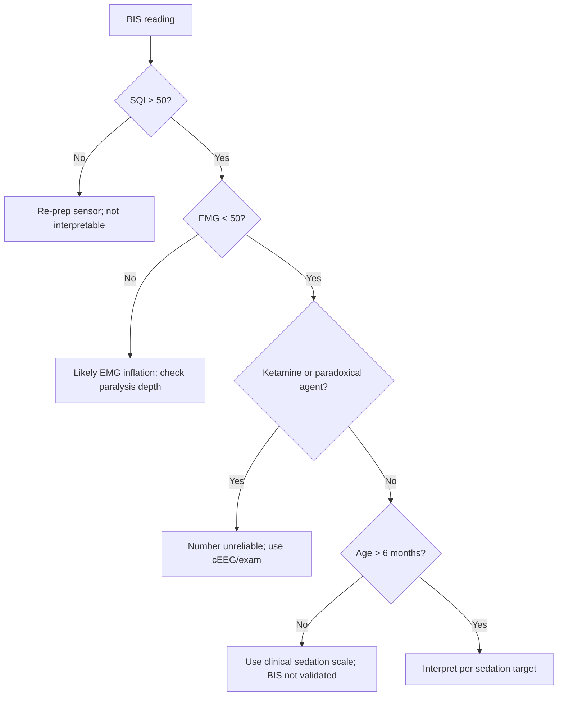

<Callout type="reference">
**Acronyms used on this page**

- **BIS**: bispectral index (Aspect/Medtronic proprietary 0–100 EEG-derived sedation score)
- **EEG**: electroencephalography
- **EMG**: electromyography (frontalis contamination is the main bedside artefact)
- **MAC**: minimum alveolar concentration (volatile anaesthetic potency)
- **NMBA**: neuromuscular blocking agent
- **SR**: suppression ratio (% of epoch with isoelectric activity)
- **SQI**: signal quality index (0–100 BIS sensor confidence)
- **ASA**: American Society of Anesthesiologists
- **PICU / NICU**: pediatric / neonatal intensive care unit
- **HIE**: hypoxic-ischaemic encephalopathy
- **NCSE / NCS**: non-convulsive status epilepticus / non-convulsive seizure
- **TIVA**: total intravenous anaesthesia
- **MAP / ICP / CPP**: mean arterial / intracranial / cerebral perfusion pressure
- **MMM / MNM**: multimodal monitoring / multimodal neuromonitoring
</Callout>

<TldrCard>
**The 60-second version.** BIS is a single-number sedation index, 0–100, derived from a proprietary algorithm applied to two frontal EEG channels. Awake ≈ 90–100; light sedation 70–80; surgical anaesthesia / deep sedation 40–60; deep coma / burst-suppression < 40; isoelectric ≈ 0. BIS exists because clinical sedation scoring (COMFORT-B, SBS, RASS) fails when the patient is paralysed. Use BIS for **sedation depth titration in paralysed PICU patients**, not for prognostication, not for seizure detection, not in neonates. Pediatric BIS values track adult values reasonably well above ~1 year of age; under 6 months the algorithm baseline is unreliable. The two most common bedside errors are over-interpreting BIS during ketamine (paradoxically high) and reading BIS through an EMG-contaminated SQI.
</TldrCard>

## 1. Bedside vignettes: why this matters

### Vignette A. Paralysed PICU patient with refractory ICP

A 10-year-old with severe TBI, ICP 24 despite tier-2 measures, started on cisatracurium infusion to abolish patient-ventilator dys-synchrony. The COMFORT-B and SBS are now useless. You place the BIS sensor across the forehead. SQI 92, EMG 25 (low), **BIS 38**. Over the next hour, with midazolam-fentanyl titration, BIS settles at 42 and ICP falls to 16. The number is doing its job: confirming sedation depth in a child whose face cannot signal it. <Cite id="mckeever2014bis" /> <Cite id="davidson2005bis" />

### Vignette B. Adolescent on ketamine infusion

A 16-year-old with status epilepticus, third-line on a ketamine infusion. You expect BIS to fall into the 40s. Instead, BIS reads **78**, the patient is unresponsive, no clinical movement, pupils equal. The cEEG shows electrographic suppression. **Ketamine is the classic BIS paradox**: it preserves high-frequency activity that the proprietary algorithm interprets as wakefulness. Treat the cEEG and the clinical exam; BIS is misleading here. <Cite id="rampil1998" /> <Cite id="whitlock2014" />

### Vignette C. 3-month-old infant on midazolam

A 3-month-old post-cardiac surgery on a midazolam-fentanyl infusion plus rocuronium for the first 24 h. The BIS sensor reads **62, SQI 88**, EMG 15. The team plans to lighten sedation. Is the infant adequately sedated? **The BIS algorithm is not validated below 6 months**: cortical maturation, sleep-architecture differences, and the spectral characteristics of immature EEG make the number unreliable. Use the BTF / pediatric sedation scoring fallback, not the BIS, in this age band. <Cite id="davidson2005bis" />

---

## 2. What BIS is, and what it is not

BIS is a **single-channel frontal-EEG-derived sedation index** produced by a proprietary algorithm (Aspect Medical Systems, now Medtronic). The algorithm combines three EEG-derived features into a 0–100 ordinal score:

1. **Bispectral analysis**: a higher-order spectral feature that quantifies phase coupling between frequency components. Coupled, organised activity (awake) gives a high score; decoupled, suppressed activity (deep anaesthesia) gives a low score.
2. **Power spectral analysis**: the relative contribution of beta vs delta-theta-alpha bands. Awake EEG has more beta; deep anaesthesia has more slow waves.
3. **Suppression analysis**: the fraction of each epoch with isoelectric activity (the "suppression ratio", SR), which dominates the score when SR > 0.

```math
\text{BIS} = f\big(\text{bispectrum},\ \text{relative beta},\ \text{burst-suppression ratio}\big)
```

The exact weights are proprietary; the score is calibrated against a sedation continuum across a large healthy-adult anaesthesia dataset.

| BIS range | Clinical correlate (adult, healthy cortex) |
|---|---|
| 90–100 | Awake, normal cognition |
| 70–80 | Light sedation, responsive to voice |
| 60–70 | Light-to-moderate sedation |
| 40–60 | Surgical anaesthesia / deep sedation |
| 20–40 | Deep anaesthesia / burst-suppression onset |
| < 20 | Deep burst-suppression to isoelectric |
| 0 | Isoelectric |

### What BIS does well

- **Sedation depth in paralysed adults**: validated for awareness prevention in general anaesthesia (B-Aware, B-Unaware studies). <Cite id="sigl1994bis" /> <Cite id="rampil1998" />
- **TIVA titration**: continuous numeric feedback during propofol-remifentanil anaesthesia.
- **Burst-suppression detection**: SR is a reliable marker when present.
- **Paralysed PICU sedation titration**: the most common modern bedside use.

### What BIS cannot do

- **Detect seizures**: BIS is not a seizure monitor; rhythmic activity can produce anomalous numbers in either direction.
- **Prognosticate after brain injury**: BIS is not validated for post-arrest or HIE prognostication.
- **Predict awareness in pediatric anaesthesia reliably**: the meta-analyses show weak benefit and substantial individual variability. <Cite id="whitlock2014" />
- **Be interpreted at face value under ketamine, nitrous oxide, dexmedetomidine, xenon**: these agents perturb the bispectrum without matching the clinical sedation depth.
- **Be used in neonates and very young infants**: cortical maturation makes the algorithm baseline unreliable below 6 months.

<Pearl>
**BIS is a sedation depth meter built for healthy cortex.** Any departure from healthy cortex (injury, age extremes, paradoxical drugs, ictal activity) breaks the calibration. Use BIS for what it was designed for: continuous numeric feedback on sedation depth when the clinical exam is unavailable.
</Pearl>

<Pediatric>
- **Below 6 months**: do not trust BIS. Cortical maturation, sleep-architecture differences, and immature EEG spectral content make the algorithm unreliable.
- **6 months to 2 years**: use with caution; baseline values run higher than adult equivalents at equipotent sedation. Trend within-patient rather than reading absolute thresholds.
- **2 years and above**: BIS values track adult ranges reasonably well; the same caveats (ketamine, paralysis, NCSE) apply.
- **Validation gap**: pediatric outcome trials of BIS-guided anaesthesia are limited; awareness prevention is the adult-data extrapolation.
</Pediatric>

---

## 3. The sensor: where the strip goes

<Figure
  src="/images/bis/bis-vs-sedation.svg"
  alt="BIS values across the sedation continuum from awake to isoelectric, with key thresholds annotated"
  caption="BIS across the sedation continuum. The four-electrode adhesive sensor sits across the forehead: lateral electrodes at FT9/FT10, medial electrodes at Fp1/Fp2, ground at AF7/AF8. The 0–100 score is calibrated so that healthy adults at burst-suppression onset read approximately 40, and isoelectric activity reads near 0. The clinical-correlate bands are derived from healthy-adult anaesthesia data; pediatric correlates are inferred."
  attribution="MNM-Edu, original schematic. SVG placeholder."
  label="Fig. 1"
/>

The **BIS sensor** is a single-use adhesive strip with four electrodes:

| Position | 10–20 location | Function |
|---|---|---|
| Lateral electrodes (1, 4) | FT9 / FT10 (above the temple) | Active EEG channels |
| Medial electrodes (2, 3) | Fp1 / Fp2 (above the eyebrow) | Reference / second active |
| Ground | AF7 / AF8 (between eye and temple) | Ground reference |

The sensor crosses the forehead; placement takes under 60 seconds. The sensor expires (the conductive gel dries) and must be replaced every 24 hours.

**Skin prep matters**: alcohol clean and gentle abrasion. Without prep, impedances rise into the kΩ range and the EMG channel reads spuriously high; that drives the algorithm to produce nonsense.

<Pitfall>
**EMG contamination is the single most common BIS artefact.** The frontalis muscle is right under the sensor; any patient who is awake, light, or anxious tenses the forehead and contaminates the EEG with EMG. The algorithm responds by raising the BIS number. A high BIS with a high EMG bar (> 50) is more likely "frontalis activity from a partly-sedated patient" than "wakefulness".
</Pitfall>

---

## 4. The display: the four numbers to read

Modern BIS monitors display four numbers and one trend:

| Variable | Range | What it tells you |
|---|---|---|
| **BIS** | 0–100 | Sedation depth index; primary read |
| **SQI** (signal quality index) | 0–100 | Algorithm confidence; trust the BIS only when SQI > 50 |
| **EMG** | 0 to ≥ 70 dB | Frontalis EMG contamination; high EMG inflates BIS |
| **SR** (suppression ratio) | 0–100% | Fraction of epoch with isoelectric activity; dominates BIS when > 0 |
| **Trend** | 30–60 min | The most useful single read; a BIS dropping from 65 to 35 over 10 min is more informative than the absolute value |

**Always read all four.** A BIS of 65 with SQI 85 and EMG 12 is informative. The same BIS with SQI 30 and EMG 70 is meaningless.

```math
\text{Trust the BIS only when}\ \text{SQI} > 50\ \text{and}\ \text{EMG} < 50
```

---

## 5. The numbers to record: the BIS six-pack

| Variable | Symbol | What to log |
|---|---|---|
| Bispectral index | BIS | Hourly; with sedation events |
| Signal quality index | SQI | Hourly; reject readings with SQI < 50 |
| Frontalis EMG | EMG | Hourly; flag readings with EMG > 50 |
| Suppression ratio | SR | Hourly; the burst-suppression marker |
| Sedation regimen | Drug, dose, infusion rate | At every titration |
| Clinical sedation score (when not paralysed) | COMFORT-B, SBS, RASS | Hourly; the gold-standard reference |

The chart entry pairs the **numeric BIS** with the **clinical context** (drug, paralysis, time since insult); a BIS value out of context is uninterpretable.

---

## 6. What is normal? Age-banded baseline considerations

There is no single "normal" BIS in the PICU; the number is interpreted against the **intended sedation depth** and the **age-typical EEG**.

| Age band | Awake BIS | Light sedation target | Deep sedation target | Notes |
|---|---|---|---|---|
| < 6 months | Not interpretable | Not interpretable | Not interpretable | Use COMFORT-B / NPASS; BIS unreliable |
| 6 months – 2 years | 85–100 | 60–80 | 40–60 | Higher baseline than adults; trend over absolute |
| 2–5 years | 90–100 | 60–80 | 40–60 | Approaching adult correlates |
| 5–12 years | 90–100 | 60–80 | 40–60 | Adult ranges apply |
| > 12 years | 90–100 | 60–80 | 40–60 | Adult ranges |
| Adult | 90–100 | 60–80 | 40–60 | Original calibration target |

Sources: <Cite id="davidson2005bis" /> <Cite id="mckeever2014bis" />. The "deep sedation 40–60" target is the historical anaesthesia value; PICU sedation targets are often **lighter** (50–70 range) to support neurologic exam, except when treating refractory ICP or status epilepticus.

<Pediatric>
Pediatric sedation depth scoring should default to the **clinical scale** (COMFORT-B, State Behavioral Scale, Richmond Agitation-Sedation Scale) whenever the patient is **not paralysed**. BIS adds value primarily when paralysis abolishes the clinical exam.
</Pediatric>

---

## 7. What is abnormal? Pattern library

| Pattern | Bedside meaning | What to do |
|---|---|---|
| **BIS 60–80 in a non-paralysed patient** | Light-to-moderate sedation, conscious sedation range | Titrate to target; cross-check with clinical scale |
| **BIS 40–60 in a paralysed patient** | Deep sedation / surgical anaesthesia level | Adequate for paralysis-tolerance; recheck hourly |
| **BIS < 20 with SR > 30%** | Burst-suppression or deep barbiturate | Confirm with cEEG; deliberate for refractory ICP / SE only |
| **BIS rising 20+ points abruptly** | Wake-up, awareness risk; or stimulation (suction, weaning) | Deepen sedation if intended; reassess |
| **BIS dropping 20+ points abruptly** | Drug effect, hypotension, cerebral hypoperfusion, seizure offset | Check MAP, drug, ECG; consider cEEG |
| **High BIS (70+) with high EMG (60+)** | EMG contamination, not wakefulness | Re-prep sensor; check muscle relaxant level; trust SQI |
| **BIS 70+ on ketamine, clinical unresponsiveness** | **Ketamine paradox**: high-frequency activity inflates BIS | Trust cEEG and clinical exam, not BIS |
| **BIS that does not match the clinical exam** | Algorithm misinterpretation (drug, age, injury) | Default to clinical scoring; consider cEEG |
| **BIS in HIE / post-arrest brain** | Algorithm uncalibrated for injured cortex | Not interpretable for prognostication; use SSEP and cEEG |
| **BIS during electrographic seizure** | Can be high (rhythmic activity) or low (post-ictal suppression) | Use cEEG; BIS is not a seizure monitor |

### Decision tree: what to do with the number



---

## 8. Try it: interactive widget

<WidgetEmbed name="BISDemo" />

---

## 9. Management: sedation depth titration with BIS

BIS does not by itself set the sedation regimen. It provides **continuous numeric feedback** for titration in the patient whose clinical exam is unavailable (paralysed) or unreliable (deep coma).

### 9.1 Setting the target

1. **Define the goal**: refractory ICP control (deep, BIS 40–50); status epilepticus suppression (burst-suppression, BIS < 30 with SR 30–60%); ventilator-tolerance with paralysis (BIS 50–60); standard PICU sedation off paralysis (use clinical scale).
2. **Choose the drug**: midazolam, fentanyl, propofol (limit < 4 mg/kg/h in pediatrics; propofol infusion syndrome risk), dexmedetomidine, ketamine (note BIS paradox).
3. **Set bounds**: a **lower limit** for awareness risk (typically BIS > 40); an **upper limit** for over-sedation (typically BIS < 70).
4. **Titrate within bounds**: small dose adjustments every 15–30 minutes based on the trend, not the single number.

### 9.2 BIS-guided refractory ICP sedation in severe TBI

In the paralysed severe-TBI patient on tier-2 measures, sedation depth is one knob in the bundle:

1. Establish baseline BIS at current sedation; document SQI and EMG.
2. If ICP > 20 sustained and current sedation appears light (BIS 60–70), deepen midazolam-fentanyl until BIS 40–50; reassess ICP at 30 minutes.
3. If BIS is already 40–50 and ICP remains high, the next move is **not** to deepen further; it is to escalate (hyperosmolar, controlled hyperventilation, hypothermia, decompressive craniectomy).
4. If pentobarbital coma is initiated for refractory ICP, the BIS target is **burst-suppression with SR ~ 50%**, confirmed on cEEG.
5. Document the **time-integrated burst-suppression** to anticipate slow wake-up after weaning.

### 9.3 BIS-guided burst-suppression for refractory status epilepticus

For refractory SE on continuous-infusion midazolam, propofol, or pentobarbital:

1. Target electrographic suppression (typically SR 50–75% on cEEG); BIS will read 10–25.
2. Maintain target for the protocol-specified duration (typically 24–48 h with no clinical seizures).
3. Wean by 25% per 6 hours, tracking BIS and SR.
4. Confirm with cEEG every step; BIS alone does not replace cEEG in SE management. <Cite id="glauser2016esett" /> <Cite id="kapur2019eclipse_se" />

<Callout type="caveat">
**Decision support, not a clinical protocol.** Every BIS target above is age-, drug-, and protocol-dependent. Pair with the clinical scale (when possible), cEEG, and the bedside neurological exam; defer to your unit's sedation, status epilepticus, and ICP protocols.
</Callout>

<AlgorithmDisclaimer />

---

## 10. Clinical contexts: where BIS earns its place

### 10.1 Severe TBI on continuous infusion sedation and paralysis

The strongest pediatric use case. Clinical sedation scores fail under NMBA; BIS provides continuous depth feedback. Pair with cEEG to rule out NCSE in patients whose ICP, autoregulation index, or unexplained metabolic derangement suggests it. <Cite id="kochanek2019_pbtf4" /> <Cite id="tasker2023_pccm_review" />

### 10.2 Refractory status epilepticus, third-line therapy

BIS supports titration to a burst-suppression target on continuous infusion midazolam, propofol, or pentobarbital. The endpoint is **electrographic** (cEEG); BIS is the bedside trend. ESETT and ECLIPSE inform the second-line evidence; third-line endpoints are protocol-driven. <Cite id="glauser2016esett" /> <Cite id="kapur2019eclipse_se" /> <Cite id="trinka2015_status_definition" />

### 10.3 Pediatric cardiac surgery / ECMO

In post-cardiac-surgery patients on muscle relaxant and high-dose opioid plus midazolam, BIS supports depth titration during the first 24–48 h. ECMO patients are paralysed, sedated, and at neurological risk; BIS is one channel in the multimodal stack alongside NIRS, aEEG, and cEEG. <Cite id="lorusso2017_elso_neuro" /> <Cite id="cho2024_ecmo_outcomes" />

### 10.4 Pediatric general anaesthesia (awareness prevention)

The historical use case. Adult evidence for awareness prevention with BIS is moderate (B-Aware, B-Unaware); pediatric evidence is weaker. The Cochrane review concludes that BIS reduces awareness modestly compared with clinical signs alone but is not superior to end-tidal anaesthetic concentration monitoring. <Cite id="whitlock2014" />

### 10.5 Post-cardiac-arrest (caution)

BIS is **not** a prognostic tool in post-cardiac-arrest care. The algorithm calibration assumes healthy cortex; injured cortex produces unreliable numbers. Use BIS solely for sedation depth tracking; SSEP, cEEG, NPI, and clinical exam are the prognostic instruments. <Cite id="topjian2021aha_pediatric" /> <Cite id="naim2023_brain_injury_pccm" /> <Cite id="moler2015thapca_oh" />

### 10.6 Neonatal HIE and therapeutic hypothermia (avoid)

BIS is **not validated** below 6 months and should not be used in cooled neonates. aEEG and cEEG are the cortical electrophysiology arm of the neonatal HIE bundle. <Cite id="shankaran2005hie_nichd" /> <Cite id="pressler2017neonatal" /> <Cite id="sansevere2023_neonatal_ceeg" />

### 10.7 Bacterial meningitis / encephalitis

In the sedated and paralysed child with severe acute encephalitis, BIS supports sedation depth titration alongside aEEG and cEEG. BIS does **not** detect seizures and does not replace cEEG for NCS screening. <Cite id="tunkel2004_idsa_meningitis" /> <Cite id="tunkel2017idsa_encephalitis" />

### 10.8 Brain-death determination (not a substitute)

BIS is **not** part of the World Brain Death Project framework. An isoelectric BIS may corroborate, but the formal test requires multi-channel EEG, defined sensitivity, ECG monitoring, and trained interpretation. <Cite id="greer2020_braindeath" /> <Cite id="nakagawa2011peds_bd" />

### 10.9 DKA cerebral oedema (limited role)

BIS has no proven role in DKA cerebral oedema monitoring; clinical exam, ICP/CPP physiology, and imaging dominate. If the child is intubated and paralysed for raised ICP, BIS can support sedation titration but does not change the management algorithm. <Cite id="glaser2001" /> <Cite id="muir2004" /> <Cite id="kuppermann2018_pecarn_dka" />

---

## 11. Multimodal integration: BIS in the MMM/MNM stack

<Figure
  src="/images/bis/bis-vs-sedation.svg"
  alt="BIS in the multimodal monitoring context"
  caption="BIS contributes a single sedation-depth channel to the multimodal monitoring stack. It pairs naturally with cEEG (the gold-standard cortical channel that BIS abstracts), with ICP and PRx (where sedation is one of the knobs available for ICP control), with NIRS (sedation effect on rSO2 is one source of trend drift), and with the clinical sedation scales when paralysis is intermittent."
  attribution="MNM-Edu, original schematic. SVG placeholder."
  label="Fig. 2"
/>

| Pair with… | What you gain | Worked scenario |
|---|---|---|
| **cEEG** | Confirm electrographic state; rule out NCSE that BIS cannot see | Any unexplained BIS surge in a sedated patient |
| **aEEG** | Bedside cortical electrophysiology trend; sedation depth + seizure screen | Cooled HIE infant (note BIS not validated under 6 months) |
| **ICP / PRx** | Use BIS to titrate sedation as one knob in ICP control | Refractory ICP on tier-2 measures |
| **Clinical scale (COMFORT-B / SBS / RASS)** | Cross-check BIS against the gold-standard clinical scoring when not paralysed | Routine PICU sedation |
| **NIRS / rSO2** | Sedation effect on cerebral metabolism shows up in rSO2; combined trend | Long-stay PICU patients |
| **End-tidal anaesthetic** | Adjunct in volatile anaesthesia; redundant data improves awareness prevention | OR cases |

<Cite id="figaji2025_mmm_pediatric_consensus" /> <Cite id="helbok2024_pediatric_mmm" /> <Cite id="tasker2023mnm" />

---

<DeepDive>

## 12. Setup and technique

### 12.1 Equipment

- **BIS monitor**: Medtronic BIS Vista, BIS Complete, or integrated into Philips IntelliVue / GE Carescape.
- **BIS sensor**: single-use four-electrode adhesive strip; BIS Quattro (adult/pediatric) or BIS Pediatric sensor.
- **Skin prep supplies**: alcohol pad, NuPrep or similar mild abrasive.

### 12.2 Placement: 60-second protocol

1. **Clean the forehead** with alcohol; gentle abrasion improves contact.
2. **Position the sensor** with the rectangular pad across the forehead: lateral electrode 1 above the temple at FT9 (left); medial electrode 2 above the right eyebrow; medial electrode 3 above the left eyebrow; lateral electrode 4 at FT10.
3. **Press firmly** for 5 seconds on each electrode; ensure full conductive-gel contact.
4. **Connect the cable** to the sensor and to the monitor.
5. **Run the impedance check**: all four electrodes should read green. Yellow or red means repeat skin prep at that site.
6. **Wait 60 seconds** for the algorithm to acquire enough data for the first BIS value.

### 12.3 Trust-the-number checklist

Before acting on a BIS reading, walk through:

- **SQI > 50**: algorithm has enough signal
- **EMG < 50**: frontalis contamination is acceptable
- **No paradoxical drug** (ketamine, nitrous, xenon, dexmedetomidine high dose)
- **Patient age > 6 months**
- **No active electrographic seizure** (rule out with cEEG)
- **Sedation regimen documented**: drug, infusion rate, last bolus time

If any item fails, the BIS number is **not interpretable** in isolation. Document the failure, default to clinical scoring (when possible), and add cEEG if the question is electrographic.

### 12.4 Continuous trending

- **Annotate sedation events**: every drug change, every bolus, every paralysis change.
- **Annotate clinical events**: suction, intubation, weaning, parental visits, painful procedures.
- **Annotate position changes**: a sensor that has drifted produces SQI drops; re-impedance and re-adhere.
- **Replace the sensor every 24 h**: gel dries, conductivity falls, EMG contamination rises.

### 12.5 When to remove the sensor

- The patient is awake and self-aware; BIS adds no clinical information.
- The clinical exam is reliable (off paralysis, off deep sedation); use the clinical scale instead.
- The BIS is persistently uninterpretable (high EMG, low SQI) and the question cannot be answered by the number.

</DeepDive>

---

## 13. Pitfalls

- **EMG inflation**: frontalis muscle EMG, in light sedation or under-paralysis, inflates BIS. High BIS + high EMG = re-check paralysis depth, not "the patient is awake".
- **Ketamine paradox**: ketamine preserves high-frequency activity that the algorithm interprets as wakefulness; BIS reads 70+ at deep clinical sedation depths. Use clinical exam and cEEG, not BIS, under ketamine.
- **Nitrous oxide, xenon, dexmedetomidine**: each perturbs the bispectrum without matching the clinical depth.
- **Age < 6 months**: algorithm not validated; values unreliable.
- **Hypothermia**: deep hypothermia slows EEG and lowers BIS; do not interpret rewarming-period BIS as light sedation if cortex is recovering.
- **Brain injury**: HIE, severe TBI, large stroke all alter cortical activity and the algorithm's interpretation; BIS may track sedation poorly in these patients.
- **Seizures**: rhythmic ictal activity can produce anomalous BIS (high or low); BIS is not a seizure monitor.
- **Hypoglycaemia**: alters cortical activity; BIS reads low even off sedation.
- **NCSE under sedation**: BIS can read deeply sedated while cEEG shows ongoing electrographic status.
- **Sensor drying / detachment**: SQI drops, EMG inflates; replace every 24 h and after any suspicious change.

---

## 14. Combine with…

- [Continuous full-montage EEG](/modalities/eeg/): the gold standard cortical channel; BIS is its abstraction.
- [Amplitude-integrated EEG](/modalities/aeeg/): bedside cortical electrophysiology trend, complementary in many PICU contexts.
- [Pupillometry / NPI](/modalities/pupillometry/): brainstem function alongside cortical sedation depth.
- [SSEP](/modalities/evoked-potentials/): N20 plus cEEG for post-arrest prognosis where BIS does not help.
- [Foundations: cerebral metabolism](/foundations/cerebral-metabolism/): why hypothermia lowers BIS.
- [Integration: refractory status epilepticus](/integration/refractory-status-epilepticus/): BIS-supported burst-suppression titration.
- [Integration: discordance triage](/integration/discordance-triage/): what to do when BIS and the clinical exam disagree.

---

<DeepDive>

## 15. Evidence summary

| Topic | Source | Grade |
|---|---|---|
| Original BIS algorithm description | <Cite id="sigl1994bis" /> | foundational |
| Bispectral analysis primer | <Cite id="rampil1998" /> | review |
| Pediatric BIS validation | <Cite id="davidson2005bis" /> | B |
| Pediatric ICU BIS | <Cite id="mckeever2014bis" /> | B |
| Cochrane awareness prevention | <Cite id="whitlock2014" /> | A |
| Pediatric severe TBI (sedation context) | <Cite id="kochanek2019_pbtf4" /> | expert |
| Status epilepticus second-line | <Cite id="glauser2016esett" /> <Cite id="kapur2019eclipse_se" /> | A |
| Status definition (ILAE) | <Cite id="trinka2015_status_definition" /> | expert |
| Post-cardiac-arrest pediatric | <Cite id="topjian2021aha_pediatric" /> | expert |
| Pediatric MMM consensus | <Cite id="figaji2025_mmm_pediatric_consensus" /> <Cite id="helbok2024_pediatric_mmm" /> <Cite id="tasker2023mnm" /> | expert |
| Neonatal cEEG / aEEG context | <Cite id="pressler2017neonatal" /> <Cite id="sansevere2023_neonatal_ceeg" /> | expert |
| ECMO neuromonitoring | <Cite id="lorusso2017_elso_neuro" /> <Cite id="cho2024_ecmo_outcomes" /> | C |
| Brain-death determination | <Cite id="greer2020_braindeath" /> <Cite id="nakagawa2011peds_bd" /> | expert |
| HIE NICHD cooling trial | <Cite id="shankaran2005hie_nichd" /> | A |
| ACNS critical-care EEG terminology | <Cite id="herman2015acns_ceeg" /> | expert |

## 16. Recent literature (2022–2025)

- **Tasker 2023 (pediatric neurocritical care review)**: places BIS as a tier-2 bedside modality in pediatric neurocritical care, with sedation titration as the primary use case. <Cite id="tasker2023_pccm_review" />
- **Naim 2023 (pediatric brain injury post-cardiac arrest)**: explicitly cautions against BIS for prognostication, recommends SSEP and cEEG instead. <Cite id="naim2023_brain_injury_pccm" />
- **Pediatric MMM consensus (Figaji 2025)**: positions BIS in tier-2 multimodal monitoring; recommends pairing with cEEG to detect NCSE that BIS cannot see. <Cite id="figaji2025_mmm_pediatric_consensus" />
- **Pediatric sedation guidelines** continue to recommend clinical scoring (COMFORT-B, SBS, RASS) as primary; BIS as adjunct under paralysis.
- **Awareness prevention literature**: Cochrane and follow-on meta-analyses have not changed substantially; BIS reduces awareness modestly versus clinical signs alone, no advantage over end-tidal anaesthetic monitoring in volatile anaesthesia. <Cite id="whitlock2014" />
- **Cardiac surgery and ECMO**: BIS in pediatric cardiac surgery and ECMO supports sedation depth tracking; outcome data remain limited. <Cite id="cho2024_ecmo_outcomes" />

</DeepDive>

---

## 17. Self-check

<Quiz
  questions={[
    {
      id: 'q1',
      prompt: 'A 12-year-old severe TBI on cisatracurium with midazolam-fentanyl. BIS 42, SQI 88, EMG 18, SR 0%. ICP 24 mmHg, MAP 88, CPP 64. Best next step?',
      options: [
        { id: 'a', label: 'Deepen sedation further; target BIS 25' },
        { id: 'b', label: 'Wean sedation to permit clinical exam' },
        { id: 'c', label: 'Sedation depth is adequate; escalate ICP management with hyperosmolar therapy' },
        { id: 'd', label: 'Switch to ketamine infusion' },
      ],
      answer: 'c',
      explanation: 'BIS 42 with low EMG and clean SQI indicates adequate deep sedation. Deepening further (BIS 25) risks haemodynamic depression without ICP benefit. The next ICP-control move is escalation (hyperosmolar therapy, controlled hyperventilation, hypothermia, decompressive craniectomy). Ketamine would also inflate BIS via the bispectral paradox and is not the first move here.',
    },
    {
      id: 'q2',
      prompt: 'A 16-year-old in refractory status, started on ketamine infusion. BIS 76, SQI 90, EMG 22. Patient is unresponsive, pupils equal, no spontaneous movement. cEEG shows electrographic suppression. What does the BIS mean?',
      options: [
        { id: 'a', label: 'Patient is at risk of awareness; deepen sedation' },
        { id: 'b', label: 'Sensor is faulty' },
        { id: 'c', label: 'Ketamine preserves high-frequency activity that inflates the BIS algorithm; trust the cEEG and clinical exam' },
        { id: 'd', label: 'Ongoing electrographic status' },
      ],
      answer: 'c',
      explanation: 'This is the classic ketamine BIS paradox. Ketamine preserves and increases gamma and beta activity; the algorithm interprets this as wakefulness and produces a high BIS even at deep clinical sedation. The cEEG (electrographic suppression) and clinical exam are the truth; the BIS is not interpretable under ketamine. Trust the cEEG, do not chase the BIS.',
    },
    {
      id: 'q3',
      prompt: 'A 4-month-old former 36-week neonate cooled for severe HIE, on midazolam-fentanyl infusion. The team places a BIS sensor and reads BIS 58, SQI 80, EMG 25. What should you do?',
      options: [
        { id: 'a', label: 'Trust the BIS and titrate sedation to 40' },
        { id: 'b', label: 'Remove the BIS sensor; the algorithm is not validated below 6 months. Use aEEG/cEEG and clinical scoring' },
        { id: 'c', label: 'Replace the sensor and re-read' },
        { id: 'd', label: 'Use the BIS for prognostication' },
      ],
      answer: 'b',
      explanation: 'The BIS algorithm is not validated in infants under 6 months. Cortical maturation, sleep-architecture differences, and immature EEG spectral content make the number unreliable. In cooled HIE neonates, the cortical electrophysiology channel is aEEG/cEEG; the sedation depth channel is the clinical scoring (COMFORT-B, NPASS). BIS adds nothing here and risks misdirection.',
    },
  ]}
/>
