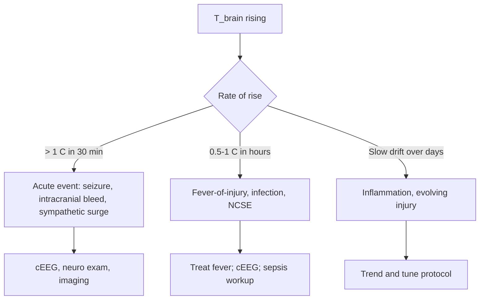

<Callout type="reference">
**Acronyms used on this page**

- **T_brain**: brain temperature (°C, from parenchymal thermistor)
- **T_core**: core temperature (rectal / oesophageal / bladder, °C)
- **T_grad**: brain-core temperature gradient = T_brain − T_core
- **CMRO₂**: cerebral metabolic rate of oxygen
- **CBF**: cerebral blood flow
- **PbtO₂**: brain tissue oxygen tension (often co-located on the same probe)
- **TH / TTM**: therapeutic hypothermia / targeted temperature management
- **HIE**: hypoxic-ischaemic encephalopathy
- **TBI**: traumatic brain injury · **SAH**: subarachnoid haemorrhage
- **PRx**: pressure reactivity index · **CPP / MAP / ICP**: cerebral perfusion / mean arterial / intracranial pressure
- **MMM / MNM**: multimodal monitoring / multimodal neuromonitoring
</Callout>

<TldrCard>
**The 60-second version.** Brain temperature, measured by a parenchymal thermistor (often co-located on a PbtO₂ probe), runs **0.5–2 °C hotter than core** in health, and the gradient widens with injury. CMRO₂ falls about **6–7% per °C** of brain cooling, the rationale for therapeutic hypothermia. Fever (T_brain > 38 °C) in the injured brain is harmful: every additional degree drives CBF demand, raises ICP, worsens autoregulation, and worsens outcomes in TBI, SAH, post-arrest, and HIE. The bedside utility is twofold: (1) **target the brain, not the rectum**, when titrating hypothermia or normothermia in injured patients; (2) **catch the gradient widening** (T_brain rising > 1 °C above core) as an early signal of inflammation, oedema, or impending decompensation. Brain temperature monitoring is invasive, uncommon outside academic neuro-ICUs, and most useful when paired with PbtO₂ on the same probe.
</TldrCard>

## 1. Bedside vignettes: why this matters

### Vignette A. Severe TBI, hidden brain fever

A 9-year-old severe TBI, day 2. Rectal temperature is 36.5 °C, peripheral cooling blanket on. The parenchymal probe reports **T_brain 38.4 °C**, a gradient of nearly 2 °C. ICP has crept from 18 to 24 over the last 4 hours and PRx has drifted positive. The team adds intravascular cooling and acetaminophen; T_brain falls to 36.8 °C over 90 minutes and ICP returns to 17. The core thermometer was missing the fever; brain temperature was the early warning. <Cite id="henker1998" /> <Cite id="polderman2009" />

### Vignette B. Neonatal HIE, the cooling target debate

A 38-week neonate with severe HIE, day 1 of therapeutic hypothermia. The protocol targets **rectal 33.5 °C**. A research arm at the centre has placed an oesophageal thermistor; T_oeso reads 33.2 °C, rectal 33.5 °C. The neonate has no parenchymal brain probe (not standard in neonatal HIE), so brain temperature is inferred. The team accepts the rectal target. The literature on whether brain temperature lags or leads core during cooling and rewarming continues to evolve; **rapid rewarming risks rebound brain hyperthermia** even when core looks controlled. <Cite id="shankaran2005hie_nichd" /> <Cite id="polderman2009" />

### Vignette C. Adolescent SAH, paradoxical cooling response

A 16-year-old aneurysmal SAH, day 6, post-coiling. T_brain 37.2 °C, core 36.6 °C, gradient 0.6 °C, all in the acceptable range. The team initiates aggressive cooling for putative neuroinflammation prevention. T_core falls to 35.5; T_brain falls to **35.3**, a paradoxical inversion. The cooling has been pushed below the autoregulatory comfort zone; ICP has risen 3 mmHg, possibly from shivering-induced increased CMRO₂ or paradoxical cerebral vasodilation. Cooling is paused; sedation and shivering control are tuned; T_brain settles at 36.4 with intact CPP. **Active brain cooling has to be paired with shivering control and a defined endpoint.** <Cite id="andrade2021" /> <Cite id="legriel2016_hyber" />

---

## 2. What brain temperature is, and what it is not

The brain is a high-metabolic-rate organ. **Roughly 20% of resting CMRO₂** is generated in 2% of body mass; the heat output, in a brain not perfectly thermally coupled to systemic circulation, makes the brain run **hotter than the body core**. The gradient is typically **0.5–1 °C in health**, widens to **1–3 °C in injury**, and can reach **4+ °C in severe inflammation or epileptic status**.

```math
\text{CMRO}_2 \approx \text{CBF} \times (\text{CaO}_2 - \text{CjvO}_2)
```

The classic Michenfelder data show CMRO₂ falls **6–7% per °C** of brain cooling in the physiologic range. Brain cooling from 37 °C to 33 °C reduces CMRO₂ by approximately 25%, the rationale for therapeutic hypothermia in HIE and (historically) in severe TBI. <Cite id="bernard2003" /> <Cite id="polderman2009" />

### Where brain temperature comes from

Two sources contribute to brain heat:

1. **Local metabolism**: each gram of cortex generates heat; deep grey matter (basal ganglia, thalamus) is hotter than cortex; white matter is cooler.
2. **Arterial inflow**: blood arrives at core temperature; if blood is cooler than the brain, it cools the brain on transit. Cerebral arteries do not have a counter-current heat exchanger; effective cooling depends on bulk perfusion.

The gradient widens when:

- **CMRO₂ rises** (fever-of-injury, seizure, inflammation)
- **CBF falls** relative to CMRO₂ (low CPP, vasospasm, sympathetic vasoconstriction)
- **Cooling is applied externally**: skin cooling cools blood before it reaches the brain, but at the cost of shivering-induced systemic heat production

### What brain temperature does well

- **The metabolic real-time signal**: rising T_brain in a stable patient is one of the earliest signs of fever-of-injury, neuroinflammation, or seizure.
- **The cooling endpoint**: when therapeutic hypothermia is the management, T_brain is the target organ; core can mislead.
- **The gradient as a marker**: widening T_grad correlates with worse PRx, higher ICP, and worse outcomes in TBI.

### What brain temperature cannot do

- **Be measured non-invasively** in routine practice (research-grade MR thermometry exists but is not bedside).
- **Distinguish causes**: a high T_brain can be fever, seizure, status, inflammation, or sympathetic storm; the value tells you the magnitude, not the cause.
- **Replace systemic temperature measurement**: febrile illness, sepsis, and drug fevers may track core more than brain.
- **Be used in isolation**: brain temperature is a single channel; act on it with the rest of the multimodal stack.

<Pearl>
**Target the brain, not the rectum.** When the question is "is this child febrile in the brain?" the parenchymal thermistor is the answer; core measurements lag and miss the early gradient widening that drives outcomes.
</Pearl>

<Pediatric>
- **Pediatric brain temperature** behaves similarly to adult: the brain is 0.5–2 °C hotter than core in health, the gradient widens with injury, and CMRO₂ falls ~6–7% per °C.
- **Neonatal HIE cooling** is the most common pediatric application but is **not typically measured directly**: brain temperature is inferred from rectal / oesophageal target measurements. Whole-body or selective head cooling targets a rectal or oesophageal temperature, with the brain expected to lag.
- **Pediatric brain temperature monitoring with parenchymal probes** is reserved for severe TBI and selected SAH / post-arrest cases in academic centres. <Cite id="adelson2014pbto2" /> <Cite id="figaji2024_pbto2_peds" />
</Pediatric>

---

## 3. Anatomy and placement

<Figure
  src="/images/brain-temp/brain-core-gradient.svg"
  alt="Brain temperature vs core temperature graph showing 0.5–2 °C gradient widening with injury; placement of parenchymal thermistor with co-located PbtO2"
  caption="Brain temperature runs hotter than core. The healthy gradient is 0.5–1 °C; it widens to 1–3 °C in injury (fever, seizure, inflammation) and can exceed 4 °C in severe states. The bedside thermistor sits on the same probe as PbtO2 (Licox combined probe), placed via a bolt at the same trajectory as ICP / PbtO2 monitoring. The depth of the sensor is ~2–3 cm into white matter, away from the cortical surface."
  attribution="MNM-Edu, original schematic. SVG placeholder."
  label="Fig. 1"
/>

### 3.1 The probe

Most adult and pediatric centres use the **Integra Licox combined probe**: a parenchymal multi-sensor with thermistor and Clark electrode (PbtO₂) on the same shaft. A separate dedicated brain-temperature-only probe is unusual.

- **Sensor depth**: 2–3 cm into white matter, typically pericontusional or at-risk territory in TBI.
- **Bolt fixation**: same bolt as ICP / PbtO₂; trajectory through skull, dura, and into white matter, away from large vessels.
- **Calibration**: factory-calibrated; bedside cross-check against core temperature provides a reasonableness check.

### 3.2 Where to place

The probe samples the parenchyma immediately adjacent to its tip. Placement choice mirrors PbtO₂ decisions:

- **Pericontusional / at-risk territory** in focal TBI.
- **Diffuse-injury midline / frontal white matter** in diffuse TBI.
- **Hemisphere of interest** in SAH (typically the side of greatest perfusion concern).
- **Frontal white matter** as a default in post-arrest and HIE protocols where brain temperature targets are part of management.

### 3.3 Core temperature: the reference

The brain-core gradient requires a reliable core measurement:

| Site | Lag vs brain | Reliability | Notes |
|---|---|---|---|
| Oesophageal | Minimal (< 30 s) | High | Best non-invasive proxy |
| Bladder | Minutes (30–60 s) | High | Affected by urine output |
| Rectal | Minutes (minutes) | Moderate | The cooling-protocol standard for neonates |
| Tympanic | Variable | Low | Operator-dependent; avoid |
| Skin | Hours | Low | Useless for the gradient |

<Pitfall>
**Rectal temperature lags brain temperature by several minutes** during rapid cooling or rewarming. A "core 35.0" reading at the time of rewarming initiation may mean a brain that is already at 36 °C. Oesophageal is the better proxy for rapid changes.
</Pitfall>

---

## 4. The signal: trends and the gradient

T_brain on its own is one number; the **trend** and the **gradient** are where most of the bedside information lives.

### 4.1 Baseline

In a stable, non-injured (or pre-injury) brain, T_brain runs **0.5–1 °C above core**. A patient whose baseline gradient at admission is 1.2 °C should be expected to maintain that gradient throughout the stay; a sudden rise to 2.5 °C is a clinical event.

### 4.2 The dynamic response

Rapid changes (suction, intubation, painful procedures, posture change) produce small (< 0.5 °C) transient changes. **A sustained 1 °C rise over 1–2 hours** without a clear procedural cause is worth investigating: fever-of-injury, seizure, sepsis, intracranial event.

### 4.3 The cooling response

During therapeutic hypothermia (whole-body or head):

1. Skin cooling drops peripheral and then core temperature; brain follows with a 5–15 minute lag depending on CBF.
2. T_brain typically falls to **within 0.5 °C of core** during steady-state cooling (the active CBF cools the brain efficiently).
3. **Rewarming reverses the lag**: brain temperature can briefly **overshoot** core during fast rewarming; slow, controlled rewarming (0.25 °C/h) minimises this.
4. **Shivering raises systemic heat production** by 200–400%; effective cooling depends on shivering control (acetaminophen, magnesium, dexmedetomidine, paralysis as last resort).

---

## 5. The numbers to record: the brain-temperature six-pack

| Variable | Symbol | What it tells you |
|---|---|---|
| Brain temperature | T_brain | Primary; 36.5–37.5 °C normal in non-cooled adult; HIE cooling target 33.5 °C |
| Core temperature | T_core | Required for gradient; oesophageal or rectal |
| Gradient | T_grad = T_brain − T_core | 0.5–1 °C health; > 2 °C concerning |
| Hourly trend | ΔT_brain/h | Sustained > 1 °C/h flag |
| Sedation, paralysis, shivering control | Documented | Required to interpret cooling response |
| CMRO₂ context (sedation, seizure, fever-of-injury) | Documented | High CMRO₂ raises T_brain independent of fever |

---

## 6. What is normal? Age-banded reference

| Age band | Typical T_brain (°C) | T_grad (°C) | Notes |
|---|---|---|---|
| Term neonate | 36.5–37.5 (non-cooled) | 0.3–0.8 | Cooling target 33.5 °C (rectal) |
| 1–24 months | 36.5–37.5 | 0.5–1.0 | Direct measurement uncommon |
| 2–10 years | 36.5–37.5 | 0.5–1.0 | Direct measurement uncommon |
| Adolescent | 36.5–37.5 | 0.5–1.0 | Adult-like |
| Adult | 36.5–37.5 | 0.5–1.0 | Original reference range |
| Severe TBI (24–72 h) | 37.5–38.5 | 1.0–2.0 | Fever-of-injury common |
| Post-arrest (24–48 h) | 36.0–38.0 | 0.5–2.0 | TTM dependent |
| Status epilepticus | up to 40+ | up to 3+ | Seizure-driven CMRO₂ surge |

Sources: <Cite id="henker1998" /> <Cite id="polderman2009" /> <Cite id="andrade2021" />. Pediatric direct brain-temperature data are limited; the values above are extrapolated from adult parenchymal-probe series.

---

## 7. What is abnormal? Pattern library

| Pattern | Bedside meaning | What to do |
|---|---|---|
| **T_brain 38.0–38.5 °C, T_grad > 1.5 °C** | Brain fever exceeding core; early inflammation, fever-of-injury, undeclared seizure | Treat the fever (acetaminophen, cooling); look for seizure (cEEG), sepsis source |
| **T_brain > 39 °C** | Severe hyperthermia; CMRO₂ surge | Treat aggressively; check for status, sympathetic storm; cool to normothermia |
| **T_brain stable 36.5–37.5 °C, T_core matching** | Normal | Continue monitoring; trend the gradient |
| **T_brain falling > 1 °C/h during rewarming** | Reverse-gradient rebound | Slow rewarming; recheck CPP and ICP |
| **T_brain rising > 1 °C in 30 min** | Acute event; possible seizure, sympathetic surge, intracranial event | cEEG, neuro exam, imaging if persistent |
| **T_brain < target during hypothermia** | Over-cooled brain; risk of bradycardia, coagulopathy | Slow active cooling; raise target |
| **T_brain not falling during cooling protocol** | Shivering, inadequate cooling delivery, high CMRO₂ | Add shivering control; check cooling device function; treat seizure / sepsis |
| **T_brain inverted (< T_core)** | Rare; suggests cooling-blanket contamination of sensor, or paradoxical cerebral vasodilation | Recheck sensor; reassess protocol |

### Decision tree: rising brain temperature



---

## 8. Try it: interactive widget

<WidgetEmbed name="BrainTempDemo" />

---

## 9. Management: temperature targeting and shivering control

### 9.1 Targeted normothermia in severe TBI

The 2019 BTF pediatric guidelines recommend **avoidance of hyperthermia** (T > 38 °C) in severe TBI; T_brain monitoring, where available, identifies brain fever before it shows up in the rectal trace. <Cite id="kochanek2019_pbtf4" />

1. Target T_brain 36.5–37.5 °C.
2. Treat any T_brain ≥ 38.0 °C with acetaminophen and surface cooling.
3. Identify and treat sources: NCSE (cEEG), infection (cultures), sympathetic storm (sedation, alpha-2 agonist).
4. Maintain shivering control: low-dose meperidine, magnesium, acetaminophen, dexmedetomidine; paralysis as last resort.
5. Document brain fever burden (degree-hours > 38 °C) as a covariate for outcome.

### 9.2 Therapeutic hypothermia for neonatal HIE

The NICHD whole-body cooling protocol (and the CoolCap selective head cooling protocol) target **rectal 33.5 °C for 72 hours**, started within 6 hours of birth, with rewarming at **0.25–0.5 °C/h**. Direct brain temperature monitoring is **not** standard in this protocol; the brain is expected to lag the core by < 0.5 °C in steady-state cooling. <Cite id="shankaran2005hie_nichd" /> <Cite id="pressler2017neonatal" />

### 9.3 Targeted temperature management after pediatric cardiac arrest

The THAPCA trials and AHA 2021 pediatric guidelines support either **targeted hypothermia (33 °C) or targeted normothermia (36.5 °C)** for 48 hours, depending on the protocol. **Avoidance of fever** is the consistent recommendation. T_brain monitoring is research-grade in this setting; bedside management uses core targets. <Cite id="moler2015thapca_oh" /> <Cite id="topjian2021aha_pediatric" />

### 9.4 Shivering control during cooling

Shivering raises systemic heat production by 200–400% and raises CMRO₂; it defeats cooling and worsens cerebral oxygenation. The Columbia Shivering Scale and the bedside shivering management ladder:

1. **Acetaminophen** 15 mg/kg PO/PR q6h baseline.
2. **Magnesium** 0.5–1 mmol/L target.
3. **Surface counter-warming** (hand and foot warming) to dampen the thermoregulatory drive.
4. **Dexmedetomidine** infusion (0.2–1 µg/kg/h).
5. **Meperidine** (small dose, careful in pediatrics).
6. **Paralysis** (cisatracurium) as last resort, with cEEG to confirm seizure suppression.

<Callout type="caveat">
**Decision support, not a clinical protocol.** Every target above is age-, protocol-, and centre-dependent. Defer to your unit's TTM, HIE, and pediatric TBI protocols and the relevant guideline sets (BTF, AHA, NICHD).
</Callout>

<AlgorithmDisclaimer />

---

## 10. Clinical contexts

### 10.1 Severe TBI

Brain fever (T_brain > 38 °C) is independently associated with worse outcomes in pediatric and adult TBI. T_brain monitoring identifies the fever before it shows up in core measurements; the gradient widening correlates with PRx worsening and ICP rise. The BTF 4th edition recommends fever avoidance; T_brain provides the most sensitive bedside read. <Cite id="kochanek2019_pbtf4" /> <Cite id="chesnut2012best" /> <Cite id="hawthorne2014icp" />

### 10.2 Aneurysmal SAH and DCI

Fever in SAH is associated with worse outcomes and with DCI; targeted normothermia is part of modern SAH care. T_brain monitoring, when a parenchymal probe is in place, identifies brain fever early. The relationship between brain fever and DCI is partly mediated by inflammation, partly by direct CMRO₂ effect. <Cite id="hoh2023sah_aha" /> <Cite id="rass2021dci_review" />

### 10.3 HIE and therapeutic hypothermia

The single most evidence-rich application of temperature management in pediatrics. Whole-body cooling (NICHD) and selective head cooling (CoolCap) both improve neurodevelopmental outcome in moderate-to-severe HIE. Direct brain-temperature monitoring is not standard; the brain is expected to lag the core by < 0.5 °C in steady state. **Rewarming hyperthermia** (rebound brain fever) is a recognised hazard; slow controlled rewarming mitigates. <Cite id="shankaran2005hie_nichd" /> <Cite id="pressler2017neonatal" /> <Cite id="polderman2009" />

### 10.4 Post-cardiac arrest pediatric

THAPCA-IH and THAPCA-OH compared hypothermia (33 °C) versus normothermia (36.5 °C) for 48 h post-arrest in pediatric patients; neither showed superiority, but both ruled out harm. The current AHA pediatric recommendation is for **either targeted hypothermia or targeted normothermia**, with active **avoidance of fever**. T_brain monitoring is research-grade. <Cite id="moler2015thapca_oh" /> <Cite id="topjian2021aha_pediatric" /> <Cite id="naim2023_brain_injury_pccm" />

### 10.5 Pediatric ECMO

Mild systemic hypothermia is used in some centres during the early cannulation phase; brain temperature is generally not directly monitored. NIRS rSO₂ and aEEG provide the bedside neuromonitoring; temperature is one of the modifiable parameters. <Cite id="lorusso2017_elso_neuro" />

### 10.6 Bacterial meningitis and severe encephalitis

Fever is the dominant clinical feature; central temperature dysregulation may persist after the infection is controlled. T_brain monitoring is uncommon. The decision to use therapeutic hypothermia in severe bacterial meningitis was tested in adult trials (no benefit, some harm) and is **not recommended**. <Cite id="tunkel2004_idsa_meningitis" /> <Cite id="tunkel2017idsa_encephalitis" /> <Cite id="brouwer2010_dexamethasone_meta" />

### 10.7 Refractory status epilepticus

Seizure-driven CMRO₂ surge raises T_brain, sometimes above 39–40 °C. Cooling for refractory status epilepticus (the HYBERNATUS trial in adults) did not improve outcome and may worsen it; the current pediatric approach is to **treat the seizures, treat the fever**, but not cool below normothermia for SE per se. <Cite id="legriel2016_hyber" /> <Cite id="glauser2016esett" /> <Cite id="kapur2019eclipse_se" />

### 10.8 Brain-death determination (supportive)

A dead brain does not generate heat; T_brain falls toward core in established brain death. This is a **supportive** observation, not part of the formal World Brain Death Project diagnostic test. <Cite id="greer2020_braindeath" /> <Cite id="nakagawa2011peds_bd" />

### 10.9 DKA cerebral oedema

Temperature monitoring is part of routine care; T_brain monitoring is not standard in DKA. Pediatric DKA cerebral oedema management focuses on careful fluid management and treatment of raised ICP; hypothermia is not part of the management algorithm. <Cite id="glaser2001" /> <Cite id="muir2004" /> <Cite id="kuppermann2018_pecarn_dka" /> <Cite id="glaser2024_dka_review" />

---

## 11. Multimodal integration: brain temperature in the MMM/MNM stack

<Figure
  src="/images/brain-temp/brain-core-gradient.svg"
  alt="Brain temperature in multimodal context"
  caption="Brain temperature is most informative when paired with PbtO2 (often on the same probe), ICP / CPP / PRx (where fever drives ICP rise and autoregulatory loss), and cEEG (where rising T_brain may signal undeclared NCSE). NIRS rSO2 changes with brain temperature via CMRO2 coupling. The clinical decision often hinges on the combined trend rather than the single value."
  attribution="MNM-Edu, original schematic. SVG placeholder."
  label="Fig. 2"
/>

| Pair with… | What you gain | Worked scenario |
|---|---|---|
| **PbtO₂** | Co-located on the same probe; CMRO₂ effect of cooling on tissue O₂ tension | [PbtO₂-CPP titration](/integration/pbto2-cpp-titration/) |
| **ICP / CPP / PRx** | Fever-driven ICP rise; cooling effect on autoregulation | [CPPopt targeting](/integration/cppopt-targeting/) |
| **cEEG / aEEG** | Detect NCSE as a cause of rising T_brain; cooling-induced electrographic changes | [Refractory status epilepticus](/integration/refractory-status-epilepticus/) |
| **NIRS / rSO₂** | Cooling-induced CMRO₂ reduction shows up in rSO₂ rise | [HIE monitoring bundle](/integration/mnm-in-the-newborn/) |
| **SjvO₂** | Cooling-induced global CMRO₂ reduction raises SjvO₂ predictably | [PbtO₂-CPP titration](/integration/pbto2-cpp-titration/) |
| **Microdialysis** | Cooling-induced metabolic shift in L/P ratio | [Multimodal discordance](/integration/discordance-triage/) |

<Cite id="figaji2025_mmm_pediatric_consensus" /> <Cite id="helbok2024_pediatric_mmm" /> <Cite id="tasker2023mnm" />

---

<DeepDive>

## 12. Setup and technique

### 12.1 Equipment

- **Combined probe**: Integra Licox PMO (PbtO₂ + thermistor) or Raumedic Neurovent-PTO. The thermistor is on the same shaft as the PbtO₂ Clark electrode.
- **Bolt**: 1-bolt or 2-bolt cranial access with a multi-channel adapter.
- **Cable and monitor**: Licox CMP, Hemedex, or integrated multimodal unit (Moberg, ICM+).
- **Core temperature device**: oesophageal probe is the preferred reference; rectal acceptable.

### 12.2 Placement: 6-step protocol

1. **Pre-procedure imaging review**: identify the target territory (pericontusional in focal TBI; frontal white matter in diffuse injury).
2. **Bolt placement** under sterile technique; same trajectory as ICP / PbtO₂.
3. **Advance the combined probe** 2–3 cm into white matter; secure at the bolt.
4. **Allow 60–90 minutes equilibration**: PbtO₂ shows transient elevation; thermistor stabilises faster.
5. **Verify position on post-procedure CT**: avoid vessels, avoid CSF spaces, avoid eloquent cortex.
6. **Begin recording**: continuous T_brain trace; pair with core measurement.

### 12.3 Calibration and cross-checks

- **Factory calibration** of the thermistor is generally accurate to ± 0.2 °C.
- **Cross-check** against core within 1 hour: gradient should be in the expected 0.5–1.5 °C range for an injured but stable brain.
- **A reverse gradient** (T_brain < T_core) suggests sensor migration into a CSF space or a faulty sensor; recheck and reposition.

### 12.4 Daily routine

- **Document** T_brain, T_core, and T_grad every hour.
- **Trend** the gradient: a widening gradient over 6 hours is a clinical event.
- **Annotate** all temperature-modifying interventions: acetaminophen, cooling blanket, surface or intravascular cooling device changes, paralysis.
- **Pair with cEEG** at every concerning rise to rule out NCSE.

### 12.5 During active cooling

- **Set the cooling endpoint at the brain**, not the core, when T_brain is available.
- **Watch for rebound brain hyperthermia** during rewarming; slow the rewarming rate to 0.25 °C/h.
- **Maintain shivering control**: shivering destroys cooling efficacy and raises CMRO₂.
- **Document** the achieved T_brain (mean, range, time at target) for the protocol-mandated duration.

### 12.6 Removal

The probe is removed when monitoring is no longer required, typically at the same time as ICP and PbtO₂ are de-monitored. Complications are rare and similar to ICP/PbtO₂ probes (small haemorrhage, infection, malposition).

</DeepDive>

---

## 13. Pitfalls

- **Rectal lag**: rectal temperature lags brain by minutes during rapid changes; oesophageal is the better reference for dynamic measurements.
- **Tympanic and skin temperatures are not core**: do not use as reference.
- **Sensor migration into CSF** produces a falsely low T_brain (CSF is cooler than parenchyma); reposition.
- **Shivering during cooling** raises systemic heat production and defeats cooling; address proactively.
- **Rewarming hyperthermia**: brain may overshoot core during fast rewarming; slow controlled rewarming (0.25 °C/h) is the rule.
- **Confounding by sedation**: deep sedation lowers CMRO₂ and slightly lowers T_brain; wake-up tests show transient rise.
- **Confounding by paralysis**: paralysis eliminates shivering heat production but does not directly cool the brain; cooling delivery still must work.
- **Single-point measurement**: T_brain reflects the parenchyma at the probe tip only; remote areas (especially deep grey matter) can run hotter.
- **Drug-induced fevers** (anticonvulsants, anaesthetics, drug-related malignant hyperthermia) raise both core and brain.
- **Infection masquerade**: brain fever-of-injury can mimic systemic infection; the gradient pattern can help distinguish but cultures and clinical context are required.

---

## 14. Combine with…

- [PbtO₂](/modalities/pbto2/): the most common co-located measurement.
- [ICP / CPP](/modalities/icp/): fever drives ICP; cooling is one knob.
- [cEEG / aEEG](/modalities/eeg/): NCSE is a common cause of rising T_brain.
- [NIRS](/modalities/nirs/): CMRO₂ effects of cooling.
- [SjvO₂](/modalities/sjvo2/): global O₂ extraction during cooling.
- [Foundations: cerebral metabolism](/foundations/cerebral-metabolism/): the CMRO₂-temperature curve.
- [Integration: HIE monitoring bundle](/integration/mnm-in-the-newborn/): neonatal cooling protocol.
- [Integration: refractory status epilepticus](/integration/refractory-status-epilepticus/): seizure-driven brain fever.

---

<DeepDive>

## 15. Evidence summary

| Topic | Source | Grade |
|---|---|---|
| Brain-core gradient and CMRO₂-temperature physiology | <Cite id="henker1998" /> | foundational |
| TTM modern review | <Cite id="polderman2009" /> | review |
| HACA / Bernard adult TTM | <Cite id="bernard2003" /> | A |
| NICHD HIE whole-body cooling | <Cite id="shankaran2005hie_nichd" /> | A |
| THAPCA-OH pediatric | <Cite id="moler2015thapca_oh" /> | A |
| AHA pediatric post-arrest | <Cite id="topjian2021aha_pediatric" /> | expert |
| HYBERNATUS (cooling for SE) | <Cite id="legriel2016_hyber" /> | A |
| Pediatric severe TBI (BTF 4th ed.) | <Cite id="kochanek2019_pbtf4" /> | expert |
| Pediatric neurocritical care review | <Cite id="tasker2023_pccm_review" /> | review |
| Pediatric brain injury post-arrest | <Cite id="naim2023_brain_injury_pccm" /> | review |
| Neonatal HIE ILAE seizures | <Cite id="pressler2017neonatal" /> | expert |
| Brain temperature contemporary review | <Cite id="andrade2021" /> | review |
| Pediatric MMM consensus | <Cite id="figaji2025_mmm_pediatric_consensus" /> <Cite id="helbok2024_pediatric_mmm" /> <Cite id="tasker2023mnm" /> | expert |
| BOOST-II / BOOST-III (co-located PbtO₂) | <Cite id="okonkwo2017_boost2" /> <Cite id="bernard2025_boost3" /> | A |
| Pediatric PbtO₂ | <Cite id="adelson2014pbto2" /> <Cite id="figaji2024_pbto2_peds" /> | B/C |
| Brain-death determination | <Cite id="greer2020_braindeath" /> <Cite id="nakagawa2011peds_bd" /> | expert |

## 16. Recent literature (2022–2025)

- **Andrade 2021 (review)**: synthesises brain temperature physiology, measurement, and clinical implications across TBI, post-arrest, and HIE. <Cite id="andrade2021" />
- **Tasker 2023 (pediatric neurocritical care review)**: places brain temperature monitoring as a tier-2 modality in centres with parenchymal probes; the gradient is the bedside read. <Cite id="tasker2023_pccm_review" />
- **Naim 2023 (pediatric brain injury post-arrest)**: integrates temperature management into the post-arrest multimodal monitoring stack. <Cite id="naim2023_brain_injury_pccm" />
- **AHA 2021 pediatric** continues to recommend targeted temperature management (33 or 36.5 °C) for 48 h with active fever avoidance through 5 days post-arrest. <Cite id="topjian2021aha_pediatric" />
- **BOOST-III adult (Bernard 2025)**: PbtO₂-guided care includes brain temperature on the same probe; the combined read informs treatment. <Cite id="bernard2025_boost3" />
- **HIE 72-h cooling** continues to be standard for moderate-to-severe HIE; selective brain cooling vs whole-body cooling debate is largely settled in favour of whole-body. <Cite id="shankaran2005hie_nichd" />

</DeepDive>

---

## 17. Self-check

<Quiz
  questions={[
    {
      id: 'q1',
      prompt: 'A 9-year-old severe TBI on day 2. Rectal temperature 36.5 °C, surface cooling blanket active. Parenchymal T_brain reads 38.4 °C. ICP has risen from 18 to 24 over 4 hours and PRx has drifted positive. Best next step?',
      options: [
        { id: 'a', label: 'Continue current management; the rectal temperature is in range' },
        { id: 'b', label: 'Treat the brain fever (acetaminophen, intravascular cooling, identify cause); cEEG to rule out NCSE' },
        { id: 'c', label: 'Increase the cooling blanket only' },
        { id: 'd', label: 'Wean sedation to assess clinical exam' },
      ],
      answer: 'b',
      explanation: 'Brain temperature exceeds core by nearly 2 °C, the brain is febrile, and ICP and PRx are responding. The rectal temperature is misleading the team; target the brain. Treat the fever, identify the cause (NCSE on cEEG, infection, sympathetic storm), and provide effective brain-targeted cooling (often intravascular, which is more efficient than surface). Weaning sedation here would worsen the situation.',
    },
    {
      id: 'q2',
      prompt: 'A 38-week neonate undergoing whole-body cooling for severe HIE, rectal target 33.5 °C. At 70 hours into the protocol, the team plans to begin rewarming. What is the recommended rewarming rate to minimise rebound brain hyperthermia?',
      options: [
        { id: 'a', label: 'As fast as possible, 1 °C every 30 minutes' },
        { id: 'b', label: '0.25–0.5 °C per hour, with active monitoring of CPP and ICP' },
        { id: 'c', label: '0.5 °C per minute' },
        { id: 'd', label: 'Switch off cooling and let the patient passively rewarm' },
      ],
      answer: 'b',
      explanation: 'Slow, controlled rewarming at 0.25–0.5 °C/h is the recommended protocol. Fast rewarming risks rebound brain hyperthermia (brain may transiently overshoot core temperature), increased CMRO₂, and worsened cerebral oxygenation. Passive rewarming is too slow and unpredictable. CPP and ICP should be tracked during rewarming because cerebrovascular responses can change as temperature returns to baseline.',
    },
    {
      id: 'q3',
      prompt: 'A 16-year-old in refractory convulsive status, BIS-suppressed on a midazolam infusion. T_brain reads 39.8 °C, core 38.9 °C, T_grad 0.9 °C. cEEG shows ongoing electrographic seizures despite clinical motor cessation. Most appropriate response?',
      options: [
        { id: 'a', label: 'Initiate therapeutic hypothermia targeted to 33 °C; cool the brain to suppress seizures' },
        { id: 'b', label: 'Escalate antiepileptic therapy to control electrographic seizures; treat the fever toward normothermia; do not cool below normothermia for SE per se' },
        { id: 'c', label: 'Increase midazolam only' },
        { id: 'd', label: 'Accept the fever; SE-related fever is benign' },
      ],
      answer: 'b',
      explanation: 'The HYBERNATUS trial showed that adding therapeutic hypothermia (33 °C) to standard care for convulsive SE did not improve outcomes and may have worsened them. The correct response is to control the electrographic seizures (escalate to third-line therapy if needed) and to treat the fever toward normothermia (acetaminophen, normothermic cooling); do not cool below normothermia for SE per se. SE-driven hyperthermia is not benign and contributes to neuronal injury, so it must be treated.',
    },
  ]}
/>
