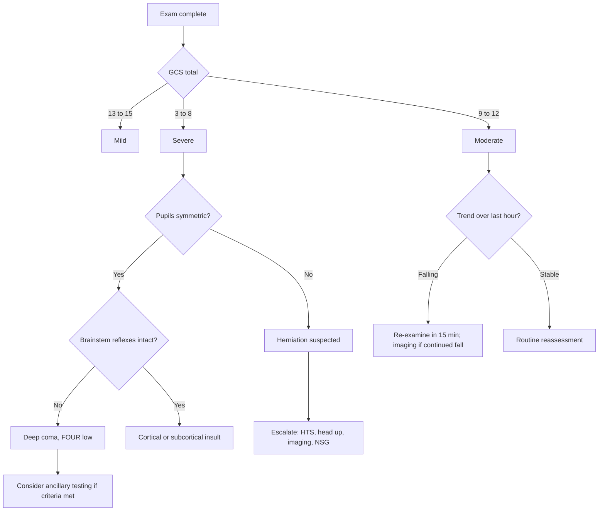

<Callout type="reference">
**Acronyms used on this page**

- **GCS**: Glasgow Coma Scale (Teasdale & Jennett, 1974)
- **pGCS**: pediatric GCS (verbal-component adapted for pre-verbal children)
- **Adelaide**: Adelaide Coma Scale, pediatric GCS variant
- **FOUR**: Full Outline of UnResponsiveness score (Wijdicks 2005)
- **mGCS**: motor component of GCS (used alone in some triage scores)
- **NPi**: Neurological Pupil index (quantitative pupillometry derivative)
- **TBI**: traumatic brain injury
- **HIE**: hypoxic-ischaemic encephalopathy
- **NCSE**: non-convulsive status epilepticus
- **WLST**: withdrawal of life-sustaining therapy
- **ICP / CPP / MAP**: intracranial / cerebral perfusion / mean arterial pressure
- **PERRLA**: pupils equal, round, reactive to light and accommodation
- **MMM / MNM**: multimodal monitoring / multimodal neuromonitoring
</Callout>

<TldrCard>
**The 60-second version.** The neurological exam is the only modality available in every age, every language, and every centre on earth, with no calibration. It is also the modality whose inter-rater reliability is honestly known to be moderate. The Glasgow Coma Scale (GCS) gives a numeric handle on arousal, verbal content, and motor output; the FOUR score adds brainstem reflexes and respiratory pattern, and is the score of choice in the intubated patient where the verbal component of GCS is uninterpretable. Pediatric verbal adaptations (pGCS, Adelaide) exist for pre-verbal children. **Document the components, not just the sum**, and trend serial exams: a single GCS 13 in a stable patient is reassurance; a GCS that fell from 15 to 13 over an hour is an emergency.
</TldrCard>

## 1. Bedside vignettes: why this matters in the PICU

### Vignette A. The 6-year-old after the MVC

A 6-year-old arrives in resus 40 minutes after an unrestrained MVC. ETT in place, in-line stabilisation. On your first look he opens his eyes briefly to a sternal rub (E2), the ETT precludes a verbal score so you record V1T, and he localises with the left arm but extends with the right (M5 best). **GCS = 8T.** You also examine FOUR: eye 2 (open to pain only), motor 4 (localising left), brainstem 3 (right pupil 5 mm sluggish, left 3 mm brisk; corneals intact), respiration 1 (breathes above the vent rate set by the ventilator). **FOUR = 10.** The right-sided anisocoria and the right-arm extension drive the next 60 seconds: hypertonic saline, head up, CT scanner now. <Cite id="teasdale1974" /> <Cite id="wijdicks2005" /> <Cite id="cohen2009four" />

### Vignette B. The 6-month-old with bulging fontanelle

A 6-month-old infant is brought in floppy and lethargic after 18 hours of vomiting. The fontanelle is full but not tense. She opens her eyes to your voice (E3), cries inconsolably when handled but the cry has no consonants and is not directed at her mother (V3 on pGCS), and withdraws her arm from a heel-stick (M4). **pGCS = 10.** The pupils are 4 mm and brisk bilaterally. You document the exam, alert the surgical team that you may need a fontanelle ultrasound and a CT, and place a peripheral line for fluids while you decide on imaging. The verbal score in a pre-verbal child is the part that catches people out: a 6-month-old never scores V5; the highest possible V on the pGCS is 5 for "coos, babbles, smiles." <Cite id="reith2016gcsreliability" />

### Vignette C. The post-arrest adolescent at 72 hours

A 14-year-old is on day 3 after an unwitnessed out-of-hospital cardiac arrest; rewarmed, sedation off for 8 hours. He does not open his eyes to noxious stimulation (E1), is intubated (V1T), and shows extensor posturing to deep nailbed pressure bilaterally (M2). **GCS = 4T.** FOUR: eye 0, motor 1, brainstem 0 (both pupils 6 mm and non-reactive, no corneals, no cough on suction), respiration 0 (no spontaneous breaths above the vent). **FOUR = 1.** This is the case where the FOUR score does the work the GCS cannot: brainstem and respiratory function are quantified, and the floor (FOUR 0) is the only structured exam score that can predict in-hospital mortality with high specificity in comatose adults and is being validated in pediatrics. <Cite id="cohen2015" /> <Cite id="jamal2017four" />

---

## 2. What the exam is, and what it is not

The clinical neurological exam samples *behavioural* responses to structured stimuli. It is not a measurement of brain activity, of perfusion, or of metabolism. It is a probe of integrated function across the level of the brainstem reticular activating system, the cortex, and the descending motor pathways.

Three things to keep in mind every time you examine.

**Arousal is brainstem, content is cortex.** A patient with eyes open and no command-following has an intact reticular activating system but absent or disconnected cortex. A patient with eyes closed who follows commands when you ask does not exist; if you encounter it, suspect locked-in or psychogenic unresponsiveness and look harder.

**Best response, not worst response.** GCS, FOUR, and pGCS all score the *best* response in each domain across the exam. A child who localises with one arm and extends with the other scores M5 (localises), not M2 (extends). Asymmetry is documented separately as a focal finding.

**Serial exams trump single exams.** The single most important variable on this page is the *trend*. A GCS that has fallen from 15 to 13 over an hour is an emergency, regardless of the absolute value. A GCS that has been 10 for 8 hours in a sedated post-operative child is a different clinical situation.

<Pearl>
**Document the components, not just the sum.** "GCS 9 (E2 V2 M5)" tells a story; "GCS 9" does not. The same total can hide very different patients: M5 with V2 (motor preserved, language affected) suggests cortical dysfunction; M2 with V4 (preserved verbal, extensor posturing) suggests a brainstem-sparing motor lesion.
</Pearl>

<Pediatric>
**The verbal component is the part that goes wrong in children.** Pre-verbal infants cannot say words, so the adult V5 ("oriented") becomes "coos, babbles, smiles." Use the pGCS verbal scale below for children under 2 years; either pGCS or adult GCS verbal works for children 2 to 5 years; adult GCS verbal applies from school age. The Adelaide Coma Scale is an older alternative, mostly used in Australia and New Zealand. <Cite id="reith2016gcsreliability" />
</Pediatric>

---

## 3. The scales: GCS, pGCS, FOUR, mGCS

<Figure
  src="/images/clinical-exam/gcs-vs-four.svg"
  alt="GCS and FOUR score components side by side, with pediatric verbal adaptation in a callout"
  caption="The Glasgow Coma Scale samples three domains (eye opening, verbal response, motor response) and sums to 3 to 15. The FOUR score samples four domains (eye response, motor response, brainstem reflexes, respiratory pattern) and each scores 0 to 4 for a total of 0 to 16. Note that GCS and FOUR floors differ: GCS has a minimum of 3, FOUR a minimum of 0. The pediatric GCS verbal scale is on the right: the infant V5 is 'coos, babbles, smiles' rather than 'oriented'."
  attribution="MNM-Edu, original schematic. SVG placeholder."
  label="Fig. 1"
/>

### 3.1 Glasgow Coma Scale

The original 1974 Teasdale and Jennett scale. Eye, verbal, motor; minimum 3, maximum 15. <Cite id="teasdale1974" />

| Domain | Score | Description |
|---|---|---|
| Eye opening (E) | 4 / 3 / 2 / 1 | Spontaneous / to voice / to pain / none |
| Verbal response (V) | 5 / 4 / 3 / 2 / 1 / T | Oriented / confused / inappropriate words / incomprehensible sounds / none / intubated |
| Motor response (M) | 6 / 5 / 4 / 3 / 2 / 1 | Obeys commands / localises / withdraws / abnormal flexion / extension / none |

**Operational tips.**

- If the patient is intubated, score V as 1T and report the total with the "T" suffix, e.g., "GCS 8T."
- "Localises" (M5) means the limb crosses the midline or moves above the clavicle to remove the stimulus. Simple withdrawal of the limb on the same side as the stimulus is M4.
- Sternal rub is uncomfortable and bruises; supraorbital or nailbed pressure is preferred in most modern units, especially in children.
- Score the *best* response across the limbs; document asymmetry separately.

### 3.2 Pediatric GCS

Same E and M scales; V scale adapted for the pre-verbal child. <Cite id="reith2016gcsreliability" />

| Verbal (pGCS, < 2 y) | Score | Description |
|---|---|---|
| 5 | Coos, babbles, smiles | The healthy infant baseline |
| 4 | Cries but consolable | Distressed but engages with caregiver |
| 3 | Persistently inconsolable cries | Cries through soothing |
| 2 | Moans, restless, agitated | No directed crying |
| 1 | None | No vocalisation |

Children aged 2 to 5 can be scored on either scale depending on developmental expectations; school-age children use the adult scale. The Adelaide Coma Scale uses 14 points instead of 15 (it removed the adult "confused" score) and is largely historical. <Cite id="alkhachroum2024gcslimits" />

### 3.3 FOUR score

Wijdicks 2005 four-domain alternative. Each domain 0 to 4; total 0 to 16. Designed for the intubated, sedated, or aphasic patient where the GCS verbal component is uninterpretable. <Cite id="wijdicks2005" /> <Cite id="wijdicks2006" />

| Domain | 4 | 3 | 2 | 1 | 0 |
|---|---|---|---|---|---|
| Eye (E) | Eyelids open, tracking, blinks to command | Eyelids open, no tracking | Eyelids closed, open to voice | Open to pain | Remain closed |
| Motor (M) | Thumbs up, fist, peace sign on command | Localising to pain | Flexion to pain | Extension to pain | None or generalised myoclonus |
| Brainstem (B) | Pupils + corneals present | One pupil dilated and fixed | Pupil OR corneal absent | Pupil AND corneal absent | Absent pupil, corneal, AND cough |
| Respiration (R) | Not intubated, regular | Not intubated, Cheyne-Stokes | Not intubated, irregular | Triggers above vent rate | Apnoeic OR vent-rate only |

**Why FOUR is the right score for the ICU.** Three reasons. First, it scores brainstem reflexes (pupil, corneal, cough), which GCS does not, and the brainstem is the most prognostically relevant compartment in many comatose patients. Second, the respiratory domain distinguishes the patient who is triggering the vent from the patient who is not, which matters for sedation titration and weaning. Third, the floor (FOUR 0) maps to absent brainstem function, the bedside surrogate for the imminent need for ancillary brain-death testing. <Cite id="cohen2009four" /> <Cite id="jamal2017four" />

### 3.4 The motor component alone (mGCS)

In many trauma triage scores (the Simplified Motor Score, the Reduced Motor Score), the motor component of GCS is used alone. The reasoning: it is the most prognostically informative single component and the most reliable across raters. It is *not* a replacement for the full GCS in the ICU, but it is a useful single-number proxy when full scoring is impractical. <Cite id="reith2016gcsreliability" />

<Pitfall>
**A patient who is paralysed or deeply sedated has an artificially low GCS.** Do not score immediately after a paralytic bolus, immediately after a propofol push, or while the patient is on a continuous infusion you intend to interrupt. Where possible, score during a daily sedation hold. If sedation cannot be interrupted (e.g., refractory raised ICP), document "GCS unable, paralysed and sedated" and use brainstem reflexes (FOUR brainstem domain) for serial assessment.
</Pitfall>

---

## 4. The pupillary exam

Pupils are the most-watched data point on the bedside chart, and the most-misread.

| What you check | Normal | Abnormal pattern | Mechanism |
|---|---|---|---|
| Size (mm, each side) | 2 to 5 mm in ambient light | Unilateral &gt; 5 mm and fixed | Ipsilateral CN III compression (uncal herniation) |
| Symmetry | within 1 mm | &gt; 1 mm difference (anisocoria) | Compression vs benign physiological (~20% of healthy patients have &lt; 1 mm) |
| Light reaction | Brisk constriction to bright light, both direct and consensual | Sluggish or absent | Anywhere in the afferent (CN II) or efferent (parasympathetic CN III) limb |
| Shape | Round | Oval, irregular | Surgical (post-op iris), structural (raised ICP with early CN III compression) |
| Accommodation | Constricts to near vision | Lost | Less useful in ICU; reserve for cortical-blindness workup |

**The first-look sequence.** Stand at the foot of the bed. Ambient light. Estimate sizes to the nearest 0.5 mm. Then darken the room briefly (or shield with your hand) and time the dilation in seconds. Then bright-light each side directly with a pen-torch, note the brisk constriction, and check the consensual response on the opposite side.

**What anisocoria really means.** True new-onset anisocoria > 1 mm in a sleepy patient with a head injury is structural until proven otherwise: it is the bedside signature of uncal herniation against the third nerve and requires immediate escalation. Pre-existing anisocoria (Adie's pupil, congenital, post-surgical iris) is benign but should be documented on admission. Pharmacological causes (atropine, scopolamine patch, nebulised ipratropium aerosol drifting into one eye) are common and reversible.

<Pearl>
**Quantitative pupillometry (NPi) is the modern complement to the clinical pupillary exam.** Where the bedside Marshall pen-torch gives you "brisk / sluggish / fixed" with moderate inter-rater agreement, the pupillometer returns a continuous Neurological Pupil index (NPi) from 0 to 5 and reduces inter-observer variability to near zero. <Cite id="oddo2018_npi_orange" /> <Cite id="olson2016npi" />
</Pearl>

See the dedicated [pupillometry page](/modalities/pupillometry/) for NPi, constriction velocity, and the ORANGE multicentre data.

---

## 5. Brainstem reflex ladder

In order from rostral to caudal. Each reflex tests a specific brainstem level.

| Reflex | Tests | Test method | Brainstem level |
|---|---|---|---|
| Pupillary light | CN II in, CN III out (Edinger-Westphal nucleus) | Bright-light each eye, time direct and consensual constriction | Midbrain |
| Corneal | CN V in, CN VII out | Cotton-wisp or sterile saline drop on the cornea, watch for blink | Pons (upper) |
| Oculocephalic ("doll's eyes") | Vestibular nuclei in, CN III/VI out | Rotate the head briskly side-to-side, eyes should deviate opposite to head | Pons (lower) |
| Oculovestibular ("cold caloric") | CN VIII in, CN III/VI out | 50 mL ice water in the auditory canal (head 30°), eyes should tonically deviate toward the cold ear | Pons / medulla |
| Gag | CN IX in, CN X out | Touch the posterior pharyngeal wall with a tongue depressor | Medulla |
| Cough | CN X | Suction at the carina via the ETT | Medulla |

**Order of loss in rostral-caudal deterioration.** Pupillary first (midbrain), then corneal (upper pons), then oculovestibular (lower pons), then gag and cough (medulla). The loss of the cough reflex on tracheal suction in a patient who had it yesterday is a late but ominous sign.

<Pitfall>
**Never test oculocephalic reflex in a patient with a possible cervical-spine injury.** And never perform cold caloric testing in a patient with a perforated tympanic membrane. The oculovestibular test also requires the head of bed to be at 30°; flat caloric testing changes the response.
</Pitfall>

---

## 6. The numbers: what to record, in what order

For every exam, document this six-pack:

| Variable | Symbol | What it tells you |
|---|---|---|
| GCS (or pGCS for &lt; 2 y) | GCS E_ V_ M_ | Arousal and content baseline |
| FOUR score | E_ M_ B_ R_ | Brainstem-inclusive coma depth |
| Pupil size and reactivity | R_/L_ mm, R_/L_ reaction | Brainstem (CN III), structural compression |
| Motor symmetry | R vs L, arm and leg | Hemispheric vs diffuse process |
| Brainstem reflex ladder | Pupillary, corneal, gag, cough | Rostral-caudal level |
| Trend vs prior exam | "Δ from previous in last 1 h" | The single most prognostically important variable |

Record both sides separately. Time-stamp the exam. Note whether sedation was on or off. A single number in isolation is uninterpretable.

---

## 7. What is normal? Age-banded expectations

| Age | GCS norm awake | pGCS norm awake | Pupils | Reflexes |
|---|---|---|---|---|
| Term newborn | n/a | 9 to 12 (limited verbal repertoire) | 2 to 4 mm, reactive by 32 wk gestation | Suck and root present |
| 1 to 6 months | n/a | 13 to 15 | 2 to 4 mm, brisk | All present |
| 6 to 24 months | 14 to 15 (if scored adult) | 15 | 3 to 5 mm | All present |
| 2 to 5 years | 15 (both scales reliable) | 15 | 3 to 5 mm | All present |
| 6 to 11 years | 15 | n/a | 3 to 5 mm | All present |
| 12 to 18 years | 15 | n/a | 3 to 5 mm | All present |

A pre-verbal infant cannot score above pGCS 12 by definition in the first months of life because the verbal repertoire ceilings the score. This is *not* abnormal; it is the scale, not the child. Use the trend within the same patient and within the same scale.

<Pediatric>
**A "GCS 12" in a 4-month-old needs translation.** A 4-month-old reading 12 on a pGCS is at the *ceiling* of the verbal scale; the same 12 in a teenager is significant impairment. **Always state which scale you used.** "pGCS 12 (E4 V4 M4)" is a different patient from "GCS 12 (E3 V4 M5)."
</Pediatric>

---

## 8. What is abnormal? Pattern library

<Figure
  caption="Four canonical exam patterns. (a) Decorticate (M3, abnormal flexion) with intact brainstem reflexes: cortical and subcortical insult, brainstem preserved. (b) Decerebrate (M2, extension) with sluggish or absent reflexes: rostral brainstem affected. (c) Locked-in: GCS 3 with intact eye-opening and vertical gaze; bilateral basis pontis lesion sparing the tegmentum. (d) Psychogenic unresponsiveness: GCS 3 with intact reflexes, normal pupils, eyelids resist passive opening; the diagnosis is one of exclusion."
  attribution="MNM-Edu, original schematic. SVG placeholder."
  label="Fig. 2"
>
  <WidgetEmbed name="GCSChart" />
</Figure>

| Pattern | Bedside finding | Localisation | Action |
|---|---|---|---|
| Decorticate (M3) | Arm flexion, leg extension | Above the red nucleus (cortex / internal capsule) | Imaging; ICP measures |
| Decerebrate (M2) | Arm and leg extension | Below the red nucleus (rostral brainstem) | Imaging; ICP measures; worse prognosis than decorticate |
| Anisocoria + ipsilateral CN III palsy | One pupil large and fixed | Uncal herniation against the third nerve | Hypertonic saline, head up, urgent imaging, neurosurgery |
| Loss of cough on suction (new) | No bucking, no autonomic response | Medullary depression | Reassess; consider sedation, structural cause, imminent brain death |
| Locked-in | Eyes open, vertical gaze and blink only | Bilateral basis pontis | Establish communication; do not assume coma |
| Psychogenic | Resistance to eyelid opening, intact reflexes | None structural | Exclude carefully; reassure; psychiatry liaison |

### Decision tree: "what does the exam tell me right now?"

---

## 9. Try it: interactive widgets

<WidgetEmbed name="GCSChart" />

<WidgetEmbed name="GCSChartQuick" />

---

## 10. Using the exam in management decisions

The exam does not directly titrate BP, CPP, or sedation; it titrates *decisions* about all three.

### 10.1 Sedation depth

A patient on a propofol or midazolam infusion needs a planned daily sedation interruption (a "sedation hold") so the clinical exam can be assessed at trough. Without this, the GCS / FOUR is the score of the drug, not the brain. Some units use BIS or pSEDline as a real-time proxy when sedation cannot safely be interrupted (refractory raised ICP, refractory status); see the [BIS page](/modalities/bis/) for the limits of these proxies.

### 10.2 ICP and CPP

A falling GCS in a TBI patient with an ICP monitor in place forces a recheck of ICP, CPP, sedation, head position, PaCO2, temperature, and serum sodium. In a patient *without* a monitor, a falling GCS is the strongest single trigger for placing one, especially when GCS falls to 8 or below.

### 10.3 Imaging escalation

A drop in GCS of 2 or more points, new asymmetry on motor exam, or new anisocoria in a child with TBI all justify an urgent re-image (CT in the acute window; MRI for vascular or evolving lesions later).

### 10.4 Prognostication after cardiac arrest

The FOUR score, paired with somatosensory evoked potentials and quantitative pupillometry, is one leg of the multimodal prognostication framework after pediatric cardiac arrest. A FOUR of 0 at 72 hours, bilateral absent SSEP N20s, and an NPi of 0 together are very specific for poor outcome. Single-modality prognostication is forbidden by current consensus statements. <Cite id="topjian2021aha_pediatric" /> <Cite id="naim2023_brain_injury_pccm" />

<Callout type="caveat">
**Never prognosticate from the exam alone, especially in the first 72 hours and especially after rewarming from therapeutic hypothermia.** Sedation, paralytics, hypothermia, hypotension, and metabolic encephalopathy all depress the exam reversibly. Multimodal prognostication uses exam plus EEG, plus SSEP, plus pupillometry, plus imaging, plus time.
</Callout>

<AlgorithmDisclaimer />

---

## 11. Clinical contexts: the exam in eight scenarios

### 11.1 Severe TBI

The GCS is the *defining* variable of severe TBI (GCS ≤ 8). It triggers airway protection, ICP monitor placement consideration, head-injury imaging protocols, and the entire BTF / pediatric BTF management bundle. A serial fall in GCS in a patient with an ICP monitor demands a recheck of the four pillars: head position, sedation depth, PaCO2 / oxygenation, and osmotherapy timing. In children, the pediatric BTF guidelines tie management thresholds to GCS for triage decisions. <Cite id="kochanek2019_pbtf4" /> <Cite id="tasker2023_pccm_review" />

### 11.2 SAH

Pre-treatment grading (Hunt and Hess, World Federation of Neurological Surgeons) is GCS-based. Post-treatment, the exam is the *primary* DCI screening tool: new focal deficit, new confusion, or a drop in GCS by 2 or more points triggers angiography and DCI workup. TCD and qEEG add resolution but the exam is the gate. <Cite id="hoh2023sah_aha" /> <Cite id="rass2021dci_review" />

### 11.3 Pediatric AIS

Sudden focal weakness, dysphasia, or facial droop in a child are the bedside signs of an arterial ischaemic stroke. The pediatric NIH stroke scale (PedNIHSS) adds quantitative scoring beyond the GCS for hyperacute decisions about IV thrombolysis or thrombectomy. The full neurological exam guides candidacy decisions; serial post-recanalisation exams catch hyperperfusion bleeds. <Cite id="ferriero2019aha_pedstroke" /> <Cite id="sun2020_pediatric_thrombectomy" />

### 11.4 HIE and post-cardiac arrest

Neonatal HIE: the Sarnat staging system encodes consciousness level (alert / lethargic / stuporous), tone, primitive reflexes, autonomic function, and seizure activity. Sarnat stage 2 and 3 are the standard inclusion criteria for therapeutic hypothermia. <Cite id="shankaran2005hie_nichd" /> Pediatric post-arrest: serial GCS and FOUR scores at 24, 48, 72 hours post-rewarming, in combination with EEG and biomarker data, drive the prognostication conversation. <Cite id="moler2015thapca_oh" />

### 11.5 Pediatric ECMO

Daily neurological exam on ECMO is challenging (paralysis, sedation, hard-to-examine eyes through the cannula traffic), but it remains the bedside trigger for the next investigation. New asymmetry, new anisocoria, or new seizure activity prompts head CT or fontanelle ultrasound. The ELSO neurological guidelines mandate documentation of pupil size, reactivity, and motor responsiveness at least every 6 hours on VA-ECMO. <Cite id="lorusso2017_elso_neuro" /> <Cite id="cho2024_ecmo_outcomes" />

### 11.6 Meningitis and encephalitis

The exam is the primary marker of evolving cerebral oedema, hydrocephalus, or vasculitic stroke in bacterial meningitis and encephalitis. New focal deficit, new seizure, declining GCS by 2 points, or new anisocoria all warrant urgent imaging and consideration of EVD or ICP monitoring. The IDSA encephalitis and meningitis guidelines lean heavily on the exam for serial monitoring. <Cite id="tunkel2017idsa_encephalitis" /> <Cite id="vandebeek2016eu_meningitis" />

### 11.7 Brain death determination

The clinical exam *is* the brain-death determination. The world brain-death project lays out the prerequisites (irreversible cause, normothermia, normonatraemia, no confounders), the exam (deep coma, absent brainstem reflexes, apnoea testing), and the optional ancillary tests. Pediatric brain-death criteria differ slightly by age: the AAP / SCCM / Child Neurology Society guidance requires two clinical exams separated by 12 to 24 hours depending on age, with apnoea testing at each. <Cite id="nakagawa2011peds_bd" /> <Cite id="wijdicks2005" />

### 11.8 DKA cerebral oedema

In a child being rehydrated for DKA, a drop in GCS by 2 points, new headache out of proportion, vomiting, bradycardia, or hypertension at any point between hour 4 and hour 24 of treatment is cerebral oedema until proven otherwise. The exam, not imaging, drives the bolus of mannitol or hypertonic saline. <Cite id="kuppermann2018_pecarn_dka" /> <Cite id="glaser2024_dka_review" />

---

## 12. Multimodal integration: the exam in the MNM stack

| Pair with… | What you gain | Worked scenario |
|---|---|---|
| **ICP** | A GCS drop with rising ICP forces escalation; a GCS drop with stable ICP suggests seizure, hypoglycaemia, or metabolic cause | TBI on ICP monitor, GCS falls from 10 to 8 |
| **EEG / aEEG** | Catches NCSE in a patient with depressed exam | A child with GCS 9 that is not improving despite stable haemodynamics: NCSE on EEG |
| **Quantitative pupillometry (NPi)** | Numerical complement to the clinical pupil exam | Pre-symptomatic NPi drop hours before clinical pupillary asymmetry |
| **TCD** | Bedside vasospasm detection plus exam signs of DCI | SAH day 6, exam stable, TCD MFV rising, suggests pre-clinical DCI |
| **NIRS** | rSO2 drop with exam stability suggests subclinical desaturation | Septic shock with falling rSO2 and intact GCS so far |
| **Imaging** | The exam is the gate; imaging confirms | Anisocoria triggers immediate CT |
| **SSEP / EP** | Multimodal prognostication after cardiac arrest | Post-arrest day 3: bilateral absent N20 + FOUR 0 + NPi 0 |

<Cite id="figaji2025_mmm_pediatric_consensus" /> <Cite id="helbok2024_pediatric_mmm" /> <Cite id="tasker2023mnm" />

---

<DeepDive>

## 13. Setup and technique

### 13.1 Equipment

- Pen-torch with adjustable focus (or two pen-torches for direct vs consensual comparison).
- Tongue depressor.
- Cotton-wisp or sterile saline ampoule.
- A quiet bedside (turn off the TV; minimise distractions).
- Pupillometer if available (separate workflow; see [pupillometry page](/modalities/pupillometry/)).

### 13.2 The structured 90-second exam

1. **Approach** the patient from the foot of the bed. Note baseline posture, spontaneous movements, eye opening, breathing pattern at rest.
2. **Greet** the patient by name (if known). Note response.
3. **Command-following.** "Squeeze my hand." "Show me two fingers." "Stick out your tongue." Test both sides separately to detect asymmetry.
4. **Verbal content** (if applicable). Ask name, location, why-here. Score V appropriately.
5. **Pupils.** Ambient light estimate; then bright direct light each side; check consensual.
6. **Brainstem reflexes.** Corneal each side (if cooperative); cough on suction (if intubated); gag (cautiously, in deeply comatose); doll's eyes only if cervical spine cleared.
7. **Motor.** If no command-following, supraorbital pressure or nailbed pressure each limb. Record best response per limb and best overall.
8. **Score and document.** GCS components, FOUR components, pupil sizes and reactivity, focal findings, time.
9. **Compare with previous exam.** Note delta and trend.

### 13.3 Pediatric adaptations

- **Pre-verbal infants.** Use pGCS verbal scale; observe interaction with caregiver, response to caregiver's voice, quality of cry (consolable vs persistent).
- **Toddlers (1 to 3 y).** Combine pGCS or adult GCS depending on developmental level; ask the parent to elicit command-following ("Show mummy the doggy"); use familiar objects rather than abstract commands.
- **School-age and older.** Standard adult GCS applies.
- **Pain assessment**: use FLACC (Face, Legs, Activity, Cry, Consolability) for pre-verbal children rather than visual analogue scales; depressed FLACC despite stimulation suggests cortical depression.

### 13.4 Documenting the trend

Bedside flow sheets should have GCS components and pupil findings in adjacent columns with consistent timing (often Q1 hour in TBI, Q4 hour in stable post-op neuro). The pattern over 24 hours is more informative than any single point. Many EHRs allow graphing GCS over time; this is the single most useful summary view for the morning round.

### 13.5 Inter-rater reliability

Reith et al's 2016 systematic review reports moderate inter-rater agreement for GCS sum (weighted kappa ~0.7), better for motor component alone (kappa ~0.8), and worse for verbal in intubated patients (kappa ~0.5). Structured bedside training improves these by ~10%. The clinical implication: in a multi-shift unit, document components, train new staff, and use the trend within a single examiner where possible. <Cite id="reith2016gcsreliability" /> <Cite id="alkhachroum2024gcslimits" />

### 13.6 When the exam is not possible

- **Deep sedation that cannot be safely held**: use FOUR brainstem domain only; use NPi for pupil; use BIS / pSEDline for sedation depth proxy; document "exam confounded by sedation."
- **Therapeutic hypothermia**: exam suppressed by ~3 to 4 points; do not prognosticate.
- **Paralysis**: only brainstem (pupil, corneal, cough) and respiratory triggering are assessable; use cautiously.
- **Massive facial trauma**: eye and verbal components unscoreable; use motor alone and brainstem reflexes.

</DeepDive>

---

## 14. Pitfalls

- **GCS sum without components.** Always document E, V, M separately. The sum hides important detail.
- **Scoring the worst limb.** Best response per domain is the scoring rule. Asymmetry is a focal finding, not a low score.
- **Scoring during paralysis or deep sedation.** Document the confound rather than the score, or score after a planned sedation hold.
- **Missing the pGCS verbal scale**. A 6-month-old never scores adult V5; using the adult scale guarantees an artificially low number.
- **Cold caloric in perforated TM** or **oculocephalic in unstable C-spine**. Always check before testing.
- **Pharmacological pupils.** Atropine, scopolamine, nebulised ipratropium can mimic CN III compression. Take a thorough drug history.
- **Anchoring on a single exam.** Trend matters more than any single number.
- **Confounded prognostication after arrest.** Never use the exam alone; pair with EEG, SSEP, imaging, NPi, and time.
- **Forgetting that the exam is dynamic.** Sedation comes and goes, fevers spike, ICP fluctuates; document the conditions of every exam (sedation status, temperature, time relative to last dose).
- **Ignoring the family's report.** Parents often notice subtle behavioural changes before the structured exam picks them up; ask, and listen.

---

## 15. Combine with…

- [Pupillometry](/modalities/pupillometry/): NPi as the quantitative complement to the bedside pupillary exam.
- [ICP](/modalities/icp/): the structural correlate of a falling exam.
- [EEG](/modalities/eeg/): catches NCSE in a depressed exam.
- [BIS](/modalities/bis/): sedation depth proxy when sedation cannot be held.
- [TCD](/modalities/tcd/): bedside vasospasm and CPP triage when the exam suggests evolving DCI.
- [Foundations: autoregulation](/foundations/autoregulation/): the physiology behind why a falling exam often means falling CPP.

---

<DeepDive>

## 16. Evidence summary

| Topic | Source | Grade |
|---|---|---|
| Original GCS description | <Cite id="teasdale1974" /> | A |
| GCS 40-year retrospective | <Cite id="teasdale2014" /> | expert |
| FOUR score original | <Cite id="wijdicks2005" /> | A |
| FOUR score validation | <Cite id="wijdicks2006" /> | B |
| FOUR score in pediatrics | <Cite id="cohen2009four" /> <Cite id="cohen2015" /> | B |
| FOUR score meta-analysis | <Cite id="jamal2017four" /> | A |
| GCS inter-rater reliability | <Cite id="reith2016gcsreliability" /> | A |
| GCS limits in modern ICU | <Cite id="alkhachroum2024gcslimits" /> | expert |
| Pediatric brain-death criteria | <Cite id="nakagawa2011peds_bd" /> | expert |
| Pediatric post-arrest neuroprognostication | <Cite id="topjian2021aha_pediatric" /> <Cite id="naim2023_brain_injury_pccm" /> | expert |
| Pediatric MMM consensus | <Cite id="figaji2025_mmm_pediatric_consensus" /> <Cite id="helbok2024_pediatric_mmm" /> <Cite id="tasker2023mnm" /> | expert |
| Pediatric TBI guidelines | <Cite id="kochanek2019_pbtf4" /> | expert |

## 17. Recent literature (2022 to 2025)

- **Alkhachroum 2024**: review of GCS limitations in the modern ICU, with proposed adjuncts (NPi, FOUR, automated coma scoring). <Cite id="alkhachroum2024gcslimits" />
- **Tasker 2023 PCCM review**: pediatric severe TBI management, with GCS as the entry criterion for ICP monitoring. <Cite id="tasker2023_pccm_review" />
- **Naim 2023**: pediatric post-cardiac-arrest brain injury and prognostication framework. <Cite id="naim2023_brain_injury_pccm" />
- **Figaji 2025 pediatric MMM consensus**: positions the exam as the floor of any multimodal stack. <Cite id="figaji2025_mmm_pediatric_consensus" />
- **Glaser 2024 DKA review**: re-emphasises the exam as the primary trigger for cerebral oedema treatment in DKA. <Cite id="glaser2024_dka_review" />

</DeepDive>

---

## 18. Self-check

<Quiz
  questions={[
    {
      id: 'q1',
      prompt: 'A 5-year-old TBI patient is intubated and sedated. He opens eyes briefly to noxious stimulation, no verbal possible (intubated), and localises with the left arm but extends with the right. Pupils 4 mm right and 3 mm left, both reactive. What is the correct GCS?',
      options: [
        { id: 'a', label: 'GCS 6T (E2 V1T M3, scoring the worse motor)' },
        { id: 'b', label: 'GCS 8T (E2 V1T M5, best motor)' },
        { id: 'c', label: 'GCS 10 (use FOUR score; GCS not applicable in intubated)' },
        { id: 'd', label: 'GCS 7T (E2 V1T M4)' },
      ],
      answer: 'b',
      explanation: 'Score the best motor response per the standard rule: M5 (localises) on the left arm wins over M2 (extension) on the right. Total is E2 + V1T + M5 = 8T. The asymmetry is documented separately as a focal finding (right-sided extensor posturing, right pupil larger), not scored as a lower GCS. Anisocoria of 1 mm with reactive pupils is a focal sign that warrants escalation despite still being technically within the &lt; 1 mm anisocoria threshold of most healthy individuals.',
    },
    {
      id: 'q2',
      prompt: 'A 9-month-old infant arrives lethargic after head trauma. She opens her eyes to your voice, cries when handled but is not consolable by her mother and the cry has no consonants, and pulls her arm away from a painful stimulus. What is the correct pGCS?',
      options: [
        { id: 'a', label: 'GCS 11 (E3 V3 M4) using the adult verbal scale' },
        { id: 'b', label: 'pGCS 10 (E3 V3 M4) using the infant verbal scale' },
        { id: 'c', label: 'pGCS 12 (E3 V4 M5) because crying counts as a high verbal score in infants' },
        { id: 'd', label: 'GCS cannot be scored in a 9-month-old' },
      ],
      answer: 'b',
      explanation: 'Use the pediatric verbal scale for infants under 2: V3 is "persistently inconsolable crying" (the cry has no consonants and she does not respond to mother). E3 (opens to voice) and M4 (withdraws from pain) are scored normally. Total pGCS 10. Always document which scale you used. The adult scale would give the same numerical total here, but the conceptual mapping differs and matters when she progresses to school age.',
    },
    {
      id: 'q3',
      prompt: 'A 7-year-old is on day 3 after out-of-hospital cardiac arrest, sedation off for 8 hours, normothermic. He does not open his eyes to deep nail-bed pressure, is intubated with no spontaneous breaths over the vent rate, has 6 mm non-reactive pupils, absent corneals, absent cough on suction, and extensor posturing to noxious stimulation. Which is the most appropriate next step?',
      options: [
        { id: 'a', label: 'Declare brain death based on the exam alone' },
        { id: 'b', label: 'Restart sedation and re-examine in 24 hours' },
        { id: 'c', label: 'Document FOUR (E0 M1 B0 R0) and pursue multimodal prognostication with EEG, SSEP, pupillometry, and imaging' },
        { id: 'd', label: 'Withdraw life-sustaining therapy now' },
      ],
      answer: 'c',
      explanation: 'FOUR score of 1 (E0 M1 B0 R0) at 72 hours post-arrest is highly concerning but is not sufficient for brain death declaration in pediatrics. Brain-death protocols require irreversibility confirmation, exclusion of confounders, two exams separated by an age-appropriate interval, and apnoea testing per the pediatric brain death guidelines. Prognostication after cardiac arrest must be multimodal: pair the exam with EEG, SSEP N20, NPi, MRI, and time. Single-modality prognostication in the first 72 hours is forbidden by current consensus statements. Withdrawal decisions follow multidisciplinary discussion with family, not single-exam findings.',
    },
  ]}
/>
