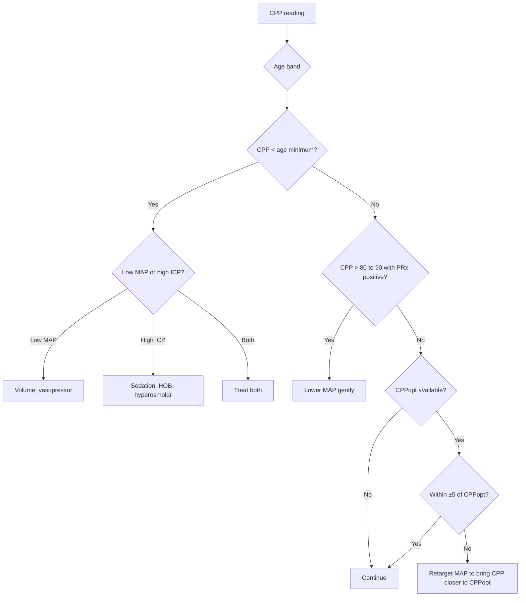

<Callout type="reference">
**Acronyms used on this page**

- **CPP**: cerebral perfusion pressure = MAP − ICP (mmHg)
- **MAP**: mean arterial pressure (mmHg)
- **ICP**: intracranial pressure (mmHg)
- **CPPopt**: individualised optimal CPP (continuously computed from PRx vs CPP fit)
- **LLA / ULA**: lower / upper limit of autoregulation
- **PRx**: pressure reactivity index (correlation of ICP with MAP slow waves)
- **Mx**: mean-flow autoregulation index (correlation of TCD MFV with CPP)
- **ORx**: NIRS-based autoregulation index (correlation of rSO2 with MAP)
- **TBI / SAH / HIE / SE**: traumatic / subarachnoid / hypoxic-ischaemic / status epilepticus
- **BTF / pBTF**: Brain Trauma Foundation / pediatric BTF guidelines
- **CBF**: cerebral blood flow
- **PRESS**: posterior reversible encephalopathy syndrome
</Callout>

<TldrCard>
**The 60-second version.** CPP = MAP − ICP. It is the driving pressure for cerebral blood flow, the working bedside variable for TBI / SAH management, and the single most often-titrated number in neurocritical care. **Same CPP, different paths**: CPP 60 from MAP 75 + ICP 15 is a very different brain from CPP 60 from MAP 100 + ICP 40. The path matters because the upper-limit / lower-limit of autoregulation and the metabolic environment differ. **Age-banded CPP minima**: 35 to 40 mmHg neonate, 40 to 50 infant, 50 to 60 toddler, 60 to 70 older child / adolescent / adult. **Individualised CPPopt** (Aries 2012) refines fixed thresholds: target the CPP at which the autoregulation index (PRx, Mx, or ORx) is most negative. **Pushing CPP too high is harmful** (ARDS / lung injury, hyperaemic brain injury, PRESS); the upper bound matters as much as the lower. Pediatric data are sparse for CPPopt; Tas 2024 is the leading pediatric cohort. <Cite id="kochanek2019_pbtf4" /> <Cite id="aries2012cppopt" /> <Cite id="tas2024_pediatric_cppopt" />
</TldrCard>

## 1. Bedside vignettes: why this matters in the PICU

### Vignette A. The 14-year-old SAH, "good CPP" after hyperosmolar therapy

A 14-year-old presents with WFNS grade 3 SAH after a ruptured aneurysm. After coiling, ICP is 18 mmHg, MAP 95, CPP 77. Six hours later, ICP rises to 20 mmHg. The team gives 3% saline; MAP rises to 110 in response to volume expansion; new ICP 20 mmHg; **new CPP 90 mmHg.** The team notes that PRx has crept to +0.4 over the same window. The autoregulation curve has been pushed above the upper limit: the higher MAP has not translated into useful brain perfusion (autoregulation broken), and the higher CPP risks hyperperfusion, oedema, and a PRESS-like picture. Action: lower MAP target to bring CPP back to 65 to 75, recheck PRx in 1 hour. <Cite id="aries2012cppopt" /> <Cite id="donnelly2017mapopt" />

### Vignette B. The 4-month-old after non-accidental head injury

A 4-month-old infant arrives in shock with non-accidental head injury, retinal haemorrhages, and a tense fontanelle. After resuscitation, MAP 50, ICP 18, **CPP 32**. The pediatric BTF age-banded CPP minimum for an infant is 40 to 50 mmHg. Action: raise MAP gently to 60 to 65 (fluid + noradrenaline if needed), reassess CPP, treat ICP if it climbs further. Within 30 min, MAP 62, ICP 18, **CPP 44**, in the lower band of the age target. The combination of age-appropriate CPP targeting plus ICP management is the bedside framework. <Cite id="kochanek2019_pbtf4" /> <Cite id="tasker2023_pccm_review" />

### Vignette C. The 12-year-old TBI, the CPPopt is below the textbook target

A 12-year-old severe TBI is on day 4 with ICP 16, MAP 80, CPP 64. The PRx-vs-CPP continuous fit (computed from 4 hours of data by the bedside ICM+) shows a U-curve with minimum PRx at CPP 58. **This patient's CPPopt is 58**, below the standard "60 to 70 for older child" textbook target. Aggressive MAP escalation to push CPP to 70 would shift this child to the right of his CPPopt, where PRx becomes more positive (impaired autoregulation, hyperperfusion). Action: target MAP to keep CPP near 58 to 63; reassess CPPopt every 1 to 4 hours. This is the central idea of individualised CPPopt: **the textbook number is a starting heuristic; the U-curve is the truth**. <Cite id="aries2012cppopt" /> <Cite id="depreitere2014icpdose" /> <Cite id="tas2024_pediatric_cppopt" />

---

## 2. What CPP is, and what it is not

CPP is a *derived* number computed from two measured numbers. The two measured numbers are mean arterial pressure (from an arterial line) and intracranial pressure (from an EVD or parenchymal monitor). The derivation:

```math
\mathrm{CPP} = \mathrm{MAP} - \mathrm{ICP}
```

**Three things follow immediately.**

**CPP is not cerebral blood flow.** CPP is the driving pressure across the cerebral vascular bed. Cerebral blood flow (CBF) depends on CPP *and* on cerebrovascular resistance (CVR), through Ohm's law:

```math
\mathrm{CBF} = \frac{\mathrm{CPP}}{\mathrm{CVR}}
```

If autoregulation is intact, CVR adjusts so that CBF is roughly constant across a wide range of CPP (the Lassen plateau). If autoregulation is broken, CBF tracks CPP linearly. Same CPP, very different CBF in these two cases.

**Same CPP, different paths.** CPP 60 from MAP 75 + ICP 15 is a healthy brain on the autoregulation plateau. CPP 60 from MAP 100 + ICP 40 is a brain with markedly raised ICP and a high-MAP "compensation"; the cerebrovascular bed is exposed to high transmural pressure, the systemic circulation is under stress, and the autoregulation may be impaired. The path matters; the same number is not the same physiology. <Cite id="chesnut2012best" />

**CPP minima are age-banded.** The mature cerebral autoregulation plateau (CPP 60 to 150 in adults) does not exist in the same form in young children. Neonates have a much narrower and lower autoregulation plateau (CPP ~30 to 50). The age-banded minimum CPP targets from the pediatric BTF guidelines:

| Age | CPP minimum (mmHg) | Source |
|---|---|---|
| Term neonate | 35 to 40 | Pediatric BTF / Tasker 2023 |
| 1 to 12 months | 40 to 50 | Pediatric BTF |
| 1 to 5 years | 50 to 60 | Pediatric BTF |
| 6 to 12 years | 60 to 70 | Pediatric BTF / adult-like |
| Adolescent / adult | 60 to 70 | BTF (severe TBI, treat ICP > 22) |

<Cite id="kochanek2019_pbtf4" /> <Cite id="tasker2023_pccm_review" />

<Pearl>
**CPP is not a treatment goal in isolation.** It is one number on a triangle with MAP and ICP. The path to CPP matters. The age-banded minimum is a floor, not a target. Individualised CPPopt is the modern refinement that personalises the target.
</Pearl>

<Pediatric>
**Pediatric autoregulation plateau is narrower and lower than adult.** A neonate with MAP 30 is potentially below the lower limit of autoregulation; the same MAP in an adult is dangerously low for a different reason. **Always reach for the age-band table before reading a single CPP value.**
</Pediatric>

---

## 3. The CPP triangle and the underlying physiology

<Figure
  src="/images/cpp/triangle-equation.svg"
  alt="CPP triangle showing MAP, ICP, and CPP; same CPP reachable by many MAP/ICP combinations"
  caption="The CPP triangle. CPP = MAP − ICP. The same CPP value (e.g., 60 mmHg, shown by the dotted line) is reachable by many MAP/ICP combinations: MAP 75 with ICP 15 (healthy brain, lower-MAP path) vs MAP 100 with ICP 40 (decompensated brain, high-ICP / high-MAP compensation path). The two paths have very different implications for the cerebrovascular bed, the systemic circulation, and the management plan. The Lassen autoregulation plateau is the green band along the MAP axis: MAP changes within the plateau do not change CBF; changes outside it do."
  attribution="MNM-Edu, original schematic. SVG placeholder."
  label="Fig. 1"
/>

The classical Lassen autoregulation curve plots CBF on the y-axis against CPP (or MAP) on the x-axis. In a healthy adult, CBF is roughly constant from CPP ~60 to ~150 mmHg (the plateau). Below the lower limit (LLA), CBF falls and ischaemia ensues. Above the upper limit (ULA), CBF rises and hyperaemia / breakthrough oedema ensues. <Cite id="lassen1959" />

**Three modifications matter clinically.**

**The plateau is narrower and lower in children.** Neonates: roughly CPP 30 to 50. Toddlers: roughly CPP 40 to 70. School-age: closer to adult. The exact bounds vary by individual, by injury, by sedation depth, and by autoregulation status. The age-banded minima above are *empirical* (from observational pediatric TBI data) rather than physiological.

**Acute brain injury narrows or abolishes the plateau.** PRx > +0.3, Mx > +0.3, or ORx > +0.3 mean autoregulation is impaired; CBF tracks CPP passively in that range; the patient is functionally outside the plateau. Pushing CPP up does not produce useful CBF, and may produce oedema. <Cite id="czosnyka1997prx" /> <Cite id="aries2012cppopt" />

**Individualised CPPopt** (Aries 2012, Donnelly 2017, Beqiri 2024 COGiTATE): plot PRx against CPP across the previous 4 hours of data; fit a parabola; the vertex is CPPopt. Target the CPP within ±5 mmHg of CPPopt. In adult TBI, time spent further from CPPopt correlates with worse outcome (Aries 2012, Beqiri 2024). <Cite id="aries2012cppopt" /> <Cite id="donnelly2017mapopt" /> <Cite id="beqiri2024_cogitate" />

---

## 4. The numbers: what to record at the bedside

| Variable | Source | What it tells you |
|---|---|---|
| MAP | Arterial line | Driving pressure side of the equation |
| ICP | EVD or parenchymal probe | Resistance side of the equation |
| CPP | Derived: MAP − ICP | Net driving pressure |
| PRx | ICM+ or bedside autoregulation monitor | Autoregulation status; underpins CPPopt |
| CPPopt | ICM+ continuous fit | Individualised target |
| Time-in-range (CPPopt ±5) | ICM+ summary statistic | How well you are meeting CPPopt |
| Hemodynamic context (HR, CVP, vasopressor dose) | Bedside | Path to the current MAP |

Document trend over hours, not single snapshots. Most modern PICU bedside platforms show CPP alongside MAP, ICP, and PRx in one trend strip.

---

## 5. What is normal? Age-banded CPP targets

| Age | CPP minimum (mmHg) | Typical "comfortable" target (mmHg) | Source |
|---|---|---|---|
| Term neonate | 35 to 40 | 40 to 50 | Pediatric BTF |
| 1 to 12 months | 40 to 50 | 50 to 60 | Pediatric BTF |
| 1 to 5 years | 50 to 60 | 60 to 65 | Pediatric BTF |
| 6 to 12 years | 60 to 70 | 65 to 75 | Pediatric BTF |
| Adolescent / adult | 60 to 70 | 60 to 75 | BTF / TBI bundle |

<Cite id="kochanek2019_pbtf4" /> <Cite id="chesnut2012best" /> <Cite id="tasker2023_pccm_review" />.

<Pediatric>
**Age-banded minima are floors, not targets.** A 6-year-old with CPP 50 needs intervention; a 6-year-old with CPP 65 is on target. The minima exist because below them, observed pediatric outcomes are clearly worse. Individualised CPPopt (when available) refines the target further.
</Pediatric>

---

## 6. What is abnormal? Pattern library and management triggers

<Figure
  caption="Four CPP patterns. (a) Normal: CPP 65 in an 8-year-old, ICP 12, MAP 77, PRx −0.1 (autoregulation intact). (b) Low CPP: CPP 45, ICP 22, MAP 67, PRx +0.4. Action: lower ICP and raise MAP; recheck PRx. (c) High CPP: CPP 90, ICP 18, MAP 108, PRx +0.5. Action: lower MAP; pushing higher will damage. (d) CPPopt mismatch: CPP 70 (textbook), PRx +0.3, but the U-curve fit shows CPPopt 58. Action: lower MAP to bring CPP to 58 to 63."
  attribution="MNM-Edu, original schematic. SVG placeholder."
  label="Fig. 2"
>
  <WidgetEmbed name="CPPTriangle" />
</Figure>

| Pattern | Bedside signature | Action |
|---|---|---|
| Normal CPP, PRx intact | CPP within age band, PRx &lt; 0 | Continue |
| Low CPP from high ICP | CPP &lt; age minimum, ICP &gt; threshold, normal MAP | Treat ICP first (sedation, HOB, hyperosmolar) |
| Low CPP from low MAP | CPP &lt; age minimum, MAP low, ICP normal | Treat MAP (volume, vasopressor) |
| High CPP from high MAP | CPP &gt; 80 (older child), PRx becoming positive | Lower MAP gently |
| High CPP from very high ICP | CPP "ok" but ICP &gt; 25, MAP &gt; 110 (compensation) | Treat ICP urgently; the path is bad |
| CPPopt mismatch | CPP within textbook range but PRx rising | Re-fit CPPopt; target the individualised number |
| Impaired autoregulation | PRx &gt; +0.3 sustained | Narrow the CPP range; consider sedation, normothermia, normocapnia |

### Decision tree: "what to do about this CPP"



---

## 7. Try it: interactive widgets

<WidgetEmbed name="CPPTriangle" />

<WidgetEmbed name="CPPoptUCurve" />

---

## 8. CPP-driven management in detail

### 8.1 Fixed thresholds (BTF / pediatric BTF)

The simplest CPP framework. Maintain CPP above the age-banded minimum at all times. Treat ICP above the age-banded threshold (20 mmHg for older children and adults, ~15 mmHg for younger children, ~10 mmHg for infants). The pediatric BTF 4th edition is the canonical reference. <Cite id="kochanek2019_pbtf4" /> <Cite id="chesnut2012best" />

### 8.2 The ICP-dose framework

Guiza 2015 and Depreitere 2014 introduced the concept of **ICP dose**: the area-under-curve of ICP × time above threshold, which correlates with outcome better than peak ICP alone. The corollary **CPP dose**: time spent below CPP minimum × magnitude of the deficit also correlates with outcome. The dose framework integrates the trade-off between treating ICP and maintaining CPP. <Cite id="guiza2015b_dose" /> <Cite id="depreitere2014icpdose" />

### 8.3 Individualised CPPopt

Compute PRx (or Mx, or ORx) continuously. Plot PRx against CPP for the last 4 hours; fit a parabola. The vertex is CPPopt; target MAP so CPP sits within ±5 mmHg of CPPopt. Re-fit every 1 to 4 hours.

Pediatric data: Tas 2024 reported pediatric CPPopt feasibility in 50 children with severe TBI; time spent further from CPPopt correlated with worse outcome, consistent with adult data. <Cite id="aries2012cppopt" /> <Cite id="donnelly2017mapopt" /> <Cite id="beqiri2024_cogitate" /> <Cite id="tas2024_pediatric_cppopt" />

### 8.4 The risk of pushing CPP too high

Three named harms:

1. **ARDS / lung injury**: aggressive fluid and vasopressor escalation to lift MAP increases lung-injury risk. The original CPP-targeted protocols (CPP > 70 in adults) were abandoned partly for this reason. <Cite id="robertson1989sjvo2" />
2. **Cerebral hyperaemia and oedema**: if autoregulation is broken, raising MAP pushes CBF up linearly; the resulting hyperaemia can cause vasogenic oedema, breakthrough bleeding, and worsen ICP.
3. **PRESS-like syndrome**: posterior reversible encephalopathy can be precipitated by hypertension, particularly in conditions with endothelial dysfunction (sepsis, eclampsia, post-transplant).

The upper bound matters. Modern CPP management is *two-sided*: too low is bad, too high is also bad. <Cite id="aries2012cppopt" />

### 8.5 The bedside MAP-titration ladder

When CPP needs to be raised:

1. **Fluid bolus** (10 to 20 mL/kg crystalloid) if hypovolaemic; recheck CPP in 15 min.
2. **Vasopressor** (noradrenaline, sometimes phenylephrine; vasopressin in selected cases): start low, titrate to MAP target.
3. **Sedation review**: deep sedation can cause hypotension; review and adjust.
4. **Posture**: head-of-bed at 30°; abdominal compression / Valsalva avoided; jugular venous outflow unobstructed.
5. **Reassess CPP** after each step.

When CPP needs to be lowered:

1. **Lower MAP target**: titrate vasopressor down; use esmolol or labetalol if MAP needs more decisive control.
2. **Address sympathetic surge**: increase sedation if pain or agitation is driving MAP up.
3. **Reassess autoregulation index** (PRx, Mx, ORx) to confirm pushing CPP back into the plateau.

### 8.6 When CPP and ICP are both stubbornly out of range

The path matters. If ICP is the problem (sustained ICP > 22 mmHg in an older child despite first-line measures), escalate ICP management (deeper sedation, hyperosmolar, possibly hypothermia, possibly decompressive craniectomy). Raising MAP alone in this setting often raises ICP further (autoregulation broken; volume goes to brain not vessel). If MAP is the problem (sepsis, haemorrhagic shock), restore MAP first; ICP often improves as cerebral perfusion is restored.

<Callout type="caveat">
**Teaching, not protocol.** CPP thresholds (60 to 70 older child, 50 to 60 toddler, etc.) and CPPopt offset (±5 mmHg) are heuristics derived from observational data. Local protocols, age-specific evidence, and individual patient context always govern. Defer to your unit's senior intensivist and neurosurgical team for CPP-driven decisions.
</Callout>

<AlgorithmDisclaimer />

---

## 9. Clinical contexts: CPP across acute brain injuries

### 9.1 Severe TBI

The canonical indication. Pediatric BTF specifies age-banded CPP minima; the consensus statements (Kochanek 2019, Tasker 2023) emphasise that "ICP and CPP are both important" rather than a single number. Multimodal monitoring (ICP, PRx, PbtO2 where available) refines the CPP target. <Cite id="kochanek2019_pbtf4" /> <Cite id="chesnut2012best" /> <Cite id="tasker2023_pccm_review" />

### 9.2 Aneurysmal SAH

Post-SAH CPP management balances vasospasm prevention (higher MAP supports collateral flow) against bleeding risk and the upper limit of autoregulation. AHA SAH guidelines suggest maintaining CPP and MAP within an individualised, multimodal framework. <Cite id="hoh2023sah_aha" /> <Cite id="rass2021dci_review" />

### 9.3 Pediatric AIS

Post-recanalisation hyperperfusion risk drives MAP-lowering decisions in the first 24 h. CPP per se is less the bedside framework here; MAP control with NIRS / TCD feedback is more relevant. <Cite id="ferriero2019aha_pedstroke" />

### 9.4 HIE and post-cardiac arrest

Pediatric post-arrest CPP targets are not well-defined. AHA pediatric post-arrest guidelines suggest age-appropriate MAP targets, avoidance of hypotension, and avoidance of hyperthermia. Autoregulation indices (where available) refine the target. <Cite id="topjian2021aha_pediatric" /> <Cite id="naim2023_brain_injury_pccm" />

### 9.5 Pediatric ECMO

VA-ECMO patients have continuous MAP; CPP is a meaningful number even without pulsatility. The ELSO neurological guidelines recommend MAP-targeted care with neuromonitoring (NIRS, NPi, cEEG); explicit CPP targets are centre-dependent. <Cite id="lorusso2017_elso_neuro" /> <Cite id="cho2024_ecmo_outcomes" />

### 9.6 Meningitis and encephalitis with raised ICP

Bacterial meningitis with fulminant cerebral oedema can require ICP / CPP management akin to TBI. Pediatric meningitis guidelines reference CPP only in the context of overall ICP / oedema management. <Cite id="tunkel2017idsa_encephalitis" /> <Cite id="vandebeek2016eu_meningitis" />

### 9.7 Brain-death determination

CPP approaches or falls to zero in established brain death (ICP approaches MAP); TCD shows oscillating / pendular flow patterns. CPP is not a diagnostic criterion but is a useful corroborating bedside observation. <Cite id="nakagawa2011peds_bd" /> <Cite id="wijdicks2005" />

### 9.8 DKA cerebral oedema

ICP rises during DKA-CO; CPP falls. Maintaining age-appropriate CPP during rehydration is part of the bedside management bundle alongside osmotherapy and HOB. <Cite id="kuppermann2018_pecarn_dka" /> <Cite id="glaser2024_dka_review" />

### 9.9 Refractory status epilepticus

Continuous sedation for refractory SE can hypotensify and lower CPP. The PICU framework targets MAP and CPP within age-appropriate ranges while treating the seizure burden; vasopressor support is common. <Cite id="glauser2016esett" /> <Cite id="kapur2019eclipse_se" />

---

## 10. Multimodal integration: CPP in the MMM/MNM stack

| Pair with… | What you gain | Worked scenario |
|---|---|---|
| **ICP** | The two numbers that compose CPP; treat the path | High ICP + low CPP: treat ICP first, then MAP |
| **PRx / Mx / ORx** | Autoregulation status drives CPPopt | PRx U-curve fit gives the individualised target |
| **PbtO2** | Tissue oxygenation at the same site; complements CPP | Low PbtO2 at "good" CPP: mitochondrial dysfunction; do not raise MAP |
| **TCD** | Mx as the non-invasive autoregulation surrogate | TCD shows MFV tracks MAP: passive flow; below LLA |
| **NIRS** | rSO2 and ORx as the tissue-oxygenation complements | rSO2 stable at CPP 60 = autoregulation intact |
| **Clinical exam** | The gate; falling exam at "good" CPP triggers reassessment | GCS drops with stable CPP: image and reassess |
| **Microdialysis** | Cortical biochemistry confirms or refutes ischaemic CPP picture | L/P rising with low CPP confirms ischaemia |

<Cite id="figaji2025_mmm_pediatric_consensus" /> <Cite id="helbok2024_pediatric_mmm" /> <Cite id="tasker2023mnm" /> <Cite id="leroux2014_neurocrit_consensus" />

---

<DeepDive>

## 11. Setup and technique

### 11.1 Measuring MAP correctly

1. **Arterial line** with a properly zeroed transducer at the phlebostatic axis.
2. **Calibrate** with mercury or per local protocol at start of shift.
3. **Square-wave test** to verify under- / over-damping; correct if abnormal.
4. **Document** MAP at consistent timestamps; the rolling 1-minute average is the standard input to PRx / CPPopt computation.

### 11.2 Measuring ICP correctly

1. **EVD or parenchymal probe** placed by neurosurgery per local protocol.
2. **Zeroing**: EVD transducer at the tragus (foramen of Monro); parenchymal probes pre-calibrated and inserted.
3. **Verify trace** quality: clean P1-P2-P3 morphology, respiratory variation visible.
4. **Document** at consistent timestamps; pair with MAP.

### 11.3 Computing CPP and CPPopt

1. **Continuous CPP** = MAP − ICP, computed beat-to-beat or every 1 to 10 s.
2. **PRx** computation: Pearson correlation of 10-s averages of ICP and MAP over a rolling 5-min window.
3. **CPPopt** computation: bin CPP values from the last 4 h into 5-mmHg windows; compute mean PRx in each bin; fit a parabola; the vertex is CPPopt.
4. **Display**: bedside platform (ICM+, Sickbay, or custom) shows CPP, PRx, and CPPopt as a continuous trend.

### 11.4 The bedside conversation

1. **Morning round**: review the previous 24 h CPP, ICP, MAP, PRx, CPPopt trend.
2. **Define the CPP target** for the day: age-banded minimum OR individualised CPPopt OR multimodal-derived target.
3. **Define the action triggers**: CPP below X for Y min → escalate; CPP above Z with rising PRx → de-escalate.
4. **Document the plan** so the night team can act consistently.

### 11.5 Pediatric-specific considerations

1. **Age-banded targets** mandatory; do not apply adult CPP 60 to 70 to an infant.
2. **Lower stroke volume**, so MAP responses to volume vary; intermittent boluses more useful than large continuous infusions.
3. **Vasopressor selection**: noradrenaline first-line for most pediatric CPP escalations; dopamine has fallen out of first-line use in many units.
4. **Pediatric CPPopt evidence is sparse**: treat the individualised target as a refinement of the age-banded floor, not a replacement.

### 11.6 Calibration drift and signal quality

CPP and CPPopt are only as good as the underlying MAP and ICP signals. Daily transducer zeroing, regular square-wave testing, and prompt response to alarms (ICP probe drift, EVD over-drainage, arterial line damping) are operational essentials.

</DeepDive>

---

## 12. Pitfalls

- **CPP without context**: same CPP, different paths; always document the MAP / ICP split and the autoregulation status.
- **Treating CPP as the only goal**: chasing CPP > 70 in an older child can cause ARDS / hyperaemic injury.
- **Applying adult thresholds to children**: a CPP of 50 is "low" in an adult but appropriate in a toddler.
- **CPPopt without enough data**: 4 hours of synchronised MAP / ICP / PRx are needed; less is unreliable.
- **CPPopt during sedation changes**: sedation hold can artefact the CPPopt fit for an hour.
- **Ignoring autoregulation status**: a "good" CPP in a patient with PRx +0.5 is not the same as a "good" CPP in a patient with PRx −0.1.
- **Single-snapshot CPP**: trend over hours matters more than a one-off number.
- **Confusing CPP and CBF**: CPP is the driving pressure; CBF depends on CVR; the two move together only when autoregulation is broken.
- **Forgetting the upper bound**: pediatric BTF gives a minimum but not a strict maximum; in practice, CPP > 85 in an older child should be questioned.
- **Path-of-care confusion**: CPP can be raised by raising MAP or by lowering ICP; the chosen path matters for the brain and the patient.

---

## 13. Combine with…

- [ICP](/modalities/icp/): one of the two measured numbers that compose CPP.
- [PRx](/modalities/prx/): the autoregulation index that underpins CPPopt.
- [CPPopt](/modalities/cppopt/): the dedicated CPPopt page with workflow detail.
- [Mx](/modalities/mx/): TCD-derived autoregulation index for non-invasive CPPopt.
- [ORx](/modalities/orx/): NIRS-derived autoregulation index.
- [PbtO2](/modalities/pbto2/): tissue-oxygen complement.
- [Foundations: autoregulation](/foundations/autoregulation/): the physiology behind every CPP target.

---

<DeepDive>

## 14. Evidence summary

| Topic | Source | Grade |
|---|---|---|
| Original CPP concept | <Cite id="lassen1959" /> | foundational |
| BTF severe TBI guidelines | <Cite id="chesnut2012best" /> | expert |
| Pediatric BTF 4th edition | <Cite id="kochanek2019_pbtf4" /> | expert |
| Pediatric PCCM review | <Cite id="tasker2023_pccm_review" /> | review |
| Aries CPPopt original | <Cite id="aries2012cppopt" /> | B |
| Donnelly MAP-opt extension | <Cite id="donnelly2017mapopt" /> | B |
| ICP / CPP dose | <Cite id="depreitere2014icpdose" /> <Cite id="guiza2015b_dose" /> | B |
| COGiTATE feasibility trial | <Cite id="beqiri2024_cogitate" /> | A |
| Pediatric CPPopt feasibility (Tas 2024) | <Cite id="tas2024_pediatric_cppopt" /> | C |
| PRx original | <Cite id="czosnyka1997prx" /> | A |
| Pediatric MMM consensus | <Cite id="figaji2025_mmm_pediatric_consensus" /> <Cite id="helbok2024_pediatric_mmm" /> | expert |
| LeRoux 2014 multimodal consensus | <Cite id="leroux2014_neurocrit_consensus" /> | expert |
| SAH AHA guidelines | <Cite id="hoh2023sah_aha" /> | expert |
| Pediatric stroke guidelines | <Cite id="ferriero2019aha_pedstroke" /> | expert |
| Pediatric post-arrest AHA | <Cite id="topjian2021aha_pediatric" /> | expert |
| Pediatric autoregulation review | <Cite id="rivera-lara2017autoreg" /> | review |

## 15. Recent literature (2022 to 2025)

- **Beqiri 2024 COGiTATE trial**: randomised feasibility trial of CPPopt-guided MAP management vs standard care in adult TBI; CPPopt arm achieved more time within ±5 mmHg of target with acceptable safety. <Cite id="beqiri2024_cogitate" />
- **Tas 2024 pediatric CPPopt feasibility**: largest pediatric CPPopt cohort to date (n = 50 severe TBI); CPPopt computable and clinically actionable in pediatric ICU. <Cite id="tas2024_pediatric_cppopt" />
- **Tas 2025 COGiTATE follow-up**: longer-term outcomes data emerging. <Cite id="tas2025_cogitate_followup" />
- **Tasker 2023 PCCM review**: pediatric severe TBI management framework integrating CPP, CPPopt, multimodal monitoring. <Cite id="tasker2023_pccm_review" />
- **Figaji 2025 pediatric MMM consensus**: positions CPPopt as tier-2 (specialist centre) modality in pediatric MNM. <Cite id="figaji2025_mmm_pediatric_consensus" />
- **Helbok 2024 pediatric MMM**: bedside operationalisation of CPP / CPPopt in pediatric multimodal stacks. <Cite id="helbok2024_pediatric_mmm" />

</DeepDive>

---

## 16. Self-check

<Quiz
  questions={[
    {
      id: 'q1',
      prompt: 'A 14-year-old SAH after coiling. Baseline ICP 18, MAP 95, CPP 77, PRx +0.1. After 3% saline, MAP rises to 110 in volume response; new ICP 20, new CPP 90; new PRx +0.4. Best interpretation and action?',
      options: [
        { id: 'a', label: 'Higher CPP is always better; continue current MAP target' },
        { id: 'b', label: 'Push CPP further by adding noradrenaline; the autoregulation is broken so more pressure is needed' },
        { id: 'c', label: 'CPP has been pushed above the upper limit of autoregulation; lower MAP target to bring CPP to 65 to 75; recheck PRx in 1 h' },
        { id: 'd', label: 'Add mannitol to reduce ICP and accept CPP 90' },
      ],
      answer: 'c',
      explanation: 'The trend (CPP 77 → 90 with PRx rising from +0.1 to +0.4) indicates the autoregulation has been pushed above the upper limit by the rising MAP; the cerebrovascular bed is now passive and CBF is tracking MAP linearly, risking hyperaemia and oedema. Lowering MAP to bring CPP back into the autoregulated range (65 to 75 in an adolescent) is the appropriate response. Pushing CPP further worsens the situation. Higher CPP is not always better; the upper bound matters as much as the lower. This is the bedside teaching of the "two-sided" CPP management framework (Aries 2012, COGiTATE 2024).',
    },
    {
      id: 'q2',
      prompt: 'A 4-month-old infant after non-accidental head injury. After resuscitation, MAP 50, ICP 18, CPP 32. The team applies the adult CPP target of 60 to 70 and starts noradrenaline to push MAP to 90. ICP rises to 25 within 30 min. Best interpretation?',
      options: [
        { id: 'a', label: 'Continue: MAP target of 90 is appropriate; manage the rising ICP separately' },
        { id: 'b', label: 'The adult CPP target is inappropriate for a 4-month-old; the age-banded infant CPP minimum is 40 to 50 mmHg; target MAP gently to bring CPP to 45 to 50, then reassess; aggressive MAP escalation in a young infant can drive ICP up via volume overload of a passive cerebrovascular bed' },
        { id: 'c', label: 'Lower MAP to under 50 to reduce ICP' },
        { id: 'd', label: 'Adult CPP targets apply to all paediatric ages' },
      ],
      answer: 'b',
      explanation: 'The pediatric BTF age-banded CPP minimum for an infant (1 to 12 months) is 40 to 50 mmHg, not 60 to 70 (which applies to older children). Aggressive MAP escalation to adult targets can drive ICP up in an infant whose cerebrovascular autoregulation plateau is narrower and lower; the volume goes to the brain (oedema, raised ICP) not to useful perfusion. The correct approach is age-appropriate CPP targets, gentle MAP escalation, and concurrent ICP management. Lowering MAP further (to under 50) would worsen the CPP deficit. Applying adult thresholds to infants is one of the most common pediatric CPP errors.',
    },
    {
      id: 'q3',
      prompt: 'A 12-year-old severe TBI on day 4. ICP 16, MAP 80, CPP 64. The bedside ICM+ shows a PRx-vs-CPP U-curve fit over the last 4 h with the vertex at CPP 58 (CPPopt 58 mmHg). Current PRx is +0.3 at CPP 64. Best interpretation and action?',
      options: [
        { id: 'a', label: 'Push MAP higher to drive CPP to 70 (the textbook target)' },
        { id: 'b', label: 'The individualised CPPopt is 58, below the textbook minimum but consistent with the patient\'s own autoregulation curve; retarget MAP to bring CPP to 58 to 63; recheck CPPopt every 1 to 4 h' },
        { id: 'c', label: 'Ignore CPPopt; the textbook target of 60 to 70 is universally correct' },
        { id: 'd', label: 'Aggressive ICP-lowering with mannitol to drop ICP and raise CPP further' },
      ],
      answer: 'b',
      explanation: 'Individualised CPPopt refines the textbook target for the specific patient: the U-curve fit shows this child\'s autoregulation is optimal at CPP 58. Pushing CPP higher (chasing the textbook 60 to 70) moves the patient to the right of his CPPopt where PRx becomes more positive (autoregulation impaired, hyperperfusion). Targeting MAP to bring CPP closer to CPPopt is the modern personalised approach (Aries 2012, COGiTATE 2024, Tas 2024 pediatric data). The textbook target is a starting heuristic; the U-curve is the patient-specific truth. Re-fitting every 1 to 4 hours captures changing autoregulation. Note that CPPopt as low as 58 in an adolescent is unusual but possible and the algorithm reports the patient-specific number, not the population average.',
    },
  ]}
/>
