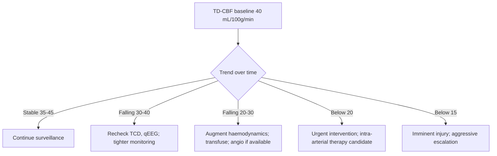

<Callout type="reference">
**Acronyms used on this page**

- **CBF**: cerebral blood flow (mL/100 g/min)
- **TDF / TD-CBF**: thermal diffusion CBF (Hemedex Bowman QFlow 500 system)
- **LDF**: laser Doppler flowmetry
- **Xe-CT**: xenon-enhanced computed tomography
- **CTP / MRP / ASL**: CT perfusion / MR perfusion / arterial spin labelling
- **CMRO₂**: cerebral metabolic rate of oxygen
- **Astrup cascade**: graded CBF thresholds: oligemia, electrical failure, membrane failure, infarction
- **DCI**: delayed cerebral ischaemia
- **SAH**: aneurysmal subarachnoid haemorrhage · **TBI**: traumatic brain injury
- **HIE**: hypoxic-ischaemic encephalopathy · **AIS**: arterial ischaemic stroke
- **ICP / CPP / MAP**: intracranial / cerebral perfusion / mean arterial pressure
- **MMM / MNM**: multimodal monitoring / multimodal neuromonitoring
</Callout>

<TldrCard>
**The 60-second version.** Direct CBF monitoring measures **regional cerebral blood flow in absolute units** (mL/100 g/min), rather than the velocity or oxygen surrogates of TCD, NIRS, and PbtO₂. The bedside continuous tools are **thermal diffusion** (Hemedex Bowman, a parenchymal probe that measures heat dissipation) and **laser Doppler** (a fibreoptic probe that returns flux in arbitrary units). Intermittent tomographic tools are **xenon-CT**, **CT perfusion**, **MR perfusion**, and **arterial spin labelling**. Direct CBF is the only way to anchor the Astrup cascade thresholds (electrical failure ~ 15 mL/100 g/min, infarction ~ 6 mL/100 g/min) at the bedside. The dominant clinical use is **continuous DCI surveillance in SAH** and selected **severe TBI** patients in research-grade centres. Pediatric data are sparse; the modality is uncommon outside academic neuro-ICUs and rare in pediatrics. Pair with PbtO₂, TCD, microdialysis, and qEEG for the full multimodal picture.
</TldrCard>

## 1. Bedside vignettes: why this matters

### Vignette A. SAH day 8 with high TCD velocities but real DCI

A 14-year-old with aneurysmal SAH, day 8, post-coiling. Right MCA TCD MFV has risen to 180 cm/s with Lindegaard ratio 4.2; clinical exam shows subtle right-arm drift. A bedside thermal-diffusion probe was placed at admission in the right frontal white matter. TD-CBF reads **18 mL/100 g/min** (down from baseline 42); the patient is at the electrical-failure threshold. DCI is confirmed by direct measurement; haemodynamic augmentation and (if needed) intra-arterial therapy follow. The TCD warned; the TD-CBF confirmed and quantified. <Cite id="vajkoczy2000tdf" /> <Cite id="hoh2023sah_aha" /> <Cite id="rass2021dci_review" />

### Vignette B. Severe TBI with PbtO₂ low, CPP normal

A 13-year-old severe TBI, day 2. PbtO₂ probe reads 14 mmHg (low), CPP 65 (adequate), ICP 18. The team adds a thermal-diffusion probe at the same trajectory. TD-CBF **22 mL/100 g/min** in the pericontusional white matter, consistent with oligemia at the upper end of the Astrup cascade. The CBF deficit is the upstream cause of the low PbtO₂; raising MAP to lift CPP to 70 brings TD-CBF to 38 and PbtO₂ to 22. The combined measurement disambiguates flow vs O₂-delivery problems. <Cite id="kirkpatrick1994ldf" /> <Cite id="kochanek2019_pbtf4" /> <Cite id="okonkwo2017_boost2" />

### Vignette C. Xe-CT for moyamoya screening

A 9-year-old with confirmed moyamoya, considering bypass surgery. Pre-operative xenon-CT (a research / academic centre offering) shows reduced baseline CBF in both MCA territories (24 mL/100 g/min) with markedly reduced reserve to acetazolamide challenge (no increase). This documents the haemodynamic indication for bypass. The same patient post-bypass returns to a 30+ mL/100 g/min CBF with augmented reserve. Xe-CT here is a tomographic snapshot, not a continuous monitor; it bridges the **gap between continuous bedside tools and tomographic imaging**. <Cite id="kirkpatrick1995" />

---

## 2. What direct CBF monitoring is, and what it is not

The bedside ICU question "what is the flow?" is answered indirectly by every other modality on this site: TCD measures velocity (proxy for flow if vessel diameter is constant), NIRS measures tissue oxygenation (proxy for the supply-demand ratio), PbtO₂ measures tissue O₂ tension (proxy for the same ratio at the tip), and SjvO₂ measures global O₂ extraction (proxy for whole-brain supply-demand). **Direct CBF** measures the flow itself, in absolute units, at one or more regions.

### 2.1 The Astrup cascade

The reason "absolute CBF" matters at all is that the bedside thresholds for neuronal viability are calibrated in absolute flow units:

| CBF (mL/100 g/min) | Bedside meaning |
|---|---|
| 50–75 | Normal adult cortex |
| 35–50 | Oligemia onset; CMRO₂ still met |
| 20–35 | Oligemia; functional deficit possible |
| 15–20 | Electrical failure (EEG flattening) |
| 10–15 | Membrane failure threshold |
| < 10 | Imminent infarction |
| < 6 | Established infarction |

These thresholds come from controlled adult-cortex data (Astrup, Heiss, Hossmann); pediatric thresholds are inferred. Direct CBF measurement is what turns these numbers from a foundational concept into a bedside threshold.

### 2.2 The four method families

**Continuous bedside (research-grade):**

- **Thermal diffusion (TD-CBF)**: Hemedex Bowman QFlow probe. A small parenchymal probe with a heater and two temperature sensors; measures the rate of heat dispersion to compute absolute CBF at the probe tip (~17 mm³ tissue zone).
- **Laser Doppler flowmetry (LDF)**: a fibreoptic probe; measures the Doppler shift of light reflected from moving red blood cells. Reports relative flux in arbitrary units (perfusion units), not absolute mL/100 g/min.

**Intermittent tomographic:**

- **Xenon-CT (Xe-CT)**: inhaled stable xenon (a freely diffusible radioopaque tracer); serial CT scans during washin map absolute regional CBF.
- **CT perfusion (CTP)**: bolus iodinated contrast; deconvolution analysis gives CBF, CBV, MTT maps. Widely available; the standard for acute stroke imaging.
- **MR perfusion (MRP)** and **arterial spin labelling (ASL)**: bolus gadolinium (MRP) or magnetically tagged blood (ASL, no contrast); regional CBF maps. ASL is repeatable, non-contrast; ideal for pediatric serial use.

### What direct CBF does well

- **Absolute units**: anchors the Astrup cascade at the bedside.
- **Regional specificity**: probe-tip resolution for continuous methods; whole-brain regional for tomographic methods.
- **DCI surveillance**: continuous TD-CBF in the at-risk SAH territory provides quantitative warning before clinical signs.
- **Bridge to therapy**: a measured CBF deficit can guide haemodynamic augmentation, transfusion, or intra-arterial intervention.

### What direct CBF cannot do

- **TD-CBF requires steady-state thermal conditions**: shivering, fever spikes, body-temperature changes invalidate the measurement for the duration of the perturbation.
- **LDF reports relative, not absolute**: useful for trend, not for thresholding against Astrup.
- **Xe-CT requires patient transport** and is no longer routinely available in most centres.
- **CT perfusion requires iodinated contrast and radiation**: limits repeatability.
- **MRP / ASL** require MRI scanner time and patient stability for transport.
- **Pediatric data are sparse**: most evidence is adult; pediatric thresholds inferred.
- **All methods are operator- and centre-dependent**: routine clinical use is uncommon.

<Pearl>
**Direct CBF tells you the flow.** Every other modality in the ICU tells you a proxy. The clinical question "is the brain ischaemic?" maps cleanly onto direct CBF values; the proxies require interpretation chains. Where the budget and expertise allow, direct CBF is the missing piece.
</Pearl>

<Pediatric>
- **Pediatric experience with direct CBF monitoring is limited**: most published series are adult.
- **TD-CBF probes** in pediatric severe TBI have been used in academic centres; pediatric Astrup thresholds are inferred from adult data.
- **ASL is the pediatric-friendly tomographic method**: no contrast, repeatable, increasingly available on modern MRI scanners.
- **Routine bedside direct CBF in pediatric SAH or TBI is uncommon**; the modality is most relevant in research-active centres.
</Pediatric>

---

## 3. Anatomy and probe placement (TD-CBF)

<Figure
  src="/images/direct-cbf/thermal-diffusion.svg"
  alt="Thermal-diffusion CBF probe schematic: parenchymal probe with heater and temperature sensors; tissue thermal zone, depth in white matter"
  caption="Thermal-diffusion CBF probe (Hemedex Bowman QFlow). The parenchymal probe is placed via a bolt at the same trajectory as ICP / PbtO2 monitoring. The probe tip carries a heater (the proximal element) and a temperature sensor (the distal element). A controlled heat pulse is delivered; the rate at which the temperature equilibrates back to baseline depends on the local CBF (faster flow = faster heat removal). The interrogated tissue zone is approximately 17 mm³ at the probe tip. The probe is typically placed in white matter at 2–3 cm depth, away from large vessels and CSF spaces."
  attribution="MNM-Edu, original schematic. SVG placeholder."
  label="Fig. 1"
/>

### 3.1 TD-CBF probe placement

The thermal-diffusion probe is a 1.0 mm diameter parenchymal probe inserted via a cranial bolt:

| Step | Action |
|---|---|
| 1 | Pre-procedure imaging review; identify the at-risk territory |
| 2 | Cranial bolt placement under sterile technique; same trajectory as ICP / PbtO₂ |
| 3 | Advance the TD-CBF probe 2–3 cm into white matter; secure at the bolt |
| 4 | Confirm position with post-procedure CT |
| 5 | Allow 60–120 min equilibration for thermal stability |
| 6 | Begin recording; pair with core temperature and ICP / PbtO₂ |

The probe interrogates a small tissue zone (~17 mm³) at the tip. **It does not survey the whole brain**; placement must target the at-risk territory.

### 3.2 LDF probe placement

The laser Doppler probe is similar in size; placement is via the same bolt trajectory. The interrogation depth is shallower (~1 mm³ at the tip).

### 3.3 Tomographic methods

Xe-CT, CTP, MRP, and ASL require transport to the imaging scanner. Patient stability and scheduling drive the feasibility; the result is a single tomographic snapshot rather than a continuous trend.

<Pitfall>
**Probe placement determines what you measure.** A probe in normal-appearing brain remote from the at-risk territory may read normal flow while the lesion territory is ischaemic. Match probe placement to the question, just as with PbtO₂.
</Pitfall>

---

## 4. The signal: thermal diffusion physics

The TD-CBF method exploits the fact that **flowing blood removes heat from tissue**. A small heater on the probe tip delivers a controlled heat pulse; the probe's distal temperature sensor records the temperature rise and the subsequent decay back to baseline. The decay rate is converted, via a calibrated heat-transfer model, to local CBF in absolute units.

### 4.1 The measurement cycle

Each measurement cycle:

1. Establish thermal equilibrium with surrounding tissue (~60 s).
2. Deliver a controlled heat pulse (raise tip temperature ~ 2 °C).
3. Record the temperature decay over ~ 90 s.
4. Compute CBF from the decay constant.

A full measurement cycle takes approximately 2–3 minutes; continuous monitoring delivers a CBF value every 2–3 minutes.

### 4.2 Limitations

- **Thermal stability required**: the calculation assumes steady-state tissue temperature; shivering, fever spikes, body-temperature changes invalidate the measurement.
- **Probe-tip CBF only**: small interrogation zone (~17 mm³).
- **Calibration drift**: every probe requires periodic recalibration; long-term continuous use needs maintenance.
- **Cost**: the disposable probe and the dedicated cart limit availability.

### 4.3 LDF physics

Laser Doppler delivers near-infrared light into tissue; light backscattered from moving red blood cells is Doppler-shifted. The frequency distribution of the backscattered light yields a flux value (perfusion units). The relationship to absolute CBF is approximate; calibration to absolute units requires assumptions about haematocrit and tissue scattering properties.

---

## 5. The numbers to record: the direct-CBF six-pack

| Variable | Symbol | What to record |
|---|---|---|
| Regional CBF | TD-CBF (mL/100 g/min) | Primary; with probe location |
| Baseline CBF | TD-CBF baseline | Established in first 12 h |
| CBF trend | ΔCBF/h | A sustained 25% fall is a clinical event |
| Probe location | Documented on CT | At-risk territory vs normal control |
| Concurrent ICP / CPP / MAP | mmHg | The perfusion-pressure context |
| Patient temperature | T_core | Thermal stability is required for valid measurement |

Always pair direct-CBF readings with the **time since insult**, the **most recent imaging**, the **multimodal context** (PbtO₂, microdialysis, TCD, qEEG), and the **clinical exam**.

---

## 6. What is normal? Age-banded reference

Pediatric CBF is **higher per gram** than adult, peaks in the preschool window, and falls into adolescence and adulthood. The Astrup cascade thresholds are referenced to adult cortex; pediatric thresholds are inferred and may be different.

| Age band | Healthy CBF (mL/100 g/min) | Notes |
|---|---|---|
| Preterm < 32 wk | 10–30 | Low baseline; passive flow common |
| Term newborn | 20–40 | Lower than older child |
| 6 months | 50–80 | Rising rapidly |
| 1–3 years | 80–120 | Peak years |
| 4–6 years | 80–110 | Peak window |
| 7–12 years | 70–100 | Declining |
| Adolescent | 55–75 | Approaching adult |
| Adult | 50–75 | Reference |

Sources: <Cite id="kety1948" /> <Cite id="lassen1959" /> <Cite id="kirkpatrick1994ldf" /> <Cite id="vajkoczy2000tdf" />. The Astrup cascade thresholds (electrical failure ~ 15, membrane failure ~ 10, infarction ~ 6) are adult-cortex values; pediatric thresholds are inferred and may be lower in absolute terms but proportionally similar.

<Pediatric>
**Healthy pediatric MFV** by TCD parallels pediatric CBF. The reference values above are derived from PET, Xe-CT, and ASL studies in healthy children. Use within-patient trend over absolute values where possible; the pediatric Astrup cascade should be informed by the patient's own baseline plus the proportional thresholds.
</Pediatric>

---

## 7. What is abnormal? Pattern library

| Pattern | Bedside meaning | What to do |
|---|---|---|
| **TD-CBF < 20 mL/100 g/min** | Oligemia at electrical-failure threshold | Treat: raise CPP, transfuse, escalate; pair with qEEG and PbtO₂ |
| **TD-CBF < 15** | Electrical failure threshold | Urgent intervention; impending injury |
| **TD-CBF < 10** | Membrane failure / impending infarction | Aggressive intervention; consider intra-arterial therapy in SAH |
| **TD-CBF falling > 25% over hours** | Evolving ischaemia | Treat the trend; do not wait for absolute threshold |
| **TD-CBF normal with low PbtO₂** | Diffusion limitation, oedema, mitochondrial dysfunction | Microdialysis; targeted treatment of oedema |
| **TD-CBF high with normal CMRO₂** | Luxury perfusion; hyperaemic phase of injury | Identify cause; consider seizure, fever |
| **TD-CBF high with collapsed CMRO₂** | Luxury without demand; severe injury | Pair with cEEG, SSEP; poor prognostic signature |
| **LDF flux change > 50%** | Real perfusion event (LDF is relative) | Correlate with absolute CBF or other modalities |
| **Xe-CT or ASL deficit in territory at risk** | Confirmed regional ischaemia | Anatomical correlate; targeted intervention |
| **Acetazolamide challenge non-responder (moyamoya)** | Exhausted vasodilatory reserve | Surgical bypass indication |

### Decision tree: TD-CBF in DCI surveillance

---

## 8. Try it: interactive widget

<WidgetEmbed name="ThermalCBFDemo" />

---

## 9. Management: CBF-anchored decision-making

### 9.1 DCI surveillance in SAH

The most evidence-supported application. In high-risk SAH patients (Hunt-Hess 4–5, modified Fisher 3–4), continuous TD-CBF in the at-risk territory provides quantitative early warning:

1. Establish baseline TD-CBF in the at-risk territory within the first 12–24 h after admission.
2. Continuous monitoring for the 14-day vasospasm window.
3. A **25% fall from baseline over hours**, or absolute TD-CBF < 20, triggers:
   - Re-examine: clinical exam, TCD, qEEG.
   - **Haemodynamic augmentation**: raise MAP within autoregulatory range.
   - **Transfusion** if Hb low.
   - **Angiography / intra-arterial therapy** if clinical or quantitative deterioration confirmed.
4. Documentation: every event, every intervention, every quantitative response. <Cite id="hoh2023sah_aha" /> <Cite id="rass2021dci_review" /> <Cite id="vajkoczy2000tdf" />

### 9.2 CPP titration in severe TBI

In centres with TD-CBF available, the probe complements PbtO₂ for CPP titration:

1. Establish TD-CBF and PbtO₂ baseline at current CPP.
2. Trial small CPP changes (5 mmHg).
3. Observe TD-CBF and PbtO₂ response.
4. Identify the CPP range that maintains TD-CBF in the normal-to-oligemia upper range (35–50 mL/100 g/min) without driving hyperaemia.
5. Document the operational CPP window. <Cite id="kochanek2019_pbtf4" /> <Cite id="okonkwo2017_boost2" /> <Cite id="bernard2025_boost3" />

### 9.3 Moyamoya pre-operative assessment

Xe-CT or ASL with acetazolamide challenge documents baseline CBF and vasodilatory reserve:

1. Baseline resting CBF map.
2. Repeat after acetazolamide IV (1 g adult equivalent, weight-adjusted in pediatrics).
3. Calculate the **increase** in CBF; the failure to increase (cerebrovascular reserve exhausted) is a surgical indication for bypass.
4. Post-operative re-assessment confirms restored reserve. <Cite id="ferriero2019aha_pedstroke" />

<Callout type="caveat">
**Decision support, not a clinical protocol.** Every threshold and workflow above is centre-, patient-, and protocol-dependent. Pair with the full multimodal stack and defer to your unit's protocols.
</Callout>

<AlgorithmDisclaimer />

---

## 10. Clinical contexts

### 10.1 Aneurysmal SAH and DCI

The leading clinical use case. Continuous TD-CBF in the at-risk territory provides quantitative DCI early warning; absolute thresholds (TD-CBF < 20 mL/100 g/min) trigger intervention. The combined surveillance bundle (TCD + qEEG + TD-CBF) is the modern academic-centre approach. Pediatric SAH data are limited. <Cite id="hoh2023sah_aha" /> <Cite id="rass2021dci_review" /> <Cite id="vajkoczy2000tdf" />

### 10.2 Severe TBI

TD-CBF in severe TBI complements PbtO₂ for CPP titration and identifies regional flow deficits that contribute to low PbtO₂. The 2019 BTF pediatric guidelines do not specifically recommend direct CBF monitoring but acknowledge it as a research modality. <Cite id="kochanek2019_pbtf4" /> <Cite id="okonkwo2017_boost2" /> <Cite id="bernard2025_boost3" />

### 10.3 Pediatric arterial ischaemic stroke

CT perfusion is the standard acute-stroke imaging modality. ASL is the pediatric-friendly serial alternative. Direct continuous CBF is rare in pediatric AIS. <Cite id="ferriero2019aha_pedstroke" /> <Cite id="sun2020_pediatric_thrombectomy" />

### 10.4 HIE and post-cardiac-arrest

CBF in HIE evolves through hypoperfusion, reperfusion, and (in severe injury) luxury perfusion. Direct measurement is research-grade in this context; the bedside surrogates (TCD, NIRS) carry the routine clinical signal. <Cite id="shankaran2005hie_nichd" /> <Cite id="kirschen2020_pedshie_tcd" /> <Cite id="topjian2021aha_pediatric" /> <Cite id="naim2023_brain_injury_pccm" />

### 10.5 Moyamoya disease

Xe-CT and ASL with acetazolamide challenge are part of the pre-operative work-up for moyamoya bypass surgery. The CBF reserve is the haemodynamic indication. <Cite id="ferriero2019aha_pedstroke" />

### 10.6 Pediatric ECMO

Direct CBF in pediatric ECMO is research-grade; NIRS is the bedside non-invasive standard. <Cite id="lorusso2017_elso_neuro" /> <Cite id="cho2024_ecmo_outcomes" />

### 10.7 Bacterial meningitis / encephalitis

CT perfusion and ASL may document hypoperfusion in vasculitis or large infarct territories complicating severe meningitis. Continuous direct CBF monitoring is uncommon. <Cite id="tunkel2004_idsa_meningitis" /> <Cite id="tunkel2017idsa_encephalitis" />

### 10.8 Brain-death determination (supportive)

In brain death, CBF is zero or near-zero by direct measurement; CTA and TCD are the preferred ancillary tests in the World Brain Death Project framework. <Cite id="greer2020_braindeath" /> <Cite id="nakagawa2011peds_bd" />

### 10.9 Refractory status epilepticus

Continuous seizure activity drives hyperaemic CBF. Direct CBF monitoring is uncommon; TCD MFV trends provide the bedside surrogate. <Cite id="glauser2016esett" /> <Cite id="kapur2019eclipse_se" />

---

## 11. Multimodal integration: direct CBF in the MMM/MNM stack

<Figure
  src="/images/direct-cbf/thermal-diffusion.svg"
  alt="Direct CBF in multimodal context"
  caption="Direct CBF is the missing absolute-flow channel in the multimodal stack. TCD measures velocity (flow proxy); NIRS measures tissue oxygenation; PbtO2 measures tissue O2 tension; SjvO2 measures global O2 extraction. Direct CBF measures the flow itself, in absolute units, at the probe tip or as a tomographic map. Discordance among these channels often localises the dominant pathophysiology: low CBF + low PbtO2 = ischaemic; normal CBF + low PbtO2 = diffusion or metabolic; high CBF + low CMRO2 (high SjvO2) = luxury perfusion in a dying brain."
  attribution="MNM-Edu, original schematic. SVG placeholder."
  label="Fig. 2"
/>

| Pair with… | What you gain | Worked scenario |
|---|---|---|
| **PbtO₂** | Flow + O₂ tension; localises supply vs delivery problem | [PbtO₂-CPP titration](/integration/pbto2-cpp-titration/) |
| **TCD** | Velocity + absolute flow; calibrates the TCD trend in absolute units | [TCD vs ICP vasospasm](/integration/tcd-vs-icp-vasospasm/) |
| **NIRS** | Tissue oxygenation + flow; cortical vs probe-tip cross-check | [PRx vs ORx discordance](/integration/prx-vs-orx-discordance/) |
| **Microdialysis** | Flow + metabolism; the L/P ratio context | [Multimodal discordance](/integration/discordance-triage/) |
| **qEEG** | Electrophysiologic function at the CBF threshold; the Astrup correlate | [SAH DCI surveillance](/integration/tcd-vs-icp-vasospasm/) |
| **ICP / CPP / PRx** | CBF response to CPP titration; autoregulation curve in absolute flow | [CPPopt targeting](/integration/cppopt-targeting/) |

<Cite id="figaji2025_mmm_pediatric_consensus" /> <Cite id="helbok2024_pediatric_mmm" /> <Cite id="tasker2023mnm" />

---

<DeepDive>

## 12. Setup and technique

### 12.1 Equipment

- **TD-CBF system**: Hemedex Bowman QFlow 500; the cart-based monitor and the disposable probe.
- **LDF system**: research-grade fibreoptic probes; less commonly deployed clinically.
- **Bolt and adapter**: same cranial bolt as ICP / PbtO₂; multi-channel adapter.
- **Tomographic modalities**: Xe-CT (rare), CTP (widely available), MRP (MRI-dependent), ASL (modern MRI).
- **Trained operator**: probe placement and signal interpretation require dedicated training.

### 12.2 TD-CBF placement: 6-step protocol

1. **Pre-procedure imaging review** to identify the at-risk territory (pericontusional in TBI; at-risk vascular territory in SAH).
2. **Cranial bolt placement** under sterile technique; multi-channel adapter accommodates ICP, PbtO₂, and TD-CBF probes through a single bolt.
3. **Advance the TD-CBF probe** 2–3 cm into white matter; secure at the bolt.
4. **Confirm probe position** with post-procedure CT; document the territory.
5. **Allow 60–120 minutes equilibration**: thermal stabilisation is required for valid measurement; CBF values during the first hour are unreliable.
6. **Begin continuous recording**: 2–3 minute measurement cycles; pair with ICP, PbtO₂, MAP, core temperature.

### 12.3 Validity checks

- **Thermal stability**: shivering, fever spikes, body-temperature changes invalidate the measurement. Annotate every such event.
- **Probe-tip position**: a probe that has migrated into CSF or against bone gives unreliable values; daily check.
- **Calibration drift**: weekly recalibration is typical for long-term use.
- **Concurrent ICP**: a probe-tip CBF in the presence of unstable ICP needs cautious interpretation.

### 12.4 Reading routine

- **Establish baseline** in the first 12 h: the patient's own reference.
- **Track trend**: 25% fall over hours is more informative than a single absolute value.
- **Annotate clinical events**: suction, intubation, fever, sedation changes, transfusion.
- **Correlate with the other channels**: PbtO₂, microdialysis, TCD, qEEG.

### 12.5 Xenon-CT and tomographic methods

Xe-CT requires patient transport, inhalation of stable xenon, and serial CT scans; the resulting absolute CBF map is a single time-point. CTP and MRP / ASL are similar in workflow: scanner time, contrast (CTP, MRP) or no contrast (ASL), reconstruction, and interpretation. The result is a tomographic snapshot, not a continuous trend.

### 12.6 Removal

The TD-CBF probe is removed when monitoring is no longer required, typically at the same time as ICP and PbtO₂. Complications are similar (small haemorrhage, infection, malposition); the probe is small and removal is straightforward.

</DeepDive>

---

## 13. Pitfalls

- **Thermal instability** invalidates TD-CBF measurements; fever spikes, shivering, body-temperature changes pause the measurement for the duration.
- **Single-region measurement**: probe tip samples ~17 mm³; misses remote ischaemia.
- **LDF is relative**: useful for trend, not for thresholding against Astrup.
- **Xe-CT availability is limited**: most centres no longer offer the modality.
- **CT perfusion radiation and contrast** limit repeatability; not a continuous monitor.
- **ASL motion sensitivity**: pediatric patients may need sedation for high-quality ASL acquisitions.
- **Pediatric Astrup thresholds are inferred**: the cascade values are adult-cortex calibrated; pediatric application is approximate.
- **Probe drift / dislodgement**: same risks as ICP / PbtO₂ probes.
- **Calibration drift**: TD-CBF systems require periodic calibration; uncalibrated values drift.
- **Interpretation requires training**: not a plug-and-play modality; clinical use is centre- and operator-dependent.

---

## 14. Combine with…

- [PbtO₂](/modalities/pbto2/): tissue oxygen tension at the same trajectory.
- [TCD](/modalities/tcd/): macrovascular velocity; calibration of trend.
- [NIRS](/modalities/nirs/): cortical oxygenation; non-invasive cross-check.
- [Microdialysis](/modalities/microdialysis/): tissue metabolism at the same trajectory.
- [SjvO₂](/modalities/sjvo2/): global O₂ extraction; whole-brain context.
- [Foundations: autoregulation](/foundations/autoregulation/): the Lassen plateau in absolute flow units.
- [Foundations: Astrup cascade](/foundations/astrup-cascade/): the thresholds direct CBF anchors at the bedside.
- [Integration: TCD vs ICP vasospasm](/integration/tcd-vs-icp-vasospasm/): how TD-CBF confirms TCD findings.
- [Integration: PbtO₂-CPP titration](/integration/pbto2-cpp-titration/): the BOOST paradigm extended.

---

<DeepDive>

## 15. Evidence summary

| Topic | Source | Grade |
|---|---|---|
| Kety-Schmidt CBF measurement | <Cite id="kety1948" /> | foundational |
| Lassen autoregulation | <Cite id="lassen1959" /> | foundational |
| Thermal diffusion CBF (Vajkoczy) | <Cite id="vajkoczy2000tdf" /> | B |
| Laser Doppler flowmetry | <Cite id="kirkpatrick1994ldf" /> <Cite id="kirkpatrick1995" /> | B |
| AHA SAH guidelines | <Cite id="hoh2023sah_aha" /> | expert |
| Modern DCI review | <Cite id="rass2021dci_review" /> | review |
| Pediatric severe TBI (BTF 4th ed.) | <Cite id="kochanek2019_pbtf4" /> | expert |
| BOOST-II (PbtO₂ feasibility) | <Cite id="okonkwo2017_boost2" /> | A |
| BOOST-III (PbtO₂ outcome) | <Cite id="bernard2025_boost3" /> | A |
| HIE NICHD cooling trial | <Cite id="shankaran2005hie_nichd" /> | A |
| AHA pediatric post-arrest | <Cite id="topjian2021aha_pediatric" /> | expert |
| Pediatric brain injury post-arrest | <Cite id="naim2023_brain_injury_pccm" /> | review |
| Pediatric AIS / thrombectomy | <Cite id="ferriero2019aha_pedstroke" /> <Cite id="sun2020_pediatric_thrombectomy" /> | expert |
| Bacterial meningitis | <Cite id="tunkel2004_idsa_meningitis" /> <Cite id="vandebeek2016eu_meningitis" /> | expert |
| ECMO neuro outcomes | <Cite id="lorusso2017_elso_neuro" /> <Cite id="cho2024_ecmo_outcomes" /> | C |
| Brain-death determination | <Cite id="greer2020_braindeath" /> <Cite id="nakagawa2011peds_bd" /> | expert |
| Pediatric MMM consensus | <Cite id="figaji2025_mmm_pediatric_consensus" /> <Cite id="helbok2024_pediatric_mmm" /> <Cite id="tasker2023mnm" /> | expert |
| Pediatric neurocritical care review | <Cite id="tasker2023_pccm_review" /> | review |
| Autoregulation review | <Cite id="rivera-lara2017autoreg" /> | review |
| TCD post-HIE prognosis (pediatric) | <Cite id="kirschen2020_pedshie_tcd" /> | C |

## 16. Recent literature (2022–2025)

- **BOOST-III (Bernard 2025)**: PbtO₂-guided care reduces brain hypoxia episodes; direct CBF complements PbtO₂ where available. <Cite id="bernard2025_boost3" />
- **Modern DCI surveillance** in SAH continues to evolve toward multimodal bundles (TCD + qEEG + TD-CBF where available); pediatric data remain sparse. <Cite id="rass2021dci_review" />
- **Tasker 2023 (pediatric neurocritical care review)**: direct CBF monitoring listed as tier-3 research modality in pediatric centres. <Cite id="tasker2023_pccm_review" />
- **Pediatric MMM consensus (Figaji 2025)**: direct CBF monitoring acknowledged as research-grade with potential bedside utility in academic centres. <Cite id="figaji2025_mmm_pediatric_consensus" />
- **ASL adoption in pediatric MRI** continues to expand; the non-contrast, repeatable nature makes it the pediatric-friendly tomographic CBF modality of choice. <Cite id="ferriero2019aha_pedstroke" />
- **TD-CBF in adult TBI / SAH** continues to be used in academic centres; the cost and complexity limit broader adoption.

</DeepDive>

---

## 17. Self-check

<Quiz
  questions={[
    {
      id: 'q1',
      prompt: 'A 14-year-old aneurysmal SAH, day 8, post-coiling. Baseline TD-CBF in the right MCA territory was 42 mL/100 g/min on day 1. Today TD-CBF reads 18 mL/100 g/min; right MCA TCD MFV 180 with Lindegaard ratio 4.2; subtle right-arm drift on exam. Best next step?',
      options: [
        { id: 'a', label: 'Continue surveillance; values are within normal range' },
        { id: 'b', label: 'Haemodynamic augmentation, transfusion if Hb low, escalation to angiography / intra-arterial therapy if not responsive' },
        { id: 'c', label: 'Lumbar puncture' },
        { id: 'd', label: 'Hyperventilation to PaCO₂ 25 mmHg' },
      ],
      answer: 'b',
      explanation: 'TD-CBF 18 mL/100 g/min is at the electrical-failure threshold of the Astrup cascade and represents a > 50% fall from baseline. Combined with high TCD MFV / Lindegaard and clinical signs, DCI is confirmed. The intervention ladder is haemodynamic augmentation (lift MAP within autoregulatory range), transfusion if Hb low, and escalation to angiography with intra-arterial therapy if quantitative recovery is not achieved. Hyperventilation worsens CBF and is contraindicated; LP is contraindicated in SAH.',
    },
    {
      id: 'q2',
      prompt: 'A 13-year-old severe TBI, day 2. PbtO₂ 14 mmHg (low), TD-CBF 22 mL/100 g/min in the same pericontusional territory, CPP 65, MAP 88, ICP 23. The low PbtO₂ is most likely due to:',
      options: [
        { id: 'a', label: 'Adequate flow but diffusion limitation' },
        { id: 'b', label: 'Regional oligemia driving low O₂ delivery; raise MAP and re-measure' },
        { id: 'c', label: 'Hyperventilation' },
        { id: 'd', label: 'Sedation effect' },
      ],
      answer: 'b',
      explanation: 'TD-CBF 22 mL/100 g/min in the pericontusional territory is oligemia at the upper Astrup range. The flow deficit is the upstream cause of the low PbtO₂. Raising MAP to lift CPP into a more favourable range typically restores TD-CBF and PbtO₂ together. The combined direct CBF + PbtO₂ measurement disambiguates flow vs delivery; without TD-CBF, the team would have to guess.',
    },
    {
      id: 'q3',
      prompt: 'A 9-year-old with moyamoya disease is being evaluated for surgical bypass. Pre-operative ASL CBF maps show baseline CBF 24 mL/100 g/min in both MCA territories; after IV acetazolamide, repeat ASL shows no significant CBF increase. Interpretation?',
      options: [
        { id: 'a', label: 'Normal moyamoya pre-operative findings; no surgery indicated' },
        { id: 'b', label: 'Exhausted cerebrovascular reserve; haemodynamic indication for bypass' },
        { id: 'c', label: 'Acetazolamide failed to deliver' },
        { id: 'd', label: 'Hyperperfusion' },
      ],
      answer: 'b',
      explanation: 'Failure of CBF to increase after acetazolamide indicates exhausted cerebrovascular reserve (the vessels are already maximally vasodilated to maintain baseline perfusion). This is a haemodynamic indication for revascularisation surgery; the bypass restores reserve and reduces stroke risk. The same workup post-operatively documents restored reserve. ASL with acetazolamide is the pediatric-friendly tomographic CBF reserve assessment.',
    },
  ]}
/>
