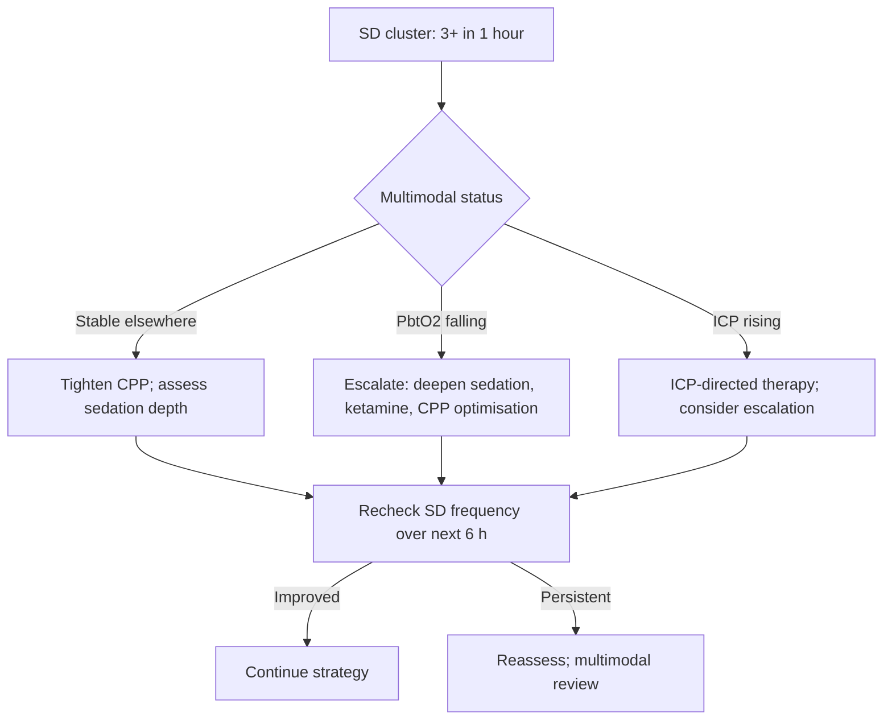

<Callout type="reference">
**Acronyms used on this page**

- **ECoG**: electrocorticography (recording from the cortical surface)
- **SD**: spreading depolarization (Leão wave)
- **CSD**: cortical spreading depression (the historic term for the EEG manifestation)
- **DC shift**: direct-current shift on the ECoG trace (the electrophysiological signature of SD)
- **HF / HFA**: high-frequency activity / amplitude (the suppression of which marks SD)
- **COSBID**: Co-operative Study on Brain Injury Depolarizations
- **PIDs**: peri-infarct depolarizations
- **isoSD**: isoelectric SD (no underlying activity to suppress; severe injury)
- **TBI**: traumatic brain injury · **SAH**: aneurysmal subarachnoid haemorrhage
- **MMI / MMS**: malignant middle-cerebral artery infarction / supratentorial stroke
- **CBF**: cerebral blood flow · **CPP / MAP / ICP**: cerebral perfusion / mean arterial / intracranial pressure
- **MMM / MNM**: multimodal monitoring / multimodal neuromonitoring
</Callout>

<TldrCard>
**The 60-second version.** Spreading depolarizations (SDs) are slow (2–5 mm/min) self-propagating waves of near-complete depolarization of neurons and astrocytes that originate in or near injured cortex and spread across the cortical sheet. Each SD is a metabolic catastrophe: complete loss of ion gradients, massive efflux of K+ and glutamate, transient near-complete CBF demand, and (in injured tissue) a coupled inverse haemodynamic response that worsens local perfusion. SDs are detected by **subdural strip ECoG** placed at the time of craniotomy. The COSBID group has standardised detection criteria (large negative DC shift, suppression of high-frequency activity, sequential propagation across electrodes). SDs are common after severe TBI, SAH, and malignant infarction; **SD clusters** correlate with secondary injury, infarct growth, and worse outcomes. Therapeutic targeting is an active research area; ketamine reduces SD burden. Pediatric data are sparse; the modality is research-grade and confined to academic centres with COSBID expertise.
</TldrCard>

## 1. Bedside vignettes: why this matters

### Vignette A. Severe TBI day 3, SD cluster preceding contusion expansion

A 15-year-old severe TBI with a right frontal contusion, decompressive craniectomy at admission, COSBID-protocol ECoG strip placed at the same operation. Day 3: a **cluster of 6 SDs in 4 hours** appears on the strip, propagating from the contusion margin posteriorly. Over the next 6 hours, the contusion expands on repeat CT and ICP rises from 14 to 24. The SD cluster preceded the radiographic and ICP changes by several hours; the academic neurosurgical team adjusts management (depth of sedation, ketamine consideration, tight CPP control). The strip provided the **earliest warning** of secondary injury. <Cite id="hartings2017cosbid" /> <Cite id="dreier2017sd_cosbid" /> <Cite id="hartings2020_sd_natural_history" />

### Vignette B. Aneurysmal SAH day 6, SD-DCI

A 17-year-old aneurysmal SAH, post-clipping with a contralateral parietal strip. Day 6: SDs begin to appear, initially isolated; within 12 hours they cluster. Concurrent qEEG alpha-delta ratio falls 30%. CT angiography shows moderate vasospasm in the left MCA territory. This is the **SD-DCI** signature, electrophysiological evidence of evolving ischaemia in real time. The team escalates haemodynamic augmentation; SD frequency falls over the next 24 hours. <Cite id="dreier2009" /> <Cite id="dreier2017sd_cosbid" /> <Cite id="rass2021dci_review" /> <Cite id="hoh2023sah_aha" />

### Vignette C. Malignant MCA infarct, SDs in penumbra

An adult patient with a malignant MCA infarct (this is an adult-only modality in most centres, included as illustration). Hemicraniectomy and strip placement at the same operation. SDs propagate across the strip every 30 minutes; the underlying ECoG over the infarct is isoelectric (isoSD). Each SD is a metabolic insult to the penumbra. The strip documents the pathophysiology; therapeutic options remain limited but include sedation depth optimisation, ketamine, and tight CPP control. <Cite id="strong2002" /> <Cite id="dreier2017sd_cosbid" />

---

## 2. What SDs are, and what they are not

**Spreading depolarization** is a fundamental nervous-tissue response first described by Leão in 1944 in the anaesthetised rabbit cortex. The phenomenon: an electrical and ionic catastrophe propagates across the cortical sheet at 2–5 mm/min, with near-complete loss of transmembrane ion gradients, massive K+ and glutamate efflux, cell swelling, and a transient near-complete CBF demand. <Cite id="leao1944" />

The clinical relevance was recognised slowly over decades; SDs in humans were first directly recorded in the 1990s using subdural ECoG strips placed during neurosurgical procedures for severe TBI, SAH, and malignant infarction. The COSBID consortium has standardised detection and interpretation. <Cite id="strong2002" /> <Cite id="dreier2009" /> <Cite id="dreier2017sd_cosbid" />

### 2.1 The mechanism

Each SD consists of three coupled events:

1. **Ionic catastrophe**: massive influx of Na+ and Ca2+, efflux of K+ and glutamate. Trans-membrane gradients collapse for 30–60 seconds.
2. **Metabolic crisis**: near-complete loss of ATP per gram of cortex; lactate surges; mitochondrial function challenged.
3. **Haemodynamic response**: in healthy tissue, a coupled hyperaemic CBF response delivers oxygen and glucose, restoring gradients within 1–2 minutes. **In injured tissue, the haemodynamic response inverts**: vasoconstriction reduces CBF during the period of maximum metabolic demand, deepening the injury. This is the SD-DCI mechanism and the path through which SDs cause secondary injury.

### 2.2 The four classes

| Class | Pattern | Implication |
|---|---|---|
| **Single SD** | Isolated DC shift with HF suppression | Transient; usually well-tolerated in healthy cortex |
| **SD cluster** | ≥ 3 SDs within 1 hour | Strong correlate of secondary injury |
| **isoSD** | DC shift with no underlying HF activity to suppress | Severe injury; cortex was already isoelectric |
| **Recurrent SDs** | Repeated SDs over hours-days | Chronic ongoing injury; poor prognosis |

### What SD detection does well

- **Early warning of secondary injury**: SD clusters precede radiographic and ICP changes by hours.
- **Mechanism insight**: the SD frequency tracks the metabolic challenge to the cortex.
- **DCI detection in SAH**: SDs are present in real time when DCI is evolving.
- **Therapeutic target**: ketamine reduces SD burden; tight CPP control may modulate.

### What SD detection cannot do

- **Be performed without craniotomy**: the modality requires open exposure; deferred or non-craniotomy patients cannot have an ECoG strip placed.
- **Cover the whole brain**: a 1 × 6 cm strip samples a small fraction of cortex; remote SDs are invisible.
- **Be routine outside research centres**: COSBID-style implementation requires dedicated training, infrastructure, and analysis pipelines.
- **Reverse injury once SDs occur**: detection precedes the worst of the damage but does not prevent the immediate ionic catastrophe.

<Pearl>
**SDs are a real-time, mechanistic readout of evolving secondary injury.** They are present hours before radiographic and ICP changes; they are the electrophysiological correlate of pathophysiology that is happening at the moment. Where the modality is available, it is one of the most informative single signals in the multimodal stack.
</Pearl>

<Pediatric>
- **Pediatric SD data are sparse**: most published series are adult.
- **Pediatric severe TBI** and **pediatric SAH / AVM** are the settings where strip placement during craniotomy would be feasible; the modality is research-grade in pediatric centres.
- **Pediatric brain** is presumed to be similarly susceptible to SDs; mechanistic translation from adult data is reasonable but unverified.
- **Routine pediatric clinical use is not yet established**; the modality is mentioned in pediatric multimodal consensus statements as research-grade.
</Pediatric>

---

## 3. Anatomy and electrode placement

<Figure
  caption="Subdural strip ECoG for SD detection. The standard COSBID strip is a flexible silicone strip with six platinum contacts (1 mm diameter, 1 cm spacing), placed on the pia-arachnoid surface adjacent to (not on top of) the injury (contusion margin in TBI, infarct border in malignant stroke, or peri-aneurysmal cortex in SAH). The strip is tunneled out through the skin and connected to a DC-coupled amplifier. Recording requires DC capability (the SD signature is a slow negative DC shift over 1–2 minutes) combined with high-frequency analysis (the HF suppression). Standard placement is at the time of craniotomy that the patient already requires; new craniotomies for SD recording alone are not performed."
  attribution="MNM-Edu, original schematic."
  label="Fig. 1"
>
  <ECoGStrip />
</Figure>

### 3.1 The strip

The COSBID-standard strip is a flexible silicone strip with **six platinum contacts**, 1 mm diameter, 1 cm spacing. Six electrodes allow propagation detection: an SD propagating at 2–5 mm/min crosses sequential electrodes with characteristic timing.

### 3.2 Placement criteria

- **At the time of an already-indicated craniotomy**: decompressive craniectomy for TBI, clipping for SAH, hemicraniectomy for malignant infarction. Strips are not placed for SD detection alone.
- **Adjacent to, not over, the injury**: place on viable cortex bordering the contusion / infarct / aneurysm; SDs originate at the injury and propagate into surrounding tissue.
- **Tunnelled exit**: the strip cable exits through the skin via a tunnel several centimetres from the craniotomy; minimises CSF leak and infection risk.
- **DC-coupled amplifier**: required for the slow negative DC shift signature; standard AC-coupled EEG amplifiers cannot detect SDs reliably.

### 3.3 Removal

Strips are removed at the bedside 7–14 days after placement, with the tunnel exit covered with a sterile dressing. Removal is uncomplicated in the great majority of cases.

<Pitfall>
**A standard AC-coupled EEG cannot detect SDs**; the negative DC shift is the defining signature. DC-coupled amplification is essential. Centres adopting SD monitoring need dedicated equipment and trained analysis.
</Pitfall>

---

## 4. The signal: the COSBID detection criteria

The COSBID consortium has codified SD detection in human ECoG. Three features must be present:

1. **Slow negative DC shift** at one electrode, typically 5–15 mV in amplitude, duration 1–3 minutes.
2. **Suppression of high-frequency activity** (HFA, > 1 Hz) in the same channel, coinciding with the DC shift.
3. **Sequential propagation**: the same DC shift appears at adjacent electrodes after a delay consistent with the 2–5 mm/min propagation rate.

A single isolated DC shift without HFA suppression or propagation is **not** an SD and is most often an electrode-related artefact.

### 4.1 The waveform anatomy

- **Phase 1 (depolarisation)**: rapid negative DC shift over 30–60 s; HFA falls to baseline.
- **Phase 2 (sustained depression)**: maintained negative DC over 1–2 minutes; HFA remains suppressed.
- **Phase 3 (recovery)**: DC returns toward baseline over 5–15 minutes; HFA recovers gradually.

The **inter-SD interval** can range from minutes to hours; **clusters** (≥ 3 SDs in 1 hour) are the prognostically important pattern.

### 4.2 Coupled haemodynamics

When NIRS or laser-Doppler probes are co-located with the strip, the SD shows a characteristic coupled haemodynamic response. In healthy cortex this is a transient hyperaemia; in injured cortex it is **inverse** (vasoconstriction), reducing CBF when metabolic demand is maximal. This inverse coupling is the mechanism by which SDs cause secondary injury. <Cite id="dreier2009" /> <Cite id="dreier2017sd_cosbid" /> <Cite id="hartings2020_sd_natural_history" />

---

## 5. The numbers to record: the SD six-pack

| Variable | Symbol | What to record |
|---|---|---|
| SD count per hour | n/hr | Primary frequency metric |
| SD cluster events | clusters/24h | ≥ 3 SDs/hour blocks |
| Mean DC shift amplitude | mV | Magnitude of depolarisation |
| Suppression depression duration | min | Recovery time |
| Coupled haemodynamic response | hyperaemic / inverse | NIRS or laser-Doppler co-located |
| isoSD presence | yes / no | Severe-injury marker |

Document: time since placement, sedation regimen, ICP / CPP / PRx context, and any clinical events (CT, ICP spike, clinical change).

---

## 6. What is normal? Age and population context

**No SDs is the normal finding** in healthy cortex. The presence of any SDs implies cortex that is injured or at risk. Population estimates from COSBID data:

| Population | % with any SDs | Mean SDs per patient | Cluster prevalence |
|---|---|---|---|
| Severe TBI (post-decompression) | 50–60% | 5–30 | 30–40% |
| Aneurysmal SAH (post-clipping) | 70–80% | 10–40 | 40–60% |
| Malignant MCA infarct (post-hemicraniectomy) | 80–90% | 30–80 | 70–80% |
| Intracerebral haemorrhage | 40–50% | 5–20 | 20–30% |

Sources: <Cite id="hartings2017cosbid" /> <Cite id="dreier2017sd_cosbid" /> <Cite id="hartings2020_sd_natural_history" />. Pediatric data are too sparse to populate this table.

<Pediatric>
**Pediatric reference data for SDs do not yet exist.** The mechanistic biology is conserved across mammalian species and there is no theoretical reason to expect markedly different SD physiology in children, but the population prevalence and prognostic thresholds will need pediatric-specific studies before being applied at the bedside.
</Pediatric>

---

## 7. What is abnormal? Pattern library

| Pattern | Bedside meaning | What to do |
|---|---|---|
| **No SDs** | Cortex stable; no electrophysiological evidence of evolving injury | Continue monitoring; document |
| **Isolated SDs** | Cortical stress; transient metabolic events | Trend; assess sedation and CPP |
| **SD cluster (≥ 3 in 1 h)** | Active secondary injury process | Tight CPP control; deep sedation; consider ketamine |
| **Recurrent SDs over hours-days** | Chronic ongoing injury | Multimodal escalation; family discussion of trajectory |
| **isoSD** | Cortex already isoelectric; severe injury | Marker of poor prognosis; multimodal corroboration |
| **SDs coupled with inverse CBF response** | Maximally injurious pattern | Tight CPP control; sedation optimisation |
| **Resolution of SDs with intervention** | Therapeutic response | Continue effective strategy |
| **SD frequency tracking with PbtO₂ / TD-CBF deterioration** | Convergent multimodal evidence of secondary injury | Aggressive escalation |
| **SD propagation across all six electrodes** | Wide cortical involvement | Note; not a separate intervention |
| **Apparent SD with no propagation** | Likely artefact | Re-evaluate; confirm with COSBID criteria |

### Decision tree: SD cluster detected

---

## 8. Try it: interactive widget

<WidgetEmbed name="SDPropagation" />

<WidgetEmbed name="SpreadingDepolarizationAnimator" />

---

## 9. Management: how SD detection changes decisions

### 9.1 Active therapeutic strategies

The therapeutic options for SD-driven secondary injury are limited and emerging. The most studied:

- **Ketamine** (NMDA antagonist): reduces SD frequency in human and animal studies. Sub-anaesthetic infusion (0.5–2 mg/kg/h) has been used in research protocols; the trade-off is potential BIS paradox and limited evidence of outcome benefit. <Cite id="hartings2024_sd_intervention" />
- **Sedation depth optimisation**: deep sedation may reduce SD frequency; the optimal depth is patient-specific.
- **Tight CPP control**: maintaining CPP near CPPopt reduces the haemodynamic mismatch during SDs.
- **Hyperosmolar therapy and ICP control**: indirectly modulates the cortical environment.
- **Hypothermia**: experimental data suggest reduction in SD frequency; clinical translation limited.

### 9.2 Surveillance workflow

Where SD monitoring is in place, the workflow:

1. Strip placement at the indicated craniotomy.
2. Continuous DC-coupled recording with COSBID-style analysis.
3. Daily review by a trained electrophysiologist; SD count, cluster events, isoSDs.
4. Pair with PbtO₂ / TD-CBF / NIRS / ICP / CPP / PRx / qEEG for the multimodal picture.
5. Trigger interventions on cluster events or rising SD burden.

### 9.3 What SD detection does not change

- **Routine ICU care**: most management decisions in TBI / SAH / infarct patients are driven by the broader multimodal stack and clinical exam; SD detection adds a layer, it does not replace.
- **Surgical decisions**: SDs do not currently guide surgical interventions outside research protocols.
- **WLST discussions**: SDs are not (yet) part of standard neuroprognostic bundles.

<Callout type="caveat">
**Decision support, not a clinical protocol.** SD monitoring and SD-targeted therapy are research-grade activities. Application requires institutional infrastructure, trained personnel, COSBID-compliant analysis, and active research ethics framework.
</Callout>

<AlgorithmDisclaimer />

---

## 10. Clinical contexts

### 10.1 Severe TBI

The largest SD evidence base. SDs are present in 50–60% of severe TBI patients with decompressive craniectomy and post-craniotomy ECoG strip placement; SD clusters correlate with worse outcomes and infarct expansion. The 2019 BTF pediatric guidelines acknowledge SD monitoring as a research modality. <Cite id="kochanek2019_pbtf4" /> <Cite id="hartings2017cosbid" /> <Cite id="hartings2020_sd_natural_history" />

### 10.2 Aneurysmal SAH and DCI

70–80% of SAH patients with post-clipping ECoG strips show SDs; SD clusters correlate with DCI and worse outcomes. The SD-DCI link is one of the most mechanistically supported observations in SAH research. <Cite id="dreier2009" /> <Cite id="dreier2017sd_cosbid" /> <Cite id="hoh2023sah_aha" /> <Cite id="rass2021dci_review" />

### 10.3 Malignant MCA infarct (adult)

80–90% of patients with hemicraniectomy for malignant MCA infarct show SDs; the modality is well-suited to this surgical-decompression setting. The therapeutic question is whether SD-targeted therapy improves outcome beyond decompression. <Cite id="strong2002" /> <Cite id="ferriero2019aha_pedstroke" />

### 10.4 Pediatric severe TBI

Pediatric SD data are very limited. The mechanism is presumed conserved; the practical barriers are the small number of pediatric severe TBI patients undergoing decompressive craniectomy and the infrastructure required for COSBID-compliant analysis. <Cite id="kochanek2019_pbtf4" />

### 10.5 HIE / post-cardiac arrest

SDs in HIE are predicted to occur at the time of reperfusion injury but are not routinely monitored; the setting is rarely surgical and strip placement is uncommon. Mechanistically, SDs may contribute to secondary injury after global hypoxia. <Cite id="shankaran2005hie_nichd" /> <Cite id="naim2023_brain_injury_pccm" />

### 10.6 Pediatric AIS

SDs in pediatric AIS are also predicted but not routinely monitored. In an adult who has hemicraniectomy for malignant infarction, the strip can be placed; this is rare in pediatrics. <Cite id="ferriero2019aha_pedstroke" />

### 10.7 Bacterial meningitis / encephalitis (limited)

SDs in cerebral abscess and severe meningitis with cortical involvement may occur; the modality is not routine outside research. <Cite id="tunkel2004_idsa_meningitis" />

### 10.8 Brain-death determination (not applicable)

SDs do not occur in dead brain. Their absence on a previously SD-active strip is supportive but not part of any formal brain-death framework. <Cite id="greer2020_braindeath" /> <Cite id="nakagawa2011peds_bd" />

### 10.9 Refractory status epilepticus

SDs and seizures share some mechanisms but are distinct phenomena. Strip placement in a patient with super-refractory SE undergoing craniotomy for resective surgery is unusual; the COSBID criteria apply if the recording is performed. <Cite id="glauser2016esett" /> <Cite id="kapur2019eclipse_se" />

---

## 11. Multimodal integration: SD monitoring in the MMM/MNM stack

<Figure
  src="/images/ecog-sd/cosbid-electrode.svg"
  alt="SD monitoring in multimodal context"
  caption="SD monitoring adds an electrophysiological-mechanistic channel to the multimodal stack. The natural pairings are: PbtO2 (coupled tissue oxygenation during SDs), TD-CBF (coupled flow during SDs), microdialysis (metabolic signature, L/P ratio rise), and NIRS (cortical oxygenation response). The SD frequency tracks secondary injury independently of the global multimodal channels; in academic centres, the strip provides early warning hours before the global channels respond."
  attribution="MNM-Edu, original schematic. SVG placeholder."
  label="Fig. 2"
/>

| Pair with… | What you gain | Worked scenario |
|---|---|---|
| **PbtO₂** | Coupled O₂ tension response during SDs; inverse coupling marker | Severe TBI multimodal stack |
| **TD-CBF** | Coupled flow response; inverse haemodynamic coupling | Severe TBI / SAH multimodal stack |
| **Microdialysis** | Metabolic signature: L/P ratio rise during cluster events | [Multimodal discordance](/integration/discordance-triage/) |
| **NIRS / rSO₂** | Cortical oxygenation response; less invasive cross-check | Research bundles |
| **qEEG / cEEG** | Background activity context; relate SDs to electrographic state | SAH DCI surveillance |
| **ICP / CPP / PRx** | Pressure context; CPP modulation of SD frequency | CPPopt research |

<Cite id="figaji2025_mmm_pediatric_consensus" /> <Cite id="helbok2024_pediatric_mmm" /> <Cite id="tasker2023mnm" />

---

<DeepDive>

## 12. Setup and technique

### 12.1 Equipment

- **Strip electrodes**: COSBID-standard 6-contact platinum subdural strips.
- **DC-coupled amplifier**: dedicated multimodal monitoring system (Moberg, BrainVision, or research-grade equivalent) with DC capability.
- **Analysis pipeline**: COSBID-compliant detection software with manual review by trained analyst.
- **Co-located probes**: PbtO₂ and / or TD-CBF probes through the same bolt; NIRS optodes on the scalp over the strip region.

### 12.2 Placement: at the time of indicated craniotomy

1. **Indication confirmed**: decompressive craniectomy for TBI, clipping for SAH, hemicraniectomy for malignant infarction. Strip placement is added to an already-indicated surgery.
2. **Site selection**: viable cortex adjacent to (not on top of) the injury.
3. **Strip insertion**: the surgeon places the strip on the pial surface; the strip is tunneled through the skin several centimetres from the craniotomy.
4. **Closure**: standard dural and scalp closure; the cable exits through a separate stab incision.
5. **Connection**: at the bedside, cable connects to the DC-coupled amplifier.
6. **Baseline recording**: 1–2 hours of stable recording before SD analysis begins.

### 12.3 Analysis routine

- **Continuous recording**: 200–1000 Hz sampling rate, DC-coupled.
- **Automated SD detection**: COSBID-compliant algorithms identify candidate events.
- **Manual review**: trained analyst confirms each event against the COSBID criteria (DC shift, HFA suppression, propagation).
- **Daily review**: SD count, cluster events, isoSDs reported daily to the clinical team.
- **Linkage to multimodal data**: SD events annotated on the broader multimodal trend.

### 12.4 Recording quality

- **Electrode-tissue interface**: stable contact is essential; loose strips give artefact.
- **DC drift**: long-term DC drift is normal; algorithms account for baseline rise/fall.
- **Movement artefact**: minimised by patient sedation and stable head positioning.
- **Mains contamination**: 50/60-Hz contamination must be filtered; standard digital filters.

### 12.5 Removal

The strip is removed at the bedside 7–14 days after placement, with the cable exit dressed and the tunnel allowed to heal. CSF leak and infection are uncommon; one-off complications include strip retention requiring small additional intervention.

### 12.6 Reporting and clinical integration

A weekly multidisciplinary review (neurosurgery, intensive care, electrophysiology, COSBID analyst) integrates the SD data with the broader multimodal picture. SD clusters trigger discussion of management modifications: deeper sedation, tighter CPP control, ketamine consideration, broader investigation.

</DeepDive>

---

## 13. Pitfalls

- **AC-coupled amplifiers cannot detect SDs**: the DC shift is the signature; AC coupling removes it.
- **Artefacts mimic SDs**: movement, electrode polarisation, electrode shift can produce DC-like changes; COSBID criteria (HFA suppression + propagation) discriminate.
- **isoSDs are real but special**: when the underlying cortex is isoelectric, only the DC shift is visible; HFA suppression is absent because there is no HF to suppress. Report as isoSD rather than as artefact.
- **Strip placement remote from injury**: SDs originate at injury; a strip placed too far from the injury misses them.
- **Strip placement on injured cortex**: provides isoSD recording only; less informative than viable cortex adjacent to injury.
- **Pediatric data sparse**: thresholds and prognostic associations from adult data apply tentatively in pediatrics.
- **Therapeutic uncertainty**: SD-targeted therapy (ketamine, deep sedation) is not yet evidence-supported for outcome improvement.
- **Infrastructure requirement**: dedicated equipment, trained personnel, COSBID-compliant pipeline; not a quick add-on.
- **Patient selection**: only patients undergoing craniotomy for another indication can have a strip; the modality cannot be retrofitted.
- **Communication**: integrating SD findings into routine ICU discussions requires education of the broader team.

---

## 14. Combine with…

- [PbtO₂](/modalities/pbto2/): co-located tissue oxygenation response.
- [Direct CBF](/modalities/direct-cbf/): co-located flow response.
- [Microdialysis](/modalities/microdialysis/): metabolic signature of SDs.
- [NIRS](/modalities/nirs/): non-invasive cortical oxygenation cross-check.
- [Continuous EEG](/modalities/eeg/): background activity context.
- [Foundations: spreading depolarizations](/foundations/spreading-depolarizations/): the mechanistic primer.
- [Foundations: cerebral metabolism](/foundations/cerebral-metabolism/): the metabolic context.
- [Integration: TCD vs ICP vasospasm](/integration/tcd-vs-icp-vasospasm/): SDs in the SAH multimodal picture.
- [Integration: PbtO₂-CPP titration](/integration/pbto2-cpp-titration/): co-located ICU management.

---

<DeepDive>

## 15. Evidence summary

| Topic | Source | Grade |
|---|---|---|
| Original SD description (Leão) | <Cite id="leao1944" /> | foundational |
| First human ECoG SD recording | <Cite id="strong2002" /> | foundational |
| SD-DCI in SAH | <Cite id="dreier2009" /> | B |
| COSBID consensus | <Cite id="dreier2017sd_cosbid" /> | expert |
| COSBID severe TBI | <Cite id="hartings2017cosbid" /> | B |
| SD natural history | <Cite id="hartings2020_sd_natural_history" /> | B |
| SD-targeted intervention | <Cite id="hartings2024_sd_intervention" /> | B |
| AHA SAH guidelines | <Cite id="hoh2023sah_aha" /> | expert |
| Modern DCI review | <Cite id="rass2021dci_review" /> | review |
| Pediatric severe TBI (BTF 4th ed.) | <Cite id="kochanek2019_pbtf4" /> | expert |
| Pediatric neurocritical care review | <Cite id="tasker2023_pccm_review" /> | review |
| Pediatric brain injury post-arrest | <Cite id="naim2023_brain_injury_pccm" /> | review |
| HIE NICHD cooling trial | <Cite id="shankaran2005hie_nichd" /> | A |
| AHA pediatric post-arrest | <Cite id="topjian2021aha_pediatric" /> | expert |
| Pediatric AIS / thrombectomy | <Cite id="ferriero2019aha_pedstroke" /> <Cite id="sun2020_pediatric_thrombectomy" /> | expert |
| Bacterial meningitis | <Cite id="tunkel2004_idsa_meningitis" /> | expert |
| Brain-death determination | <Cite id="greer2020_braindeath" /> <Cite id="nakagawa2011peds_bd" /> | expert |
| Pediatric MMM consensus | <Cite id="figaji2025_mmm_pediatric_consensus" /> <Cite id="helbok2024_pediatric_mmm" /> <Cite id="tasker2023mnm" /> | expert |
| Status epilepticus | <Cite id="glauser2016esett" /> <Cite id="kapur2019eclipse_se" /> | A |

## 16. Recent literature (2022–2025)

- **Hartings 2020 (SD natural history)**: comprehensive review of SD epidemiology, mechanisms, and clinical correlations across TBI, SAH, and malignant infarction populations. <Cite id="hartings2020_sd_natural_history" />
- **Hartings 2024 (SD intervention)**: emerging evidence for SD-targeted interventions including ketamine; outcome data still limited. <Cite id="hartings2024_sd_intervention" />
- **Tasker 2023 (pediatric neurocritical care review)**: lists SD monitoring as a tier-3 research modality in pediatric centres. <Cite id="tasker2023_pccm_review" />
- **Pediatric MMM consensus (Figaji 2025)**: acknowledges SD monitoring as research-grade with potential bedside utility in highly selected centres. <Cite id="figaji2025_mmm_pediatric_consensus" />
- **AHA SAH guidelines (Hoh 2023)** continue to acknowledge the role of SD monitoring in research; not yet a routine clinical recommendation. <Cite id="hoh2023sah_aha" />
- **Naim 2023 (pediatric brain injury post-arrest)**: mentions SDs as a potential future research direction in pediatric post-arrest care. <Cite id="naim2023_brain_injury_pccm" />

</DeepDive>

---

## 17. Self-check

<Quiz
  questions={[
    {
      id: 'q1',
      prompt: 'A 15-year-old severe TBI day 3, decompressive craniectomy at admission with a COSBID-standard 6-contact subdural strip placed adjacent to the right frontal contusion. The strip shows 6 SDs in 4 hours, with each event characterised by a large negative DC shift, suppression of high-frequency activity, and sequential propagation across electrodes 1 to 4. Over the next 6 hours, ICP rises from 14 to 24 mmHg. Most appropriate next steps?',
      options: [
        { id: 'a', label: 'SDs are a normal post-TBI finding; no action needed' },
        { id: 'b', label: 'SD cluster signals active secondary injury; tighten CPP, deepen sedation, consider ketamine, escalate ICP-directed therapy; intensify multimodal review' },
        { id: 'c', label: 'Remove the strip to prevent infection' },
        { id: 'd', label: 'Switch off DC coupling and continue AC-only recording' },
      ],
      answer: 'b',
      explanation: 'A cluster of 6 SDs in 4 hours with COSBID-positive criteria signals active secondary injury. The cluster preceded the ICP rise by hours; the management response is to tighten CPP control, optimise sedation depth, consider sub-anaesthetic ketamine (NMDA antagonism reduces SD frequency), and escalate ICP-directed therapy. Multimodal review (PbtO₂, microdialysis, qEEG, imaging) refines the response. SDs are not normal in healthy cortex; removing the strip would lose the early warning; DC coupling is required for SD detection.',
    },
    {
      id: 'q2',
      prompt: 'During recording from a COSBID-standard strip in a post-clipping SAH patient, the system reports a candidate SD event. On manual review you see a large negative DC shift on electrode 3, but no suppression of high-frequency activity and no propagation to adjacent electrodes. Most likely interpretation?',
      options: [
        { id: 'a', label: 'A confirmed SD' },
        { id: 'b', label: 'An isoSD (no underlying HF to suppress)' },
        { id: 'c', label: 'Most likely an artefact (electrode-related DC change); does not meet COSBID criteria (HFA suppression + propagation required)' },
        { id: 'd', label: 'A seizure' },
      ],
      answer: 'c',
      explanation: 'COSBID criteria require all three: DC shift, HFA suppression, and propagation. A DC shift without HFA suppression and without propagation is most likely electrode-related artefact (drift, polarisation, contact change). An isoSD would show DC shift and propagation but no HFA because the underlying cortex is already isoelectric (the contrast with this case is the absence of propagation). Apply COSBID criteria strictly to avoid over-calling SDs.',
    },
    {
      id: 'q3',
      prompt: 'A neurosurgical fellow asks whether SD monitoring can be performed in a child with severe HIE without a surgical indication. Best response?',
      options: [
        { id: 'a', label: 'Yes; place a percutaneous strip electrode' },
        { id: 'b', label: 'No; strip placement requires craniotomy and is added only to an already-indicated surgery (decompression for TBI, clipping for SAH, hemicraniectomy for malignant infarct)' },
        { id: 'c', label: 'Use scalp EEG; same information' },
        { id: 'd', label: 'Yes, with consent' },
      ],
      answer: 'b',
      explanation: 'Subdural strip ECoG requires open exposure of the cortical surface. Strips are added to craniotomies that the patient already requires for another indication (decompressive craniectomy for TBI, clipping for SAH, hemicraniectomy for malignant infarction). New craniotomies for SD monitoring alone are not performed. Scalp EEG cannot detect SDs reliably; the slow DC shift attenuates through skull and scalp, and the COSBID criteria depend on the high-fidelity cortical signal. In an HIE patient without a surgical indication, SD monitoring is not possible with current bedside technology.',
    },
  ]}
/>
