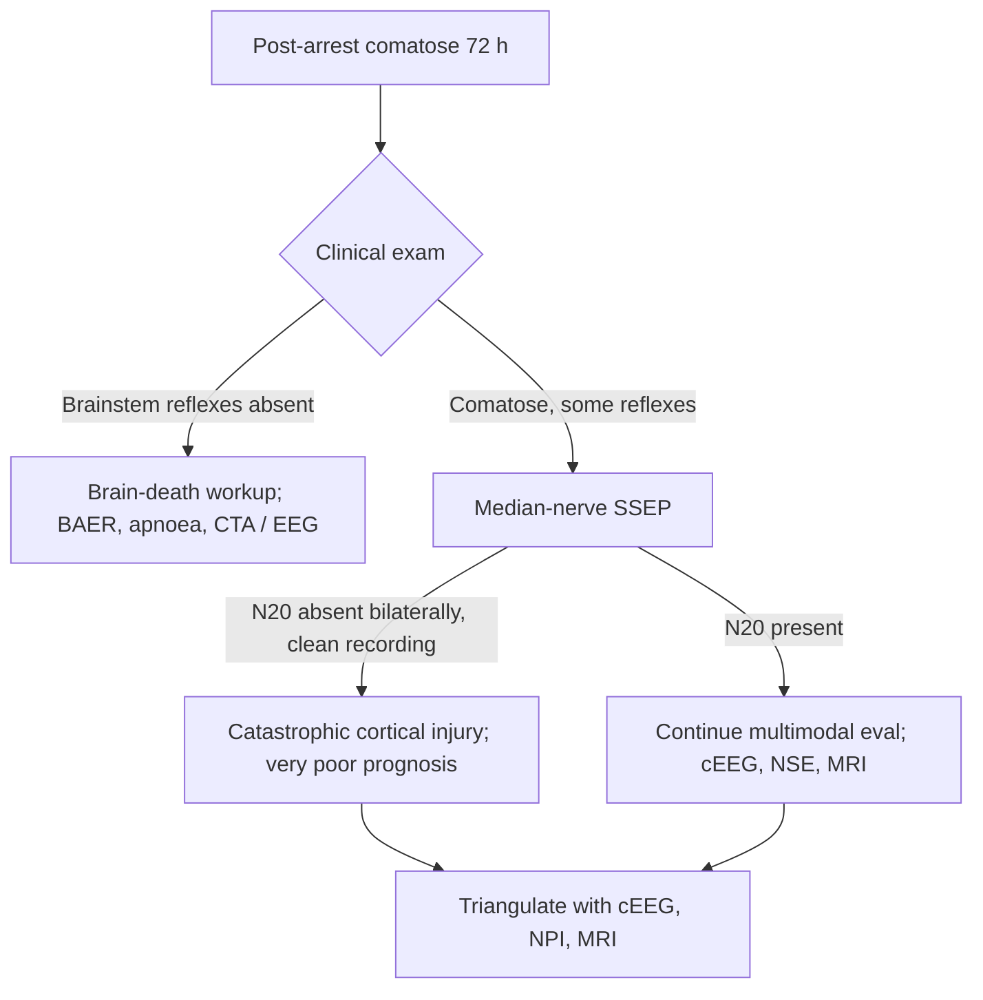

<Callout type="reference">
**Acronyms used on this page**

- **EP**: evoked potential
- **SSEP**: somatosensory evoked potential
- **BAER / BAEP / ABR**: brainstem auditory evoked response / potential, auditory brainstem response
- **VEP**: visual evoked potential
- **MEP**: motor evoked potential (intraoperative)
- **N20**: cortical somatosensory peak at ~20 ms post-stimulation, generated in the primary somatosensory cortex
- **P14**: subcortical SSEP peak generated near the cervicomedullary junction
- **N9 / N13**: peripheral / cervical SSEP peaks (brachial plexus / dorsal columns)
- **Waves I–V**: BAER peaks I (cochlear nerve), II (cochlear nucleus), III (superior olivary complex), IV (lateral lemniscus), V (inferior colliculus)
- **IPL**: interpeak latency (e.g., I–V, I–III, III–V)
- **HIE**: hypoxic-ischaemic encephalopathy · **TBI**: traumatic brain injury
- **TTM / TH**: targeted temperature management / therapeutic hypothermia
- **ICU / PICU / NICU**: intensive care / pediatric / neonatal intensive care unit
- **AAN / ESICM / AHA**: American Academy of Neurology / European Society of Intensive Care Medicine / American Heart Association
- **MMM / MNM**: multimodal monitoring / multimodal neuromonitoring
</Callout>

<TldrCard>
**The 60-second version.** Evoked potentials are stimulus-locked, time-averaged neurophysiology recordings that test specific sensory and motor pathways. The two ICU workhorses are the **median-nerve SSEP** (tests the dorsal-column to cortex pathway; the cortical **N20** peak is the bedside read) and the **brainstem auditory evoked response** (tests cochlea to midbrain; waves I–V). In the comatose post-arrest or severe TBI patient, **bilateral absence of N20** at 24–72 hours, combined with a clean technical recording, is the single most specific bedside test for catastrophic cortical injury (false-positive rate < 1% in well-conducted series). BAER tests brainstem integrity and is used in brain-death determination and intraoperative monitoring. Evoked potentials are **prognostic, not therapeutic**, and they require a trained electrophysiologist and clean recording conditions. Pediatric data are robust for HIE and post-arrest applications; less so for severe TBI prognostication.
</TldrCard>

## 1. Bedside vignettes: why this matters

### Vignette A. Post-arrest 5-year-old at 72 hours

A 5-year-old after a 20-minute submersion arrest. Day 3, off cooling, off sedation. Pupils equal, sluggish. Bilateral motor extension to pain. The family asks for a prognosis. The neurophysiology team records median-nerve SSEPs: **bilateral N20 absent**; peripheral N9 and cervical N13 present (technical recording clean). Combined with the neurological exam and a markedly suppressed cEEG, the prognosis is communicated as poor. The decision around WLST is informed, not made, by this single test. <Cite id="amorim2022" /> <Cite id="topjian2021aha_pediatric" /> <Cite id="naim2023_brain_injury_pccm" />

### Vignette B. Adolescent brain-death evaluation

A 16-year-old with a devastating cerebral haemorrhage from a ruptured AVM. Clinical exam is consistent with brain death. The team plans the formal determination. BAER recording: **wave I present, waves III–V absent bilaterally**, the pattern of brainstem electrophysiologic silence. This is consistent with the clinical findings and supports the determination, but it does not replace the apnoea test and the clinical examination required by the World Brain Death Project framework. <Cite id="greer2020_braindeath" /> <Cite id="nakagawa2011peds_bd" />

### Vignette C. Neonatal HIE, the BAER threshold story

A 38-week neonate with severe HIE, day 3 post-rewarming. BAER recorded as part of the neuro-prognostication workup: **wave V present but markedly delayed** (latency 8.2 ms, expected < 6.5 ms for term newborn); waves I and III preserved. This represents subcortical conduction delay typical of moderate-to-severe HIE; outcome at 18 months tracks with this finding, less catastrophic than wave V loss, more concerning than normal latencies. Pair with the aEEG, MRI, and clinical exam for the full prognostic call. <Cite id="shankaran2005hie_nichd" /> <Cite id="pressler2017neonatal" />

---

## 2. What evoked potentials are, and what they are not

Evoked potentials are **stimulus-locked**, **time-averaged** electrophysiological signals: the brain's response to a defined sensory stimulus, recorded from scalp or cortical electrodes, with the random EEG noise averaged out by repeating the stimulus hundreds to thousands of times.

The mathematical idea:

```math
\text{SSEP}(t) = \frac{1}{N} \sum_{i=1}^{N} \text{EEG}_i(t)
```

where each `EEG_i(t)` is the recorded scalp signal in the 50–500 ms window following the i-th stimulus, and N is typically 500–2000 stimuli per channel.

The averaging works because the **evoked response is time-locked** to the stimulus (it occurs at the same latency on each trial) and the **EEG background is not**: the random EEG signals average toward zero, while the stimulus-locked response sums coherently.

### 2.1 The SSEP

- **Stimulus**: 4-Hz electrical pulse at the median nerve at the wrist (or posterior tibial nerve at the ankle). Current 5–25 mA, sufficient to produce a small thumb twitch.
- **Recording sites**: peripheral (Erb's point, N9), cervical (over C7, N13), and cortical (over the contralateral parietal scalp, C3' or C4', N20 and N20-P25).
- **Pathway tested**: peripheral nerve → dorsal columns of the spinal cord → medial lemniscus → ventroposterolateral thalamus → primary somatosensory cortex (S1).
- **Bedside read**: **N20 present** (pathway intact, cortical function present); **N20 absent** in a comatose patient with normal peripheral and cervical recordings is highly specific for catastrophic cortical injury.

### 2.2 The BAER

- **Stimulus**: click (60–80 dB SPL), 11.1-Hz rate, monaural with contralateral masking.
- **Recording sites**: vertex (Cz) referenced to ipsilateral mastoid.
- **Pathway tested**: cochlea → cochlear nerve → cochlear nucleus → superior olivary complex → lateral lemniscus → inferior colliculus.
- **Five canonical waves** (I–V): I from cochlear nerve, II from cochlear nucleus, III from superior olivary, IV from lateral lemniscus, V from inferior colliculus.
- **Bedside read**: progressive loss of waves III→V is the pattern of progressive brainstem failure; isolated wave I with absent III–V is consistent with brainstem electrophysiologic silence.

### What EPs do well

- **Pathway specificity**: SSEPs test the dorsal-column-cortex pathway; BAERs test the cochlea-midbrain pathway. Each is highly specific for its pathway.
- **Robustness to sedation**: SSEPs and BAERs are far less affected by sedation than EEG; you can interpret them in deeply sedated patients.
- **Quantitative endpoints**: presence/absence of N20 is binary and inter-rater agreement is high.
- **Post-arrest prognostication**: bilateral absent N20 is the most specific bedside test for catastrophic cortical injury after cardiac arrest. <Cite id="amorim2022" /> <Cite id="topjian2021aha_pediatric" />

### What EPs cannot do

- **Test the whole brain**: SSEPs test the dorsal-column-cortex pathway only; large frontal or temporal lesions can be present with preserved N20.
- **Detect seizures**: EPs are stimulus-locked; ictal activity is not.
- **Be used in isolation**: prognostic calls always combine EP with clinical exam, cEEG, imaging, and (for post-arrest) NPI.
- **Be performed reliably with movement / shivering / agitation**: technical quality is everything.
- **Test motor pathway non-invasively** in the ICU: MEPs are an intraoperative tool, not a bedside ICU monitor.

<Pearl>
**Bilateral absence of N20 at 72 hours after cardiac arrest, with technically clean recordings, is the highest-specificity bedside test for catastrophic cortical injury.** False positives in well-conducted series are < 1%. This is one of the strongest single data points in modern neuroprognostication; treat it accordingly.
</Pearl>

<Pediatric>
- **Pediatric SSEPs**: N20 latencies vary with age; expected latency increases from ~12 ms in adults to ~16–18 ms in young children due to slower conduction in less myelinated fibres, then matures to adult values by 5–8 years.
- **Pediatric BAERs**: wave V latency in term newborns is ~6.5 ms, reaches adult ~5.5 ms by ~18 months. Used routinely in newborn hearing screening (otoacoustic emissions plus BAER).
- **Pediatric post-arrest SSEP**: the bilateral-absent-N20 finding has similar specificity in children as in adults, with multiple pediatric series confirming the prognostic value.
- **Reading age-correct latency tables** is essential; using adult cutoffs in young children produces false-positive prolongations.
</Pediatric>

---

## 3. Anatomy and electrode placement

<Figure
  caption="Left panel: SSEP pathway from median nerve at the wrist (N9 at Erb's point) → spinal cord dorsal columns (N13 at the cervicomedullary junction) → medial lemniscus → ventroposterolateral thalamus → primary somatosensory cortex (N20 over the contralateral C3' or C4' scalp). Right panel: BAER pathway from cochlea (wave I) → cochlear nucleus (II) → superior olivary complex (III) → lateral lemniscus (IV) → inferior colliculus (V). Loss of N20 with preserved N9 and N13 localises the lesion to the thalamocortical pathway or cortex; progressive loss of BAER waves III–V localises to brainstem dysfunction."
  attribution="MNM-Edu, original schematic."
  label="Fig. 1"
>
  <EvokedPotentialPathway />
</Figure>

### 3.1 SSEP electrode placement

| Channel | Location | Generator |
|---|---|---|
| **N9 (Erb's point)** | Supraclavicular fossa, ipsilateral | Brachial plexus |
| **N13 (cervical)** | Over C7 spinous process | Dorsal columns / cervicomedullary junction |
| **P14 (subcortical)** | Over occiput, referenced to Erb's | Cervicomedullary / lower brainstem |
| **N20 / P25 (cortical)** | C3' or C4' (2 cm posterior to C3/C4) | Primary somatosensory cortex (S1) |

**Median-nerve SSEP** is the standard for ICU coma prognostication. Posterior tibial nerve SSEPs (recorded at L4 and over the vertex) can be added for testing the long ascending pathway.

### 3.2 BAER electrode placement

| Channel | Location | Function |
|---|---|---|
| Cz | Vertex | Active recording site |
| Ipsilateral mastoid (A1 or A2) | Mastoid behind the ear of stimulus | Reference |
| Forehead (Fpz) | Forehead midline | Ground |

Stimulus delivered monaurally through an insert earphone, contralateral ear masked with white noise.

### 3.3 Pediatric considerations

- **Smaller heads** require careful electrode positioning; the C3' / C4' landmarks scale with head circumference.
- **Higher impedances** in neonatal skin; longer skin prep tolerable.
- **Stimulus intensity**: titrate to a small thumb twitch (median) or visible foot twitch (tibial); lower currents than adult.
- **Click intensity for BAER** in newborns: 60 dB nHL is appropriate for screening; 80 dB nHL for full brainstem evaluation.

---

## 4. The signal: waveform anatomy

### 4.1 SSEP waveform

The median-nerve SSEP, recorded over the contralateral C3' or C4' scalp referenced to Fz, shows a characteristic peak structure:

| Peak | Latency (adult) | Polarity | Generator |
|---|---|---|---|
| N9 | 9–11 ms | Negative | Brachial plexus (Erb's point) |
| N13 | 13–15 ms | Negative | Cervical / dorsal columns |
| P14 | 14–16 ms | Positive | Cervicomedullary junction |
| **N20** | **18–22 ms** | **Negative** | **Primary somatosensory cortex (S1)** |
| P25 | 25–28 ms | Positive | Secondary cortical processing |

The **N20-P25 complex** is the bedside cortical read. The amplitude (typically 1–5 µV) is small but reproducible across two independent recordings of 500–2000 stimuli each.

### 4.2 BAER waveform

The auditory click produces five waves in the first 10 ms post-stimulus:

| Wave | Latency (adult) | Latency (term newborn) | Generator |
|---|---|---|---|
| I | 1.5–2.0 ms | 2.0–2.5 ms | Cochlear nerve |
| II | 2.5–3.0 ms | 3.0–3.5 ms | Cochlear nucleus |
| III | 3.5–4.0 ms | 4.5–5.0 ms | Superior olivary complex |
| IV | 4.5–5.0 ms | 5.5–6.0 ms | Lateral lemniscus |
| V | 5.5–6.0 ms | 6.0–6.5 ms | Inferior colliculus |

The **interpeak latencies** (I–III, III–V, I–V) carry the localising information:

- **Prolonged I–III**: lower brainstem (pontomedullary) lesion
- **Prolonged III–V**: upper brainstem (pontomesencephalic) lesion
- **Prolonged I–V**: overall brainstem conduction delay
- **Loss of III–V with preserved I**: brainstem electrophysiologic silence

---

## 5. The numbers to record: the EP six-pack

| Variable | Symbol | What to record |
|---|---|---|
| **N20 latency, both sides** | N20 L / R | Present, absent, or prolonged |
| **N20 amplitude** | N20 amp | µV (reproducibility check) |
| **Peripheral / cervical recording** | N9, N13 | Confirm technical quality |
| **BAER wave latencies** | I, III, V (and IV) | Present, absent, or prolonged per side |
| **Interpeak latencies** | I–III, III–V, I–V | The localising data |
| **Technical quality** | Stimulus intensity, electrode impedance, number of averages, replication | Required to interpret findings |

Every interpretation pairs the EP read with **time since insult**, **temperature** (TTM affects latencies), **sedation regimen**, and the **clinical exam**.

---

## 6. What is normal? Age-banded reference

### 6.1 SSEP latencies

| Age | N9 (ms) | N13 (ms) | N20 (ms) |
|---|---|---|---|
| Term newborn | 11–13 | 17–19 | 26–32 |
| 6 months | 10–12 | 15–17 | 23–28 |
| 1 year | 9–11 | 14–16 | 21–25 |
| 3 years | 9–11 | 13–15 | 20–23 |
| 5–10 years | 9–11 | 12–14 | 19–22 |
| Adolescent | 9–11 | 12–14 | 18–22 |
| Adult | 9–11 | 12–14 | 18–22 |

### 6.2 BAER latencies

| Age | Wave I (ms) | Wave V (ms) | I–V interpeak |
|---|---|---|---|
| Term newborn | 2.0–2.5 | 6.0–6.5 | 4.0–4.5 |
| 6 months | 1.7–2.2 | 5.8–6.2 | 4.0–4.5 |
| 1 year | 1.6–2.0 | 5.6–6.0 | 4.0–4.5 |
| 2 years | 1.5–2.0 | 5.5–5.8 | 4.0 |
| 5 years | 1.5–2.0 | 5.5–5.8 | 4.0 |
| Adult | 1.5–2.0 | 5.5–6.0 | 4.0 |

Sources: <Cite id="logi2003" /> <Cite id="amorim2022" /> <Cite id="marshall2020" />. Latencies depend on stimulus intensity, body temperature, and (in BAER) middle-ear status.

<Pediatric>
**Pediatric latencies vary substantially with age** due to ongoing myelination. Using adult cutoffs in young children produces false-positive prolongations. Every paediatric EP report should cite the age-appropriate normative reference range; trend within-patient where serial recordings exist.
</Pediatric>

---

## 7. What is abnormal? Pattern library

### 7.1 SSEP patterns

| Pattern | Localisation | Bedside meaning |
|---|---|---|
| All peaks present, normal latencies | Pathway intact | Reassuring, no localising information |
| N20 prolonged > 2 SD | Thalamocortical or cortical | Mild dysfunction; trend |
| **N20 absent bilaterally with preserved N9 and N13** | **Thalamocortical or cortical, bilateral** | **Catastrophic cortical injury; specific in post-arrest** |
| N20 absent unilaterally with preserved N9 and N13 | Contralateral hemisphere lesion | Stroke or focal injury |
| All peaks absent (including N9) | Technical failure or systemic deafferentation | Re-record; check stimulus delivery |
| N13 absent with preserved N9 | Cervical cord lesion above C7 | Spinal cord injury context |
| N20 amplitude reduced > 50% from baseline | Evolving cortical dysfunction | Trend; serial recordings |

### 7.2 BAER patterns

| Pattern | Localisation | Bedside meaning |
|---|---|---|
| All waves present, normal latencies | Brainstem intact | Reassuring |
| Wave V prolonged | Upper brainstem | Mild dysfunction |
| Wave III prolonged | Lower brainstem | Pontine dysfunction |
| Waves III–V absent, wave I preserved | Brainstem electrophysiologic silence | Supports brain death; not diagnostic alone |
| All waves absent | Cochlear / peripheral or technical | Re-record; check ear |
| Wave I absent with preserved later waves | Cochlear dysfunction | Hearing-loss workup |

### Decision tree: post-arrest comatose, EP role



---

## 8. Try it: interactive widget

<WidgetEmbed name="SSEPViewer" />

---

## 9. Management: how EP findings change decisions

### 9.1 Post-cardiac-arrest prognostication

The 72-hour timepoint (after rewarming and sedation washout) is the canonical EP-driven workflow:

1. **Stabilise the patient**: complete TTM, allow ≥ 24 h off sedation, treat fever and electrolyte derangements.
2. **Clinical exam**: pupil reactivity, corneal reflexes, motor response, NPI.
3. **Record SSEP** with adequate technical quality: stimulus to elicit small thumb twitch, ≥ 500 stimuli per recording, replicated.
4. **Read N20 in context**: present (continue multimodal evaluation); absent bilaterally with clean recording (high-specificity sign for poor outcome).
5. **Triangulate**: combine SSEP with cEEG (suppression, burst-suppression, malignant patterns), NPI (< 2), NSE (neuron-specific enolase), MRI (DWI changes), and clinical exam.
6. **WLST discussion**: bilateral absent N20 plus suppressed cEEG plus NPI < 2 plus malignant MRI is the most reliable bedside dataset for predicting catastrophic outcome; the conversation with family is informed, not made, by this dataset. <Cite id="amorim2022" /> <Cite id="topjian2021aha_pediatric" /> <Cite id="naim2023_brain_injury_pccm" />

### 9.2 Brain-death determination

BAER may be used as **ancillary** electrophysiologic evidence of brainstem silence; the formal determination requires the clinical exam and the apnoea test per the World Brain Death Project framework, with ancillary tests (CTA, TCD, EEG, or BAER) used when the clinical exam cannot be completed. <Cite id="greer2020_braindeath" /> <Cite id="nakagawa2011peds_bd" />

### 9.3 Intraoperative monitoring (brief mention)

SSEPs and MEPs are standard tools in spine surgery, brainstem surgery, and aortic surgery. The ICU role of these intraoperative EPs is limited to the immediate post-operative recording when intraoperative changes raise concern. <Cite id="marshall2020" />

<Callout type="caveat">
**Decision support, not a clinical protocol.** Every EP threshold and timing above is age-, centre-, and protocol-dependent. Pair with clinical exam, cEEG, NPI, NSE, and imaging; defer to your institutional neuroprognostication pathway and the AAN / ESICM / AHA guideline sets.
</Callout>

<AlgorithmDisclaimer />

---

## 10. Clinical contexts

### 10.1 Post-cardiac-arrest

The strongest evidence base. Bilateral absent N20 at 72 h post-arrest, with technically clean recordings, has a false-positive rate < 1% for predicting unfavourable neurological outcome (CPC 3–5). The TTM era has not changed this: the test remains highly specific, with sensitivity around 30–50% (many poor-outcome patients have preserved N20). Pediatric evidence supports the same paradigm; THAPCA and AHA recommend EPs in the post-arrest neuroprognostication bundle. <Cite id="amorim2022" /> <Cite id="topjian2021aha_pediatric" /> <Cite id="moler2015thapca_oh" /> <Cite id="naim2023_brain_injury_pccm" />

### 10.2 Severe TBI

EPs in severe TBI predict outcome but less specifically than in cardiac arrest. Bilateral absent N20 in pediatric severe TBI is associated with poor outcome, but false-positive rates are higher than in post-arrest due to focal injury patterns. EPs in TBI are typically used in conjunction with imaging and clinical exam rather than as a standalone prognostic test. <Cite id="logi2003" /> <Cite id="kochanek2019_pbtf4" /> <Cite id="marshall2020" />

### 10.3 HIE / neonatal post-arrest

BAER is used routinely as part of the neuroprognostic workup for moderate-to-severe HIE. Prolonged or absent wave V is associated with worse outcomes; BAER changes lag aEEG and clinical findings. The combined bundle of aEEG, BAER, MRI, and clinical exam is the standard for term neonatal HIE prognosis. <Cite id="shankaran2005hie_nichd" /> <Cite id="pressler2017neonatal" />

### 10.4 Aneurysmal SAH and DCI

EPs in SAH are research-grade for DCI detection; the most sensitive electrophysiological tool for DCI is **qEEG (alpha-delta ratio)**. SSEPs may identify large MCA territory ischaemia (loss of N20 over the affected hemisphere) but are too coarse for early DCI detection. <Cite id="hoh2023sah_aha" /> <Cite id="rass2021dci_review" /> <Cite id="sandsmark2024_qeeg_dci" />

### 10.5 Pediatric arterial ischaemic stroke

Unilateral absent N20 in a child with large MCA-territory infarct provides electrophysiologic confirmation of cortical territory loss. Used as adjunct to MRI for prognostic discussion in the post-thrombectomy or natural-history setting. <Cite id="ferriero2019aha_pedstroke" /> <Cite id="sun2020_pediatric_thrombectomy" />

### 10.6 Pediatric ECMO

Routine EPs are uncommon on ECMO; the modality is reserved for prognostic workup after a suspected neurological event (stroke, haemorrhage) detected on imaging or aEEG. <Cite id="lorusso2017_elso_neuro" /> <Cite id="cho2024_ecmo_outcomes" />

### 10.7 Bacterial meningitis / encephalitis

BAER is used in suspected brainstem encephalitis and in severe meningitis with brainstem involvement; SSEPs are used selectively. The role is to localise brainstem versus cortical dysfunction in the comatose patient. <Cite id="tunkel2004_idsa_meningitis" /> <Cite id="tunkel2017idsa_encephalitis" />

### 10.8 Brain-death determination

BAER as ancillary testing has limited specificity for brain death (cochlear preservation, isolated wave I, may persist in some brain-dead patients). The AAN / WBDP framework lists CTA, TCD, and conventional EEG as preferred ancillary tests; BAER is supportive but not preferred. <Cite id="greer2020_braindeath" /> <Cite id="nakagawa2011peds_bd" />

### 10.9 Refractory status epilepticus

EPs are not a primary tool in SE management. Post-SE, EPs may be used in prognostication when prolonged coma follows refractory SE. <Cite id="glauser2016esett" /> <Cite id="kapur2019eclipse_se" />

---

## 11. Multimodal integration: EPs in the MMM/MNM stack

<Figure
  src="/images/evoked-potentials/ssep-baer-pathway.svg"
  alt="EPs in multimodal context"
  caption="Evoked potentials are a structured, time-locked complement to the continuous monitoring modalities. In post-cardiac-arrest, SSEP plus cEEG plus NPI plus MRI form the canonical 72-h prognostic bundle. In brain-death determination, BAER may supplement (but does not replace) the clinical exam and apnoea test. In HIE, BAER plus aEEG plus MRI is the neonatal neuroprognostic bundle. In severe TBI, SSEPs add to the multimodal prognostic dataset."
  attribution="MNM-Edu, original schematic. SVG placeholder."
  label="Fig. 2"
/>

| Pair with… | What you gain | Worked scenario |
|---|---|---|
| **cEEG / aEEG** | Cortical electrophysiology + pathway-specific EP | [Post-arrest prognostic bundle](/integration/discordance-triage/) |
| **NPI / pupillometry** | Brainstem function + EP cortical / brainstem read | [Brain death and ancillary testing](/integration/brain-death-mnm/) |
| **MRI** | Structural correlate of EP findings | [Post-arrest prognostic bundle](/integration/discordance-triage/) |
| **NSE / serum biomarkers** | Chemical / electrophysiological / structural triangulation | Post-cardiac-arrest workup |
| **Clinical exam (GCS, FOUR, brainstem reflexes)** | The foundation; EPs add specificity in specific scenarios | Every coma evaluation |
| **TCD** | Cerebral perfusion + electrophysiological function | [Brain death and ancillary testing](/integration/brain-death-mnm/) |

<Cite id="figaji2025_mmm_pediatric_consensus" /> <Cite id="helbok2024_pediatric_mmm" /> <Cite id="tasker2023mnm" />

---

<DeepDive>

## 12. Setup and technique

### 12.1 Equipment

- **EP machine**: Cadwell, Natus, Nicolet, or integrated multimodal device with EP module.
- **Stimulator**: bipolar surface electrodes for median or tibial nerve stimulation; insert earphones for BAER.
- **Recording electrodes**: gold-cup or disposable hydrogel; impedance < 5 kΩ.
- **Trained electrophysiologist**: every ICU EP requires a trained operator. Inter-rater reliability for "absent N20" requires technical expertise; the false-positive rate of < 1% is contingent on this.

### 12.2 SSEP placement: 6-step protocol

1. **Skin prep** at recording sites: C3' or C4' (2 cm posterior to C3/C4), C7 (cervical), Erb's point (supraclavicular fossa), reference (Fz), ground.
2. **Apply electrodes**: gold cup with conductive paste, secured with collodion or hydrogel pads.
3. **Verify impedance**: < 5 kΩ at all sites.
4. **Stimulator placement**: bipolar electrodes over the median nerve at the wrist, cathode proximal. Verify thumb twitch with 5-mA test pulse.
5. **Record**: 500–2000 stimuli at 4 Hz; replicate with a second independent run; band-pass 30–3000 Hz.
6. **Interpret**: identify N9, N13, N20 latencies and amplitudes; compare with age-appropriate norms; document reproducibility.

### 12.3 BAER placement: 6-step protocol

1. **Skin prep** at Cz (vertex), ipsilateral mastoid (A1 or A2), ground (Fpz).
2. **Apply electrodes**: gold cup with conductive paste; impedance < 5 kΩ.
3. **Otoscopic exam**: clear external auditory canal of cerumen; check tympanic membrane.
4. **Insert earphone**: deliver clicks monaurally at 80 dB nHL, contralateral ear masked with 65 dB nHL white noise.
5. **Record**: 2000 stimuli at 11.1 Hz; band-pass 100–3000 Hz; repeat for the other ear.
6. **Interpret**: identify waves I, III, V latencies and interpeak intervals; compare with age-appropriate norms.

### 12.4 Quality assurance

- **Replication**: every EP recording is replicated with a second independent run; consistent peak presence across replications is required to call a wave "present".
- **Stimulus intensity**: titrate to elicit small thumb twitch (SSEP) or stable wave I (BAER).
- **Temperature**: hypothermia prolongs all latencies; record patient temperature at the time of test.
- **Sedation**: SSEPs and BAERs are robust to sedation; high-dose barbiturate or volatile anaesthetic can flatten responses.

### 12.5 Common technical pitfalls

- **Lead-off** at the cortical site produces "absent N20" that is technical, not clinical.
- **Stimulus too weak**: produces small or absent N9; re-titrate.
- **High impedance**: introduces 50/60-Hz mains contamination.
- **Patient movement / shivering**: contaminates the average; pause and re-record.
- **Ear obstruction** for BAER: cerumen or middle-ear effusion produces "absent waves" that are conductive, not central.

### 12.6 Documentation

The EP report should include: indication, technique (stimulus parameters, recording montage, number of averages, replication), patient temperature and sedation regimen, latency and amplitude of each peak, comparison with age-appropriate norms, interpretation, and a statement of recording quality. Without these the report cannot be acted on confidently.

</DeepDive>

---

## 13. Pitfalls

- **Technical "absent N20"**: lead-off, high impedance, weak stimulus, or movement can produce false absence. Replication and quality assurance are non-negotiable.
- **Sedation effect**: SSEPs are robust to most ICU sedation, but very high-dose barbiturate can flatten cortical responses; BAERs are even more robust.
- **Hypothermia prolongs latencies**: a cooled patient's N20 latency runs longer; correct for temperature in interpretation.
- **Pediatric latency tables**: using adult cutoffs in young children gives false-positive prolongation; always use age-appropriate norms.
- **N20 may persist after catastrophic injury**: false-negative rate is high; preserved N20 does not exclude poor outcome.
- **Single time-point can be misleading**: trends over 24–72 h are more informative than a single recording.
- **Cochlear / conductive hearing loss** produces absent BAER waves of peripheral origin; not a brainstem finding.
- **Brachial plexus injury** produces absent N9; the SSEP is uninterpretable for cortical questions.
- **Inter-observer variability** in EP interpretation is real; the test should be read by a trained electrophysiologist.
- **Over-reliance on a single test**: the post-arrest prognostic call combines SSEP, cEEG, NPI, NSE, MRI, and clinical exam; no single test should drive WLST.

---

## 14. Combine with…

- [Continuous EEG / cEEG](/modalities/eeg/): cortical electrophysiology plus pathway-specific EP.
- [Amplitude-integrated EEG](/modalities/aeeg/): bedside cortical trend plus EP for HIE.
- [Pupillometry / NPI](/modalities/pupillometry/): brainstem reflex measure plus EP brainstem read.
- [TCD](/modalities/tcd/): cerebral perfusion plus electrophysiological function.
- [Foundations: pediatric physiology](/foundations/pediatric-physiology/): why pediatric latencies differ.
- [Integration: post-arrest discordance triage](/integration/discordance-triage/): when EP, NPI, cEEG, and exam disagree.
- [Integration: brain death and ancillary testing](/integration/brain-death-mnm/): role of EPs as supportive ancillary tests.

---

<DeepDive>

## 15. Evidence summary

| Topic | Source | Grade |
|---|---|---|
| Original cortical SEP description | <Cite id="dawson1947" /> | foundational |
| SSEP in pediatric coma | <Cite id="logi2003" /> | B |
| Post-cardiac-arrest SSEP prognosis (modern review) | <Cite id="amorim2022" /> | review |
| Intraoperative EP monitoring | <Cite id="marshall2020" /> | review |
| AHA pediatric post-arrest | <Cite id="topjian2021aha_pediatric" /> | expert |
| THAPCA-OH pediatric | <Cite id="moler2015thapca_oh" /> | A |
| Pediatric brain injury post-arrest | <Cite id="naim2023_brain_injury_pccm" /> | review |
| HIE NICHD | <Cite id="shankaran2005hie_nichd" /> | A |
| Neonatal seizures (ILAE) | <Cite id="pressler2017neonatal" /> | expert |
| Pediatric severe TBI (BTF 4th ed.) | <Cite id="kochanek2019_pbtf4" /> | expert |
| Pediatric MMM consensus | <Cite id="figaji2025_mmm_pediatric_consensus" /> <Cite id="helbok2024_pediatric_mmm" /> <Cite id="tasker2023mnm" /> | expert |
| Brain-death determination | <Cite id="greer2020_braindeath" /> <Cite id="nakagawa2011peds_bd" /> | expert |
| Pediatric AIS / thrombectomy | <Cite id="ferriero2019aha_pedstroke" /> <Cite id="sun2020_pediatric_thrombectomy" /> | expert |
| Pediatric neurocritical care review | <Cite id="tasker2023_pccm_review" /> | review |
| ECMO neuromonitoring | <Cite id="lorusso2017_elso_neuro" /> <Cite id="cho2024_ecmo_outcomes" /> | C |

## 16. Recent literature (2022–2025)

- **Amorim 2022 (review)**: contemporary review of SSEP and EEG in post-arrest prognostication; bilateral absent N20 remains the highest-specificity bedside marker. <Cite id="amorim2022" />
- **Topjian 2021 AHA pediatric**: SSEP recommended at 72 h as part of the post-arrest neuroprognostic bundle in pediatric patients. <Cite id="topjian2021aha_pediatric" />
- **Naim 2023 (pediatric brain injury post-arrest review)**: integrates EPs into the broader post-arrest multimodal monitoring stack. <Cite id="naim2023_brain_injury_pccm" />
- **Pediatric MMM consensus (Figaji 2025)**: positions EPs as tier-2 modality with prognostic role in post-arrest and brain-death contexts. <Cite id="figaji2025_mmm_pediatric_consensus" />
- **Brain-death framework (Greer 2020 World Brain Death Project)**: clarifies the role of ancillary tests including BAER; emphasises clinical exam plus apnoea test as primary. <Cite id="greer2020_braindeath" />
- **Tasker 2023 (pediatric neurocritical care review)**: lists EPs as a tier-2 modality with HIE, post-arrest, and brain-death applications. <Cite id="tasker2023_pccm_review" />

</DeepDive>

---

## 17. Self-check

<Quiz
  questions={[
    {
      id: 'q1',
      prompt: 'A 5-year-old comatose at 72 hours post-cardiac arrest (15-minute submersion). Off cooling, off sedation, pupils equal and sluggish. Median-nerve SSEP recording shows: N9 and N13 present and reproducible bilaterally, but N20 absent on both sides with technically clean recording. cEEG shows generalised suppression. Best interpretation?',
      options: [
        { id: 'a', label: 'Technical artefact; repeat the SSEP' },
        { id: 'b', label: 'Bilateral absent N20 with preserved peripheral and cervical recordings at 72 h post-arrest, combined with suppressed cEEG, is the highest-specificity bedside marker for catastrophic cortical injury' },
        { id: 'c', label: 'Brain death; proceed to apnoea test' },
        { id: 'd', label: 'Wait 24 hours and re-test' },
      ],
      answer: 'b',
      explanation: 'The combination of bilateral absent N20 with preserved N9 and N13 (confirming technically clean recording) at 72 hours post-arrest, paired with suppressed cEEG, is the most reliable bedside electrophysiological dataset predicting catastrophic cortical injury. False-positive rate < 1% in well-conducted series. This is not brain death (brainstem reflexes may be partly preserved); the apnoea test addresses that question separately. The data inform the family discussion and WLST consideration, in conjunction with NPI, MRI, NSE, and clinical exam.',
    },
    {
      id: 'q2',
      prompt: 'A 38-week neonate post-rewarming from HIE cooling, day 4 of life. BAER shows wave I latency 2.3 ms (normal), wave V latency 8.0 ms (markedly prolonged; normal < 6.5 ms for term newborn). Interpretation?',
      options: [
        { id: 'a', label: 'Cochlear hearing loss' },
        { id: 'b', label: 'Normal pattern for term newborn' },
        { id: 'c', label: 'Brainstem conduction delay (prolonged I–V interpeak latency) consistent with moderate-to-severe HIE; pair with aEEG, MRI, clinical exam for prognosis' },
        { id: 'd', label: 'Brain death' },
      ],
      answer: 'c',
      explanation: 'Preserved wave I (cochlear nerve, peripheral) with markedly prolonged wave V (inferior colliculus) indicates brainstem conduction delay, not peripheral hearing loss (which would absent wave I). The interpeak latency I–V is prolonged (5.7 ms vs normal 4.0–4.5 ms), localising the problem to the brainstem conduction pathway. This pattern is associated with moderate-to-severe HIE and worse neurodevelopmental outcomes than normal BAER. Combine with aEEG, MRI at 4–7 days, and clinical exam for the neuroprognostic call.',
    },
    {
      id: 'q3',
      prompt: 'A 16-year-old severe TBI, day 3, on cisatracurium and midazolam infusions, BIS 38. SSEPs are recorded as part of prognostic workup. N20 is present bilaterally with normal latencies and amplitudes. What does this finding tell you?',
      options: [
        { id: 'a', label: 'Patient will have a good outcome' },
        { id: 'b', label: 'Excludes catastrophic cortical injury along the median nerve / dorsal column / S1 pathway; does not predict overall outcome; pair with cEEG, ICP, PRx, MRI, and clinical exam' },
        { id: 'c', label: 'SSEP is invalid under paralysis and sedation' },
        { id: 'd', label: 'Indicates brain death' },
      ],
      answer: 'b',
      explanation: 'SSEPs are robust to paralysis and most sedation regimens. Preserved bilateral N20 indicates that the median nerve to dorsal column to thalamocortical to S1 pathway is intact. It does NOT predict overall outcome because (a) most poor-outcome TBI patients have preserved N20 (low sensitivity) and (b) large frontal or temporal lesions can be present with preserved N20 (the pathway tested is parietal). Use the multimodal dataset for the prognostic call; SSEPs in severe TBI add specificity but are not by themselves prognostic.',
    },
  ]}
/>
