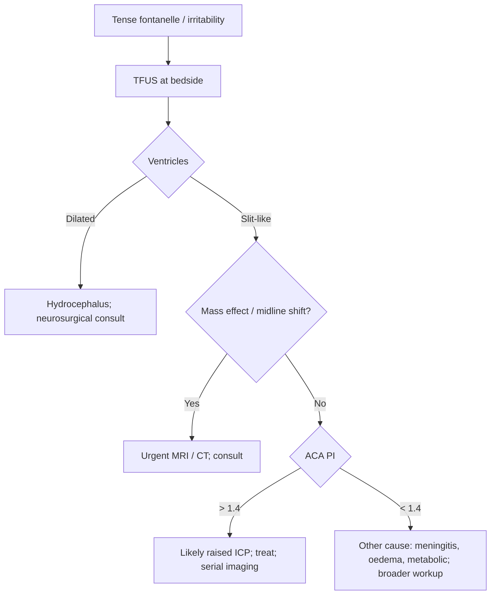

<Callout type="reference">
**Acronyms used on this page**

- **TFUS**: through-fontanelle (cranial) ultrasound
- **IVH**: intraventricular haemorrhage
- **PVL**: periventricular leukomalacia
- **PVHI**: periventricular haemorrhagic infarction
- **VI / AHW**: ventricular index / anterior horn width (Levene)
- **TOD**: third-occipital diameter
- **PI**: pulsatility index (TCD-Gosling, derived through fontanelle window)
- **RI**: resistive index (Pourcelot)
- **ACA / MCA / BA**: anterior / middle cerebral / basilar artery
- **HIE**: hypoxic-ischaemic encephalopathy
- **GA / PMA**: gestational age / post-menstrual age
- **NICU / PICU**: neonatal / pediatric intensive care unit
- **CSF / EVD / VPS**: cerebrospinal fluid / external ventricular drain / ventriculo-peritoneal shunt
- **MRI / CT**: magnetic resonance / computed tomography
- **MMM / MNM**: multimodal monitoring / multimodal neuromonitoring
</Callout>

<TldrCard>
**The 60-second version.** Through-fontanelle ultrasound (TFUS) is the bedside acoustic window into the infant brain. The anterior fontanelle remains a useful window until ~12–18 months of age. Coronal and sagittal sweeps survey the ventricles, periventricular white matter, basal ganglia, and posterior fossa; through-fontanelle TCD adds Doppler flow indices in the ACA and basilar artery. **Five things to look for at every study**: ventricle size (Levene VI), IVH grade (Papile I–IV), PVL, brain oedema / mass effect, and Doppler PI / RI. The strengths are zero radiation, no transport, repeatable at the bedside, and operator-skill-portable; the limits are operator dependence, fontanelle closure with age, and inability to image the convexity well. TFUS is the workhorse for serial monitoring of preterm IVH, post-asphyxial oedema in HIE, ventricular size in evolving hydrocephalus, and as a triage tool when MRI / CT is delayed.
</TldrCard>

## 1. Bedside vignettes: why this matters

### Vignette A. Preterm 26-weeker with sudden bradycardia

A 26-week, 850-g infant, day 3 of life. Acute desaturations and bradycardia overnight. Anterior fontanelle slightly tense. TFUS at the bedside: **bilateral grade III IVH with dilated ventricles** (left VI 18 mm, right 16 mm), small parenchymal echodensity in the right frontal periventricular white matter (early **PVHI** / Papile IV). Neurosurgery is consulted; serial TFUS over the next 4 days tracks ventricular dilation; an Ommaya reservoir is placed when VI reaches 22 mm. Without TFUS, this would have been a CT-and-transport day; with it, the management decision happens in the cot. <Cite id="papile1978" /> <Cite id="pressler2017neonatal" />

### Vignette B. 6-month-old with bulging fontanelle, vomiting

A previously well 6-month-old, 4 days of progressive vomiting and irritability. Anterior fontanelle bulging and tense. TFUS shows **markedly enlarged lateral and third ventricles** with effaced cisterns; an apparent posterior-fossa mass distorting the fourth ventricle. The team escalates straight to MRI without dwelling on CT; a posterior fossa tumour is confirmed and the child goes to theatre for an EVD that evening. TFUS converted an unclear clinical picture into a focused imaging plan. <Cite id="papile1978" />

### Vignette C. Term newborn, day 2, post-asphyxial HIE under cooling

A 39-week term newborn, severe HIE, day 2 of therapeutic hypothermia. The cot-side cranial ultrasound is normal: ventricles slit-like, basal ganglia echogenicity normal, no IVH. Through-fontanelle Doppler ACA: **PI 0.42, EDV 32 cm/s, MFV 75 cm/s**. The "lush" diastolic flow paradox: low PI with high EDV in early HIE means **luxury perfusion with collapsed metabolism**, a poor prognostic signature. The team waits for the MRI at day 4–7 but already has the bedside Doppler data to inform the family conversation. <Cite id="kirschen2020_pedshie_tcd" /> <Cite id="shankaran2005hie_nichd" />

---

## 2. What TFUS is, and what it is not

The infant skull has **two open fontanelles** at birth: the anterior (diamond-shaped, frontal-parietal junction, ~3 × 3 cm at term, closes 9–18 months) and the posterior (triangular, parieto-occipital, ~1 × 1 cm, closes 6–12 weeks). The anterior is the main acoustic window for routine bedside imaging.

The principle is straightforward: the fontanelle is a **window of soft tissue** rather than bone. High-frequency ultrasound (5–10 MHz curvilinear or sector probe, 7–15 MHz linear for superficial structures) penetrates through this window and returns a clear image of the brain immediately beneath. Lateral views through the temporal bone provide complementary access to the basal cisterns and middle cerebral arteries.

### What TFUS does well

- **No radiation, no contrast, no transport**: ideal for the unstable neonate.
- **Serial repeatability**: same machine, same windows, repeatable trend across days.
- **IVH grading**: the Papile classification (I–IV) was developed on TFUS and remains the standard for preterm IVH grading. <Cite id="papile1978" />
- **Ventricular size tracking**: Levene VI and anterior horn width are the bedside metrics for post-haemorrhagic hydrocephalus management.
- **Detection of PVL and PVHI**: echodensities, cystic evolution, and timing visible at the bedside.
- **Through-fontanelle Doppler**: ACA and basilar artery PI / RI as flow surrogates; the only non-invasive cerebral flow tool in the preterm.

### What TFUS cannot do

- **Image the convexity** well: the curved skull and the soft-tissue gap mean lateral cortex (and the most common cortical infarct territory) is poorly seen.
- **Resolve subtle injury**: small punctate lesions, mild PVL, mild diffuse injury require MRI.
- **Detect early HIE injury** reliably in the first 24 h: changes appear later; MRI day 4–7 is the gold standard.
- **Replace MRI** for prognostic anatomical detail.
- **Be performed after fontanelle closure**: the window narrows from ~12 months and is gone by ~18 months in most infants.

<Pearl>
**The fontanelle window is finite.** Plan for an MRI before the fontanelle closes if structural questions remain. After ~18 months the infant brain becomes a CT or MR target, not an ultrasound target.
</Pearl>

<Pediatric>
TFUS is a pediatric-only modality. The bedside utility tracks the fontanelle: open and large in preterm and term newborns (highest yield), closing in infancy (declining yield), absent by 18 months. The skill of the operator is the dominant determinant of image quality and interpretation.
</Pediatric>

---

## 3. Anatomy and windows

<Figure
  src="/images/fontanelle-us/transfontanellar.svg"
  alt="Coronal and sagittal TFUS sweeps through the anterior fontanelle; landmarks for ventricles, IVH, basal ganglia, posterior fossa"
  caption="Through-fontanelle ultrasound windows. The anterior fontanelle (diamond, frontal-parietal junction) provides the primary acoustic window. The probe is held over the fontanelle and swept first coronally (anterior to posterior, six standard planes) and then sagittally (midline plus right and left parasagittal). The temporal window (lateral, above the zygomatic arch) supplements with views of the basal cisterns, brainstem, and Circle of Willis. The posterior fontanelle is small but useful for occipital horn evaluation in the first weeks of life. Standard landmarks in the coronal plane: frontal horns and septum pellucidum (anterior), bodies of lateral ventricles and third ventricle (middle), trigones / atria and choroid plexus (posterior), brainstem and cerebellum (most posterior). Sagittal landmarks: midline (corpus callosum, third and fourth ventricles, cerebellar vermis), parasagittal (lateral ventricle in full length, caudothalamic groove)."
  attribution="MNM-Edu, original schematic. SVG placeholder."
  label="Fig. 1"
/>

### 3.1 The anterior fontanelle

The anterior fontanelle, ~3 × 3 cm at term, narrows progressively and closes between 9 and 18 months. It is the **primary window** for routine TFUS.

### 3.2 The temporal window

Above the zygomatic arch, in front of the tragus, the thin temporal bone permits ultrasound access. This is also the principal TCD window in adults. In infants it complements the anterior fontanelle by providing views of the basal cisterns, brainstem, and Circle of Willis.

### 3.3 The posterior fontanelle

Small (~1 cm), triangular, closes 6–12 weeks. Useful for occipital horn views in the first month of life.

### 3.4 The mastoid window

Below and behind the ear; provides views of the posterior fossa, including the fourth ventricle and cerebellar hemispheres. Useful when the anterior fontanelle view is suboptimal.

### 3.5 Standard sweeps

Two sweeps, six planes coronal, three planes sagittal, complete a screening study:

| Plane | Landmarks |
|---|---|
| Coronal 1 (anterior) | Frontal lobes, anterior horns of lateral ventricles |
| Coronal 2 | Septum pellucidum, frontal horns, anterior third ventricle |
| Coronal 3 | Foramen of Monro, third ventricle, basal ganglia |
| Coronal 4 | Bodies of lateral ventricles, hippocampi, thalami |
| Coronal 5 | Trigones / atria, choroid plexus glomus |
| Coronal 6 (posterior) | Occipital horns, posterior parietal cortex |
| Sagittal midline | Corpus callosum, third and fourth ventricles, brainstem, vermis |
| Sagittal right parasagittal | Right lateral ventricle in full length, caudothalamic groove |
| Sagittal left parasagittal | Left lateral ventricle in full length, caudothalamic groove |

---

## 4. The signal: what TFUS shows

### 4.1 Normal anatomy

In a healthy term newborn, the lateral ventricles are slit-like, the third ventricle barely visible, the choroid plexus echogenic, the basal ganglia and thalami isoechoic with cortex, and the cerebellum normal in shape.

### 4.2 IVH (Papile grading)

The four-grade Papile classification is the standard for preterm IVH:

| Grade | TFUS appearance |
|---|---|
| I | Subependymal / germinal matrix haemorrhage only |
| II | IVH without ventricular dilation |
| III | IVH with ventricular dilation |
| IV (PVHI) | Periventricular haemorrhagic infarction (large parenchymal echodensity adjacent to ventricle) |

The acoustic shadow of fresh haemorrhage is bright (echogenic); as it matures it becomes hypoechoic and can develop cystic changes.

### 4.3 PVL

Periventricular leukomalacia progresses through stages: early echogenic foci in the periventricular white matter, evolving to cystic cavities over 2–6 weeks. Subtle PVL requires MRI confirmation; established cystic PVL is visible on TFUS.

### 4.4 Hydrocephalus / ventriculomegaly

The Levene Ventricular Index (VI) is the bedside measurement: width of the lateral ventricle at the level of the third ventricle, on a coronal view through the foramen of Monro. The 97th centile by GA defines hydrocephalus.

### 4.5 Mass effect / midline shift

Subarachnoid blood, large subdural or extradural haematomas, and tumours produce mass effect with midline shift; TFUS detects gross shift but underestimates subtle effects.

### 4.6 Through-fontanelle Doppler

A pulsed-wave Doppler gate placed over the ACA (in the interhemispheric fissure on a sagittal view) or basilar artery (in the midline sagittal posterior fossa view) generates a velocity envelope. **PI** (Gosling) and **RI** (Pourcelot) are calculated:

```math
\text{PI} = \frac{\text{PSV} - \text{EDV}}{\text{MFV}}
```

```math
\text{RI} = \frac{\text{PSV} - \text{EDV}}{\text{PSV}}
```

PI > 1.0 in a term newborn ACA suggests raised ICP or distal vasoconstriction; RI > 0.8 in a preterm is comparable. PI < 0.6 with high EDV in HIE signals luxury perfusion.

---

## 5. The numbers to record: the TFUS six-pack

| Variable | Symbol | What to record |
|---|---|---|
| Ventricular Index | VI (mm) | Coronal at foramen of Monro; compare to GA centile |
| Anterior horn width | AHW (mm) | Adjunct to VI |
| Third ventricle width | 3V (mm) | Midline sagittal |
| IVH grade | Papile I–IV | Per side |
| ACA / basilar PI and RI | PI, RI | Doppler gate, ≥ 5 cardiac cycles |
| Mass effect / midline shift | mm | Estimate; gross only |

Document study quality, fontanelle size, infant state (settled vs irritable), and the operator. Compare against the **previous study** rather than a single time point.

---

## 6. What is normal? Age- and GA-banded reference

### 6.1 Ventricular size by GA (Levene centiles)

| GA / corrected age | 50th centile VI (mm) | 97th centile VI (mm) |
|---|---|---|
| 24 weeks | 9 | 11 |
| 28 weeks | 9 | 12 |
| 32 weeks | 10 | 12.5 |
| 36 weeks | 10 | 13 |
| Term (40 weeks) | 10 | 13.5 |
| 1 month corrected | 10.5 | 14 |
| 3 months | 11 | 14.5 |

Sources: Levene normative data; <Cite id="papile1978" /> for IVH grading. A VI > 97th centile or **rising VI over serial studies** is the trigger for intervention.

### 6.2 Doppler indices by age

| Age | ACA PI | ACA RI | ACA MFV (cm/s) |
|---|---|---|---|
| Preterm 28–32 wk | 1.0–1.4 | 0.75–0.85 | 15–25 |
| Term newborn | 0.7–0.9 | 0.65–0.75 | 30–50 |
| 1–3 months | 0.6–0.8 | 0.60–0.70 | 40–65 |
| 6 months | 0.5–0.8 | 0.55–0.70 | 55–80 |
| 12 months | 0.5–0.8 | 0.55–0.70 | 65–90 |

Sources: <Cite id="bode1988" /> <Cite id="bode1988peds" /> <Cite id="obrien2015" />. ACA PI normally falls in the first 24 h of life as systemic resistance settles.

<Pediatric>
**Preterm normative ranges differ markedly** from term. A VI of 11 mm in a 26-week infant is normal; the same VI at term may already represent mild ventriculomegaly. Always use the gestational-age-banded centile table.
</Pediatric>

---

## 7. What is abnormal? Pattern library

| Pattern | Bedside meaning | What to do |
|---|---|---|
| **VI > 97th centile, isolated** | Mild ventriculomegaly | Repeat in 7–14 days; MRI if persistent |
| **VI rising over serial studies** | Progressive hydrocephalus | Neurosurgical consult; consider EVD / Ommaya |
| **Papile grade I** | Germinal matrix haemorrhage only | Routine follow-up; serial TFUS |
| **Papile grade II** | IVH without dilation | Serial TFUS; watch for evolving dilation |
| **Papile grade III** | IVH with dilation | Active management; neurosurgical involvement |
| **Papile grade IV (PVHI)** | Parenchymal haemorrhagic infarction | Major poor-prognosis lesion; aggressive management |
| **Periventricular echodensities** | Early PVL | MRI confirmation; pair with aEEG |
| **Cystic PVL** | Established PVL | Poor outcome marker; family discussion |
| **Bright basal ganglia / thalami** | HIE / metabolic injury | MRI day 4–7 for definitive characterisation |
| **Mass effect with midline shift** | Mass lesion, tumour, large haemorrhage | Escalate imaging; MRI / CT |
| **ACA PI > 1.4 in term newborn** | Raised ICP, distal vasoconstriction | Treat ICP; assess cause |
| **ACA PI < 0.6 with high EDV in HIE** | Luxury perfusion; severe HIE | Pair with aEEG, MRI; prognostic conversation |
| **Slit-like ventricles in a clinically tense infant** | Diffuse oedema | Assess fontanelle, consider raised ICP without dilation |

### Decision tree: tense fontanelle in an infant



---

## 8. Try it: interactive widget

Through-fontanelle ultrasound is operator-dependent and not easily reduced to a single interactive demo. Future expansion: an annotated image library and a virtual probe-positioning trainer. For now, refer to the [TCD waveform explorer](/modalities/tcd/) for the Doppler-envelope mechanics, which transfer directly to through-fontanelle Doppler.

---

## 9. Management: how TFUS drives bedside decisions

### 9.1 Post-haemorrhagic ventricular dilatation

The most common management driver. The progression is: IVH → ventricular dilation → arrested or progressive hydrocephalus → intervention.

1. **Serial TFUS** every 1–3 days during the first 2 weeks after IVH; weekly thereafter while stable.
2. **VI threshold**: rising > 97th centile or > 4 mm/week increase prompts neurosurgical consult.
3. **Bedside CSF removal** via lumbar puncture if accessible; **ventricular reservoir (Ommaya)** placed if persistent and VPS too premature.
4. **Definitive VPS** delayed until infant size and CSF protein permit.
5. **Re-image** at every clinical deterioration: bulging fontanelle, increased irritability, apnoeas, vomiting. <Cite id="papile1978" />

### 9.2 HIE serial monitoring

TFUS day 1–3 in HIE is often **normal or non-specific**; the value is serial:

1. Day 1: baseline; usually unremarkable.
2. Day 2–3: may show early oedema (effaced sulci, narrow ventricles, increased parenchymal echogenicity).
3. Day 4–7: MRI is the gold standard; TFUS may show evolving changes.
4. Through-fontanelle Doppler PI / RI trends over the first 72 h carry prognostic information; a luxury-perfusion pattern (low PI, high EDV) is unfavourable. <Cite id="kirschen2020_pedshie_tcd" /> <Cite id="shankaran2005hie_nichd" />

### 9.3 Acute deterioration in the infant

A previously stable infant who becomes irritable, bradycardiac, or apnoeic in the NICU / PICU gets a bedside TFUS as part of the immediate workup, in parallel with blood gas, glucose, and clinical exam. The most common findings are evolving IVH, hydrocephalus, or mass effect; the rapid bedside answer changes the next decision.

<Callout type="caveat">
**Decision support, not a clinical protocol.** Every threshold above is GA- and centre-dependent. Pair with MRI (when feasible), clinical exam, aEEG, and neurosurgical assessment; defer to your unit's preterm IVH and HIE management protocols.
</Callout>

<AlgorithmDisclaimer />

---

## 10. Clinical contexts

### 10.1 Preterm IVH and PVH

The single largest TFUS use case. Routine screening at days 3, 7, and 14 (or per local protocol) in infants < 32 weeks GA or < 1500 g identifies IVH in 20–25% (down from 40–50% in the pre-surfactant era). Serial TFUS guides Ommaya / EVD / shunt decisions. <Cite id="papile1978" /> <Cite id="pressler2017neonatal" />

### 10.2 Neonatal HIE and post-arrest

TFUS is a screening tool in HIE; MRI day 4–7 is the gold standard for prognostication. Through-fontanelle Doppler adds early information about luxury perfusion. The combined aEEG + TFUS + MRI + clinical exam bundle is the standard neonatal HIE neuroprognostic stack. <Cite id="shankaran2005hie_nichd" /> <Cite id="pressler2017neonatal" /> <Cite id="kirschen2020_pedshie_tcd" />

### 10.3 Hydrocephalus monitoring

Beyond preterm IVH, TFUS is the workhorse for serial monitoring of any infant hydrocephalus: post-meningitic, post-haemorrhagic, congenital (aqueduct stenosis), or post-tumour resection. Used to time shunt placement and to evaluate post-shunt ventricular size.

### 10.4 Bacterial meningitis

Complications of meningitis (subdural empyema, subdural effusion, ventriculitis, infarct, oedema) are visible on TFUS in the infant. TFUS is the first imaging response to a clinically deteriorating infant with meningitis, supplemented by MRI when feasible. <Cite id="tunkel2004_idsa_meningitis" /> <Cite id="vandebeek2016eu_meningitis" /> <Cite id="brouwer2010_dexamethasone_meta" />

### 10.5 Pediatric ECMO (neonatal)

Daily TFUS is part of the standard neuro-monitoring for neonates on ECMO; stroke incidence is high (8–15%) and TFUS is the bedside imaging modality of choice. New IVH or large infarct on TFUS may be a contraindication to continued anticoagulation. <Cite id="lorusso2017_elso_neuro" /> <Cite id="cho2024_ecmo_outcomes" />

### 10.6 Pediatric arterial ischaemic stroke

In the infant with suspected AIS, TFUS is a triage tool; MRI / MRA is definitive. The fontanelle window is inadequate for most cortical infarct territories. <Cite id="ferriero2019aha_pedstroke" />

### 10.7 Severe TBI in the infant

A rare scenario in the infant (non-accidental trauma is the dominant aetiology in this age group). TFUS detects acute subdural haemorrhage, mass effect, and ventricular involvement; CT / MRI is required for the full assessment. <Cite id="kochanek2019_pbtf4" />

### 10.8 Brain-death determination (limited)

TFUS may show absent intracranial flow as supportive evidence; the formal World Brain Death Project framework requires the clinical exam and apnoea test with ancillary imaging (CTA, MRA, EEG, BAER), not TFUS alone. <Cite id="greer2020_braindeath" /> <Cite id="nakagawa2011peds_bd" />

### 10.9 Aneurysmal SAH and DCI (rare in infants)

Aneurysmal SAH is rare in this age group; AVM rupture and trauma are more common. TFUS may detect IVH and ventriculomegaly; CTA / MRA is required for the underlying lesion. <Cite id="hoh2023sah_aha" />

---

## 11. Multimodal integration: TFUS in the MMM/MNM stack

<Figure
  src="/images/fontanelle-us/transfontanellar.svg"
  alt="TFUS in multimodal context"
  caption="TFUS is the structural channel in the neonatal multimodal stack: it provides bedside anatomy that aEEG (electrophysiology), NIRS (oxygenation), and clinical exam cannot. Through-fontanelle Doppler bridges TFUS and TCD. In the preterm with evolving IVH, TFUS + aEEG + NIRS form the bedside bundle; MRI day 4–7 anchors the structural prognostic call."
  attribution="MNM-Edu, original schematic. SVG placeholder."
  label="Fig. 2"
/>

| Pair with… | What you gain | Worked scenario |
|---|---|---|
| **aEEG** | Electrophysiologic complement to structural imaging; HIE bundle | [HIE monitoring bundle](/integration/mnm-in-the-newborn/) |
| **NIRS / rSO₂** | Oxygenation channel; the SafeBoosC and post-arrest paradigms | [HIE monitoring bundle](/integration/mnm-in-the-newborn/) |
| **MRI day 4–7** | Definitive structural anchor; PVL detection, HIE pattern | [HIE monitoring bundle](/integration/mnm-in-the-newborn/) |
| **TCD (through-fontanelle Doppler)** | Cerebral flow surrogate in the infant; the only non-invasive flow tool in preterm | [Resource-limited bedside](/integration/resource-limited-bedside/) |
| **Clinical exam** | Fontanelle tension + TFUS = bedside ICP / hydrocephalus assessment | Every irritable infant |
| **EVD / ICP (when placed)** | Direct ICP + serial TFUS for hydrocephalus management | Post-haemorrhagic hydrocephalus |

<Cite id="figaji2025_mmm_pediatric_consensus" /> <Cite id="helbok2024_pediatric_mmm" /> <Cite id="tasker2023mnm" />

---

<DeepDive>

## 12. Setup and technique

### 12.1 Equipment

- **Ultrasound machine**: portable bedside cart with neonatal preset.
- **Probes**: 5–10 MHz curvilinear or sector probe for routine TFUS; 7–15 MHz linear probe for surface structures and superficial views; phased-array probe for through-fontanelle Doppler.
- **Coupling gel**: warmed before application to a small infant.
- **Image storage**: PACS upload for serial comparison.

### 12.2 Standard scan: 8-step protocol

1. **Position the infant**: supine, head midline; the bedside nurse may help maintain position.
2. **Warm the gel** to body temperature; apply over the anterior fontanelle.
3. **Begin the coronal sweep**: probe held perpendicular to the skull, swept from anterior (frontal lobes) to posterior (occipital horns), capturing the six standard coronal planes.
4. **Switch to sagittal**: rotate the probe 90°; capture midline plus right and left parasagittal planes.
5. **Document VI** on the standard coronal plane at the foramen of Monro; measure on the captured image.
6. **Doppler interrogation**: pulsed-wave gate over the ACA in the interhemispheric fissure (sagittal midline) and basilar artery (sagittal posterior fossa); record PI and RI over ≥ 5 cardiac cycles.
7. **Temporal window**: optional; useful for MCA / circle of Willis if fontanelle window is suboptimal.
8. **Documentation**: capture the six coronal + three sagittal + Doppler images; PACS upload; structured report.

### 12.3 Reading routine

- **Compare with the previous study** wherever possible.
- **Measure VI on the same coronal plane** for serial comparability.
- **Note infant state**: an irritable infant produces higher ACA PI than a settled one.
- **Document study limitations**: small fontanelle, motion artefact, suboptimal window.

### 12.4 Training and credentialing

TFUS interpretation is **operator-dependent**. Most NICUs maintain a small group of credentialed bedside operators (neonatologists, fellows, ultrasonographers); routine inter-rater reliability checks against pediatric radiology are standard practice. The skill is portable but acquired over months of supervised scanning.

### 12.5 When to escalate to MRI / CT

- **Suspected mass lesion** with limited TFUS resolution: MRI.
- **Suspected cortical infarct** outside the fontanelle window: MRI / MRA.
- **HIE prognostic timepoint** (day 4–7): MRI with DWI is gold standard.
- **Suspected non-accidental trauma**: CT for acute haemorrhage, then MRI for parenchymal injury.
- **Persistent unexplained findings on TFUS**: MRI for definitive characterisation.

### 12.6 Limitations of the modality

- **Convexity poorly seen**: cortical infarcts, small subdural haematomas may be missed.
- **Posterior fossa partial**: mastoid window improves but does not fully resolve.
- **Subtle PVL** requires MRI.
- **Operator skill varies**: inter-rater agreement on subtle findings is moderate.

</DeepDive>

---

## 13. Pitfalls

- **Settling the infant matters**: motion artefact destroys subtle findings; gentle handling and warm gel pay off.
- **Cold gel** triggers crying, raises ACA PI, and worsens scan quality.
- **Measuring VI on a non-standard plane** introduces variability; commit to one plane (foramen of Monro) for serial comparability.
- **IVH evolves**: fresh haemorrhage is bright; mature haemorrhage is hypoechoic. A "disappearing" IVH may mean evolution, not resolution.
- **Cystic PVL takes weeks to develop**: early PVL is echogenic foci that may persist or evolve.
- **Through-fontanelle Doppler indices depend on infant state**: an irritable infant has higher PI than a settled one.
- **Doppler angle**: with through-fontanelle ACA Doppler the angle is favourable but not necessarily zero; recognise that absolute velocities are subject to the same angle assumptions as adult TCD.
- **Fontanelle closure**: a partly-closed fontanelle gives partial views; recognise the limitation and consider MRI.
- **Operator dependence**: a study read as "normal" by an inexperienced operator may have missed subtle findings; serial studies by the same operator are more useful than single comparisons.
- **Convexity blindness**: a child with sudden hemiparesis may have an MCA-territory infarct that TFUS does not see; do not dismiss the clinical picture on a "normal" TFUS.

---

## 14. Combine with…

- [Amplitude-integrated EEG](/modalities/aeeg/): electrophysiology + structure for HIE.
- [NIRS](/modalities/nirs/): cerebral oxygenation; SafeBoosC and HIE paradigms.
- [TCD](/modalities/tcd/): formal Doppler interrogation; through-fontanelle Doppler is its infant analogue.
- [ICP](/modalities/icp/): direct measurement when fontanelle-based estimates are insufficient.
- [Non-invasive ICP](/modalities/non-invasive-icp/): ONSD, B4C, TCD-PI as complementary tools.
- [Foundations: pediatric physiology](/foundations/pediatric-physiology/): why the infant brain is different.
- [Integration: HIE monitoring bundle](/integration/mnm-in-the-newborn/): the neonatal multimodal stack.
- [Integration: resource-limited bedside monitoring](/integration/resource-limited-bedside/): TFUS as the structural channel.

---

<DeepDive>

## 15. Evidence summary

| Topic | Source | Grade |
|---|---|---|
| Papile IVH grading | <Cite id="papile1978" /> | foundational |
| Neonatal seizures (ILAE 2017) | <Cite id="pressler2017neonatal" /> | expert |
| HIE NICHD cooling trial | <Cite id="shankaran2005hie_nichd" /> | A |
| Post-arrest HIE TCD prognosis | <Cite id="kirschen2020_pedshie_tcd" /> | C |
| Neonatal cEEG / aEEG context | <Cite id="sansevere2023_neonatal_ceeg" /> | review |
| Pediatric severe TBI (BTF 4th ed.) | <Cite id="kochanek2019_pbtf4" /> | expert |
| AHA pediatric post-arrest | <Cite id="topjian2021aha_pediatric" /> | expert |
| Pediatric brain injury post-arrest | <Cite id="naim2023_brain_injury_pccm" /> | review |
| ECMO neuro outcomes | <Cite id="lorusso2017_elso_neuro" /> <Cite id="cho2024_ecmo_outcomes" /> | C |
| Pediatric AIS guidelines | <Cite id="ferriero2019aha_pedstroke" /> | expert |
| Pediatric thrombectomy data | <Cite id="sun2020_pediatric_thrombectomy" /> | C |
| Bacterial meningitis guidelines | <Cite id="tunkel2004_idsa_meningitis" /> <Cite id="vandebeek2016eu_meningitis" /> | expert |
| Dexamethasone in meningitis | <Cite id="brouwer2010_dexamethasone_meta" /> | A |
| Brain-death determination | <Cite id="greer2020_braindeath" /> <Cite id="nakagawa2011peds_bd" /> | expert |
| Pediatric MMM consensus | <Cite id="figaji2025_mmm_pediatric_consensus" /> <Cite id="helbok2024_pediatric_mmm" /> <Cite id="tasker2023mnm" /> | expert |
| Pediatric TCD primers | <Cite id="bode1988" /> <Cite id="bode1988peds" /> <Cite id="obrien2015" /> | expert |

## 16. Recent literature (2022–2025)

- **Sansevere 2023 (neonatal cEEG review)**: positions TFUS as the bedside structural channel paired with aEEG and cEEG in the neonatal monitoring bundle. <Cite id="sansevere2023_neonatal_ceeg" />
- **Naim 2023 (pediatric brain injury post-arrest)**: TFUS as serial bedside imaging in the infant post-arrest, complemented by MRI day 4–7. <Cite id="naim2023_brain_injury_pccm" />
- **Tasker 2023 (pediatric neurocritical care review)**: TFUS as a tier-1 bedside imaging modality in the neonatal and infant neuro-ICU. <Cite id="tasker2023_pccm_review" />
- **Pediatric MMM consensus (Figaji 2025)**: confirms TFUS in the recommended tier-1 imaging modality for the neonate and infant. <Cite id="figaji2025_mmm_pediatric_consensus" />
- **ECMO neuro outcomes (Cho 2024)**: daily bedside TFUS as standard for neonates on ECMO; new findings change anticoagulation decisions. <Cite id="cho2024_ecmo_outcomes" />
- **Through-fontanelle Doppler in HIE** continues to be refined as a prognostic tool, paired with aEEG, MRI, and clinical exam in the term newborn neuroprognostic bundle. <Cite id="kirschen2020_pedshie_tcd" />

</DeepDive>

---

## 17. Self-check

<Quiz
  questions={[
    {
      id: 'q1',
      prompt: 'A 27-week, 900-g infant on day 5 of life develops sudden bradycardia and apnoea. Bedside TFUS shows bilateral IVH with marked ventricular dilation (left VI 19 mm, right 17 mm), and a small parenchymal echodensity in the right frontal periventricular white matter. Papile grade?',
      options: [
        { id: 'a', label: 'Grade I (germinal matrix only)' },
        { id: 'b', label: 'Grade II (IVH without dilation)' },
        { id: 'c', label: 'Grade III (IVH with dilation) on the left; Grade IV (PVHI) on the right' },
        { id: 'd', label: 'Grade IV bilaterally' },
      ],
      answer: 'c',
      explanation: 'The Papile grading captures both intraventricular and parenchymal involvement. The left side has IVH with ventricular dilation (Grade III). The right side has IVH plus periventricular haemorrhagic infarction (parenchymal echodensity adjacent to the ventricle), which is Grade IV (PVHI). The right Grade IV is the dominant prognostic finding; neurosurgical involvement and serial monitoring follow.',
    },
    {
      id: 'q2',
      prompt: 'A term newborn day 2 of cooling for severe HIE. Through-fontanelle ACA Doppler shows PI 0.45, EDV 35 cm/s, MFV 78 cm/s. aEEG markedly suppressed. Best interpretation?',
      options: [
        { id: 'a', label: 'Normal newborn ACA Doppler' },
        { id: 'b', label: 'Luxury perfusion (low PI, high EDV) in a brain with collapsed metabolism: severe HIE, poor prognosis signature; pair with MRI day 4–7' },
        { id: 'c', label: 'Hyperventilation effect' },
        { id: 'd', label: 'Vasospasm' },
      ],
      answer: 'b',
      explanation: 'Low PI with high diastolic flow in a comatose post-asphyxial newborn signals luxury perfusion: flow without demand because CMRO₂ has collapsed. Combined with markedly suppressed aEEG, this is a poor-prognostic signature. The MRI day 4–7 will anchor the structural part of the neuroprognostic call, but the bedside Doppler already informs the conversation. Normal term newborn ACA PI is 0.7–0.9 with EDV around the 30–50 range; the EDV here is similar but the PI is markedly low.',
    },
    {
      id: 'q3',
      prompt: 'A 7-month-old presents to the ED with sudden right-sided weakness. Bedside TFUS through the anterior fontanelle (still partially open) is read as "normal, no IVH, no mass effect". Most appropriate next step?',
      options: [
        { id: 'a', label: 'Reassure the family; TFUS rules out stroke' },
        { id: 'b', label: 'Discharge with outpatient follow-up' },
        { id: 'c', label: 'Urgent MRI/MRA: TFUS is convexity-blind and cannot rule out a cortical or MCA-territory infarct' },
        { id: 'd', label: 'CT head only' },
      ],
      answer: 'c',
      explanation: 'TFUS poorly visualises the cortical convexity and MCA territory; a "normal" TFUS does not rule out an arterial ischaemic stroke in this clinical scenario. Pediatric AIS guidelines recommend urgent MRI with diffusion-weighted imaging plus MRA for the suspected pediatric stroke. CT is less sensitive for early ischaemia. Do not dismiss the clinical picture based on a TFUS that cannot see where the lesion is most likely.',
    },
  ]}
/>
