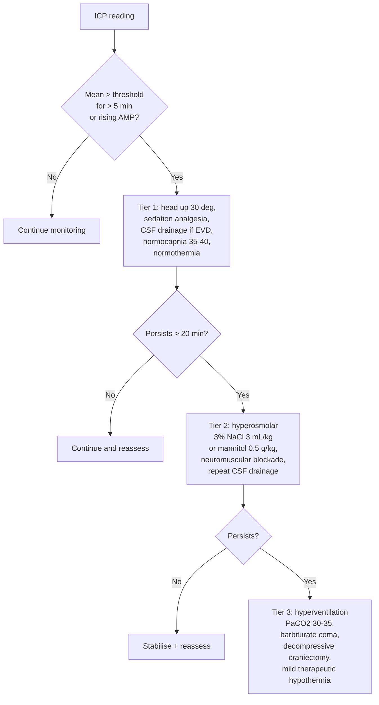

<Callout type="reference">
**Acronyms used on this page**

- **ICP**: intracranial pressure (mmHg)
- **EVD**: external ventricular drain (fluid-coupled, drainable)
- **IPM**: intraparenchymal monitor (fibre-optic or strain-gauge bolt; e.g., Camino, Codman, Raumedic)
- **CPP**: cerebral perfusion pressure = MAP − ICP
- **MAP**: mean arterial pressure
- **AMP**: pulse amplitude of the ICP waveform (peak-to-trough, ~mmHg)
- **RAP**: compensatory reserve index = moving correlation (AMP, mean ICP)
- **PRx**: pressure reactivity index = moving correlation (ICP, MAP) at slow-wave frequencies
- **PVI**: pressure-volume index (Marmarou's compliance metric)
- **CSF**: cerebrospinal fluid
- **TBI**: traumatic brain injury · **SAH**: subarachnoid haemorrhage · **HIE**: hypoxic-ischaemic encephalopathy
- **DKA**: diabetic ketoacidosis · **PBTF**: Pediatric Brain Trauma Foundation (guidelines, 4th ed.)
- **MMM / MNM**: multimodal monitoring / multimodal neuromonitoring
</Callout>

<TldrCard>
**The 60-second version.** ICP is the global pressure inside the cranial vault, in mmHg. It is the **single most-used invasive number in neurocritical care**, but the **waveform shape** matters as much as the mean: P2 > P1 means compliance is exhausted and the next +1 mL hurts disproportionately. Adult-style thresholds (treat at > 20–22 mmHg) **do not generalise cleanly to infants and neonates**; PBTF 2019 recommends 20 mmHg across all pediatric ages with weaker evidence in younger children, and many centres use lower heuristic thresholds (e.g. 15 in infants, 10 in neonates) as bedside triggers. The two probe families are intraparenchymal (easy, no drainage, drifts over days) and intraventricular EVD (gold standard, allows therapeutic CSF drainage, more bleed and infection risk). ICP cannot localise the lesion, distinguish vasogenic from cytotoxic oedema, or tell you whether autoregulation is intact, pair with PRx, TCD, NIRS, EEG, and pupillometry in the multimodal stack. The therapeutic target is not "ICP under a number" but **cumulative dose** of ICP minutes above threshold, the metric that maps onto neurological outcome.
</TldrCard>

## 1. Bedside vignettes: why this matters in the PICU

### Vignette A. Severe pediatric TBI day 1, the waveform changes shape before the number does

A 4-year-old falls from a third-floor balcony. GCS 5 on arrival; CT shows bifrontal contusions, a small subdural, and effacement of the basal cisterns. A right frontal Camino is placed within the hour; baseline ICP 14 mmHg, clean three-peak P1 > P2 > P3 waveform. By hour 18 the mean has crept to **28 mmHg** sustained, and the waveform morphology has flipped: **P2 > P1, rounded contour, RAP 0.8**. You start the tiered escalation: head-up to 30 degrees, propofol bolus and increase infusion, hypertonic saline 3% at 3 mL/kg, normothermia, normocapnia. ICP falls to 22 over 30 minutes. The team begins to plan early decompressive craniectomy because compliance is gone, not because the absolute number is alarming. <Cite id="kochanek2019_pbtf4" /> <Cite id="hutchinson2016" /> <Cite id="kazimierska2021" />

### Vignette B. Neonate with hydrocephalus, no invasive monitor available

A 3-week-old with congenital aqueductal stenosis presents with a tense, bulging anterior fontanelle, sun-set sign, and head circumference crossing two centiles in 10 days. The neurosurgeon is two hours away. There is no ICP monitor on the unit. You scan **ONSD bedside: 5.8 mm bilaterally** (well above the 4.0 mm pediatric cutoff for under-1s), TCD-PI 1.6 with low diastolic flow, NIRS rSO2 falling from 70 to 58%. The clinical and non-invasive picture **converges on raised ICP without ever placing an invasive monitor**. The infant is intubated, head elevated, and transferred for emergent third ventriculostomy. <Cite id="padayachy2016_pediatric_onsd" /> <Cite id="cardim2016_nicp_review" />

### Vignette C. Adolescent SAH day 6, EVD draining 5 mL/h, but TCD MFV is rising

A 12-year-old with a ruptured posterior-communicating aneurysm post-clipping, day 6. EVD set to drain at 10 cm H2O, mean ICP 8 mmHg, output 5 mL/h. The bedside nurse notes the right MCA TCD MFV has risen from 95 to 160 cm/s over 12 hours, with a Lindegaard ratio of 3.8. The team asks the question that ICP alone cannot answer: **is this vasospasm or rising ICP?** The ICP trace is reassuring; the EVD is patent (good pulsatility, respiratory swing of 2 mmHg); the TCD signature with LR > 3 is classic vasospasm. The team escalates haemodynamics (lift MAP, induce mild hypertension), schedules angiography, and the ICP trace remains stable while the spasm is treated. **The ICP measured what ICP measures, and the TCD answered what the ICP could not.** <Cite id="hoh2023sah_aha" /> <Cite id="rass2021dci_review" />

---

## 2. What ICP is, and what it is not

ICP is the pressure of the **supratentorial CSF + parenchymal compartment** transmitted to a probe inside the skull, in mmHg. The reading reflects three superimposed signals:

1. **The mean**, set by total intracranial volume against cranial compliance (the Monro-Kellie doctrine, Marmarou exponential P-V curve). The mean is the number nurses chart and physicians act on.
2. **The pulse amplitude (AMP)**, transmitted from the arterial pulse and modulated by compliance. AMP rises as compliance falls, often **before** the mean ICP does.
3. **The respiratory swing**, transmitted from intrathoracic pressure through the venous compartment. A 1–4 mmHg swing confirms catheter patency.

The Monro-Kellie equation is the ground truth:

```math
V_{brain} + V_{blood} + V_{CSF} = \text{constant (closed skull)}
```

Once compensation is exhausted, the Marmarou exponential becomes the dominant truth:

```math
P = P_0 \cdot e^{(\Delta V / PVI)}
```

where PVI (pressure-volume index) is the volume change that would multiply ICP by ten. PVI in healthy adults ~25 mL; in severe TBI it falls to ~10–15 mL, and the next +1 mL of oedema can double the ICP. <Cite id="marmarou1975" /> <Cite id="avezaat1979" />

**ICP equals brain-tissue pressure only when the waveform shape is healthy and the probe is communicating with the whole intracranial volume.** In compartmentalised oedema (e.g., temporal lobe contusion behind a closed tentorium), the regional pressure can be **much higher** than the supratentorial probe reads. This is the canonical "ICP is normal but the pupil blew" presentation.

**What ICP cannot do.** It cannot localise the lesion, distinguish vasogenic from cytotoxic oedema, confirm whether autoregulation is intact, detect non-convulsive seizures driving the rise, or tell you the perfusion delivered to the tissue. It is the **bedrock**, not the building.

<Pearl>
**The waveform shape matters more than the number once ICP is high.** P2 > P1 with RAP > 0.6 on a mean ICP of 18 is more dangerous than a clean P1-dominant trace at 28: the first is on the steep limb of the Marmarou exponential, the second is on the flat one. <Cite id="czosnyka2004" /> <Cite id="kazimierska2021" />
</Pearl>

<Pediatric>
**Open fontanelles change the rules.** Anterior fontanelle closes 12–18 months, posterior at ~2–3 months. While open, the cranium is **not a closed box**: the Monro-Kellie steep segment is shifted right and pressure transmission to a parenchymal probe is dampened by the compliant fontanelle. **Standard adult thresholds (> 20 mmHg) under-estimate compensated raised ICP in infants.** A "normal" reading in an infant with a tense, bulging fontanelle is suspicious, not reassuring. Pair every infant ICP reading with fontanelle palpation, head-circumference trajectory, ONSD, and bedside cranial ultrasound. <Cite id="kochanek2019_pbtf4" /> <Cite id="tasker2023_pccm_review" />
</Pediatric>

---

## 3. EVD versus intraparenchymal: choosing the probe

<Figure
  src="/images/icp/icp-probe-placement.png"
  alt="Sagittal cross-section of a paediatric head showing both ICP probe placements at Kocher's point (top of skull, just anterior to the coronal suture). Left side: intraparenchymal fibre-optic probe (orange) inserted 1-2 cm into frontal white matter. Right side: ventriculostomy (EVD, teal) catheter passed through a cranial bolt to the frontal horn of the lateral ventricle, then tunnelled out through the scalp to a CSF drainage chamber and a pressure transducer zeroed at the tragus (foramen of Monro level). Falx cerebri labelled medially."
  caption="The two principal ICP probe placements at Kocher's point. Intraparenchymal monitor (IPM, fibre-optic or strain-gauge) is a short probe seated 1-2 cm into frontal white matter through a small cranial bolt; reads pressure only, self-zeros pre-insertion, and drifts ~1-3 mmHg over days. External ventricular drain (EVD) is a silicone catheter passed through the same burr hole into the frontal horn of the lateral ventricle, fluid-coupled through clear tubing to an external pressure transducer zeroed at the tragus (foramen of Monro level), with an in-line CSF drainage chamber for therapeutic drainage. Choose EVD when CSF drainage is wanted (hydrocephalus, IVH, SAH); choose IPM when ventricles are slit, when coagulopathy is high, or when fast bedside placement is the priority. Full comparison in the table below."
  attribution="MNM-Edu, original schematic. PBTF 2019; Hawthorne &amp; Piper 2014."
  label="Fig. 1"
/>

| Feature | EVD (intraventricular) | IPM (intraparenchymal) |
|---|---|---|
| Accuracy | Gold standard (fluid-coupled, re-zeroable) | Good initially, drifts ~1–3 mmHg/day |
| Drainage | Yes (therapeutic CSF removal) | No |
| CSF sampling | Yes | No |
| Bleed risk | ~5–7% (any size); ~0.5–1% clinically significant | ~1–2% |
| Infection risk | ~5–10% over 7 days (rises after day 5) | ~1% |
| Insertion difficulty | Harder (must cannulate ventricle; slit ventricles fail ~5%) | Easier (white-matter target) |
| Re-zero in situ | Yes (any time, at tragus) | No (one-shot, pre-insertion) |
| Best for | Communicating hydrocephalus, IVH, SAH with EVD indication | Diffuse TBI, slit ventricles, contraindication to ventriculostomy |
| Trend over days | Stable | Drift dominates after day 5 |

**The decision tree.** Choose EVD when you want to drain CSF (communicating hydrocephalus, IVH, SAH with hydrocephalus, neuro-deterioration with raised ICP and patent ventricles). Choose IPM when ventricles are slit or unavailable, when coagulopathy raises bleed concern with deeper catheter passes, or when fast bedside placement is the priority. **Many units default to EVD for SAH and to IPM for diffuse TBI.** <Cite id="chesnut2012best" /> <Cite id="kochanek2019_pbtf4" /> <Cite id="hawthorne2014icp" />

<Pitfall>
**An open EVD continuously zeroes ICP to the drainage chamber height.** You cannot read true ICP while the drain is open. Many units alternate **drain for 5 minutes, close for 5 minutes** and chart the closed-period mean as the ICP; others use a more sophisticated dual-tubing system. Specify your unit's protocol on every handover.
</Pitfall>

---

## 4. The ICP waveform: anatomy of a single cardiac cycle

<Figure
  caption="Anatomy of a single cardiac-cycle ICP pulse. P1 (percussion wave) is the arterial pressure transmission through the choroid plexus and major vessels. P2 (tidal wave) reflects intracranial compliance; it rises and overtakes P1 as compliance falls. P3 (dicrotic wave) follows the aortic-valve closure transmission. Normal compliance: P1 > P2 > P3, sharp peaks. Marginal compliance: P1 ≈ P2, broadened contour. Exhausted compliance: P2 > P1, rounded, P3 often merged. The amplitude (AMP = peak-to-trough of the envelope) rises as compliance falls."
  attribution="MNM-Edu, original schematic."
  label="Fig. 2"
>
  <ICPWaveformMorph />
</Figure>

A clean ICP trace has three readable peaks per cardiac cycle:

1. **P1, the percussion wave**, transmitted directly from the arterial systole via the choroid plexus and large basal arteries. Sharp leading edge. In a healthy compliant brain, P1 is the tallest of the three.
2. **P2, the tidal wave**, a reverberation through the brain parenchyma. Its height tracks **compliance**: low-compliance brain dampens the parenchymal recoil and P2 grows. **P2 > P1 is the hallmark of exhausted compliance.**
3. **P3, the dicrotic wave**, following the aortic valve closure transmission. P3 is the smallest in normal compliance; it can merge with P2 as morphology deteriorates.

**The amplitude (AMP)** is the peak-to-trough of the cardiac pulse, usually 1–4 mmHg in healthy compliance, rising to 6–10 mmHg as compliance falls.

**RAP**, the compensatory reserve index, is the moving correlation between AMP and mean ICP over a 4-minute window:

- **RAP ≈ 0**: good compensatory reserve (changes in volume produce little change in pressure, so AMP and mean ICP are uncorrelated).
- **RAP → +1**: compensatory reserve exhausted (every volume change moves both AMP and mean ICP together).
- **RAP falling toward 0 or negative at high ICP**: the Marmarou curve has crested; further volume increase brings pressure-volume decompensation. This is a sinister change. <Cite id="czosnyka1996rap" /> <Cite id="kim2009rap" /> <Cite id="kazimierska2021" />

<Pearl>
**EDV, AMP, and RAP rise before mean ICP.** The waveform tells you compensation is failing **hours** before the mean number breaks through threshold. Train the bedside team to read morphology, not just digits.
</Pearl>

---

## 5. The numbers to record (the six-pack)

For every patient, on every nursing shift, record this six-pack and trend over time:

| Variable | Symbol | What it tells you |
|---|---|---|
| Mean intracranial pressure | ICP | Bedside threshold for tiered escalation |
| Pulse amplitude | AMP | Compliance state (rises as compliance falls) |
| Compensatory reserve index | RAP | Where on the Marmarou curve we are |
| Cerebral perfusion pressure | CPP = MAP − ICP | Driving pressure to the cortex |
| Pressure reactivity index | PRx | Autoregulatory state (see [PRx page](/modalities/prx/)) |
| **Dose** (time x amount above threshold) | ICP-dose, mmHg·h | The outcome-mapped metric |

The **dose** is the single most important addition to the chart over the past decade. ICP minutes spent above threshold correlate with neurological outcome at 6 months in adult and pediatric severe TBI more tightly than peak ICP or mean ICP. The KidsBrainIT pediatric dataset showed a clear dose-response curve: cumulative ICP > 20 mmHg burden over the first 72 hours predicted GOS-E 6 months later, with **a knee at ~8 mmHg·hours** below which outcome was unchanged. <Cite id="guiza2015b_dose" /> <Cite id="depreitere2014icpdose" />

This is why bedside teams should think in **area under the curve**, not point measurements. A patient who spent 6 hours at 25 mmHg has a worse forecast than one who spiked to 35 mmHg for 10 minutes and resolved.

<Callout type="clinical-pearl">
**Treat the dose, not the peak.** A short spike that resolves to baseline is rarely the issue; a sustained 25 mmHg for hours is. Chart ICP-dose (mmHg·h above threshold) every shift and use it for escalation decisions.
</Callout>

---

## 6. What is normal? Age-banded reference values

<Figure
  src="/images/icp/age-band-icp-thresholds.svg"
  alt="Pediatric ICP threshold by age band: neonate 10, infant 15, child 20, adolescent 22 mmHg"
  caption="Pediatric ICP treatment thresholds. PBTF 2019 (4th edition, Kochanek) recommends a treatment threshold of 20 mmHg across all pediatric ages, weak recommendation with weaker evidence in infants. The age-banded scheme shown here (neonate ~10, infant ~15, child ~20, adolescent ~22) is a centre-specific heuristic widely used in practice but is not the PBTF guideline value; younger thresholds reflect lower baseline MAP, narrower autoregulatory range, and open fontanelle physiology. Label as heuristic when used."
  attribution="MNM-Edu, drawn from PBTF 2019 guideline value (20 mmHg) plus centre-specific age-banded heuristics. SVG placeholder."
  label="Fig. 3"
/>

| Age | Resting ICP (mmHg) | Treatment threshold (mmHg) | CPP target (mmHg) |
|---|---|---|---|
| Term newborn (< 28 d) | < 6 | > 10 | 35–40 |
| Infant 1–11 mo | < 8 | > 15 | 40–50 |
| Toddler 1–3 y | < 10 | > 20 | 45–55 |
| Child 4–11 y | < 12 | > 20 | 50–60 |
| Adolescent 12–18 y | < 15 | > 22 | 60–70 |
| Healthy adult reference | 7–15 | > 22 | 60–70 |

Sources: <Cite id="kochanek2019_pbtf4" /> <Cite id="tasker2023_pccm_review" /> <Cite id="tasker2023" />. **The PBTF 2019 guideline value is 20 mmHg across all pediatric ages** (weak recommendation, weaker evidence in infants). The age-banded ICP thresholds shown above (10 / 15 / 20 / 22) are **operational heuristics** used in practice and discussed in pediatric reviews; they are not endorsed guideline values. Treat them as bedside triggers and pair with clinical exam, fontanelle palpation, and ONSD. CPP age-banding has stronger PBTF support (level III recommendation, individualised CPP target by age). The neonate column has the weakest evidence base; treat the bedside picture and the fontanelle as much as the number.

<Pediatric>
**Why the pediatric thresholds are lower at the top and higher at the bottom.** Lower at the top because pediatric cerebral autoregulatory range is **narrower and shifted left**: the lower limit of autoregulation in a toddler may be MAP 45, where in adults it is MAP 60. Treating ICP > 22 in a child with MAP only 60 means CPP 38, well below their LLA. Higher at the bottom because open fontanelles in neonates accommodate volume so a baseline of 4–6 mmHg is normal, not abnormal, in this age group. <Cite id="brady2009" /> <Cite id="tasker2023_pccm_review" />
</Pediatric>

---

## 7. What is abnormal? A pattern library

<Figure
  src="/images/icp/lundberg-waves.svg"
  alt="Five canonical ICP wave patterns: normal P1-dominant, P2-dominant low compliance, Lundberg A plateau wave, Lundberg B oscillation, sustained high ICP"
  caption="Five canonical ICP patterns. (a) Normal compliance: sharp P1 > P2 > P3, AMP 1–3 mmHg. (b) Low compliance: rounded P2 ≥ P1, AMP 4–6 mmHg. (c) Lundberg A wave (plateau wave): trapezoidal rise to 50–100 mmHg above baseline (Lundberg 1960), sustained 5–20 minutes, then drops back to baseline. The mechanism is active vasodilation in a poorly compliant brain. Emergency. (d) Lundberg B wave: rhythmic oscillations 0.5–2 per minute, peak ~20–40 mmHg, often during REM sleep or in compensated raised ICP. (e) Sustained high ICP: mean > 25 mmHg, rounded morphology, low pulse amplitude (suggesting near-arrest). Treat aggressively and consider decompression."
  attribution="MNM-Edu, drawn from Lundberg 1960 and contemporary high-resolution recordings. SVG placeholder."
  label="Fig. 4"
/>

| Pattern | Bedside meaning | What to do |
|---|---|---|
| Normal P1 > P2 > P3 | Compliance preserved | Continue monitoring |
| P1 ≈ P2 (marginal) | Reduced compliance | Optimise basics (HOB, sedation, CO2, temperature) |
| Rounded P2 > P1 | Exhausted compliance | Tier 1 + 2 escalation regardless of mean ICP |
| Lundberg A (plateau wave) | 50–100 mmHg above baseline, 5–20 min, then drops | **Emergency**: hyperosmolar, sedation, head up, consider intervention |
| Lundberg B | 0.5–2 per minute oscillations, 20–40 mmHg | Less specific; investigate sleep, ventilation, sedation depth |
| Lundberg C | 4–8 per minute, low amplitude | Uncertain significance; rarely actionable |
| Sustained ICP > 25 | Mean elevation persistent > 5 min | Tier-based escalation (see Section 8) |
| Rising AMP without mean rise | Compliance loss preceding decompensation | Optimise basics; pre-emptive hyperosmolar consideration |
| Loss of waveform pulsatility | Catheter blocked, kinked, or extreme ICP near cessation | Flush EVD per protocol; check transducer; consider catheter exchange |

**Lundberg taxonomy** comes from the original 1960 continuous-monitoring monograph that established the modern bedside language. <Cite id="lundberg1960" /> Plateau waves are pathognomonic of low compliance; their amplitude can briefly exceed the operating MAP, producing a brief CPP crash and risk of herniation.

<Pearl>
**A plateau wave is not just a number; it is an event.** Time-stamp it, note the trigger (suctioning, agitation, position change), and act on it. Repeated plateaus mean compliance is critical and pre-emptive escalation is justified even between waves. <Cite id="lundberg1960" />
</Pearl>

---

## 8. Try it: interactive widgets

<WidgetEmbed name="ICPWaveformTrainer" />

<WidgetEmbed name="RAPDemo" />

<WidgetEmbed name="PlateauWaveSimulator" />

<WidgetEmbed name="MarmarouPVCurve" />

---

## 9. ICP-guided CPP management and tiered escalation

This is where the ICP number enters the therapeutic cascade. The pediatric severe-TBI playbook (PBTF 4th edition) organises interventions into **three tiers**, with thresholds for escalation that depend on **time spent above ICP threshold**, not on a single peak.

### 9.1 The CPP target by age (operational)

| Age | Suggested CPP floor (mmHg) | Rationale |
|---|---|---|
| Neonate < 28 d | 35–40 | Narrow autoregulatory band, low baseline MAP |
| Infant 1–11 mo | 40–50 | LLA estimated at MAP ~40 in immature autoregulation |
| Toddler 1–3 y | 45–55 | Transitional; widening LLA |
| Child 4–11 y | 50–60 | Adult-like autoregulatory bandwidth emerging |
| Adolescent 12–18 y | 60–70 | Adult thresholds apply |

**CPPopt by PRx** is preferred where available (see [PRx page](/modalities/prx/) and [CPPopt page](/modalities/cppopt/)). The age-banded floor is a **default**; if a PRx-derived U-curve gives a CPPopt of 52 in a 9-year-old, target ±5 mmHg of that, not the table value. <Cite id="aries2012cppopt" /> <Cite id="beqiri2024_cogitate" /> <Cite id="tas2022peds" /> <Cite id="tas2024_pediatric_cppopt" />

### 9.2 The tiered escalation pathway



<Figure
  caption="The raised-ICP pediatric escalation ladder, full-width tier bars. Tier 0 (confirm the signal) → Tier 1 (head-up 30°, sedation, normocapnia, normothermia, sodium 145–150, EVD drainage) → Tier 2 (3% NaCl 3–5 mL/kg bolus or mannitol 0.25–1 g/kg) → Tier 3 (deeper sedation ± neuromuscular blockade) → Tier 4 (brief PaCO₂ 30–35 or targeted hypothermia 35–36 °C) → Tier 5 (pentobarbital coma to cEEG burst-suppression, or decompressive craniectomy). Each step is a 30–60 minute trial; re-evaluate ICP, pupils, NIRS, and CT before escalating. Prophylactic deep hyperventilation harms; individualise with PRx / CPPopt when available."
  attribution="MNM-Edu, original schematic, adapted from PBTF / Kochanek 2019 plus current pediatric NCS / ESPNIC consensus."
  label="Fig. 5"
>
  <RaisedICPLadder />
</Figure>

**Tier 1** is the bedside hygiene every PICU should reflexively apply when ICP creeps. Head-of-bed at 30 degrees, neutral midline neck position, optimised sedation and analgesia, normocapnia at PaCO2 35–40, normothermia, sodium 145–155, glucose normal, seizure prophylaxis if EEG suggests need.

**Tier 2** introduces hyperosmolar therapy and neuromuscular blockade. Hypertonic saline (3% NaCl bolus 3–5 mL/kg, then infusion to keep sodium 150–155) is generally preferred over mannitol in pediatrics because of stable haemodynamics and the ability to continue infusion. Mannitol 0.25–1 g/kg works as a bolus but carries diuresis and rebound risks. <Cite id="kochanek2019_pbtf4" /> <Cite id="cottenceau2011" />

**Tier 3** is the rescue tier. Mild hyperventilation (PaCO2 30–35) reduces CBF acutely and lowers ICP transiently; below 30 it risks ischaemia. Barbiturate coma (pentobarbital infusion to burst suppression on EEG) reduces CMRO2 and ICP but carries refractory hypotension and immune suppression. Decompressive craniectomy is the most definitive intervention; **RESCUEicp** (adults) and emerging pediatric data show ICP reduction at the cost of unfavourable functional outcomes in survivors. <Cite id="hutchinson2016" /> <Cite id="cooper2011" />

<Callout type="caveat">
**Decision support, not a clinical protocol.** Every threshold and escalation step above is age-, centre-, and patient-dependent. Defer to your unit's protocols and senior clinical team.
</Callout>

<AlgorithmDisclaimer />

---

## 10. Clinical contexts: ICP across acute brain injuries

### 10.1 Severe pediatric TBI

The canonical indication. PBTF 4th-edition guidelines recommend invasive ICP monitoring for children with GCS ≤ 8 and an abnormal CT, individualised CPP target by age, and tiered therapy keyed to ICP > 20 mmHg (older child) or age-banded thresholds. **The KidsBrainIT cohort** demonstrated the cumulative ICP-dose to outcome relationship that underpins modern "minutes above threshold" thinking. <Cite id="kochanek2019_pbtf4" /> <Cite id="guiza2015b_dose" /> <Cite id="depreitere2014icpdose" /> <Cite id="tasker2023_pccm_review" />

The **BEST-TRIP** trial (adults, Bolivia/Ecuador) showed that protocolised ICP-guided care was not superior to imaging/exam-guided care for 6-month outcome. Critics argue the trial recruited a population where ICP monitoring was already not routine and that the result reflects context, not modality. **SYNAPSE-ICU** observational data (37,000 patients) showed ICP monitoring associated with lower 6-month mortality. The bedside consensus remains: monitor when you can; act on dose, not peak. <Cite id="chesnut2012best" /> <Cite id="robba2021" />

### 10.2 Aneurysmal SAH and IVH

ICP via EVD is the standard placement in aneurysmal SAH with IVH or hydrocephalus, because CSF drainage is itself therapeutic. Adult AHA/ASA 2023 SAH guidelines recommend EVD for symptomatic hydrocephalus and continuous ICP monitoring in poor-grade SAH. Pediatric SAH (often AVM- or trauma-related) follows similar principles but is anatomically different (younger vessels, different aneurysm patterns). <Cite id="hoh2023sah_aha" /> <Cite id="rass2021dci_review" />

In SAH, **rising ICP must be distinguished from vasospasm-driven flow changes**: ICP can be stable while TCD MFV rises (vasospasm without ICP rise) or rising independently (rebleed, acute hydrocephalus, oedema). This is the canonical "pair ICP with TCD" scenario.

### 10.3 HIE and post-cardiac arrest

Routine ICP monitoring in HIE / post-arrest is **not standard**. The Eurotherm-3235 and THAPCA cohorts did not use invasive ICP. Selective use in patients with malignant cerebral oedema documented on imaging is centre-dependent. Non-invasive surrogates (ONSD, NIRS, fontanelle US in infants) are the more common bedside tools. <Cite id="shankaran2005hie_nichd" /> <Cite id="moler2015thapca_oh" /> <Cite id="naim2023_brain_injury_pccm" />

### 10.4 Bacterial meningitis with raised ICP

Pediatric bacterial meningitis can produce both communicating hydrocephalus (from inflammatory blockade of CSF absorption) and cerebral oedema. **EVD placement** is the first-line invasive monitor when raised ICP is documented or strongly suspected. The European meningitis guidelines and IDSA encephalitis guidelines acknowledge ICP monitoring as a tier-2 intervention in severe cases. <Cite id="vandebeek2016eu_meningitis" /> <Cite id="tunkel2017idsa_encephalitis" /> <Cite id="tunkel2004_idsa_meningitis" />

### 10.5 Hydrocephalus and shunt malfunction

ICP monitoring is used both diagnostically (overnight ICP recordings in suspected shunt failure, looking for B waves) and therapeutically (EVD as bridging in acute shunt failure pre-revision). The **ESPVS** style of overnight ICP-trend recording remains a useful diagnostic for shunt under-drainage. <Cite id="czosnyka2004" /> <Cite id="eide2006" />

### 10.6 DKA cerebral oedema

A pediatric-specific case where ICP monitoring is **rarely invasive in time**. Cerebral oedema in DKA classically presents 4–12 hours into rehydration, with rapid clinical deterioration (headache, altered consciousness, then herniation). The **PECARN FLUID** trial showed that fluid-rate choice did not change cerebral-oedema rates; the bedside priority is **early recognition** with neurological scoring, hypertonic saline 3% bolus, and CT, rather than waiting for an invasive monitor. ONSD and clinical scoring are the practical bedside tools. <Cite id="kuppermann2018_pecarn_dka" /> <Cite id="glaser2024_dka_review" /> <Cite id="glaser2001" /> <Cite id="muir2004" />

### 10.7 Hepatic encephalopathy with cerebral oedema

Acute liver failure can produce ammonia-driven cerebral oedema that is the most common cause of death in fulminant hepatic failure. Invasive ICP monitoring is contentious because of the **bleed risk from coagulopathy**; transfused factor support before placement reduces but does not eliminate this. Many centres now favour **non-invasive monitoring (ONSD, jugular bulb saturation, EEG)** until coagulation supports a safer invasive placement. <Cite id="vespa2010" />

### 10.8 Post-stroke malignant MCA and decompressive craniectomy

Large-vessel ischaemic stroke with malignant oedema is a pediatric emergency in older children. Decompressive hemicraniectomy within 48 hours of clinical decline improves survival but at the cost of disability; ICP monitoring **post-decompression** is sometimes used to titrate medical therapy through the swelling phase. <Cite id="cooper2011" /> <Cite id="hutchinson2016" /> <Cite id="ferriero2019aha_pedstroke" /> <Cite id="sun2020_pediatric_thrombectomy" />

---

## 11. Multimodal integration: ICP in the MMM/MNM stack

ICP is the bedrock invasive number, but **alone it answers only one question**. Pair with the modalities below to answer the others.

| Pair with… | What you gain | Worked scenario |
|---|---|---|
| **PRx** | Autoregulatory state and CPPopt derivation | [PRx page](/modalities/prx/), [CPPopt page](/modalities/cppopt/) |
| **TCD** | Spasm vs rising-ICP discrimination; non-invasive ICP backup via PI; Mx autoregulation | [TCD vs ICP vasospasm](/integration/tcd-vs-icp-vasospasm/) |
| **NIRS** | Tissue oxygenation surrogate when ICP is normal but tissue is suffering; non-invasive backup when ICP cannot be placed | [PRx vs ORx discordance](/integration/prx-vs-orx-discordance/) |
| **PbtO2** | Tissue oxygenation gold-standard pair (the BOOST triplet: ICP + PbtO2 + PRx) | [PbtO2-CPP titration](/integration/pbto2-cpp-titration/) |
| **EEG / cEEG** | Seizure-driven ICP elevations (NCSE causes both ICP spikes and metabolic demand) | [EEG / TCD pair](/integration/eeg-tcd-non-convulsive/) |
| **Pupillometry (NPi)** | Brainstem function and herniation early warning | [NPi page](/modalities/pupillometry/) |
| **ONSD** | Non-invasive ICP cross-check at bedside (especially when EVD is unreliable) | [ONSD page](/modalities/onsd/) |
| **Microdialysis** | Metabolic crisis (lactate/pyruvate ratio) at ICP "acceptable" levels | [Microdialysis page](/modalities/microdialysis/) |
| **Clinical exam** | Most important pairing; an isolated ICP number is dangerous | Always |

<Cite id="figaji2025_mmm_pediatric_consensus" /> <Cite id="helbok2024_pediatric_mmm" /> <Cite id="leroux2014_neurocrit_consensus" />

---

<DeepDive>

## 12. Setup and technique: a step-by-step

### 12.1 Site selection

**Kocher's point** is the canonical entry: ~2.5 cm lateral to the sagittal midline at the coronal suture (or ~10 cm posterior to the nasion, ~2.5 cm lateral), on the **non-dominant** hemisphere (right-sided in most). This avoids the motor strip and the sagittal sinus, and the trajectory through frontal white matter has the least eloquent cortex.

**Frazier's point** (~6 cm above and 3 cm lateral to the inion) targets the occipital horn for posterior approaches.

### 12.2 Intraparenchymal probe insertion

1. **Position** head neutral, skin shaved over the entry site, sterile prep and drape.
2. **Local anaesthetic** (lidocaine + adrenaline subcutaneously).
3. **Skin incision** 5–10 mm vertical stab.
4. **Burr hole** with twist drill or hand-cranked perforator.
5. **Dural puncture** through the bolt with a small spinal needle.
6. **Probe self-zeroing in air** (intraparenchymal probes calibrate once, pre-insertion, then never again).
7. **Insertion** to fixed depth (typically 1–2 cm into white matter).
8. **Bolt locked** to skull.
9. **Display**: connect to monitor, confirm three-peak waveform with respiratory swing and cardiac pulse, document baseline ICP and morphology.

### 12.3 EVD insertion

Same approach through burr hole, then a silicone catheter is passed ~5–7 cm to enter the frontal horn of the lateral ventricle. CSF egress confirms placement. The catheter is **fluid-coupled** through saline-filled tubing to an external pressure transducer.

### 12.4 Zeroing, the most-missed source of error

- **Fluid-coupled (EVD)**: zero the transducer to atmosphere at **tragus level** (corresponds to foramen of Monro at supine). If the transducer drifts up or down with the patient's head position, ICP changes by ~7 mmHg per 10 cm. Re-zero every shift and after every position change.
- **Intraparenchymal**: self-zero **before insertion**, never again. Drift over days (typically 1–3 mmHg by day 5) is the trade-off.

### 12.5 Signal quality cues

- **Clean three-peak waveform** with P1 > P2 > P3 in normal compliance: trust.
- **Respiratory swing of 1–4 mmHg**: confirms patency.
- **Cardiac pulse present**: confirms vascular coupling.
- **No swing, no pulse, dead-line trace**: catheter is blocked, kinked, or the transducer is disconnected. **Flush per local protocol; do not act on a flat-line ICP.**

### 12.6 Infection prevention

Bundle elements with the strongest evidence: chlorhexidine prep, full-barrier draping, antibiotic-impregnated catheters (silver-coated or rifampicin/minocycline-impregnated), tunnelled subcutaneous track ≥ 5 cm, closed drainage system with no breaks, no routine prophylactic systemic antibiotics. Infection rate climbs from ~2% in week 1 to ~10% by week 2. Plan exchange or removal at day 5–7 if still needed and clinical state allows. <Cite id="hawthorne2014icp" /> <Cite id="leroux2014_neurocrit_consensus" />

### 12.7 EVD drain management

The two competing modes:

- **Continuous drainage with set level**: drain set at 10–20 cm H2O above tragus; CSF drains continuously when ICP exceeds that. ICP is **not readable while draining**.
- **Intermittent drainage with monitoring**: drain closed for monitoring, opened for 5-minute intervals when ICP exceeds threshold or per shift schedule. ICP is readable during closed periods.

Most centres now favour intermittent monitoring with set-level drainage to allow ICP measurement and CPP calculation; trial data is mixed and unit protocols vary widely. <Cite id="hawthorne2014icp" />

</DeepDive>

---

## 13. Pitfalls and artefacts

- **Drift in fibre-optic probes** (typically < 3 mmHg/day, but cumulative over a week).
- **Damping of fluid-coupled EVDs** from bubbles, kinks, or clots; characteristic loss of waveform pulsatility.
- **Open EVD continuously zeroes ICP** to the drainage chamber height; cannot read true ICP through an open drain.
- **Transducer height changes**: every 10 cm above tragus reads ICP ~7 mmHg too low; every 10 cm below reads it ~7 mmHg too high.
- **Coughing, suctioning, bucking**: transient ICP spikes via thoracic pressure transmission. Note in trace; do not act unless sustained or recurrent.
- **Sedation effects on baseline**: deep propofol reduces CMRO2 and lowers baseline ICP by ~3–5 mmHg; lightening sedation should prompt a re-baseline.
- **Compartmentalised oedema** (e.g., temporal lobe contusion behind a closed tentorium): regional pressure can be much higher than the supratentorial probe reads. ICP can be "normal" while the pupil blows.
- **Slit ventricles**: EVD placement fails ~5% from inability to cannulate; use intraparenchymal instead.
- **Sodium driving ICP**: hyponatremia (< 130) raises ICP via brain oedema; correct cautiously to avoid osmotic demyelination.
- **PEEP transmission**: PEEP > 10–12 transmits to ICP via venous outflow resistance, especially with reduced lung compliance. See [PEEP-ICP-MAP demo](/modalities/icp/#widget).

---

## 14. Combine with…

- [CPP](/modalities/cpp/): driving pressure = MAP − ICP, the partner to every ICP measurement.
- [PRx](/modalities/prx/): autoregulatory state through this very ICP signal.
- [CPPopt](/modalities/cppopt/): individualised target derived from the PRx-CPP relationship.
- [RAP](/modalities/rap/): what the ICP waveform tells you about compliance.
- [Non-invasive ICP](/modalities/non-invasive-icp/): when invasive placement is contraindicated or unavailable.
- [ONSD](/modalities/onsd/): bedside ultrasound surrogate.
- [TCD](/modalities/tcd/): flow consequence of the same physiology and a spasm-vs-ICP discriminator.
- [PbtO2](/modalities/pbto2/): tissue oxygenation pair (the BOOST triplet).
- [Pupillometry](/modalities/pupillometry/): brainstem early warning.

---

<DeepDive>

## 15. Evidence summary and recent literature

### 15.1 Evidence summary

| Topic | Source | Grade |
|---|---|---|
| Monro-Kellie doctrine | <Cite id="monro1783" /> <Cite id="kellie1824" /> <Cite id="mokri2001" /> | foundational |
| Marmarou pressure-volume relationship | <Cite id="marmarou1975" /> <Cite id="avezaat1979" /> | A (foundational) |
| Lundberg waves taxonomy | <Cite id="lundberg1960" /> | foundational |
| ICP pulse waveform analysis | <Cite id="czosnyka1996rap" /> <Cite id="czosnyka2004" /> <Cite id="kazimierska2021" /> | B |
| ICP-targeted therapy in severe TBI (peds) | <Cite id="kochanek2019_pbtf4" /> | B |
| BEST-TRIP, ICP-targeted vs exam-targeted (adults) | <Cite id="chesnut2012best" /> | A |
| SYNAPSE-ICU, ICP monitoring and mortality | <Cite id="robba2021" /> | B |
| Decompressive craniectomy (RESCUEicp, DECRA) | <Cite id="hutchinson2016" /> <Cite id="cooper2011" /> | A |
| ICP dose-response to outcome (KidsBrainIT) | <Cite id="guiza2015b_dose" /> <Cite id="depreitere2014icpdose" /> | B |
| Pediatric MNM consensus | <Cite id="figaji2025_mmm_pediatric_consensus" /> <Cite id="helbok2024_pediatric_mmm" /> <Cite id="tasker2023_pccm_review" /> <Cite id="tasker2023mnm" /> | expert |
| Neurocritical Care Society MMM consensus | <Cite id="leroux2014_neurocrit_consensus" /> | expert |
| ICP best practice consensus 2014 | <Cite id="hawthorne2014icp" /> | expert |
| CPPopt by PRx | <Cite id="aries2012cppopt" /> <Cite id="beqiri2024_cogitate" /> | B |
| Pediatric CPPopt | <Cite id="tas2022peds" /> <Cite id="tas2024_pediatric_cppopt" /> | B |

### 15.2 Recent literature (2022–2025)

- **COGiTATE phase II** (Beqiri 2024): adult severe TBI trial demonstrating CPPopt-guided care is feasible and safe, with secondary endpoints suggesting outcome benefit. The pediatric extension is awaited but Tas 2024 single-centre data already supports the concept in children. <Cite id="beqiri2024_cogitate" /> <Cite id="tas2024_pediatric_cppopt" /> <Cite id="tas2025_cogitate_followup" />
- **Pediatric MNM consensus 2025** (Figaji): formalises ICP as the anchor invasive modality and stratifies tier-2 modalities (PbtO2, microdialysis, PRx-derived CPPopt) by resource level. <Cite id="figaji2025_mmm_pediatric_consensus" />
- **Non-invasive ICP estimators**: Brain4Care-style waveform-derived nICP (Brasil 2021, 2022; Cardim 2023; Rasulo 2024). Useful for triage and trend-following but not a replacement for invasive measurement in patients with established intracranial hypertension. <Cite id="brasil2021" /> <Cite id="brasil2022_waveform" /> <Cite id="cardim2023nicp" /> <Cite id="rasulo2024_b4c" />
- **ICP dose vs outcome** (Guiza 2015 + follow-on): the cumulative-dose framework is now the standard outcome-mapped metric and is increasingly built into ICU-grade ICP monitoring systems.
- **SYNAPSE-ICU follow-on**: ICU-level variability in ICP monitoring practice remains substantial; calls for international standardisation of indications and thresholds. <Cite id="robba2021" />

</DeepDive>

---

## 16. Self-check

<Quiz
  questions={[
    {
      id: 'q1',
      prompt: 'A 4-year-old severe TBI day 1. Mean ICP 18 mmHg, sustained for 6 hours. Waveform shows P2 > P1 with RAP 0.85. Most appropriate next step?',
      options: [
        { id: 'a', label: 'Continue monitoring; ICP is below threshold' },
        { id: 'b', label: 'Tier 1 escalation (head up, optimise sedation, normocapnia, normothermia)' },
        { id: 'c', label: 'Immediate decompressive craniectomy' },
        { id: 'd', label: 'Hyperventilate to PaCO2 25 mmHg' },
      ],
      answer: 'b',
      explanation: 'P2 > P1 with high RAP signals exhausted compliance regardless of mean ICP being "acceptable" at 18. The Marmarou exponential is on its steep limb; the next small volume insult will produce a disproportionate pressure rise. Tier 1 (basics) is the right immediate step, with low threshold to escalate to Tier 2 hyperosmolar therapy. Hyperventilation below 30 risks ischaemia; decompression is reserved for refractory ICP after Tier 1 and 2.',
    },
    {
      id: 'q2',
      prompt: 'A 6-week-old infant with congenital aqueductal stenosis presents with a tense bulging fontanelle, sun-set sign, and a "normal" parenchymal ICP reading of 8 mmHg. Best interpretation?',
      options: [
        { id: 'a', label: 'ICP is normal; observe' },
        { id: 'b', label: 'The parenchymal reading is misleading because the open fontanelle dampens transmission; ICP is likely raised' },
        { id: 'c', label: 'Decompressive craniectomy is indicated' },
        { id: 'd', label: 'Start mannitol and recheck in 1 hour' },
      ],
      answer: 'b',
      explanation: 'Open fontanelles dampen pressure transmission to a parenchymal probe and shift the Monro-Kellie steep segment rightward. The clinical picture (tense fontanelle, sun-set sign, head growth) outweighs the digit. ONSD, fontanelle US, and TCD-PI are the right confirmatory bedside tools; the surgical decision is the operative answer. Mannitol may help temporarily but does not address obstructive hydrocephalus.',
    },
    {
      id: 'q3',
      prompt: 'A 12-year-old SAH day 6 with EVD draining 5 mL/h, mean ICP 8 mmHg with respiratory swing of 2 mmHg. Right MCA TCD MFV has risen from 95 to 160 cm/s with Lindegaard ratio 3.8. Best interpretation?',
      options: [
        { id: 'a', label: 'Rising ICP; escalate ICP management' },
        { id: 'b', label: 'EVD is blocked; flush' },
        { id: 'c', label: 'Vasospasm without ICP rise; escalate haemodynamics and arrange angiography' },
        { id: 'd', label: 'Normal post-SAH variability; observe' },
      ],
      answer: 'c',
      explanation: 'The ICP trace is reassuring: low mean, present respiratory swing (so EVD is patent), output of 5 mL/h is appropriate. The TCD signature (MFV doubled with LR > 3) is classic vasospasm in the spasm window (days 3–14). ICP cannot answer this question; pairing with TCD is the canonical multimodal play. Treat the spasm (induced hypertension, angiography); do not chase a non-existent ICP problem.',
    },
  ]}
/>
