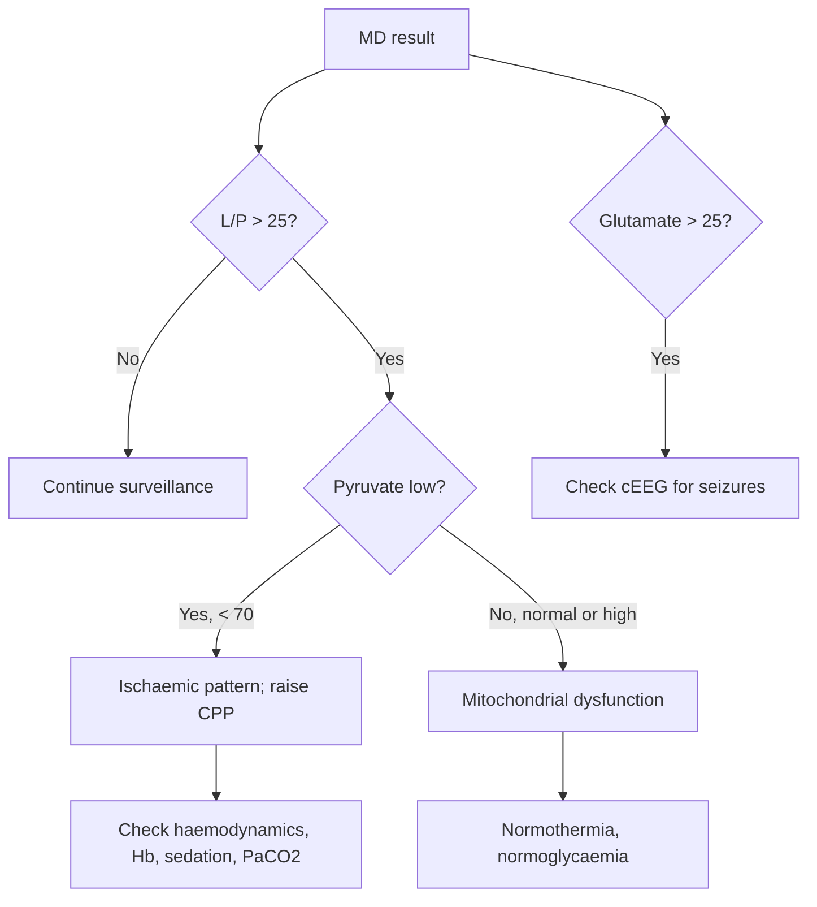

<Callout type="reference">
**Acronyms used on this page**

- **MD**: cerebral microdialysis (CMA / M Dialysis is the dominant device family)
- **L/P**: lactate-to-pyruvate ratio (the headline summary index)
- **Glu**: glucose (interstitial; brain glucose, not blood)
- **Glut**: glutamate (excitotoxic amino acid)
- **Glyc**: glycerol (cell-membrane degradation marker)
- **ECF / ISF**: extracellular / interstitial fluid
- **Recovery (R)**: ratio of dialysate concentration to true interstitial concentration
- **PbtO2**: brain tissue oxygen partial pressure (often co-located with MD)
- **CMRO2**: cerebral metabolic rate of oxygen
- **TBI / SAH / HIE**: traumatic / subarachnoid / hypoxic-ischaemic
- **DCI**: delayed cerebral ischaemia
- **MNM / MMM**: multimodal neuromonitoring / multimodal monitoring
</Callout>

<TldrCard>
**The 60-second version.** Cerebral microdialysis (MD) is a thin (~0.6 mm) intra-parenchymal catheter with a semi-permeable membrane tip that samples brain interstitial fluid. A pump perfuses physiological perfusate through the catheter at ~0.3 µL/min; small molecules diffuse across the membrane and are collected as **dialysate**. Bedside analysers (CMA 600 / Eurolab) run **glucose, lactate, pyruvate, glycerol, glutamate** every 30 to 60 minutes. The headline derived index is the **L/P ratio**: > 25 to 30 is the bedside cut-off for cerebral metabolic distress. **L/P high with low pyruvate = ischaemia.** **L/P high with normal pyruvate = mitochondrial dysfunction.** The latter pattern is the bedside argument for treatments aimed at mitochondrial recovery, not just CBF restoration. Pediatric data are sparse (Tolias 2013); MD is mostly used in research / specialised adult neurocritical care, with growing pediatric experience in selected centres. <Cite id="ungerstedt1991" /> <Cite id="hutchinson2015_md" /> <Cite id="leroux2014_neurocrit_consensus" />
</TldrCard>

## 1. Bedside vignettes: why this matters in the PICU

### Vignette A. The 14-year-old severe TBI, hour 72

A 14-year-old with severe TBI is on day 3, ICP 16 mmHg (in range), CPP 75 (target), PbtO2 22 mmHg (in range), normothermic. The hourly MD reads: glucose 1.4 mmol/L (low), lactate 4.8 mmol/L (high), pyruvate 110 µmol/L (low), **L/P ratio 44 (high)**, glycerol 80 µmol/L (rising). Glutamate 25 µmol/L (mildly elevated). This is the **classic ischaemic pattern**: low brain glucose, high lactate, low pyruvate, very high L/P, rising glycerol from membrane degradation. The bedside picture (ICP, CPP, PbtO2 all "in range") would falsely reassure without MD. Action: raise CPP target, recheck for systemic hypoglycaemia, recheck haemoglobin, consider escalating sedation; recheck MD in 1 hour. <Cite id="hutchinson2015_md" /> <Cite id="hillered2005" />

### Vignette B. The 17-year-old SAH day 6, mitochondrial dysfunction pattern

A 17-year-old, day 6 post-SAH after coil embolisation, ICP 12, CPP 80, PbtO2 24 (in range). MD reads: glucose 1.8 mmol/L (slightly low), lactate 4.0 mmol/L (high), pyruvate 175 µmol/L (normal-high), **L/P ratio 23 (borderline-high)**, glycerol 65 µmol/L (slightly elevated). This is the **mitochondrial dysfunction pattern**: lactate is high but pyruvate is also high (mitochondria fail to convert pyruvate to ATP), so L/P is only borderline-elevated. CBF is adequate (PbtO2 normal) so raising CPP further is unlikely to help. The pattern argues for normothermia maintenance, avoidance of hypoglycaemia, and continued vigilance for evolving cerebral metabolic crisis. <Cite id="hutchinson2015_md" /> <Cite id="leroux2014_neurocrit_consensus" />

### Vignette C. The 9-year-old severe TBI, the misleading "normal" MD over uninjured cortex

A 9-year-old with severe TBI has an MD catheter placed at admission, with placement targeting "uninvolved" frontal cortex per local protocol (away from the contusion). Over 48 hours all MD values are normal (L/P 18, glucose 2.5, glutamate 8). The contusion in the right temporal lobe progresses to herniation by hour 50 despite the reassuring MD. **MD samples ~0.5 cm³ around the catheter tip and tells you nothing about distant tissue.** The location matters; the consensus is to place MD in the *penumbra* of the injury (perilesional white matter), with a second catheter in radiographically normal cortex for comparison if research-grade. <Cite id="leroux2014_neurocrit_consensus" /> <Cite id="hutchinson2015_md" />

---

## 2. What MD is, and what it is not

The microdialysis catheter is a thin double-lumen tube with a semi-permeable membrane at the tip. A pump pushes physiological perfusate (Perfusion Fluid CNS, similar to CSF in ionic composition) through the inner lumen at ~0.3 µL/min; small molecules diffuse across the membrane from the brain interstitial fluid into the perfusate; the dialysate exits through the outer lumen and is collected in vials. A bedside analyser quantifies glucose, lactate, pyruvate, glycerol, and glutamate (sometimes urea as a reference for diffusion).

**Five concepts to anchor.**

**Membrane recovery (R) is &lt; 100%.** The dialysate concentration is some fraction of the true interstitial concentration; typical R is 50 to 70% for small molecules at standard flow rates. R varies with flow rate, membrane length, temperature, and the molecule's diffusion coefficient. Centres calibrate R either in vitro or accept relative measurements (trend within a patient). <Cite id="ungerstedt1991" />

**MD samples a small volume.** The "harvest zone" around a microdialysis catheter tip is ~0.5 cm³, far smaller than a TCD beam or an EEG electrode coverage area. **Location matters enormously.** Catheter placement decisions (perilesional white matter, "normal" cortex, both) are protocol-defined per centre.

**Sampling cadence is slow.** Standard cadence is 30 to 60 minutes per sample (a single vial requires several µL of dialysate at 0.3 µL/min). Faster sampling (10 minutes) is technically possible but reduces measurement reliability. MD therefore reveals *trends*, not minute-to-minute changes.

**The headline derived index is L/P ratio.** L/P = lactate / pyruvate. In ischaemia, pyruvate falls (no oxygen for the Krebs cycle, anaerobic glycolysis converts pyruvate to lactate, so L/P rises). In mitochondrial dysfunction, pyruvate may remain normal or even rise, while lactate still rises (mitochondria fail to use pyruvate efficiently), and L/P rises but less dramatically. The *individual* values of L and P matter for distinguishing these two patterns.

**MD is mostly adult and mostly research / specialised practice.** Pediatric MD is rare; Tolias 2013 is the major pediatric series. <Cite id="tolias2013peds" />

<Pearl>
**L/P alone does not distinguish ischaemia from mitochondrial dysfunction.** You need to look at pyruvate. L/P > 30 with low pyruvate = ischaemia (treat haemodynamics). L/P > 25 with normal-or-high pyruvate = mitochondrial dysfunction (treat metabolic environment: normothermia, oxygen, normoglycaemia, avoid further injury). This distinction matters for management. <Cite id="hutchinson2015_md" />
</Pearl>

<Pediatric>
**Pediatric MD is sparsely validated.** Tolias 2013 reported MD in 14 children with severe TBI; the pattern interpretation broadly mirrors adult practice (L/P > 30 = metabolic distress, glucose < 1 mmol/L = energy failure, glycerol rising = membrane damage). Treat as **investigational** with pediatric-specific concerns: a smaller skull, narrower placement options, and a smaller reference dataset.
</Pediatric>

---

## 3. Catheter anatomy and placement

<Figure
  caption="Cerebral microdialysis catheter anatomy. A flexible 0.6 mm shaft is inserted to a depth of 2–3 cm in white matter via the same Kocher's-point bolt that carries ICP and PbtO2 probes. The distal 10–20 mm membrane has a ~20 kDa molecular-weight cutoff: glucose, lactate, pyruvate, glutamate, glycerol and urea pass through and into the perfusate; proteins and cells stay outside. CSF or central-line perfusate (Ringer's, 0.3 µL/min) is pumped through the inflow; the dialysate is collected from the outflow vial in hourly aliquots. The companion L/P-ratio grid (used for sample interpretation) is shown alongside this device anatomy in the bedside literature."
  attribution="MNM-Edu, original schematic."
  label="Fig. 1"
>
  <MicrodialysisCatheter />
</Figure>

The CMA 70 or 71 catheter (the most common bedside device) has a 10 to 20 mm membrane tip with pore size ~20 kDa (passes glucose, lactate, pyruvate, glycerol, glutamate, urea; excludes proteins). The catheter is inserted via:

- **Burr-hole** alongside an ICP probe and/or a PbtO2 probe (typical multi-modal placement in TBI and SAH).
- **Open craniotomy** during decompressive surgery (placement can be precisely sited next to the lesion).
- **Bedside** burr-hole in selected ICUs with neurosurgical support.

**Placement targets** (per leroux2014_neurocrit_consensus): for diffuse injury, place in normal-appearing white matter of the dominant hemisphere; for focal injury (contusion), place in the perilesional penumbra (typically 1 to 2 cm from the lesion edge in white matter); some research protocols add a second catheter in radiographically normal cortex for comparison. <Cite id="leroux2014_neurocrit_consensus" /> <Cite id="hutchinson2015_md" />

The membrane tip orientation matters less than tip depth (~25 mm from the skull surface for white matter). Position is confirmed on post-placement CT.

---

## 4. The signal: what comes out of the analyser

The bedside analyser (CMA 600, Eurolab, or M Dialysis ISCUS Flex) returns concentrations every 30 to 60 minutes for the canonical five:

| Analyte | Normal interstitial range (mmol/L or µmol/L) | What rises | What falls |
|---|---|---|---|
| Glucose | 1.7 to 3.5 mmol/L | Rises with systemic hyperglycaemia or with hyperaemia | Falls with energy failure, ischaemia, severe systemic hypoglycaemia |
| Lactate | 1 to 3 mmol/L | Rises with anaerobic metabolism, ischaemia, mitochondrial dysfunction, seizures | Falls with restoration of oxidative metabolism |
| Pyruvate | 70 to 150 µmol/L | Rises with reperfusion, hyperaemia, mitochondrial recovery | Falls with ischaemia (sub-strate exhaustion) |
| L/P ratio | &lt; 25 | Rises in ischaemia (very high) or mitochondrial dysfunction (moderately) | Falls with recovery |
| Glycerol | 50 to 100 µmol/L | Rises with membrane phospholipid breakdown (severe injury, ischaemia) | Falls with healing |
| Glutamate | &lt; 10 µmol/L | Rises with excitotoxicity, seizures, severe ischaemia | Falls with recovery |
| Urea (reference) | 3 to 8 mmol/L | Tracks plasma urea | Tracks plasma urea |

**Pattern, not single value.** Interpret as a profile: ischaemic pattern, mitochondrial pattern, hyperglycolysis, seizure, recovery. Combine with the local PbtO2 (typically co-located) and ICP / CPP.

<Callout type="clinical-pearl">
**Hourly glycerol is the cheapest "is the brain dying around the catheter?" question.** A persistently high or rising glycerol on top of other abnormalities indicates ongoing membrane damage; it is the cellular-disintegration marker.
</Callout>

---

## 5. The numbers: what to record at the bedside

| Variable | Symbol | What it tells you |
|---|---|---|
| Glucose (interstitial) | Glu (mmol/L) | Energy supply; pair with serum glucose |
| Lactate | Lact (mmol/L) | Anaerobic glycolysis or mitochondrial failure |
| Pyruvate | Pyr (µmol/L) | Substrate availability |
| L/P ratio | L/P | The headline summary; cut-off &gt; 25 to 30 |
| Glycerol | Glyc (µmol/L) | Membrane integrity |
| Glutamate | Glut (µmol/L) | Excitotoxicity |
| Co-located PbtO2 | PbtO2 (mmHg) | Tissue oxygen tension at the same site |
| Trend over 4 to 12 h | Δ all variables | More informative than single values |

Always document the catheter location (frontal, peri-lesional, etc.), the perfusion rate, the time of last sample, and the operator. The trend graph at the bedside is the working tool; raw individual numbers are summarised in the multidisciplinary morning round.

---

## 6. What is normal? Reference values

| Population | L/P | Glu (mmol/L) | Pyr (µmol/L) | Glyc (µmol/L) | Glut (µmol/L) |
|---|---|---|---|---|---|
| Healthy adult cortex (rare; mostly cancer-surgery controls) | 18 to 24 | 1.7 to 3.0 | 100 to 200 | 50 to 80 | &lt; 10 |
| Stable post-op neurosurgical | 20 to 25 | 1.5 to 2.5 | 90 to 180 | 60 to 100 | &lt; 15 |
| Severe TBI, stable, well-managed | 22 to 30 | 1.2 to 2.0 | 80 to 150 | 60 to 100 | 5 to 15 |
| Severe TBI, evolving secondary injury | &gt; 30 | &lt; 1.0 | &lt; 70 | &gt; 100 | &gt; 15 |
| Severe TBI, ischaemic crisis | &gt; 40 | &lt; 0.7 | &lt; 50 | &gt; 150 | &gt; 25 |

<Cite id="hutchinson2015_md" /> <Cite id="hillered2005" /> <Cite id="leroux2014_neurocrit_consensus" />. Pediatric reference values are extrapolated from limited series (Tolias 2013) and adult data; interpret with caution. <Cite id="tolias2013peds" />

<Pediatric>
**Pediatric reference values are extrapolated, not validated.** The patterns appear similar but the absolute thresholds may differ. Treat each pediatric MD case as research-grade and document the centre's local experience.
</Pediatric>

---

## 7. What is abnormal? Pattern library

<Figure
  caption="Five characteristic MD patterns side by side. (a) Normal: L/P ~20, Glu 1.8, Pyr 130, Glyc 70, Glut 8. (b) Ischaemic pattern: L/P 45, Glu 0.6, Pyr 50 (low), Glyc 180, Glut 30. (c) Mitochondrial dysfunction: L/P 32, Glu 1.5, Pyr 170 (preserved), Glyc 80, Glut 10. (d) Hyperglycolysis (early reperfusion): L/P 18, Glu 4.0, Pyr 250, Glyc 60, Glut 8. (e) Seizure pattern: L/P 35, Glu 0.9 (depleted), Pyr 80, Glyc 90, Glut 40 (markedly elevated)."
  attribution="MNM-Edu, original schematic. SVG placeholder."
  label="Fig. 2"
>
  <WidgetEmbed name="MicrodialysisGrid" />
</Figure>

| Pattern | Signature | Mechanism | Action |
|---|---|---|---|
| Normal | L/P &lt; 25, all values in range | Aerobic metabolism | Continue surveillance |
| **Ischaemic** | L/P &gt; 30, Glu &lt; 1, Pyr &lt; 70, Glyc rising | Inadequate O2 delivery | Raise CPP, recheck haemodynamics, oxygenation, Hb |
| **Mitochondrial dysfunction** | L/P 25 to 35, Pyr normal-high | O2 delivered but unable to be used | Normothermia, normoglycaemia, avoid additional injury |
| Hyperglycolysis | L/P normal, Glu and Pyr high | Hyperaemic / reperfusion phase | Verify with PbtO2; usually transient |
| Seizure | L/P 30 to 40, Glut high, Glu depleted | Excitotoxic + metabolic | Check cEEG; treat seizures |
| Cell membrane breakdown | Glyc &gt; 150 sustained | Severe ongoing injury | Look for evolving infarct; consider imaging |
| Catheter dysfunction | All values aberrant or zero | Membrane fouling, tube kink | Reflush, inspect, replace catheter |

### Decision tree: "what is the MD telling me?"

---

## 8. Try it: interactive widgets

<WidgetEmbed name="MicrodialysisGrid" />

---

## 9. Management decisions driven by MD

### 9.1 CPP titration

A rising L/P with falling pyruvate and falling brain glucose, with co-located PbtO2 also falling, is an ischaemic pattern: the action is to *raise CPP* (typically by raising MAP) and re-measure in 1 hour. The MD response within 1 to 2 hours of CPP escalation is the bedside endpoint. <Cite id="hutchinson2015_md" />

### 9.2 Glycaemic control

Severe systemic hypoglycaemia (serum glucose < 4 mmol/L) reliably drives brain interstitial glucose below 1 mmol/L; MD shows it. Persistent low brain glucose in the face of normal serum glucose implies localised energy failure and warrants metabolic interrogation (consider hyperglycolysis, seizures, fever). Conversely, hyperglycaemia (serum > 10 mmol/L) can elevate brain glucose without resolving the ischaemic pattern; the literature does not support targeting brain glucose with aggressive insulin. <Cite id="leroux2014_neurocrit_consensus" />

### 9.3 Temperature management

Mild hypothermia (33 to 35 °C) reduces CMRO2 by ~7% per °C and typically lowers L/P and glycerol. Therapeutic normothermia targets in TBI are partly driven by MD endpoints in some research protocols. The pediatric BTF guidelines support fever control to normothermia but do not mandate active hypothermia. <Cite id="kochanek2019_pbtf4" />

### 9.4 The mitochondrial-dysfunction pattern as a treatment ceiling

If MD shows mitochondrial dysfunction (high L/P with preserved pyruvate), further CPP escalation will not improve metabolism. The actionable interventions become normothermia, avoidance of hyperthermia and hypoglycaemia, oxygen delivery optimisation (without hyperoxia), and seizure control. <Cite id="hutchinson2015_md" />

### 9.5 Multimodal pairing

MD pairs most often with PbtO2 (same burr-hole, adjacent tissue). The PbtO2 + MD combination distinguishes:

- **Low PbtO2 + ischaemic MD**: hypoxic ischaemia.
- **Normal PbtO2 + ischaemic MD**: localised vasospasm or microvascular failure, or sampling at a non-ischaemic site adjacent to ischaemic tissue.
- **Normal PbtO2 + mitochondrial MD**: O2 delivered but not used; the cellular-failure pattern.
- **Low PbtO2 + normal MD**: probe artefact in one of the two, or sampling discordance.

<Callout type="caveat">
**Teaching, not protocol.** MD thresholds (L/P > 25, Glu < 1, Glyc rising) are research-derived heuristics. Local protocols and centre experience guide use. Defer to your unit's senior neurocritical care team for MD-driven decisions; in pediatric practice, MD is investigational and should not drive management without explicit research / institutional protocols.
</Callout>

<AlgorithmDisclaimer />

---

## 10. Clinical contexts: MD across acute brain injuries

### 10.1 Severe TBI (the canonical indication)

MD has been used in adult severe TBI since the late 1990s. Hutchinson 2015 / 2016 consensus statements outline its bedside role: detecting secondary ischaemia and mitochondrial dysfunction not visible in ICP / CPP / PbtO2 alone. Pediatric TBI MD is rare; Tolias 2013 is the major pediatric series (n = 14). Pediatric BTF guidelines do not mandate MD. <Cite id="hutchinson2015_md" /> <Cite id="hutchinson2016" /> <Cite id="tolias2013peds" /> <Cite id="kochanek2019_pbtf4" />

### 10.2 Aneurysmal SAH and DCI

MD in SAH detects ischaemic patterns hours to days before clinical DCI. Catheter location (in the territory at risk: ACA in anterior communicating, MCA in middle cerebral) is critical. The combined MD + qEEG + TCD bundle for SAH-DCI is the gold standard in research-grade centres. <Cite id="hoh2023sah_aha" /> <Cite id="rass2021dci_review" />

### 10.3 Pediatric AIS

MD is not part of routine pediatric AIS management. It is occasionally used in research protocols for malignant MCA infarction in selected centres. <Cite id="ferriero2019aha_pedstroke" />

### 10.4 HIE and post-cardiac arrest

MD in HIE is investigational; the diffuse nature of HIE injury makes localised MD sampling less useful than global modalities (cEEG, MR spectroscopy). Selected adult post-arrest cohorts have used MD but pediatric application is minimal. <Cite id="naim2023_brain_injury_pccm" /> <Cite id="topjian2021aha_pediatric" />

### 10.5 Pediatric ECMO

Investigational; the technical challenge of placing an MD catheter in an anticoagulated ECMO patient generally outweighs the information yield, except in highly selected research settings. <Cite id="lorusso2017_elso_neuro" />

### 10.6 Meningitis and encephalitis

Not routine. Investigational use in research protocols for fulminant cases with refractory raised ICP. <Cite id="tunkel2017idsa_encephalitis" />

### 10.7 Brain-death determination

Not a brain-death tool. MD values approach zero (no metabolism) but the formal diagnosis is clinical + apnoea + ancillary as per local protocol. <Cite id="nakagawa2011peds_bd" />

### 10.8 Refractory status epilepticus

MD in refractory SE can detect the metabolic signature of recurrent seizures (high glutamate, low glucose, high L/P) when cEEG is equivocal. Investigational; not routine. <Cite id="glauser2016esett" /> <Cite id="kapur2019eclipse_se" />

### 10.9 Mitochondrial disease and inborn errors of metabolism

In selected mitochondrial encephalopathies (Leigh, MELAS) with refractory metabolic crisis, MD has been used in research settings to characterise the metabolic phenotype at the bedside. Investigational. <Cite id="parikh2017_mito_consensus" /> <Cite id="wedatilake2013_leigh" />

---

## 11. Multimodal integration: MD in the MMM/MNM stack

| Pair with… | What you gain | Worked scenario |
|---|---|---|
| **PbtO2** (most common pairing) | Distinguishes hypoxic ischaemia (both low) from mitochondrial dysfunction (PbtO2 normal, L/P high) | TBI: low PbtO2 + high L/P = raise CPP; normal PbtO2 + high L/P = mito dysfunction |
| **ICP / CPP** | MD response to CPP escalation defines the autoregulation-by-metabolism endpoint | CPP raised from 60 to 75: L/P falls = autoregulation responding |
| **qEEG / cEEG** | Seizure-driven metabolic crisis detection | Subclinical seizures + rising glutamate on MD |
| **TCD** | Macrovascular flow (TCD) + microvascular metabolism (MD) | SAH: rising MCA MFV + rising L/P = vasospasm with metabolic distress |
| **NIRS** | Tissue oxygenation (NIRS) + tissue metabolism (MD) | Sepsis with falling rSO2 + rising L/P |
| **Clinical exam** | Always the gate | Exam declines + MD shows ischaemic pattern = act |
| **Imaging** | MD location must match imaging interpretation | Perilesional MD + worsening contusion on CT = act |

<Cite id="leroux2014_neurocrit_consensus" /> <Cite id="figaji2025_mmm_pediatric_consensus" /> <Cite id="helbok2024_pediatric_mmm" /> <Cite id="tasker2023mnm" />

---

<DeepDive>

## 12. Setup and technique

### 12.1 Equipment

- **MD catheter** (CMA 70 or 71 for clinical bedside; 100 kDa membrane variants for research).
- **Perfusion pump** (CMA 106 / 107).
- **Perfusion fluid CNS** (sterile, ionic composition similar to CSF).
- **Bedside analyser** (CMA 600 / Eurolab / ISCUS Flex).
- **Sample vials** and labels (the analyser auto-loads from a vial carousel).
- **Burr-hole drill** and neurosurgical placement support.
- **Co-located ICP and PbtO2 probes** typically through the same burr-hole bolt.

### 12.2 Placement (per local neurosurgical protocol)

1. **Imaging and decision**: CT shows the lesion topography; decide catheter target (perilesional white matter or radiographically normal white matter).
2. **Sterile prep** and burr-hole creation; bolt insertion or open craniotomy.
3. **Insert catheter** to ~25 mm depth into white matter; secure to scalp.
4. **Confirm placement** on post-procedure CT.
5. **Connect** to pump; perfuse at 0.3 µL/min with PFC.
6. **Wait** for stabilisation (typically 30 to 60 min) before recording the first sample.
7. **Pair** with bolted ICP / PbtO2 probes through the same or adjacent burr-hole.

### 12.3 Sampling and analysis

1. **Standard sampling cadence**: every 30 to 60 min.
2. **Vial labelling**: time, patient ID, catheter ID (if multiple).
3. **Analyser** automatically reads the vial and reports glucose, lactate, pyruvate, glycerol, glutamate to the bedside display.
4. **Document** each result alongside paired ICP / CPP / PbtO2 / temperature / serum glucose.
5. **Trend plot**: most analysers produce a rolling 24 h trend graph at the bedside.

### 12.4 Calibration and quality

- **Membrane recovery**: each catheter has a specified recovery rate at standard flow; centres may calibrate in vitro against known standards.
- **Analyser quality control**: daily reference samples per manufacturer; recheck on any aberrant trend.
- **Catheter lifespan**: typical 5 to 10 days; replace if values become uninterpretable or membrane fouls.
- **Inter-centre comparison** is hard because of recovery and analyser variation; within-patient trend is the working unit.

### 12.5 Pediatric-specific considerations

- **Smaller skull** limits placement options; coordinate with paediatric neurosurgery.
- **Risk of haemorrhage** at placement (~1 to 2% in adults; pediatric data sparse).
- **Sampling volume**: pediatric MD uses the same 0.3 µL/min flow; sample volumes are unchanged.
- **Reference data**: extrapolated from adult thresholds with Tolias 2013 as the major pediatric source.

### 12.6 Pitfalls in technique

- **Tube kinking** at the scalp exit halts perfusion; flush and re-aspirate.
- **Membrane fouling** in long indwelling (> 7 days) causes recovery decline; replace catheter.
- **Air bubbles** in the line interrupt the dialysate flow; prime carefully and inspect daily.
- **Hand-off communication**: MD interpretation requires multidisciplinary input; daily ICU + neurosurgery + neurology / neurophysiology rounds are essential.

</DeepDive>

---

## 13. Pitfalls

- **L/P alone does not distinguish ischaemia from mitochondrial dysfunction**; always check pyruvate.
- **Catheter location matters enormously**: MD samples ~0.5 cm³ around the tip; values from "normal" cortex tell you nothing about distant contused tissue.
- **Slow sampling cadence**: 30 to 60 min minimum; MD does not catch minute-to-minute changes.
- **Membrane recovery is not 100%**: absolute values are vendor- and centre-dependent; use trends within a patient.
- **Pediatric data are sparse**: treat as investigational.
- **MD is invasive**: ~1 to 2% haemorrhage / infection risk in adults; pediatric data are limited.
- **Single-modality interpretation**: MD without paired PbtO2 / ICP / cEEG / clinical exam is hard to act on.
- **Hyperglycaemia**: elevates brain glucose without restoring oxidative metabolism; do not over-interpret a high brain glucose as reassurance.
- **Seizure misinterpretation**: the seizure pattern (high glutamate, low glucose, high L/P) mimics ischaemia; check cEEG.
- **Confounding sedation**: heavy benzodiazepines lower CMRO2 and may artificially lower L/P; document sedation.

---

## 14. Combine with…

- [PbtO2](/modalities/pbto2/): the gold-standard pairing; same burr-hole, complementary information.
- [ICP / CPP](/modalities/icp/): the upstream haemodynamic context.
- [TCD](/modalities/tcd/): macrovascular flow vs microvascular metabolism.
- [qEEG / cEEG](/modalities/qeeg/): seizure-driven metabolic crisis detection.
- [NIRS](/modalities/nirs/): tissue oxygenation complement.
- [Foundations: cerebral metabolism](/foundations/cerebral-metabolism/): the physiology behind the L/P ratio.

---

<DeepDive>

## 15. Evidence summary

| Topic | Source | Grade |
|---|---|---|
| Original microdialysis description | <Cite id="ungerstedt1991" /> | foundational |
| MD biochemistry primer | <Cite id="hillered2005" /> | review |
| Hutchinson 2015 international consensus | <Cite id="hutchinson2015_md" /> | expert |
| Hutchinson 2016 follow-up | <Cite id="hutchinson2016" /> | expert |
| Pediatric MD case series (Tolias 2013) | <Cite id="tolias2013peds" /> | C |
| LeRoux 2014 neurocritical consensus | <Cite id="leroux2014_neurocrit_consensus" /> | expert |
| Pediatric BTF (does not mandate MD) | <Cite id="kochanek2019_pbtf4" /> | expert |
| SAH AHA guidelines | <Cite id="hoh2023sah_aha" /> | expert |
| DCI review | <Cite id="rass2021dci_review" /> | review |
| Mitochondrial disease consensus | <Cite id="parikh2017_mito_consensus" /> | expert |
| Pediatric MMM consensus | <Cite id="figaji2025_mmm_pediatric_consensus" /> <Cite id="helbok2024_pediatric_mmm" /> | expert |
| Pediatric MMM PCCM review | <Cite id="tasker2023_pccm_review" /> <Cite id="tasker2023mnm" /> | review |
| Mito disease in critical care | <Cite id="wedatilake2013_leigh" /> | C |

## 16. Recent literature (2022 to 2025)

- **Tasker 2023 PCCM review**: positions MD as research-grade in pediatric severe TBI; pediatric BTF guidelines do not require it. <Cite id="tasker2023_pccm_review" />
- **Helbok 2024 pediatric MMM**: MD recognised as tier-3 (research / specialised centre) modality in pediatric multimodal stacks. <Cite id="helbok2024_pediatric_mmm" />
- **Figaji 2025 pediatric MMM consensus**: same positioning; advocates further pediatric MD studies. <Cite id="figaji2025_mmm_pediatric_consensus" />
- **Naim 2023 pediatric post-arrest brain injury**: MD not part of routine pediatric post-arrest framework. <Cite id="naim2023_brain_injury_pccm" />
- **Continuing adult MD literature**: refinements in catheter design, machine-learning-augmented L/P trend interpretation, and combined MD + PbtO2 algorithms (selected research centres).
- **Pediatric MD remains a research priority** for the next decade; the field is calling for pediatric-specific reference ranges and outcome studies.

</DeepDive>

---

## 17. Self-check

<Quiz
  questions={[
    {
      id: 'q1',
      prompt: 'A 14-year-old severe TBI on day 3. ICP 16, CPP 75, PbtO2 22 mmHg, normothermic. Hourly MD: glucose 1.4 mmol/L, lactate 4.8, pyruvate 110 µmol/L, L/P 44, glycerol 80 rising, glutamate 25. Best interpretation and action?',
      options: [
        { id: 'a', label: 'All values "in range" (ICP, CPP, PbtO2); no action needed' },
        { id: 'b', label: 'Ischaemic MD pattern (high L/P with low pyruvate); raise CPP target, recheck Hb / O2, recheck in 1 h' },
        { id: 'c', label: 'Mitochondrial dysfunction; aggressive cooling to 33 °C' },
        { id: 'd', label: 'Catheter malfunction; replace' },
      ],
      answer: 'b',
      explanation: 'L/P 44 with low pyruvate (110 is low-normal but trend matters; here in the context of low brain glucose and rising glycerol it represents ischaemic substrate exhaustion) plus low interstitial glucose and rising glycerol is the classic ischaemic MD pattern. The systemic "in range" numbers (ICP, CPP, PbtO2) do not exclude regional metabolic distress at the catheter site. The action is to escalate CPP (typically raise MAP), recheck haemoglobin and oxygenation, and repeat MD in 1 h to confirm response. Mitochondrial dysfunction shows preserved pyruvate, not the present picture. Catheter malfunction usually gives all-zero or aberrant values, not a coherent ischaemic profile.',
    },
    {
      id: 'q2',
      prompt: 'A 17-year-old SAH day 6 after coiling. ICP 12, CPP 80, PbtO2 24 (normal). Hourly MD: L/P 23, glucose 1.8, pyruvate 175 (normal-high), glycerol 65, glutamate 8. Best interpretation?',
      options: [
        { id: 'a', label: 'Ischaemic pattern; raise CPP to 90' },
        { id: 'b', label: 'Borderline mitochondrial dysfunction (high lactate with preserved pyruvate); normothermia, normoglycaemia, monitor' },
        { id: 'c', label: 'Normal MD; remove catheter' },
        { id: 'd', label: 'Catheter malfunction' },
      ],
      answer: 'b',
      explanation: 'L/P 23 is borderline-high. Pyruvate at 175 is normal-high (preserved substrate). The combination (lactate elevated, pyruvate preserved, L/P borderline) is consistent with early or mild mitochondrial dysfunction rather than ischaemia. Pure ischaemia depletes pyruvate; this case has not. With normal PbtO2 (oxygen is being delivered) and preserved pyruvate, raising CPP further is unlikely to help and may add risk (ARDS, hypertensive injury). The action is supportive (normothermia, normoglycaemia, avoid additional injury) with ongoing trend monitoring. Cathether removal is premature; catheter malfunction usually does not give a coherent pattern.',
    },
    {
      id: 'q3',
      prompt: 'A 9-year-old with severe TBI has an MD catheter placed at admission in "radiographically normal" frontal cortex on the contralateral side from a right temporal contusion. Over 48 h all MD values remain normal (L/P 18). At hour 50 the patient herniates from the right temporal contusion despite the "normal" MD. What does this case illustrate?',
      options: [
        { id: 'a', label: 'MD is unreliable in pediatric TBI' },
        { id: 'b', label: 'MD samples ~0.5 cm³ around the catheter tip; "normal" MD from uninvolved cortex says nothing about the contused tissue 4 cm away' },
        { id: 'c', label: 'Pediatric MD requires higher pump speeds' },
        { id: 'd', label: 'The catheter was technically inserted incorrectly' },
      ],
      answer: 'b',
      explanation: 'MD has a tiny "harvest zone" of ~0.5 cm³ around the catheter tip and tells you about that one piece of tissue, not about tissue elsewhere in the brain. Placing the catheter in "normal" cortex contralateral to the lesion guarantees you will miss the metabolic crisis at the contusion. The consensus is to place MD in the perilesional penumbra (1 to 2 cm from the lesion edge in white matter), with a second catheter in radiographically normal cortex for comparison if research-grade. This case is a teaching example of why catheter location is the single most important methodological choice in MD. Pediatric MD has the same physical principles as adult MD; pump speed is standardised at 0.3 µL/min.',
    },
  ]}
/>
