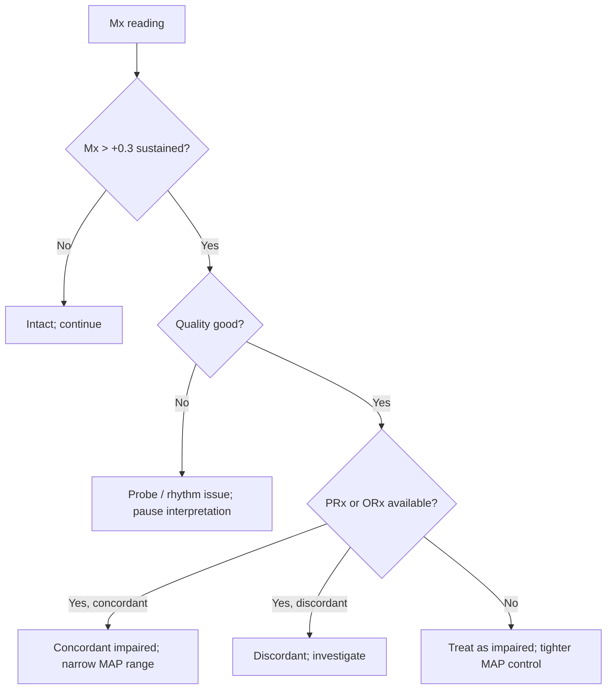

<Callout type="reference">
**Acronyms used on this page**

- **Mx**: mean-flow autoregulation index = Pearson correlation between MFV (TCD) and CPP (or MAP) over slow-wave frequencies
- **PRx**: pressure reactivity index = Pearson correlation between ICP and MAP slow waves
- **ORx**: oxygen reactivity index = Pearson correlation between NIRS rSO2 and MAP slow waves
- **MFV**: time-averaged mean flow velocity (TCD, cm/s)
- **CPP / MAP / ICP**: cerebral perfusion / mean arterial / intracranial pressure
- **CPPopt / MAPopt**: individualised optimal CPP / MAP (vertex of the autoregulation U-curve)
- **LLA / ULA**: lower / upper limit of autoregulation
- **TCD / TCCD**: transcranial Doppler / transcranial color-coded duplex
- **TBI / SAH / HIE / SE**: traumatic / subarachnoid / hypoxic-ischaemic / status epilepticus
- **MNM / MMM**: multimodal neuromonitoring / multimodal monitoring
</Callout>

<TldrCard>
**The 60-second version.** Mx is the **TCD-derived sibling of PRx**. Where PRx uses ICP (invasive) and MAP slow waves, Mx uses TCD MFV (non-invasive) and CPP (or MAP). The same Pearson correlation over the same slow-wave band (~0.003 to 0.05 Hz, 10 s averages over a 5 min window). **Mx > +0.3 = impaired autoregulation**; Mx near 0 or negative = intact. The Mx-vs-CPP U-curve gives an **Mx-CPPopt** that does not require a parenchymal ICP probe, making it the workhorse for patients pre-monitor-placement, post-monitor-removal, ECMO without invasive ICP, and centres without bolt-monitoring capability. Pediatric data are limited (Tas 2022 / 2024; Brady-style piglet validation). Limitations: needs reliable continuous TCD (robotic headframe ideal), is unreliable in irregular cardiac rhythms, and is artefact-prone in patients with low slow-wave power. <Cite id="czosnyka1996mx" /> <Cite id="aaslid1989_autoreg" /> <Cite id="aries2012cppopt" /> <Cite id="rivera-lara2017autoreg" />
</TldrCard>

## 1. Bedside vignettes: why this matters in the PICU

### Vignette A. Severe TBI, the bolt is delayed

A 7-year-old severe TBI patient is in the resus bay 90 minutes after the injury. GCS 6T, anisocoria right > left. The CT shows diffuse axonal injury without a surgical lesion; the operating room is preparing for a parenchymal monitor placement in 30 minutes. The MAP is 75, the team has a robotic-frame TCD over the left MCA, and the bedside platform computes a rolling Mx every 5 minutes. **Mx = +0.35.** Autoregulation is impaired even without an ICP monitor. The team understands that passive CBF tracks MAP linearly here; they target MAP gently (no aggressive fluid or vasopressor escalation) until the bolt is in. <Cite id="czosnyka1996mx" /> <Cite id="bouzat2014_tcd" />

### Vignette B. Adolescent SAH, MAPopt by Mx without ICP

A 16-year-old SAH on day 4 after coiling. An ICP monitor was placed initially and removed at 48 h with stable ICP. The patient is awake but drowsy, MAP 95. A bedside robotic TCD on the right MCA collects continuous MFV; the bedside platform plots Mx against MAP across the last 4 hours; the U-curve fit gives **MAPopt = 90**. The team adjusts the noradrenaline to bring MAP from 95 to 88 to 92, sitting within ±5 of MAPopt. This Mx-derived MAPopt replaces the now-removed invasive CPPopt and lets the team continue individualised autoregulation-guided BP management non-invasively. <Cite id="aries2012cppopt" /> <Cite id="donnelly2017mapopt" /> <Cite id="lang2003poss" />

### Vignette C. The patient with atrial fibrillation, Mx misbehaves

A 14-year-old with congenital heart disease and chronic atrial fibrillation after a cardiac arrest, day 3 post-rewarming. Bedside TCD is in place. The MFV envelope is highly variable beat-to-beat (irregular R-R intervals); the slow-wave power is dominated by the cardiac chaotic rhythm rather than autoregulatory slow waves; the computed Mx fluctuates wildly between −0.4 and +0.6 within a single hour. **Mx is not interpretable in this patient.** The team falls back to NIRS-derived ORx for non-invasive autoregulation and to clinical exam. This is a teaching pitfall: Mx requires a stable, low-frequency MFV signal to extract autoregulatory slow waves. <Cite id="czosnyka1996mx" /> <Cite id="rivera-lara2017autoreg" />

---

## 2. What Mx is, and what it is not

Mx is a **moving-window Pearson correlation** between the time-averaged mean flow velocity (MFV) from a continuous TCD trace and the cerebral perfusion pressure (CPP), or mean arterial pressure (MAP) if CPP is not computable. The correlation is computed over the **slow-wave band**, typically 0.003 to 0.05 Hz, using 10-second averages over a 5-minute rolling window.

**Three things follow.**

**Mx is the non-invasive cousin of PRx.** PRx uses ICP and MAP; Mx uses MFV and CPP (or MAP); ORx uses NIRS rSO2 and MAP. All three exploit the same physiology: in intact autoregulation, slow MAP waves do not produce slow CBF/MFV waves (the cerebrovascular bed adjusts CVR); in impaired autoregulation, slow MAP waves produce parallel slow MFV waves (passive flow). The Pearson correlation captures the parallelism. <Cite id="aaslid1989_autoreg" /> <Cite id="czosnyka1997prx" /> <Cite id="brady2007piglet" />

**Mx interpretation thresholds**:

| Mx value | Interpretation |
|---|---|
| Mx ≤ −0.1 | Intact autoregulation (MFV anti-correlates with CPP) |
| Mx 0 to +0.3 | Borderline / mildly impaired |
| Mx &gt; +0.3 | Impaired autoregulation (MFV passively tracks CPP) |
| Mx &gt; +0.5 | Severely impaired |

**The Mx-vs-CPP U-curve gives Mx-CPPopt.** Like PRx-CPPopt, plot Mx against CPP across 4 hours of data, fit a parabola, take the vertex. The U-curve allows estimation of LLA (where Mx crosses +0.3 on the left) and ULA (where Mx crosses +0.3 on the right). <Cite id="aries2012cppopt" /> <Cite id="lang2003poss" />

<Pearl>
**Mx is the autoregulation index for when you do not have ICP.** Pre-bolt-placement, post-bolt-removal, ECMO without invasive ICP, palliative or limited-care contexts: Mx + TCD + arterial line is the bedside non-invasive autoregulation triplet. <Cite id="czosnyka1996mx" />
</Pearl>

<Pediatric>
**Pediatric Mx data are sparse but growing.** Tas 2022 reported pediatric Mx feasibility in 30 severe TBI children. Brady's piglet model established Mx's validity against cortical laser Doppler. Pediatric thresholds appear similar to adult (Mx > +0.3 = impaired), though normative ranges in children with chronic conditions or in neonates remain to be established. <Cite id="tas2022peds" /> <Cite id="brady2007piglet" />
</Pediatric>

---

## 3. The architecture: Mx in the autoregulation triad

<Figure
  caption="The autoregulation index triad. All three indices compute a Pearson correlation over slow-wave frequencies (0.003 to 0.05 Hz) between a 'CBF-related' signal and a 'BP-related' signal. PRx: ICP (CBF surrogate, via Monro-Kellie) vs MAP. Mx: TCD MFV (large-vessel velocity, CBF proxy) vs CPP or MAP. ORx: NIRS rSO2 (tissue oxygenation, CBF / O2 utilisation proxy) vs MAP. All three return values from −1 to +1; intact autoregulation is at or below 0; impaired autoregulation is above +0.3. The three indices agree in the majority of patients but discord meaningfully in some (sepsis with microvascular shunting, mitochondrial dysfunction, ECMO, irregular cardiac rhythms)."
  attribution="MNM-Edu, original schematic."
  label="Fig. 1"
>
  <MxVsPrxArchitecture />
</Figure>

The three indices have different strengths and weaknesses:

| Index | Input signal | Invasive? | Best in | Weak in |
|---|---|---|---|---|
| **PRx** | ICP | Yes (bolt or EVD) | Patients with ICP monitor in place | Spontaneously breathing patients (intra-thoracic ICP noise) |
| **Mx** | TCD MFV | No (probe) | Pre- and post-monitor windows; centres without invasive monitoring | Irregular rhythms, low slow-wave power, sustained TCD coupling needed |
| **ORx** | NIRS rSO2 | No (pad) | Neonates and pediatrics; sustained NIRS already in place | Scalp / extracranial contamination; mixed compartments |

The three indices typically agree (Pearson > 0.6) but discord meaningfully in subsets of patients. The discordance is itself informative: PRx-ORx discord is a research topic in microvascular shunting and sepsis. <Cite id="rivera-lara2017autoreg" /> <Cite id="brady2010orx" />

<Figure
  caption="PRx versus Mx in the same patient over the same observation window. Top trace: ICP-derived PRx. Bottom trace: TCD-MFV-derived Mx. The slow-wave epochs overlap; the indices typically agree in the majority of patients (Pearson > 0.6 in adult severe TBI cohorts) but discord meaningfully where the input signals diverge. PRx requires a clean ICP slow-wave (artefact-free, sustained, non-spontaneous-breathing); Mx requires a sustained TCD coupling. Pick the index whose input signal is currently the most reliable, and re-check when conditions change."
  attribution="MNM-Edu, original schematic."
  label="Fig. 2"
>
  <MxAutoregContrast />
</Figure>

---

## 4. The signal: how Mx is computed

The bedside platform (ICM+, Sickbay, Brain4Care, or custom) requires:

1. **Continuous TCD trace** with envelope detection running, sampling MFV every 1 to 10 seconds.
2. **Continuous arterial line MAP** sampled at the same cadence.
3. **Continuous ICP** if computing CPP (else use MAP).
4. **Slow-wave extraction**: a band-pass filter (0.003 to 0.05 Hz) on both signals.
5. **Rolling Pearson correlation**: typically 10 s averages over a 5 min window, updated every 1 minute.
6. **Mx-vs-CPP binning**: collect Mx and CPP pairs across 4 to 6 hours, bin CPP into 5-mmHg windows, compute mean Mx per bin, fit a parabola.
7. **Display**: continuous Mx trend strip, U-curve fit with vertex, ±5 mmHg target band.

**Common implementation details.**

- **Sampling rate**: TCD at 100 to 200 Hz envelope; MAP at 100 Hz; downsample to common rate.
- **Slow-wave band selection**: most adult studies use 0.003 to 0.05 Hz; some pediatric studies use 0.01 to 0.05 Hz to avoid respiratory artefact from very slow neonatal respiration.
- **Artefact handling**: discard windows with > 20% missing data, electrode disconnection, ventilator manoeuvre, suction, posture change.
- **Trend smoothing**: 5 to 15 minute rolling mean of Mx is often what is displayed; the underlying minute-level Mx is more variable.

<Callout type="clinical-pearl">
**Robotic / fixed-headframe TCD is essential for sustained Mx monitoring.** Handheld TCD recordings drift over minutes as probe contact changes; the slow-wave correlation degrades; the Mx values become uninterpretable. A 4 to 6 hour Mx fit requires consistent envelope quality. <Cite id="lang2003poss" />
</Callout>

---

## 5. The numbers: what to record at the bedside

| Variable | Source | What it tells you |
|---|---|---|
| Mx (rolling 5 min) | Bedside platform | Autoregulation status, this moment |
| Mx (1 h average) | Bedside platform | Trend; less noisy |
| Mx-CPPopt (vertex of U-curve) | Bedside platform fit | Individualised target CPP |
| Mx-MAPopt | Bedside platform fit (when CPP unavailable) | Individualised target MAP |
| LLA and ULA from Mx U-curve | Bedside platform | Autoregulation range |
| Time-in-range (CPPopt ±5) | Bedside platform | How well you are meeting target |
| Concurrent PRx (if ICP in place) | Bedside platform | Mutual validation; discordance check |
| Concurrent ORx (if NIRS in place) | Bedside platform | Mutual validation; discordance check |
| TCD envelope quality and probe coupling | Bedside | Confidence in Mx |

Display Mx alongside PRx and ORx where all three are available; the multi-index view is the modern standard at research-grade centres.

---

## 6. What is normal? Mx interpretation reference

| Mx value | Interpretation | Action |
|---|---|---|
| Mx ≤ −0.1 | Intact autoregulation | Continue current MAP target |
| Mx 0 to +0.1 | Borderline; usually still intact | Continue, watch trend |
| Mx +0.1 to +0.3 | Mild impairment | Tighter MAP control; investigate causes |
| Mx +0.3 to +0.5 | Impaired | Narrow MAP range; reassess sedation, normothermia, normocapnia |
| Mx &gt; +0.5 | Severely impaired | Very narrow MAP range; CBF is passive |

Pediatric thresholds: limited data suggest the adult thresholds (>+0.3 impaired) hold; pediatric reference ranges remain a research priority. <Cite id="tas2022peds" /> <Cite id="rivera-lara2017autoreg" />

<Pediatric>
**Children with chronic conditions (CHD, mitochondrial disease) may have altered baseline Mx.** A "high" Mx in a chronic patient does not necessarily mean acute autoregulation failure; trend within the patient is the working unit.
</Pediatric>

---

## 7. What is abnormal? Pattern library

<Figure
  caption="Five Mx patterns. (a) Intact: Mx oscillating around −0.1 to 0 across MAP swings of 70 to 95 mmHg; U-curve fit shows narrow vertex at MAPopt 82. (b) Impaired: Mx +0.4 across the same MAP range; U-curve flattened; no clean MAPopt. (c) Mx-PRx-ORx concordant impaired: all three indices &gt; +0.3; high confidence in broken autoregulation. (d) Mx impaired, PRx intact (discordance): TCD-vs-arterial discordance from microvascular shunting; investigate. (e) Mx unreliable: irregular rhythm or low slow-wave power; fluctuating values; switch to ORx or pause Mx interpretation."
  attribution="MNM-Edu, original schematic. SVG placeholder."
  label="Fig. 2"
>
  <WidgetEmbed name="MxCalculator" />
</Figure>

| Pattern | Bedside signature | Action |
|---|---|---|
| Intact Mx | Mx ≤ 0, U-curve has clean vertex | Target MAPopt ±5; continue |
| Impaired Mx | Mx > +0.3 sustained | Narrow MAP range; reassess sedation, normothermia, normocapnia |
| Mx-PRx concordant | Both indices agree | High confidence in autoregulation interpretation |
| Mx-PRx discordant | One index says intact, the other impaired | Investigate: microvascular shunting, mixed compartments, technical issues |
| Mx with no clean U-curve | Flat or noisy Mx-vs-CPP fit | Insufficient CPP variation; cannot derive MAPopt yet |
| Mx fluctuating wildly | Mx swings from −0.4 to +0.6 within hours | Irregular rhythm, low slow-wave power; Mx unreliable |
| Sustained Mx negative | Mx < −0.3 sustained | Very intact autoregulation; broad MAP plateau |
| Mx improvement over days | Mx falling from +0.5 to 0 over 48 to 72 h | Recovery of autoregulation; encouraging trajectory |

### Decision tree: "what does Mx tell me?"

---

## 8. Try it: interactive widgets

<WidgetEmbed name="MxCalculator" />

<WidgetEmbed name="MAPoptUCurve" />

---

## 9. Mx-driven management decisions

### 9.1 Pre-monitor-placement triage

A severe TBI patient awaiting parenchymal monitor placement: Mx + TCD + arterial line provides a non-invasive autoregulation read in real time. Mx > +0.3 suggests broken autoregulation: do not push MAP aggressively; the volume goes to tissue (oedema) not to useful perfusion.

### 9.2 Post-monitor-removal CPPopt continuity

A SAH patient whose ICP monitor has been removed at 48 to 72 h but who still needs autoregulation-guided BP management: Mx + TCD continues the personalised CPP / MAP target where PRx-CPPopt left off. <Cite id="aries2012cppopt" /> <Cite id="donnelly2017mapopt" />

### 9.3 Centres without invasive monitoring

Resource-limited centres or palliative-context patients may have no parenchymal monitor. Mx is the bedside autoregulation index of choice. The pediatric MMM consensus places Mx-driven autoregulation monitoring in tier-2 modalities for resource-stratified pediatric centres. <Cite id="figaji2025_mmm_pediatric_consensus" /> <Cite id="helbok2024_pediatric_mmm" />

### 9.4 Pediatric ECMO

VA-ECMO patients without invasive ICP. Mx is technically harder on full-flow ECMO (TCD PI falls toward zero with loss of pulsatility, but the slow-wave MFV component can still be extracted). Some centres run Mx on partial-flow ECMO; others use ORx instead. <Cite id="lorusso2017_elso_neuro" /> <Cite id="cho2024_ecmo_outcomes" />

### 9.5 The mutual-validation use case

When ICP is present and PRx is computed, adding Mx serves as a cross-check. PRx-Mx concordance raises confidence; discordance flags a technical issue (probe coupling, ICP artefact) or a real microvascular / shunting phenomenon worth investigating. <Cite id="rivera-lara2017autoreg" />

<Callout type="caveat">
**Teaching, not protocol.** Mx interpretation thresholds (>+0.3 impaired) and MAPopt offset (±5 mmHg) are adult-derived heuristics with limited pediatric validation. Local protocols and clinical judgment supersede a single Mx value. Defer to your unit's senior team for Mx-driven decisions.
</Callout>

<AlgorithmDisclaimer />

---

## 10. Clinical contexts: Mx across acute brain injuries

### 10.1 Severe TBI

The largest body of Mx evidence. Mx > +0.3 sustained is associated with worse outcome in adult TBI (Czosnyka 1996, Lang 2003, Aries 2012). Pediatric data: Tas 2022 in 30 children with severe TBI showed Mx-CPPopt feasibility; outcome correlation requires larger cohorts. <Cite id="czosnyka1996mx" /> <Cite id="lang2003poss" /> <Cite id="aries2012cppopt" /> <Cite id="tas2022peds" />

### 10.2 Aneurysmal SAH

Mx use in SAH covers two windows: peri-coiling (where Mx informs hemodynamic management) and post-monitor-removal (Mx-derived MAPopt continues autoregulation-guided care). <Cite id="hoh2023sah_aha" /> <Cite id="rass2021dci_review" />

### 10.3 Pediatric AIS

Limited Mx use in pediatric AIS; the bedside framework is BP target (often NIRS-driven) plus monitoring. Research interest in continuous TCD + Mx during recanalisation procedures. <Cite id="ferriero2019aha_pedstroke" /> <Cite id="sun2020_pediatric_thrombectomy" />

### 10.4 HIE and post-cardiac arrest

In neonatal HIE, NIRS-derived ORx is more commonly used than TCD-derived Mx because NIRS pads are easier to maintain than TCD probes in neonates. In pediatric post-arrest, Mx (where TCD is sustained) plays a role in multimodal prognostication and BP target setting. <Cite id="topjian2021aha_pediatric" /> <Cite id="naim2023_brain_injury_pccm" /> <Cite id="kirschen2020_pedshie_tcd" />

### 10.5 Pediatric ECMO

Investigational. The non-pulsatile ECMO circulation alters TCD signal in ways that complicate Mx; some centres use it on partial-flow ECMO. <Cite id="lorusso2017_elso_neuro" /> <Cite id="larovere2017_ecmo" />

### 10.6 Meningitis and encephalitis with raised ICP

Less common indication. Mx can supplement bedside management in fulminant meningitis with broken autoregulation; the primary management remains source control and ICP / CPP / fluid balance. <Cite id="tunkel2017idsa_encephalitis" /> <Cite id="vandebeek2016eu_meningitis" />

### 10.7 Brain-death determination

Not a brain-death tool. As cerebral circulatory arrest approaches, the TCD signal degenerates (oscillating, pendular, systolic spikes), and Mx becomes uninterpretable. The TCD findings themselves are ancillary; Mx is not. <Cite id="nakagawa2011peds_bd" /> <Cite id="rasulo2008" />

### 10.8 DKA cerebral oedema

Limited published Mx use. In DKA-CO with broken autoregulation (theoretical concern), Mx could refine the BP / fluid management during rehydration; not standard practice. <Cite id="kuppermann2018_pecarn_dka" /> <Cite id="glaser2024_dka_review" />

### 10.9 Peri-arrest research contexts

Mx has been used in cardiac surgery, post-CPR research, and CPR optimisation studies as a bedside autoregulation index. Pediatric and adult research data continue to accumulate. <Cite id="rivera-lara2017autoreg" />

---

## 11. Multimodal integration: Mx in the MMM/MNM stack

| Pair with… | What you gain | Worked scenario |
|---|---|---|
| **PRx** (when ICP present) | Mutual validation; both indices computed | Pre-monitor removal: PRx ≈ Mx; post-monitor: Mx alone continues |
| **ORx** | The non-invasive autoregulation pair | Mx and ORx concordant impaired = strong evidence |
| **CPP / MAP** | The hemodynamic substrate of Mx | Mx U-curve → MAPopt → BP target |
| **TCD beyond Mx** | PSV, EDV, PI; Lindegaard for spasm | SAH: rising MFV (vasospasm) + worsening Mx (autoregulation) |
| **NIRS** | rSO2 trend complements Mx; ORx is the formal pair | Sepsis: falling rSO2 + Mx worsening = global cerebral stress |
| **PbtO2** | Tissue oxygen with regional Mx | TBI: low PbtO2 with impaired Mx = act |
| **Clinical exam** | Always the gate | Exam declining at "good" MAP: check Mx |

<Cite id="figaji2025_mmm_pediatric_consensus" /> <Cite id="helbok2024_pediatric_mmm" /> <Cite id="tasker2023mnm" /> <Cite id="leroux2014_neurocrit_consensus" />

---

<DeepDive>

## 12. Setup and technique

### 12.1 Equipment

- **Continuous TCD probe** (2 MHz pulsed-wave or TCCD), with a **robotic / fixed headframe** for hours-long monitoring (DWL Doppler-Box, Atys Robotic, Dolphin, Lucid M1).
- **Synchronised arterial-line MAP** at 100 Hz minimum.
- **Synchronised ICP** if CPP is to be computed (else use MAP).
- **Bedside platform**: ICM+, Sickbay, custom Python pipeline, or vendor-integrated Mx computation.
- **Adequate ambient quiet**: scanner / staff traffic moves the probe.

### 12.2 The setup workflow

1. **Identify the temporal window** and obtain a clean MCA M1 envelope.
2. **Position the robotic headframe** so the probe is locked into the chosen angle and depth.
3. **Verify the spectrum** continuously: bright clean envelope, no overgain, no aliasing.
4. **Confirm MAP recording** (calibrated, square-wave test passed).
5. **Confirm time-synchronisation** between the TCD and the arterial line (most platforms autosync within ms).
6. **Start the rolling Mx computation** (typically 5 min window, 1 min update).
7. **Display** alongside MAP, ICP (if present), PRx, ORx.

### 12.3 The Mx-CPPopt or Mx-MAPopt fit

1. **Collect ≥ 4 hours of data** with Mx and CPP (or MAP) sampled continuously.
2. **Bin** CPP into 5 mmHg windows; compute mean Mx per bin.
3. **Fit a parabola** (least-squares, often with manual selection of fit region to exclude outliers).
4. **Vertex** = MAPopt (or CPPopt).
5. **Target** MAP (or CPP) within ±5 mmHg of the vertex.
6. **Re-fit** every 1 to 4 hours; the fit can shift over time as the patient evolves.

### 12.4 Quality control

- **Probe coupling**: re-aim every 1 to 2 hours or use a robotic frame; probe drift is the leading source of Mx artefact.
- **Slow-wave content**: if the patient is in deep anaesthesia with very flat haemodynamics, slow-wave power may be inadequate for reliable Mx; flag and pause interpretation.
- **Irregular rhythms**: AFib, frequent ectopy, paroxysmal SVT all degrade Mx; use ORx or pause.
- **Artefact rejection**: discard windows around suction, posture change, ventilator manoeuvres.
- **Document quality** with every Mx report: high / medium / low confidence based on probe coupling, slow-wave power, rhythm regularity.

### 12.5 Pediatric-specific considerations

- **Smaller temporal windows** in neonates may favour TCCD over blind TCD.
- **Higher respiratory rates** in neonates shift the respiratory artefact band; the 0.01 to 0.05 Hz slow-wave window may need adjustment.
- **Restless or unsedated children** complicate sustained TCD; sedation status must be documented.
- **Pediatric Mx normative data** are sparse; threshold (>+0.3) extrapolated from adult; treat as research-grade.

### 12.6 When Mx is not the right tool

- **Cardiac rhythm chaos** (AFib, frequent VT, post-arrest dysrhythmias): use ORx or pause.
- **Inadequate slow-wave power** (deep anaesthesia, flat haemodynamics): pause until physiology recovers.
- **Probe coupling unsustainable** (toddler agitation, ECMO traffic, no robotic frame): use ORx.
- **Acute pre-arrest state**: TCD signal degenerates; Mx uninterpretable.

</DeepDive>

---

## 13. Pitfalls

- **Probe drift** during long recordings: envelope dims over minutes; Mx degrades; use a robotic / fixed frame.
- **Irregular cardiac rhythms** dominate slow-wave power and corrupt Mx; AFib, frequent ectopy, paroxysmal SVT all confound.
- **Low slow-wave power** (deep anaesthesia, flat haemodynamics): Mx unreliable.
- **Single-snapshot Mx**: trend over hours is the diagnostic signal.
- **Pediatric normative data sparse**: treat thresholds as adult-derived heuristics.
- **Mx vs MAP without ICP**: do not equate Mx-vs-MAP with Mx-vs-CPP if ICP is changing; ICP variation alters CPP for a constant MAP.
- **Confusing Mx with PI**: Mx is a slow-wave correlation; PI is a per-beat ratio; they measure different things.
- **Mx-PRx discordance interpreted as one being "wrong"**: discordance is often physiology (microvascular shunting, mixed compartments), not error.
- **Mx unreliable during post-arrest TCD degradation**: TCD spectrum changes during cerebral circulatory arrest; the slow-wave correlation does not apply.
- **Treating Mx as a treatment target itself**: Mx is a guide to CPP / MAP target setting, not a direct treatment goal.

---

## 14. Combine with…

- [TCD](/modalities/tcd/): the parent modality; Mx is one of its derived indices.
- [PRx](/modalities/prx/): the invasive sibling; mutual validation when ICP is in place.
- [ORx](/modalities/orx/): the NIRS-based non-invasive partner; ORx is more practical in neonates.
- [CPP](/modalities/cpp/): the upstream variable that Mx-CPPopt targets.
- [CPPopt](/modalities/cppopt/): the dedicated CPPopt page with workflow detail.
- [Foundations: autoregulation](/foundations/autoregulation/): the physiology behind Mx, PRx, ORx.

---

<DeepDive>

## 15. Evidence summary

| Topic | Source | Grade |
|---|---|---|
| Original Mx description | <Cite id="czosnyka1996mx" /> | B |
| Dynamic autoregulation by TCD | <Cite id="aaslid1989_autoreg" /> | B |
| Mx in continuous bedside monitoring | <Cite id="lang2003poss" /> | B |
| Brady piglet validation of autoregulation indices | <Cite id="brady2007piglet" /> <Cite id="brady2009piglet" /> | B |
| ORx (NIRS-based autoregulation) | <Cite id="brady2010orx" /> | B |
| PRx (the original) | <Cite id="czosnyka1997prx" /> | A |
| Aries CPPopt | <Cite id="aries2012cppopt" /> | B |
| Donnelly MAPopt extension | <Cite id="donnelly2017mapopt" /> | B |
| Rivera-Lara autoregulation review | <Cite id="rivera-lara2017autoreg" /> | review |
| Pediatric Mx feasibility (Tas 2022) | <Cite id="tas2022peds" /> | C |
| Pediatric CPPopt (Tas 2024) | <Cite id="tas2024_pediatric_cppopt" /> | C |
| COGiTATE feasibility trial | <Cite id="beqiri2024_cogitate" /> | A |
| Pediatric MMM consensus | <Cite id="figaji2025_mmm_pediatric_consensus" /> <Cite id="helbok2024_pediatric_mmm" /> | expert |
| LeRoux 2014 neurocritical consensus | <Cite id="leroux2014_neurocrit_consensus" /> | expert |
| Pediatric ECMO TCD | <Cite id="larovere2017_ecmo" /> | C |
| HIE post-arrest TCD | <Cite id="kirschen2020_pedshie_tcd" /> | C |

## 16. Recent literature (2022 to 2025)

- **Beqiri 2024 COGiTATE**: randomised feasibility of CPPopt-targeted MAP management in adult TBI; provides class-A evidence for the CPPopt framework that Mx-CPPopt extends non-invasively. <Cite id="beqiri2024_cogitate" />
- **Tas 2022 pediatric Mx feasibility**: 30 children with severe TBI; Mx computable and clinically actionable. <Cite id="tas2022peds" />
- **Tas 2024 pediatric CPPopt**: extended pediatric CPPopt feasibility; Mx-derived CPPopt as part of the toolkit. <Cite id="tas2024_pediatric_cppopt" />
- **Rivera-Lara 2017 autoregulation review** (still the standard primer): positions Mx in the triad with PRx and ORx. <Cite id="rivera-lara2017autoreg" />
- **Figaji 2025 pediatric MMM consensus**: Mx and Mx-CPPopt recognised as tier-2 (specialist centre) modalities. <Cite id="figaji2025_mmm_pediatric_consensus" />
- **Helbok 2024 pediatric MMM**: bedside operationalisation, including pre-monitor / post-monitor Mx workflows. <Cite id="helbok2024_pediatric_mmm" />

</DeepDive>

---

## 17. Self-check

<Quiz
  questions={[
    {
      id: 'q1',
      prompt: 'A 7-year-old severe TBI patient is awaiting parenchymal ICP probe placement (30 min away). Robotic TCD over the left MCA is in place; bedside Mx (rolling 5 min) = +0.35; MAP 75 mmHg. Best interpretation and action?',
      options: [
        { id: 'a', label: 'Autoregulation impaired; aggressive MAP escalation to 95 to push CBF higher' },
        { id: 'b', label: 'Autoregulation impaired (Mx &gt; +0.3); CBF is passively tracking MAP; avoid aggressive MAP changes; target MAP gently within age-appropriate range until ICP monitor is in place' },
        { id: 'c', label: 'Mx is unreliable without ICP; ignore' },
        { id: 'd', label: 'Lower MAP to 60 to reduce risk of hyperperfusion' },
      ],
      answer: 'b',
      explanation: 'Mx > +0.3 indicates impaired autoregulation. In this state, raising MAP linearly raises CBF and can produce hyperaemia, oedema, and worsen ICP without delivering useful perfusion. The bedside action is gentle, age-appropriate MAP targeting (avoid both hypotension and hypertension) until the invasive monitor allows full PRx / CPPopt computation. Mx without ICP gives Mx-vs-MAP rather than Mx-vs-CPP but is still interpretable for autoregulation status. Lowering MAP to 60 in a young child with TBI risks falling below the lower limit of autoregulation; the age-banded CPP minimum for a 7-year-old is ~60 to 70 (typically computed from MAP minus ICP, which we do not yet have).',
    },
    {
      id: 'q2',
      prompt: 'A 14-year-old with chronic atrial fibrillation post-arrest, day 3. Bedside Mx swings between −0.4 and +0.6 within a single hour. ORx is around +0.1, stable. Best interpretation?',
      options: [
        { id: 'a', label: 'Severely fluctuating autoregulation; aggressive management' },
        { id: 'b', label: 'Mx is unreliable in irregular cardiac rhythms because slow-wave power is dominated by rhythm chaos; fall back to ORx (which appears stable and borderline-normal) for autoregulation guidance' },
        { id: 'c', label: 'Recalibrate the TCD probe; the readings are wrong' },
        { id: 'd', label: 'Stop autoregulation monitoring; not applicable in AFib' },
      ],
      answer: 'b',
      explanation: 'Mx relies on extracting autoregulatory slow waves from the MFV signal. In atrial fibrillation, the beat-to-beat variability is large and irregular; the dominant low-frequency power is from rhythm chaos rather than autoregulatory slow waves; the computed Pearson correlation oscillates wildly and is uninterpretable. ORx (NIRS-based, tissue-level) is more robust in this context because it averages over tissue oxygenation across many beats. Switching to ORx for the autoregulation read is the appropriate fallback. Probe recalibration would not fix an inherent signal-processing limitation. Autoregulation monitoring is still relevant in AFib; the tool changes.',
    },
    {
      id: 'q3',
      prompt: 'A 16-year-old SAH on day 4 had her ICP monitor removed at 48 h with stable ICP. Robotic TCD over the right MCA collects continuous MFV; bedside platform plots Mx against MAP across the last 4 h; U-curve vertex at MAP 90 (MAPopt 90). Current MAP 95 on noradrenaline infusion. Best action?',
      options: [
        { id: 'a', label: 'Continue noradrenaline at current dose; MAP 95 is within 5 of MAPopt 90' },
        { id: 'b', label: 'Reduce noradrenaline to bring MAP to 88 to 92 (within ±5 of MAPopt); recheck Mx in 1 h and re-fit MAPopt every 1 to 4 h' },
        { id: 'c', label: 'Push MAP to 110 because higher MAP is always safer in SAH' },
        { id: 'd', label: 'Restart the invasive ICP monitor immediately' },
      ],
      answer: 'b',
      explanation: 'The Mx-MAPopt of 90 is the patient\'s individualised target; the recommended target band is ±5 mmHg of the vertex (85 to 95). MAP 95 is at the upper edge; gentle reduction toward the centre of the band (88 to 92) is appropriate. Re-fitting MAPopt every 1 to 4 h captures evolution. Pushing MAP to 110 would shift the patient to the right of MAPopt, where Mx becomes more positive (autoregulation broken, hyperperfusion risk); this is harmful. Reinserting the invasive monitor is not warranted if the non-invasive Mx-MAPopt framework is providing actionable guidance and the clinical course is stable. The COGiTATE-style protocol (Beqiri 2024) and the Mx-CPPopt extension (Aries 2012, Donnelly 2017) provide the conceptual basis.',
    },
  ]}
/>
