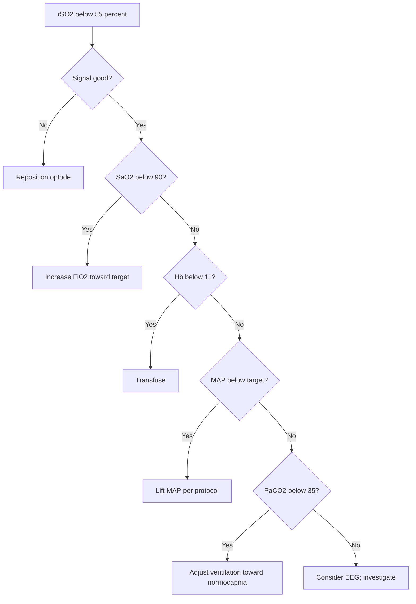

<Callout type="reference">
**Acronyms used on this page**

- **NIRS**: near-infrared spectroscopy
- **rSO2**: regional cerebral oxygen saturation (%), the principal output
- **ORx**: cerebral oximetry reactivity index = correlation (rSO2, MAP) at slow-wave frequencies
- **COx**: cerebral oximetry index (similar; some literature reserves COx for the unaveraged rSO2-MAP correlation)
- **HbO / HbR / HbT**: oxygenated / deoxygenated / total haemoglobin (μM)
- **CHD**: congenital heart disease · **CBP**: cardiopulmonary bypass
- **NICU / CICU / PICU**: neonatal / cardiac / pediatric intensive care unit
- **SafeBoosC**: SafeBoosC II and III neonatal NIRS trials
- **TBI / SAH / HIE / DCI**: traumatic brain injury / subarachnoid haemorrhage / hypoxic-ischaemic encephalopathy / delayed cerebral ischaemia
- **MMM / MNM**: multimodal monitoring / multimodal neuromonitoring
</Callout>

<TldrCard>
**The 60-second version.** NIRS is **continuous transcutaneous cerebral oximetry** using two near-infrared wavelengths (typically 730 and 810 nm) emitted from a forehead optode and detected at two distances (close and far) to subtract scalp contamination. The output, **rSO2**, is a **regional, mostly venous-weighted saturation** (~75% venous, 25% arterial) of a 2–3 cm cortical sample below the optode. **Trend, not absolute.** Baseline rSO2 varies 60–85% across pediatric ages and devices; the bedside number is the change from baseline and the time spent below threshold. Two action thresholds dominate the literature: **rSO2 < 50%** for adults and older children (CHD intra-op; severe TBI) and **rSO2 < 40%** for preterm SafeBoosC neonates. The slow-wave correlation between rSO2 and MAP gives **ORx**, a non-invasive autoregulation index that works in ECMO and in any patient without an invasive ICP monitor. NIRS pairs with TCD (macro vs micro), PbtO2 (regional non-invasive vs invasive), and EEG (rSO2 reactivity loss + isoelectric EEG = worst-case post-arrest signature).
</TldrCard>

## 1. Bedside vignettes: why this matters in the PICU

### Vignette A. CHD on bypass, rSO2 crashes during arch reconstruction

A 6-month-old undergoing Norwood-stage arch reconstruction on cardiopulmonary bypass. Pre-bypass baseline rSO2 72% bilaterally. On selective antegrade cerebral perfusion during arch repair, the **left rSO2 drops to 45% and the right to 58%**, asymmetric. The perfusionist increases pump flow, the surgeon adjusts the cannula, and the rSO2 returns to 65% within 90 seconds. Without NIRS, the asymmetry would not have been detected; the left-arm reading might have remained "acceptable" because cerebral perfusion was selectively compromised. Post-op MRI at day 5 shows no new ischaemic lesions. **The intra-operative NIRS trend changed surgical decisions in real time.** <Cite id="kurth2009" /> <Cite id="naim2023_brain_injury_pccm" />

### Vignette B. Preterm 28-weeker, SafeBoosC algorithm

A 28-week preterm in the NICU, day 1. NIRS rSO2 oscillating between 40 and 55%, time below 55% accumulating at ~25% of monitored time. The SafeBoosC III algorithm fires: confirm signal, check FiO2 and arterial saturation, check Hb (transfuse if < 11), check MAP (lift if below age-appropriate), check PaCO2 (avoid hypocapnia). The team transfuses for a haemoglobin of 9.5 and raises FiO2 from 0.21 to 0.25; rSO2 stabilises at 65%. The full SafeBoosC III trial showed **no overall difference in death or severe brain injury**, but a per-protocol analysis suggested benefit in the subset where the algorithm was strictly applied. <Cite id="hyttel2015safeboosc" /> <Cite id="hansen2023safeboosciii" /> <Cite id="plomgaard2024_safeboosc3" />

### Vignette C. PICU septic shock, rSO2 falls despite stable BP

A 5-year-old in septic shock day 1, MAP 65 (above the age-adjusted target), on noradrenaline 0.3 mcg/kg/min. The bedside NIRS shows **rSO2 declining from 68% on admission to 52% over 6 hours, despite stable MAP and lactate falling**. **ORx has become positive (+0.35)** suggesting impaired cerebral autoregulation. The team interprets this as the start of microcirculatory failure: macroscopic perfusion looks fine but tissue oxygenation is suffering. They escalate to MAP target 75 (per noradrenaline titration), and rSO2 stabilises at 60%; ORx falls to +0.10. **NIRS detected what BP-only monitoring missed.** <Cite id="brady2010orx" /> <Cite id="andresen2014nirs" /> <Cite id="rivera-lara2017autoreg" />

---

## 2. What NIRS is, and what it is not

NIRS is **continuous transcutaneous cerebral oximetry** based on the **modified Beer-Lambert law**: light at two wavelengths is differentially absorbed by oxygenated (HbO) and deoxygenated (HbR) haemoglobin, and the ratio gives saturation.

```math
\mathrm{rSO}_2 = \frac{\mathrm{HbO}}{\mathrm{HbO} + \mathrm{HbR}} \times 100\%
```

Two wavelengths are typical: ~730 nm (peak HbR absorption) and ~810 nm (isobestic). Modern devices use 4 wavelengths plus algorithms to reduce extracerebral contamination via the **near-far detector subtraction** (the near detector samples scalp/skull, the far detector samples scalp/skull + cortex; the difference is the cortical sample).

**What rSO2 represents.** A 2–3 cm "banana-shaped" cortical sample under the optode, weighted approximately **75% venous, 25% arterial**. This is **not** a global brain measurement; it is a **frontal-cortical regional sample**. With bilateral optodes, the asymmetry is itself a clinical signal.

**Two things follow.**

**NIRS measures regional, not global.** A unilateral MCA occlusion will produce ipsilateral rSO2 drop without changing the contralateral side. Bilateral optodes are essential whenever the lesion can be unilateral.

**NIRS is venous-weighted.** rSO2 falls when tissue extracts more O2 (rising CMRO2 with stable supply) or when delivery falls (low CBF, low SaO2, low Hb). It does not separate these causes; pair with TCD (delivery), PbtO2 (tissue), and EEG (demand).

<Pearl>
**Trend, not absolute.** Baseline rSO2 varies by device (INVOS, Foresight, Masimo, EQUANOX read different absolute numbers on the same patient), by age, by Hb, and by skin pigmentation. The clinically useful number is **fractional change from baseline** and **time below threshold**. <Cite id="davies2017nirs" /> <Cite id="naim2023_brain_injury_pccm" />
</Pearl>

<Pediatric>
**Pediatric rSO2 norms are age-dependent.** Term newborns sit at 70–80% (high baseline due to lower CMRO2). Preterm neonates 70–90% in the first 72 hours, falling as the brain matures. Older children and adolescents 65–75% on most modern devices. The **SafeBoosC threshold of 55%** (intervention target) and **55–85% target range** for preterms is the most validated pediatric specific threshold. <Cite id="hyttel2015safeboosc" /> <Cite id="plomgaard2024_safeboosc3" /> <Cite id="naim2023_brain_injury_pccm" />
</Pediatric>

---

## 3. Optode placement and physics

<Figure
  src="/images/nirs/nirs-optode-placement.png"
  alt="Left panel: frontal view of a paediatric face with two NIRS optode pads placed symmetrically over the frontal cortex, 2 cm above each eyebrow and 3 cm lateral to midline; each pad shows a yellow source and teal detector with 3 cm spacing. Right panel: magnified sagittal cross-section of scalp (~5 mm), skull (~5-7 mm), CSF, and cortex (grey matter) showing the source LED (730 and 810 nm) plus a near detector D1 (~1.5 cm) and far detector D2 (~3 cm); banana-shaped photon paths illustrate that D2 minus D1 subtracts scalp and skull contamination so the residual signal samples cortex at 1-2 cm depth. Bottom panels: modified Beer-Lambert equation and bedside normal ranges."
  caption="NIRS optode geometry. A near-infrared source LED (730 + 810 nm) emits into the scalp. Two detectors at different source-detector distances are paired: a near detector D₁ (~1.5 cm) samples scalp and superficial skull; a far detector D₂ (~3 cm) samples scalp + skull + ~2 cm of frontal cortex. The D₂ − D₁ spatial subtraction removes extracerebral contamination so the residual signal reflects cortical haemoglobin. Sample volume ≈ 5–10 mL of cortex. Standard placement: 2 cm above each eyebrow, 3 cm lateral to midline, bilateral over frontal cortex. The modified Beer-Lambert relation (A = ε·c·d·DPF + G) at two wavelengths gives HbO₂ and HbR, from which rSO₂ % is derived. Bedside normal: term newborn 65-85%, older child / adult 60-80%, asymmetry > 10% warrants investigation; the sample is weighted ~70% venous : 25% arterial."
  attribution="MNM-Edu, original schematic. Modified Beer-Lambert; banana-shape photon migration."
  label="Fig. 1"
/>

**Optode placement.** Standard frontal placement: 2 cm above each eyebrow, 3 cm lateral to midline. This samples frontal cortex bilaterally. Some protocols add a third optode (occipital or temporal) for monitoring posterior circulation in specific contexts.

**Skin prep.** Clean, dry, intact skin. Hair under the optode falsifies the signal; shave or use a tight optode contact. Skin pigmentation slightly biases the absolute number (darker skin reads ~2–5% lower on some devices) but trends are reliable across pigmentation.

**Light shielding.** Ambient light (especially halogen, fluorescent, and sunlight) interferes with the detector. Light-tight covers are standard.

**Sample volume.** The 2–3 cm penetration depth limits NIRS to **cortical sampling**. Deep grey matter (basal ganglia, thalamus) and brainstem are not sampled.

---

## 4. The numbers: what to record and in what order

For every patient, on every shift, record this six-pack:

| Variable | What it tells you | Bedside use |
|---|---|---|
| rSO2 (left, right) | Regional cortical oxygenation | Primary number; trend per shift |
| Fractional change from baseline | Δ rSO2 / baseline | More informative than absolute; alert at > 20% drop |
| Time below threshold | Minutes with rSO2 < 50% (or 40% preterm) | Dose-response analogue; outcome-mapped |
| ORx | Correlation (rSO2, MAP) | Autoregulation index, non-invasive |
| Asymmetry | abs(left − right) | > 10% suggests unilateral pathology |
| Variability | Standard deviation over 1 h | High variability suggests sensor problem or vasomotor instability |

**Why time-below-threshold matters.** In adult cardiac surgery, NIRS-guided intervention reduces stroke and cognitive decline when time below 80% of baseline is treated. In neonatal CHD, time below 50% predicts MRI injury. In preterm SafeBoosC, time below 55% is the algorithm trigger. The pediatric severe-TBI literature (Davies 2017) uses time below 50% as a comparable threshold. <Cite id="davies2017nirs" /> <Cite id="hyttel2015safeboosc" /> <Cite id="plomgaard2024_safeboosc3" /> <Cite id="naim2023_brain_injury_pccm" />

---

## 5. What is normal? Age-banded reference values

| Age | rSO2 baseline range | Action threshold |
|---|---|---|
| Preterm 24–32 wk | 70–90% | < 55% (SafeBoosC algorithm) |
| Term newborn (< 7 d) | 70–80% | < 50% or > 20% drop from baseline |
| Infant 1–11 mo | 65–80% | < 50% or > 20% drop |
| Toddler 1–3 y | 65–78% | < 50% |
| Child 4–11 y | 65–75% | < 50% |
| Adolescent 12–18 y | 60–75% | < 50% |
| Adult reference | 60–75% | < 50% or 20% drop from baseline |

Sources: <Cite id="kurth2009" /> <Cite id="hyttel2015safeboosc" /> <Cite id="plomgaard2024_safeboosc3" /> <Cite id="davies2017nirs" /> <Cite id="andresen2014nirs" />.

**Device-specific differences matter.** INVOS reads ~5% lower than Foresight on the same patient. Masimo O3 and EQUANOX have their own calibration curves. **Within a single patient on a single device**, the trend is the clinically useful signal; **across devices and across patients**, absolute comparisons are unreliable.

<Pediatric>
**SafeBoosC framework: the most validated pediatric NIRS algorithm.** Designed for preterm neonates (24–32 weeks). Targets rSO2 between 55 and 85%; algorithm triggers escalating interventions for time below or above the band. SafeBoosC II (proof-of-concept, 2015) showed feasibility; SafeBoosC III (2023, ~1600 preterms) showed no overall benefit on death or severe brain injury but per-protocol analysis suggested benefit in centres with strict adherence. <Cite id="hyttel2015safeboosc" /> <Cite id="hansen2023safeboosciii" /> <Cite id="plomgaard2024_safeboosc3" />
</Pediatric>

---

## 6. What is abnormal? A pattern library

<Figure
  src="/images/nirs/rso2-trend-shock.svg"
  alt="Five rSO2 patterns: stable baseline, hypoperfusion drop, hyperaemia, sensor artefact, asymmetric unilateral lesion"
  caption="Five canonical rSO2 patterns over a 4-hour PICU recording. (a) Stable baseline at 72% bilaterally. (b) Hypoperfusion drop: gradual fall from 70% to 50% over 90 minutes, often paired with falling BP, lactate rising, or CO2 falling. (c) Hyperaemia: rise from 70% to 88% in post-arrest 'luxury' or fever. (d) Sensor artefact: jumpy trace, asymmetric without clinical correlate, often sensor migration. (e) Asymmetric unilateral lesion: left 70%, right 48% sustained; classic for unilateral MCA occlusion or selective cerebral perfusion failure."
  attribution="MNM-Edu, original schematic. SVG placeholder."
  label="Fig. 2"
/>

| Pattern | Bedside meaning | What to do |
|---|---|---|
| Stable baseline 65–75% | Normal cortical perfusion | Continue monitoring |
| Bilateral drop > 20% from baseline | Hypoperfusion, hypoxia, or low Hb | Check MAP, SaO2, Hb, CO2; treat accordingly |
| Bilateral rise to 80–90% | Hyperaemia (post-arrest luxury, fever, vasodilator) | Investigate; pair with EEG and TCD |
| Asymmetric (> 10% difference) | Unilateral pathology (MCA occlusion, selective perfusion, sensor migration) | Confirm with imaging; check optode placement |
| ORx > +0.3 sustained | Impaired autoregulation | Re-target MAP per ORxopt where available |
| Jumpy trace with poor coupling | Sensor artefact, hair, ambient light | Reposition, replace optode |
| rSO2 < 50% sustained | Cerebral hypoxia regardless of cause | Acute action: airway, breathing, circulation, transfusion |
| rSO2 sustained > 85% in HIE / post-arrest | Luxury perfusion pattern: bad prognosis | Pair with EEG; counsel family |

---

## 7. Try it: interactive widgets

<WidgetEmbed name="NIRSDisplay" />

<WidgetEmbed name="OrxCalculator" />

<WidgetEmbed name="MultimodalDiscordance" />

---

## 8. BP / CPP management with ORx

ORx (cerebral oximetry reactivity index) is the slow-wave correlation between rSO2 and MAP, computed over the same 5-minute window as PRx.

```math
\mathrm{ORx} = \mathrm{corr}(\mathrm{rSO2}_{10\text{-s avg}}, \mathrm{MAP}_{10\text{-s avg}})
```

**Interpretation.** When autoregulation is intact, rSO2 is stable across MAP changes (the cortex compensates for delivery changes via vasomotor tone). ORx is near zero or negative. When autoregulation is impaired, rSO2 follows MAP passively. ORx becomes positive (> +0.3 indicates impairment).

<Figure
  src="/images/nirs/orx-vs-prx-discordance.svg"
  alt="ORx vs PRx vs CPP plot showing concordant intact, concordant impaired, and discordant cases where ORx and PRx disagree"
  caption="ORx vs PRx in the same patient. Concordant cases (both near zero or both impaired) confirm autoregulatory state. Discordant cases (ORx positive, PRx near zero, or vice versa) are not noise; they reflect different sample volumes. PRx samples whole-brain ICP (global), ORx samples regional frontal cortex (local). A regional lesion (frontal contusion) may impair ORx without affecting global PRx; a deep lesion (basal ganglia, brainstem) may impair PRx without affecting frontal ORx. Discordance is information about where the autoregulatory failure lies."
  attribution="MNM-Edu, original schematic. SVG placeholder."
  label="Fig. 3"
/>

### 8.1 ORxopt: the NIRS-only individualised target

The same parabolic fit logic as PRx-CPPopt applies. Plot (MAP, ORx) over the past 4 hours, fit a parabola, the vertex is **MAPopt** (since CPP cannot be computed without ICP). Pediatric piglet validation (Brady 2007, 2009) established the framework; adult and limited pediatric clinical data extend it. ORx-derived autoregulation is particularly valuable in:

- **VA-ECMO** where PRx is uninterpretable.
- **Cardiac surgery** during and after bypass.
- **Severe TBI without invasive ICP** placed.
- **Pediatric stroke / thrombectomy** post-procedure.

<Cite id="brady2007piglet" /> <Cite id="brady2009piglet" /> <Cite id="brady2010orx" /> <Cite id="lee2009ndnirs" /> <Cite id="rivera-lara2017autoreg" />

### 8.2 The SafeBoosC neonatal algorithm

The SafeBoosC framework for preterms uses a structured intervention algorithm when rSO2 drops below or rises above the 55–85% target band. Each branch addresses a candidate cause:



<Callout type="caveat">
**Decision support, not a clinical protocol.** Every threshold and intervention above is context-dependent. Defer to your unit's protocols and senior clinical team.
</Callout>

<AlgorithmDisclaimer />

---

## 9. Clinical contexts: NIRS across acute brain injuries and surgical contexts

### 9.1 Congenital heart disease (intra-operative and ICU)

The most validated adult-equivalent context. Multiple studies show NIRS-guided intra-operative care reduces:

- Stroke and cognitive decline in adult cardiac surgery (small RCTs and observational).
- Adverse neurological events in pediatric Norwood-stage palliation (selective antegrade perfusion monitoring).
- Time below threshold predicts MRI brain injury at day 5–7 post-op.

The **Brain Injury in Children with Congenital Heart Disease** consensus (Naim 2023) endorses bilateral NIRS as standard intra-operative and early post-operative monitoring in complex CHD. <Cite id="kurth2009" /> <Cite id="naim2023_brain_injury_pccm" />

### 9.2 Preterm neonates (SafeBoosC framework)

SafeBoosC II (2015, ~166 preterms, feasibility) showed the algorithm could be implemented and reduced time outside the target band. SafeBoosC III (2023, ~1600 preterms, definitive trial) showed **no overall benefit** on death or severe brain injury at 36 weeks postmenstrual age. Per-protocol and post-hoc analyses suggested benefit in subgroups with strict algorithm adherence. The framework remains in clinical use but is not endorsed as routine standard of care universally. <Cite id="hyttel2015safeboosc" /> <Cite id="hansen2023safeboosciii" /> <Cite id="plomgaard2024_safeboosc3" />

### 9.3 Septic shock

NIRS in pediatric septic shock detects **microcirculatory failure** earlier than BP or lactate alone. A falling rSO2 with stable MAP suggests vasodilatory shock with maintained macroperfusion but impaired tissue extraction. The ORx becoming positive in shock is a marker of autoregulation failure. <Cite id="andresen2014nirs" /> <Cite id="rivera-lara2017autoreg" />

### 9.4 Severe TBI (adult and pediatric)

NIRS in severe TBI is **less validated than ICP** but provides regional cortical monitoring. Davies 2017 review summarises NIRS use in TBI; the modality is most useful **when ICP is contraindicated** (coagulopathy, hepatic failure), as a non-invasive autoregulation surrogate via ORx, and for early triage. Pediatric MNM consensus 2025 includes NIRS as tier-2 modality in resource-stratified pediatric centres. <Cite id="davies2017nirs" /> <Cite id="figaji2025_mmm_pediatric_consensus" /> <Cite id="leroux2014_neurocrit_consensus" />

### 9.5 Cardiac arrest and ROSC monitoring

NIRS has emerged as a real-time CPR quality marker: rising rSO2 during compressions predicts ROSC; falling rSO2 predicts failure. Post-arrest, the rSO2 trend pairs with EEG: rSO2 rising > 85% with isoelectric EEG signals luxury perfusion and poor prognosis. <Cite id="naim2023_brain_injury_pccm" /> <Cite id="topjian2021aha_pediatric" /> <Cite id="moler2015thapca_oh" />

### 9.6 Pediatric arterial ischaemic stroke and thrombectomy

NIRS during thrombectomy provides bilateral cortical monitoring. **Sun 2020** pediatric thrombectomy cohort and **Ferriero 2019 AHA pediatric stroke statement** endorse NIRS as adjunctive monitoring where available, especially post-recanalisation when reperfusion injury is a risk. <Cite id="sun2020_pediatric_thrombectomy" /> <Cite id="ferriero2019aha_pedstroke" />

### 9.7 SAH and DCI (limited validation)

NIRS in SAH is less established than TCD. The principle (regional cortical oxygenation as a DCI early-warning) is sound but evidence base is single-centre. Some centres use combined NIRS-TCD as a "non-invasive DCI bundle" alongside clinical exam. <Cite id="rass2021dci_review" /> <Cite id="hoh2023sah_aha" /> <EvidenceLevel grade="sparse" />

### 9.8 ECMO

NIRS in ECMO is highly valuable because PRx is uninterpretable in non-pulsatile flow. Bilateral rSO2 + ORx + TCD-asymmetry monitoring detect cerebral perfusion failure days before clinical signs. **Cho 2024 pediatric ECMO outcomes** review supports NIRS as standard ECMO neurological monitoring; **ELSO 2017** consensus endorses adjunctive use. <Cite id="cho2024_ecmo_outcomes" /> <Cite id="lorusso2017_elso_neuro" /> <Cite id="brady2010orx" />

---

## 10. Multimodal integration: NIRS in the MMM/MNM stack

| Pair with… | What you gain | Worked scenario |
|---|---|---|
| **TCD** | Macro (large-vessel velocity) + micro (cortical saturation) | [TCD page](/modalities/tcd/) |
| **PbtO2** | Regional non-invasive surrogate + invasive gold standard | [PbtO2 page](/modalities/pbto2/) |
| **EEG / aEEG** | Cortical activity vs cortical oxygenation, reactivity loss in HIE | [EEG page](/modalities/eeg/) |
| **PRx** | Cross-validate autoregulation (ORx vs PRx); discordance is information | [PRx page](/modalities/prx/) |
| **CPPopt / ORxopt** | Individualised perfusion target via NIRS alone | [CPPopt page](/modalities/cppopt/) |
| **Pupillometry** | Brainstem function alongside cortical oxygenation | [Pupillometry page](/modalities/pupillometry/) |
| **ICP** | Tissue oxygenation paired with invasive pressure | [ICP page](/modalities/icp/) |
| **Clinical exam** | Most important pairing; rSO2 in isolation can mislead | Always |

The **NIRS-TCD non-invasive autoregulation bundle**: combine forehead NIRS (ORx) with continuous TCD-MFV (Mx) for autoregulation surveillance without an invasive ICP monitor. Useful in pediatric severe TBI pre-ICP placement and in any patient where invasive monitoring is contraindicated. <Cite id="brady2010orx" /> <Cite id="rivera-lara2017autoreg" /> <Cite id="lee2009ndnirs" />

---

<DeepDive>

## 11. Setup and technique: a step-by-step

### 11.1 Optode selection

Choose the device that matches the patient size and the clinical context:

- **Neonatal optodes** (small, low-power, transcranial-friendly for thin scalps).
- **Pediatric optodes** (medium size, calibrated for age 1+).
- **Adult optodes** (standard adult forehead size).

Devices: INVOS (Covidien/Medtronic), Foresight (Casmed), Masimo O3, EQUANOX (Nonin). All produce regional rSO2 but **absolute numbers differ by ~5–10%** between devices on the same patient. Within-patient trends are reliable; cross-device comparison is not.

### 11.2 Placement

- **Frontal placement**: 2 cm above eyebrow, 3 cm lateral to midline. Bilateral.
- **Avoid the sinuses**: ethmoid/frontal sinuses produce signal voids in older children and adults.
- **Avoid hair**: shave or use hair-free site; hair under optode falsifies signal.
- **Skin condition**: intact, clean, dry skin. Skin lesions or pigmentation variation can bias the absolute number but not the trend.

### 11.3 Light shielding

Ambient light at the optode causes artefact. Light-tight covers come with most devices; some pediatric NICU/PICU rooms use additional opaque drapes during phototherapy.

### 11.4 Inter-device calibration

INVOS, Foresight, Masimo, and EQUANOX use proprietary algorithms and read different absolute rSO2 on the same patient. When comparing across studies or across patients monitored on different devices, use the **fractional change from baseline** or **time below threshold** rather than absolute number.

### 11.5 Continuous monitoring during procedures

NIRS is standard for:

- Pediatric cardiac surgery (intra-op and 24 h post-op).
- ECMO (continuous duration of run).
- Severe TBI in PICU (continuous duration of monitoring).
- Preterm neonates per SafeBoosC algorithm.

### 11.6 Hair, skin pigmentation, and other physical confounders

- **Hair under optode**: shave or use hair-free placement.
- **Skin pigmentation**: darker skin tones may read 2–5% lower on some devices; trends are reliable.
- **Skin lesions, scalp haematomas**: avoid placement over lesions; choose alternative site.
- **Cephalohaematoma in newborns**: avoid the site; choose the unaffected side.

</DeepDive>

---

## 12. Pitfalls and artefacts

- **Extracerebral contamination**: scalp blood flow contributes to the signal; modern multi-distance optodes minimise but do not eliminate this.
- **Sensor migration**: a slipped optode shows as sudden rSO2 change without clinical correlate. Verify placement physically.
- **Low arterial saturation paradoxes**: profound hypoxaemia can produce paradoxical rSO2 readings on some devices.
- **Calibration drift**: long-duration monitoring (> 7 days) may drift; re-baseline if the device offers it.
- **Anaemia**: low Hb reduces total chromophore concentration; rSO2 may read lower at the same true tissue oxygenation.
- **Skin pigmentation**: small bias on absolute number; reliable trends.
- **Optode placement variability**: even small (2 cm) shifts in placement change the sampled cortical region.
- **Ambient light**: halogen, fluorescent, and sunlight interfere; use light shields.
- **CPR motion**: chest compressions produce massive artefact; rSO2 during CPR is interpreted with caution.
- **Device cross-comparison**: never compare absolute rSO2 across INVOS / Foresight / Masimo / EQUANOX.

---

## 13. Combine with…

- [Advanced NIRS](/modalities/advanced-nirs/): frequency-domain, time-resolved, broadband.
- [ORx](/modalities/orx/): the NIRS-based autoregulation index.
- [PRx](/modalities/prx/): the invasive autoregulation comparator.
- [TCD](/modalities/tcd/): for the non-invasive autoregulation bundle.
- [PbtO2](/modalities/pbto2/): the invasive tissue-oxygenation gold standard.
- [SjvO2](/modalities/sjvo2/): the global cerebral oxygenation comparator.
- [CPPopt](/modalities/cppopt/): for the individualised perfusion target.
- [EEG](/modalities/eeg/): for reactivity + oxygenation pairing.
- [Pupillometry](/modalities/pupillometry/): for brainstem function alongside cortical oxygenation.

---

<DeepDive>

## 14. Evidence summary and recent literature

### 14.1 Evidence summary

| Topic | Source | Grade |
|---|---|---|
| Original NIRS description | <Cite id="jobsis1977" /> | foundational |
| Kirkpatrick 1995, intra-op validation | <Cite id="kirkpatrick1995" /> | B |
| Madsen 2000, neonatal NIRS | <Cite id="madsen2000" /> | B |
| Hyttel-Sorensen 2015 SafeBoosC II | <Cite id="hyttel2015safeboosc" /> <Cite id="hyttel2015" /> | A |
| Hansen 2023 SafeBoosC III | <Cite id="hansen2023safeboosciii" /> | A |
| Plomgaard 2024 SafeBoosC III analysis | <Cite id="plomgaard2024_safeboosc3" /> | A |
| Kurth 2009 pediatric CHD reference | <Cite id="kurth2009" /> | B |
| Davies 2017 NIRS in TBI review | <Cite id="davies2017nirs" /> | review |
| Andresen 2014 NIRS critical care | <Cite id="andresen2014nirs" /> | review |
| Lee 2009 ND NIRS | <Cite id="lee2009ndnirs" /> | B |
| Brady 2010 ORx | <Cite id="brady2010orx" /> | B |
| Rivera-Lara 2017 autoregulation methods | <Cite id="rivera-lara2017autoreg" /> | review |
| Naim 2023 brain injury in pediatric CHD | <Cite id="naim2023_brain_injury_pccm" /> | expert |
| Toet 2002 NIRS in HIE | <Cite id="toet2002" /> | C |
| Greisen 2018 NIRS review | <Cite id="greisen2018" /> | review |
| Pediatric MNM consensus 2025 | <Cite id="figaji2025_mmm_pediatric_consensus" /> <Cite id="helbok2024_pediatric_mmm" /> | expert |
| NCS MMM consensus | <Cite id="leroux2014_neurocrit_consensus" /> | expert |

### 14.2 Recent literature (2022–2025)

- **SafeBoosC III** (Hansen 2023, Plomgaard 2024): the largest pediatric NIRS RCT. No overall benefit on primary outcome at 36 weeks; per-protocol analyses suggest benefit with strict algorithm adherence. The framework remains in clinical use; standard of care remains centre-dependent. <Cite id="hansen2023safeboosciii" /> <Cite id="plomgaard2024_safeboosc3" />
- **Naim 2023 PCCM brain injury in CHD review**: synthesises NIRS evidence in pediatric cardiac care; endorses bilateral NIRS as standard intra-op and early ICU monitoring. <Cite id="naim2023_brain_injury_pccm" />
- **Figaji 2025 Pediatric MNM consensus**: NIRS as tier-2 modality in resourced pediatric centres; primary value in pediatric severe TBI pre-ICP placement and in any patient where invasive monitoring is contraindicated. <Cite id="figaji2025_mmm_pediatric_consensus" />
- **Cho 2024 pediatric ECMO outcomes**: NIRS-driven neurological surveillance on ECMO; rising adoption. <Cite id="cho2024_ecmo_outcomes" />
- **Rivera-Lara 2017 autoregulation review**: contemporary methodological reference for ORx alongside PRx and Mx. <Cite id="rivera-lara2017autoreg" />
- **ORxopt and MAPopt extensions**: NIRS-only individualised targets validated in pediatric piglet (Brady 2007, 2009) and emerging in adult cardiac surgery; pediatric clinical validation pending.

</DeepDive>

---

## 15. Self-check

<Quiz
  questions={[
    {
      id: 'q1',
      prompt: 'A 6-month-old undergoing Norwood-stage arch reconstruction on bypass. Pre-bypass baseline rSO2 72% bilaterally. During selective antegrade cerebral perfusion the left rSO2 drops to 45% while right stays at 68%. Most appropriate immediate action?',
      options: [
        { id: 'a', label: 'Continue; trans-cranial asymmetry during selective perfusion is expected' },
        { id: 'b', label: 'Notify surgeon and perfusionist immediately; increase pump flow or adjust cannula' },
        { id: 'c', label: 'Reposition optode; assume sensor artefact' },
        { id: 'd', label: 'Add bilateral mannitol' },
      ],
      answer: 'b',
      explanation: 'Asymmetric rSO2 with the lower side at 45% during selective antegrade perfusion signals inadequate flow to the affected hemisphere. The Naim 2023 consensus and Kurth 2009 reference establish this as a real-time surgical-decision trigger. Adjusting pump flow or cannula position is the correct response. Reflexively assuming sensor artefact when one side is at 45% and the other at 68% during a known-risk surgical phase is dangerous; verify placement after stabilising the patient.',
    },
    {
      id: 'q2',
      prompt: 'A 28-week preterm in the NICU, day 1. NIRS rSO2 has been at 45–50% for the past hour with time below 55% accumulating. Per the SafeBoosC algorithm, what is the first thing to check?',
      options: [
        { id: 'a', label: 'Signal quality (optode placement, light shielding)' },
        { id: 'b', label: 'Hb (transfuse if low)' },
        { id: 'c', label: 'MAP (lift if low)' },
        { id: 'd', label: 'Immediately escalate FiO2 to 1.0' },
      ],
      answer: 'a',
      explanation: 'The SafeBoosC algorithm begins with signal-quality verification: optode placement, light shielding, no slippage. Acting on a false rSO2 value (e.g., a slipped optode reading 45% when true is 70%) by transfusing or raising FiO2 produces iatrogenic harm. Once signal quality is confirmed, the algorithm then proceeds to SaO2, Hb, MAP, and PaCO2 in turn. Always confirm the signal before acting on it.',
    },
    {
      id: 'q3',
      prompt: 'A 5-year-old in septic shock day 1, MAP 65 mmHg (above target), lactate falling, on noradrenaline. NIRS rSO2 has fallen from 68% to 52% over 6 hours, ORx is now +0.35. Best interpretation?',
      options: [
        { id: 'a', label: 'NIRS is unreliable in sepsis; ignore' },
        { id: 'b', label: 'Macroperfusion is adequate but microcirculatory failure with impaired autoregulation; consider raising MAP target and reassessing' },
        { id: 'c', label: 'Lower MAP; the patient is over-perfused' },
        { id: 'd', label: 'Transfuse to Hb > 12' },
      ],
      answer: 'b',
      explanation: 'Falling rSO2 with stable BP and ORx becoming positive signals microcirculatory failure: large-vessel BP is fine but tissue O2 delivery is compromised, and autoregulation is broken at the current operating point. Lifting the MAP target is the rational next step; ORxopt-based titration would be ideal where available. Ignoring NIRS in sepsis discards the modality at the moment it is most informative. Transfusion is unnecessary unless Hb is low. Lowering MAP would worsen perfusion.',
    },
  ]}
/>
