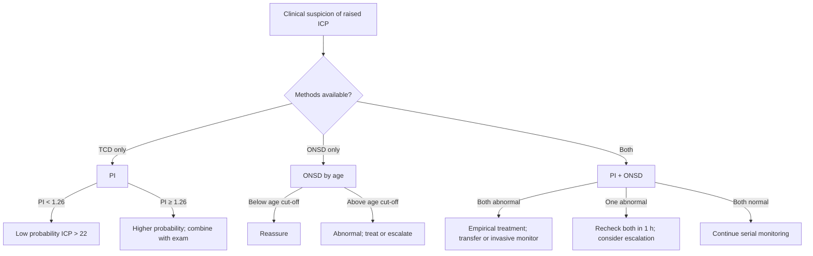

<Callout type="reference">
**Acronyms used on this page**

- **NI-ICP**: non-invasive intracranial pressure estimation
- **ICP**: intracranial pressure (gold standard: parenchymal probe or EVD)
- **TCD / TCCD**: transcranial Doppler / transcranial color-coded duplex
- **PI**: pulsatility index = (PSV − EDV) / MFV
- **ONSD**: optic nerve sheath diameter (mm, measured 3 mm posterior to globe)
- **B4C**: Brain4Care non-invasive ICP waveform analyser (extensometer)
- **TMD**: tympanic membrane displacement
- **OPA**: optical pneumatic applanation
- **2D-TCD**: two-depth transcranial Doppler (Vittamed)
- **ABA**: arterial blood pressure analysis (waveform-derived ICP estimator)
- **TBI / SAH / HIE**: traumatic / subarachnoid / hypoxic-ischaemic
- **NPV / PPV**: negative / positive predictive value
- **MMM / MNM**: multimodal monitoring / multimodal neuromonitoring
</Callout>

<TldrCard>
**The 60-second version.** No non-invasive method replaces an invasive ICP monitor for *measurement*. Several methods, however, are good enough to *triage*: they tell you whether ICP is likely high enough to justify placing a monitor, transferring the patient to a neurosurgical centre, or escalating empiric treatment. The two most-used at the bedside are **TCD PI** (Bellner regression, NPV ~0.95 for ICP < 22 mmHg when PI < 1.26) and **ONSD ultrasound** (cut-off varies by age: ~4.0 mm under 1 y, ~4.5 mm 1 to 15 y, ~5.0 to 5.7 mm adult). Newer devices (Brain4Care extensometer, two-depth TCD, optical applanation) add waveform-shape analysis and are gaining a research-to-clinic foothold. **Always combine at least two methods** and pair with clinical exam; never rely on any single NI-ICP estimator for go / no-go decisions in established raised ICP.
</TldrCard>

## 1. Bedside vignettes: why this matters in the PICU

### Vignette A. The 10-year-old in a peripheral ED

A 10-year-old presents to a rural ED 90 minutes from the nearest pediatric neurosurgical centre after a bicycle helmet-strike. GCS 11, headache, vomiting, photophobia. The CT shows a small extradural with effacement of the basal cisterns. There is no neurosurgeon, no invasive monitor, and a 90-minute transfer ahead. You scan the left MCA with a 2 MHz probe: PSV 95, EDV 18, **PI 1.7**. ONSD on the right is 6.2 mm, on the left 6.0 mm. The Bellner regression (ICP ≈ 10.93 × PI − 1.28) returns ICP ≈ 17 mmHg, but the ONSD is significantly above the pediatric cut-off. **You treat empirically** with 3% saline 3 mL/kg, head up 30°, and accelerate the transfer with a paramedic crew briefed on the working diagnosis. <Cite id="bellner2004" /> <Cite id="padayachy2016_pediatric_onsd" />

### Vignette B. The 2-month-old with bulging fontanelle on the post-natal ward

A 2-month-old infant is seen on the post-natal ward 6 weeks after discharge with vomiting, poor feeding, and a tense fontanelle. The closest centre with a pediatric neurosurgeon is 4 hours away. There is no CT in the unit. Through-fontanelle ultrasound shows ventriculomegaly. ONSD (still measurable through the open suture but better imaged from the transorbital window): 5.5 mm bilateral, well above the < 1 y cut-off. TCD through the fontanelle: PI 1.8 in the MCA. The combination triggers an immediate phone call to the pediatric neurosurgical service, transfer arranged with hypertonic saline ready, and the infant is in theatre 6 hours later for an EVD. <Cite id="padayachy2016_pediatric_onsd" /> <Cite id="cardim2016_nicp_review" />

### Vignette C. The adolescent with idiopathic intracranial hypertension and "normal" PI

A 16-year-old with new-onset chronic headaches, papilloedema on fundoscopy, and a normal CT presents for evaluation of IIH. ONSD is 6.3 mm bilaterally. TCD PI is 0.9 (normal). The team is briefly reassured by the PI but the optometry exam, the symptoms, and the ONSD are concordant for raised ICP. **PI in chronic, low-grade raised ICP is often normal** because the cerebrovascular bed has time to adapt; ONSD is the more sensitive index here. Lumbar puncture confirms opening pressure 32 cmH2O. <Cite id="robba2018_onsd_review" /> <Cite id="czosnyka2012ni" />

---

## 2. What NI-ICP is, and what it is not

Invasive ICP measurement (parenchymal Codman / Camino strain gauge probes, intraventricular EVD) is the standard against which all non-invasive methods are validated. The non-invasive methods are *estimators*: they use a proxy signal (Doppler velocity, optic sheath diameter, tympanic-membrane displacement, skull pulsation amplitude) and convert it via a regression or a waveform-shape algorithm to an estimated ICP.

**Three things follow.**

**Accuracy is method-, age-, and centre-dependent.** Most NI-ICP estimators have 95% confidence intervals of ±10 to 15 mmHg around the true ICP. They are sufficient to *exclude* severe intracranial hypertension with a high NPV (Rasulo's 2022 multicentre data: PI < 1.26 has NPV ~0.95 for ICP < 22 mmHg) but they are not sufficient to *measure* ICP in the way an invasive monitor does. They do not let you target a precise CPP. <Cite id="rasulo2022_arrest" /> <Cite id="cardim2016_nicp_review" />

**Trend over absolute.** A rising PI from 0.9 to 1.5 within a single child within an hour is a useful signal even when the absolute number is not diagnostic. An ONSD that has grown from 5.0 to 6.0 mm over 12 hours in the same child is more informative than the absolute value. Document with the same probe, same operator where possible.

**Multimodal beats single-modality.** TCD PI and ONSD together perform better than either alone: PI catches the acute haemodynamic signature of raised ICP; ONSD catches the structural (CSF-pressure) signature. Add fontanelle ultrasound in the infant. Add clinical exam always. <Cite id="robba2017nicp" /> <Cite id="robba2018_onsd_review" />

<Pearl>
**NI-ICP is triage, not measurement.** Use it to decide whether to place an invasive monitor, transfer to a neurosurgical centre, or initiate empirical treatment. Do not use it to titrate CPP target to within a few mmHg; that requires an invasive probe.
</Pearl>

<Pediatric>
**Pediatric NI-ICP is more useful than adult NI-ICP** because invasive monitoring decisions are higher-stakes (smaller skulls, longer transfers, anaesthetic risks). ONSD, fontanelle ultrasound, and TCD PI through the (still-thin) pediatric temporal bone are all easier in children. **Age-banded ONSD cut-offs are mandatory** (5.0 mm in an adult is normal; 5.0 mm in a 6-month-old is clearly abnormal).
</Pediatric>

---

## 3. The methods: anatomy and principle

<Figure
  src="/images/non-invasive-icp/methods-comparison.svg"
  alt="Side-by-side schematic of TCD-PI, ONSD, Brain4Care extensometer, and tympanic membrane displacement, with sensitivity and specificity callouts"
  caption="Four leading non-invasive ICP estimators. (a) TCD pulsatility index: 2 MHz pulsed-wave probe through the temporal window measures MFV in the basal cerebral arteries; the Bellner regression converts PI to estimated ICP. (b) ONSD: 7 to 12 MHz linear probe over a closed eyelid measures sheath diameter 3 mm posterior to the globe; rises with CSF pressure transmitted along the subarachnoid sheath around the optic nerve. (c) Brain4Care B4C: a strain-gauge extensometer over the parietal scalp records skull pulsation amplitude; the P1/P2 ratio of the recorded wave is the pressure-proxy. (d) Tympanic membrane displacement: a sealed ear-probe measures TM movement during the stapedial reflex; perilymph pressure changes with ICP via the cochlear aqueduct."
  attribution="MNM-Edu, original schematic. SVG placeholder."
  label="Fig. 1"
/>

### 3.1 TCD pulsatility index (PI)

PI = (PSV − EDV) / MFV. Rises when distal cerebrovascular resistance rises, including from raised ICP. The Bellner 2004 regression in 81 neurosurgical patients:

```math
\mathrm{ICP} \approx 10.93 \cdot \mathrm{PI} - 1.28
```

with 95% CI ±10 to 12 mmHg around the predicted value. <Cite id="bellner2004" /> <Cite id="bellner2004ebic" /> Subsequent reviews report a high NPV for excluding severe intracranial hypertension when PI < 1.26 (NPV ~0.95) but a poor PPV for diagnosing it (PPV ~0.50). <Cite id="rasulo2022_arrest" /> <Cite id="deriva2012_pi" />

Strengths: bedside, fast, available wherever there is a TCD probe. Limitations: PI rises with anything that increases distal resistance (hypocapnia, hyperoxia, hypothermia, low arterial compliance in neonates), not only ICP.

### 3.2 Optic nerve sheath diameter (ONSD)

The optic nerve is surrounded by a subarachnoid sheath continuous with the intracranial subarachnoid space. CSF pressure transmitted along this sheath distends it. **Measurement**: 7 to 12 MHz linear probe over a closed eyelid; identify the optic nerve as a hypoechoic stripe posterior to the globe; measure the sheath outer-to-outer diameter at exactly 3 mm posterior to the retinal surface. Both eyes; take the average of two readings per side. <Cite id="geeraerts2008" /> <Cite id="helmke1996" />

**Age-banded cut-offs**:

| Age | ONSD threshold (mm) | Source |
|---|---|---|
| < 1 year | ~4.0 | Padayachy 2016, Robba 2018 |
| 1 to 15 years | ~4.5 | Padayachy 2016 |
| Adult | ~5.0 to 5.7 (varies by ethnicity, sex) | Geeraerts 2008, Robba 2018 |

<Cite id="padayachy2012" /> <Cite id="padayachy2016_pediatric_onsd" /> <Cite id="robba2018_onsd_review" />

Strengths: bedside, repeatable, inexpensive, validated against invasive ICP with sensitivity ~85% and specificity ~75% at the appropriate age-banded threshold. Limitations: operator-dependent (intra-rater variability up to ±0.3 mm); ethnic and sex variation; not real-time (lag of minutes-to-hours behind acute ICP changes); falsely elevated in optic neuritis, Graves' orbitopathy, and post-orbital trauma.

### 3.3 Brain4Care extensometer

A scalp-applied strain gauge that measures skull pulsation amplitude with each cardiac cycle. The recorded waveform has the same P1-P2-P3 morphology as the invasive ICP waveform. **The ratio P2/P1 rises with falling intracranial compliance** (the same physiology that drives the invasive ICP-waveform abnormality). The device returns a non-invasive ICP waveform "shape" rather than an absolute number, and a derived P2/P1 ratio. Validation studies are ongoing. <Cite id="rasulo2024_b4c" /> <Cite id="brasil2022_waveform" />

Strengths: continuous, true waveform analysis, no skull penetration. Limitations: still emerging clinical evidence; sensitive to scalp contact and probe position; the absolute pressure derivation is less robust than the waveform shape.

### 3.4 Tympanic membrane displacement (TMD)

The perilymph in the cochlea is continuous with the CSF via the cochlear aqueduct, so perilymph pressure tracks ICP. The stapedial reflex causes a small TM displacement whose amplitude varies with perilymph pressure. **Method**: sealed ear-probe, acoustic stimulus elicits stapedial reflex, the device measures TM displacement to ~0.1 nm resolution. Promising in posture-change ICP changes; less established for absolute ICP. <Cite id="cardim2016_nicp_review" /> Strengths: continuous, painless. Limitations: requires intact TM and middle ear; cochlear aqueduct closure with age (~50% of adults have closed aqueducts) limits applicability.

### 3.5 Two-depth TCD (Vittamed)

A specialised TCD that measures simultaneously at two depths (intracranial and extracranial portions of the ophthalmic artery), inferring the pressure gradient across the orbit and hence ICP. Requires a calibrated external pressure cuff over the orbit. <Cite id="schmidt1997nicp" /> <Cite id="cardim2016_nicp_review" /> Strengths: directly calibrated, less regression-dependent than PI. Limitations: device cost, operator training, limited availability.

### 3.6 MRI / CT-based volumetric estimators

Quantitative CSF flow MRI (phase-contrast at the aqueduct), ventricular volume change with posture (MRI), CT-based volumetric techniques. Research tools mostly; not bedside.

### 3.7 Other methods

- **Otoacoustic emissions (OAEs)** for ICP-related cochlear pressure changes (research).
- **Pupillometry** indirectly: a falling NPi is consistent with raised ICP but is not a measurement.
- **Fundoscopy / papilloedema**: late, chronic sign of raised ICP; useful for the IIH and chronic-ICP context but not acute.

---

## 4. The signal: what to record at the bedside

| Method | What you record | Frequency |
|---|---|---|
| TCD PI | PSV, EDV, MFV, PI; both sides; vessel (typically MCA) | Q1 to Q4 hour in acute brain injury |
| ONSD | Diameter (mm) at 3 mm posterior to globe; both eyes; average of 2 readings per side | Q4 to Q6 hour; or single-shot for triage |
| B4C | Continuous waveform; P2/P1 ratio; flag direction of change | Continuous when available |
| TMD | Single-point amplitude; trend if continuous probe in place | Variable |
| 2D-TCD | Calibrated ICP estimate; needs trained operator | Single-shot per session |

Document the operator (intra-rater consistency matters), the probe (for repeat ONSD), and the patient state (head position, sedation, PaCO2).

---

## 5. What is normal? Age-banded reference values

| Age | TCD PI (typical) | ONSD (typical, mm) | Note |
|---|---|---|---|
| Term newborn | 0.7 to 1.0 (anterior fontanelle window) | 3.5 to 4.0 | Wide normal range; fontanelle US adds context |
| 1 to 12 months | 0.8 to 1.1 | 3.8 to 4.2 | Use age-banded cut-off |
| 1 to 5 years | 0.7 to 1.0 | 4.0 to 4.5 | Use ONSD &gt; 4.5 as concerning |
| 6 to 12 years | 0.7 to 1.0 | 4.2 to 4.7 | Trend within child |
| 13 to 18 years | 0.7 to 1.1 | 4.5 to 5.0 | Adult-like by mid-teens |
| Adult | 0.7 to 1.1 | 5.0 to 5.7 | Varies by sex / ethnicity |

<Cite id="bellner2004" /> <Cite id="padayachy2016_pediatric_onsd" /> <Cite id="robba2018_onsd_review" /> <Cite id="geeraerts2008" />.

<Pediatric>
**ONSD reads normal much earlier in childhood** because the sheath has not yet reached adult diameter. **A child's ONSD of 5.5 mm is unequivocally raised**, where the same value in an adult is borderline. Always reach for the age-band table before interpreting a single number.
</Pediatric>

---

## 6. What is abnormal? Pattern library and method comparison

<Figure
  caption="Side-by-side comparison of NI-ICP method profiles. (a) TCD spectral envelope: low PI (~0.8) with intact diastolic flow vs high PI (~1.7) with reduced EDV (raised ICP pattern). (b) ONSD ultrasound: 4.0 mm normal sheath vs 6.5 mm distended sheath. (c) Brain4Care: P1 &gt; P2 (compliant) vs P2 &gt; P1 (low compliance). (d) Composite triage table: in a 10-year-old, PI 1.7 + ONSD 6.5 mm + B4C P2/P1 1.5 strongly suggests raised ICP and triggers invasive monitor placement or hyperosmolar therapy with imaging."
  attribution="MNM-Edu, original schematic. SVG placeholder."
  label="Fig. 2"
>
  <WidgetEmbed name="NonInvasiveICPDemo" />
</Figure>

| Method | "Normal" reading | "Worrying" reading | "Strongly abnormal" reading |
|---|---|---|---|
| TCD PI | &lt; 1.0 | 1.0 to 1.4 | &gt; 1.4 with low EDV |
| ONSD (1 to 15 y) | ≤ 4.5 mm | 4.5 to 5.0 mm | &gt; 5.0 mm |
| ONSD (&lt; 1 y) | ≤ 4.0 mm | 4.0 to 4.5 mm | &gt; 4.5 mm |
| B4C P2/P1 | &lt; 1.0 | 1.0 to 1.2 | &gt; 1.2 |
| Composite (any two abnormal) | n/a | Treat empirically, consider escalation | Treat and escalate now |

### Decision tree: "should I act?"



<Pearl>
**Two abnormal estimators trump one** for triage. PI > 1.4 with ONSD above the age-banded cut-off is high-confidence raised ICP and should drive empirical osmotherapy, head-of-bed positioning, and either invasive monitor placement or transfer to a centre that can place one.
</Pearl>

---

## 7. Try it: interactive widgets

<WidgetEmbed name="NonInvasiveICPDemo" />

<WidgetEmbed name="ONSDDemo" />

---

## 8. Management decisions driven by NI-ICP

NI-ICP does not titrate CPP. It triggers *escalation decisions*: empirical treatment, invasive monitor placement, neurosurgical transfer.

### 8.1 The triage ladder

1. **Both estimators normal + reassuring exam**: continue observation, repeat at planned interval.
2. **One estimator abnormal**: empirical head-of-bed, normocapnia, normothermia; recheck both in 1 h.
3. **Both estimators abnormal OR rapid trend change**: empirical hypertonic saline or mannitol; arrange CT or repeat imaging; consider invasive monitor placement; involve neurosurgery.
4. **Both estimators strongly abnormal + clinical deterioration**: full empirical treatment (osmotherapy, head up, sedation, normocapnia); transfer for invasive monitoring and definitive care.

### 8.2 Empirical osmotherapy thresholds

A child with PI > 1.4, ONSD above the age cut-off, and a GCS that has fallen by 2 points warrants empirical hypertonic saline 3% at 3 mL/kg over 15 minutes. The pediatric BTF guidance accepts empirical osmotherapy when invasive monitoring is delayed and clinical signs concur. <Cite id="kochanek2019_pbtf4" />

### 8.3 Transfer decisions

In a peripheral ED, a child with concordant NI-ICP abnormalities and concerning imaging is a high-priority transfer to a neurosurgical centre. The NI-ICP estimators help in the transfer briefing: "PI 1.7 bilateral, ONSD 6.5 mm bilateral, treated with 3% saline; ICP probably 25 to 35 in our estimation; ETA your unit 60 minutes."

### 8.4 Centre comparison

In centres without invasive monitoring capability, NI-ICP estimators (especially the TCD-ONSD pairing) are the de facto monitoring standard. The pediatric MMM consensus places them as a tier-2 modality in resource-stratified settings. <Cite id="figaji2025_mmm_pediatric_consensus" /> <Cite id="helbok2024_pediatric_mmm" />

<Callout type="caveat">
**Teaching, not protocol.** Every NI-ICP threshold on this page (PI 1.4, ONSD age-banded values, P2/P1 1.2) is a teaching heuristic. Local validation, age-banded normative data, and clinical correlation always supersede a single number from a non-invasive estimator. Pair with clinical exam and senior neurosurgical input for management decisions.
</Callout>

<AlgorithmDisclaimer />

---

## 9. Clinical contexts: NI-ICP across acute brain injuries

### 9.1 Severe TBI in resource-limited or pre-transfer settings

The most common use case. Pre-hospital and emergency-department NI-ICP (TCD PI + ONSD) identifies children whose intracranial pressure is likely elevated enough to merit empirical treatment and rapid neurosurgical referral. Tazarourte's 2011 cohort and Bouzat's 2014 study showed pre-hospital TCD PI predicts in-hospital ICU outcome. <Cite id="tazarourte2011_tcd" /> <Cite id="bouzat2014_tcd" /> <Cite id="rasulo2022_arrest" />

### 9.2 Aneurysmal SAH

Post-SAH hydrocephalus and vasospasm both raise ICP. NI-ICP estimators can monitor between formal CT scans, especially in children where serial CT carries cumulative radiation risk. PI rises with vasospasm independently of ICP, complicating interpretation; ONSD is the cleaner ICP signal in this context. <Cite id="hoh2023sah_aha" /> <Cite id="rass2021dci_review" />

### 9.3 Pediatric AIS with malignant oedema

A child with a large MCA infarct can develop malignant oedema 2 to 5 days post-stroke. NI-ICP estimators triage the decision for decompressive hemicraniectomy: rising PI, expanding ONSD, and exam deterioration together justify operative intervention even without a pre-existing ICP probe. <Cite id="ferriero2019aha_pedstroke" />

### 9.4 HIE and post-cardiac arrest

Diffuse cerebral oedema in severe HIE raises ICP, sometimes profoundly. NI-ICP estimators inform decisions about head positioning, mild hyperventilation as a temporising measure, and consideration of EVD placement in selected cases. ONSD is easier than TCD in the chubby neonatal scalp; fontanelle ultrasound adds a third dimension in infants. <Cite id="topjian2021aha_pediatric" /> <Cite id="naim2023_brain_injury_pccm" />

### 9.5 Pediatric ECMO

Daily ONSD on VA-ECMO is part of some units' neurological surveillance bundles. A rising ONSD over 24 hours in a comatose ECMO patient triggers head CT or fontanelle ultrasound (in infants). The non-pulsatile circulation of full-flow ECMO makes TCD PI less useful (PI falls toward zero when pulsatility is lost). <Cite id="lorusso2017_elso_neuro" /> <Cite id="cho2024_ecmo_outcomes" />

### 9.6 Meningitis and encephalitis

A child with bacterial meningitis and a tense fontanelle (infant) or evolving GCS depression (older child) warrants ONSD and TCD as part of the empirical raised-ICP workup. Cerebral oedema in fulminant meningitis can necessitate EVD placement; the NI-ICP signals support the decision when imaging cannot be obtained quickly. <Cite id="tunkel2017idsa_encephalitis" /> <Cite id="vandebeek2016eu_meningitis" />

### 9.7 Brain-death determination

NI-ICP estimators are not part of formal brain-death protocols. TCD waveform analysis (oscillating / pendular / systolic-spike-only patterns) is a recognised ancillary test in some jurisdictions. ONSD is not used for brain death. <Cite id="nakagawa2011peds_bd" /> <Cite id="rasulo2008" />

### 9.8 DKA cerebral oedema

In a child being rehydrated for DKA, ONSD measurements during the high-risk window (hours 4 to 24 of treatment) can detect early oedema. Rising ONSD beyond the age cut-off in a symptomatic child warrants immediate osmotherapy. PI is less reliable here because hyperglycaemia and rehydration alter cerebral haemodynamics. <Cite id="kuppermann2018_pecarn_dka" /> <Cite id="glaser2024_dka_review" />

### 9.9 Idiopathic intracranial hypertension (IIH)

ONSD is the NI-ICP of choice in chronic IIH because TCD PI is often normal (cerebrovascular adaptation). Serial ONSD complements fundoscopy and LP opening pressure in the long-term monitoring of IIH treatment response. <Cite id="cardim2016_nicp_review" /> <Cite id="robba2018_onsd_review" />

---

## 10. Multimodal integration: NI-ICP in the MMM/MNM stack

| Pair with… | What you gain | Worked scenario |
|---|---|---|
| **Clinical exam** | Concordant exam + NI-ICP findings raise confidence | TBI: falling GCS + rising PI + expanding ONSD = triage now |
| **Pupillometry (NPi)** | NPi catches CN III early; PI catches ICP early | TBI: NPi falling on one side + PI rising bilaterally |
| **CT / MRI imaging** | NI-ICP triggers imaging; imaging refines | Rising PI in DKA → CT confirms oedema |
| **Invasive ICP (when subsequently placed)** | Calibrate NI-ICP estimators to truth | Centre validation study |
| **TCD beyond PI** | Lindegaard, Mx, full TCD context | TBI with rising PI + Mx +0.5 = ICP up and autoregulation broken |
| **Fontanelle ultrasound (infants)** | Direct view of ventricles and oedema | Bulging fontanelle + ONSD 5.5 + ventriculomegaly = EVD |
| **NIRS** | Microvascular oxygenation context | Sepsis with rising PI but stable rSO2 = haemodynamic, not perfusion failure |

<Cite id="figaji2025_mmm_pediatric_consensus" /> <Cite id="helbok2024_pediatric_mmm" /> <Cite id="tasker2023mnm" />

---

<DeepDive>

## 11. Setup and technique

### 11.1 TCD PI measurement

1. **Probe**: 2 MHz pulsed-wave (blind TCD) or 2 to 4 MHz TCCD with B-mode.
2. **Position**: temporal window, depth 30 to 50 mm depending on age, MCA M1 segment.
3. **Optimise**: angle < 30°, loud crisp spectral envelope, gain set so the envelope is bright without saturation.
4. **Sample**: average PSV, EDV, MFV over ≥ 5 cardiac cycles per side.
5. **Compute**: PI = (PSV − EDV) / MFV.
6. **Apply Bellner regression**: ICP ≈ 10.93 × PI − 1.28 (95% CI ±10 to 12 mmHg).
7. **Document trend**: serial measurements every 1 to 4 hours.

### 11.2 ONSD measurement

1. **Probe**: 7 to 12 MHz linear ultrasound probe (the same probe used for vascular access).
2. **Position**: patient supine, gentle eye-closure, generous gel cushion to minimise globe pressure.
3. **Image**: hypoechoic optic nerve in long axis behind the globe.
4. **Measure**: outer-sheath to outer-sheath diameter exactly 3 mm posterior to the retinal surface.
5. **Average**: two measurements per side, average across sides if symmetric, or report each side.
6. **Apply age-banded cut-off**: < 1 y ~4.0 mm; 1 to 15 y ~4.5 mm; adult ~5.0 to 5.7 mm.
7. **Be gentle**: do not press on the globe; pseudo-elevation from probe pressure is a real artefact.

### 11.3 B4C setup

1. **Skin preparation**: clean a small area of parietal scalp; the device contacts the skull directly.
2. **Device placement**: secure with the manufacturer's headband; check signal quality on the device screen.
3. **Calibrate**: per device protocol (may include zero reference to baseline period).
4. **Record**: continuous waveform; the device reports P1, P2, P3 amplitudes and the P2/P1 ratio.
5. **Trend**: monitor P2/P1 trajectory over hours; rising P2/P1 ratio = falling compliance, even when absolute pressure is unclear.

### 11.4 TMD setup

1. **Insert sealed ear-probe** in the external auditory canal, ensure tight seal.
2. **Acoustic stimulus** triggers stapedial reflex.
3. **Measure** TM displacement amplitude.
4. **Interpret per device protocol** (research / specialty centres mainly).

### 11.5 Two-depth TCD (Vittamed)

1. **Position the device** at the orbital window with the calibrated external pressure cuff.
2. **Inflate cuff** in steps; the device measures velocity in the intracranial and extracranial ophthalmic artery segments simultaneously.
3. **The cuff pressure at which the two velocity envelopes match** is the ICP estimate (the "pressure balance point").
4. **Report** with confidence interval; requires trained operator.

### 11.6 Quality control

- Operator training is the single biggest determinant of NI-ICP accuracy. Maintain a small group of trained operators per unit.
- Local validation against any invasive ICP placements in your centre over time refines local cut-offs.
- Inter-observer agreement studies are part of any NI-ICP programme; intra-class correlation > 0.8 is the goal.

</DeepDive>

---

## 12. Pitfalls

- **PI is not ICP.** PI rises with hypocapnia, hyperoxia, hypothermia, vasoconstrictors, neonatal low arterial compliance, and many other things. Always interpret in context.
- **ONSD probe pressure artefact.** Pressing the probe on the globe transiently raises measured sheath diameter; use generous gel and minimal pressure.
- **ONSD inter-rater variability** up to ±0.3 mm; significant when the action threshold is 4.5 mm in a child.
- **B4C absolute pressure** is less reliable than the waveform shape; trend P2/P1, not the inferred mmHg.
- **TMD requires intact TM and patent cochlear aqueduct**; ~50% of adults have closed aqueducts.
- **Two-depth TCD requires expensive specialised equipment** and a trained operator.
- **Chronic raised ICP (IIH) has normal PI** because of vascular adaptation; ONSD is the better signal here.
- **VA-ECMO removes pulsatility**; PI falls toward zero regardless of ICP.
- **In an infant, the open fontanelle vents ICP partially**; ONSD remains useful but interpret with the fontanelle ultrasound context.
- **Single-estimator triage**: never make a treatment decision on one estimator alone; always combine.
- **Sedation effect on PI**: deep sedation lowers MFV (CMRO2 effect) but does not change PI much; light sedation can produce sympathetic surges that raise PI without raising ICP.

---

## 13. Combine with…

- [TCD](/modalities/tcd/): the parent modality for PI; same probe, same windows.
- [ONSD](/modalities/onsd/): the dedicated ONSD measurement page.
- [ICP](/modalities/icp/): the invasive gold standard against which NI-ICP is validated.
- [Pupillometry](/modalities/pupillometry/): early-warning brainstem index alongside PI / ONSD.
- [Fontanelle ultrasound](/modalities/fontanelle-us/): the infant adjunct.
- [Foundations: Monro-Kellie doctrine](/foundations/monro-kellie/): the physiology behind every NI-ICP signal.

---

<DeepDive>

## 14. Evidence summary

| Topic | Source | Grade |
|---|---|---|
| Bellner PI-ICP regression | <Cite id="bellner2004" /> <Cite id="bellner2004ebic" /> | C |
| Helmke ONSD original | <Cite id="helmke1996" /> | C |
| Geeraerts ONSD adult validation | <Cite id="geeraerts2008" /> | B |
| Pediatric ONSD cut-offs | <Cite id="padayachy2012" /> <Cite id="padayachy2016_pediatric_onsd" /> | B |
| ONSD systematic review | <Cite id="robba2018_onsd_review" /> | A |
| NI-ICP comprehensive review | <Cite id="cardim2016_nicp_review" /> | review |
| TCD waveform analysis (B4C) | <Cite id="brasil2022_waveform" /> <Cite id="cardim2023nicp" /> <Cite id="rasulo2024_b4c" /> | B/C |
| Rasulo 2022 PI NPV in TBI | <Cite id="rasulo2022_arrest" /> | B |
| Two-depth TCD ICP estimator | <Cite id="schmidt1997nicp" /> | C |
| PI is not ICP review | <Cite id="deriva2012_pi" /> | review |
| Multicentre NI-ICP validation | <Cite id="cardim2023nicp" /> | B |
| Pediatric MMM consensus | <Cite id="figaji2025_mmm_pediatric_consensus" /> <Cite id="helbok2024_pediatric_mmm" /> | expert |
| Pre-hospital TCD in TBI | <Cite id="tazarourte2011_tcd" /> <Cite id="bouzat2014_tcd" /> | B |
| Robba pediatric NI-ICP | <Cite id="robba2018peds" /> <Cite id="robba2017nicp" /> | C |
| Brain-death TCD | <Cite id="rasulo2008" /> | expert |

## 15. Recent literature (2022 to 2025)

- **Brasil 2022**: TCD waveform analysis for non-invasive ICP via Brain4Care-style extensometers; transition from research to bedside. <Cite id="brasil2022_waveform" />
- **Cardim 2023**: multicentre validation of non-invasive ICP estimators against parenchymal probes. <Cite id="cardim2023nicp" />
- **Rasulo 2022 / 2024**: Brain4Care multicentre cohort showing P2/P1 ratio correlates with invasive ICP in adult TBI; pediatric data emerging. <Cite id="rasulo2022_arrest" /> <Cite id="rasulo2024_b4c" />
- **Figaji 2025 pediatric MMM consensus**: positions NI-ICP estimators as tier-2 modalities in resource-stratified pediatric centres. <Cite id="figaji2025_mmm_pediatric_consensus" />
- **Robotic / continuous TCD platforms**: enable continuous PI monitoring without operator presence; relevant for trend-based NI-ICP triage.
- **ONSD pediatric updates**: post-2020 pediatric data continue to support the 4.5 mm threshold in 1 to 15 y children, with some centres advocating ethnicity-adjusted cut-offs.

</DeepDive>

---

## 16. Self-check

<Quiz
  questions={[
    {
      id: 'q1',
      prompt: 'A 4-year-old in a rural ED 90 min from the nearest pediatric neurosurgical centre, GCS 11, CT shows a small EDH with effacement of basal cisterns. TCD MCA: PI 1.6, EDV 12 cm/s. ONSD 6.0 mm bilaterally. Most appropriate management?',
      options: [
        { id: 'a', label: 'Reassurance: PI and ONSD are non-specific in children; observe' },
        { id: 'b', label: 'Empirical 3% saline 3 mL/kg, head up 30°, urgent transfer, communicate findings to receiving NSG' },
        { id: 'c', label: 'Wait for repeat CT in 2 h before any action' },
        { id: 'd', label: 'Hyperventilate to PaCO2 25 mmHg en route' },
      ],
      answer: 'b',
      explanation: 'In a 4-year-old the age-banded ONSD cut-off is ~4.5 mm; 6.0 mm bilateral is clearly abnormal. PI 1.6 with low EDV is also strongly suggestive of raised ICP. Concordant NI-ICP abnormalities in a clinically deteriorating child with imaging confirming a structural lesion justify empirical osmotherapy and rapid transfer; the receiving NSG will appreciate the structured NI-ICP information for triage. Hyperventilation to PaCO2 25 is harmful (vasoconstriction worsens ischaemia); brief, modest hyperventilation (PaCO2 30 to 35) is acceptable as a short-term temporising measure but never the primary intervention.',
    },
    {
      id: 'q2',
      prompt: 'A 16-year-old presents with chronic headache, papilloedema on fundoscopy, normal CT, normal MR venogram. TCD PI 0.9; ONSD 6.2 mm bilaterally. Best interpretation?',
      options: [
        { id: 'a', label: 'TCD PI is normal so ICP cannot be raised; reassure and discharge' },
        { id: 'b', label: 'ONSD is artefactually high; ignore' },
        { id: 'c', label: 'Concordant clinical + ONSD picture for chronic raised ICP / IIH; proceed to LP for opening pressure' },
        { id: 'd', label: 'Discordant findings preclude diagnosis; observe' },
      ],
      answer: 'c',
      explanation: 'Chronic raised ICP (IIH) often has normal PI because the cerebrovascular bed has adapted, while ONSD remains elevated because the structural CSF pressure has not changed. The clinical syndrome (chronic headache, papilloedema, normal parenchymal imaging) plus ONSD 6.2 mm in an adolescent is consistent with IIH. LP for opening pressure (often &gt; 25 cmH2O in IIH) is the diagnostic next step. Normal PI does not exclude chronic raised ICP; this is a major teaching point.',
    },
    {
      id: 'q3',
      prompt: 'A 7-year-old with severe TBI now on VA-ECMO for refractory shock. The ICP monitor is contraindicated by the systemic anticoagulation strategy. You attempt TCD: PSV 30, EDV 25, MFV 28, PI 0.18. The PI is "normal." Best interpretation?',
      options: [
        { id: 'a', label: 'ICP is definitely normal; PI 0.18 excludes raised pressure' },
        { id: 'b', label: 'PI is unusable on full-flow VA-ECMO (non-pulsatile circulation); use ONSD + clinical exam + imaging instead' },
        { id: 'c', label: 'The TCD probe is malfunctioning; recalibrate' },
        { id: 'd', label: 'The child has cerebral circulatory arrest; declare brain death' },
      ],
      answer: 'b',
      explanation: 'VA-ECMO at full flow removes pulsatility from the systemic circulation. With pulsatility lost, PSV and EDV converge, MFV approximates both, and PI falls to near zero regardless of actual ICP. PI is therefore not interpretable as an ICP surrogate on full-flow VA-ECMO. Alternative NI-ICP signals (ONSD, fontanelle US in infants, clinical exam, serial imaging) are the workaround. PI of 0.18 also does not mean cerebral circulatory arrest; the spectral envelope still shows forward flow with intact diastolic flow. As LV ejection recovers, PI returns toward normal; the recovery of pulsatility on TCD is itself a useful ECMO weaning signal.',
    },
  ]}
/>
