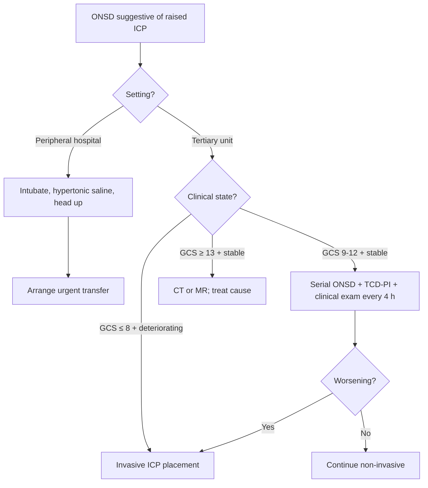

<Callout type="reference">
**Acronyms used on this page**

- **ONSD**: optic nerve sheath diameter (mm), measured 3 mm posterior to the globe
- **ICP**: intracranial pressure
- **CT / MR**: computed tomography / magnetic resonance
- **TCD**: transcranial Doppler
- **IIH**: idiopathic intracranial hypertension
- **DKA**: diabetic ketoacidosis
- **TBI**: traumatic brain injury · **SAH**: subarachnoid haemorrhage
- **CSF**: cerebrospinal fluid
- **MMM / MNM**: multimodal monitoring / multimodal neuromonitoring
- **nICP**: non-invasive intracranial pressure
</Callout>

<TldrCard>
**The 60-second version.** ONSD is the **transcutaneous ultrasound measurement of the optic nerve sheath**, taken 3 mm posterior to the globe on the optic-nerve axis. Because the sheath is contiguous with intracranial CSF, raised ICP distends the sheath within minutes. Three age-banded cutoffs dominate the literature: **< 1 year ~4.0 mm, 1–15 years ~4.5 mm, adult ~5.0–5.7 mm**. A single value above cutoff is **suggestive** of raised ICP; **bilateral measurement, repeatability, and trend** are the bedside skill. ONSD is the **triage tool of choice in resource-limited and pre-transfer settings**: a fast, repeatable, equipment-light scan that can change the decision to intubate, transfer, or place an invasive monitor. Pair with TCD-PI and clinical exam for a non-invasive nICP triple; pair with fontanelle ultrasound in infants. ONSD has known confounders (thickened chronic sheath, optic neuritis, papilloedema persisting after ICP normalises) and is **operator-dependent**, but in well-trained hands its negative predictive value for acutely raised ICP exceeds 90%.
</TldrCard>

## 1. Bedside vignettes: why this matters in the PICU

### Vignette A. Suspected raised ICP at a peripheral hospital

A 4-year-old falls from a tree at a peripheral hospital with no neurosurgical capability. GCS 7 on arrival, no obvious skull fracture, CT shows diffuse cerebral oedema with effacement of basal cisterns. Transfer is 2 hours by helicopter. The treating team has access to bedside ultrasound but no ICP monitor. They measure **ONSD bilaterally: right 6.2 mm, left 6.1 mm (well above the 4.5 mm cutoff for age 1–15)**. The combination of clinical picture, CT, and elevated ONSD prompts intubation, head elevation, hypertonic saline 3% bolus, and helicopter transfer. ICP measured invasively on arrival is 32 mmHg. **ONSD did not measure ICP, but it changed the decision to escalate before transfer.** <Cite id="padayachy2016_pediatric_onsd" /> <Cite id="padayachy2016" /> <Cite id="robba2018_onsd_review" /> <Cite id="cardim2016_nicp_review" />

### Vignette B. Bacterial meningitis, ONSD trend over 24 hours

A 7-year-old with pneumococcal meningitis day 1 presents with GCS 11, severe headache, photophobia. ONSD on admission 5.8 mm bilaterally. The team initiates antibiotics, supportive care, and selective ICP-monitoring decision: invasive placement deferred because GCS is improving with treatment. ONSD is repeated every 6 hours:

- **0 h**: 5.8 mm (raised).
- **6 h**: 5.6 mm.
- **12 h**: 5.4 mm.
- **24 h**: 5.1 mm.

The bedside team interprets the trend as **resolving cerebral oedema with antibiotic and supportive care**. GCS rises to 14 by 24 hours. No invasive monitor was placed. The ONSD trend gave the team **temporal data the static measurement could not**. <Cite id="vandebeek2016eu_meningitis" /> <Cite id="tunkel2017idsa_encephalitis" /> <Cite id="robba2018_onsd_review" />

### Vignette C. DKA cerebral oedema, ONSD rising 4 hours into rehydration

A 9-year-old new-onset DKA, pH 7.05, bicarbonate 6, glucose 35. Rehydration started per PECARN-style protocol. At 4 hours, the patient reports a new severe headache and is mildly less responsive. ONSD measured: **5.2 mm right, 5.0 mm left** (both above the 4.5 mm pediatric cutoff). The team treats empirically for evolving cerebral oedema with hypertonic saline 3% 5 mL/kg bolus, head elevation, and senior consult. CT is arranged. ONSD repeated at 30 minutes post-bolus is **4.8 mm bilaterally**. The patient stabilises; CT confirms mild diffuse oedema without herniation. **ONSD detected the change early, before pupillary signs, and the response to treatment was visible at the bedside in 30 minutes.** <Cite id="glaser2024_dka_review" /> <Cite id="kuppermann2018_pecarn_dka" /> <Cite id="glaser2001" /> <Cite id="muir2004" /> <Cite id="kuppermann2018" />

---

## 2. What ONSD is, and what it is not

ONSD is the **transcutaneous ultrasound measurement of the optic nerve sheath**, taken **3 mm posterior to the globe** along the optic nerve axis, in millimetres.

**Why this works.** The optic nerve is a CNS structure; its sheath is contiguous with the intracranial subarachnoid space and contains CSF. Raised ICP transmits through this CSF column and **distends the sheath within minutes**. The distension is most apparent in the retrobulbar segment, where the sheath is most compliant.

**Three things follow.**

**ONSD is a surrogate, not a measurement.** It does not give ICP in mmHg; it gives a **probability** of raised ICP. Various regression equations relate ONSD to ICP (e.g., Geeraerts 2007: ICP ≈ 7.0 × ONSD − 25), but bedside use is threshold-based, not equation-based.

**ONSD has lag and inertia.** A sheath that has been distended for days does not collapse immediately when ICP normalises; a sheath that has never been distended takes minutes to distend with new ICP rise. For **acute** ICP detection, ONSD has good sensitivity; for **chronic** raised ICP follow-up, ONSD lags ICP trends.

**ONSD is bilateral and repeatable.** A single measurement is suggestive; bilateral measurements + serial trend over hours is the bedside-useful pattern.

<Pearl>
**Use ONSD to change a decision, not to set a number.** "Should I intubate?", "Should I transfer?", "Should I place an invasive monitor?" are the right questions. "What is the ICP in mmHg?" is the wrong question for ONSD. <Cite id="cardim2016_nicp_review" /> <Cite id="robba2018_onsd_review" />
</Pearl>

<Pediatric>
**Pediatric ONSD cutoffs are lower.** The Padayachy 2016 pediatric cohort and Robba 2018 review establish age-banded cutoffs: **< 1 year ~4.0 mm, 1–15 years ~4.5 mm**. Open fontanelles in infants slightly reduce sensitivity for raised ICP (the fontanelle accommodates volume before ONSD distends), so pair ONSD with **fontanelle ultrasound** in this age group. <Cite id="padayachy2016_pediatric_onsd" /> <Cite id="padayachy2012" /> <Cite id="padayachy2016" /> <Cite id="robba2018peds" />
</Pediatric>

---

## 3. Technique

<Figure
  caption="Ocular ultrasound for ONSD measurement. A high-frequency linear probe (7.5–15 MHz) is placed over the closed eyelid with copious gel coupling to minimise pressure on the globe (mechanical index < 0.23 to protect the lens). The optic nerve appears as a hypoechoic structure posterior to the globe. ONSD is measured perpendicular to the optic nerve axis at exactly 3 mm posterior to the retina-globe junction. Bilateral measurement is standard; both eyes should be measured for symmetry. Axial and sagittal planes both used; vertical plane gives a different value (anatomy of the sheath is not isotropic)."
  attribution="MNM-Edu, original schematic adapted from Padayachy 2016."
  label="Fig. 1"
>
  <ONSDUltrasound />
</Figure>

### 3.1 Equipment

- **Linear high-frequency probe** (7.5–15 MHz). The standard small-parts/vascular probe.
- **Mechanical index < 0.23** to protect the lens; ocular preset on the ultrasound machine.
- **Coupling gel** in generous quantity to avoid pressure on the globe; sterile gel for closed-eye application.

### 3.2 Patient and probe positioning

- **Patient** supine, head neutral, closed eyelids.
- **Probe** placed gently over the closed eyelid; transverse (axial) plane standard; sagittal plane as confirmation.
- **No pressure** on the globe; use coupling gel to keep the probe slightly off the skin.

### 3.3 Measurement

- **Identify the globe**: anechoic vitreous; bright retina-choroid-sclera complex posterior.
- **Identify the optic nerve**: hypoechoic structure leaving the posterior globe.
- **Mark 3 mm posterior to the retina-globe junction** along the optic nerve axis.
- **Measure the sheath diameter perpendicular to the nerve axis** at this point.
- **Repeat in the contralateral eye**.
- **Repeat in the sagittal plane** if axial is ambiguous; values should agree within ~0.2 mm.

### 3.4 Repeatability

ONSD has inter-rater variability of ~0.3 mm in trained hands; intra-rater repeatability is better (~0.15 mm). Round measurements to the nearest 0.1 mm; **trends of ≥ 0.3 mm are clinically significant**, single measurements within 0.3 mm of cutoff are equivocal.

---

## 4. Age-banded cutoffs

<Figure
  src="/images/onsd/onsd-by-age.svg"
  alt="ONSD age-banded reference plot: cutoff 4.0 mm under 1 year, 4.5 mm 1-15 years, 5.0-5.7 mm adult"
  caption="ONSD age-banded reference values. Below age 1 year, the sheath cutoff for suggesting raised ICP is approximately 4.0 mm. From 1 to 15 years, the cutoff rises to 4.5 mm. Adult cutoff is 5.0–5.7 mm depending on the cohort. Open fontanelles in infants slightly reduce sensitivity. The values shown are operational cutoffs at which ONSD is suggestive of raised ICP; not biological norms. Pair with the clinical picture and other non-invasive modalities."
  attribution="MNM-Edu, drawn from Padayachy 2016 and Robba 2018 reference data. SVG placeholder."
  label="Fig. 2"
/>

| Age | ONSD cutoff (mm) | Comments |
|---|---|---|
| Term newborn (< 1 mo) | 4.0 | Open fontanelle reduces sensitivity; pair with fontanelle US |
| Infant 1–11 mo | 4.0 | Same; fontanelle US is highest-yield |
| Toddler 1–3 y | 4.5 | Fontanelle closing or closed |
| Child 4–15 y | 4.5 | Standard pediatric cutoff |
| Adolescent 16–18 y | 5.0 | Approaching adult |
| Adult reference | 5.0–5.7 | Cohort-dependent; most cited cutoff 5.7 mm (Geeraerts 2008) |

Sources: <Cite id="padayachy2016_pediatric_onsd" /> <Cite id="padayachy2012" /> <Cite id="padayachy2016" /> <Cite id="robba2018_onsd_review" /> <Cite id="robba2018peds" /> <Cite id="geeraerts2008" /> <Cite id="helmke1996" />.

---

## 5. Pattern library: normal, acute raised, chronic raised

<Figure
  src="/images/onsd/niicp-stack.svg"
  alt="Three ONSD ultrasound panels side by side: normal, acute raised, chronic raised with thickened sheath"
  caption="Three canonical ONSD patterns. (a) Normal: optic nerve sheath ~4.0 mm at the 3 mm marker, smooth tapering, symmetric bilaterally. (b) Acute raised: sheath distended to 6.0 mm with prominent retrobulbar component, often paired with papilloedema visible on fundoscopy. (c) Chronic raised: sheath ~5.5 mm but with thickened wall echoes (chronic distension produces fibrosis); harder to interpret because the sheath does not collapse immediately when ICP normalises. Always correlate with clinical exam and trend over time."
  attribution="MNM-Edu, original schematic adapted from Robba 2018. SVG placeholder."
  label="Fig. 3"
/>

| Pattern | Bedside meaning | What to do |
|---|---|---|
| Normal (< cutoff) bilateral | Acute raised ICP unlikely | Use as part of nICP triage; pair with TCD, clinical exam |
| Raised bilateral | Acute raised ICP suggested | Triage tree (imaging, intubation, monitor placement) |
| Raised unilateral | Local pathology (orbital, optic nerve sheath tumour); or asymmetric ICP | Investigate; correlate with imaging |
| Borderline (within 0.3 mm of cutoff) | Equivocal | Repeat in 30–60 min; trend matters |
| Thickened sheath, raised | Chronic raised ICP (IIH; tumour) | Less acute; outpatient or sub-acute workup |
| Normal but clinical signs of raised ICP | False negative possible (acute rapid rise before distension; congenital sheath narrow) | Trust the clinical picture; do not over-rely on a normal ONSD |
| Asymmetric > 0.5 mm | Unilateral lesion; verify probe placement | CT/MR if clinically warranted |

---

## 6. Try it: interactive widgets

<WidgetEmbed name="ONSDDemo" />

<WidgetEmbed name="NonInvasiveICPDemo" />

---

## 7. The ONSD-driven clinical decision triage

ONSD informs four bedside decisions. Each has a different threshold for action:

### 7.1 Intubate?

- ONSD raised + GCS ≤ 8 = strong support for intubation.
- ONSD raised + GCS 9–12 with clinical concern = case-by-case; pair with TCD-PI and trend.
- ONSD normal + GCS ≤ 8 = intubate for airway protection regardless; ONSD informs subsequent escalation.

### 7.2 CT scan?

- ONSD raised + new neurology = expedite CT (or MR for stroke or posterior fossa concern).
- ONSD raised + trauma + GCS deterioration = CT regardless.
- ONSD borderline + stable = clinical judgement.

### 7.3 Transfer?

- ONSD raised + no neurosurgical capability on-site = escalate transfer (intubate before transfer; pre-treat with hypertonic saline / mannitol if available).
- ONSD normal + clinical concern = transfer based on clinical picture; ONSD has informed but not blocked the decision.

### 7.4 Invasive ICP monitor?

- ONSD raised + clinical picture supporting raised ICP + need for ongoing precise titration = invasive placement.
- ONSD raised + improving clinically = monitor non-invasively (serial ONSD + TCD-PI + clinical exam).
- ONSD normal + stable = no invasive monitor needed acutely.

<Callout type="caveat">
**Decision support, not a clinical protocol.** Every threshold and decision above is age-, centre-, and patient-dependent. Defer to your unit's protocols and senior clinical team.
</Callout>

<AlgorithmDisclaimer />

---

## 8. Clinical contexts: ONSD across acute brain injuries

### 8.1 Suspected raised ICP without invasive monitor

The canonical indication. Use cases: post-trauma at peripheral hospital, post-trauma awaiting theatre, post-trauma where coagulopathy contraindicates invasive placement. Negative predictive value > 90% in trained hands. <Cite id="padayachy2016_pediatric_onsd" /> <Cite id="robba2018_onsd_review" /> <Cite id="cardim2016_nicp_review" />

### 8.2 Bacterial meningitis with raised ICP

ONSD trend over 24 hours guides escalation in pediatric bacterial meningitis. Rising or persistently high ONSD prompts CT, hyperosmolar therapy, or EVD placement. The European meningitis guidelines and IDSA encephalitis guidelines acknowledge ONSD as a useful adjunct. <Cite id="vandebeek2016eu_meningitis" /> <Cite id="tunkel2017idsa_encephalitis" /> <Cite id="tunkel2004_idsa_meningitis" />

### 8.3 DKA cerebral oedema

Pediatric DKA cerebral oedema classically presents 4–12 hours into rehydration. ONSD can detect early sheath distension before pupillary or motor signs appear. Response to hypertonic saline can be observed at the bedside within 30 minutes. <Cite id="kuppermann2018_pecarn_dka" /> <Cite id="glaser2024_dka_review" /> <Cite id="glaser2001" /> <Cite id="muir2004" />

### 8.4 Post-traumatic in low-resource settings

Where CT and invasive ICP are unavailable or delayed, ONSD provides immediate bedside data. Multiple resource-limited cohort studies (Padayachy 2012, 2016) established the pediatric thresholds in exactly these settings. <Cite id="padayachy2012" /> <Cite id="padayachy2016_pediatric_onsd" />

### 8.5 Hydrocephalus and shunt failure

ONSD raised in a child with a shunt is a useful **adjunct** to clinical assessment of shunt failure. A normal ONSD does not exclude shunt failure (slit ventricles can produce raised ICP without sheath distension); a raised ONSD adds support for shunt revision. <Cite id="padayachy2016_pediatric_onsd" /> <Cite id="robba2018_onsd_review" />

### 8.6 Idiopathic intracranial hypertension (IIH)

In older children and adolescents with IIH, ONSD is raised but the sheath often shows chronic thickening. Follow-up over weeks to months shows partial reversibility with treatment (acetazolamide, weight loss, lumboperitoneal shunt). <Cite id="robba2018_onsd_review" />

### 8.7 SAH

Less established. The principle (sheath distension reflects raised ICP from hydrocephalus or oedema in SAH) is sound. Most SAH ICP monitoring is via EVD, making ONSD a redundant tier. Useful in pre-procedural assessment. <Cite id="hoh2023sah_aha" /> <EvidenceLevel grade="sparse" />

### 8.8 Stroke (malignant MCA, post-thrombectomy)

ONSD can detect evolving oedema in malignant MCA syndrome before clinical herniation. Adjunct to clinical and imaging surveillance. <Cite id="ferriero2019aha_pedstroke" /> <Cite id="sun2020_pediatric_thrombectomy" /> <EvidenceLevel grade="sparse" />

---

## 9. Multimodal integration: ONSD in the non-invasive ICP stack

| Pair with… | What you gain | Worked scenario |
|---|---|---|
| **TCD-PI** | Two non-invasive surrogates; concordance increases confidence | [TCD page](/modalities/tcd/), [Non-invasive ICP page](/modalities/non-invasive-icp/) |
| **Fontanelle ultrasound** | Best pair in infants with open fontanelles | [Fontanelle US page](/modalities/fontanelle-us/) |
| **NIRS** | rSO2 falls when CPP drops from raised ICP | [NIRS page](/modalities/nirs/) |
| **Pupillometry / NPi** | Brainstem function alongside sheath distension | [Pupillometry page](/modalities/pupillometry/) |
| **Clinical exam (GCS)** | Always; ONSD without clinical context can mislead | Always |
| **Non-invasive ICP (B4C)** | Concordant non-invasive triple: ONSD + TCD-PI + B4C waveform | [Non-invasive ICP page](/modalities/non-invasive-icp/) |
| **CT / MR** | Imaging confirmation; ONSD is triage, imaging is diagnosis | When indicated |

The **non-invasive ICP triple** (ONSD + TCD-PI + clinical) is the practical bedside bundle when invasive monitoring is unavailable or contraindicated. Each modality is imperfect alone; concordance across the three substantially improves diagnostic confidence. <Cite id="cardim2016_nicp_review" /> <Cite id="robba2018_onsd_review" /> <Cite id="rasulo2022_arrest" /> <Cite id="brasil2022_waveform" />

---

<DeepDive>

## 10. Setup and technique: bench training

### 10.1 Probe choice

A high-frequency linear probe (7.5–15 MHz, vascular or small-parts setting) is standard. Curved probes have insufficient near-field resolution for the 3 mm posterior measurement.

### 10.2 Patient and probe positioning

- **Patient supine**, head neutral, eyes closed.
- **Generous coupling gel** to avoid pressure on the globe; sterile gel for protection of the eye.
- **Probe orientation**: transverse (axial) primary; sagittal as confirmation.
- **Probe angle**: perpendicular to the optic nerve axis; tilt slightly until the longest visible nerve length appears.

### 10.3 Measurement protocol

1. **Position the gain** so the vitreous is anechoic and the retinal complex is bright.
2. **Identify the retina-globe junction** at the posterior pole.
3. **Measure 3 mm posterior** along the optic nerve.
4. **Measure the sheath diameter perpendicular** to the nerve axis at this point.
5. **Record to 0.1 mm**.
6. **Repeat** in the contralateral eye.
7. **Repeat** in the sagittal plane if axial is ambiguous.
8. **Average** if multiple measurements per side; report the higher of the two sides if they differ by > 0.3 mm.

### 10.4 Training and competency

- Inter-rater agreement: ~0.3 mm with formal training; ~0.5 mm without.
- Repeatability bench: 10 supervised measurements typically required for competency.
- Validation against simultaneous invasive ICP (when available) is the gold-standard training metric.

### 10.5 Safety

- **Mechanical index < 0.23** to protect the lens (standard ocular preset).
- **No pressure on the globe**; coupling gel slack.
- **Avoid** in patients with suspected open globe injury or recent eye surgery.

</DeepDive>

---

## 11. Pitfalls and artefacts

- **Thickened chronic sheath**: chronic ICP elevation produces sheath fibrosis; the sheath does not collapse immediately when ICP normalises. ONSD lags in chronic states.
- **Optic neuritis**: inflammation thickens the sheath without raised ICP. False positive.
- **Papilloedema visible on fundoscopy**: confirms raised ICP and supports a raised ONSD; absence of papilloedema does not exclude raised ICP (papilloedema also lags).
- **Asymmetric ONSD with unilateral disease**: orbital tumour, optic nerve sheath meningioma, unilateral compartment syndrome. Investigate further.
- **Operator dependence**: inter-rater variability ~0.3 mm; trained operators only.
- **Open fontanelle in infants**: reduces sensitivity; pair with fontanelle US.
- **Eye movement artefact**: optic nerve appears off-axis when eye is rolled; have patient look straight ahead (or eyes closed, gaze straight).
- **Excessive probe pressure**: compresses the sheath; measure with light contact.
- **Different reference values across cohorts**: 4.5 mm in Padayachy pediatric cohort vs 5.0 mm in some adult cohorts; know the local standard.
- **Sheath asymmetry > 0.5 mm**: requires investigation; not always pathological but warrants attention.
- **Ultrasound machine settings**: ocular preset, mechanical index < 0.23, gain optimised for vitreous.

---

## 12. Combine with…

- [Non-invasive ICP](/modalities/non-invasive-icp/): the wider nICP family (B4C waveform, TCD-PI, ONSD together).
- [ICP](/modalities/icp/): for confirmatory invasive measurement.
- [TCD](/modalities/tcd/): for the PI non-invasive ICP comparator.
- [Fontanelle ultrasound](/modalities/fontanelle-us/): for the infant pair.
- [Pupillometry](/modalities/pupillometry/): for the brainstem function pair.
- [NIRS](/modalities/nirs/): for the rSO2 perfusion pair.

---

<DeepDive>

## 13. Evidence summary and recent literature

### 13.1 Evidence summary

| Topic | Source | Grade |
|---|---|---|
| Original ONSD ultrasound description (Helmke 1996) | <Cite id="helmke1996" /> | foundational |
| Geeraerts 2008 adult cohort cutoff | <Cite id="geeraerts2008" /> | B |
| Padayachy 2012 pediatric original | <Cite id="padayachy2012" /> | B |
| Padayachy 2016 pediatric cohort | <Cite id="padayachy2016_pediatric_onsd" /> <Cite id="padayachy2016" /> | B |
| Robba 2018 ONSD review | <Cite id="robba2018_onsd_review" /> <Cite id="robba2018" /> <Cite id="robba2018peds" /> | review |
| Cardim 2016 nICP review | <Cite id="cardim2016_nicp_review" /> | review |
| Robba 2017 nICP | <Cite id="robba2017" /> <Cite id="robba2017nicp" /> | review |
| Malayeri 2005 ONSD pediatric reference | <Cite id="malayeri2005" /> | C |
| Andrade 2021 ONSD review | <Cite id="andrade2021" /> | review |
| Cardim 2023 nICP multicentre | <Cite id="cardim2023nicp" /> | B |
| Rasulo 2024 B4C nICP | <Cite id="rasulo2024_b4c" /> | B |
| Brasil 2022 nICP waveform | <Cite id="brasil2022_waveform" /> | B |
| Rasulo 2022 multicentre nICP | <Cite id="rasulo2022_arrest" /> | B |
| Schmidt 1997 nICP foundational | <Cite id="schmidt1997nicp" /> | foundational |
| Czosnyka 2012 nICP review | <Cite id="czosnyka2012ni" /> | review |
| Lovett 2022 ONSD pediatric | <Cite id="lovett2022noninvasive" /> | review |
| Pediatric MNM consensus 2025 | <Cite id="figaji2025_mmm_pediatric_consensus" /> | expert |
| NCS MMM consensus | <Cite id="leroux2014_neurocrit_consensus" /> | expert |

### 13.2 Recent literature (2022–2025)

- **Robba 2018 ONSD systematic review** (cited heavily through 2025): the modern reference for thresholds and use cases; pediatric subsection establishes the 4.5 mm cutoff. <Cite id="robba2018_onsd_review" />
- **Cardim 2023 multicentre nICP**: cross-validation of ONSD with other non-invasive ICP estimators against invasive measurement. <Cite id="cardim2023nicp" />
- **Rasulo 2024 B4C nICP**: waveform-based non-invasive ICP estimator (Brain4Care) validated against invasive measurement; ONSD complementary. <Cite id="rasulo2024_b4c" />
- **Padayachy 2016 pediatric reference**: establishes age-banded cutoffs for pediatric ONSD; cited as gold-standard pediatric reference. <Cite id="padayachy2016_pediatric_onsd" />
- **Lovett 2022 pediatric ONSD review**: contemporary synthesis of pediatric ONSD use cases and limitations. <Cite id="lovett2022noninvasive" />
- **Figaji 2025 Pediatric MNM consensus**: endorses ONSD as tier-1 bedside non-invasive tool, especially in resource-stratified pediatric centres. <Cite id="figaji2025_mmm_pediatric_consensus" />

</DeepDive>

---

## 14. Self-check

<Quiz
  questions={[
    {
      id: 'q1',
      prompt: 'A 4-year-old falls from a tree at a peripheral hospital with no neurosurgical capability. GCS 7, CT shows diffuse cerebral oedema. Helicopter transfer is 2 hours away. Bedside ONSD measures 6.2 mm right, 6.1 mm left. Most appropriate immediate action?',
      options: [
        { id: 'a', label: 'Reassure team; ONSD is non-specific' },
        { id: 'b', label: 'Intubate, hypertonic saline 3% bolus, head elevation, arrange urgent transfer with treatment continued in transit' },
        { id: 'c', label: 'Wait for transfer team before any intervention' },
        { id: 'd', label: 'Place an invasive ICP monitor at the peripheral hospital' },
      ],
      answer: 'b',
      explanation: 'ONSD 6.2 mm in a 4-year-old (cutoff 4.5 mm) plus clinical picture (GCS 7, CT-confirmed oedema) strongly supports raised ICP. The peripheral-hospital priority is stabilisation before transfer: airway, head elevation, hyperosmolar therapy. ONSD changed the decision to escalate pre-transfer. Reassuring on a raised ONSD with corroborating clinical/imaging is dangerous. Placing invasive monitor at a non-neurosurgical hospital is not the standard approach.',
    },
    {
      id: 'q2',
      prompt: 'A 9-year-old new-onset DKA. At 4 hours into rehydration, new headache and mild altered consciousness. ONSD measures 5.2 mm right, 5.0 mm left. What is the next step?',
      options: [
        { id: 'a', label: 'Reassure; ONSD is within normal range' },
        { id: 'b', label: 'Hypertonic saline 3% 5 mL/kg bolus, head elevation, senior consult, arrange CT' },
        { id: 'c', label: 'Slow the rehydration rate without other intervention' },
        { id: 'd', label: 'Wait for pupillary changes before intervening' },
      ],
      answer: 'b',
      explanation: 'ONSD above the 4.5 mm pediatric cutoff in a child with DKA presenting 4 hours into rehydration with new neurology strongly suggests evolving cerebral oedema. Pediatric DKA-CE is a high-mortality complication that requires immediate hyperosmolar treatment, head elevation, and CT. Waiting for pupillary changes risks herniation. ONSD detected the change earlier than clinical signs would; that is the value of the bedside tool. Slowing rehydration alone is insufficient.',
    },
    {
      id: 'q3',
      prompt: 'A 7-year-old with bacterial meningitis day 1, GCS 11. ONSD on admission 5.8 mm bilaterally. Repeat ONSD at 6 h is 5.6 mm, at 12 h is 5.4 mm, at 24 h is 5.1 mm. GCS improves to 14. Best interpretation?',
      options: [
        { id: 'a', label: 'Persistent high ONSD; place invasive monitor regardless of clinical improvement' },
        { id: 'b', label: 'Resolving cerebral oedema with treatment; continue serial ONSD and clinical surveillance without invasive monitoring' },
        { id: 'c', label: 'ONSD trend is unreliable; ignore' },
        { id: 'd', label: 'Discharge from ICU' },
      ],
      answer: 'b',
      explanation: 'Falling ONSD trend (5.8 to 5.1 mm over 24 h) paired with improving GCS (11 to 14) is consistent with resolving cerebral oedema. The bedside team has data to defer invasive monitoring, which carries infection and bleed risk. Serial ONSD provides the temporal signal a single measurement cannot. The persistence above adult cutoff (5.0) but with falling trend and improving clinical state is a "trust the trend" scenario. Placing an invasive monitor when the patient is improving exposes them to procedural risk without clinical justification.',
    },
  ]}
/>
