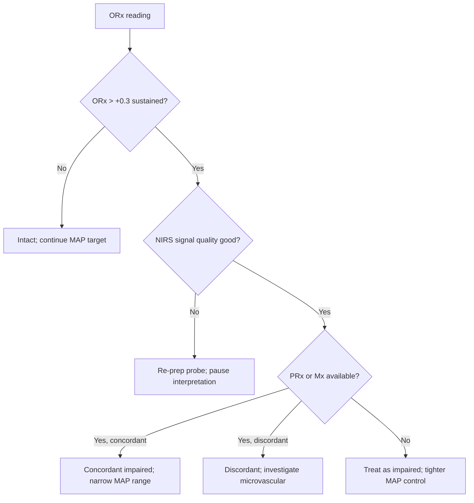

<Callout type="reference">
**Acronyms used on this page**

- **ORx**: oxygen reactivity index = Pearson correlation of NIRS rSO2 with MAP, over slow-wave frequencies
- **NIRS**: near-infrared spectroscopy
- **rSO2 / SctO2**: regional / cerebral tissue oxygen saturation (%)
- **THx**: tissue haemoglobin reactivity (alternative NIRS-based autoregulation index)
- **HVx**: haemoglobin volume index (variant)
- **PRx**: pressure reactivity index (invasive, ICP-based)
- **Mx**: mean-flow autoregulation index (TCD MFV-based)
- **MAP / CPP / ICP**: mean arterial / cerebral perfusion / intracranial pressure
- **SafeBoosC**: Safeguarding the Brains of our Smallest Children (NIRS-guided preterm trial)
- **PIVH / IVH**: peri-intraventricular / intraventricular haemorrhage
- **CHD**: congenital heart disease
- **HIE**: hypoxic-ischaemic encephalopathy
- **MNM / MMM**: multimodal neuromonitoring / multimodal monitoring
</Callout>

<TldrCard>
**The 60-second version.** ORx is the third leg of the autoregulation index triad (PRx, Mx, ORx). It uses **NIRS rSO2** (regional cerebral oxygen saturation) and **MAP** slow waves to compute a Pearson correlation over a 5 min rolling window. **ORx > +0.3 = impaired autoregulation**; ORx ≤ 0 = intact. ORx is the most accessible autoregulation index in pediatrics because NIRS pads are already widely used in neonatal ICUs, post-cardiac-surgery wards, and pediatric PICUs. Its biggest clinical foothold is **preterm SafeBoosC management** (preterm infants kept within an rSO2 target by FiO2 / haemodynamic interventions; the SafeBoosC-III trial in 2024 did not demonstrate mortality benefit but the framework is established). Limitations vs PRx and Mx: NIRS samples only frontal cortex, ~2 to 3 cm depth, includes extracranial contamination (skin, skull, scalp blood flow), and reflects mixed venous-arterial tissue compartment. <Cite id="brady2010orx" /> <Cite id="lee2009ndnirs" /> <Cite id="plomgaard2024_safeboosc3" />
</TldrCard>

## 1. Bedside vignettes: why this matters in the PICU

### Vignette A. The preterm infant on SafeBoosC-style monitoring

A 26-week preterm infant on day 2 of life has continuous bilateral NIRS pads on the frontal cortex (rSO2 target 55 to 85% per SafeBoosC protocol). MAP is 38 mmHg on a low-dose dopamine infusion for borderline hypotension. ORx (rolling 5 min) is +0.4, sustained over the last 6 hours; rSO2 is at the lower end of target (58%) and trending down. **Autoregulation is impaired and tissue oxygenation is borderline.** Action: per SafeBoosC framework, increase MAP target gently with volume or vasopressor titration; reassess ORx and rSO2 every 30 min; do not push too high (the upper bound matters in the preterm brain). <Cite id="hyttel2015safeboosc" /> <Cite id="plomgaard2024_safeboosc3" /> <Cite id="hansen2023safeboosciii" />

### Vignette B. Post-cardiac-surgery toddler with discordant ORx and clinical exam

An 18-month-old on day 1 after a complex Norwood stage 1 repair, sedated, ventilated. NIRS rSO2 reads 70% bilateral, MAP 55 mmHg, ORx = +0.5 sustained, but ICP is not monitored. The bedside platform plots ORx-vs-MAP across the last 4 hours: U-curve vertex at MAP 60 (MAPopt 60). Action: gentle MAP escalation (volume or noradrenaline) toward MAP 58 to 63; reassess ORx in 30 min. The ORx framework here lets the team derive an individualised MAP target without an invasive ICP monitor or sustained TCD. <Cite id="brady2010orx" /> <Cite id="naim2023_brain_injury_pccm" />

### Vignette C. The septic teenager with discordant ORx and PRx

A 15-year-old with septic shock, intubated and sedated, MAP 72 on noradrenaline. ICP monitor in place (placed earlier for confused septic encephalopathy and headache). PRx (bedside ICM+) reads −0.1 (intact); ORx reads +0.4 (impaired). The neuropals team discusses: PRx (macrovascular ICP-based) suggests intact autoregulation; ORx (tissue-level NIRS) suggests impaired microvascular function consistent with septic microvascular shunting. **The discordance is itself informative**: it argues for sepsis-specific management (source control, optimisation of oxygen delivery and utilisation) rather than aggressive MAP escalation. <Cite id="rivera-lara2017autoreg" /> <Cite id="brady2010orx" />

---

## 2. What ORx is, and what it is not

ORx is a **moving-window Pearson correlation** between the NIRS-derived regional cerebral oxygen saturation (rSO2, %) and the mean arterial pressure (MAP, mmHg). Computed over the slow-wave band (typically 0.003 to 0.05 Hz) using 10-second averages over a 5-minute rolling window, and updated every 1 minute.

**Three concepts to anchor.**

**ORx is a tissue-level autoregulation index.** Where PRx uses ICP (an integrated whole-brain pressure signal) and Mx uses TCD MFV (a large-vessel velocity signal), ORx uses rSO2 (a tissue-compartment oxygen signal). The three indices share a common physiology (slow-wave correlation captures autoregulatory coupling) but they probe different compartments. <Cite id="brady2010orx" /> <Cite id="lee2009ndnirs" />

**ORx is the easiest autoregulation index in pediatrics.** NIRS pads are non-invasive, cheap, and widely available in NICU and pediatric ICU. No bolt, no TCD probe, no headframe. The trade-off: rSO2 is a smaller signal than ICP or MFV, more easily corrupted by movement / sweat / hair / extracranial contamination, and reflects only the frontal cortex ~2 to 3 cm deep.

**ORx interpretation thresholds**:

| ORx value | Interpretation |
|---|---|
| ORx ≤ 0 | Intact autoregulation |
| ORx 0 to +0.3 | Borderline / mildly impaired |
| ORx &gt; +0.3 | Impaired autoregulation |
| ORx &gt; +0.5 | Severely impaired |

Like PRx and Mx, ORx generates an ORx-vs-MAP U-curve from which MAPopt can be derived. <Cite id="brady2007piglet" /> <Cite id="brady2009piglet" />

<Pearl>
**ORx is the autoregulation index of the neonatal ICU.** Where invasive PRx is rarely placed in preterm and term neonates, NIRS pads are routine and ORx can be derived without additional hardware. SafeBoosC-style preterm management has built the largest pediatric autoregulation evidence base from ORx-related signals. <Cite id="hyttel2015safeboosc" /> <Cite id="plomgaard2024_safeboosc3" />
</Pearl>

<Pediatric>
**Pediatric ORx data are more developed than pediatric Mx or PRx data.** Brady's piglet model, SafeBoosC trial series, and post-cardiac-surgery pediatric cohorts have established ORx as a valid bedside autoregulation index in children and neonates. <Cite id="brady2007piglet" /> <Cite id="hyttel2015safeboosc" /> <Cite id="hansen2023safeboosciii" />
</Pediatric>

---

## 3. The signal: ORx vs PRx vs Mx

<Figure
  src="/images/orx/orx-trend.svg"
  alt="ORx U-curve and trend showing impaired autoregulation in a septic neonate"
  caption="A 4-hour ORx trend in a septic preterm neonate. Top: rSO2 (%) oscillating between 55 and 72%; MAP (mmHg) oscillating between 30 and 45. Middle: ORx (rolling 5 min) at +0.4 to +0.5 throughout, impaired. Bottom: ORx-vs-MAP scatter and U-curve fit; vertex at MAP 38 (MAPopt 38), but the curve is shallow (low confidence). Compared to a healthy neonate where ORx oscillates around 0 with a clean U-curve vertex, this child's impaired ORx prompts gentler MAP management and sepsis-specific care."
  attribution="MNM-Edu, original schematic. SVG placeholder."
  label="Fig. 1"
/>

The three indices have complementary strengths:

| Index | Signal source | Compartment probed | Best populations |
|---|---|---|---|
| **PRx** | ICP, MAP | Whole brain (integrated) | Adult TBI, SAH; pediatric severe TBI |
| **Mx** | TCD MFV, CPP or MAP | Large-vessel velocity | Patients with sustained TCD; bridges pre / post invasive monitor |
| **ORx** | NIRS rSO2, MAP | Frontal cortex tissue (mixed) | Neonates, pediatric, ECMO; centres without invasive monitoring |

**The three can disagree.** The most studied disagreement is PRx-ORx discordance in sepsis: PRx (intact, macrovascular) while ORx (impaired, microvascular) suggests sepsis-related microvascular shunting where the large vessels autoregulate but tissue oxygenation does not. This is informative, not error. <Cite id="rivera-lara2017autoreg" />

---

## 4. The signal: ORx computation in detail

The bedside platform requires:

1. **Continuous NIRS rSO2** (typically 1 to 10 Hz sample rate, frontal cortex pad).
2. **Continuous arterial line MAP** (100 Hz minimum).
3. **Time-synchronisation** between NIRS device and arterial line.
4. **Slow-wave extraction**: band-pass filter (0.003 to 0.05 Hz, or 0.01 to 0.05 in neonates with very rapid respiration) on both signals.
5. **Rolling Pearson correlation**: 10 s averages over 5 min window, updated every 1 min.
6. **ORx-vs-MAP binning**: 4 to 6 hours of data; bin MAP into 5 mmHg windows; mean ORx per bin; parabolic fit; vertex = MAPopt.
7. **Display**: continuous ORx trend, MAPopt U-curve, ±5 mmHg target band.

**Variants in the NIRS autoregulation family**:

- **THx (tissue haemoglobin reactivity)**: uses NIRS-derived tissue haemoglobin index instead of rSO2.
- **HVx (haemoglobin volume index)**: uses NIRS-derived oxyHb or total Hb against MAP.

These are conceptually related to ORx; the bedside platform (ICM+, Sickbay) typically supports several variants. <Cite id="brady2010orx" /> <Cite id="lee2009ndnirs" />

---

## 5. The numbers: what to record at the bedside

| Variable | Source | What it tells you |
|---|---|---|
| ORx (rolling 5 min) | Bedside platform | Tissue-level autoregulation, this moment |
| ORx (1 h smoothed) | Bedside platform | Trend |
| ORx-MAPopt (vertex) | Bedside platform fit | Individualised target MAP |
| Time-in-range (MAPopt ±5) | Bedside platform | How well meeting target |
| NIRS rSO2 (both sides) | NIRS device | Tissue oxygenation; pair with ORx |
| NIRS asymmetry | NIRS device | Focal injury check |
| Concurrent PRx, Mx | Bedside platform | Mutual validation; discordance check |
| Signal quality flags (probe contact, artefact) | NIRS device | Confidence in ORx |

Display ORx alongside rSO2 trend, MAP, and (where present) PRx, Mx. The multi-index multimodal view is the modern standard.

---

## 6. What is normal? ORx interpretation reference

| ORx value | Interpretation | Action |
|---|---|---|
| ORx ≤ 0 | Intact | Continue current MAP target |
| ORx 0 to +0.1 | Borderline | Continue, monitor |
| ORx +0.1 to +0.3 | Mild impairment | Tighter MAP control; investigate causes |
| ORx +0.3 to +0.5 | Impaired | Narrow MAP range; reassess sedation, normothermia, sepsis |
| ORx &gt; +0.5 | Severely impaired | Very narrow MAP range; tissue O2 passive |

Pediatric and neonatal data: SafeBoosC-related studies and Brady piglet work support these thresholds; the absolute values are similar to adult. <Cite id="brady2007piglet" /> <Cite id="brady2010orx" /> <Cite id="rivera-lara2017autoreg" />

<Pediatric>
**Preterm and term neonatal ORx**: NIRS pad fragility, scalp blood flow, fontanelle effects all complicate ORx interpretation. The SafeBoosC framework targets rSO2 in a band (55 to 85%) rather than chasing ORx, but ORx is the underlying physiology that motivates the target. <Cite id="plomgaard2024_safeboosc3" />
</Pediatric>

---

## 7. What is abnormal? Pattern library

<Figure
  caption="Five ORx patterns. (a) Intact: ORx near 0 with clean U-curve vertex; MAPopt identifiable. (b) Impaired: ORx +0.4 throughout; U-curve flattened; MAPopt not derivable. (c) ORx-PRx concordant impaired: both indices &gt; +0.3; strong evidence of broken autoregulation. (d) ORx impaired with PRx intact: microvascular shunting (sepsis, mitochondrial); ICP-based PRx says one thing, tissue-level ORx another. (e) ORx unreliable: poor probe contact, sweating, hair interference; persistent low signal quality."
  attribution="MNM-Edu, original schematic. SVG placeholder."
  label="Fig. 2"
>
  <WidgetEmbed name="OrxCalculator" />
</Figure>

| Pattern | Bedside signature | Action |
|---|---|---|
| Intact ORx | ORx ≤ 0; clean U-curve | Target MAPopt ±5; continue |
| Impaired ORx | ORx > +0.3 sustained | Narrow MAP range; reassess sedation, normothermia, oxygen delivery |
| ORx-PRx concordant | Both indices agree (intact or impaired) | High confidence |
| ORx impaired, PRx intact | Discordance | Investigate: sepsis, microvascular shunting, scalp contamination |
| ORx impaired, Mx intact | Discordance | Compartment difference (tissue vs vessel); often technical (NIRS contamination) |
| ORx with no clean U-curve | Flat or noisy | Insufficient MAP variation; cannot derive MAPopt yet |
| ORx unreliable | Persistent low signal quality | Re-prep probe; consider switching to Mx if TCD available |
| ORx improving | Falling ORx from +0.5 to 0 over 48 to 72 h | Recovery of autoregulation; encouraging |

### Decision tree: "what does ORx tell me?"

---

## 8. Try it: interactive widgets

<WidgetEmbed name="OrxCalculator" />

---

## 9. ORx-driven management decisions

### 9.1 Preterm and SafeBoosC framework

The flagship pediatric / neonatal autoregulation context. SafeBoosC-II showed feasibility of NIRS-guided rSO2 targeting in preterm infants; SafeBoosC-III (Plomgaard 2024, Hansen 2023) did not demonstrate mortality benefit at 2 years but the framework (rSO2 target band, ORx-derived MAPopt support) remains established practice in many neonatal units. <Cite id="hyttel2015safeboosc" /> <Cite id="hansen2023safeboosciii" /> <Cite id="plomgaard2024_safeboosc3" />

### 9.2 HIE and post-cardiac arrest

In neonatal HIE, ORx (or related NIRS-derived autoregulation indices) provides bedside autoregulation status during the rewarming window and the days that follow. Impaired ORx is associated with worse neurodevelopmental outcome in some cohorts; the data are evolving. <Cite id="lee2009ndnirs" /> <Cite id="naim2023_brain_injury_pccm" /> <Cite id="topjian2021aha_pediatric" />

### 9.3 Post-cardiac-surgery (CHD)

The post-Norwood / arterial switch / Glenn / Fontan patient is at high risk for cerebral injury. Bilateral NIRS pads are routine; ORx adds the autoregulation read; MAP targeting can be individualised by ORx-MAPopt in selected centres. <Cite id="naim2023_brain_injury_pccm" />

### 9.4 Pediatric ECMO

ORx is well-suited to ECMO because NIRS pads work on the non-pulsatile circulation (where TCD-derived Mx struggles). The ELSO neurological surveillance bundle includes bilateral NIRS; ORx is an emerging adjunct. <Cite id="lorusso2017_elso_neuro" /> <Cite id="cho2024_ecmo_outcomes" /> <Cite id="larovere2017_ecmo" />

### 9.5 Sepsis and microvascular shunting

ORx-PRx discordance (ORx impaired, PRx intact) is a research-grade signal of microvascular shunting in sepsis. Management implications: avoid aggressive MAP escalation (which does not improve tissue oxygenation in this state); focus on source control, oxygen delivery (Hb, SaO2), and oxygen utilisation (mitochondrial support). <Cite id="brady2010orx" /> <Cite id="rivera-lara2017autoreg" />

### 9.6 Pre- and post-monitor windows in TBI / SAH

In a TBI patient awaiting a bolt or after bolt removal, ORx provides continuity of autoregulation-guided care, similar to Mx but using NIRS instead of TCD. Particularly useful in centres without TCD capability. <Cite id="kochanek2019_pbtf4" /> <Cite id="hoh2023sah_aha" />

<Callout type="caveat">
**Teaching, not protocol.** ORx interpretation thresholds (>+0.3 impaired) and MAPopt offset (±5 mmHg) are heuristics. The SafeBoosC framework is more established than ORx-as-treatment-target. Local protocols and clinical judgment supersede a single ORx value. Defer to your unit's senior team for ORx-driven decisions, especially in preterm neonates.
</Callout>

<AlgorithmDisclaimer />

---

## 10. Clinical contexts: ORx across acute brain injuries

### 10.1 Severe TBI (pediatric or adult)

Less common indication than PRx or Mx but useful in selected scenarios (pre-bolt placement, post-bolt removal, centres without invasive monitoring). Adult ORx data exist (Brady's group, Highland 2014); pediatric data sparse. <Cite id="brady2010orx" /> <Cite id="kochanek2019_pbtf4" />

### 10.2 Aneurysmal SAH

ORx is less validated in SAH than PRx or Mx but is feasible. Particularly relevant post-monitor-removal or when bedside TCD is intermittent. <Cite id="hoh2023sah_aha" /> <Cite id="rass2021dci_review" />

### 10.3 Pediatric AIS

NIRS is part of the post-recanalisation pediatric AIS monitoring bundle; ORx is an emerging research adjunct. <Cite id="ferriero2019aha_pedstroke" /> <Cite id="sun2020_pediatric_thrombectomy" />

### 10.4 HIE and post-cardiac arrest

ORx (and related NIRS autoregulation indices) features in pediatric HIE cohort studies. Lee 2009 reported impaired NIRS-derived autoregulation correlating with worse neurodevelopmental outcome. <Cite id="lee2009ndnirs" /> <Cite id="topjian2021aha_pediatric" /> <Cite id="naim2023_brain_injury_pccm" /> <Cite id="kirschen2020_pedshie_tcd" />

### 10.5 Pediatric ECMO

A natural fit because NIRS pads work on non-pulsatile circulation. ELSO neurological guidelines incorporate bilateral NIRS; ORx is the emerging autoregulation adjunct. <Cite id="lorusso2017_elso_neuro" /> <Cite id="cho2024_ecmo_outcomes" />

### 10.6 Meningitis and encephalitis

Less established. NIRS adds tissue oxygenation surveillance; ORx is an investigational add-on. <Cite id="tunkel2017idsa_encephalitis" /> <Cite id="vandebeek2016eu_meningitis" />

### 10.7 Brain-death determination

Not a brain-death tool. As cerebral circulatory arrest evolves, rSO2 may fall and ORx may degenerate; the formal diagnosis remains clinical + apnoea + ancillary per local protocol. <Cite id="nakagawa2011peds_bd" />

### 10.8 DKA cerebral oedema

Limited published ORx use. Investigational. <Cite id="kuppermann2018_pecarn_dka" /> <Cite id="glaser2024_dka_review" />

### 10.9 Sepsis and septic encephalopathy

The most physiologically interesting ORx context: microvascular shunting can decouple tissue rSO2 from systemic MAP, manifesting as impaired ORx with intact PRx. Research interest in using this pattern as a sepsis-specific bedside marker. <Cite id="brady2010orx" /> <Cite id="rivera-lara2017autoreg" />

### 10.10 Preterm neonates (SafeBoosC framework)

The leading pediatric NIRS autoregulation context. SafeBoosC-II and -III trials, the field-defining studies. Framework: target rSO2 within a band (55 to 85%); use ORx-derived MAPopt as a refinement when reliable. <Cite id="hyttel2015safeboosc" /> <Cite id="hansen2023safeboosciii" /> <Cite id="plomgaard2024_safeboosc3" />

---

## 11. Multimodal integration: ORx in the MMM/MNM stack

| Pair with… | What you gain | Worked scenario |
|---|---|---|
| **PRx** | Mutual validation; PRx-ORx discord is informative | Sepsis: PRx intact, ORx impaired = microvascular shunting |
| **Mx** | Tissue (ORx) + large-vessel (Mx) autoregulation | Both impaired = high confidence; one impaired = compartment-specific |
| **rSO2 trend** | The substrate of ORx | Asymmetric rSO2 with ORx impaired bilaterally = systemic + local |
| **MAP / CPP** | The hemodynamic substrate | ORx U-curve → MAPopt → BP target |
| **PbtO2** | Tissue O2 (regional, deep) + tissue rSO2 (frontal, mixed) | Discordant signals = compartment artefact or real |
| **Clinical exam** | The gate | Exam declining at "good" rSO2 + impaired ORx |
| **TCD beyond Mx** | Pulsatility (PI) plus tissue oxygenation | Sepsis: low PI + impaired ORx = systemic + tissue stress |
| **aEEG / cEEG** | Cortical electrical activity context | HIE: suppressed aEEG + impaired ORx = severe |

<Cite id="figaji2025_mmm_pediatric_consensus" /> <Cite id="helbok2024_pediatric_mmm" /> <Cite id="tasker2023mnm" /> <Cite id="leroux2014_neurocrit_consensus" />

---

<DeepDive>

## 12. Setup and technique

### 12.1 Equipment

- **NIRS device**: INVOS, FORE-SIGHT, NIRO, or equivalent; bilateral frontal cortex pads.
- **Synchronised arterial line MAP**: 100 Hz minimum.
- **Bedside platform**: ICM+, Sickbay, custom Python pipeline, or vendor-integrated ORx computation.
- **Skin preparation**: clean and dry forehead; remove hair if needed; some pads have integrated adhesive.
- **Quiet environment**: head movement, scalp pressure changes, and ambient bright light all corrupt NIRS.

### 12.2 The setup workflow

1. **Place bilateral NIRS pads** on the frontal cortex (typically over Fp1 and Fp2 of the 10-20 system).
2. **Verify good signal quality**: rSO2 should read stably within 10 seconds; signal-strength indicator should be in the high range.
3. **Confirm MAP recording**: calibrated, square-wave test passed.
4. **Confirm time-synchronisation**.
5. **Start the rolling ORx computation** (5 min window, 1 min update).
6. **Display** ORx, rSO2 (both sides), MAP, and any paired indices (PRx, Mx).

### 12.3 The ORx-MAPopt fit

1. **Collect ≥ 4 hours of data**.
2. **Bin MAP** into 5 mmHg windows; compute mean ORx per bin.
3. **Fit a parabola**.
4. **Vertex** = MAPopt.
5. **Target** MAP within ±5 mmHg of MAPopt.
6. **Re-fit** every 1 to 4 hours.

### 12.4 Quality control

- **Pad contact**: re-secure or re-prep every 12 to 24 h; signal quality drifts.
- **Scalp blood flow contamination**: a common confounder; the NIRS algorithms attempt to subtract but are imperfect.
- **Sweating and hair**: cause signal degradation; clean and re-secure as needed.
- **Movement artefact**: in unsedated children especially; flag and exclude affected epochs.
- **Document quality** with every ORx report.

### 12.5 Pediatric / neonatal specific tips

- **Small pads** for neonates; the larger adult pads do not contact well on small foreheads.
- **Fontanelle**: open fontanelle alters depth of NIRS signal; calibrate within centre.
- **Scalp blood flow** is high in neonates; extracranial contamination is a recognised confounder.
- **SafeBoosC training**: NICUs running SafeBoosC-style protocols typically have formal NIRS training; ORx is an emerging adjunct.

### 12.6 When ORx is not the right tool

- **Persistent poor signal quality**: hair, sweat, head trauma, scalp burn; pause interpretation.
- **Inadequate MAP variation**: no MAPopt fit possible.
- **Heavy scalp contamination**: rSO2 dominated by extracranial blood flow; cortical signal lost.
- **Pre-arrest state**: rSO2 falls precipitously; ORx becomes uninterpretable.

</DeepDive>

---

## 13. Pitfalls

- **Extracranial contamination**: scalp blood flow contributes to rSO2; ORx may reflect peripheral haemodynamics more than cortical.
- **Frontal cortex only**: ORx samples ~2 to 3 cm depth in frontal cortex; says nothing about deep brain, posterior fossa, or contralateral hemisphere.
- **Mixed venous-arterial compartment**: rSO2 is ~75% venous, ~25% arterial; not pure tissue oxygen tension.
- **Pad failure**: poor contact, signal drift, drop-out; check quality continuously.
- **Persistent low signal quality**: do not interpret ORx; consider alternative autoregulation index.
- **Discordance with PRx interpreted as error**: sepsis-related microvascular shunting is a real physiology, not an artefact.
- **Single-snapshot ORx**: trend over hours is the signal.
- **Pediatric / neonatal ORx normative ranges**: still emerging; adult thresholds may not directly apply.
- **SafeBoosC ≠ ORx targeting**: SafeBoosC targets rSO2 within a band, not ORx; the ORx framework is the underlying physiology but the bedside protocol is rSO2-based.
- **MAPopt validity in low MAP variation**: the U-curve fit is unreliable when MAP has not swung across enough of its range; needs hours of natural variation.

---

## 14. Combine with…

- [NIRS](/modalities/nirs/): the parent modality; ORx is one of its derived indices.
- [PRx](/modalities/prx/): the invasive autoregulation sibling.
- [Mx](/modalities/mx/): the TCD-based non-invasive autoregulation sibling.
- [CPP](/modalities/cpp/): the upstream hemodynamic variable.
- [CPPopt](/modalities/cppopt/): the dedicated CPPopt page; ORx-MAPopt is the NIRS-based variant.
- [Foundations: autoregulation](/foundations/autoregulation/): the underlying physiology.
- [Advanced NIRS](/modalities/advanced-nirs/): DCS and TR-NIRS as emerging absolute CBF tools.

---

<DeepDive>

## 15. Evidence summary

| Topic | Source | Grade |
|---|---|---|
| Brady piglet validation of NIRS autoregulation | <Cite id="brady2007piglet" /> <Cite id="brady2009piglet" /> | B |
| ORx original description | <Cite id="brady2010orx" /> | B |
| Lee 2009 NIRS autoregulation in HIE | <Cite id="lee2009ndnirs" /> | C |
| Rivera-Lara autoregulation review | <Cite id="rivera-lara2017autoreg" /> | review |
| Pediatric NIRS reference data | <Cite id="davies2017nirs" /> <Cite id="andresen2014nirs" /> | C |
| SafeBoosC-II feasibility | <Cite id="hyttel2015safeboosc" /> | B |
| SafeBoosC-III 2-year follow-up | <Cite id="hansen2023safeboosciii" /> | A |
| SafeBoosC-III primary results | <Cite id="plomgaard2024_safeboosc3" /> | A |
| Pediatric post-arrest brain injury | <Cite id="naim2023_brain_injury_pccm" /> | review |
| Pediatric BTF (TBI) | <Cite id="kochanek2019_pbtf4" /> | expert |
| Pediatric MMM consensus | <Cite id="figaji2025_mmm_pediatric_consensus" /> <Cite id="helbok2024_pediatric_mmm" /> | expert |
| ELSO neurological guidelines | <Cite id="lorusso2017_elso_neuro" /> | expert |
| PRx (the comparison index) | <Cite id="czosnyka1997prx" /> | A |
| Mx (the comparison index) | <Cite id="czosnyka1996mx" /> | B |
| Aries CPPopt | <Cite id="aries2012cppopt" /> | B |
| Donnelly MAPopt | <Cite id="donnelly2017mapopt" /> | B |
| Oddo 2017 NIRS in stroke | <Cite id="oddo2017" /> | C |

## 16. Recent literature (2022 to 2025)

- **Plomgaard 2024 SafeBoosC-III primary results**: did not show mortality benefit at 36 weeks for rSO2-guided preterm care vs standard care; framework remains established in many units. <Cite id="plomgaard2024_safeboosc3" />
- **Hansen 2023 SafeBoosC-III 2-year follow-up**: confirmed no significant outcome difference at 2 years. <Cite id="hansen2023safeboosciii" />
- **Naim 2023 pediatric post-arrest brain injury**: NIRS / ORx as part of multimodal post-arrest framework. <Cite id="naim2023_brain_injury_pccm" />
- **Helbok 2024 pediatric MMM**: ORx as an accessible pediatric autoregulation index in resource-stratified centres. <Cite id="helbok2024_pediatric_mmm" />
- **Figaji 2025 pediatric MMM consensus**: positions ORx alongside PRx and Mx in the pediatric MNM autoregulation triad. <Cite id="figaji2025_mmm_pediatric_consensus" />
- **Continued NIRS device evolution**: time-resolved NIRS, frequency-domain NIRS, and DCS expand the NIRS family with absolute CBF and tissue oxygenation indices. <Cite id="lovett2022noninvasive" />

</DeepDive>

---

## 17. Self-check

<Quiz
  questions={[
    {
      id: 'q1',
      prompt: 'A 26-week preterm infant on day 2 of life has bilateral frontal NIRS pads with rSO2 target 55 to 85% per SafeBoosC. MAP 38, rSO2 58% (lower end of target, falling), ORx +0.4 sustained over 6 h. Most appropriate next step?',
      options: [
        { id: 'a', label: 'rSO2 is in target range; no action needed' },
        { id: 'b', label: 'Gentle MAP escalation (volume or low-dose vasopressor) to raise rSO2 toward the centre of the target band; recheck ORx and rSO2 every 30 min; do not push too high' },
        { id: 'c', label: 'Aggressive bolus and high-dose dopamine to push MAP to 60' },
        { id: 'd', label: 'Discontinue NIRS monitoring' },
      ],
      answer: 'b',
      explanation: 'In the SafeBoosC framework, the target is rSO2 within a band (55 to 85%); an rSO2 at the lower end and trending down with concurrently impaired ORx (autoregulation broken) is the scenario for gentle MAP escalation. Aggressive escalation is harmful in the preterm brain (PIVH risk, hyperperfusion). The SafeBoosC-III primary results (Plomgaard 2024) did not show mortality benefit but the framework remains established in many neonatal units. Continuous reassessment is key.',
    },
    {
      id: 'q2',
      prompt: 'A 15-year-old with septic shock, intubated and sedated, MAP 72 on noradrenaline, ICP monitor in place. PRx −0.1 (intact), ORx +0.4 (impaired). Best interpretation?',
      options: [
        { id: 'a', label: 'PRx is unreliable in sepsis; trust ORx and escalate MAP aggressively' },
        { id: 'b', label: 'PRx-ORx discordance is consistent with septic microvascular shunting: large vessels autoregulate (intact PRx) but tissue oxygenation does not (impaired ORx); manage with source control, oxygen delivery / utilisation optimisation, and avoid aggressive MAP escalation which does not improve tissue oxygenation in this state' },
        { id: 'c', label: 'NIRS device is faulty; recalibrate' },
        { id: 'd', label: 'Decrease sedation to improve autoregulation' },
      ],
      answer: 'b',
      explanation: 'PRx-ORx discordance in sepsis is a recognised pattern of microvascular shunting: macrovascular autoregulation (which PRx detects via ICP-MAP correlation) can be intact while microvascular tissue oxygenation (which ORx detects via NIRS-MAP correlation) is impaired. The implication is sepsis-specific management (source control, oxygen delivery and utilisation, mitochondrial support) rather than aggressive MAP escalation. Aggressive MAP escalation in this state does not restore tissue oxygenation and may add harm via volume overload or alpha-vasoconstrictive compromise of regional perfusion. Both PRx and ORx are real signals; neither is "wrong"; the discordance itself is informative.',
    },
    {
      id: 'q3',
      prompt: 'An 18-month-old, day 1 after Norwood stage 1 cardiac repair, sedated and ventilated. NIRS rSO2 70% bilateral, MAP 55, no ICP monitor. Bedside platform plots ORx-vs-MAP across last 4 h; U-curve vertex at MAP 60 (MAPopt 60). Current ORx +0.5 sustained. Best action?',
      options: [
        { id: 'a', label: 'Reassure: rSO2 in normal range; no action' },
        { id: 'b', label: 'Gentle MAP escalation (volume or noradrenaline) toward MAP 58 to 63 (within ±5 of MAPopt); recheck ORx in 30 min and re-fit MAPopt every 1 to 4 h' },
        { id: 'c', label: 'Wait 24 h before any intervention' },
        { id: 'd', label: 'Insert an ICP monitor immediately' },
      ],
      answer: 'b',
      explanation: 'The Mx-, PRx-, and ORx-based MAPopt frameworks all use the same principle: target MAP within ±5 mmHg of the vertex of the autoregulation index U-curve. ORx-MAPopt of 60 in this post-cardiac-surgery toddler with sustained ORx +0.5 (impaired autoregulation) supports gentle MAP escalation toward the individualised target. Reassurance is incorrect because impaired ORx with sub-optimal MAP carries risk. Waiting 24 h misses an actionable window. Inserting an ICP monitor would replace ORx-MAPopt with PRx-CPPopt, an option in selected centres but not the immediate action; the non-invasive ORx-MAPopt framework provides actionable guidance now.',
    },
  ]}
/>
