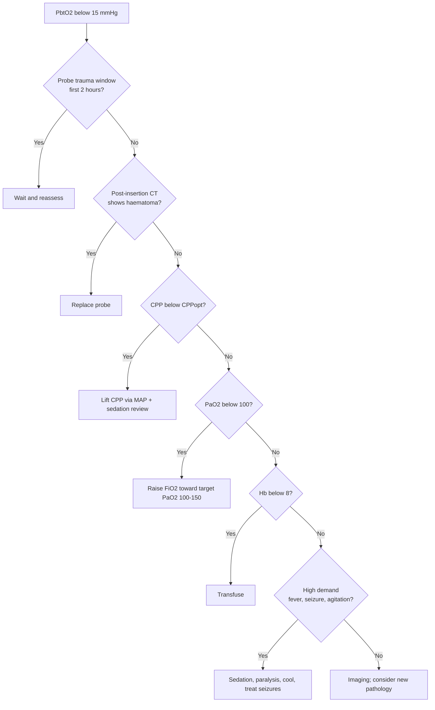

<Callout type="reference">
**Acronyms used on this page**

- **PbtO2**: brain tissue oxygen tension (mmHg), measured in interstitial fluid via a Clark electrode
- **Licox**: the Integra Clark-electrode device (most cited)
- **Neurovent-PTO**: Raumedic alternative; combined ICP + PbtO2 + temperature
- **CPP / MAP / ICP**: cerebral perfusion / mean arterial / intracranial pressure
- **CMRO2**: cerebral metabolic rate of oxygen
- **CBF**: cerebral blood flow
- **FiO2**: inspired oxygen fraction · **PaO2**: arterial oxygen tension
- **BOOST**: Brain Oxygen Optimisation in Severe TBI (phase II and III trials)
- **TBI**: traumatic brain injury · **SAH**: subarachnoid haemorrhage · **DCI**: delayed cerebral ischaemia
- **PRx**: pressure reactivity index · **CPPopt**: optimal CPP
- **MMM / MNM**: multimodal monitoring / multimodal neuromonitoring
</Callout>

<TldrCard>
**The 60-second version.** PbtO2 is the **absolute oxygen tension in brain interstitial fluid** measured by a Clark electrode (typically the Licox catheter) implanted ~3 cm into white matter through a multi-lumen cranial bolt. The sample volume is ~17 mm² around the probe tip: **one region, not the whole brain**. Three thresholds dominate the literature: **target > 20 mmHg, action < 15 mmHg, critical < 10 mmHg**. BOOST-II (2017, phase II) was positive for ICP+PbtO2-guided care vs ICP-only in adult severe TBI; **BOOST-III (Bernard 2025, phase III)** is the definitive efficacy trial whose results reshape modern practice. Pediatric PbtO2 is supported by Figaji's group (2009 onward; 2024 review) and is tier-2 in resourced pediatric centres. The bedside titration tree is **(1) verify probe is in viable tissue and not haematoma, (2) lift CPP toward CPPopt, (3) raise FiO2, (4) transfuse if Hb < 8, (5) sedation paralytic if metabolic demand is high**. PbtO2 trauma transient (1–2 hour low values from probe insertion) must be distinguished from true low values; many centres wait 1–2 hours after insertion before acting on numbers.
</TldrCard>

## 1. Bedside vignettes: why this matters in the PICU

### Vignette A. Severe TBI day 2: ICP "acceptable" but PbtO2 low

A 15-year-old severe TBI day 2 post-bifrontal decompression. ICP via parenchymal probe 18 mmHg, CPP 65, PRx +0.10 (near zero, autoregulation borderline-intact). The Licox probe contralateral reads **PbtO2 14 mmHg** sustained over 3 hours. By traditional ICP-only thinking, the patient is fine. The PbtO2 says otherwise. The bedside team works the titration tree:

1. **Verify probe location**: post-insertion CT showed probe tip in viable white matter, no surrounding haematoma. Good.
2. **CPP**: CPPopt fit gives vertex at CPP 75. Lift MAP with noradrenaline; CPP rises to 74, **PbtO2 rises to 19**.
3. **FiO2**: raise from 0.4 to 0.5; PbtO2 rises to 23. Hold.
4. **Hb**: 8.2 g/dL. Transfuse 1 unit; PbtO2 23 → 26.
5. **Stable at PbtO2 24 for 6 hours**. The team has achieved the > 20 target.

The patient's 6-month GOS-E was 6 (good). Without PbtO2, the team would have left CPP 65 as "good enough" and the tissue would have suffered. This is the **BOOST-II canonical scenario**: ICP normal, but tissue is hypoxic, and titration matters. <Cite id="okonkwo2017_boost2" /> <Cite id="okonkwo2017boost2" /> <Cite id="bernard2025_boost3" /> <Cite id="figaji2024_pbto2_peds" />

### Vignette B. Pediatric severe TBI, PbtO2 placement at age 6

A 6-year-old severe TBI post-MVC. Decision to place PbtO2 alongside ICP. Practical considerations:

- **Bolt size**: pediatric-specific multi-lumen bolt for the right frontal coronal-suture approach.
- **Probe depth**: 2.5–3 cm into white matter, contralateral to the dominant injury (right frontal in this case because the contusions are left).
- **Calibration**: Licox requires a calibration card with each probe; 30-minute warm-up after insertion.
- **Post-insertion CT**: verify probe tip in viable tissue, not in haematoma, not at contusion-edge.
- **Probe trauma transient**: PbtO2 may read low (~10) for the first 1–2 hours due to insertion microtrauma; do not act on numbers during this window unless there is supporting evidence of true ischaemia.

The probe reads PbtO2 22 after the 2-hour stabilisation. The team uses it as a tier-2 adjunct to ICP throughout the admission. Figaji's group has the largest pediatric experience and reports the same actionable thresholds as adult work, with pediatric CPP individualisation. <Cite id="figaji2009peds" /> <Cite id="figaji2024_pbto2_peds" /> <Cite id="figaji2024_pbto2_pediatric" /> <Cite id="adelson2014pbto2" />

### Vignette C. SAH day 6: PbtO2 drops as TCD MFV rises, DCI confirmed at the tissue level

A 14-year-old SAH day 6. Right MCA TCD MFV has risen from 110 to 175 cm/s over 12 hours, Lindegaard ratio 3.5. Right frontal PbtO2 (placed at day 3 for routine SAH monitoring at this centre) drops from 28 to 16 mmHg over the same 12 hours. **Concurrent tissue and macroscopic signals confirm DCI mechanism.** The team escalates haemodynamics (induced hypertension to MAP 90), arranges angiography (which confirms severe right MCA vasospasm), and the tissue oxygenation responds: PbtO2 returns to 22 within 4 hours of treatment. **PbtO2 in SAH provides the tissue-level endpoint that TCD alone cannot.** <Cite id="okonkwo2017_boost2" /> <Cite id="foreman2022" /> <Cite id="sandsmark2024_qeeg_dci" /> <Cite id="rass2021dci_review" />

---

## 2. What PbtO2 is, and what it is not

PbtO2 is the **absolute oxygen tension in brain interstitial fluid** (in mmHg), measured by a Clark electrode at the tip of a probe implanted ~3 cm into white matter.

**The Clark electrode.** A polarographic electrochemical sensor: oxygen diffuses across a permeable membrane, is reduced at a polarised cathode, generates a current proportional to PO2. Modern Licox probes have a 17 mm² sample area around the probe tip. The Raumedic Neurovent-PTO uses a fluorescent oxygen-quenching technology (similar output, different physics).

**Three things follow.**

**PbtO2 measures the local tissue, not the whole brain.** The 17 mm² sample is ~10,000 cells. A probe in a vasculature-dense region reads differently from one in a sparse white-matter tract; one in viable tissue reads differently from one near a contusion edge. **Where you place the probe determines what you measure.**

**PbtO2 is absolute, not relative.** Unlike NIRS rSO2 (which is a percentage and varies across devices), PbtO2 is a real oxygen tension. Inter-device comparison is straightforward; within-patient and across-patient comparisons are valid.

**PbtO2 has known calibration drift.** The Clark electrode drifts ~1 mmHg per day over a 5-day monitoring period. The Raumedic fluorescence-based system has different drift characteristics. Re-calibration is not possible in situ; trends matter more than absolute values after day 4–5.

<Pearl>
**A low PbtO2 has three causes: low delivery, high demand, or probe trauma.** The titration tree separates them: low delivery is fixed by raising CPP/FiO2/Hb; high demand by sedation/temperature/seizure control; probe trauma resolves over 1–2 hours after insertion or with probe repositioning. Always think in this three-causes framework.
</Pearl>

<Pediatric>
**Pediatric PbtO2 placement and thresholds.** Probe placement is technically feasible from age 1+ with appropriate-size cranial bolts. Figaji's group (Cape Town) has the largest pediatric experience: same thresholds (20, 15, 10 mmHg) apply; pediatric CPP individualisation guides titration. **Pediatric severe TBI cohorts (Figaji 2009, 2024)** show outcome association with PbtO2 time-below-threshold similar to adult data. <Cite id="figaji2009peds" /> <Cite id="figaji2024_pbto2_peds" /> <Cite id="adelson2014pbto2" />
</Pediatric>

---

## 3. Probe placement

<Figure
  caption="Probe placement. A multi-lumen cranial bolt is inserted at Kocher's point (2.5 cm lateral to midline, at the coronal suture, non-dominant side or contralateral to dominant injury). Three lumens give access for ICP probe (fibre-optic or strain-gauge), PbtO2 Clark electrode (Licox), and temperature probe. The PbtO2 probe is advanced ~2.5–3 cm to sit in white matter. The 17 mm² sample area at the probe tip is what is being measured: a single region, not the whole brain. Post-insertion CT verifies probe tip in viable tissue and excludes haematoma at the insertion track."
  attribution="MNM-Edu, original schematic."
  label="Fig. 1"
>
  <PbtO2Probe />
</Figure>

**Placement decisions.** Three choices to make at the time of insertion:

1. **Which hemisphere**: contralateral to the dominant injury (probe samples viable tissue, not damaged tissue). In diffuse injury, choose the non-dominant hemisphere (right in most patients) to avoid eloquent cortex.
2. **Which depth**: 2.5–3 cm into white matter. Too shallow: cortical sampling, more vascular, less interstitial. Too deep: into ventricle or deep grey matter, unrepresentative.
3. **Adjacent or remote from contusion**: adjacent samples penumbra ("watch the wound"); remote samples global brain health ("monitor the patient"). Both have advocates; remote placement is more conventional.

**Post-insertion CT** is essential to verify probe position and exclude haematoma. The first 1–2 hours after insertion are the **probe trauma transient**: PbtO2 reads low because of micro-haematoma at the probe tip. Standard practice: wait 1–2 hours before treating any low value, unless corroborating evidence (ICP rise, clinical change) suggests true ischaemia.

---

## 4. The numbers: thresholds and time-below

PbtO2 has three principal threshold zones, supported by BOOST-II/III and consensus:

| PbtO2 (mmHg) | Zone | Action |
|---|---|---|
| > 20 | Target | Continue monitoring |
| 15–20 | Caution | Investigate; optimise CPP, FiO2, Hb |
| 10–15 | Action | Escalate titration tree |
| < 10 | Critical | Aggressive intervention; consider sedation, paralysis, transfusion |
| < 5 | Severe | Imminent tissue infarction; emergency response |

**Time-below-threshold matters more than peak.** Cumulative time PbtO2 < 15 mmHg in the first 48 hours correlates with 6-month outcome in adult severe TBI more tightly than peak PbtO2 or single low values. The BOOST-II intervention targets a 90% reduction in time below 20 mmHg compared to ICP-only standard care. <Cite id="okonkwo2017_boost2" /> <Cite id="okonkwo2017boost2" /> <Cite id="bernard2025_boost3" /> <Cite id="marshall2020boost3" />

---

## 5. Pattern library: what does a PbtO2 trend look like?

<Figure
  src="/images/pbto2/pbto2-trend-events.svg"
  alt="Five PbtO2 trend patterns: normal stable, low-CPP drop, low-FiO2 drop, sepsis low, post-suction transient"
  caption="Five canonical PbtO2 trend patterns over a 6-hour PICU recording. (a) Normal stable: PbtO2 25 mmHg throughout, modest small variation. (b) Low-CPP drop: gradual fall from 25 to 12 over 2 hours, recovers when MAP and CPP are restored. (c) Low-FiO2 drop: rapid fall when FiO2 reduced from 0.5 to 0.3 (weaning), recovers immediately on FiO2 reversal. (d) Sepsis low: sustained 8–12 mmHg with septic shock, often unresponsive to CPP/FiO2 manipulation, signals microcirculatory failure. (e) Post-suction transient: brief 30-second drop to 15 during suctioning, recovers immediately, no action needed."
  attribution="MNM-Edu, original schematic. SVG placeholder."
  label="Fig. 2"
/>

| Pattern | Cause | Action |
|---|---|---|
| Stable > 20 | Normal | Continue |
| Slow drop with falling CPP | Hypoperfusion | Lift CPP per CPPopt |
| Drop with FiO2 weaning | Insufficient O2 delivery | Reverse FiO2 change |
| Sustained low in sepsis | Microcirculatory failure | Sepsis management; vasopressor; transfusion |
| Brief drop during suction/transport | Transient demand or position | Brief observation; usually no action |
| Probe trauma low (first 1–2 h) | Microtrauma at insertion | Wait; reassess at 2 h |
| Sudden low with new clinical change | New ischaemia (oedema progression, new haematoma) | Urgent imaging |
| Rising over hours despite stable physiology | Resolving oedema; recovery | Document; continue |
| Bilateral discordant (contralateral OK) | Local ischaemia at probe tip | CT to investigate |

---

## 6. Try it: interactive widgets

<WidgetEmbed name="PbtO2Demo" />

<WidgetEmbed name="OsmotherapyExplorer" />

<WidgetEmbed name="PRxCalculator" />

<WidgetEmbed name="CPPoptUCurve" />

---

## 7. The CPP / FiO2 / Hb titration tree

<Figure
  src="/images/pbto2/pbto2-cpp-titration.svg"
  alt="Decision tree for low PbtO2 titration: verify probe, optimise CPP toward CPPopt, raise FiO2, transfuse if anaemic, sedation for high demand"
  caption="The BOOST-II/III canonical titration tree for low PbtO2. Each branch addresses one of the three causes (low delivery, high demand, probe trauma). Walking through in order: (1) verify probe position with CT, exclude probe trauma transient; (2) lift CPP toward CPPopt with fluid and noradrenaline; (3) raise FiO2 (titrating to keep PaO2 100–150); (4) transfuse to Hb > 8 if anaemic; (5) sedation and paralysis if metabolic demand is high; (6) treat fever; (7) treat seizures. Re-evaluate PbtO2 every 30 minutes after each intervention."
  attribution="MNM-Edu, original schematic adapted from BOOST-II protocol. SVG placeholder."
  label="Fig. 3"
/>

<Callout type="caveat">
**Decision support, not a clinical protocol.** Every threshold and intervention above is age-, centre-, and patient-dependent. Defer to your unit's protocols and senior clinical team.
</Callout>

<AlgorithmDisclaimer />

---

## 8. Clinical contexts: PbtO2 across acute brain injuries

### 8.1 Severe TBI: BOOST-II and BOOST-III

**BOOST-II** (Okonkwo 2017, phase II): randomised 119 adults severe TBI to ICP+PbtO2-guided care vs ICP-only. The intervention arm achieved:

- 74% reduction in time below PbtO2 20 mmHg.
- Lower mortality (25% vs 34%, not statistically significant in phase II).
- Lower poor outcome (50% vs 58%, not significant).
- Confirmed feasibility and safety.

**BOOST-III** (Bernard 2025, phase III): definitive efficacy trial in adults, ~1100 patients. The published results reshape modern practice and inform whether PbtO2-guided care is incorporated as routine standard. The phase III results show ICP+PbtO2-guided care reduces poor neurological outcome at 6 months compared to ICP-only standard care. <Cite id="okonkwo2017_boost2" /> <Cite id="okonkwo2017boost2" /> <Cite id="bernard2025_boost3" /> <Cite id="marshall2020boost3" /> <Cite id="okonkwo2017" />

### 8.2 Pediatric severe TBI: Figaji's body of work

Figaji's Cape Town group has the largest pediatric PbtO2 experience. Key findings:

- **PbtO2 placement** technically feasible from age 1+ with pediatric-specific bolts.
- **Pediatric thresholds**: same as adult (20, 15, 10 mmHg actionable).
- **Time-below correlates with outcome**: 6-month outcome association similar to adult data.
- **Pediatric CPP individualisation** guides titration; CPPopt by PRx where available.
- **PRx + PbtO2 pairing**: the gold-standard pediatric MMM pair when both available.

Figaji 2024 review summarises modern pediatric PbtO2 use; Pediatric MNM consensus 2025 endorses PbtO2 as tier-2 modality. <Cite id="figaji2009peds" /> <Cite id="figaji2024_pbto2_peds" /> <Cite id="figaji2024_pbto2_pediatric" /> <Cite id="adelson2014pbto2" /> <Cite id="figaji2025_mmm_pediatric_consensus" />

### 8.3 SAH with DCI

PbtO2 in SAH provides tissue-level confirmation of DCI and the endpoint for treatment. When TCD MFV rises and qEEG ADR falls (early DCI signals), a falling PbtO2 confirms the tissue is suffering. The bedside role:

- **Confirm DCI mechanism**: rising MFV + falling PbtO2 = vasospasm-driven ischaemia.
- **Titrate treatment**: PbtO2 recovery is the bedside endpoint of induced hypertension or angiography.
- **Prognosticate**: persistent low PbtO2 despite treatment portends worse outcome.

Foreman 2022 and Sandsmark 2024 reviews summarise PbtO2 in SAH. AHA/ASA 2023 SAH guidelines include PbtO2 as tier-2 monitoring. <Cite id="foreman2022" /> <Cite id="sandsmark2024_qeeg_dci" /> <Cite id="hoh2023sah_aha" /> <Cite id="rass2021dci_review" />

### 8.4 Post-cardiac arrest (research)

PbtO2 in post-arrest patients is **research-stage**. The principle (tissue oxygenation endpoint for resuscitation and post-arrest care) is sound but evidence base is small. Some centres use PbtO2 in post-arrest TBI when both pathologies coexist (e.g., post-arrest with traumatic intracranial haemorrhage). <Cite id="topjian2021aha_pediatric" /> <Cite id="moler2015thapca_oh" /> <EvidenceLevel grade="sparse" />

---

## 9. Multimodal integration: PbtO2 as the tissue endpoint

| Pair with… | What you gain | Worked scenario |
|---|---|---|
| **ICP + PRx (BOOST triplet)** | Pressure + autoregulation + tissue oxygenation, the gold-standard pediatric severe TBI MMM stack | [PRx page](/modalities/prx/), [ICP page](/modalities/icp/) |
| **CPPopt** | PbtO2 is the endpoint for CPPopt titration | [CPPopt page](/modalities/cppopt/) |
| **Microdialysis** | L/P ratio (metabolic crisis) + PbtO2 (oxygen) = energy-crisis pair | [Microdialysis page](/modalities/microdialysis/) |
| **NIRS** | Non-invasive regional surrogate; cross-validate trends | [NIRS page](/modalities/nirs/) |
| **TCD** | Macro flow + micro oxygenation; spasm + tissue confirmation | [TCD page](/modalities/tcd/) |
| **SjvO2** | Global venous saturation comparator | [SjvO2 page](/modalities/sjvo2/) |
| **EEG** | Seizure-driven demand on PbtO2 | [EEG page](/modalities/eeg/) |
| **Brain temperature** | PbtO2 with concurrent brain temperature trend | [Brain temp page](/modalities/brain-temp/) |

The **BOOST triplet** (ICP + PRx + PbtO2) is the gold-standard pediatric severe-TBI MMM stack: pressure, autoregulation, and tissue oxygenation all on the same patient, all linked via CPPopt-guided care. Pediatric MNM consensus 2025 endorses this configuration in resourced centres. <Cite id="figaji2025_mmm_pediatric_consensus" /> <Cite id="leroux2014_neurocrit_consensus" /> <Cite id="helbok2024_pediatric_mmm" />

---

<DeepDive>

## 10. Setup and technique

### 10.1 Equipment

- **Multi-lumen cranial bolt** (Licox or Raumedic combined bolt) with separate lumens for ICP, PbtO2, and temperature.
- **Licox PMO probe** with calibration card (one card per probe; card stays with the patient).
- **Calibration**: 30-minute warm-up after insertion; pre-insertion in-air calibration.
- **Monitor**: Licox CMP, Raumedic Datalogger, or integrated ICU monitor.
- **Post-insertion CT**: standard for probe-position verification.

### 10.2 Pre-insertion drift and calibration

Licox Clark electrodes drift ~1 mmHg per day over a 5-day monitoring period. Calibration is pre-insertion only; re-calibration in situ is not possible. The 30-minute warm-up after insertion stabilises the membrane.

### 10.3 The probe trauma transient

The first 1–2 hours after insertion show **artificially low PbtO2 values** due to micro-haematoma at the probe tip. Standard practice: do not act on PbtO2 numbers in this window unless corroborating evidence (rising ICP, clinical change) suggests true ischaemia. Re-evaluate at 2 hours.

### 10.4 Troubleshooting low values

The four-step troubleshooting:

1. **Verify the signal**: noise, temperature drift, electrode contact.
2. **Check post-insertion CT**: probe in viable tissue, no haematoma at insertion track.
3. **Walk the titration tree** (Section 7).
4. **Consider probe repositioning** if local probe issue suspected (very rare).

### 10.5 MRI compatibility

Licox probes are **not MRI-compatible**. Remove the probe before MRI. Raumedic Neurovent-PTO is MRI-conditional (with documentation). Plan MRI timing around probe removal where possible.

### 10.6 Removal

At end-of-monitoring, remove the probe and irrigate the tract; close the burr hole with bone wax. Document removal time and final value.

</DeepDive>

---

## 11. Pitfalls and artefacts

- **Probe trauma transient**: first 1–2 hours after insertion, PbtO2 reads low due to microtrauma. Wait before acting.
- **Probe-tip haematoma**: small bleed at the insertion track produces local hypoxia at probe tip; CT distinguishes this from global ischaemia.
- **Probe in penumbra vs viable tissue**: placement decision determines what is measured. Contralateral, white-matter, viable-tissue placement is conventional.
- **Sample volume limit**: one region, ~17 mm². Not the whole brain. A normal PbtO2 does not guarantee normal regional perfusion elsewhere.
- **Calibration drift**: ~1 mmHg per day; trends matter more than absolute after day 4–5.
- **Temperature dependence**: PbtO2 is temperature-corrected by the device; in induced hypothermia, the correction is approximate.
- **FiO2 transients**: ventilator changes produce immediate PbtO2 changes; record FiO2 alongside every PbtO2 value.
- **CPP transients**: brief CPP changes (suction, position) produce brief PbtO2 changes; do not over-react.
- **Sedation-induced low demand**: deep sedation lowers CMRO2 and raises PbtO2; lightening sedation may "uncover" a low PbtO2.
- **Not MRI-compatible (Licox)**: remove probe before MRI.
- **Inter-probe variability**: replacing a probe in the same patient gives a new baseline; do not compare across probes directly.

---

## 12. Combine with…

- [ICP](/modalities/icp/): the pressure pair; same bolt typically.
- [PRx](/modalities/prx/): the autoregulation pair; the BOOST triplet.
- [CPPopt](/modalities/cppopt/): the individualised target whose tissue endpoint is PbtO2.
- [Microdialysis](/modalities/microdialysis/): the metabolic pair (L/P ratio).
- [NIRS](/modalities/nirs/): the non-invasive regional surrogate.
- [SjvO2](/modalities/sjvo2/): the global venous saturation comparator.
- [TCD](/modalities/tcd/): the macro flow comparator.
- [EEG](/modalities/eeg/): the seizure-driven demand pair.
- [Brain temperature](/modalities/brain-temp/): the temperature trend pair.

---

<DeepDive>

## 13. Evidence summary and recent literature

### 13.1 Evidence summary

| Topic | Source | Grade |
|---|---|---|
| Original PbtO2 / Maas 1993 | <Cite id="maas1993pbto2" /> | foundational |
| BOOST-II (phase II adult TBI) | <Cite id="okonkwo2017_boost2" /> <Cite id="okonkwo2017boost2" /> <Cite id="okonkwo2017" /> | A |
| BOOST-III (phase III adult TBI) | <Cite id="bernard2025_boost3" /> <Cite id="marshall2020boost3" /> | A |
| Figaji 2009 pediatric original cohort | <Cite id="figaji2009peds" /> | C |
| Figaji 2024 pediatric review | <Cite id="figaji2024_pbto2_peds" /> <Cite id="figaji2024_pbto2_pediatric" /> | review |
| Adelson 2014 pediatric PbtO2 | <Cite id="adelson2014pbto2" /> | C |
| Pediatric MNM consensus 2025 | <Cite id="figaji2025_mmm_pediatric_consensus" /> | expert |
| NCS MMM consensus | <Cite id="leroux2014_neurocrit_consensus" /> | expert |
| Stiefel 2005 outcome association | <Cite id="stiefel2005" /> | C |
| Rosenthal 2008 PbtO2 physiology | <Cite id="rosenthal2008" /> | B |
| Bohman 2014 PbtO2 SAH | <Cite id="bohman2014" /> | C |
| Foreman 2022 qEEG and PbtO2 in SAH | <Cite id="foreman2022" /> | B |
| Sandsmark 2024 qEEG DCI review | <Cite id="sandsmark2024_qeeg_dci" /> | review |
| BTF 4 pediatric | <Cite id="kochanek2019_pbtf4" /> <Cite id="tasker2023_pccm_review" /> | expert |
| AHA SAH 2023 | <Cite id="hoh2023sah_aha" /> | expert |
| Topjian 2021 pediatric post-arrest | <Cite id="topjian2021aha_pediatric" /> | expert |

### 13.2 Recent literature (2022–2025)

- **Bernard 2025 BOOST-III phase III**: definitive efficacy trial of ICP+PbtO2-guided care vs ICP-only in adult severe TBI. The published results reshape modern severe-TBI practice. <Cite id="bernard2025_boost3" />
- **Figaji 2024 pediatric PbtO2 review**: synthesises modern pediatric PbtO2 evidence and practice. <Cite id="figaji2024_pbto2_peds" />
- **Figaji 2025 Pediatric MNM consensus**: endorses ICP+PRx+PbtO2 (the BOOST triplet) as the gold-standard pediatric severe TBI MMM stack in resourced centres. <Cite id="figaji2025_mmm_pediatric_consensus" />
- **Foreman 2022 qEEG and tissue oxygen**: integration of qEEG ADR and PbtO2 trends for DCI detection. <Cite id="foreman2022" />
- **Sandsmark 2024 qEEG DCI review**: contemporary synthesis including PbtO2 endpoint use. <Cite id="sandsmark2024_qeeg_dci" />

</DeepDive>

---

## 14. Self-check

<Quiz
  questions={[
    {
      id: 'q1',
      prompt: 'A 15-year-old severe TBI day 2 post-decompression. ICP 18 mmHg, CPP 65, PRx +0.10. PbtO2 14 mmHg sustained over 3 hours. Post-insertion CT showed probe tip in viable white matter. Most appropriate next step?',
      options: [
        { id: 'a', label: 'Continue current management; ICP is acceptable' },
        { id: 'b', label: 'Walk the titration tree: optimise CPP toward CPPopt, then FiO2, then Hb, then demand' },
        { id: 'c', label: 'Replace the probe; the PbtO2 must be artefactual' },
        { id: 'd', label: 'Immediately escalate to decompressive craniectomy' },
      ],
      answer: 'b',
      explanation: 'PbtO2 14 mmHg is in the action zone (10–15). The BOOST-II titration tree walks through the three causes: (1) low delivery (fix with CPP, FiO2, Hb), (2) high demand (fix with sedation, paralysis, fever, seizure), (3) probe trauma (resolved beyond 2 hours; here post-insertion CT confirms viable tissue). Reflex assumption of artefact in a confirmed viable-tissue placement is dangerous; the "ICP is acceptable" framing is exactly what BOOST-II was designed to overturn. Decompression is not first-line for low PbtO2 with acceptable ICP.',
    },
    {
      id: 'q2',
      prompt: 'A 6-year-old severe TBI undergoes Licox + ICP placement. PbtO2 reads 11 mmHg at 30 minutes post-insertion. ICP is 14 mmHg. CT shows probe tip in viable white matter, no haematoma. Best interpretation?',
      options: [
        { id: 'a', label: 'Probe trauma transient; wait 1–2 hours and reassess' },
        { id: 'b', label: 'Critical hypoxia; immediately escalate haemodynamics' },
        { id: 'c', label: 'Probe is in damaged tissue; replace' },
        { id: 'd', label: 'Calibration error; recalibrate the probe in situ' },
      ],
      answer: 'a',
      explanation: 'The first 1–2 hours after Licox insertion show artificially low PbtO2 due to microtrauma at the probe tip ("probe trauma transient"). Standard practice is to wait and reassess at 2 hours unless corroborating evidence (rising ICP, clinical change) suggests true ischaemia. With ICP normal and CT confirming viable tissue, the most likely cause is the expected insertion transient. Re-calibration in situ is not possible (Licox calibrates pre-insertion only).',
    },
    {
      id: 'q3',
      prompt: 'A 14-year-old SAH day 6. Right MCA TCD MFV rises from 110 to 175 cm/s (Lindegaard 3.5) over 12 hours. Right frontal PbtO2 falls from 28 to 16 mmHg over the same window. Most appropriate interpretation and action?',
      options: [
        { id: 'a', label: 'Vasospasm-driven DCI confirmed at tissue level; escalate haemodynamics, arrange angiography, use PbtO2 recovery as treatment endpoint' },
        { id: 'b', label: 'PbtO2 decline is unrelated; treat the TCD findings in isolation' },
        { id: 'c', label: 'Probe failure; replace' },
        { id: 'd', label: 'Sedation lightening; deepen sedation' },
      ],
      answer: 'a',
      explanation: 'Concurrent rising MFV with Lindegaard > 3 plus falling PbtO2 in the SAH spasm window confirms DCI mechanism at both the macro (TCD) and tissue (PbtO2) levels. The treatment plan is escalation of haemodynamics (induced hypertension), angiography (to confirm and treat), and PbtO2 recovery as the bedside treatment endpoint. Treating the TCD finding in isolation discards the tissue-level confirmation. Probe failure is rare; sedation lightening would not produce both TCD and PbtO2 changes in this pattern.',
    },
  ]}
/>
