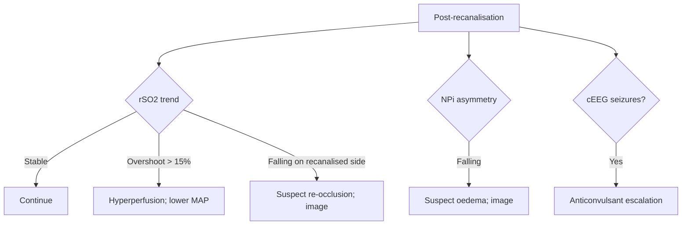

<Callout type="reference">
**Acronyms used on this page**

- **AIS**: arterial ischaemic stroke
- **CSVT**: cerebral sinovenous thrombosis
- **PedNIHSS**: Pediatric NIH Stroke Scale
- **tPA / IV-tPA**: tissue plasminogen activator / intravenous thrombolysis
- **MT**: mechanical thrombectomy
- **TIPS**: Thrombolysis in Pediatric Stroke study
- **AHA / ASA**: American Heart Association / American Stroke Association
- **TCD / TCCD**: transcranial Doppler / transcranial color-coded duplex
- **MFV / PI / LR**: mean flow velocity / pulsatility index / Lindegaard ratio
- **NIRS / rSO2**: near-infrared spectroscopy / regional cerebral oxygen saturation
- **cEEG / qEEG / ADR**: continuous EEG / quantitative EEG / alpha-delta ratio
- **NPi**: Neurological Pupil index
- **ONSD**: optic nerve sheath diameter
- **MMM / MNM**: multimodal monitoring / multimodal neuromonitoring
</Callout>

<TldrCard>
**The 60-second version.** Pediatric AIS occurs in roughly 2 to 13 per 100,000 children per year and is one of the top-ten causes of death in childhood. The clinical presentation is variable (focal weakness, dysphasia, seizure, decreased level of consciousness) and the diagnosis is often delayed: median time from symptom onset to diagnosis is 24 hours in published cohorts, dramatically longer than the adult window. **MRI/MRA is the diagnostic gold standard.** When IV-tPA or mechanical thrombectomy is considered, time matters: AHA pediatric stroke guidelines support thrombolysis in selected children up to age 18 and thrombectomy up to ~24 h from onset for large-vessel occlusion. Multimodal neuromonitoring (continuous TCD for re-occlusion / hyperperfusion, NIRS for tissue oxygenation, cEEG for seizures, NPi for evolving oedema, ONSD for raised ICP) supports peri-interventional and post-recanalisation care. **Sickle cell disease has its own STOP-screening pathway** with TCD TAMMV ≥ 200 cm/s triggering chronic transfusion.
</TldrCard>

## 1. Bedside vignettes: why this matters in the PICU

### Vignette A. The 8-year-old with sudden right-sided weakness

An 8-year-old presents to the ED 2 hours after sudden onset right-arm weakness and dysarthria. PedNIHSS 12. Non-contrast CT excludes haemorrhage; CT angio shows left M1 occlusion. The pediatric stroke team is activated. The decision to pursue IV-tPA is made in conjunction with the pediatric neurology and stroke service; the decision to also consider mechanical thrombectomy is made jointly with interventional radiology. During the post-arrival workup, the team begins continuous bedside TCD over the right MCA (the unaffected side, as a global haemodynamic monitor), pulses oximetry NIRS over the at-risk hemisphere, and prepares cEEG for the post-recanalisation window. After successful MT with TICI 2b at 4.5 h, post-procedure rSO2 over the recanalised hemisphere rises from 52% to 78% within minutes (hyperperfusion). The team lowers MAP by 15% with a careful esmolol infusion to prevent hyperperfusion bleed; rSO2 settles to 68%; the child does well. <Cite id="ferriero2019aha_pedstroke" /> <Cite id="sun2020_pediatric_thrombectomy" />

### Vignette B. The 18-month-old after cardiac surgery, the silent stroke

An 18-month-old is on day 3 after a complex cardiac repair (Norwood stage 1). NIRS over the right cerebral cortex has been trending down over the last 6 hours from 68% to 51%, despite stable systemic haemodynamics. The bedside aEEG shows new asymmetry: the right hemisphere amplitude has fallen 30%. Pupillary exam is symmetric. The team escalates: head CT shows a new right MCA infarct, presumed cardio-embolic from the post-operative state. Anticoagulation is started after multidisciplinary input; continuous NIRS and cEEG remain in place to monitor for malignant oedema in the days ahead. **In a non-verbal, sedated post-cardiac-surgery infant, the bedside MNM signals (asymmetric NIRS and aEEG) were the only early markers of the stroke.** <Cite id="ferriero2019aha_pedstroke" /> <Cite id="larovere2018_pedsais" />

### Vignette C. The 12-year-old with sickle cell disease and abnormal STOP TCD

A 12-year-old with HbSS sickle cell disease is in the annual screening clinic. The STOP-protocol TCD shows TAMMV 215 cm/s in the right MCA (abnormal: ≥ 200 cm/s). The child is asymptomatic. Per the STOP-1 trial, chronic monthly transfusion is initiated to reduce stroke risk from 10% per year (untreated) to 1% per year (transfused). The TCD is repeated in 6 weeks to confirm trend and again at 6 months to assess transfusion response. **This is the only modality on this page where a TCD number triggers a multi-year therapy in an asymptomatic child.** <Cite id="adams1998_stop" /> <Cite id="adams2005_stop2" />

---

## 2. What pediatric AIS monitoring is, and what it is not

Pediatric AIS is a focal arterial occlusion in a child causing acute neurological deficit. It is distinct from:

- **Cerebral sinovenous thrombosis (CSVT)**: venous occlusion presenting with headache, seizures, raised ICP, often more insidious onset.
- **Haemorrhagic stroke**: intracerebral or subarachnoid bleed; diagnostic imaging and management entirely different.
- **Stroke mimics**: post-ictal Todd's paresis, complex migraine, conversion disorder, metabolic / encephalopathic syndromes, brain tumours.

**The diagnostic burden in children is delayed recognition, not difficult imaging.** Children with focal deficits often present several hours late, are misdiagnosed as post-ictal or migrainous, and miss the time window for thrombolysis. The 2019 AHA pediatric stroke guidelines emphasise rapid imaging (MRI with diffusion + MR angiography preferred; CT + CT angio acceptable when MRI is not immediately available) within 6 hours of presentation.

**Multimodal monitoring is supportive, not diagnostic.** No combination of TCD, NIRS, NPi, ONSD, or cEEG diagnoses stroke. They:

1. **Detect early evolution**: a falling NIRS rSO2 unilaterally in a sedated child is the bedside signal of a new ischaemic insult.
2. **Track peri-interventional**: continuous TCD during MT detects re-occlusion or hyperperfusion.
3. **Monitor post-recanalisation**: NIRS, cEEG, NPi, ONSD all track the evolving oedema and any haemorrhagic transformation.
4. **Inform secondary prevention**: TCD STOP screening in SCD; serial TCD in moyamoya.

<Pearl>
**Time matters in pediatric stroke, but the window is wider and less validated than adult.** The 2019 AHA pediatric guideline supports IV-tPA in selected children with NIHSS ≥ 6 within 4.5 h of onset, and MT for proximal large-vessel occlusion within 24 h. The decision is multidisciplinary and centre-experience-dependent; pediatric thrombectomy outcomes (Sun 2020, Save ChildS, ESCAPE-CL) are emerging but evidence is C-level. <Cite id="sun2020_pediatric_thrombectomy" /> <Cite id="rivkin2016_TIPS" />
</Pearl>

<Pediatric>
**Pediatric AIS aetiology is heterogeneous.** Arteriopathy (transient cerebral arteriopathy, post-VZV arteriopathy, focal cerebral arteriopathy) is the leading single cause; cardio-embolism (CHD, post-op cardiac), prothrombotic states (lupus, antiphospholipid syndrome, factor V Leiden), trauma (dissection), and sickle cell disease account for the remainder. **Aetiological workup drives secondary prevention** and is parallel to acute monitoring.
</Pediatric>

---

## 3. Anatomy of pediatric stroke and the relevant monitors

<Figure
  src="/images/pediatric-stroke-monitoring/aha-pathway.svg"
  alt="Pediatric AIS pathway: door-to-imaging, candidacy for IV-tPA / thrombectomy, post-recanalisation monitoring"
  caption="Pediatric AIS pathway. Door-to-imaging within 60 min: MRI + MRA preferred; CT + CT angio acceptable when MRI is delayed. Confirmed AIS: candidacy for IV-tPA (NIHSS ≥ 6, within 4.5 h, no haemorrhage), candidacy for mechanical thrombectomy (proximal large-vessel occlusion, age ≥ 2 to 6 in most centres, within 24 h with favourable imaging). Post-recanalisation: continuous bedside MNM (TCD over the contralateral MCA, NIRS over the at-risk hemisphere, cEEG, NPi, BP control). Days to weeks: serial imaging, secondary prevention, rehabilitation."
  attribution="MNM-Edu, original schematic. SVG placeholder."
  label="Fig. 1"
/>

The relevant arterial anatomy:

- **Anterior circulation**: ICA → M1-MCA, A1-ACA. The vast majority of large-vessel pediatric AIS.
- **Posterior circulation**: vertebral arteries → basilar → P1-PCA. Less common; often missed because exam findings are non-localising.
- **Circle of Willis collaterals**: ACOM and PCOM are the natural bypass routes; collateral status determines penumbra size and prognosis.
- **Moyamoya disease**: progressive bilateral terminal ICA / M1 stenosis with leptomeningeal "puff of smoke" collaterals; carries a high recurrent stroke risk and is monitored serially with TCD and clinical exam.

**Where to place each monitor.**

| Monitor | Standard placement | Why |
|---|---|---|
| TCD MCA | Both temporal windows | Bilateral monitoring; contralateral as reference |
| NIRS | Bilateral frontal-cortex pads (right and left) | Detect asymmetric desaturation |
| cEEG | Full 10-20 montage | Hemispheric asymmetry, seizure burden |
| NPi | Both eyes | Catches CN III lesion; trend |
| ONSD | Both eyes | Detects raised ICP from malignant oedema |
| ICP (selected) | Right or contralateral cortex | Only if malignant oedema with surgical consideration |

---

## 4. The signal: what each modality tells you peri-stroke

### 4.1 Bedside TCD

In the post-recanalisation period, continuous bedside TCD over both MCAs provides three pieces of information:

1. **Reocclusion detection**: a sudden fall in MFV in the recanalised vessel signals re-thrombosis.
2. **Hyperperfusion detection**: a rise in MFV on the recanalised side relative to baseline or to contralateral (often > 30%) is the bedside signal of hyperperfusion. <Cite id="larovere2018_pedsais" />
3. **Embolic monitoring**: high-intensity transient signals (HITS) on the TCD spectrum indicate microemboli passing the insonated vessel.

### 4.2 NIRS

NIRS rSO2 over the at-risk hemisphere falls with acute ischaemia and rises (often sharply) after recanalisation. The "post-recanalisation rSO2 overshoot" is the bedside hyperperfusion signal. Asymmetric rSO2 (Δ > 10 to 15%) is the bedside detector of evolving stroke in a sedated child whose clinical exam is uninformative. <Cite id="davies2017nirs" /> <Cite id="andresen2014nirs" />

### 4.3 cEEG / qEEG

After acute stroke, the affected hemisphere shows slowing and reduced fast activity; the qEEG ADR drops; asymmetry rises. In the days after stroke, electrographic seizures (often non-convulsive) occur in 5 to 15% of pediatric AIS, especially with cortical infarcts. cEEG is the surveillance tool. <Cite id="herman2015acns_ceeg" /> <Cite id="sansevere2023_neonatal_ceeg" />

### 4.4 NPi

Catches evolving malignant oedema with CN III compression earlier than the pen-torch. A new asymmetry > 0.7 or a falling NPi in the days post-stroke triggers urgent imaging and consideration of decompressive surgery. <Cite id="oddo2023orange" /> <Cite id="kerscher2023_npi" />

### 4.5 ONSD

Distends with rising ICP from malignant oedema. Age-banded cut-offs apply (~4.5 mm in 1 to 15 y). Serial ONSD over the post-stroke days is one of the bedside triage signals for decompressive surgery consideration. <Cite id="padayachy2016_pediatric_onsd" />

---

## 5. The numbers: what to record peri-stroke

| Variable | Source | What it tells you |
|---|---|---|
| PedNIHSS | Clinical exam | Stroke severity; trajectory |
| TCD MCA MFV, PI, LR | Bilateral TCD | Reocclusion, hyperperfusion, vasospasm |
| NIRS rSO2 (both sides) | NIRS | Tissue oxygenation; asymmetry |
| cEEG / qEEG asymmetry index | cEEG | Hemispheric injury |
| NPi (both eyes) | Pupillometer | Brainstem / CN III status |
| ONSD (both eyes) | Bedside ultrasound | Surrogate for raised ICP |
| MAP and CPP target | Arterial line | BP management peri-recanalisation |
| Serum glucose | Blood gas | Avoid hyperglycaemia in acute ischaemia |
| Temperature | Core | Avoid hyperthermia |

The peri-recanalisation bedside chart should show all of these on a single 24 h view. The pediatric stroke unit / PICU rounds twice daily.

---

## 6. What is normal? Age-banded reference for the monitors in question

| Age | TCD MCA MFV (cm/s) | NIRS rSO2 (% awake) | NPi |
|---|---|---|---|
| 6 mo | 74 ± 14 | 70 to 80 | 3.0 to 4.5 |
| 1 to 3 y | 85 ± 10 | 70 to 80 | 3.5 to 4.7 |
| 4 to 6 y | 97 ± 9 | 65 to 80 | 3.5 to 4.7 |
| 7 to 11 y | 89 ± 9 | 65 to 80 | 3.5 to 4.8 |
| 12 to 18 y | 75 ± 13 | 60 to 80 | 3.5 to 4.7 |

<Cite id="bode1988" /> <Cite id="obrien2015" /> <Cite id="larovere2022" /> <Cite id="freeman2020_pediatric_pupil" />

<Pediatric>
**Stroke-affected hemisphere asymmetry is the key abnormal pattern.** A 30% asymmetry in MCA MFV, a 10 to 15% asymmetry in NIRS rSO2, or a 30% asymmetry in cEEG amplitude all warrant urgent investigation. The absolute number on the affected side is less informative than the side-to-side difference.
</Pediatric>

---

## 7. What is abnormal? Pattern library

<Figure
  caption="Five peri-stroke MNM patterns. (a) Acute occlusion: ipsilateral MFV low or absent, NIRS rSO2 50 to 60%, cEEG slowed and reduced amplitude. (b) Post-recanalisation hyperperfusion: ipsilateral MFV rises 30 to 50% above contralateral, NIRS rSO2 overshoots to 80 to 90%, BP needs lowering. (c) Re-occlusion: ipsilateral MFV abruptly drops, NIRS rSO2 falls, exam may not deteriorate yet. (d) Malignant oedema (days 2 to 5): ipsilateral mass effect, falling NPi, rising ONSD, midline shift on CT. (e) Hyperperfusion bleed: sudden NIRS rise + new neurological deterioration + CT shows bleed in infarct territory."
  attribution="MNM-Edu, original schematic. SVG placeholder."
  label="Fig. 2"
/>

| Pattern | Bedside signature | Action |
|---|---|---|
| Acute occlusion | Low MFV, low rSO2, cEEG slowing | IV-tPA / MT decision |
| Post-recanalisation hyperperfusion | MFV up 30%, rSO2 overshoot | Lower MAP 10 to 15% gently |
| Re-occlusion | Abrupt MFV drop, rSO2 falls | Urgent imaging, consider reintervention |
| Malignant oedema | Falling NPi, rising ONSD, midline shift | Hyperosmolar; consider decompressive craniectomy |
| Hyperperfusion bleed | rSO2 overshoot + exam deterioration | Urgent CT; reverse anticoagulation if applicable |
| New seizure burden | cEEG shows seizures | Anticonvulsant escalation |
| Vasospasm-like rise | MFV rises bilaterally | Verify with Lindegaard; usually not vasospasm in pediatric AIS |

### Decision tree: peri-recanalisation monitoring

---

## 8. Try it: interactive widgets

<WidgetEmbed name="LindegaardCalculator" />

---

## 9. Management decisions in pediatric AIS

### 9.1 Acute hyperacute window

1. **Activate the stroke pathway**: door-to-imaging within 60 minutes per AHA pediatric stroke guidelines.
2. **Imaging**: MRI + MRA preferred; CT + CT angio acceptable.
3. **Confirm AIS and exclude haemorrhage / mimic.**
4. **Candidacy assessment** for IV-tPA (NIHSS ≥ 6, within 4.5 h of last seen well, no haemorrhage on imaging, no contraindication).
5. **Candidacy assessment** for MT (proximal large-vessel occlusion, favourable imaging, age and centre considerations).
6. **Multidisciplinary decision** (pediatric neurology, pediatric stroke team, interventional radiology, PICU, family input).

### 9.2 Peri-intervention monitoring

1. **Arterial line** for continuous BP.
2. **Bedside TCD** over both MCAs (or contralateral MCA as reference).
3. **Bilateral NIRS** pads.
4. **cEEG** initiated for the post-procedure 24 to 48 h.
5. **Continuous pulse oximetry, capnography, temperature** as standard.

### 9.3 Post-recanalisation BP management

The risk of hyperperfusion bleed peaks in the first 24 h post-recanalisation. AHA pediatric stroke guidelines suggest MAP targets in the lower half of the age-appropriate range after successful recanalisation. Bedside NIRS rSO2 overshoot (> 15% above pre-procedure or > 20% asymmetric) prompts gentle MAP lowering (10 to 15%) with esmolol or labetalol. <Cite id="ferriero2019aha_pedstroke" /> <Cite id="sun2020_pediatric_thrombectomy" />

### 9.4 Anticoagulation / antiplatelet for secondary prevention

Cardio-embolic AIS: anticoagulation (LMWH or warfarin) typically started after 24 to 72 h, depending on infarct size and bleed risk. Arteriopathic AIS: antiplatelet (aspirin 1 to 5 mg/kg/day) usually started after 24 h. Multidisciplinary discussion with pediatric haematology.

### 9.5 Malignant oedema and decompressive craniectomy

Large MCA infarct with midline shift > 5 mm, falling NPi, expanding ONSD, and deteriorating exam: decompressive hemicraniectomy reduces mortality in adult MCA infarct and is increasingly used in pediatric MCA infarct in selected centres. Timing is the operative decision: too early may be unnecessary, too late may be futile. <Cite id="ferriero2019aha_pedstroke" />

### 9.6 Sickle cell disease (STOP-screening protocol)

Annual TCD TAMMV screening in children with HbSS or HbSβ-thalassemia, ages 2 to 16 years. TAMMV ≥ 200 cm/s = abnormal, chronic monthly transfusion initiated (STOP-1 / STOP-2). TAMMV 170 to 199 = conditional, re-screen sooner. TAMMV < 170 = normal, annual repeat. <Cite id="adams1998_stop" /> <Cite id="adams2005_stop2" />

### 9.7 Moyamoya progression monitoring

Serial TCD detects progression of terminal ICA stenosis: rising MCA MFV in the absence of vasospasm + clinical context of known moyamoya disease. Combined with serial MRA, drives the decision about surgical revascularisation (encephalo-duro-arterio-synangiosis or related). <Cite id="larovere2018_pedsais" />

<Callout type="caveat">
**Teaching, not protocol.** Pediatric stroke management is a multidisciplinary, centre-experience-dependent activity. Every threshold (MAP target, NIRS asymmetry, NPi cut-off) is age-specific and patient-specific. Defer to your pediatric stroke service and PICU clinical team for decisions; the MNM signals on this page are cueing tools, not treatment protocols.
</Callout>

<AlgorithmDisclaimer />

---

## 10. Clinical contexts: stroke MNM in different scenarios

### 10.1 Pediatric AIS in school-age children

The classic 8 to 12 year old with sudden-onset hemiparesis. Bedside MNM during peri-intervention and the first 48 h post-recanalisation: TCD, NIRS, cEEG, NPi. Decompressive craniectomy if malignant oedema. The TIPS study and 2019 AHA pediatric stroke guidelines provide the framework. <Cite id="rivkin2016_TIPS" /> <Cite id="ferriero2019aha_pedstroke" />

### 10.2 Pediatric AIS in toddlers and infants

Diagnosis is harder (focal signs are subtle, exam-difficult), so MNM (asymmetric NIRS, asymmetric aEEG / cEEG) often raises the first alarm in a sedated post-cardiac-surgery infant or a neonate. Decision-making about thrombolysis in this age group is largely centre-experience-dependent; thrombectomy is rare under age 2. <Cite id="sun2020_pediatric_thrombectomy" />

### 10.3 Cerebral sinovenous thrombosis (CSVT)

Different physiology (venous outflow obstruction) and different management (anticoagulation, hydration, raised ICP support). MNM role: cEEG for seizures (common in CSVT), ONSD for raised ICP, NIRS for tissue oxygenation. Imaging-driven decisions (MR venography + diffusion). <Cite id="ferriero2019aha_pedstroke" />

### 10.4 Stroke in sickle cell disease

The STOP screening pathway is the central preventive intervention. Acute SCD AIS: emergent transfusion exchange to HbS < 30%; multidisciplinary management with paediatric haematology, neurology, and PICU. MNM during the acute window adds NIRS, cEEG, NPi. <Cite id="adams1998_stop" /> <Cite id="adams2005_stop2" />

### 10.5 Stroke complicating congenital heart disease

Post-op cardiac patients have stroke rates of 3 to 10%. Bedside MNM (especially asymmetric NIRS) is the early warning. The Norwood, arterial switch, and Glenn / Fontan patients are highest risk. <Cite id="naim2023_brain_injury_pccm" />

### 10.6 Stroke during pediatric ECMO

VA-ECMO has 5 to 15% acute stroke risk. The ELSO neurological surveillance bundle includes daily NIRS, NPi, and selective neuroimaging. Continuous TCD is informative but technically harder on the non-pulsatile ECMO patient. <Cite id="lorusso2017_elso_neuro" /> <Cite id="cho2024_ecmo_outcomes" />

### 10.7 Stroke after meningitis or encephalitis

Bacterial meningitis (especially pneumococcal) can cause vasculitic stroke. Herpes simplex encephalitis classically affects temporal lobes and causes focal seizures and stroke. MNM role: cEEG (seizures), ONSD (oedema), NIRS (tissue oxygenation). <Cite id="tunkel2017idsa_encephalitis" /> <Cite id="vandebeek2016eu_meningitis" />

### 10.8 Stroke as a complication of trauma (dissection)

Cervical artery dissection from blunt or twisting neck trauma can cause AIS hours to days later. The dissection itself may not be obvious on initial CT. MNM role: clinical surveillance, cEEG if obtundation develops, surgical / endovascular decisions through neurosurgery and interventional radiology. <Cite id="kochanek2019_pbtf4" />

### 10.9 Stroke after cardiac arrest (anoxic, embolic, or both)

Post-arrest patients can have both diffuse HIE injury and focal embolic stroke. MNM role: cEEG and aEEG for seizures, NIRS for asymmetric desaturation that might indicate focal stroke on top of HIE, NPi for brainstem function. Multimodal prognostication framework applies. <Cite id="topjian2021aha_pediatric" /> <Cite id="naim2023_brain_injury_pccm" />

---

## 11. Multimodal integration: stroke MNM stack

| Pair with… | What you gain | Worked scenario |
|---|---|---|
| **Clinical exam (PedNIHSS)** | The diagnostic gate | Trend serial PedNIHSS during 48 h post-recanalisation |
| **TCD** | Reocclusion, hyperperfusion, embolic monitoring | Continuous TCD shows abrupt MFV drop on re-occlusion |
| **NIRS** | Tissue oxygenation asymmetry | Asymmetric rSO2 in sedated infant raises stroke alarm |
| **cEEG / qEEG** | Hemispheric asymmetry, seizure burden | Subclinical seizures in 5 to 15% of pediatric AIS |
| **NPi** | Malignant oedema early-warning | Falling NPi pre-decompressive-craniectomy decision |
| **ONSD** | Surrogate ICP for malignant oedema | Rising ONSD over 24 h supports decompression |
| **Imaging (MRI, CT, angio)** | Diagnostic gold standard | Acute MRI + MRA at presentation |
| **NPi + cEEG + NIRS + TCD** | Composite peri-recanalisation MNM | The integrated bedside view |

<Cite id="figaji2025_mmm_pediatric_consensus" /> <Cite id="helbok2024_pediatric_mmm" /> <Cite id="tasker2023mnm" />

---

<DeepDive>

## 12. Setup and technique

### 12.1 Imaging pathway

1. **Activate the pediatric stroke pathway** at any sudden focal deficit, dysarthria, or focal seizure with persistent deficit.
2. **First imaging**: MRI with diffusion + MRA preferred. CT with CT angio acceptable when MRI is delayed.
3. **Hyperacute decision** about IV-tPA and MT candidacy in a multidisciplinary huddle including pediatric neurology, PICU, interventional radiology, anaesthesia, family.
4. **Repeat imaging at 24 h** to assess infarct evolution and rule out haemorrhagic transformation.

### 12.2 MNM bundle at the bedside

1. **Arterial line** for continuous BP and arterial sampling.
2. **Bilateral NIRS pads** (frontal cortex) placed at admission; trend baseline asymmetry.
3. **cEEG** initiated as soon as practical; full 10-20 montage if available, reduced montage if not.
4. **TCD** baseline scan: bilateral MCA, ACA, PCA; document MFV, PI on both sides. Continuous (fixed headframe) if available and recanalisation is planned.
5. **Pupillometer** (NPi) at admission and Q4 hourly during the surveillance window.
6. **ONSD** at admission and Q12 to Q24 hourly during the malignant-oedema window.
7. **Document all MNM values** on a unified bedside chart with PedNIHSS, MAP, glucose, temperature.

### 12.3 Peri-intervention setup

1. **Anaesthesia consult** for thrombectomy logistics.
2. **Continuous TCD during MT**: monitor for re-occlusion, hyperperfusion, embolic signals.
3. **NIRS continuous**: any asymmetry > 15% during the procedure flagged to the team.
4. **Post-procedure**: bedside MNM for 48 h minimum; longer if any concern.

### 12.4 Decompressive craniectomy decision

The bedside MNM signals that support decompression:

- **Midline shift > 5 mm** on CT.
- **Falling NPi**, especially with asymmetry > 0.7.
- **Expanding ONSD** above age-banded cut-off.
- **Falling GCS** or PedNIHSS deterioration.
- **Failure to respond to maximal medical therapy** (hyperosmolar, sedation, normothermia).

The decision is multidisciplinary (neurosurgery, PICU, neurology, family) and centre-experience-dependent. The pediatric outcome data after decompression are evolving but generally favourable when timing is appropriate.

### 12.5 STOP-protocol TCD in SCD

1. **Annual TCD** in HbSS or HbSβ-thalassemia, ages 2 to 16 years.
2. **Non-imaging (blind) TCD** or **non-angle-corrected TCCD**: angle correction systematically over-reads TAMMV.
3. **TAMMV in MCA** (and basilar, in some protocols): time-averaged maximum mean velocity.
4. **Interpret per STOP-1 / STOP-2**: < 170 normal, 170 to 199 conditional, ≥ 200 abnormal.
5. **Abnormal**: confirm with second scan within 6 weeks; if confirmed, initiate chronic monthly transfusion to maintain HbS < 30%.

### 12.6 Moyamoya monitoring

Serial TCD every 6 to 12 months; pair with serial MRA. Rising MFV in the MCA or new collateral signals indicate progression. Surgical revascularisation (EDAS or related) is the definitive treatment in symptomatic disease. <Cite id="larovere2018_pedsais" />

</DeepDive>

---

## 13. Pitfalls

- **Delayed recognition of pediatric stroke**: the median time from symptom onset to diagnosis is 24 hours; high index of suspicion is the first step.
- **Stroke mimics**: post-ictal Todd's paresis, complex migraine, conversion disorder; imaging is the differentiator.
- **Adult MFV thresholds in children** would miss vasospasm or over-call hyperperfusion; use age-banded reference.
- **STOP TAMMV with angle-corrected TCCD**: angle correction over-reads; use non-angle-corrected for STOP screening.
- **Single-modality decisions**: never decide on decompressive craniectomy or IV-tPA on one MNM signal alone; multimodal + clinical + imaging concordance.
- **Hyperperfusion bleed**: the rSO2 overshoot is the warning; lower MAP gently, not aggressively.
- **Cardio-embolic stroke missed in sedated post-cardiac-surgery infants**: asymmetric NIRS and aEEG are often the only early markers.
- **CSVT diagnosed late**: presentation is non-specific; MR venography is the gold standard.
- **Pediatric thrombectomy evidence is C-level**: outcomes appear favourable but RCT data are limited; centre experience matters.
- **Moyamoya progression is silent**: serial TCD between annual visits catches it.

---

## 14. Combine with…

- [TCD](/modalities/tcd/): the central modality for peri-intervention monitoring and STOP screening.
- [NIRS](/modalities/nirs/): bilateral asymmetry as the early stroke signal.
- [qEEG / cEEG](/modalities/qeeg/): seizure surveillance and hemispheric asymmetry.
- [Pupillometry](/modalities/pupillometry/): malignant oedema early warning.
- [ONSD](/modalities/onsd/): bedside ICP surrogate for oedema progression.
- [Clinical exam](/modalities/clinical-exam/): the diagnostic gate; PedNIHSS is the structured exam tool.
- [Foundations: autoregulation](/foundations/autoregulation/): the physiology behind post-recanalisation hyperperfusion.

---

<DeepDive>

## 15. Evidence summary

| Topic | Source | Grade |
|---|---|---|
| AHA / ASA pediatric stroke guidelines | <Cite id="ferriero2019aha_pedstroke" /> | expert |
| TIPS study | <Cite id="rivkin2016_TIPS" /> | C |
| Pediatric thrombectomy meta-analysis | <Cite id="sun2020_pediatric_thrombectomy" /> | C |
| Pediatric TCD primer | <Cite id="larovere2018_pedsais" /> <Cite id="larovere2022" /> | expert |
| STOP trial (SCD) | <Cite id="adams1998_stop" /> | A |
| STOP-2 trial | <Cite id="adams2005_stop2" /> | A |
| Pediatric MFV reference data | <Cite id="bode1988" /> <Cite id="obrien2015" /> | B/C |
| Pediatric NIRS reference | <Cite id="davies2017nirs" /> <Cite id="andresen2014nirs" /> | C |
| ACNS pediatric cEEG | <Cite id="herman2015acns_ceeg" /> | expert |
| Neonatal cEEG / aEEG | <Cite id="pressler2017neonatal" /> <Cite id="sansevere2023_neonatal_ceeg" /> | expert |
| Pediatric MMM consensus | <Cite id="figaji2025_mmm_pediatric_consensus" /> <Cite id="helbok2024_pediatric_mmm" /> | expert |
| Pediatric post-arrest brain injury | <Cite id="naim2023_brain_injury_pccm" /> | review |
| ELSO neurological guidelines | <Cite id="lorusso2017_elso_neuro" /> | expert |
| Pediatric BTF (TBI) | <Cite id="kochanek2019_pbtf4" /> | expert |

## 16. Recent literature (2022 to 2025)

- **Sun 2020 pediatric thrombectomy meta-analysis**: aggregate of small series suggesting favourable recanalisation rates and functional outcomes in selected children with large-vessel occlusion. <Cite id="sun2020_pediatric_thrombectomy" />
- **LaRovere 2022 pediatric TCD primer**: updated guidance including stroke and moyamoya monitoring. <Cite id="larovere2022" />
- **Naim 2023 pediatric post-arrest brain injury**: framework that overlaps with peri-stroke MNM (multimodal prognostication, NPi, cEEG). <Cite id="naim2023_brain_injury_pccm" />
- **Figaji 2025 pediatric MMM consensus**: stroke and brain-injury MNM as a single overlapping framework. <Cite id="figaji2025_mmm_pediatric_consensus" />
- **Helbok 2024 pediatric MMM**: NIRS, cEEG, NPi as the practical bedside stroke MNM bundle. <Cite id="helbok2024_pediatric_mmm" />
- **Tasker 2023 PCCM review**: stroke as a pediatric neurocritical care entity with overlapping MNM strategy. <Cite id="tasker2023_pccm_review" />

</DeepDive>

---

## 17. Self-check

<Quiz
  questions={[
    {
      id: 'q1',
      prompt: 'An 8-year-old with left M1 occlusion undergoes mechanical thrombectomy with TICI 2b at 4.5 h. Immediately post-procedure, bedside NIRS over the left hemisphere rises from 52% to 78% over minutes; right NIRS stable at 68%. The PedNIHSS is improving. Most appropriate next step?',
      options: [
        { id: 'a', label: 'Reassure: rising rSO2 confirms successful recanalisation; continue as planned' },
        { id: 'b', label: 'Lower MAP by 10 to 15% with a careful esmolol or labetalol infusion to mitigate hyperperfusion bleed risk; recheck NIRS in 30 min' },
        { id: 'c', label: 'Push MAP higher to increase delivery' },
        { id: 'd', label: 'Urgent CT to rule out re-occlusion' },
      ],
      answer: 'b',
      explanation: 'A sharp rise in NIRS rSO2 over the recanalised hemisphere with 10% asymmetry above the contralateral side is the bedside signature of post-recanalisation hyperperfusion. Aggressive BP can drive hyperperfusion bleed. The AHA pediatric stroke pathway after successful recanalisation suggests MAP targets in the lower half of the age-appropriate range; the bedside MNM signal here (NIRS overshoot) is the trigger for gentle BP lowering. Esmolol or labetalol provide titratable, reversible BP control. Pushing MAP higher would worsen hyperperfusion. Urgent CT is reasonable if the exam deteriorates, but the current PedNIHSS is improving; the immediate action is BP management.',
    },
    {
      id: 'q2',
      prompt: 'A 12-year-old with HbSS sickle cell disease undergoes annual STOP-protocol TCD. The technician reports TAMMV 215 cm/s in the right MCA using a TCCD device with angle correction enabled. Patient is asymptomatic. Best interpretation and action?',
      options: [
        { id: 'a', label: 'Confirmed abnormal (≥ 200 cm/s); initiate chronic transfusion immediately' },
        { id: 'b', label: 'Angle-corrected TCCD over-reads TAMMV in SCD; repeat with non-angle-corrected technique before initiating transfusion' },
        { id: 'c', label: 'Normal for sickle cell; no action' },
        { id: 'd', label: 'Conditional; repeat in 12 months' },
      ],
      answer: 'b',
      explanation: 'The STOP and STOP-2 trials used non-angle-corrected blind TCD (or non-angle-corrected spectral Doppler on TCCD) to derive TAMMV. Angle-correction systematically over-reads TAMMV in sickle cell, leading to false-positive STOP screens. Before committing an asymptomatic child to chronic monthly transfusion (a multi-year therapy with significant burden), repeat the scan with the correct non-angle-corrected technique. If still ≥ 200 cm/s, confirm with a second scan within 6 weeks; if confirmed, initiate transfusion per the STOP-1 / STOP-2 protocol. This is a major teaching point in STOP-protocol implementation.',
    },
    {
      id: 'q3',
      prompt: 'An 18-month-old on day 3 after a complex Norwood stage 1. Bilateral NIRS pads show right rSO2 trending 68% → 51% over 6 h while left remains 67%. aEEG shows new asymmetry: right amplitude 30% lower. Clinical exam reads sedated but pupils symmetric. Best next step?',
      options: [
        { id: 'a', label: 'Reassure: rSO2 51% is just within acceptable range' },
        { id: 'b', label: 'Increase sedation to suppress agitation' },
        { id: 'c', label: 'Urgent head CT or MRI: asymmetric NIRS + asymmetric aEEG in a sedated post-cardiac-surgery infant is the bedside signature of new focal cerebral injury (likely cardio-embolic stroke)' },
        { id: 'd', label: 'Wean to extubation now' },
      ],
      answer: 'c',
      explanation: 'In a non-verbal, sedated post-cardiac-surgery infant, asymmetric trends in NIRS and aEEG are often the only early markers of focal cerebral injury, typically cardio-embolic stroke given the post-op state. A 17% NIRS drop with 16% asymmetry plus a 30% aEEG asymmetry is concordant for new right-hemispheric ischaemia. Urgent imaging confirms; anticoagulation decisions follow multidisciplinary input. The "acceptable range" for NIRS is misleading when the trend is falling and asymmetric. Increasing sedation does not help and obscures the picture. Premature extubation in a child with new neurological signs is unsafe.',
    },
  ]}
/>
