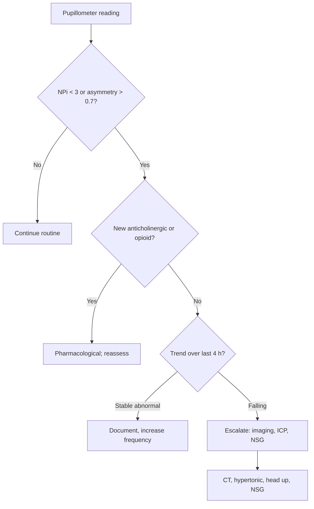

<Callout type="reference">
**Acronyms used on this page**

- **NPi**: Neurological Pupil index (proprietary 0 to 5 score, NeurOptics)
- **CV**: constriction velocity (mm/s)
- **DV**: dilation velocity (mm/s)
- **LAT**: latency (time from stimulus to onset of constriction, ms)
- **MAX / MIN**: maximum (pre-stimulus) and minimum (peak constriction) pupil diameter
- **PLR**: pupillary light reflex
- **CN II / III**: optic nerve / oculomotor nerve
- **ORANGE**: Outcome PRognostication of Acute Brain Injury with the Neurological pupil indeX (multicentre study)
- **TBI / SAH / HIE / AIS**: traumatic / subarachnoid haemorrhage / hypoxic-ischaemic encephalopathy / arterial ischaemic stroke
- **MNM / MMM**: multimodal neuromonitoring / multimodal monitoring
- **ICP / CPP / MAP**: intracranial / cerebral perfusion / mean arterial pressure
</Callout>

<TldrCard>
**The 60-second version.** The handheld pupillometer (NeurOptics NPi-200 / 300 is the dominant device) shines a calibrated infrared light pulse at the pupil and uses a video camera to record the constriction-dilation cycle. From this it computes the **Neurological Pupil index (NPi)**, a 0 to 5 score that integrates constriction velocity, latency, and percentage change. **NPi &lt; 3 is abnormal; NPi &lt; 2 strongly suggests a serious neurological insult; NPi 0 with absent constriction is the bedside surrogate for catastrophic CN III dysfunction.** The pupillometer also yields raw constriction velocity (CV), latency (LAT), dilation velocity (DV), and max/min pupil sizes. **Trend matters more than single value**: a falling NPi over hours in a TBI or SAH patient is an early warning that often precedes clinical herniation by 6 to 24 hours. Pediatric data are growing (Freeman 2020, Kerscher 2023, Jiang 2023, Kirschen 2025).
</TldrCard>

## 1. Bedside vignettes: why this matters in the PICU

### Vignette A. The 9-year-old TBI on Q1 hour pupil checks

A 9-year-old is admitted with severe TBI after a fall, ICP monitor in place, GCS 6T. The bedside flow sheet shows hourly pen-torch pupillary exams (4 mm bilateral, brisk) for 8 hours. The pupillometer is added to the routine at hour 9. The first NPi readings are 4.2 on the right, 4.1 on the left, normal. Six hours later: right NPi 3.1, left NPi 4.0 (asymmetry > 0.7 is abnormal even when both are above 3). The clinical pen-torch exam still reads "4 mm bilateral, brisk." An urgent CT shows new right uncal swelling and early midline shift. The team hyperosmolises and accelerates the decompressive craniectomy decision. **The pupillometer caught it before the eye did.** <Cite id="oddo2018_npi_orange" /> <Cite id="oddo2023orange" />

### Vignette B. The 5-year-old after cardiac arrest, day 3

A 5-year-old is on day 3 after an out-of-hospital arrest, normothermic, sedation off. Bilateral NPi = 0 with absent constriction velocity, latency unrecordable. Bedside FOUR score = 1 (motor only, extensor). SSEP shows bilateral absent N20. MRI shows diffuse cortical and basal ganglia injury. The multimodal prognostication framework (NPi + FOUR + SSEP + MRI + 72 h post-arrest timing) supports the conversation with the family about prognosis. **No single number, including NPi 0, is enough by itself**; the value of the pupillometer here is one quantitatively reliable leg of the multimodal prognostication stool. <Cite id="oddo2025_pupillometry_arrest" /> <Cite id="topjian2021aha_pediatric" />

### Vignette C. The 2-month-old with normal NPi and dilated pupils on hyoscine

A 2-month-old with bronchiolitis is on a high-dose hyoscine patch for secretions and on a one-time dose of glycopyrrolate before fundoscopy. Hours later her pupils measure 6 mm bilateral and "non-reactive" on pen-torch. The team panics, calling neurology. The pupillometer reads: max pupil 6.2 mm, min 6.0 mm, CV 0.0 mm/s, NPi 0. But the brainstem reflexes (corneals, cough, gag) are intact, the GCS is at her pre-illness baseline, and there is no other concerning sign. **NPi 0 from pharmacological mydriasis looks identical to NPi 0 from CN III failure.** Always interrogate the drug list before interpreting a flat pupillometer trace. <Cite id="freeman2020_pediatric_pupil" />

---

## 2. What pupillometry is, and what it is not

The pupillometer is a handheld infrared video camera that delivers a calibrated light pulse (typically 1000 lux, 0.8 s) to the pupil and records the diameter at high frame rate (30 to 60 fps) for the constriction and dilation phases. The device extracts:

- **Maximum pupil diameter (MAX)**: pre-stimulus baseline, in mm.
- **Minimum pupil diameter (MIN)**: peak constriction, in mm.
- **Percent change (% CH)**: (MAX − MIN) / MAX × 100.
- **Constriction velocity (CV)**: average rate of constriction in mm/s.
- **Latency (LAT)**: time from stimulus onset to start of constriction, in ms.
- **Dilation velocity (DV)**: average rate of return to baseline, in mm/s.
- **Neurological Pupil index (NPi)**: a proprietary algorithm that combines the above into a single 0 to 5 score with reference to a healthy-population model.

**The NPi is not the same as constriction velocity, and the two move independently.** A blown CN III pupil shows NPi 0 with CV 0; a healthy pupil shows NPi 4 to 5 with CV ~1 to 2 mm/s; an early-warning pupil with subtle CN III compromise may show NPi 2.5 to 3.0 with CV slightly reduced and LAT slightly prolonged before the pen-torch exam picks up anything. The 0.7 unit asymmetry threshold is the most sensitive single signal of unilateral early uncal herniation.

**Two things follow.**

**Pupillometry quantifies what your pen-torch already does.** The pen-torch returns "brisk / sluggish / fixed" with moderate inter-rater agreement (kappa ~0.4 to 0.6). The pupillometer returns continuous numbers with near-zero inter-rater variability (kappa > 0.9). The qualitative-to-quantitative move is the single biggest reason to add a pupillometer to your unit. <Cite id="olson2016npi" />

**The NPi is calibrated against an adult healthy population.** Pediatric reference data (Freeman 2020, Kerscher 2023, Jiang 2023, Kirschen 2025) suggest the adult thresholds (NPi < 3 abnormal) hold reasonably in children > 1 month, but normative ranges in neonates and preterm infants are different and a "low" NPi in the first weeks of life may not have the same prognostic weight. <Cite id="freeman2020_pediatric_pupil" /> <Cite id="kerscher2023_npi" />

<Pearl>
**Trend over absolute.** A single NPi of 3.2 in a stable post-op patient is reassurance. A series of NPi values trending 4.1 → 3.8 → 3.5 → 3.2 over 4 hours in a TBI patient on the same observer's measurements is a deteriorating exam, even though all four numbers are technically "normal" by some thresholds. The pupillometer is at its best when it is used routinely (Q1 to Q4 hour), not as a one-off curiosity.
</Pearl>

<Pediatric>
**Pediatric normative data are still maturing.** Freeman 2020 reported pediatric NPi 95% reference range 3.2 to 4.7 in healthy children, similar to adult ranges. Kerscher 2023 confirmed the abnormal threshold (NPi < 3) in pediatric TBI. **Neonatal pupillometry is investigational** (small pupils, immature parasympathetic, technical challenges); use only in centres with research protocols. <Cite id="jiang2023npipeds" /> <Cite id="kirschen2025npipeds" />
</Pediatric>

---

## 3. Anatomy and pathway: from light to pupil

<Figure
  src="/images/pupillometry/pupillary-light-reflex.png"
  alt="Diagram of the pupillary light reflex arc: light enters left eye, signal travels via CN II to the optic chiasm, then bilaterally to pretectal nuclei and interneurons to both Edinger-Westphal nuclei in the midbrain, then efferent CN III preganglionic fibres on the dorsal surface to the ciliary ganglion, then short ciliary nerves to the iris sphincter producing both direct and consensual constriction. Tentorial edge warning marker indicates the uncal herniation lesion site. Header shows the full pathway sequence."
  caption="The pupillary light reflex arc. Afferent: retina → CN II → chiasm → pretectal nucleus → interneurons → Edinger-Westphal nucleus. Efferent: CN III (preganglionic, on the dorsal surface) → ciliary ganglion → short ciliary nerves → iris sphincter. The bilateral pretectal-EW relay explains the consensual reflex (light in one eye constricts the contralateral pupil via the intact contralateral arc). Uncal herniation compresses CN III at the tentorial edge; parasympathetic fibres run on the dorsal surface and fail first, producing an ipsilateral fixed dilated pupil with absent direct and consensual reflex on the affected side. (Light to the unaffected eye: both pupils still constrict via the intact contralateral arc.)"
  attribution="MNM-Edu, original schematic. Standard neuroanatomy of the pupillary reflex arc."
  label="Fig. 1"
/>

The pupillary light reflex traverses a four-neuron arc.

1. **Afferent (CN II)**: retinal ganglion cells → optic nerve → optic chiasm → optic tract → pretectal nuclei of the midbrain.
2. **Inter-neuron**: pretectal nucleus → bilateral Edinger-Westphal nuclei (which is why the consensual response exists).
3. **Efferent parasympathetic (CN III)**: Edinger-Westphal nucleus → CN III preganglionic fibres → ciliary ganglion → short ciliary nerves → iris sphincter (constriction).
4. **Efferent sympathetic**: descending hypothalamic → ciliospinal centre (C8 to T2) → superior cervical ganglion → long ciliary nerves → iris dilator (dilation, also opposed when constriction is forced by light).

**Where the lesion sits determines the pupillometer pattern.**

| Lesion site | NPi | CV | LAT | Asymmetry |
|---|---|---|---|---|
| Optic nerve (CN II) | Slightly low | Reduced afferent gain | Normal | Direct affected only, consensual preserved (Marcus Gunn) |
| Midbrain pretectum | Variable | Reduced | Normal | Bilateral |
| Edinger-Westphal / CN III nucleus | Low to 0 | Low to 0 | Prolonged | Often bilateral with progression |
| CN III axonal compression (uncal herniation) | Falls before pen-torch picks up | Falls early | Lengthens | **Unilateral, then bilateral as herniation worsens** |
| Ciliary ganglion / parasympathetic axons | Low | Low | Prolonged | Often unilateral (Adie's, surgical) |
| Pharmacological mydriasis | 0 if anticholinergic | 0 | unrecordable | Bilateral if systemic; unilateral if topical |

This anatomy is why **a unilateral falling NPi in a TBI patient is the bedside signature of evolving uncal herniation hours before the pen-torch sees it**. The pupillometer detects subtle CV reduction and LAT prolongation while the visual estimate of "pupil size and reactivity" still reads normal. <Cite id="petrosino2025orange" />

---

## 4. The signal: what a typical NPi waveform looks like

<Figure
  caption="Anatomy of a single pupillometer measurement. Pre-stimulus baseline records MAX (mm). The light pulse begins at t = 0; after a brief latency (LAT, normal 200 to 300 ms) the pupil begins to constrict at velocity CV (normal ~1 to 2 mm/s) to MIN (peak constriction). The pupil then re-dilates at DV (normal ~0.5 to 1.0 mm/s) back toward baseline over 2 to 4 s. The proprietary NPi algorithm combines % change, CV, LAT, and DV with a reference dataset to return a 0 to 5 score."
  attribution="MNM-Edu schematic. SVG placeholder."
  label="Fig. 2"
>
  <WidgetEmbed name="PupilTrainer" />
</Figure>

A normal trace has six readable features.

1. **A stable MAX pre-stimulus baseline**, recorded over ~1 s before the light pulse.
2. **A short latency (200 to 300 ms)** between stimulus onset and the start of constriction. LAT > 350 ms is abnormal.
3. **A brisk constriction phase** at CV ~1 to 2 mm/s. CV < 0.6 mm/s is abnormal.
4. **A deep nadir (MIN)** giving > 10% change from MAX in healthy adults, > 13% in healthy children.
5. **A smooth re-dilation phase** at DV ~0.5 to 1.0 mm/s. Abnormally fast dilation can suggest sympathetic overactivity (sepsis, pain).
6. **A return to baseline** within 3 to 5 s.

In a patient with early uncal herniation, the *latency* and *CV* are usually the first to drift before the MAX, MIN, or % CH show change. This is the basis of the NPi's early-warning utility: it composites these subtle changes into a single trending number.

<Callout type="clinical-pearl">
**Latency is the most sensitive single number on the trace** for evolving CN III dysfunction. A LAT > 350 ms with otherwise normal MAX, MIN, and CV is the earliest pupillometer marker of CN III compromise in some series.
</Callout>

---

## 5. The numbers to record

| Variable | Symbol | What it tells you |
|---|---|---|
| Neurological Pupil index | NPi (0 to 5) | The headline summary score; trend matters more than absolute |
| Constriction velocity | CV (mm/s) | The most physically interpretable number; falls with CN III compromise |
| Latency | LAT (ms) | Often the earliest sign of subtle compromise |
| Maximum diameter | MAX (mm) | Pre-stimulus baseline; rises with sympathetic activation or anticholinergics |
| Minimum diameter | MIN (mm) | Depth of constriction; reflects functional sphincter mass |
| Percent change | % CH | (MAX − MIN) / MAX × 100; alternative summary measure |
| Dilation velocity | DV (mm/s) | Re-dilation kinetics; fast DV suggests sympathetic overactivity |
| Asymmetry | Δ NPi, Δ CV between sides | **Asymmetry > 0.7 in NPi is abnormal even if both sides are individually within range** |

Record both sides, every time, in the same order. Most units document the trend graphically on the bedside chart alongside ICP, CPP, and GCS.

---

## 6. What is normal? Age-banded reference values

| Age | NPi (mean, 95% CI) | CV (mean, mm/s) | LAT (ms) | MAX (mm, ambient) |
|---|---|---|---|---|
| Preterm (&lt; 37 wk) | research only; not validated | n/a | n/a | n/a |
| Term newborn | research only; small numbers | n/a | n/a | 2.0 to 3.5 |
| 1 to 6 months | 3.0 to 4.5 (very limited data) | ~1.0 | 250 to 350 | 2.5 to 4.0 |
| 6 months to 2 years | 3.5 to 4.7 | 1.0 to 1.5 | 220 to 320 | 3.0 to 4.5 |
| 2 to 12 years | 3.5 to 4.8 | 1.2 to 1.8 | 200 to 300 | 3.5 to 5.5 |
| Adolescents and adults | 3.5 to 4.7 | 1.0 to 2.0 | 200 to 300 | 3.0 to 6.0 |

Sources: <Cite id="freeman2020_pediatric_pupil" /> <Cite id="kerscher2023_npi" /> <Cite id="jiang2023npipeds" /> <Cite id="kirschen2025npipeds" /> <Cite id="olson2016npi" />. Pediatric data are still emerging; the adult thresholds (NPi < 3 abnormal, < 2 strongly abnormal) appear to hold for children > 6 months.

<Pediatric>
**Three child-specific calibrations.**
1. **Sleeping infants have small, slowly-reactive pupils** that may read "abnormal" by adult criteria. Always document state (awake / asleep / sedated) at the time of measurement.
2. **Eye colour and iris pigmentation** affect both visual estimate and infrared video; the pupillometer is more robust to pigmentation than the pen-torch but is not immune.
3. **A toddler will fight you.** Brief, single-pass measurements with the eyecup held gently are better than prolonged attempts; let the parent be present.
</Pediatric>

---

## 7. What is abnormal? Pattern library

<Figure
  caption="Six pupillometer patterns side by side. (a) Normal: NPi ~4.5, CV ~1.5, brisk constriction and re-dilation. (b) Sluggish (NPi 2 to 3, CV 0.5 to 1.0): early CN III compromise; recheck in 1 h. (c) Fixed (NPi 0, CV 0): catastrophic CN III dysfunction or pharmacological mydriasis. (d) Asymmetric (right NPi 3.0, left NPi 4.2; ΔNPi 1.2): evolving unilateral uncal herniation, recheck CT. (e) Falling trend (NPi 4.1 → 3.5 → 2.8 over 4 h): subacute deterioration; act. (f) Bilateral pinpoint with intact NPi: opioid effect or pontine lesion."
  attribution="MNM-Edu, original schematic. SVG placeholder."
  label="Fig. 3"
>
  <WidgetEmbed name="PupilTrainer" />
</Figure>

| Pattern | Bedside meaning | What to do |
|---|---|---|
| NPi 3.5 to 5, symmetric | Normal | Continue routine |
| NPi 2 to 3, symmetric | Sluggish; subtle compromise OR sedation effect | Recheck in 1 h; verify sedation contribution |
| **NPi &lt; 2 either side** | Strongly abnormal | Imaging; consider escalation |
| NPi 0 with absent CV | Functional CN III absent (structural or pharmacological) | Interrogate drug list; structural workup if unexplained |
| **Asymmetry Δ NPi &gt; 0.7** | Unilateral pathology evolving | Recheck CT; consider lateralising lesion |
| **Falling NPi trend (Δ &gt; 0.5 over 4 h)** | Subacute deterioration | Recheck imaging and labs; escalate |
| NPi normal but CV very low | Subtle parasympathetic compromise | Trend; pair with exam |
| MAX large, CV low, LAT prolonged | Anticholinergic effect (atropine, scopolamine, ipratropium) | Drug review; expect recovery |
| MAX small, CV normal, NPi normal | Opioid or pontine lesion | Clinical correlation |

### Decision tree: "what is the NPi telling me?"

---

## 8. Try it: interactive widgets

<WidgetEmbed name="PupilTrainer" />

---

## 9. Pupillometry-driven management

The pupillometer does not titrate a single drug or pressure on its own. It triggers *decisions*.

### 9.1 ICP and CPP

A falling NPi in a TBI patient with an ICP monitor in place forces a recheck of ICP, CPP, sedation, head position, PaCO2, temperature, and serum sodium. A falling NPi in a patient *without* a monitor strongly justifies placing one (or, at minimum, urgent imaging).

### 9.2 Hyperosmolar therapy

A falling NPi with an ICP > 22 mmHg (older children, pediatric BTF threshold) supports an immediate hypertonic saline or mannitol bolus. The NPi response after osmotherapy can be re-checked at 30 to 60 min: a recovering NPi is reassurance; a continuing fall mandates escalation. <Cite id="kochanek2019_pbtf4" />

### 9.3 Sedation titration

A patient on opioid infusions may have small pupils with preserved NPi; a patient on benzodiazepines may show slightly low NPi (2.5 to 3) without structural cause. Sedation-induced low NPi tends to *recover* with a daily sedation hold; structural low NPi does not. **The daily sedation hold has dual purpose**: it lets the clinical exam and the pupillometer both report on the brain rather than the drug.

### 9.4 Prognostication after cardiac arrest

In the multimodal prognostication framework, persistent NPi 0 bilaterally at 72 h post-arrest, combined with bilateral absent SSEP N20, a markedly suppressed EEG, and diffuse cortical injury on MRI, is strongly associated with poor neurological outcome. **No single modality**, including NPi, is sufficient for prognostication; the framework requires concordance across at least 3 modalities. <Cite id="oddo2025_pupillometry_arrest" /> <Cite id="topjian2021aha_pediatric" />

<Callout type="caveat">
**Teaching, not protocol.** The decision pathways on this page are *teaching* algorithms. Every threshold (NPi 3, asymmetry 0.7, Δ over 4 h) is centre-, age-, and patient-specific. Pair the pupillometer with clinical exam, ICP, NIRS, EEG, and imaging; defer to your unit's protocols and senior clinical team.
</Callout>

<AlgorithmDisclaimer />

---

## 10. Clinical contexts: NPi across acute brain injuries

### 10.1 Severe TBI

The primary published indication for pupillometry. Two registry datasets:

- **ORANGE adult multicentre cohort** (Oddo 2023): NPi < 3 sustained > 1 h was associated with poor outcome (mRS 4 to 6) independently of GCS and CT findings. <Cite id="oddo2023orange" />
- **Petrosino 2025 ORANGE pediatric pilot**: smaller cohort but consistent direction; falling NPi over 6 to 12 h preceded clinical herniation by a median 9 h. <Cite id="petrosino2025orange" />

In pediatric severe TBI, the pupillometer adds quantitative early warning to the BTF / pBTF management bundle. It does not replace ICP monitoring but it is a useful adjunct for the patient whose ICP monitor is delayed. <Cite id="kochanek2019_pbtf4" /> <Cite id="kerscher2023_npi" />

### 10.2 Aneurysmal SAH

NPi is added value in SAH for two reasons. First, early signs of evolving hydrocephalus or rebleed are caught earlier than by pen-torch. Second, in the DCI window (days 3 to 14), a unilateral fall in NPi often precedes the focal neurological deficit that classically defines clinical DCI. Pair with daily TCD and qEEG. <Cite id="hoh2023sah_aha" /> <Cite id="rass2021dci_review" />

### 10.3 Pediatric AIS

In a child receiving thrombectomy or thrombolysis for arterial ischaemic stroke, the pupillometer monitors for post-recanalisation oedema and the rare but devastating hyperperfusion haemorrhage. A new asymmetry > 0.7 or a falling NPi within 24 h of recanalisation triggers BP review and urgent imaging. <Cite id="ferriero2019aha_pedstroke" /> <Cite id="sun2020_pediatric_thrombectomy" />

### 10.4 HIE and post-cardiac arrest

The pupillometer's role here is *prognostic*, not real-time titration. Bilateral NPi 0 at 72 h post-arrest in a normothermic, sedation-free patient is one leg of the multimodal prognostication framework. **Do not prognosticate during hypothermia or in the first 72 hours**; sedation, hypothermia, and metabolic confounders depress NPi reversibly. <Cite id="oddo2025_pupillometry_arrest" /> <Cite id="topjian2021aha_pediatric" />

### 10.5 Pediatric ECMO

VA-ECMO carries 5 to 15% risk of acute neurological injury (stroke, ICH, anoxic brain injury). Daily pupillometry is part of the ELSO neurological surveillance bundle. A new asymmetry > 0.7 or a falling NPi triggers head CT, fontanelle ultrasound, or MRI. The technical challenge: the constant ECMO circuit traffic around the bed and frequent transfers make routine pupillometry harder than in a stable ICU patient. <Cite id="lorusso2017_elso_neuro" /> <Cite id="cho2024_ecmo_outcomes" />

### 10.6 Meningitis and encephalitis

In bacterial meningitis with evolving cerebral oedema or vasculitic vasospasm, the pupillometer can catch early herniation signs in a patient where the clinical exam is depressed by the underlying illness. A falling NPi in this context warrants repeat imaging and consideration of EVD or ICP monitoring. <Cite id="tunkel2017idsa_encephalitis" /> <Cite id="vandebeek2016eu_meningitis" />

### 10.7 Brain-death determination

Pupillometry is *not* a brain-death determination tool by itself. It is, however, a useful adjunct that documents the absence of any constriction response with a number rather than a qualitative descriptor. NPi 0 with CV 0 bilaterally adds quantitative weight to the clinical brain-death exam. Pediatric brain-death criteria still require the standard clinical exam + apnoea test repeated at the age-appropriate interval. <Cite id="nakagawa2011peds_bd" /> <Cite id="wijdicks2005" />

### 10.8 DKA cerebral oedema

A child being rehydrated for DKA whose NPi drops 0.7 or more units between hours 4 and 24 of treatment should prompt cerebral oedema treatment (mannitol or hypertonic saline) regardless of the absolute value. The pupillometer here gives a quantitative early-warning signal that supplements clinical vigilance for headache, vomiting, bradycardia, and hypertension. <Cite id="kuppermann2018_pecarn_dka" /> <Cite id="glaser2024_dka_review" />

### 10.9 Refractory status epilepticus

In a child on continuous infusion (midazolam, pentobarbital, ketamine) for refractory status, pupillometry can detect oversedation (very low NPi, very low CV, slow DV) and titrate downward, especially when EEG burst suppression is the chosen target and the bedside exam is unreliable. <Cite id="glauser2016esett" /> <Cite id="kapur2019eclipse_se" />

---

## 11. Multimodal integration: pupillometry in the MMM/MNM stack

| Pair with… | What you gain | Worked scenario |
|---|---|---|
| **Clinical exam** | Quantitative complement to GCS / FOUR | Pen-torch reads "brisk"; pupillometer catches subtle CV decline |
| **ICP / CPP** | Pupillometer change with stable ICP suggests CN III lesion separate from raised pressure | TBI with stable ICP and new NPi asymmetry: structural workup |
| **CT / MRI** | Pupillometer triggers imaging; imaging refines | New asymmetry > 0.7 → CT shows uncal swelling |
| **TCD** | Two early-warning indices: NPi and PI both rise before clinical herniation | TBI: NPi falling and TCD PI rising signal shared underlying ICP rise |
| **SSEP / EP** | Multimodal prognostication after cardiac arrest | NPi 0 + bilateral absent N20 + suppressed EEG: poor prognosis |
| **EEG / qEEG** | NPi catches structural; EEG catches electrical | SE refractory to first-line: pair NPi with EEG burst pattern |
| **NIRS** | Macrovascular + microvascular + brainstem coverage | Sepsis with rSO2 fall and NPi fall: combined cerebral and brainstem stress |

<Cite id="figaji2025_mmm_pediatric_consensus" /> <Cite id="helbok2024_pediatric_mmm" /> <Cite id="tasker2023mnm" />

---

<DeepDive>

## 12. Setup and technique: a step-by-step

### 12.1 Equipment

- **NeurOptics NPi-200 or NPi-300** handheld pupillometer (the dominant device; proprietary NPi algorithm).
- Single-patient-use eyecups (the soft rubber cushion that holds the device against the orbital rim).
- A docking station to upload measurements to the patient record (or paper logging into the bedside flow sheet).
- A quiet area with controllable ambient light (ambient should be standardised across measurements; the device is reasonably robust to ambient changes but consistency helps).

### 12.2 The measurement (one side)

1. **Identify the patient.** Scan the patient's wristband or enter the patient ID into the device.
2. **Position the patient.** Supine, head neutral, head-of-bed 30°. Eyes open if possible (gently retract the lid if not, but do not press on the globe).
3. **Apply the eyecup.** Single-use; cushion the device against the orbital rim, not pressing on the eyeball. The device automatically aligns the camera to the pupil.
4. **Trigger.** Press the measurement button. The device delivers a 1000 lux, 0.8 s pulse and records the response for 5 s.
5. **Wait for the result.** NPi, CV, LAT, MAX, MIN, DV, % CH appear on screen. The device flags asymmetry > 0.7 automatically if a paired-side reading is in the buffer.
6. **Repeat contralaterally** within 30 s ideally so that ambient and patient conditions are matched.
7. **Document** both sides on the bedside flow sheet alongside other neuro observations.

### 12.3 Frequency

- **Severe TBI**: hourly during the acute window (first 24 to 48 h), then Q2 to Q4 hour as stable.
- **SAH (DCI window)**: Q2 to Q4 hour during days 3 to 14.
- **Post-arrest**: Q4 hour during the prognostication window (24 to 72 h post-rewarming).
- **ECMO**: Q4 to Q6 hour as part of the ELSO neurological surveillance bundle.
- **Stable post-op neuro**: Q4 to Q8 hour or as per local protocol.

### 12.4 What to do with the data

- **Plot the trend.** Most pupillometers can export to the EHR; if not, transcribe NPi and CV onto the bedside chart alongside ICP, CPP, and GCS.
- **Set asymmetry alerts.** Ask nursing to escalate if Δ NPi > 0.7 or single-side NPi < 3 emerge.
- **Pair with clinical exam.** Every pupillometer reading should be paired with a brief documentation of patient state (awake / drowsy / sedated; pupil size estimate; light response by pen-torch).

### 12.5 Pediatric-specific tips

- **Sleeping infants**: try to capture at a similar arousal level each time; document state.
- **Toddler resistance**: enlist the parent; use a brief, single-pass measurement; offer a quick reward if appropriate.
- **Small pupils**: at MAX < 2.5 mm the algorithm may struggle; document and re-measure after pupil natural dilation in dim light.
- **Eyelid swelling / orbital trauma**: may preclude measurement; document the reason rather than recording a spurious low NPi.

### 12.6 Calibration and quality control

- The device self-calibrates on power-up; no daily user calibration required.
- Replace the eyecup between patients and clean per manufacturer guidance.
- Annual servicing is recommended; check the device clock and software version periodically.

</DeepDive>

---

## 13. Pitfalls

- **Pharmacological mydriasis** (atropine, scopolamine, nebulised ipratropium drift, post-fundoscopic dilating drops) creates NPi 0 in an otherwise neurologically intact patient. Always interrogate the drug list.
- **Opioids constrict the pupil** but preserve the reflex; pinpoint pupils with NPi 4 to 5 are normal on opioid.
- **Sedation depresses NPi by ~0.5 to 1 unit**, more with deep benzodiazepine or propofol. Document sedation status with every measurement.
- **Hypothermia depresses NPi**; do not prognosticate during therapeutic hypothermia.
- **Ambient light variation**: NPi is reasonably robust but extreme bright vs dark conditions shift readings; aim for consistent room conditions.
- **Pre-existing anisocoria** (Adie's, post-surgical iris, congenital) gives baseline asymmetry; document on admission.
- **NPi 0 in a patient with intact corneals and gag** is more likely pharmacological or local (Adie's, eye trauma) than catastrophic CN III dysfunction; clinical correlation always.
- **Neonates and small preterm infants**: data are sparse, normative ranges different; treat as investigational.
- **Operator-eyecup contact pressure**: pressing too hard on the globe can transiently raise IOP and alter the reflex; rest the eyecup, do not press.
- **Spurious asymmetry from probe misalignment**: a single asymmetric reading should be confirmed within 5 min before triggering escalation.

---

## 14. Combine with…

- [Clinical exam, GCS, FOUR](/modalities/clinical-exam/): the pupillometer is the quantitative complement to the pen-torch.
- [ICP](/modalities/icp/): structural raised pressure as the underlying driver of NPi drop.
- [TCD](/modalities/tcd/): pairs PI and NPi as twin early-warning indices for evolving ICP rise.
- [EEG](/modalities/eeg/): structural NPi + electrical EEG in multimodal prognostication.
- [Evoked potentials](/modalities/evoked-potentials/): SSEP N20 + NPi in post-arrest prognostication.
- [Foundations: brainstem anatomy](/foundations/monro-kellie/): the parasympathetic CN III pathway as the substrate.

---

<DeepDive>

## 15. Evidence summary

| Topic | Source | Grade |
|---|---|---|
| NPi original validation (NeurOptics) | <Cite id="olson2016npi" /> | B |
| Pediatric NPi normative data | <Cite id="freeman2020_pediatric_pupil" /> | C |
| Pediatric NPi in TBI | <Cite id="kerscher2023_npi" /> | C |
| Pediatric pupillometry recent | <Cite id="jiang2023npipeds" /> <Cite id="kirschen2025npipeds" /> | C |
| ORANGE adult multicentre cohort | <Cite id="oddo2018_npi_orange" /> <Cite id="oddo2023orange" /> | A |
| ORANGE pediatric pilot | <Cite id="petrosino2025orange" /> | C |
| Pupillometry after cardiac arrest | <Cite id="oddo2025_pupillometry_arrest" /> | B |
| AHA pediatric post-arrest prognostication | <Cite id="topjian2021aha_pediatric" /> | expert |
| Pediatric MMM consensus | <Cite id="figaji2025_mmm_pediatric_consensus" /> <Cite id="helbok2024_pediatric_mmm" /> | expert |
| Pediatric BTF guidelines | <Cite id="kochanek2019_pbtf4" /> | expert |

## 16. Recent literature (2022 to 2025)

- **Oddo 2023 (ORANGE)**: 514-patient adult multicentre cohort showing NPi < 3 sustained > 1 h independently predicts poor outcome (mRS 4 to 6) after acute brain injury. <Cite id="oddo2023orange" />
- **Kerscher 2023**: pediatric TBI cohort confirming the NPi < 3 threshold as abnormal in children. <Cite id="kerscher2023_npi" />
- **Jiang 2023**: pediatric NPi normative dataset, comparable to adult ranges from 6 months upward. <Cite id="jiang2023npipeds" />
- **Petrosino 2025 (ORANGE-Peds pilot)**: pediatric TBI pilot data showing falling NPi precedes clinical herniation by a median 9 h. <Cite id="petrosino2025orange" />
- **Oddo 2025 (pupillometry post-arrest)**: confirms persistent NPi 0 at 72 h post-arrest as one leg of multimodal prognostication; *not* sufficient alone. <Cite id="oddo2025_pupillometry_arrest" />
- **Kirschen 2025**: pediatric NPi in post-arrest prognostication, expanding the evidence base in children. <Cite id="kirschen2025npipeds" />

</DeepDive>

---

## 17. Self-check

<Quiz
  questions={[
    {
      id: 'q1',
      prompt: 'A 9-year-old with severe TBI on ICP monitoring has hourly pupillometry. Over 4 h, right NPi trends 4.2 → 3.8 → 3.4 → 3.0; left NPi 4.1 → 4.0 → 4.0 → 3.9. Pen-torch reads "4 mm bilateral, brisk" each time. ICP is stable at 18 mmHg. Most appropriate next step?',
      options: [
        { id: 'a', label: 'Reassure: pen-torch normal, ICP within range, continue hourly checks' },
        { id: 'b', label: 'Order an urgent CT and notify neurosurgery: asymmetry > 0.7 with falling unilateral trend' },
        { id: 'c', label: 'Increase sedation: NPi is falling because of pain' },
        { id: 'd', label: 'Repeat NPi in 4 h; current values are within "abnormal" but not "strongly abnormal"' },
      ],
      answer: 'b',
      explanation: 'The asymmetry (Δ NPi = 0.9 at the last reading) plus the falling trend on one side over 4 h is the classic pupillometer signature of evolving unilateral uncal herniation, often picked up before the pen-torch can detect a difference. The pen-torch "brisk bilateral" is the false reassurance the pupillometer is designed to overcome. Stable ICP does not exclude focal mass effect with early CN III compression. Urgent CT and neurosurgical alert are the correct next steps. Increasing sedation does not depress NPi unilaterally.',
    },
    {
      id: 'q2',
      prompt: 'A 4-year-old with refractory bronchiolitis is on a scopolamine patch and nebulised ipratropium. The bedside nurse calls because her pupils are now 6 mm bilateral, non-reactive on pen-torch. NPi 0 bilateral, CV 0, MAX 6.2 mm. Brainstem reflexes (corneals, cough, gag) are intact; GCS at her pre-illness baseline. Most appropriate interpretation?',
      options: [
        { id: 'a', label: 'Brainstem death is highly likely; arrange ancillary testing' },
        { id: 'b', label: 'Pharmacological mydriasis from anticholinergics; reassess after drug effect wanes' },
        { id: 'c', label: 'Tentorial herniation; emergent hyperosmolar therapy' },
        { id: 'd', label: 'Bilateral CN III lesion; urgent imaging' },
      ],
      answer: 'b',
      explanation: 'NPi 0 from anticholinergic exposure is identical on the pupillometer to NPi 0 from structural CN III dysfunction. The differentiator is the rest of the exam: intact brainstem reflexes (corneal, cough, gag), preserved GCS, no other concerning sign, and a clear pharmacological exposure (scopolamine + ipratropium, both anticholinergic). Always interrogate the drug list before interpreting a flat pupillometer trace; failure to do so triggers expensive and unnecessary imaging and panicked family conversations.',
    },
    {
      id: 'q3',
      prompt: 'A 6-year-old at 72 h post-cardiac arrest, normothermic, sedation off for 12 h. Bilateral NPi 0, absent CV, FOUR score 1 (extensor only). EEG markedly suppressed; SSEP shows bilateral absent N20s. MRI shows diffuse cortical and basal-ganglia injury. Most appropriate framing for the family conversation?',
      options: [
        { id: 'a', label: 'Brain death; proceed to apnoea testing now' },
        { id: 'b', label: 'Poor neurological prognosis supported by concordant multimodal findings; multidisciplinary discussion including palliative input' },
        { id: 'c', label: 'Uncertain prognosis; wait another 72 h before discussing outcome' },
        { id: 'd', label: 'Likely good recovery given pediatric neuroplasticity; pursue full rehabilitation planning' },
      ],
      answer: 'b',
      explanation: 'The combination of NPi 0, FOUR 1, suppressed EEG, absent SSEP N20s, and diffuse injury on MRI at 72 h post-rewarming represents the multimodal concordance required for a high-confidence poor-prognosis conversation per AHA pediatric post-arrest guidelines. Brain death requires a formal protocol with apnoea testing and confounder exclusion, not just exam findings. The framework is multimodal prognostication informing family discussion, not single-modality WLST. Pediatric neuroplasticity is real but does not rescue diffuse cortical and deep grey injury of this severity.',
    },
  ]}
/>
