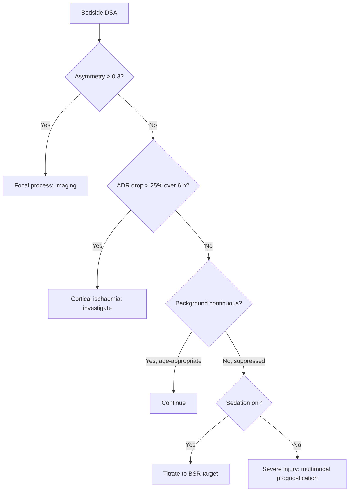

<Callout type="reference">
**Acronyms used on this page**

- **EEG**: electroencephalography (the raw signal)
- **cEEG**: continuous EEG (typically &gt; 24 h recording)
- **qEEG**: quantitative EEG (data-reduction visualisations and metrics on top of cEEG)
- **ADR**: alpha-delta ratio = power in 8 to 13 Hz / power in 1 to 4 Hz
- **PSI**: power suppression index (proportion of time below an amplitude threshold)
- **BSR**: burst suppression ratio (proportion of time spent in suppression)
- **SEF95**: spectral edge frequency 95% (frequency below which 95% of power lies)
- **DSA**: density spectral array (time-frequency colour map per channel)
- **CSA**: compressed spectral array (older 3D-style version of DSA)
- **DCI**: delayed cerebral ischaemia (post-SAH complication)
- **NCSE**: non-convulsive status epilepticus
- **SAH / TBI / HIE / SE**: subarachnoid haemorrhage / traumatic / hypoxic-ischaemic / status epilepticus
- **ACNS**: American Clinical Neurophysiology Society
</Callout>

<TldrCard>
**The 60-second version.** qEEG is the data-reduction layer that sits on top of continuous EEG and gives a non-neurophysiologist trends they can read at the bedside. Key derived metrics are the **density spectral array (DSA)** colour map, **alpha-delta ratio (ADR)** for cortical-ischaemia detection (most validated in SAH-DCI), **suppression burst ratio (BSR)** for sedation depth and post-arrest prognosis, **total power** for the all-on / all-off signal, and **asymmetry** for unilateral injury. qEEG does **not** replace expert raw-EEG review; it amplifies its bedside value. **The most useful single trend for the PICU is the ADR**, where a 25 to 50% drop over 6 hours in SAH precedes clinical DCI by 12 to 48 hours in registry data (Claassen 2004, Sandsmark 2024). qEEG requires a multi-channel EEG (8 to 21 electrodes typically) and adequate skin preparation; the artefact penalty for shortcuts is high.
</TldrCard>

## 1. Bedside vignettes: why this matters in the PICU

### Vignette A. SAH day 6, ADR falling

A 14-year-old is on day 6 after a ruptured AVM with secondary SAH. The clinical exam is unchanged, the daily TCD is borderline (MFV 140, Lindegaard 2.8), and ICP is well controlled. The cEEG / qEEG technologist updates the DSA: over the last 6 hours, the right hemisphere ADR has fallen from 0.42 to 0.28, a 33% drop. Total power on the right is stable; the asymmetry index has crossed the 0.3 alert threshold. There is no overt clinical sign. The team escalates: triple-H haemodynamics, repeat CT angio, and decision-prep for endovascular treatment. **The qEEG caught the ischaemic signature 12 hours before the next angio confirmed early vasospasm progression.** <Cite id="claassen2004" /> <Cite id="sandsmark2024_qeeg_dci" />

### Vignette B. Neonatal seizure burden on cEEG / qEEG

A 5-day-old term infant with HIE on day 3 of normothermic rewarming is on cEEG. The bedside DSA shows three discrete bright vertical "fingers" (each 2 to 4 minutes long) over the last hour, occupying about 20% of the trace. The amplitude-integrated EEG (aEEG) trace shows abrupt elevations in the upper margin during the same intervals. These are electrographic seizures, recurrent and meeting the ACNS quantitative definition of neonatal status epilepticus (> 50% of any 1 h epoch). Treatment is escalated from phenobarbital to phenytoin then to midazolam infusion with bedside DSA / aEEG endpoints. <Cite id="pressler2017neonatal" /> <Cite id="sansevere2023_neonatal_ceeg" />

### Vignette C. Sedated TBI with paradoxically high ADR

A 12-year-old with severe TBI is on continuous midazolam and fentanyl, ICP 18 mmHg, BIS 35. The cEEG is markedly suppressed with intermittent bursts. The bedside DSA shows a fairly bright "alpha band" (8 to 13 Hz) at all leads, and the ADR is 0.6 (high). The neurophysiologist explains: this is *not* preserved alpha-rhythm-of-arousal, but a sedative-induced anterior alpha pattern (propofol- and benzodiazepine-induced frontal alpha), and the ADR here is uninformative about cortical metabolism. **qEEG values must always be interpreted with knowledge of sedation, age, and the raw EEG context.** <Cite id="foreman2022" /> <Cite id="herman2015acns_ceeg" />

---

## 2. What qEEG is, and what it is not

Continuous EEG (cEEG) generates roughly 24 channels × 256 Hz × 86,400 s = ~500 million samples per day. A neurophysiologist cannot scan this volume of raw EEG continuously, and a bedside nurse or intensivist usually cannot read raw EEG at all. **qEEG is the family of data-reduction algorithms that turn this firehose into a manageable, trendable bedside display.**

**The key qEEG outputs.**

- **DSA (density spectral array)**: a colour-coded time-frequency map per channel. Time on the x-axis (typically the last 6 to 24 h), frequency on the y-axis (0 to 30 Hz), power encoded as colour intensity. The single most useful qEEG display.
- **ADR (alpha-delta ratio)**: instantaneous ratio of 8 to 13 Hz power to 1 to 4 Hz power. Falls with cortical ischaemia (alpha disappears, delta predominates). The most validated qEEG metric for DCI detection in SAH.
- **BSR (burst suppression ratio) / PSI (power suppression index)**: proportion of time spent in low-amplitude suppression. Used for sedation titration (BSR 30 to 60% is a common target in pentobarbital coma) and post-arrest prognostication.
- **Total power**: amplitude in microvolts across the whole spectrum. Falls during global ischaemia or deep sedation.
- **Asymmetry index**: difference in spectral power between the hemispheres; rises with unilateral lesion or ischaemia.
- **SEF95**: frequency below which 95% of power lies; falls in slowed EEG (sedation, encephalopathy, ischaemia).

**Three things follow.**

**qEEG does not replace raw EEG review.** Artefact (chewing, sweat, electrode pop, infusion-pump 60 Hz noise) can dominate qEEG metrics. A neurophysiologist must validate the raw trace at least daily and flag artefacts. qEEG metrics in isolation can mislead. <Cite id="herman2015acns_ceeg" /> <Cite id="hirsch2021acns" />

**qEEG amplifies what raw EEG already shows.** The DSA reveals trends (slow drift in ADR, asymmetry building over hours, recurrence of seizures in the night) that are invisible to short single-snapshot raw-EEG reads.

**Pediatric qEEG requires pediatric-aware interpretation.** Normal pediatric EEG is faster (alpha frequency rises through childhood, peaking at ~10 Hz by mid-school age), so the "alpha band" in a 6-month-old is centred lower than in a 12-year-old. Suppression patterns and burst morphology also differ. <Cite id="tsuchida2013neonatal" /> <Cite id="sansevere2023_neonatal_ceeg" />

<Pearl>
**ADR is the most useful single qEEG metric in the PICU.** A 25 to 50% drop in ADR over 6 hours, sustained, in a patient with SAH, severe TBI, or any acute ischaemic risk, is a strong signal to look harder (clinical exam, TCD, imaging). The single absolute value is less informative than the trend.
</Pearl>

<Pediatric>
**Pediatric cEEG / qEEG is the standard of care for neonatal seizure surveillance** (ACNS 2021 guidelines). All neonates at risk (HIE, suspected encephalopathy, post-cardiac surgery, post-arrest) should have cEEG with qEEG / aEEG bedside displays for at least 24 hours. <Cite id="herman2015acns_ceeg" /> <Cite id="pressler2017neonatal" /> <Cite id="sansevere2023_neonatal_ceeg" />
</Pediatric>

---

## 3. Anatomy and montage: the substrate of qEEG

<Figure
  caption="Standard pediatric 10 to 20 montage with bipolar chains (Cz reference) and density spectral array preview. Bipolar montage on the left: Fp1-F3, F3-C3, C3-P3, P3-O1 (left chain) and analogous right chain; transverse and circumferential chains add detail. Each channel feeds a continuous time-frequency analysis (FFT or short-time Fourier or wavelet) to produce its own DSA row. The composite DSA on the right shows ~24 channels stacked, with time on x and frequency on y per channel; bright vertical bands are recurrent seizures, gradual loss of high frequencies is encephalopathy, hemispheric asymmetry is left-vs-right colour difference."
  attribution="MNM-Edu, original schematic. SVG placeholder."
  label="Fig. 1"
>
  <WidgetEmbed name="EEGPatternLibrary" />
</Figure>

The qEEG display sits on top of a properly placed multi-channel EEG. Three practical layers:

1. **Electrode placement**: international 10-20 system (or 10-10 in research / refractory work). Most pediatric ICU recordings use 16 to 21 electrodes. Neonatal montages often use a reduced "neonatal montage" (~10 electrodes) per ACNS 2013 guidelines. <Cite id="tsuchida2013neonatal" />
2. **Reference**: a reference electrode is needed for monopolar montages (Cz / linked-ears / average reference). Bipolar montages subtract adjacent pairs and are reference-independent.
3. **Computation**: the qEEG software computes the desired metrics (DSA, ADR, BSR, SEF, asymmetry) in 2 to 10 s epochs and updates the display in near real time.

**Skin preparation is the single biggest determinant of trace quality.** Electrode impedance < 5 kΩ at every channel is the goal. Sub-optimal prep gives artefact-laden traces whose qEEG metrics are uninterpretable.

---

## 4. The DSA: anatomy of a spectrogram

<Figure
  src="/images/qeeg/qeeg-spectrogram.svg"
  alt="Spectrogram showing alpha-delta ratio drop preceding DCI; suppression burst index"
  caption="A 12-hour density spectral array (DSA) of a SAH day 6 patient. X-axis: time. Y-axis per channel: frequency 0 to 25 Hz. Colour: log power. Top panels show the right hemisphere; bottom show left. At hour 0, both hemispheres show moderate alpha (8 to 13 Hz, yellow band) and modest delta (1 to 4 Hz). By hour 6, the right hemisphere alpha has dimmed, delta has risen, and the ADR has fallen from 0.42 to 0.28; the left is stable at 0.40. By hour 9, the right ADR is 0.22 and the asymmetry has crossed the alert threshold of 0.3. Confirmatory TCD and angio follow."
  attribution="MNM-Edu, original schematic. SVG placeholder."
  label="Fig. 2"
/>

How to read a DSA at the bedside.

1. **Look at the colour gradient**: bright yellow / red = high power, dark blue = low power.
2. **Bands of horizontal colour** correspond to dominant frequency bands. A bright band at 8 to 13 Hz is alpha, 4 to 7 Hz is theta, 1 to 4 Hz is delta, 13 to 30 Hz is beta.
3. **Vertical bright stripes** are typically seizures (rhythmic activity across all frequencies for a short time).
4. **Slow drift in colour over hours** is the most diagnostically interesting signal: a gradual loss of high-frequency colour is encephalopathy; a gradual asymmetry building over hours is unilateral ischaemia; a recovering bright alpha band post-arrest is reassuring.
5. **Asymmetry between hemispheric panels** is the focal-ischaemia signal.

**The four common qEEG metrics on a single screen.**

| Metric | What it tracks | Normal | Abnormal |
|---|---|---|---|
| ADR | Cortical metabolism / arousal | 0.4 to 0.6 (awake adult) | &lt; 0.3, or 25 to 50% drop over 6 h |
| BSR / PSI | Burst suppression / sedation depth | 0% | 30 to 60% (target for pentobarbital coma); &gt; 80% post-arrest = poor prognosis |
| Total power | Global EEG amplitude | Age-band specific | &lt; 5 µV² = severe suppression |
| Asymmetry | Hemispheric difference | &lt; 0.2 | &gt; 0.3 |

---

## 5. The numbers: what to record at the bedside

| Variable | Symbol | What it tells you |
|---|---|---|
| Alpha-delta ratio | ADR (per side) | Cortical metabolism, ischaemia detection |
| Suppression / burst suppression ratio | BSR or PSI (%) | Sedation depth; post-arrest prognosis |
| Total spectral power | TSP (µV²) | Global EEG amplitude |
| Spectral edge frequency 95% | SEF95 (Hz) | Median frequency; falls with sedation, encephalopathy |
| Asymmetry index | ASI | Hemispheric difference (focal ischaemia, focal seizures) |
| Seizure burden | % of time with seizures | Treatment endpoint in SE |
| Background continuity | Continuous / discontinuous / suppression | Post-arrest prognosis |
| Reactivity | Background change with stimulation | Post-arrest prognosis (intact reactivity = better) |

The headline display is the DSA. The bedside flow sheet adds the derived numbers (ADR, BSR, asymmetry) at hourly intervals or at clinically defined epochs. The full report (with raw EEG review by neurophysiology) is daily or twice-daily.

---

## 6. What is normal? Age-banded reference patterns

| Age | Dominant background | ADR (awake) | BSR (untreated, awake) |
|---|---|---|---|
| Preterm (28 to 32 wk) | Discontinuous, mostly delta | n/a (alpha not yet developed) | High discontinuity is age-appropriate |
| Term newborn (38 to 42 wk) | Active sleep continuous mixed delta/theta; quiet sleep tracé alternant | n/a | ~10 to 30% in tracé alternant (age-appropriate) |
| 1 to 3 months | Continuous delta-theta in wake; tracé alternant fading | n/a | 0% |
| 3 to 12 months | Posterior dominant rhythm ~4 to 6 Hz in occipital | 0.2 to 0.4 | 0% |
| 1 to 3 years | PDR ~6 to 8 Hz | 0.3 to 0.5 | 0% |
| 4 to 8 years | PDR ~8 Hz | 0.4 to 0.6 | 0% |
| 9 to 18 years | PDR ~9 to 10 Hz (adult by mid-school age) | 0.5 to 0.7 | 0% |
| Adult | Alpha 8 to 12 Hz, occipital | 0.5 to 0.7 | 0% |

<Cite id="tsuchida2013neonatal" /> <Cite id="herman2015acns_ceeg" /> <Cite id="pressler2017neonatal" />.

<Pediatric>
**The neonatal EEG is its own subspecialty.** Tracé alternant, tracé discontinu, sleep-wake cycling, and the maturation timeline of the EEG through the first year all need pediatric / neonatal neurophysiology expertise. qEEG / aEEG complement but do not replace raw-EEG review. <Cite id="tsuchida2013neonatal" /> <Cite id="sansevere2023_neonatal_ceeg" />
</Pediatric>

---

## 7. What is abnormal? Pattern library

<Figure
  caption="Eight qEEG / cEEG patterns side by side. (a) Normal continuous background. (b) Mild slowing: dominant theta/delta, ADR 0.2 to 0.3. (c) Burst suppression: alternating high-amplitude bursts and flat segments, BSR 30 to 60%. (d) Isoelectric / suppression: continuous flat trace, BSR &gt; 80%. (e) Recurrent electrographic seizures with rhythmic build on DSA. (f) Generalized periodic discharges (GPDs). (g) Lateralized periodic discharges (LPDs). (h) Alpha coma: paradoxical alpha-band activity in deep coma."
  attribution="MNM-Edu, original schematic. SVG placeholder."
  label="Fig. 3"
>
  <WidgetEmbed name="EEGPatternLibrary" />
</Figure>

| Pattern | Bedside meaning | Action |
|---|---|---|
| Normal continuous, age-appropriate PDR | Normal | None |
| Diffuse slowing (delta predominance, low ADR) | Diffuse encephalopathy (metabolic, sedation, hypoxic) | Address underlying cause |
| Asymmetric slowing | Unilateral lesion, focal ischaemia | Imaging |
| Burst suppression | Deep sedation, severe brain injury, post-arrest | If iatrogenic (pentobarbital), titrate BSR to target; if post-arrest, prognostic information |
| Isoelectric / continuous suppression | Severe brain injury, near-brain-death, deep sedation | Confound check (hypothermia, sedation); if persistent off sedation, very poor prognosis |
| Recurrent electrographic seizures | NCSE, refractory SE | Treatment escalation per SE protocol |
| GPDs (generalized periodic discharges) | Severe diffuse encephalopathy, often post-arrest | Prognostic significance varies; multidisciplinary discussion |
| LPDs / BiPLEDs | Focal cortical irritation (often stroke, herpes encephalitis) | Imaging if not done; targeted treatment |
| Alpha coma | Paradoxical alpha in deep coma | Usually pontine lesion; poor prognosis |
| ADR drop &gt; 25% over 6 h | Subacute cortical ischaemia (DCI in SAH context) | Investigate (TCD, imaging, BP escalation) |

### Decision tree: "what is the DSA telling me?"

---

## 8. Try it: interactive widgets

<WidgetEmbed name="qEEGSpectrogram" />

<WidgetEmbed name="EEGPatternLibrary" />

---

## 9. qEEG-driven management decisions

### 9.1 Status epilepticus titration

In refractory SE, qEEG provides the bedside endpoint for continuous-infusion sedatives (midazolam, pentobarbital, ketamine). Common targets:

- **Burst suppression with BSR 30 to 60%** for pentobarbital coma.
- **Seizure freedom** (no electrographic seizures for 24 h) before weaning.
- **Background reactivity** is monitored throughout.

The ESETT and ECLIPSE-SE trials established the bedside use of cEEG / qEEG endpoints for SE management in pediatric and adult patients. <Cite id="glauser2016esett" /> <Cite id="kapur2019eclipse_se" />

### 9.2 SAH-DCI surveillance

ADR drops detect cortical ischaemia 12 to 48 h before clinical signs of DCI. Combined with daily TCD and clinical exam, qEEG-driven escalation includes BP optimisation, fluid status review, and angiography. The Claassen 2004 cohort and Sandsmark 2024 multicentre data are the canonical evidence. <Cite id="claassen2004" /> <Cite id="claassen2013" /> <Cite id="sandsmark2024_qeeg_dci" /> <Cite id="williams2024qeeg" />

### 9.3 Post-cardiac-arrest prognostication

qEEG features at 24 to 72 h post-arrest are part of the multimodal prognostication framework. Suppressed background, sustained burst suppression with low burst variability, GPDs, and absent reactivity correlate with poor outcome. Continuous near-normal background is reassuring. Single-modality prognostication is forbidden by current pediatric guidelines. <Cite id="topjian2021aha_pediatric" /> <Cite id="naim2023_brain_injury_pccm" />

### 9.4 Sedation depth in the paralysed patient

In a paralysed patient on continuous sedation (e.g., refractory ICP, refractory SE), qEEG / BIS-derived metrics (SEF, BSR) provide a sedation-depth proxy when the clinical exam is uninformative. BIS is a single-channel forehead derivative; qEEG with full montage gives more information at the cost of complexity. <Cite id="foreman2022" />

### 9.5 Detection of NCSE in unexplained coma

Up to 20% of comatose ICU patients have NCSE that explains some or all of their depressed exam. cEEG with qEEG bedside trends catches this and supports immediate treatment. The ACNS guidance recommends cEEG (often 24 to 48 h) for any unexplained coma. <Cite id="herman2015acns_ceeg" /> <Cite id="hirsch2021acns" />

<Callout type="caveat">
**Teaching, not protocol.** qEEG thresholds (ADR drop > 25%, asymmetry > 0.3, BSR targets) are heuristics that must be validated locally and interpreted with raw-EEG context. Defer to your unit's neurophysiology team for management decisions; qEEG is a bedside cueing tool, not a stand-alone diagnostic.
</Callout>

<AlgorithmDisclaimer />

---

## 10. Clinical contexts: qEEG across acute brain injuries

### 10.1 Aneurysmal SAH and DCI

The most validated indication. ADR drop > 25% over 6 hours, sustained, in the DCI window (days 3 to 14) is sensitive and specific for evolving cortical ischaemia. Claassen 2004 enrolled 34 patients; sensitivity for DCI ~70%, specificity ~80%; subsequent multicentre validation (Sandsmark 2024) confirmed in 200+ patients. <Cite id="claassen2004" /> <Cite id="claassen2013" /> <Cite id="sandsmark2024_qeeg_dci" /> <Cite id="hoh2023sah_aha" /> Pair with daily TCD and clinical exam.

### 10.2 Severe TBI

cEEG / qEEG is part of the BTF / pBTF management bundle, primarily for detection of NCSE (which occurs in up to 25% of severe TBI patients) and seizure burden quantification. qEEG-derived BSR is a bedside endpoint when burst suppression is chosen for refractory ICP. <Cite id="kochanek2019_pbtf4" /> <Cite id="vespa2010" /> <Cite id="foreman2012" />

### 10.3 Pediatric AIS

In hyperacute AIS, cEEG / qEEG detects post-recanalisation seizures (which occur in up to 15% of pediatric AIS, especially with cortical infarcts), monitors hyperperfusion-related cortical irritation, and tracks recovery of normal background over days to weeks. <Cite id="ferriero2019aha_pedstroke" /> <Cite id="larovere2018_pedsais" />

### 10.4 HIE and post-cardiac arrest

In neonatal HIE, aEEG / qEEG is the standard bedside surveillance tool: it tracks background evolution from suppression / burst-suppression / discontinuous / continuous as the infant rewarms and either recovers or progresses. Sleep-wake cycling at 24 to 48 h is a strong positive prognostic sign. <Cite id="pressler2017neonatal" /> <Cite id="sansevere2023_neonatal_ceeg" /> In pediatric post-arrest, qEEG at 24, 48, 72 h supports the multimodal prognostication. <Cite id="topjian2021aha_pediatric" /> <Cite id="naim2023_brain_injury_pccm" />

### 10.5 Pediatric ECMO

Subclinical seizures occur in 5 to 20% of pediatric ECMO patients. ELSO neurological guidelines recommend cEEG for at least 24 h on initiation of ECMO, with qEEG / aEEG bedside trends for ongoing surveillance. <Cite id="lorusso2017_elso_neuro" /> <Cite id="cho2024_ecmo_outcomes" />

### 10.6 Meningitis and encephalitis

cEEG / qEEG identifies NCSE, focal cortical irritation (LPDs in herpes encephalitis classically over the temporal lobes), and the slowly recovering background of meningoencephalitis. ACNS guidelines recommend cEEG in any encephalitis with depressed sensorium. <Cite id="tunkel2017idsa_encephalitis" /> <Cite id="vandebeek2016eu_meningitis" /> <Cite id="herman2015acns_ceeg" />

### 10.7 Brain-death determination

EEG is an ancillary test in some jurisdictions for brain-death determination. The required pattern is electrocerebral silence: amplitude < 2 µV across all channels for 30 minutes, in the absence of confounders. qEEG (total power suppression) provides a quantitative complement. The pediatric brain-death criteria still require the standard clinical exam and apnoea test. <Cite id="nakagawa2011peds_bd" /> <Cite id="wijdicks2005" />

### 10.8 DKA cerebral oedema

Less validated; cEEG is not routine in DKA. In severe DKA with depressed mental status, cEEG can detect NCSE as a contributor to depressed consciousness, which is treatable. The exam, head CT, and clinical course remain primary in DKA cerebral oedema management. <Cite id="kuppermann2018_pecarn_dka" /> <Cite id="glaser2024_dka_review" />

### 10.9 Refractory status epilepticus

The defining indication. Bedside qEEG / DSA, paired with raw cEEG review, drives titration of continuous infusion (midazolam, pentobarbital, ketamine) to seizure freedom or to a defined BSR. The ESETT trial (first-line second-line agents) and the ECLIPSE-SE trial (third-line refractory SE) are the canonical pediatric evidence. <Cite id="glauser2016esett" /> <Cite id="kapur2019eclipse_se" /> <Cite id="trinka2015_status_definition" />

---

## 11. Multimodal integration: qEEG in the MMM/MNM stack

| Pair with… | What you gain | Worked scenario |
|---|---|---|
| **Clinical exam** | qEEG explains otherwise unexplained coma (NCSE) | Persistent GCS 9 → cEEG shows NCSE → treat |
| **ICP / CPP** | NCSE can raise ICP; qEEG flags it; ICP confirms | TBI with refractory ICP and NCSE on cEEG |
| **TCD** | Vasospasm (TCD) + cortical ischaemia (qEEG ADR) | SAH day 6: rising MFV, falling ADR = DCI |
| **NPi** | Multimodal post-arrest prognostication | Day 3 post-arrest: NPi 0 + suppressed qEEG + absent SSEP N20 |
| **SSEP / EP** | Cortical processing (qEEG) + brainstem pathway (SSEP) | Post-arrest prognostication |
| **NIRS / PbtO2** | Electrical (qEEG) + microvascular (NIRS / PbtO2) | TBI: low PbtO2 with low ADR = cortical metabolic compromise |
| **Microdialysis** | Cortical electrical (qEEG) + cortical biochemistry (MD) | SAH with rising L/P ratio and falling ADR |

<Cite id="figaji2025_mmm_pediatric_consensus" /> <Cite id="helbok2024_pediatric_mmm" /> <Cite id="tasker2023mnm" /> <Cite id="leroux2014_neurocrit_consensus" />

---

<DeepDive>

## 12. Setup and technique

### 12.1 Equipment

- **Multi-channel EEG system** with at least 8 to 21 electrodes (more for pediatric, fewer acceptable for emergent neonatal).
- **Skin preparation kit**: alcohol, abrasive paste, conductive gel, electrodes.
- **Long-term electrodes**: cup electrodes attached with collodion or paste for sessions > 24 h.
- **qEEG software**: vendor-specific or open-source (Persyst, ICMplus, BrainVision, EDFbrowser).
- **Bedside display**: ideally beside the patient, visible to nursing.

### 12.2 The recording

1. **Skin prep**: clean each electrode site with alcohol; abrade gently with paste; apply conductive gel.
2. **Electrodes**: place per 10-20 system; double-check left vs right, anterior vs posterior; check impedances < 5 kΩ.
3. **Reference and ground**: typically Cz or linked-ears or average; ground typically at Fpz.
4. **Sampling rate**: typically 256 to 512 Hz.
5. **Filters**: low-frequency 1 Hz, high-frequency 70 Hz, notch 50 or 60 Hz.
6. **Calibration / biocalibration**: confirm signal entry, polarity, eye-blink artefact recognisable.
7. **Begin recording**; the qEEG software computes DSA / ADR / BSR in near real time.

### 12.3 Quality control

- **Impedance check** at start and at any sudden change in trace quality.
- **Artefact identification**: chewing, sweating, electrode pop, infusion-pump 60 Hz noise, ventilator artefact. The neurophysiologist annotates these so qEEG metrics are not derived from artefact.
- **Daily neurophysiology review**: raw trace review by a neurophysiologist at least daily, with reports back to the ICU team.
- **Re-prep** every 24 to 48 hours, more often in sweaty / paediatric / restless patients.

### 12.4 Pediatric-specific tips

- **Smaller electrodes** for neonates and infants; use neonatal montage (~10 electrodes per ACNS 2013).
- **Hair**: dense pediatric hair complicates electrode adhesion; use small cup electrodes with conductive paste; some units use disposable sub-dermal needle electrodes in selected neonates.
- **Movement artefact**: toddlers and unsedated children generate frequent movement artefact; the qEEG team must be conservative about interpreting movement-rich epochs.
- **Sleep-wake cycling**: an important normal finding in neonates and infants; the qEEG / aEEG bedside display should show diurnal variation.

### 12.5 The bedside conversation

The qEEG report to the bedside team should include: the dominant background pattern, the ADR trend over the last 6 to 12 h, the BSR / continuity, the asymmetry index, the seizure burden, the reactivity, and the artefact load. The neurophysiology team's interpretation is the ground truth; the qEEG metrics on screen are signals to look harder.

### 12.6 When qEEG misleads

- **Sedation effect on alpha**: propofol and benzodiazepines induce anterior alpha; the ADR can be misleadingly high.
- **Hypothermia**: depresses background, lowers ADR, can mimic post-arrest poor prognosis without being one.
- **Artefact from ICP wave**: pulsatile artefact from the EVD or scalp wound can appear as low-frequency power.
- **Movement and EMG**: rises with sympathetic surge; appears as high-frequency power, can be confused with seizures.
- **Electrode disconnection**: zero-amplitude on one channel masquerades as suppression.

</DeepDive>

---

## 13. Pitfalls

- **qEEG without raw-EEG review**: the most common error. Always have a neurophysiologist validate the raw trace and annotate artefacts.
- **Single-snapshot ADR**: trend over 6 to 12 hours is the diagnostic signal, not one number.
- **Confounding sedation**: midazolam, propofol, and ketamine all alter qEEG metrics; document sedation status with every interpretation.
- **Confounding hypothermia**: 33 to 34 °C reduces overall power and slows the dominant frequency; do not prognosticate during hypothermia.
- **Artefact contamination**: ventilator, infusion pumps, chewing, electrode pop, EMG; clean traces are essential.
- **Reduced montage in neonates**: the trade-off between practicality and information; document the montage with every report.
- **Pediatric "normal" is age-dependent**: the alpha-frequency band moves through childhood; use age-banded comparisons.
- **Comparing absolute values across centres or devices**: vendor-specific algorithms (Persyst vs ICMplus vs others) compute differently; compare within a single setup over time.
- **Over-reading single subtle asymmetries**: small asymmetries are common and often artefactual; require sustained asymmetry over hours.
- **Failure to communicate**: qEEG / cEEG that runs without being looked at is useless; ensure daily neurophysiology rounds with the ICU team.

---

## 14. Combine with…

- [cEEG / EEG](/modalities/eeg/): the raw trace that qEEG sits on top of.
- [aEEG](/modalities/aeeg/): the simpler bedside envelope, often paired with full qEEG.
- [BIS](/modalities/bis/): a single-channel proprietary sedation-depth proxy; complementary in the paralysed patient.
- [TCD](/modalities/tcd/): vasospasm + cortical ischaemia (ADR) is the SAH bundle.
- [Pupillometry](/modalities/pupillometry/): multimodal post-arrest prognostication.
- [Evoked potentials](/modalities/evoked-potentials/): SSEP + qEEG for post-arrest.
- [Microdialysis](/modalities/microdialysis/): cortical biochemistry + cortical electrical activity.

---

<DeepDive>

## 15. Evidence summary

| Topic | Source | Grade |
|---|---|---|
| Claassen qEEG for DCI in SAH | <Cite id="claassen2004" /> | B |
| Claassen review of cEEG in SAH | <Cite id="claassen2013" /> | review |
| Foreman cEEG / qEEG review | <Cite id="foreman2012" /> | review |
| Foreman 2022 ICU qEEG review | <Cite id="foreman2022" /> | review |
| Sandsmark multicentre qEEG-DCI | <Cite id="sandsmark2024_qeeg_dci" /> | B |
| Williams qEEG review | <Cite id="williams2024qeeg" /> | review |
| ACNS cEEG standardised terminology | <Cite id="herman2015acns_ceeg" /> <Cite id="hirsch2021acns" /> | expert |
| Tsuchida neonatal EEG | <Cite id="tsuchida2013neonatal" /> | expert |
| Pediatric neonatal cEEG review | <Cite id="sansevere2023_neonatal_ceeg" /> | review |
| Neonatal seizure definition | <Cite id="pressler2017neonatal" /> | expert |
| ESETT first-line SE | <Cite id="glauser2016esett" /> | A |
| ECLIPSE refractory SE | <Cite id="kapur2019eclipse_se" /> | A |
| AHA pediatric post-arrest | <Cite id="topjian2021aha_pediatric" /> | expert |
| Pediatric MMM consensus | <Cite id="figaji2025_mmm_pediatric_consensus" /> | expert |
| Pediatric BTF | <Cite id="kochanek2019_pbtf4" /> | expert |
| Status definition | <Cite id="trinka2015_status_definition" /> | expert |

## 16. Recent literature (2022 to 2025)

- **Sandsmark 2024**: multicentre validation of qEEG ADR drop as DCI early-warning in 200+ SAH patients. <Cite id="sandsmark2024_qeeg_dci" />
- **Williams 2024 qEEG review**: integration of qEEG into MNM, including ML-augmented interpretation. <Cite id="williams2024qeeg" />
- **Foreman 2022 ICU qEEG review**: pragmatic guide to bedside interpretation, artefact recognition, and integration with multimodal monitoring. <Cite id="foreman2022" />
- **Sansevere 2023 pediatric / neonatal cEEG review**: framework for cEEG use in PICU and NICU. <Cite id="sansevere2023_neonatal_ceeg" />
- **Naim 2023 pediatric post-arrest brain injury**: qEEG in pediatric multimodal prognostication. <Cite id="naim2023_brain_injury_pccm" />
- **ACNS 2021 updated standardised terminology** (Hirsch et al): the lingua franca of qEEG reporting. <Cite id="hirsch2021acns" />

</DeepDive>

---

## 17. Self-check

<Quiz
  questions={[
    {
      id: 'q1',
      prompt: 'A 14-year-old, day 6 post-SAH, stable clinical exam, TCD MFV 140 with Lindegaard 2.8, ICP well controlled. Over the last 6 h the right-hemisphere ADR has fallen from 0.42 to 0.28 (34% drop); left ADR stable. Most appropriate next step?',
      options: [
        { id: 'a', label: 'Reassure: clinical exam stable, TCD borderline; continue surveillance' },
        { id: 'b', label: 'Escalate: investigate for evolving right-hemispheric DCI with repeat TCD, CT angio, and BP optimisation' },
        { id: 'c', label: 'Deepen sedation to suppress epileptiform activity' },
        { id: 'd', label: 'Repeat the qEEG in 24 h to confirm trend' },
      ],
      answer: 'b',
      explanation: 'A sustained 25 to 50% drop in ADR over 6 h in the DCI window (days 3 to 14 post-SAH) is the classic qEEG signature of evolving cortical ischaemia, preceding clinical signs by 12 to 48 h. The hemispheric specificity (right > left) is concordant with focal ischaemia. The combination of stable exam + borderline TCD + falling ADR is precisely the use case for qEEG: act before the clinical picture catches up. Investigation includes repeat TCD with Lindegaard, CT or DSA angiography, and BP/fluid escalation per the SAH-DCI bundle. Deepening sedation would worsen the picture; waiting 24 h risks irreversible infarct.',
    },
    {
      id: 'q2',
      prompt: 'A 5-day-old term infant with HIE on day 3 of normothermia. Bedside DSA shows three discrete bright vertical bands over the last hour, each 2 to 4 minutes long; aEEG shows abrupt elevations in the upper margin during the same intervals. Most appropriate next step?',
      options: [
        { id: 'a', label: 'Reassure: artefact from chewing or movement' },
        { id: 'b', label: 'Treat as electrographic neonatal status epilepticus (>50% of any 1 h epoch with seizures); escalate antiepileptic regimen' },
        { id: 'c', label: 'Stop cooling and rewarm immediately' },
        { id: 'd', label: 'Discharge home with outpatient EEG follow-up' },
      ],
      answer: 'b',
      explanation: 'Discrete vertical bright bands on DSA correlating with aEEG upper-margin elevation are characteristic of recurrent electrographic seizures. Three seizures totalling ~10 minutes within 60 minutes meets the ACNS / Pressler 2017 quantitative definition of neonatal status epilepticus (&gt; 50% of any 1 h epoch with electrographic seizure activity). Escalation per the neonatal seizure pathway: phenobarbital first-line, phenytoin or levetiracetam second-line, midazolam infusion third-line. Continued cEEG with qEEG / aEEG to confirm seizure cessation. Artefact would not present as discrete time-bounded events with concordant aEEG elevation. Stopping cooling is not indicated; it does not address the seizures.',
    },
    {
      id: 'q3',
      prompt: 'A 12-year-old with severe TBI is on continuous midazolam and fentanyl, BIS 35, ICP 18. cEEG shows markedly suppressed background with intermittent bursts. The bedside DSA shows a bright "alpha band" (8 to 13 Hz) at all leads, and the ADR computed by the qEEG system reads 0.6. Best interpretation of the high ADR?',
      options: [
        { id: 'a', label: 'Preserved cortical metabolism; reassuring' },
        { id: 'b', label: 'Sedative-induced anterior alpha pattern; ADR is not informative about cortical metabolism in this context' },
        { id: 'c', label: 'Subclinical seizures' },
        { id: 'd', label: 'Recovery from TBI; consider extubation' },
      ],
      answer: 'b',
      explanation: 'Propofol and benzodiazepines induce a characteristic anterior alpha pattern that can elevate the computed ADR without representing preserved cortical metabolism or arousal. The raw cEEG context (markedly suppressed with intermittent bursts) is the true picture; the ADR in isolation is misleading because the qEEG algorithm does not distinguish physiological occipital alpha-rhythm-of-arousal from frontal sedative-induced alpha. This is a teaching example of why qEEG must always be interpreted in raw-EEG and clinical context. Sedative-induced alpha is one of the major qEEG interpretation traps; document sedation status with every interpretation.',
    },
  ]}
/>
