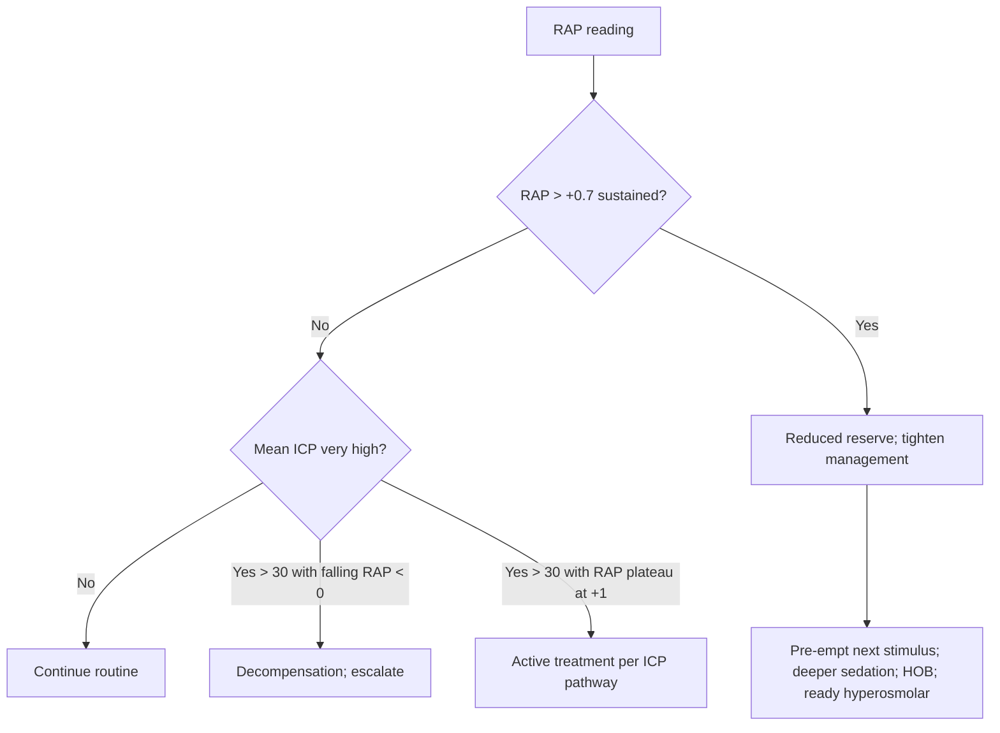

<Callout type="reference">
**Acronyms used on this page**

- **RAP**: index of compensatory reserve = moving Pearson correlation between mean ICP and ICP pulse amplitude (AMP)
- **ICP**: intracranial pressure (mmHg)
- **AMP**: amplitude of the ICP pulse waveform (peak-to-trough of one cardiac cycle, mmHg)
- **P1 / P2 / P3**: percussion / tidal / dicrotic peaks of the ICP waveform
- **PRx**: pressure reactivity index (ICP-MAP slow-wave correlation)
- **Mx**: TCD-based autoregulation index
- **ORx**: NIRS-based autoregulation index
- **Marmarou PV curve**: pressure-volume relationship of the intracranial compartment
- **CPP / MAP**: cerebral perfusion / mean arterial pressure
- **TBI / SAH / HIE**: traumatic / subarachnoid / hypoxic-ischaemic
- **MNM / MMM**: multimodal neuromonitoring / multimodal monitoring
</Callout>

<TldrCard>
**The 60-second version.** RAP is the **compensatory reserve index**, a moving correlation between ICP pulse amplitude (AMP) and mean ICP. It reports where you are on the Marmarou pressure-volume curve. **RAP near 0**: good compliance, you are on the flat part of the PV curve, any added volume buffers without raising ICP much. **RAP near +1**: poor compliance, you are on the rising part of the PV curve, any added volume now spikes ICP. **RAP falling below 0 at very high ICP**: decompensation, the cerebrovascular bed is collapsing and the pulse amplitude is decoupling from mean. RAP is the early-warning that a benign-looking ICP is about to spike. Pediatric data are sparse but growing (Kazimierska 2021, Lewis 2014). Most useful as a trend: RAP rising from 0 to +0.7 over hours predicts impending ICP crisis even when the absolute ICP value still reads "in range". <Cite id="czosnyka1996rap" /> <Cite id="kim2009rap" /> <Cite id="howells2017rap" />
</TldrCard>

## 1. Bedside vignettes: why this matters in the PICU

### Vignette A. The 7-year-old TBI, ICP 16, RAP +0.7

A 7-year-old severe TBI patient on day 2 has ICP 16 mmHg (within range for an older child by pBTF). The bedside RAP, computed from the ICP probe at 1-min resolution over the last 30 minutes, has risen from +0.2 to +0.7 over the last 3 hours. AMP has grown from 4 to 7 mmHg in the same window. **The patient is moving from the flat part of the Marmarou PV curve onto the rising portion.** Any next perturbation (suction, posture change, ventilator dyssynchrony, fluid bolus) could spike ICP catastrophically. Action: pre-emptive sedation, optimised head position, avoid unnecessary stimulation, prepare for hyperosmolar therapy; the RAP signal is the warning that buys time. <Cite id="czosnyka1996rap" /> <Cite id="howells2017rap" />

### Vignette B. The adolescent SAH, RAP 0, ICP 18, comfortable

A 15-year-old SAH day 3 post-coiling has ICP 18, MAP 90, CPP 72. RAP has been steady at 0.0 to +0.1 for the last 24 hours. AMP is small and stable (2 to 3 mmHg). **Good compensatory reserve.** The patient is on the flat part of the PV curve; the cranium has room. The team continues sedation weaning and trial of fluid optimisation for the DCI prophylaxis bundle, knowing that a small fluid bolus is unlikely to drive ICP up acutely. The RAP signal supports the bedside intuition that "ICP 18 looks like good ICP 18" here. <Cite id="hawthorne2014icp" />

### Vignette C. The 5-year-old in advanced refractory ICP, RAP falling below 0

A 5-year-old severe TBI on day 4 has ICP 35 to 38 mmHg sustained, on maximum medical therapy (deep sedation, hyperosmolar, hyperventilation to PaCO2 32). Over the last hour, **RAP has fallen from +0.6 to −0.3 while ICP has risen further to 42**. The AMP has dropped from 9 to 4 mmHg. **This is the decompensation pattern**: at very high ICP, the cerebrovascular bed has collapsed; the cardiac pulse no longer fully transmits into the pulse amplitude; mean ICP and AMP decouple; RAP swings negative. This is *not* recovery; it is impending cerebral circulatory arrest. Action: escalate to decompressive craniectomy decision or, if appropriate to clinical context, transition to brain-death determination and family conversation. <Cite id="kazimierska2021" /> <Cite id="howells2017rap" />

---

## 2. What RAP is, and what it is not

RAP is a **moving Pearson correlation** between two simultaneously recorded ICP-derived signals:

- **Mean ICP** sampled at 10-second averages.
- **AMP**: the peak-to-trough amplitude of the ICP pulse waveform for the cardiac cycle, computed beat-to-beat and averaged over the same 10-second window.

The correlation is computed across a rolling window of typically 5 minutes (30 paired 10-s averages); the resulting value (between −1 and +1) is the RAP for that moment. Update typically every 1 minute. <Cite id="czosnyka1996rap" /> <Cite id="kim2009rap" />

**The physiology**: the Marmarou pressure-volume (PV) curve relates intracranial volume to ICP. The curve has three regions:

1. **Flat region (compensated)**: small volume changes produce small ICP changes; AMP is small and roughly constant; AMP and mean ICP are uncorrelated. **RAP near 0.**
2. **Steep rising region (decompensating)**: small volume changes produce large ICP changes; AMP grows; AMP and mean ICP rise together. **RAP near +1.**
3. **Plateau / falling at very high ICP (cerebrovascular collapse)**: the vascular bed collapses, pulse transmission fails, AMP falls as ICP keeps rising. **RAP falls toward 0 and can go negative.**

The RAP is therefore the bedside readout of **where on the Marmarou PV curve the patient sits right now**. <Cite id="hawthorne2014icp" /> <Cite id="marmarou1975" />

**Three things follow.**

**RAP is a forward-looking signal.** ICP tells you what the pressure is now; RAP tells you what will happen next if you add volume. A patient with ICP 16 and RAP 0.7 is one stimulus away from an ICP spike; the same ICP with RAP 0.1 is well buffered.

**RAP needs careful interpretation at the extremes.** A rising RAP from 0 toward +0.7 is the warning. A RAP that has plateaued at +1 means established poor compliance. A RAP that falls below 0 at high ICP is decompensation, not recovery.

**Pediatric RAP data are sparse.** Lewis 2014 reported pediatric RAP feasibility in TBI; Kazimierska 2021 added compliance-index analyses. Adult thresholds appear to translate but pediatric-specific reference data are emerging. <Cite id="lewis2014peds" /> <Cite id="kazimierska2021" />

<Pearl>
**RAP is the index that tells you a benign-looking ICP is about to spike.** ICP 16 with RAP +0.7 is a different patient from ICP 16 with RAP +0.1. The latter buffers; the former does not. Read RAP alongside ICP, not as a replacement for it. <Cite id="kim2009rap" />
</Pearl>

<Pediatric>
**Pediatric RAP is most useful in severe TBI and SAH** where invasive ICP monitoring is in place. The signal is computed from the same ICP probe that gives mean ICP and PRx, so it is "free" once the probe is in. <Cite id="lewis2014peds" />
</Pediatric>

---

## 3. The Marmarou pressure-volume curve and RAP zones

<Figure
  src="/images/rap/rap-vs-icp.svg"
  alt="RAP plotted against mean ICP; three zones: good compliance (RAP near 0), poor compliance (RAP +1), exhausted (RAP falls toward 0 at high ICP)"
  caption="RAP-ICP relationship overlaid on the Marmarou pressure-volume curve. X-axis: mean ICP (mmHg). Y-axis: RAP (−1 to +1). Three zones. (a) Good compensatory reserve: RAP near 0 across a range of mean ICP values, typically when ICP is low (10 to 15) and compliance is preserved. (b) Diminished reserve: RAP rises toward +1 as ICP rises into the 15 to 25 range; this is the warning zone. (c) Exhausted / decompensating: at very high ICP (&gt; 30 to 35), RAP plateaus at +1 then falls toward 0 and can go negative as the cerebrovascular bed collapses. The corresponding Marmarou PV curve sketch is overlaid: flat / steep / plateau-falling phases."
  attribution="MNM-Edu, original schematic. SVG placeholder."
  label="Fig. 1"
/>

The three zones map to specific clinical states:

| RAP value | Zone | Clinical meaning |
|---|---|---|
| RAP ≈ 0 (−0.1 to +0.2) | Good compensatory reserve | Compensated; volume buffers |
| RAP +0.3 to +0.6 | Diminishing reserve | Warning; tighten ICP management |
| RAP &gt; +0.7 sustained | Poor compensatory reserve | Near exhaustion; pre-empt any stimulus |
| RAP plateaued at +1 | Exhausted | At the steep portion; ICP about to spike or already spiking |
| RAP falling below 0 at very high ICP | Decompensation | Cerebrovascular collapse; pre-arrest |

This is the simplest mapping. In practice, the RAP trend over hours is more informative than a single absolute value.

---

## 4. The signal: how RAP is computed

The bedside platform (ICM+, Sickbay, or custom) requires:

1. **Continuous ICP** from a parenchymal probe or EVD at high sample rate (100 Hz minimum to extract the pulse waveform).
2. **Beat detection** on the ICP trace (typically using ECG R-wave timing or a dedicated peak detector).
3. **AMP per beat**: maximum minus minimum within the cardiac cycle.
4. **Mean ICP**: rolling mean over a fixed window (typically 10 s).
5. **Pair AMP and mean ICP** in 10 s averages over a 5 min rolling window (30 pairs).
6. **Pearson correlation** of the 30 pairs = RAP for that 5-min window.
7. **Update** every 1 min; display as a trend.

**Common implementation details.**

- **Sampling rate**: 100 to 200 Hz on the ICP probe; the pulse waveform is the substrate.
- **AMP detection**: simple peak-to-trough on filtered ICP per cardiac cycle; some platforms use FFT-based AMP extraction (the spectral magnitude at the cardiac frequency).
- **Artefact rejection**: discard windows with probe disconnection, suction, or large transient ICP spikes from cough / movement.
- **Display**: trend strip of RAP, AMP, and mean ICP on the same screen.

<Callout type="clinical-pearl">
**RAP is computed from the same ICP probe that gives mean ICP and PRx**, so it is "free" once the bolt is in. The only added cost is the bedside platform that runs the RAP algorithm; modern multimodal platforms (ICM+, Sickbay) compute it by default.
</Callout>

---

## 5. The numbers: what to record at the bedside

| Variable | Source | What it tells you |
|---|---|---|
| RAP (rolling 5 min) | Bedside platform | Compensatory reserve, this moment |
| RAP (1 h smoothed) | Bedside platform | Trend over time |
| AMP (pulse amplitude) | Bedside platform | Raw signal driving RAP; rises with poor compliance |
| Mean ICP | ICP probe | Baseline pressure |
| Concurrent PRx | Bedside platform | Autoregulation status (different physiology) |
| Marmarou-style PV index | Computed at bolus events | Direct compliance measurement (less common bedside) |
| ICP waveform morphology (P1, P2, P3) | ICP probe | Compliance signature; P2 &gt; P1 = low compliance |
| Signal quality / artefact flags | Bedside platform | Confidence in RAP |

Plot RAP alongside ICP, AMP, PRx, and the clinical timeline (suction, posture changes, fluid boluses) so that perturbations and RAP responses can be visualised together.

---

## 6. What is normal? RAP reference values

| RAP | Interpretation | Typical ICP context |
|---|---|---|
| −0.2 to +0.2 | Good compensatory reserve | Low ICP, intact compliance |
| +0.2 to +0.5 | Borderline | Moderate ICP, transitional |
| +0.5 to +0.8 | Reduced reserve | ICP rising into treatment range |
| +0.8 to +1.0 | Exhausted | High ICP, steep PV curve |
| Falling from +1 toward 0 or negative at very high ICP | Decompensation | Pre-arrest, cerebrovascular collapse |

Pediatric data: adult thresholds appear to translate; Lewis 2014 and Kazimierska 2021 provide pediatric and adult cohort confirmation. <Cite id="lewis2014peds" /> <Cite id="kazimierska2021" /> <Cite id="howells2017rap" />

<Pediatric>
**Pediatric RAP normative ranges are similar to adult**, but pediatric data are smaller in number. Use trend-within-patient and pair with mean ICP and the Marmarou PV-curve concept; do not interpret a single RAP value in isolation.
</Pediatric>

---

## 7. What is abnormal? Pattern library

<Figure
  caption="Four RAP-ICP-AMP patterns. (a) Compensated: ICP 12, RAP +0.1, AMP 2 mmHg, stable trend. (b) Warning: ICP 18, RAP +0.6 rising, AMP 5 mmHg, climbing trend; pre-empt next stimulus. (c) Spike: ICP rises from 16 to 28 after a routine suction, RAP was +0.8 immediately before, AMP shot from 6 to 12. (d) Decompensation: ICP 38, RAP −0.2 (fallen from +0.9 over the last hour), AMP dropped from 9 to 4; cerebrovascular bed collapsing."
  attribution="MNM-Edu, original schematic. SVG placeholder."
  label="Fig. 2"
>
  <WidgetEmbed name="RAPDemo" />
</Figure>

| Pattern | Bedside signature | Action |
|---|---|---|
| Compensated | RAP < 0.3, low AMP, stable ICP | Continue routine |
| Rising RAP | RAP from 0.2 → 0.6 over hours | Tighten management; pre-empt stimuli |
| Plateaued at +1 | RAP stuck at +1 with rising ICP | Escalate ICP treatment; do not perturb |
| Post-perturbation spike | RAP was high, brief stimulus, ICP spiked | Sedation depth review; HOB; hyperosmolar |
| Decompensation | RAP fallen from +1 toward 0 or negative at very high ICP | Catastrophic; escalate to surgery or family discussion |
| Pseudo-RAP-low artefact | ICP probe drift, low signal | Recheck probe; do not over-interpret |
| RAP normal with ICP normal | Stable | Continue routine |

### Decision tree: "what does RAP tell me?"

---

## 8. Try it: interactive widgets

<WidgetEmbed name="RAPDemo" />

<WidgetEmbed name="MarmarouPVCurve" />

---

## 9. RAP-driven management decisions

### 9.1 Pre-emption rather than reaction

The defining use case. A rising RAP toward +0.7 in a patient with ICP still "in range" justifies a pre-emptive management response:

1. **Deeper sedation** if appropriate; avoid stimulating manoeuvres.
2. **Optimised head position**: 30° head-of-bed, neutral neck, no abdominal compression.
3. **Ventilator harmony**: PEEP minimal but safe, normocapnia, avoid coughing.
4. **Pre-empt the next perturbation**: warn the bedside team that ICP is likely to spike with suction, posture change, or fluid bolus.
5. **Have hyperosmolar therapy at the bedside ready** for rapid administration.

### 9.2 Avoiding the "false reassurance" of in-range ICP

A patient with sustained ICP 18 and RAP +0.7 is not in a safe place even though ICP is below most pediatric treatment thresholds (BTF: > 22 mmHg for older children, > 18 for younger). RAP is the bedside signal that says "this ICP is on the steep part of the curve; one perturbation away from crisis." <Cite id="kochanek2019_pbtf4" />

### 9.3 The decompensation conversation

A patient with very high sustained ICP and a *falling* RAP that crosses zero into negative territory is decompensating. This is not improvement; it is cerebrovascular collapse. The bedside team should:

1. **Escalate ICP management to maximum**: deep sedation, paralysis if needed, deeper hyperosmolar, hypothermia if not already, hyperventilation as a temporising measure.
2. **Consider decompressive craniectomy** if salvageable and appropriate to the case.
3. **Prepare for the brain-death conversation** if maximal therapy is exhausted.
4. **Engage family early** with structured, honest communication.

### 9.4 Pairing with PRx

PRx and RAP are derived from the same probe but address different physiologies. PRx is the slow-wave correlation of ICP with MAP, an autoregulation index. RAP is the AMP-vs-mean-ICP correlation, a compensatory-reserve index. Both can be impaired in severe TBI; both can be useful for prognostication and management. <Cite id="czosnyka1996rap" /> <Cite id="czosnyka1997prx" />

### 9.5 Pairing with the ICP waveform

The ICP waveform morphology (P1, P2, P3 peaks) gives the same compliance information as RAP but at a different time scale. A P2 > P1 pattern on the bedside waveform is the visual signature of low compliance, often correlating with elevated RAP. The two together strengthen the case for active management. See the [ICP page](/modalities/icp/) for waveform morphology detail.

<Callout type="caveat">
**Teaching, not protocol.** RAP thresholds (+0.7 warning, decompensation at falling RAP with very high ICP) are heuristics derived from observational adult data with limited pediatric validation. Local protocols and clinical judgment govern. Defer to your unit's senior neurocritical care team for RAP-driven decisions.
</Callout>

<AlgorithmDisclaimer />

---

## 10. Clinical contexts: RAP across acute brain injuries

### 10.1 Severe TBI

The primary indication. RAP rises and falls predictably with the evolution of pediatric and adult severe TBI; it complements PRx and ICP-dose analyses for prognostication. Howells 2017 reported the largest RAP outcome dataset in adult TBI. Lewis 2014 the pediatric TBI feasibility data. <Cite id="howells2017rap" /> <Cite id="lewis2014peds" /> <Cite id="kochanek2019_pbtf4" />

### 10.2 Aneurysmal SAH

Useful in SAH for the same reason: a rising RAP in a stable-looking patient warns of impending ICP crisis from rebleed, hydrocephalus, or DCI-related oedema. Less validated than in TBI but conceptually similar. <Cite id="hoh2023sah_aha" /> <Cite id="rass2021dci_review" />

### 10.3 Pediatric AIS

ICP monitoring is uncommon in pediatric AIS unless malignant oedema is suspected. When ICP is monitored, RAP can supplement the bedside picture. <Cite id="ferriero2019aha_pedstroke" />

### 10.4 HIE and post-cardiac arrest

ICP monitoring in HIE is selective. When present, RAP adds compensatory-reserve information to the bedside picture, especially during the rewarming and reperfusion windows. <Cite id="topjian2021aha_pediatric" /> <Cite id="naim2023_brain_injury_pccm" />

### 10.5 Pediatric ECMO

ICP monitoring on ECMO is uncommon (anticoagulation precludes safe bolt placement in most cases). RAP is therefore rarely available in ECMO. When EVD is in place for a specific surgical indication, RAP can be computed. <Cite id="lorusso2017_elso_neuro" /> <Cite id="cho2024_ecmo_outcomes" />

### 10.6 Meningitis and encephalitis with raised ICP

Fulminant meningitis or encephalitis with cerebral oedema may require EVD or parenchymal monitoring. RAP supports the bedside management when invasive monitoring is in place. <Cite id="tunkel2017idsa_encephalitis" /> <Cite id="vandebeek2016eu_meningitis" />

### 10.7 Brain-death determination

Not a brain-death tool. The decompensation pattern (RAP falling below 0 at very high ICP) is the bedside signature of cerebrovascular collapse and is consistent with impending brain death, but the formal diagnosis is clinical + apnoea + ancillary per local protocol. <Cite id="nakagawa2011peds_bd" /> <Cite id="wijdicks2005" />

### 10.8 DKA cerebral oedema

ICP monitoring in DKA is rare (the cerebral oedema is usually managed empirically with osmotherapy). In selected centres with EVD placement for fulminant DKA-CO, RAP would supplement the management. <Cite id="kuppermann2018_pecarn_dka" /> <Cite id="glaser2024_dka_review" />

### 10.9 Hydrocephalus / EVD-managed patients

A common chronic use case: pediatric patients with EVD for hydrocephalus or post-haemorrhagic hydrocephalus can have RAP computed continuously. Rising RAP in this context can indicate impending shunt failure or developing increased ICP. <Cite id="hawthorne2014icp" />

### 10.10 Refractory raised ICP escalation

In refractory raised ICP requiring tier-3 therapies (decompressive craniectomy, barbiturate coma, hypothermia), RAP is part of the bedside data informing the escalation decisions. Decompensating RAP supports the case for surgical decompression where appropriate. <Cite id="kochanek2019_pbtf4" />

---

## 11. Multimodal integration: RAP in the MMM/MNM stack

| Pair with… | What you gain | Worked scenario |
|---|---|---|
| **Mean ICP** | The substrate; RAP complements ICP | ICP 16 + RAP +0.7 vs ICP 16 + RAP +0.1: very different patients |
| **ICP waveform (P1, P2, P3)** | Same compliance physiology, different time scale | P2 &gt; P1 + RAP +0.8: concordant low compliance |
| **PRx** | Autoregulation vs reserve; two different physiologies | TBI with high RAP and high PRx: bad on both indices |
| **CPP** | The downstream consequence of high ICP | RAP rising + CPP falling = crisis approaching |
| **Mx / ORx** | Non-invasive autoregulation companions | Multimodal picture of brain stress |
| **Clinical exam** | The gate | RAP rising + GCS falling = act now |
| **TCD** | PI rises with raised ICP; complements RAP | Both indicating decompensation: high RAP + high PI |
| **NIRS** | Tissue oxygenation alongside compensatory reserve | Multimodal evidence of secondary injury |

<Cite id="figaji2025_mmm_pediatric_consensus" /> <Cite id="helbok2024_pediatric_mmm" /> <Cite id="tasker2023mnm" /> <Cite id="leroux2014_neurocrit_consensus" />

---

<DeepDive>

## 12. Setup and technique

### 12.1 Equipment

- **Parenchymal ICP probe** (Codman, Camino, Raumedic) or **EVD with transducer** placed by neurosurgery.
- **High-sample-rate digital input** to the bedside platform (100 Hz minimum).
- **Bedside platform** with RAP computation: ICM+, Sickbay, custom Python pipeline, or vendor-integrated.
- **Synchronised ECG** (optional but helpful for beat detection).
- **Clean ICP waveform** with crisp P1-P2-P3 morphology.

### 12.2 Setup workflow

1. **Confirm ICP probe is placed and zeroed** per local protocol.
2. **Verify waveform quality**: P1-P2-P3 morphology visible, respiratory variation clean, no electrode noise.
3. **Sample rate at 100 to 200 Hz**; some platforms accept lower rates with degraded RAP precision.
4. **Beat detection** running (manual review of detection accuracy in first minutes).
5. **Start RAP computation**: typically 10-s averages over 5-min window, updated every 1 min.
6. **Display** RAP, AMP, mean ICP, PRx (if computed) on a single bedside trend strip.
7. **Set alarms**: rising RAP, sustained RAP > 0.7, decompensation pattern (falling RAP at very high ICP).

### 12.3 Interpretation in clinical context

1. **Always read RAP alongside mean ICP and AMP**. RAP without context is unreliable.
2. **Trend over hours**: a single RAP value is less informative than the trajectory over 4 to 12 hours.
3. **Pair with clinical exam, CPP, PRx, ICP waveform morphology**. The multimodal picture is the working unit.
4. **Document at bedside rounds**: RAP trend, current zone, planned response to specific perturbations.

### 12.4 Quality control

- **Waveform quality** is the leading determinant of RAP reliability. Probe drift, broken connections, and electrode noise all degrade AMP detection.
- **Beat detection accuracy** affects AMP; manual review during initial setup.
- **Filtering**: appropriate high-pass and low-pass to isolate the cardiac-frequency pulse; over-filtering degrades AMP, under-filtering admits noise.
- **Re-zero ICP** per local protocol; drift in mean ICP corrupts RAP.

### 12.5 Pediatric-specific considerations

- **Smaller pulse amplitudes** in young children; the AMP signal-to-noise ratio is lower; RAP precision suffers slightly.
- **Higher heart rates** (toddlers, infants): more beats per 10-second window; AMP averaging is more robust but FFT-based AMP extraction needs adjusted parameters.
- **Pediatric reference data sparse**: treat pediatric RAP thresholds as adult-extrapolated.
- **Confounders are the same**: sedation, posture, ventilator, suction, fluid boluses all influence ICP and AMP and therefore RAP.

### 12.6 When RAP is not the right tool

- **Inadequate waveform quality**: damped, noisy, or disconnected ICP probe.
- **EVD draining continuously**: open EVD vents the ICP wave, suppressing AMP and corrupting RAP.
- **Very low ICP** (over-drainage): AMP is small, RAP is poorly defined.
- **Very high ICP with cerebrovascular collapse**: RAP itself becomes a decompensation marker; interpret in clinical context.

</DeepDive>

---

## 13. Pitfalls

- **Open EVD vents the ICP wave**: AMP drops, RAP is corrupt. Close the EVD to atmosphere (or clamp briefly) when reading RAP.
- **Waveform damping** from probe drift or wedge artefact reduces AMP and lowers RAP, mimicking improvement.
- **Over-filtering** degrades the pulse amplitude; under-filtering admits noise.
- **Single-snapshot RAP**: trend is the signal.
- **Confusing decompensation with recovery**: a falling RAP at very high ICP is decompensation, not improvement.
- **Adult thresholds in children**: most pediatric RAP work uses adult thresholds; pediatric-specific normative data are limited.
- **Sedation changes**: deep sedation lowers CMRO2, reduces cerebral vascular volume, can shift the patient down the PV curve; RAP can improve transiently with sedation increase.
- **Posture changes**: HOB up reduces cerebral venous pressure, can drop ICP and AMP; RAP shifts.
- **Pairing with ICP waveform morphology**: when RAP and P2 > P1 disagree, look harder; the two should usually agree.
- **Ignoring AMP**: AMP itself (without the correlation) is informative; large AMP at "in range" ICP is a low-compliance signature even when RAP has not fully risen.

---

## 14. Combine with…

- [ICP](/modalities/icp/): the parent modality; RAP is one of its derived indices.
- [PRx](/modalities/prx/): the autoregulation index sibling, also from the ICP probe.
- [CPP](/modalities/cpp/): the downstream variable that decompensating RAP threatens.
- [Mx](/modalities/mx/): the TCD-based autoregulation index.
- [ORx](/modalities/orx/): the NIRS-based autoregulation index.
- [Foundations: Monro-Kellie doctrine](/foundations/monro-kellie/): the physiology behind RAP.
- [Foundations: Marmarou PV curve](/foundations/marmarou-pv-curve/): the direct conceptual underpinning.

---

<DeepDive>

## 15. Evidence summary

| Topic | Source | Grade |
|---|---|---|
| Original RAP description | <Cite id="czosnyka1996rap" /> | B |
| Kim 2009 RAP review | <Cite id="kim2009rap" /> | review |
| Howells 2017 large adult RAP cohort | <Cite id="howells2017rap" /> | B |
| Kazimierska 2021 compliance / RAP | <Cite id="kazimierska2021" /> | C |
| Lewis 2014 pediatric RAP | <Cite id="lewis2014peds" /> | C |
| Marmarou pressure-volume curve | <Cite id="marmarou1975" /> | foundational |
| Hawthorne ICP biomarkers review | <Cite id="hawthorne2014icp" /> | review |
| PRx (the autoregulation companion) | <Cite id="czosnyka1997prx" /> | A |
| Pediatric BTF (TBI) | <Cite id="kochanek2019_pbtf4" /> | expert |
| SAH AHA guidelines | <Cite id="hoh2023sah_aha" /> | expert |
| Pediatric MMM consensus | <Cite id="figaji2025_mmm_pediatric_consensus" /> <Cite id="helbok2024_pediatric_mmm" /> | expert |
| LeRoux 2014 neurocritical consensus | <Cite id="leroux2014_neurocrit_consensus" /> | expert |
| Pediatric PCCM review | <Cite id="tasker2023_pccm_review" /> | review |
| Pediatric MMM PCCM review | <Cite id="tasker2023mnm" /> | review |
| Pediatric post-arrest brain injury | <Cite id="naim2023_brain_injury_pccm" /> | review |
| Pediatric brain-death criteria | <Cite id="nakagawa2011peds_bd" /> | expert |

## 16. Recent literature (2022 to 2025)

- **Kazimierska 2021 compliance index analyses**: extended the RAP / compliance framework with novel ICP-waveform-derived indices in adult TBI. <Cite id="kazimierska2021" />
- **Hawthorne 2014 ICP biomarkers review** (still the standard primer): positions RAP, AMP, and pulse-waveform-derived indices in the broader ICP-monitoring framework. <Cite id="hawthorne2014icp" />
- **Tasker 2023 PCCM review**: includes RAP in the pediatric severe TBI MNM toolkit. <Cite id="tasker2023_pccm_review" />
- **Figaji 2025 pediatric MMM consensus**: RAP recognised as tier-2 (specialist centre) modality in pediatric MNM stacks. <Cite id="figaji2025_mmm_pediatric_consensus" />
- **Helbok 2024 pediatric MMM**: bedside operationalisation of RAP in pediatric multimodal monitoring. <Cite id="helbok2024_pediatric_mmm" />
- **Continued adult RAP literature**: refinements in waveform-based AMP extraction, FFT-based RAP, and ML-augmented compliance index work in selected research centres.

</DeepDive>

---

## 17. Self-check

<Quiz
  questions={[
    {
      id: 'q1',
      prompt: 'A 7-year-old severe TBI on day 2. ICP 16 (within pBTF range for older children). Over the last 3 h, RAP has risen from +0.2 to +0.7 and AMP from 4 to 7 mmHg. Most appropriate next step?',
      options: [
        { id: 'a', label: 'Reassure: ICP is within range; continue current management' },
        { id: 'b', label: 'Pre-emptive action: deeper sedation, optimise head position, minimise stimuli, ready hyperosmolar at bedside; the rising RAP indicates the patient is on the steep part of the PV curve and one perturbation away from crisis' },
        { id: 'c', label: 'Push CPP higher with vasopressor escalation' },
        { id: 'd', label: 'Wait until ICP exceeds 22 before any action' },
      ],
      answer: 'b',
      explanation: 'A RAP that has risen from +0.2 to +0.7 with rising AMP indicates the patient is moving onto the steep part of the Marmarou pressure-volume curve. ICP can still read "in range" at this point; the RAP is the early-warning that the next perturbation (suction, posture change, fluid bolus) will spike ICP. Pre-emptive action (deeper sedation, optimal positioning, ready hyperosmolar) is the appropriate response. Waiting for ICP > 22 misses the window. Pushing CPP higher with vasopressors does not address the compensatory-reserve issue and may add risk. This is the canonical use case for RAP as a forward-looking signal.',
    },
    {
      id: 'q2',
      prompt: 'A 5-year-old severe TBI on day 4 has had sustained ICP 35 to 38 on maximum medical therapy. Over the last hour, RAP has fallen from +0.6 to −0.3 while ICP has risen further to 42, and AMP has dropped from 9 to 4 mmHg. Best interpretation?',
      options: [
        { id: 'a', label: 'Improvement: RAP is falling toward 0, which is the goal' },
        { id: 'b', label: 'Decompensation: at very high ICP, the cerebrovascular bed is collapsing; the pulse no longer transmits fully, AMP drops, RAP swings negative; this is pre-arrest physiology, not recovery; escalate to decompressive craniectomy decision or, if appropriate to context, transition to family conversation about prognosis' },
        { id: 'c', label: 'Artefact: ICP probe has failed; replace' },
        { id: 'd', label: 'Acceptable response to therapy; continue current measures' },
      ],
      answer: 'b',
      explanation: 'A falling RAP from positive territory toward 0 or negative at very high sustained ICP, with simultaneously falling AMP, is the signature of cerebrovascular collapse. The cardiac pulse no longer fully transmits into the cranium because the vascular bed has failed; AMP drops; the correlation between mean ICP and AMP becomes nonsensical. This is decompensation, not recovery. Maximal escalation (consider decompressive craniectomy if salvageable, or transition to family conversation if maximal therapy is exhausted) is the appropriate response. This is the most counter-intuitive RAP pattern: an "improving" RAP at very high ICP is bad, not good.',
    },
    {
      id: 'q3',
      prompt: 'A 15-year-old SAH day 3 post-coiling has ICP 18, CPP 72, MAP 90, sustained for 24 h. RAP is steady at +0.1, AMP 2 to 3 mmHg, all stable. The team plans a small fluid bolus to optimise volume status for DCI prophylaxis. Best interpretation of the RAP for this decision?',
      options: [
        { id: 'a', label: 'RAP +0.1 indicates poor compensatory reserve; do not give the bolus' },
        { id: 'b', label: 'RAP +0.1 indicates good compensatory reserve (the patient is on the flat part of the PV curve); a small fluid bolus is unlikely to cause an acute ICP spike; proceed with the bolus as part of the DCI bundle, with usual monitoring' },
        { id: 'c', label: 'RAP gives no useful information for fluid-bolus decisions' },
        { id: 'd', label: 'Aggressive volume escalation is now justified by the favourable RAP' },
      ],
      answer: 'b',
      explanation: 'A sustained RAP near 0 indicates the patient is on the flat part of the Marmarou PV curve where added volume buffers without raising ICP much. The small fluid bolus is therefore unlikely to spike ICP acutely; the RAP supports the bedside intuition that ICP 18 in this patient is "comfortable" 18, not "about to spike" 18. The RAP does not justify aggressive volume escalation (which is a different decision driven by haemodynamic and DCI considerations), but it does support a planned small bolus. Choice A is the inverse of the correct RAP interpretation. Choice C dismisses a useful bedside signal. Choice D over-extrapolates; the RAP does not authorise unlimited volume.',
    },
  ]}
/>
