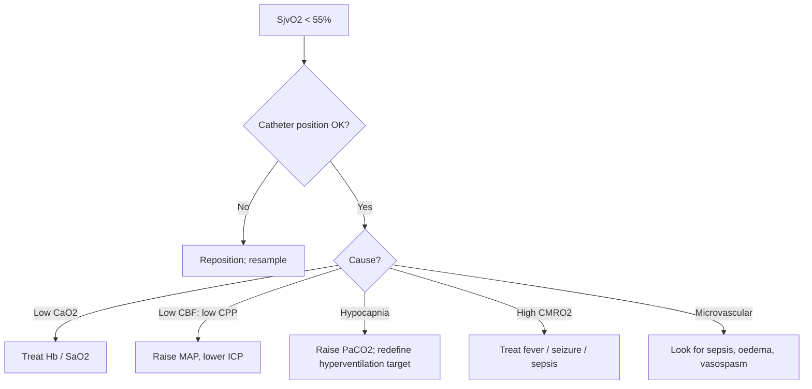

<Callout type="reference">
**Acronyms used on this page**

- **SjvO₂**: jugular venous bulb oxygen saturation (% O₂ in retrograde IJ effluent)
- **AjvDO₂**: arterio-jugular difference in O₂ content (mL/dL)
- **IJ**: internal jugular vein · **CCA**: common carotid artery
- **CMRO₂**: cerebral metabolic rate of oxygen (mL O₂/100 g/min)
- **CBF**: cerebral blood flow · **CPP / MAP / ICP**: cerebral perfusion / mean arterial / intracranial pressure
- **CEO₂**: cerebral O₂ extraction (= 1 − SjvO₂/SaO₂)
- **CaO₂ / CjvO₂**: arterial / jugular venous O₂ content (mL/dL)
- **OEF**: oxygen extraction fraction
- **Fick**: CMRO₂ = CBF × (CaO₂ − CjvO₂)
- **PbtO₂**: brain tissue oxygen tension (mmHg, regional)
- **NIRS / rSO₂**: near-infrared spectroscopy / regional cerebral oxygen saturation
- **TCD**: transcranial Doppler · **PRx**: pressure reactivity index
- **TBI**: traumatic brain injury · **SAH**: subarachnoid haemorrhage · **HIE**: hypoxic-ischaemic encephalopathy
- **MMM / MNM**: multimodal monitoring / multimodal neuromonitoring
</Callout>

<TldrCard>
**The 60-second version.** SjvO₂ is the O₂ saturation in blood draining the brain, sampled from a retrograde catheter at the jugular bulb. It is the **global** index of cerebral O₂ extraction. Normal SjvO₂ runs 55–75%; values < 55% mean the brain is extracting harder than usual (low CBF, low CaO₂, high CMRO₂); values > 75% mean luxury perfusion or a metabolic shutdown (severe injury, sedation, hypothermia, dead brain). Use SjvO₂ to titrate **hyperventilation** in severe TBI (the classic Cruz / Robertson paradigm), to detect global hypoperfusion, and to anchor an autoregulation-informed CPP target. SjvO₂ is **global**: it cannot see regional ischaemia. It has been largely replaced by **PbtO₂** (regional, parenchymal) in most modern adult and pediatric centres, but remains the canonical teaching reference and a fallback when PbtO₂ is unavailable.
</TldrCard>

## 1. Bedside vignettes: why this matters

### Vignette A. Severe TBI, hyperventilation titration

A 14-year-old with severe TBI, ICP 26 mmHg refractory to first-tier measures, started on controlled hyperventilation. The team aims for PaCO₂ 30 mmHg. With a retrograde IJ catheter in place, the bedside SjvO₂ falls from 68% to 52% as PaCO₂ falls to 28. AjvDO₂ widens. This is **hyperventilation-induced ischaemia**: the vasoconstriction has dropped CBF below the threshold of demand. PaCO₂ is corrected back to 32; SjvO₂ recovers to 62%. ICP holds. The SjvO₂ gave you the metabolic crash guardrail. <Cite id="cruz1992" /> <Cite id="gopinath1994sjvo2" /> <Cite id="kochanek2019_pbtf4" />

### Vignette B. Pediatric post-cardiac-arrest, "luxury" SjvO₂

A 7-year-old after a 25-minute submersion arrest, day 2 post-ROSC, normothermic. SjvO₂ is **88%** on a stable MAP. NIRS rSO₂ is 92%. The team is reassured. The aEEG is markedly suppressed; the SSEP shows bilateral absent N20. **High SjvO₂ in a comatose post-arrest brain is luxury perfusion, not safety**: flow without demand because demand has collapsed. Combined with the electrophysiology, the prognosis is poor. <Cite id="topjian2021aha_pediatric" /> <Cite id="naim2023_brain_injury_pccm" />

### Vignette C. Catheter drift gives a misleading low

A 16-year-old severe TBI day 3 with a previously stable SjvO₂ of 65%. The morning sample reads **40%**. The team reaches for fluids and a vasopressor before the senior fellow points out that the catheter tip is no longer at the bulb on the chest film: it has drifted distally into the brachiocephalic confluence and is sampling **extracerebral blood** mixed with chest-wall venous return. The catheter is repositioned and the SjvO₂ returns to 64%. Position drift is the single most common SjvO₂ artefact; the daily chest film check matters. <Cite id="leroux2014_neurocrit_consensus" />

---

## 2. What SjvO₂ is, and what it is not

The jugular venous bulb is the dilation of the internal jugular vein at the base of the skull, where almost all blood draining the brain converges before mixing with extracerebral venous return downstream. A catheter advanced retrograde from the IJ up to the bulb samples blood that is, to first approximation, **the global cerebral venous effluent**.

The Fick principle ties SjvO₂ to cerebral O₂ balance:

```math
\text{CMRO}_2 = \text{CBF} \times (\text{CaO}_2 - \text{CjvO}_2)
```

Rearranging gives the O₂ extraction fraction:

```math
\text{OEF} = \frac{\text{CaO}_2 - \text{CjvO}_2}{\text{CaO}_2} = 1 - \frac{\text{SjvO}_2}{\text{SaO}_2} \quad (\text{assuming Hb constant})
```

Normal OEF is about 0.30 (35% extraction). When CBF falls relative to CMRO₂, OEF rises and SjvO₂ falls. When CBF is in excess of CMRO₂ (luxury perfusion, severe injury with collapsed metabolism), OEF falls and SjvO₂ rises.

| SjvO₂ band | Interpretation | Bedside meaning |
|---|---|---|
| > 85% | Luxury perfusion or low CMRO₂ | Hyperaemia, dead brain, deep sedation, hypothermia, AV shunting |
| 75–85% | Mild luxury | Sedation effect, hyperaemic phase of injury |
| 55–75% | Normal range | O₂ supply matches demand |
| 50–55% | Increased extraction | Low CBF, low CaO₂, or high CMRO₂; early concern |
| < 50% | Critical ischaemia | Imminent or established cerebral hypoxia |
| < 40% | Severe ischaemia | High risk of infarction; act now |

### What SjvO₂ does well

- **Global cerebral O₂ balance**: a single number that captures the whole-brain supply-demand ratio.
- **Hyperventilation titration**: the canonical use; identifies the PaCO₂ at which vasoconstriction crosses into ischaemia.
- **CPP / autoregulation cross-check**: a low SjvO₂ with low CPP points to inadequate perfusion; a low SjvO₂ with adequate CPP points to a metabolic mismatch (fever, seizure, intra-cerebral shunting).
- **Long-term ICU bedside trend**: intermittent samples (every 4–8 h) plus continuous fibreoptic devices for high-resolution work.

### What SjvO₂ cannot do

- **Detect regional ischaemia**: a regional infarct in 20% of cortex with the other 80% healthy will not move global SjvO₂ enough to alarm.
- **See the watershed**: the bulb mixes blood from the whole hemisphere; small territory ischaemia is invisible.
- **Be interpreted without a chest film**: catheter position drift is common and produces false readings.
- **Replace PbtO₂**: tissue-level oxygen tension at the most-at-risk parenchymal site is more sensitive to regional ischaemia and more actionable in modern protocols. <Cite id="okonkwo2017_boost2" /> <Cite id="bernard2025_boost3" />

<Pearl>
**SjvO₂ is the whole-brain average.** It is excellent for detecting global ischaemia (hyperventilation-induced, low-CBF states) and luxury perfusion, blind to focal ischaemia, and dependent on accurate catheter placement at the bulb.
</Pearl>

<Pediatric>
**Pediatric SjvO₂ is technically harder than adult**: smaller jugular calibre, smaller bulb, more catheter-tip drift, and an IJ that follows the carotid more closely. Most modern pediatric ICUs use **PbtO₂** instead when an invasive O₂ monitor is indicated. SjvO₂ remains the teaching reference and a fallback when PbtO₂ probes are unavailable or in centres without a parenchymal-monitoring programme. <Cite id="figaji2025_mmm_pediatric_consensus" /> <Cite id="adelson2014pbto2" />
</Pediatric>

---

## 3. Anatomy: the jugular bulb and its catheter

<Figure
  src="/images/sjvo2/jugular-bulb-catheter.png"
  alt="Lateral neck view showing the internal jugular vein draining from the jugular bulb at the base of the skull, with a retrograde catheter advanced cephalad through the IJ to the bulb at C1-C2 inferior border level. Sternocleidomastoid muscle, mastoid process, and C1-C7 cervical vertebrae labelled. Right panel: placement, confirmation, and sampling instructions."
  caption="The jugular bulb sits at the base of the skull, just below the jugular foramen, as the dilated proximal portion of the IJ where the sigmoid sinus empties. The retrograde catheter is inserted at the cricoid level under ultrasound guidance and advanced cephalad ~15 cm until resistance, with the tip at the C1–C2 inferior border (level of the mastoid process on a lateral cervical X-ray). The dominant jugular (usually right) carries ~60–70% of the cerebral venous outflow and is conventionally selected unless contraindicated. Sampling is by fibre-optic continuous SjvO₂ or intermittent co-oximetry; aspirate ≤ 2 mL/min, because fast aspiration entrains extracerebral blood and produces an artefactually high SjvO₂. Normal range 50–75%."
  attribution="MNM-Edu, original schematic. Robertson 1989; Macmillan 2000; Gopinath 1994."
  label="Fig. 1"
/>

### 3.1 The bulb

The jugular bulb is the most rostral portion of the IJ; it dilates as the sigmoid sinus opens into it. Anatomic considerations:

- **Right vs left dominance**: most patients have a right-dominant venous drainage (60–70% of cerebral outflow). Conventional practice is to catheterise the **dominant** side.
- **Determining dominance**: compress each IJ in turn at the bedside; the side whose compression raises ICP more (or where ipsilateral compression produces a larger ICP rise) is dominant. In planned cases, MR / CT venogram or simple sonographic measurement of bulb diameter informs the choice.
- **Bulb position**: just below the jugular foramen, lying against the C1 transverse process; on a lateral skull film, the bulb sits between C1 and the lower border of the mastoid.
- **Mixing with extracerebral venous return**: blood from the face, scalp, and neck drains into the IJ below the bulb; a catheter tip that has slipped below the bulb samples mixed venous blood and over-reads (or under-reads) SjvO₂.

### 3.2 The catheter

Two types:

- **Intermittent sampling catheter**: a short multi-lumen central catheter advanced retrograde from the IJ to the bulb. Blood samples are drawn for co-oximetry every 4–6 hours.
- **Continuous fibreoptic catheter** (Oximetrix, Edwards SwanGanz-equivalent): a fibreoptic at the catheter tip continuously reads the spectral O₂ saturation; calibrated against intermittent co-oximetry every 12–24 h to correct for drift.

### 3.3 The chest film: not optional

Every SjvO₂ catheter gets a **post-placement** chest film (lateral skull if available) and a **daily** chest film thereafter. Position drift in either direction (too distal: samples mixed; too proximal: against the bulb wall, sluggish flow) is the single most common artefact. <Cite id="leroux2014_neurocrit_consensus" />

<Pitfall>
**An SjvO₂ value out of context is a number without a meaning.** Always pair the value with: catheter position on the latest film, the sampling rate (was the sample drawn slowly?), the patient's CaO₂ (Hb, SaO₂), and the clinical state (sedation, temperature, ICP). Without these, the number is noise.
</Pitfall>

---

## 4. The signal: from sample to interpretation

Each SjvO₂ measurement gives a percent saturation; the bedside interpretation comes from comparing it with the **arterial saturation** to compute AjvDO₂ or OEF, and from setting the value against the **CMRO₂ context** (fever? seizure? sedation? hypothermia?).

### 4.1 The AjvDO₂ pair

```math
\text{AjvDO}_2 = \text{CaO}_2 - \text{CjvO}_2 = 1.34 \times \text{Hb} \times (\text{SaO}_2 - \text{SjvO}_2) + 0.003 \times (\text{PaO}_2 - \text{PjvO}_2)
```

In a healthy adult with Hb 12, SaO₂ 99%, SjvO₂ 65%: AjvDO₂ ≈ 5.5 mL/dL.

- **AjvDO₂ < 4 mL/dL**: low extraction; luxury perfusion or low CMRO₂.
- **AjvDO₂ 4–7 mL/dL**: normal range.
- **AjvDO₂ > 7 mL/dL**: increased extraction; the brain is working harder per unit blood; check CBF, CaO₂, CMRO₂.

### 4.2 The CEO₂ shorthand

```math
\text{CEO}_2 = 1 - \frac{\text{SjvO}_2}{\text{SaO}_2}
```

A normal CEO₂ is around 0.30 (30% extraction). CEO₂ > 0.40 is concerning; CEO₂ > 0.50 is critical.

### 4.3 Slow sampling matters

The pulsatile / continuous nature of flow at the bulb means that **fast aspiration** of a sample contaminates the sample with extracerebral venous return retrogradely sucked up the IJ. Slow draw (over 30–60 seconds) yields clean cerebral venous blood. <Cite id="leroux2014_neurocrit_consensus" />

---

## 5. The numbers to record: the SjvO₂ six-pack

| Variable | Symbol | What it tells you |
|---|---|---|
| Jugular venous saturation | SjvO₂ | Primary metric; 55–75% normal |
| Arterial saturation | SaO₂ | Required for AjvDO₂ and CEO₂ |
| Arterio-jugular difference | AjvDO₂ | 4–7 mL/dL normal |
| Cerebral O₂ extraction | CEO₂ | 0.30 normal |
| Hb concentration | Hb | Required for CaO₂ |
| PaCO₂ | PaCO₂ | The dominant SjvO₂-modifier; pair with every reading |

Record every reading with: catheter position (latest film), sampling rate (slow vs fast), patient temperature, sedation regimen, ICP/CPP/MAP at the time of draw, and any recent intervention (hyperventilation change, transfusion, mannitol).

---

## 6. What is normal? Age-banded reference

| Age | SjvO₂ (%) | AjvDO₂ (mL/dL) | CMRO₂ (mL O₂/100 g/min) | Notes |
|---|---|---|---|---|
| Neonate (term) | 55–70 | 4–7 | 1.5–2.0 | Lower CMRO₂ than older child; tighter CaO₂ |
| 1–3 years | 60–75 | 4–6 | 4.0–5.0 | Peak CMRO₂ years |
| 4–10 years | 55–75 | 4–7 | 4.5–5.5 | Highest CMRO₂ per gram of brain |
| Adolescent | 55–75 | 4–7 | 3.5–4.5 | Adult-like by mid-teens |
| Adult | 55–75 | 4–7 | 3.0–3.5 | Original reference |
| Deep sedation / hypothermia | 70–85 | 2–4 | 1.5–2.5 | CMRO₂ suppression raises SjvO₂ |

Sources: <Cite id="gopinath1994sjvo2" /> <Cite id="robertson1989sjvo2" /> <Cite id="cruz1992" /> <Cite id="leroux2014_neurocrit_consensus" />. CMRO₂ values are referenced to adult historical data (Kety-Schmidt and subsequent series); pediatric CMRO₂ peaks in the preschool window, paralleling pediatric CBF.

<Pediatric>
Pediatric brain CMRO₂ per gram is **higher** than adult and **peaks in the preschool years** (4–6 years), paralleling the pediatric CBF peak. A "normal" adult SjvO₂ of 65% sustained in a 4-year-old PICU patient is approximately normal; the same value in an under-sedated adolescent may reflect modest hyperaemia.
</Pediatric>

---

## 7. What is abnormal? Pattern library

| Pattern | Bedside meaning | What to do |
|---|---|---|
| **SjvO₂ < 50% sustained** | Severe global O₂ extraction; cerebral hypoxia | Re-check CaO₂, CPP, PaCO₂, CMRO₂; treat cause urgently |
| **SjvO₂ 50–55%** | Increased extraction; early concern | Identify and treat the driver (low CBF, high CMRO₂, low CaO₂) |
| **SjvO₂ falling during hyperventilation** | Hypocapnic ischaemia | Correct PaCO₂ upward; redefine target |
| **SjvO₂ rising with fever** | Increased CMRO₂ outpaced by CBF response | Treat fever; assess autoregulation |
| **SjvO₂ > 85% with normal CPP** | Luxury perfusion; hyperaemic phase; or arteriovenous shunting | Look for cause; consider injury severity |
| **SjvO₂ > 85% with collapsed CMRO₂** | Severe injury, dead or near-dead brain | Pair with cEEG, SSEP, NPI for prognosis |
| **SjvO₂ low + low CPP** | Inadequate perfusion | Raise MAP, reduce ICP, target CPP |
| **SjvO₂ low + adequate CPP** | Metabolic mismatch or microvascular failure | Check fever, seizure (NCSE), sepsis, anaemia |
| **Sudden SjvO₂ drop without clinical change** | Catheter drift, sampling artefact | Check chest film; re-aspirate slowly |
| **Discordance with PbtO₂** | Regional vs global mismatch; look for focal ischaemia | Pair PbtO₂ to the at-risk territory; trust the regional read for focal lesions |

### Decision tree: low SjvO₂



---

## 8. Try it: interactive widget

<WidgetEmbed name="SjvO2Demo" />

---

## 9. Management: titrating brain oxygenation with SjvO₂

### 9.1 Hyperventilation titration in severe TBI

The canonical SjvO₂ use case. Hyperventilation lowers PaCO₂, vasoconstricts cerebral arterioles, lowers CBF, and lowers ICP. **It also lowers cerebral O₂ delivery**, and the threshold at which the delivery deficit becomes ischaemic varies by patient.

1. Establish baseline SjvO₂, PaCO₂, ICP, MAP, CPP.
2. If hyperventilation is indicated (refractory ICP), lower PaCO₂ in 2-mmHg steps to a target of 30–34 mmHg.
3. **Check SjvO₂ at each step**. If SjvO₂ drops below 55%, raise PaCO₂ back to the prior step.
4. Document the **patient's individual hyperventilation threshold**: the PaCO₂ at which SjvO₂ falls below 55%.
5. **Avoid prolonged PaCO₂ < 30 mmHg** unless SjvO₂ tolerates it; the first 24 h post-injury are particularly vulnerable.
6. Re-titrate every 12 h or with major clinical changes (fever, sepsis, oedema progression). <Cite id="cruz1992" /> <Cite id="gopinath1994sjvo2" /> <Cite id="kochanek2019_pbtf4" />

### 9.2 CPP titration with SjvO₂ feedback

For patients without a CPPopt-by-PRx system, SjvO₂ can serve as a coarse feedback channel:

1. Establish CPP and SjvO₂ baseline.
2. If MAP falls and SjvO₂ falls, raise MAP back to the prior level (the patient is on or below the lower limit of autoregulation).
3. If MAP rises and SjvO₂ rises into luxury range, lower MAP gently.
4. If MAP changes and SjvO₂ does not change, autoregulation is preserved.
5. Document the **CPP range over which SjvO₂ stays in the 55–75% band**: this is the operational CPPopt window for this patient. <Cite id="aries2012cppopt" /> <Cite id="rivera-lara2017autoreg" />

### 9.3 Transfusion threshold

Low SjvO₂ with normal CPP and normal PaCO₂ may reflect inadequate CaO₂. **Transfusion to raise Hb** can rescue SjvO₂ in this scenario. The transfusion threshold in severe TBI is contested (typically Hb 7–9 g/dL); SjvO₂ provides a patient-specific guide.

<Callout type="caveat">
**Decision support, not a clinical protocol.** Every threshold here is age-, centre-, and patient-dependent. Pair with PbtO₂ (where available), NIRS, ICP/PRx, and clinical exam; defer to your unit's protocols and the BTF / pediatric consensus guidelines. <Cite id="kochanek2019_pbtf4" /> <Cite id="figaji2025_mmm_pediatric_consensus" />
</Callout>

<AlgorithmDisclaimer />

---

## 10. Clinical contexts

### 10.1 Severe TBI

The historical home of SjvO₂. The Cruz / Robertson / Gopinath papers established the bedside use: titrate hyperventilation, identify episodic desaturations (predictors of poor outcome), and anchor CPP targets. Modern adult and pediatric protocols have largely shifted to **PbtO₂** for the same questions, with BOOST-II showing the feasibility of PbtO₂-guided care and BOOST-III testing outcome. SjvO₂ remains the fallback when PbtO₂ is unavailable and the teaching reference for cerebral O₂ balance. <Cite id="cruz1992" /> <Cite id="gopinath1994sjvo2" /> <Cite id="robertson1989sjvo2" /> <Cite id="kochanek2019_pbtf4" /> <Cite id="okonkwo2017_boost2" /> <Cite id="bernard2025_boost3" />

### 10.2 Aneurysmal SAH and DCI

SjvO₂ in SAH detects **global** ischaemia in the setting of severe diffuse vasospasm or the post-SAH high-CMRO₂ state. It does not detect early **focal** DCI; that is the strength of **qEEG (alpha-delta ratio)** and **TCD-Lindegaard**. Use SjvO₂ to anchor systemic management and to detect global perfusion failure; rely on qEEG and TCD for the regional vasospasm-DCI question. <Cite id="hoh2023sah_aha" /> <Cite id="rass2021dci_review" /> <Cite id="sandsmark2024_qeeg_dci" />

### 10.3 Pediatric AIS and post-recanalisation hyperperfusion

A child with hemispheric infarct, post-thrombectomy, can develop **hyperperfusion** in the recanalised territory: SjvO₂ rises into the luxury range while the contralateral side is normal. The bedside response is **BP lowering** to mitigate hyperperfusion-related haemorrhagic transformation. The global SjvO₂ averages this; pair with NIRS or TCD for sidedness. <Cite id="ferriero2019aha_pedstroke" /> <Cite id="sun2020_pediatric_thrombectomy" />

### 10.4 HIE / post-cardiac arrest

In the early post-arrest period, SjvO₂ tracks the evolution from low-flow / low-extraction collapse through reperfusion to either recovery or "luxury perfusion in a dying brain". A persistently high SjvO₂ (> 85%) in a comatose post-arrest patient with suppressed cEEG and absent SSEP is the classic luxury-without-demand pattern of severe HIE. <Cite id="shankaran2005hie_nichd" /> <Cite id="topjian2021aha_pediatric" /> <Cite id="naim2023_brain_injury_pccm" /> <Cite id="moler2015thapca_oh" />

### 10.5 Pediatric ECMO

ECMO patients are at high stroke risk; SjvO₂ has been used historically to detect **acute deterioration of cerebral O₂ balance** during cannulation or pump events. Modern pediatric ECMO programmes use **NIRS** preferentially for non-invasive trend monitoring; SjvO₂ remains a research or selective tool. <Cite id="lorusso2017_elso_neuro" /> <Cite id="cho2024_ecmo_outcomes" />

### 10.6 Bacterial meningitis with raised ICP

In severe meningitis with cerebral oedema and raised ICP, SjvO₂ identifies inadequate global perfusion and supports CPP titration in the same paradigm as TBI. The decision-making is harder because meningitis adds inflammation-driven CMRO₂ changes and microvascular dysfunction; SjvO₂ provides a coarse global cross-check. <Cite id="tunkel2004_idsa_meningitis" /> <Cite id="vandebeek2016eu_meningitis" /> <Cite id="brouwer2010_dexamethasone_meta" />

### 10.7 Brain-death determination (supportive)

In a brain-dead patient with no CBF, SjvO₂ rises toward arterial saturation (no extraction). This is a **supportive** finding, not a substitute for the clinical and ancillary tests required by the World Brain Death Project framework. <Cite id="greer2020_braindeath" /> <Cite id="nakagawa2011peds_bd" />

### 10.8 DKA cerebral oedema

SjvO₂ in DKA is not part of the standard management algorithm; clinical exam and ICP/CPP physiology dominate. If a patient is sufficiently obtunded to require advanced monitoring, PbtO₂ is generally chosen over SjvO₂. <Cite id="glaser2001" /> <Cite id="muir2004" /> <Cite id="kuppermann2018_pecarn_dka" />

### 10.9 Refractory status epilepticus

Continuous seizure activity raises CMRO₂ markedly; SjvO₂ can fall into the increased-extraction range. Once the seizure is suppressed (third-line therapy, burst-suppression on cEEG), CMRO₂ drops and SjvO₂ rises. SjvO₂ provides a coarse metabolic correlate of seizure burden in centres with the catheter in place. <Cite id="glauser2016esett" /> <Cite id="kapur2019eclipse_se" />

---

## 11. Multimodal integration: SjvO₂ in the MMM/MNM stack

<Figure
  src="/images/sjvo2/jugular-anatomy.svg"
  alt="SjvO2 in the multimodal monitoring stack"
  caption="SjvO2 is the global cerebral O2 balance channel; PbtO2 is the regional channel; NIRS rSO2 is the non-invasive cortical channel. The three answer different questions and disagree predictably: a normal SjvO2 with a low PbtO2 is regional ischaemia; a low SjvO2 with a normal PbtO2 is global perfusion failure with the probe in a preserved territory."
  attribution="MNM-Edu, original schematic. SVG placeholder."
  label="Fig. 2"
/>

| Pair with… | What you gain | Worked scenario |
|---|---|---|
| **PbtO₂** | Regional vs global cross-check; the gold-standard pair | [PbtO₂-CPP titration](/integration/pbto2-cpp-titration/) |
| **TCD** | Macrovascular velocity + global O₂ extraction; spasm-vs-hyperaemia | [TCD vs ICP vasospasm](/integration/tcd-vs-icp-vasospasm/) |
| **ICP / CPP / PRx** | Anchor CPP titration in O₂ balance; identify autoregulatory failure | [CPPopt targeting](/integration/cppopt-targeting/) |
| **NIRS / rSO₂** | Non-invasive cortical adjunct to invasive global; bedside trend | [PRx vs ORx discordance](/integration/prx-vs-orx-discordance/) |
| **cEEG / aEEG** | Cortical electrophysiology + global metabolic; SE / NCSE detection | [Refractory status epilepticus](/integration/refractory-status-epilepticus/) |
| **SSEP / NPI** | Post-arrest prognostic triangulation | [Post-arrest prognostic bundle](/integration/discordance-triage/) |

<Cite id="figaji2025_mmm_pediatric_consensus" /> <Cite id="helbok2024_pediatric_mmm" /> <Cite id="tasker2023mnm" />

---

<DeepDive>

## 12. Setup and technique

### 12.1 Equipment

- **Catheter**: 4–7 Fr triple-lumen central catheter (short, retrograde) or fibreoptic continuous saturation catheter (Oximetrix / equivalent).
- **Ultrasound machine**: for IJ visualisation and confirmation of catheter direction.
- **Co-oximeter**: required for accurate jugular venous saturation; pulse-oximetry-equivalent calculations are insufficient.
- **Imaging confirmation**: lateral skull or chest film immediately post-placement and daily.

### 12.2 Placement: 6-step protocol

1. **Determine dominance**: compress each IJ in turn while watching ICP (if in place); the dominant side raises ICP more. In planned cases, MR or CT venogram informs the choice. Default to **right**.
2. **Ultrasound-guided IJ puncture** at the cricoid level on the dominant side. Aim the needle **cephalad** (retrograde), not caudad as in conventional central line placement.
3. **Confirm direction** by injecting agitated saline and visualising bubbles travelling upward toward the bulb (rather than downward toward the heart).
4. **Advance the catheter** to the level of the jugular bulb: approximately 15–17 cm from the puncture site in an adult, less in a child. Stop when resistance is felt.
5. **Confirm position** with imaging: lateral skull radiograph (best) or chest film (the tip should sit at or above the level of the mastoid).
6. **Initial sample and calibration**: draw a slow sample for co-oximetry; calibrate the continuous fibreoptic if used.

### 12.3 Sampling routine

- **Slow aspiration** (30–60 seconds per 1 mL): fast draws contaminate with extracerebral venous blood.
- **Sampling cadence**: every 4–6 hours for intermittent catheters; continuous for fibreoptic, with co-oximetry calibration every 12–24 h.
- **Always pair with arterial sample** drawn at the same time for AjvDO₂ and CEO₂ computation.
- **Note temperature**: hypothermia shifts the O₂-Hb curve; correct saturation values to actual patient temperature if using a strict Fick computation.

### 12.4 Daily catheter check

- **Position** on chest film.
- **Aspirate freely**: sluggish aspiration suggests against-the-wall position; reposition by withdrawing 1–2 cm.
- **Compare with continuous fibreoptic**: drift > 5% between continuous and intermittent indicates need for recalibration.
- **Inspect site**: erythema, discharge, or fever-of-line should prompt catheter removal.

### 12.5 Removal and complications

- **Indications for removal**: monitoring no longer needed; catheter dysfunction; suspected infection; thrombus on ultrasound.
- **Complications** (uncommon): IJ thrombosis (~1–5%), catheter-related infection (~1–2%), carotid puncture (with US-guided placement, < 1%), vagal stimulation during placement.
- **Documentation**: catheter duration and any complication go in the chart.

### 12.6 The continuous fibreoptic option

The fibreoptic catheter (Oximetrix) gives a continuous saturation trace with epoch-level resolution. The trade-off is drift: every continuous catheter needs co-oximetry calibration at 12–24 h intervals. Continuous readings are most useful during **transient interventions** (hyperventilation titration, suctioning, posture changes) where the dynamic response matters.

</DeepDive>

---

## 13. Pitfalls

- **Catheter drift** is the single most common artefact; the daily film check is mandatory.
- **Fast sampling** sucks extracerebral venous blood retrogradely up the IJ and contaminates the sample; aspirate slowly.
- **Hypothermia** shifts the O₂-Hb curve; SjvO₂ at 33 °C reads higher than at 37 °C for the same content; correct for temperature in strict Fick computations.
- **Anaemia** changes CaO₂ and AjvDO₂ without changing SjvO₂; do not interpret SjvO₂ without Hb.
- **Sedation** lowers CMRO₂ and raises SjvO₂; baseline SjvO₂ in deeply sedated patients runs in the 70s.
- **Fever and seizure** raise CMRO₂ and lower SjvO₂; do not interpret as ischaemia without addressing the demand side.
- **Side dominance**: catheterising the non-dominant IJ samples a smaller fraction of cerebral effluent and gives less stable readings.
- **Global average masks regional ischaemia**: a 20% territory infarct may not move SjvO₂ enough to alarm. Pair with PbtO₂ for the regional question.
- **Catheter infection and IJ thrombosis** are uncommon but possible; weigh against the clinical question.
- **Confusion with central venous saturation**: ScvO₂ from a standard CVC samples mixed venous blood from the upper body, not the brain; do not substitute.

---

## 14. Combine with…

- [PbtO₂](/modalities/pbto2/): the regional parenchymal channel; the gold-standard pair.
- [NIRS / rSO₂](/modalities/nirs/): the non-invasive cortical channel.
- [TCD](/modalities/tcd/): macrovascular velocity; spasm vs hyperaemia.
- [ICP / CPP / PRx](/modalities/icp/): the perfusion-pressure context for any SjvO₂ change.
- [Foundations: cerebral metabolism](/foundations/cerebral-metabolism/): the Fick principle and CMRO₂ measurement.
- [Foundations: autoregulation](/foundations/autoregulation/): the LLA / ULA framework that SjvO₂ helps anchor.
- [Integration: CPPopt targeting](/integration/cppopt-targeting/): the multimodal target-setting workflow.
- [Integration: PbtO₂-CPP titration](/integration/pbto2-cpp-titration/): the BOOST-II / BOOST-III paradigm where PbtO₂ has supplanted SjvO₂.

---

<DeepDive>

## 15. Evidence summary

| Topic | Source | Grade |
|---|---|---|
| Original SjvO₂ description and interpretation | <Cite id="gopinath1994sjvo2" /> <Cite id="robertson1989sjvo2" /> | foundational |
| Hyperventilation titration in TBI | <Cite id="cruz1992" /> | B |
| Multidisciplinary consensus on multimodal monitoring | <Cite id="leroux2014_neurocrit_consensus" /> | expert |
| Pediatric severe TBI (BTF 4th ed.) | <Cite id="kochanek2019_pbtf4" /> | expert |
| Pediatric neurocritical care review | <Cite id="tasker2023_pccm_review" /> | review |
| BOOST-II (adult PbtO₂ feasibility) | <Cite id="okonkwo2017_boost2" /> | A |
| BOOST-III (adult PbtO₂ outcome) | <Cite id="bernard2025_boost3" /> | A |
| Pediatric PbtO₂ | <Cite id="adelson2014pbto2" /> <Cite id="figaji2024_pbto2_peds" /> | B/C |
| HIE NICHD cooling trial | <Cite id="shankaran2005hie_nichd" /> | A |
| Post-cardiac-arrest pediatric AHA | <Cite id="topjian2021aha_pediatric" /> | expert |
| Pediatric MMM consensus | <Cite id="figaji2025_mmm_pediatric_consensus" /> <Cite id="helbok2024_pediatric_mmm" /> <Cite id="tasker2023mnm" /> | expert |
| ECMO neuromonitoring | <Cite id="lorusso2017_elso_neuro" /> <Cite id="cho2024_ecmo_outcomes" /> | C |
| Brain-death determination | <Cite id="greer2020_braindeath" /> <Cite id="nakagawa2011peds_bd" /> | expert |
| Autoregulation review | <Cite id="rivera-lara2017autoreg" /> | review |
| Aries CPPopt | <Cite id="aries2012cppopt" /> | B |

## 16. Recent literature (2022–2025)

- **BOOST-III (Bernard 2025)**: the pivotal adult PbtO₂-guided trial; PbtO₂-guided care reduces episodes of brain hypoxia and trends toward improved outcomes vs ICP-only care. Reinforces the shift from SjvO₂ to PbtO₂ in modern centres. <Cite id="bernard2025_boost3" />
- **Pediatric PbtO₂ (Figaji 2024)**: contemporary pediatric series confirming feasibility and outcomes of PbtO₂ in severe pediatric TBI. <Cite id="figaji2024_pbto2_peds" />
- **Tasker 2023 (pediatric neurocritical care review)**: positions SjvO₂ as historical reference and PbtO₂ as the modern primary invasive oxygen channel. <Cite id="tasker2023_pccm_review" />
- **Naim 2023 (pediatric brain injury post-cardiac arrest)**: includes invasive O₂ monitoring in the broader post-arrest multimodal stack discussion. <Cite id="naim2023_brain_injury_pccm" />
- **Pediatric MMM consensus (Figaji 2025)**: confirms SjvO₂ as a tier-2 modality, with PbtO₂ as preferred where available. <Cite id="figaji2025_mmm_pediatric_consensus" />
- **Multicenter PbtO₂ outcomes** continue to accrue; SjvO₂ remains the canonical teaching reference for whole-brain O₂ extraction.

</DeepDive>

---

## 17. Self-check

<Quiz
  questions={[
    {
      id: 'q1',
      prompt: 'A 14-year-old severe TBI on controlled hyperventilation for refractory ICP. PaCO₂ has been lowered to 28 mmHg. SjvO₂ falls from 65% to 48%. ICP is unchanged at 22 mmHg. Best next step?',
      options: [
        { id: 'a', label: 'Continue hyperventilation; lower PaCO₂ further' },
        { id: 'b', label: 'Raise PaCO₂ back to ≥ 32 mmHg; this PaCO₂ has crossed into hypocapnic ischaemia for this patient' },
        { id: 'c', label: 'Transfuse to raise Hb' },
        { id: 'd', label: 'Reposition the catheter' },
      ],
      answer: 'b',
      explanation: 'SjvO₂ below 50% is critical extraction and signals hypocapnic ischaemia: vasoconstriction has dropped CBF below the threshold of demand. This patient does not tolerate PaCO₂ 28 mmHg. Raise PaCO₂ back to ≥ 32 and document the patient-specific hyperventilation threshold; pursue ICP control by other means (hyperosmolar, hypothermia, sedation, decompressive craniectomy).',
    },
    {
      id: 'q2',
      prompt: 'A 7-year-old post-cardiac-arrest day 2, off cooling, off sedation. SjvO₂ 88%, NIRS rSO₂ 92%. aEEG markedly suppressed; bilateral N20 absent on SSEP. What is the most likely interpretation of the SjvO₂?',
      options: [
        { id: 'a', label: 'Excellent cerebral O₂ delivery; favourable prognosis' },
        { id: 'b', label: 'Luxury perfusion with collapsed CMRO₂: severe HIE; poor prognosis' },
        { id: 'c', label: 'Catheter drift; resample' },
        { id: 'd', label: 'Sedation effect' },
      ],
      answer: 'b',
      explanation: 'High SjvO₂ in a comatose post-arrest patient with suppressed cEEG and absent SSEP indicates flow without demand: CMRO₂ has collapsed because the cortex is severely injured. This is the classic luxury-perfusion-in-a-dying-brain pattern, prognostically poor. The high NIRS rSO₂ supports the picture. Sedation is off and catheter drift would typically produce a lower, not higher, reading.',
    },
    {
      id: 'q3',
      prompt: 'A 16-year-old severe TBI day 3. PbtO₂ probe in the right frontal pericontusional white matter reads 16 mmHg (low). Simultaneously, SjvO₂ from a left-IJ retrograde catheter reads 68% (normal). The two are discordant. Best interpretation?',
      options: [
        { id: 'a', label: 'One of the catheters is faulty' },
        { id: 'b', label: 'Regional vs global mismatch: PbtO₂ sees the at-risk pericontusional territory; SjvO₂ averages the whole brain. Trust the PbtO₂ for this lesion and act on regional ischaemia' },
        { id: 'c', label: 'SjvO₂ is more reliable; ignore the PbtO₂' },
        { id: 'd', label: 'Reposition the SjvO₂ catheter' },
      ],
      answer: 'b',
      explanation: 'PbtO₂ is regional; SjvO₂ is global. A focal pericontusional area can be ischaemic (PbtO₂ 16 mmHg) while the rest of the brain compensates, keeping the average jugular saturation normal. Trust the regional read for the regional question. The management response is to raise PbtO₂ (CPP titration, FiO₂, transfusion if Hb low, sedation, treat fever). The SjvO₂ is correct for the whole brain; it does not see this lesion.',
    },
  ]}
/>
