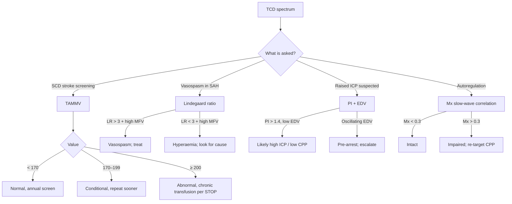

<Callout type="reference">
**Acronyms used on this page**

- **TCD**: transcranial Doppler (blind, hand-held 2 MHz probe)
- **TCCD**: transcranial color-coded duplex (B-mode image + colour Doppler + spectral Doppler)
- **MCA / ACA / PCA / BA / VA / TICA**: middle / anterior / posterior cerebral / basilar / vertebral / terminal internal carotid artery
- **PSV**: peak systolic velocity (cm/s)
- **EDV**: end-diastolic velocity (cm/s)
- **MFV**: time-averaged mean flow velocity (cm/s)
- **TAMMV**: time-averaged maximum mean velocity, the STOP-trial sickle-cell index
- **PI** (Gosling): pulsatility index = (PSV − EDV) / MFV
- **RI** (Pourcelot): resistive index = (PSV − EDV) / PSV
- **LR**: Lindegaard ratio = MCA MFV ÷ ipsilateral extracranial ICA MFV
- **CCP**: critical closing pressure
- **Mx**: mean-flow autoregulation index (correlation MFV ↔ CPP)
- **CPP / MAP / ICP**: cerebral perfusion / mean arterial / intracranial pressure
- **SCD**: sickle cell disease · **STOP**: Stroke Prevention in Sickle Cell trial
- **SAH**: aneurysmal subarachnoid haemorrhage · **DCI**: delayed cerebral ischaemia
- **TBI**: traumatic brain injury · **AIS**: arterial ischaemic stroke
- **HIE**: hypoxic-ischaemic encephalopathy
- **MMM / MNM**: multimodal monitoring / multimodal neuromonitoring
</Callout>

<TldrCard>
**The 60-second version.** TCD measures **blood-flow velocity** (not flow itself) in the basal cerebral arteries through three bony windows. It gives you four numbers (PSV, EDV, MFV, PI) and three derived ratios (Lindegaard, RI, and the autoregulation index Mx). Pediatric absolute velocities differ from adult numbers, so always trend the child against herself, ratio against the extracranial ICA, and benchmark against age-band reference values. Use TCD to detect **vasospasm** (high MFV + LR > 3), **raised ICP** (high PI with low EDV), and **autoregulation status** (Mx slow-wave correlation). It cannot stand alone for ICP measurement and should be paired with ICP, NIRS, or clinical exam in the multimodal stack.
</TldrCard>

## 1. Bedside vignettes: why this matters in the PICU

### Vignette A. Pediatric SAH day 6, suspected vasospasm

A 12-year-old presents with a ruptured AVM and aneurysmal SAH. On day 6 the nurse notices a subtle right-arm drift. You bring the TCD cart, slide the probe over the right temporal window, and within seconds the familiar saw-tooth velocity envelope appears. PSV 220, EDV 90, **MFV 130**, PI 1.0. The team checks the extracranial ICA: MFV 30. **Lindegaard ratio 4.3, mild-to-moderate vasospasm.** You alert neurosurgery, escalate haemodynamics, and schedule angiography. <Cite id="lindegaard1989" /> <Cite id="topcuoglu2017_vasospasm" />

### Vignette B. Severe TBI, the ventriculostomy is delayed

A 4-year-old fell from a roof. GCS 6, blown pupil on the right, CT shows a large temporal contusion with effacement of the basal cisterns. Theatre is 30 minutes away and a parenchymal monitor is not on the unit. You scan the *left* MCA: MFV 28, EDV 7, **PI 1.8**. The diastolic notch is shallow; the Bellner regression returns **ICP ≈ 28 mmHg**. You mannitol, raise the head, and call again. By the time the team is in theatre, TCD PI has fallen to 1.2. <Cite id="bellner2004" /> <Cite id="rasulo2022_arrest" /> <Cite id="bouzat2014_tcd" />

### Vignette C. Post-arrest HIE, day 2

A newborn cools after a tight nuchal cord and meconium aspiration. Day 2, rewarmed. NIRS rSO₂ has risen to 88%. TCD MCA: PSV 110, EDV 60, **PI 0.5, MFV 80**. The diastolic shoulder is high and the envelope looks "lush." This is **luxury perfusion**: relative hyperaemia in a brain whose metabolism has collapsed. A *low* PI with *high* EDV in HIE is not reassurance; coupled with isoelectric aEEG it is one of the worst prognostic signatures. <Cite id="kirschen2020_pedshie_tcd" />

---

## 2. What TCD is, and what it is not

TCD is a **handheld pulsed-wave ultrasound** at ~2 MHz, low enough to penetrate the thin parts of the skull, that measures the **velocity of red blood cells** in the basal cerebral arteries. The Doppler shift formula is:

```math
\Delta f = \frac{2 \cdot f_0 \cdot v \cdot \cos\theta}{c}
```

where Δf is the frequency shift, f₀ the transmitted frequency, v the blood velocity, θ the angle of insonation, and c the speed of sound in tissue.

Two things follow immediately.

**TCD measures velocity, not flow.** Flow is velocity × cross-sectional area. The cross-section of the M1-MCA changes with vasospasm, hypocapnia, fever, sedation, and anaesthetic. If a vessel narrows by 50%, velocity must roughly *quadruple* to preserve flow. So a rise in MFV may mean the same flow through a smaller pipe (vasospasm), *or* more flow through an unchanged pipe (hyperaemia), *or* both. The **Lindegaard ratio** exists to discriminate these. <Cite id="kontos1989" /> <Cite id="lindegaard1989" />

**TCD requires an angle assumption.** Blind TCD assumes cos θ ≈ 1 (the operator hand-aims for the loudest signal). **TCCD** images the vessel in B-mode first, corrects the angle, and is preferred where available, especially in children, where the temporal bone is thin and the vessels are close to the probe. <Cite id="purkayastha2012_tcd" /> <Cite id="bathala2013_tcd" />

<Pearl>
**"Velocity ≠ flow"** is the single most important sentence on this page. Every paradoxical TCD reading you will encounter starts there. Repeat it before you interpret any number.
</Pearl>

<Pediatric>
Pediatric skulls are thinner; windows are usually excellent. Insonation depths are also shallower: M1-MCA is at **≈ 30–40 mm** in toddlers and **≈ 40–50 mm** in school-age children versus 45–55 mm in adults. Adjust the depth gate before searching for the signal or you will be insonating distal branches. <Cite id="larovere2018_pedsais" />
</Pediatric>

---

## 3. The four insonation windows

<Figure
  src="/images/tcd/tcd-acoustic-windows.png"
  alt="Lateral skull view with the basal cerebral arteries (ACA A1/A2, MCA M1/M2, ICA, PCA P1/P2, basilar, vertebrals) visible through a translucent cranium. Four insonation windows marked as coloured circles: trans-temporal (teal, above the zygomatic arch and in front of the tragus, insonating MCA 45-60 mm, ACA 60-70 mm, terminal ICA 60 mm, PCA 60-75 mm); trans-orbital (yellow, over the closed eyelid, insonating the ophthalmic artery at 50 mm and ICA siphon at 60-80 mm); sub-occipital (mint, below the occiput at the foramen magnum, insonating the basilar 80-100 mm and vertebrals 50-80 mm); sub-mandibular (purple, under the angle of the mandible, insonating the distal extracranial ICA 40-60 mm)."
  caption="The four standard TCD acoustic windows and the arteries each one reaches. Trans-temporal (in front of the tragus, above the zygomatic arch) is the workhorse and the only window that reaches the anterior circulation Circle of Willis (MCA, ACA, terminal ICA, PCA). Trans-orbital uses a low mechanical-index setting (< 0.23 to protect the lens) and gives the ophthalmic and the ICA siphon. Sub-occipital (head flexed, probe at the foramen magnum) gives the basilar and vertebrals, the posterior circulation. Sub-mandibular (probe under the jaw angled cephalad) gives the extracranial ICA, used as the denominator of the Lindegaard ratio (MCA / extracranial ICA) for distinguishing vasospasm from hyperaemia."
  attribution="MNM-Edu, original schematic. Aaslid 1982; Lindegaard 1989."
  label="Fig. 1"
/>

| Window | Vessel | Typical depth | Flow direction (toward / away from probe) |
|---|---|---|---|
| Transtemporal | MCA (M1) | 45–55 mm (adult) / 30–45 mm (child) | Toward |
| Transtemporal | MCA (M2) | 30–40 mm | Toward / bidirectional |
| Transtemporal | ACA (A1) | 60–75 mm | Away |
| Transtemporal | PCA (P1) | 60–75 mm | Toward |
| Transtemporal | TICA | 60–65 mm | Toward |
| Transorbital | Ophthalmic | 40–60 mm | Toward |
| Transorbital | ICA siphon | 60–80 mm | Bidirectional |
| Suboccipital | Vertebrals | 60–75 mm | Away |
| Suboccipital | Basilar | 80–120 mm | Away |
| Submandibular | Extracranial ICA | 50–60 mm | Away |

<Pitfall>
**Always confirm the vessel.** Depth alone is not enough; manoeuvres (carotid tap on the neck transiently dampens the MCA envelope; head turn changes vertebral signal) confirm the identity of the artery before you record a number.
</Pitfall>

---

## 4. The spectral waveform: anatomy of a TCD trace

<Figure
  src="/images/tcd/waveform-anatomy.svg"
  alt="Annotated TCD spectral envelope showing PSV, EDV, MFV, dicrotic notch and diastolic shoulder"
  caption="Anatomy of a single cardiac cycle in the MCA envelope. The leading edge rises sharply to peak systolic velocity (PSV). A small inflection (the dicrotic notch) marks aortic-valve closure. The trace then falls through a diastolic shoulder to end-diastolic velocity (EDV). The time-averaged mean (MFV) sits roughly one-third of the way from PSV down to EDV in a healthy, low-resistance trace. PI = (PSV − EDV) / MFV; RI = (PSV − EDV) / PSV."
  attribution="MNM-Edu schematic. SVG placeholder (TODO: render as a proper component)."
  label="Fig. 2"
/>

A normal MCA spectral envelope has four readable features.

1. **A sharp systolic upstroke**, driven by the cardiac systole reaching the cerebral circulation, propagated through compliant proximal arteries.
2. **A clean systolic peak (PSV)**, the maximum velocity recorded in that cardiac cycle.
3. **A dicrotic notch**, the small inflection between PSV and the diastolic trough; it corresponds to aortic-valve closure. In a *very* high-resistance circulation (e.g., severe raised ICP) the notch deepens and may disappear into a true reverse-flow trough.
4. **A diastolic shoulder falling to EDV**, the floor of the cardiac cycle. EDV is the most sensitive single number to changes in downstream resistance: it falls when ICP rises, when small-vessel vasoconstriction occurs (hypocapnia), or when distal capacitance is lost.

**The mean (MFV)** is the time-weighted average of the entire envelope across the cycle. A common bedside approximation, accurate to within ~5%, is:

```math
\mathrm{MFV} \approx \frac{\mathrm{PSV} + 2 \cdot \mathrm{EDV}}{3}
```

**PI (Gosling)** captures the pulsatility, the height of the envelope relative to its mean. RI is similar but normalised to PSV. Both rise when distal resistance rises. PI ~ 0.5–1.1 is the healthy range across most ages. PI > 1.4 is "high"; PI > 2.0 with low or absent EDV is the territory of impending arrest. <Cite id="bellner2004" /> <Cite id="deriva2012_pi" />

<Callout type="clinical-pearl">
**EDV is the most informative single number on the trace.** A falling EDV with rising PI is the earliest TCD signature of rising ICP, well before MFV starts to fall.
</Callout>

---

## 5. The numbers: what to record, in what order

For every patient, on every side, record this six-pack:

| Variable | Symbol | What it tells you |
|---|---|---|
| Peak systolic velocity | PSV | Cardiac output × proximal vessel patency. Use as a screening glance; large absolute changes matter. |
| End-diastolic velocity | EDV | Distal resistance. Falls when ICP rises, when vessels constrict (hypocapnia, hyperoxia), or when capacitance is lost. |
| Mean flow velocity | MFV | The bedside index of cerebral perfusion. Use age-banded reference values in children. |
| Pulsatility index | PI | (PSV − EDV) / MFV. Rises with distal resistance. **Most useful single derived number.** |
| Lindegaard ratio | LR | MCA MFV ÷ extracranial ICA MFV. Separates vasospasm (LR > 3) from hyperaemia (LR < 3). |
| Time-averaged maximum mean velocity | TAMMV | STOP-trial index for sickle cell disease (≥ 200 cm/s = abnormal). |

Record both sides and look for **asymmetry** > 30%. Asymmetric MFV is the bedside signature of unilateral vasospasm, embolic occlusion, or unilateral raised ICP from a mass lesion.

---

## 6. What is normal? Age-banded reference values

Healthy MCA MFV is highest in early childhood, when cerebral metabolic rate per gram of brain peaks, and falls into adolescence and adulthood.

<Figure
  src="/images/tcd/peds-mfv-age-curve.svg"
  alt="Pediatric MCA mean flow velocity by age band, with a peak at 4–6 years and a gradual decline"
  caption="Healthy MCA mean flow velocity (MFV) by age band. The curve peaks in the preschool window and falls through adolescence. A 4-year-old's healthy MFV of 105 cm/s would mean moderate vasospasm in an adult. Trend within-patient and benchmark against the right age column."
  attribution="MNM-Edu, drawn from Bode 1988 and O'Brien 2015 reference data. SVG placeholder."
  label="Fig. 3"
/>

| Age | MCA MFV (cm/s, mean ± SD) | LLA / ULA bedside heuristic |
|---|---|---|
| Term newborn (< 7 d) | 24 ± 7 | very narrow; assume passive flow below MAP ~ 30 |
| 1–3 months | 42 ± 10 | LLA ≈ MAP 35–40 |
| 6 months | 74 ± 14 | LLA ≈ MAP 40–45 |
| 1–3 years | 85 ± 10 | LLA ≈ MAP 45–55 |
| 4–6 years | 97 ± 9 (peak) | LLA ≈ MAP 50–60 |
| 7–11 years | 89 ± 9 | LLA ≈ MAP 55–65 |
| 12–18 years | 75 ± 13 | LLA ≈ MAP 60–70 |
| Healthy adult | 55 ± 12 | LLA ≈ MAP 60–70, ULA ≈ 150 |

Sources: <Cite id="bode1988" /> <Cite id="bode1988peds" /> <Cite id="obrien2015" /> <Cite id="larovere2022" />. LLA / ULA columns are bedside heuristics; autoregulation in children is **narrower and lower** than the adult Lassen plateau, and the lower limit is **dangerously close to baseline MAP** in infants. <Cite id="brady2009" />

<Pediatric>
The pediatric MFV norm in a 5-year-old (~100 cm/s) would suggest moderate vasospasm in an adult. **Reading TCD MFV without an age-band reference is the single most common pediatric TCD error.** Trend against the child's own baseline and against ratios (LR) before reading absolute values.
</Pediatric>

---

## 7. What is abnormal? A small pattern library

<Figure
  src="/images/tcd/spectra-side-by-side.svg"
  alt="Five TCD spectral envelopes side by side: normal; vasospasm; raised ICP; oscillating arrest; reverberating arrest"
  caption="Five canonical spectra. (a) Normal MCA: sharp upstroke, clean diastolic shoulder, healthy EDV. (b) Vasospasm: same shape, much higher MFV; PI stays near normal because the proximal vessel diameter has fallen but distal resistance has not yet risen. (c) Raised ICP: low EDV, deep dicrotic notch, high PI; absolute MFV often falls. (d) Oscillating arrest: positive systolic spike with reverse end-diastolic flow. (e) Reverberating / pendular arrest: small back-and-forth pattern with no net forward flow. (d) and (e) are markers of impending or established cerebral circulatory arrest."
  attribution="MNM-Edu schematic. SVG placeholder."
  label="Fig. 4"
/>

| Pattern | Bedside meaning | What to do |
|---|---|---|
| High MFV + **LR > 3** | Vasospasm (not hyperaemia) | Treat; escalate haemodynamics; angiography if clinical signs |
| High MFV + **LR < 3** | Hyperaemia / luxury perfusion | Look for cause (fever, sepsis, anaemia, post-hypoxic, hyperaemic phase of TBI) |
| High PI (> 1.4) + normal MFV | Raised intracranial resistance: high ICP, hypocapnia, vasoconstrictors | Recheck etCO₂; consider ICP measurement |
| Low EDV + high PI | Falling cerebral perfusion pressure | Treat aggressively; reassess CPP |
| Oscillating / reverse EDV | Impending circulatory arrest | Confirm and act; call for ancillary brain-death testing if clinically appropriate |
| Reverberating / "pendular" trace | Cerebral circulatory arrest | Document, repeat at 30 min as per local brain-death protocol |
| Systolic spikes only | Pre-arrest pattern | Same as oscillating; confirm and escalate |
| TAMMV ≥ 200 cm/s in SCD | Stroke risk; STOP trigger | Chronic transfusion (STOP protocol) |
| Asymmetric MFV > 30% | Unilateral spasm, occlusion, mass lesion, or window asymmetry | CT / MR if clinically warranted |

<Pearl>
**Reverse diastolic flow** is a near-pathognomonic sign of severely impaired cerebral perfusion or imminent cerebral circulatory arrest. Confirm bilaterally, document, and act. <Cite id="rasulo2008" /> <Cite id="greer2020_braindeath" />
</Pearl>

### Decision tree: "what question am I asking?"



---

## 8. Try it: interactive widgets

<WidgetEmbed name="TCDWaveformExplorer" />

<WidgetEmbed name="LindegaardCalculator" />

---

## 9. TCD-guided blood-pressure and CPP management

This is where TCD earns its place in the **multimodal stack**. Two TCD-derived indices, **Mx** (autoregulation index) and **CCP** (critical closing pressure), let you reason about *this patient's* upper and lower BP limits without an invasive ICP monitor.

### 9.1 Can TCD set BP targets on its own?

**Short answer: not by itself, but it can narrow the range.**

- **MFV trend across BP changes:** If MFV moves linearly with MAP (passive flow), the patient is *outside* their autoregulatory plateau: either MAP is too low (below LLA) or too high (above ULA), or autoregulation is broken entirely. If MFV stays flat across MAP swings, autoregulation is intact and current MAP is on the plateau.
- **PI as a CPP / ICP proxy:** PI rises as CPP falls. The **Bellner regression** (ICP ≈ 10.93 · PI − 1.28) is the most cited bedside formula, with confidence intervals wide enough that it is a *triage* tool, not a measurement tool. <Cite id="bellner2004" /> <Cite id="deriva2012_pi" />
- **Trend over absolute:** A 50% rise in PI from baseline is informative; a single PI of 1.3 is not. <Cite id="rasulo2022_arrest" />

<Pitfall>
**PI is not ICP.** PI rises with anything that raises distal cerebrovascular resistance, including hypocapnia, hyperoxia, low arterial compliance (in neonates), and cold extremities (probe coupling artefact). de Riva et al's 2012 review is the canonical "don't do this" paper on PI-as-ICP substitution. <Cite id="deriva2012_pi" />
</Pitfall>

### 9.2 Mx, the TCD-based autoregulation index

**Mx** is the moving-window Pearson correlation between **MFV** (TCD) and **CPP** (or MAP, if ICP is unavailable) sampled at slow-wave frequencies (~0.01–0.05 Hz, 5–10 second averages over a 5-minute window).

- **Mx ≈ −0.3 to 0.0**: intact autoregulation (MFV does not track MAP)
- **Mx > +0.3**: impaired autoregulation (MFV passively tracks MAP)
- **Mx vs CPP curve**: U-shape with a minimum at **CPPopt**

The CPP at which Mx is minimised is the **TCD-derived CPPopt**: the perfusion pressure at which this patient's autoregulation is most efficient. The Cambridge CPPopt approach formalises this. <Cite id="czosnyka1996mx" /> <Cite id="aaslid1989_autoreg" /> <Cite id="lang2003poss" /> <Cite id="aries2012" />

<Figure
  src="/images/tcd/mx-cppopt-schematic.svg"
  alt="Mx-versus-CPP U-curve with CPPopt at the vertex; LLA at left, ULA at right"
  caption="Mx (vertical) plotted against CPP (horizontal) over the past 4 hours of monitoring. The vertex of the U-curve is CPPopt, the perfusion pressure at which TCD-MFV is least correlated with MAP (i.e., where autoregulation is most efficient). The lower limit of autoregulation (LLA) and upper limit (ULA) can be estimated where Mx crosses a chosen positivity threshold (e.g., 0.3). The shaded band is the recommended target range: ±5 mmHg of CPPopt."
  attribution="MNM-Edu, schematic adapted from Aries 2012 and Czosnyka 1996. SVG placeholder."
  label="Fig. 5"
/>

**Practical CPPopt-by-TCD workflow** (when an ICP monitor isn't available or you want a second opinion against PRx):

1. Place the TCD probe in a robotic / fixed headframe over the MCA.
2. Record continuous MFV synchronously with arterial MAP for ≥ 4 hours.
3. Bin MAP / CPP into 5-mmHg windows; compute Mx in each window.
4. Fit a parabola to (CPP, Mx); the vertex is CPPopt.
5. Re-target MAP so that CPP sits within ±5 mmHg of CPPopt.

Where ICP *is* available, **PRx** (ICP–MAP correlation) is preferred because it is closer to the mechanism; **Mx** is the non-invasive fallback. <Cite id="czosnyka1997prx" /> <Cite id="aries2012" /> <Cite id="donnelly2017mapopt" />

### 9.3 Critical closing pressure (CCP)

CCP is the MAP at which forward CBF ceases. Mathematically, the linear extrapolation of (instantaneous pressure, instantaneous velocity) back to v = 0 returns the closing pressure of the cerebrovascular bed. CCP is composed of ICP plus a wall-tension term reflecting smooth-muscle tone. <Cite id="varsos2013ccp" />

- **CCP ~ 20–35 mmHg** in healthy adults
- **CCP rises with raised ICP** and with sympathetic activation
- **CCP > MAP** means no forward flow, i.e., circulatory arrest

CCP from TCD is mostly a research tool, but it is the cleanest way to estimate **MAP-opt = CCP + (CPPopt − ICP)** when an arterial line and a TCD probe are co-located. <Cite id="donnelly2017mapopt" />

### 9.4 The bedside synthesis

A pragmatic, PICU-friendly bedside synthesis when ICP is not available:

1. Establish the child's **baseline MFV** in the first 30 minutes after admission, in stable haemodynamics.
2. Define a **PI ceiling** (typically baseline PI + 0.3) above which you will assume ICP has risen.
3. If MAP falls and **MFV falls proportionally**, you are below LLA; give a fluid bolus or vasopressor to lift MAP back into the plateau.
4. If MAP rises and **MFV rises proportionally**, you are above ULA or autoregulation is lost; lower MAP gently (10–15%) and re-measure.
5. Document the **MFV/MAP couple** every nursing shift. A trending impairment (Mx drifting positive) is itself an alert.

<Callout type="caveat">
**Decision support, not a clinical protocol.** The TCD-only CPP-titration workflow above is **teaching, not measurement**. Every threshold is age-, centre-, and patient-dependent. Pair with NIRS, ICP (where available), and clinical exam; defer to your unit's protocols and senior clinical team.
</Callout>

<AlgorithmDisclaimer />

---

## 10. Clinical contexts: TCD across acute brain injuries

### 10.1 Aneurysmal SAH and post-haemorrhagic vasospasm

The historical home of clinical TCD. Vasospasm typically develops between **days 3 and 14** post-bleed, peaks around day 7, and resolves over the second-to-third week. TCD is used **daily** during this window.

- **MCA MFV thresholds (adult):** < 120 cm/s normal · 120–180 mild · 180–200 moderate · > 200 severe.
- **Lindegaard ratio:** > 3 confirms vasospasm; > 6 suggests severe.
- **Rate of rise > 50 cm/s per 24 h** is a stronger predictor of clinical DCI than the absolute number.
- **Sensitivity vs DSA** is highest for MCA vasospasm (~85%) and lower for ACA and posterior circulation. <Cite id="mastantuono2018_tcd" />
- **AHA/ASA SAH guidelines** include TCD as a recommended monitoring modality. <Cite id="connolly2012_sah_aha" />

**Pediatric vasospasm** is less common (AVM and trauma more frequent than aneurysm) and uses **ratios plus within-child trend** rather than adult absolute thresholds. <Cite id="larovere2022" />

<RealWorld>
**Why care about post-SAH vasospasm at all?** Because vasospasm-induced DCI is responsible for roughly 30% of all morbidity after SAH and is, with hydrocephalus, the most reversible cause of secondary injury after the initial bleed. TCD is the only continuous, non-invasive way to track the spasm-to-DCI cascade in real time at the bedside.
</RealWorld>

### 10.2 Severe TBI

TCD in TBI is mostly about **early ICP triage** before an invasive monitor is placed, and about **autoregulation monitoring** afterwards.

- **Pre-hospital and emergency-department TCD** identifies abnormal cerebral haemodynamics within minutes of arrival. Tazarourte's pilot and Bouzat's 2016 cohort show that PI > 1.4 or EDV < 25 in the first 8 h predicts poor neurological outcome at 3 months. <Cite id="tazarourte2011_tcd" /> <Cite id="bouzat2014_tcd" />
- **ICP screening:** TCD can *exclude* intracranial hypertension with high negative predictive value when PI is low. Rasulo's 2022 multicentre study reports NPV ~0.95 for ICP < 22 mmHg when PI < 1.26. <Cite id="rasulo2022_arrest" />
- **CPPopt by Mx** complements PRx and is the standard fallback when ICP is not yet placed.

<Pitfall>
TCD cannot **rule in** intracranial hypertension with high specificity. A high PI is suggestive but is also consistent with hypocapnia, sympathetic surge, or sedation. Use it to triage to ICP placement, not to replace it.
</Pitfall>

### 10.3 Pediatric arterial ischaemic stroke (AIS)

Continuous TCD in proximal MCA occlusion shows **absent flow, low-velocity dampened flow, or post-recanalisation hyperaemia**. In children, TCD also helps in:

- Confirming flow re-establishment after thrombolysis or thrombectomy.
- Monitoring for **moyamoya progression** (rising MFV, ipsilateral hyper-collateralisation).
- Tracking **post-recanalisation hyperperfusion** that needs BP lowering. <Cite id="larovere2018_pedsais" />

### 10.4 Hypoxic-ischaemic encephalopathy (HIE): neonatal and post-arrest

In severe HIE, TCD evolves through a sequence:

1. **Early (hours 0–12):** low PSV and low MFV; true low perfusion.
2. **Reperfusion / luxury phase (12–48 h):** high EDV, low PI, high MFV; pathological hyperaemia in a brain whose metabolism has collapsed.
3. **Recovery or progression:** either normalisation, or rising PI signifying oedema and falling CBF.

A persistently **low PI (< 0.6)** with high diastolic flow at 24–48 h post-arrest is associated with poor neurodevelopmental outcome in pediatric cardiac-arrest survivors. <Cite id="kirschen2020_pedshie_tcd" />

### 10.5 Pediatric ECMO

VA-ECMO produces a **non-pulsatile** circulation; TCD signatures change accordingly. The systolic peak flattens; PI falls toward zero. TCD on ECMO is used to:

- Detect **left-ventricular ejection recovery** (returning pulsatility).
- Identify **emboli** (HITS, high-intensity transient signals).
- Monitor **flow asymmetry** that can predate stroke. <Cite id="larovere2017_ecmo" />

### 10.6 Meningitis and encephalitis

TCD adds value in two situations: (a) **acute intracranial hypertension** from cerebral oedema, with high PI and low EDV; (b) **vasculitic vasospasm** from bacterial or tuberculous meningitis, with high MFV and LR > 3. Both signatures change the threshold for imaging and for ICP placement. <Cite id="tunkel2004_idsa_meningitis" />

### 10.7 Brain-death determination

TCD is an **ancillary** test in the World Brain Death Project framework. The two qualifying patterns are:

1. **Oscillating / reverberating flow**: small forward systolic spikes with reverse end-diastolic flow.
2. **Systolic spikes only**: short forward systolic peaks with no diastolic flow.

A single examination by an experienced operator with confirmation 30 minutes apart, in both anterior and posterior circulations, completes the test. **Loss of previously-recorded flow** is supportive but not sufficient alone. <Cite id="greer2020_braindeath" /> <Cite id="rasulo2008" />

### 10.8 DKA cerebral oedema

A pediatric case where TCD's earliest signs (rising PI before clinical herniation) can change management. Cerebral oedema in DKA classically presents 4–12 h into rehydration. Bedside TCD documenting rising PI prompts mannitol / hypertonic saline before pupillary signs appear. <Cite id="glaser2001" /> <Cite id="muir2004" />

### 10.9 Sickle cell disease

The STOP and STOP-2 trials made TCD the standard-of-care screening tool for stroke risk in children with SCD ages 2–16. **TAMMV ≥ 200 cm/s** triggers chronic transfusion to prevent first stroke; **170–199** is conditional and warrants re-screening. <Cite id="adams1998_stop" /> <Cite id="adams2005_stop2" />

<Pediatric>
A pediatric STOP screen requires **time-averaged maximum mean velocity (TAMMV)**, measured with non-imaging blind TCD or with **non-angle-corrected** TCCD spectral Doppler. Angle-corrected TCCD systematically over-reads TAMMV; do not use angle correction for STOP screens.
</Pediatric>

---

## 11. Multimodal integration: TCD in the MMM/MNM stack

<Figure
  src="/images/tcd/tcd-in-mnm-stack.svg"
  alt="Schematic of TCD's place in the multimodal monitoring stack alongside ICP, NIRS, EEG, PbtO2 and clinical exam"
  caption="TCD overlaps with, but does not replace, ICP, NIRS, EEG, and PbtO₂. Its unique contributions are (1) the only continuous, non-invasive index of large-vessel flow, (2) the only bedside vasospasm detector, and (3) an autoregulation index (Mx) that needs only an arterial line. Use the matrix below to choose pairings."
  attribution="MNM-Edu, original schematic. SVG placeholder."
  label="Fig. 6"
/>

| Pair with… | What you gain | Worked scenario |
|---|---|---|
| **ICP** | PRx + Mx in parallel; mutual validation of autoregulation; Lindegaard for spasm-vs-hyperaemia | [TCD vs ICP vasospasm](/integration/tcd-vs-icp-vasospasm/) |
| **NIRS / ORx** | Macrovascular (TCD) + tissue oxygenation (NIRS); discordance signals microvascular shunting | [PRx vs ORx discordance](/integration/prx-vs-orx-discordance/) |
| **EEG / qEEG** | Vasospasm-induced cortical dysfunction shows up in qEEG before clinical signs | [EEG / TCD non-convulsive seizure pair](/integration/eeg-tcd-non-convulsive/) |
| **PbtO₂** | Direct microvascular tissue O₂ + macrovascular velocity; gold-standard pair | [PbtO₂-CPP titration](/integration/pbto2-cpp-titration/) |
| **Clinical exam** | Most important pairing; TCD numbers in isolation are dangerous | Always |

<Cite id="figaji2025_mmm_pediatric_consensus" /> <Cite id="helbok2024_pediatric_mmm" /> <Cite id="tasker2023mnm" /> <Cite id="vinciguerra2022_tcd" />

---

<DeepDive>

## 12. Setup and technique: a step-by-step

### 12.1 Equipment

- 2 MHz pulsed-wave probe (blind TCD) or TCCD probe (~ 2–4 MHz with B-mode capability).
- Coupling gel.
- Robotic / fixation headframe (DWL Doppler-Box, Atys Robotic, or Dolphin) for continuous monitoring.
- Synchronised arterial-line pressure and (where present) ICP feeds.

### 12.2 Transtemporal MCA: the routine view

1. **Position the patient** supine, head neutral, head-of-bed 30°.
2. **Coupling gel** above the zygomatic arch, just anterior to the tragus.
3. **Probe**: 2 MHz pulsed-wave. Initial depth **45 mm** (adult) / **30 mm** (toddler) / **40 mm** (school-age).
4. **Find the signal**: angle anterior and slightly cephalad. Listen for the characteristic systolic "whoosh-thump"; the loudest signal is usually the MCA.
5. **Confirm with carotid tap**: ipsilateral carotid compression in the neck momentarily dampens the MCA envelope and confirms vessel identity.
6. **Optimise**: insonation angle < 30° (cosine error grows fast above 30°). Maximise spectral envelope brightness without overgaining.
7. **Record** PSV, EDV, MFV, PI over ≥ 5 cardiac cycles.
8. **Repeat** contralaterally.
9. **Lindegaard denominator**: switch to **submandibular** view; ICA at depth ~50–60 mm; compute MFV(MCA) ÷ MFV(ICA).

### 12.3 Suboccipital basilar

- Head flexed, chin to chest.
- Depth 75–95 mm for the mid-basilar.
- Flow is **away** from the probe (negative on the envelope); confirm direction.

### 12.4 Transorbital ophthalmic / ICA siphon

- **Use a low mechanical index (< 0.23)** to protect the lens.
- Probe directly over the closed eyelid with a generous coupling cushion of gel.
- Depth 40–60 mm for ophthalmic, 60–80 mm for the siphon.
- Note flow direction: ophthalmic toward the probe is normal; reversal suggests proximal ICA stenosis.

### 12.5 Continuous monitoring

A fixed headframe holds the probe over the MCA for hours. With synchronised arterial pressure recording, you can compute Mx continuously and run a TCD-CPPopt loop without invasive ICP. Pair with NIRS rSO₂ for a "non-invasive autoregulation bundle." <Cite id="lang2003poss" /> <Cite id="aries2012" />

### 12.6 TCCD vs blind TCD

- **TCCD** provides B-mode anatomical localisation plus colour Doppler plus angle correction. Preferred in children (thin temporal bone makes B-mode easy) and in adults with poor windows.
- **Blind TCD** is faster, lower in equipment cost, and the standard tool for STOP screening (which uses **non-angle-corrected** TAMMV). <Cite id="bathala2013_tcd" /> <Cite id="purkayastha2012_tcd" />

</DeepDive>

---

## 13. Pitfalls: operator-dependent, physiology-dependent

- **Window quality** varies by age, sex, ethnicity. Up to 10% of post-menopausal women have inadequate temporal windows; a contrast agent or a different window can rescue them.
- **Hyperaemia mimics vasospasm** without the Lindegaard ratio.
- **Vessel-diameter change** confounds velocity-flow proportionality; this is the entire reason for ratio-based interpretation.
- **PI is not ICP.** PI rises with anything that increases distal resistance. Use it as a triage, not a measurement. <Cite id="deriva2012_pi" />
- **Operator dependence**: inter-rater reliability is moderate even among trained operators.
- **Sedation, anaesthesia, hypothermia** lower MFV via CMRO₂ effect (15–25%).
- **Hypocapnia** raises PI and lowers MFV through hypocapnic vasoconstriction.
- **Anaemia** raises baseline MFV; every TCD value should be paired with the haemoglobin of the day.
- **TCCD angle-correction** systematically over-reads TAMMV in SCD; turn it off for STOP screens.
- **Probe coupling drift** during continuous monitoring shows as gradual envelope dimming; re-aim every 1–2 hours or use a robotic frame.

---

## 14. Combine with…

- [Lindegaard calculator](/modalities/tcd/): distinguishes spasm from hyperaemia.
- [Mx, the TCD-based autoregulation index](/modalities/mx/)
- [Non-invasive ICP](/modalities/non-invasive-icp/): Bellner regression uses PI.
- [Integration: TCD vs ICP vasospasm](/integration/tcd-vs-icp-vasospasm/): worked scenario.
- [PRx vs ORx discordance](/integration/prx-vs-orx-discordance/): non-invasive autoregulation pairings.
- [Foundations: autoregulation](/foundations/autoregulation/): Mx, PRx, ORx mechanism.

---

<DeepDive>

## 15. Evidence summary

| Topic | Source | Grade |
|---|---|---|
| Original TCD description | <Cite id="aaslid1982" /> | A |
| Dynamic autoregulation by TCD | <Cite id="aaslid1989_autoreg" /> | B |
| Lindegaard ratio for vasospasm | <Cite id="lindegaard1989" /> | A |
| AAN consensus on TCD applications | <Cite id="sloan2004" /> | expert |
| Pediatric MCA reference data | <Cite id="bode1988" /> <Cite id="bode1988peds" /> <Cite id="obrien2015" /> | B/C |
| PI for ICP estimation | <Cite id="bellner2004" /> | C |
| PI is *not* ICP (pitfall paper) | <Cite id="deriva2012_pi" /> | review |
| Mx (TCD autoregulation) | <Cite id="czosnyka1996mx" /> <Cite id="lang2003poss" /> <Cite id="aries2012" /> | B |
| CPPopt by Mx | <Cite id="donnelly2017mapopt" /> | B |
| Critical closing pressure | <Cite id="varsos2013ccp" /> | B |
| TCD meta-analysis for vasospasm | <Cite id="mastantuono2018_tcd" /> | A |
| Vasospasm thresholds (re-examined) | <Cite id="topcuoglu2017_vasospasm" /> | B |
| Pre-hospital TCD in TBI | <Cite id="tazarourte2011_tcd" /> <Cite id="bouzat2014_tcd" /> | B |
| Non-invasive ICP exclusion | <Cite id="rasulo2022_arrest" /> | B |
| STOP trial (SCD screening) | <Cite id="adams1998_stop" /> <Cite id="adams2005_stop2" /> | A |
| Pediatric TCD primer | <Cite id="larovere2018_pedsais" /> <Cite id="larovere2022" /> | expert |
| Pediatric ECMO TCD | <Cite id="larovere2017_ecmo" /> | C |
| HIE post-arrest TCD prognosis | <Cite id="kirschen2020_pedshie_tcd" /> | C |
| Brain-death determination | <Cite id="greer2020_braindeath" /> <Cite id="rasulo2008" /> | expert |
| TCD waveform analysis (non-invasive ICP) | <Cite id="brasil2022_waveform" /> <Cite id="cardim2023nicp" /> <Cite id="rasulo2024_b4c" /> | B/C |
| Modern TCD review in the ICU | <Cite id="vinciguerra2022_tcd" /> <Cite id="purkayastha2012_tcd" /> <Cite id="bathala2013_tcd" /> | expert |
| Pediatric MMM consensus | <Cite id="figaji2025_mmm_pediatric_consensus" /> <Cite id="helbok2024_pediatric_mmm" /> <Cite id="tasker2023mnm" /> | expert |

## 16. Recent literature (2022–2025)

- **Brasil 2022**: non-invasive ICP from TCD waveform analysis (Brain4Care-style devices); moving from research into bedside. <Cite id="brasil2022_waveform" />
- **Cardim 2023, Rasulo 2024**: multicentre validation of non-invasive ICP estimators against parenchymal probes. <Cite id="cardim2023nicp" /> <Cite id="rasulo2024_b4c" />
- **Figaji 2025 pediatric MMM consensus**: formalises TCD as a tier-2 modality in resource-stratified pediatric centres. <Cite id="figaji2025_mmm_pediatric_consensus" />
- **TCCD adoption**: colour-coded duplex is replacing blind TCD for routine ICU bedside use, particularly in children.
- **Robotic TCD platforms**: fixed-frame continuous TCD now standard in many neuro-ICUs; enables Mx, CPPopt-by-TCD, and embolic-signal counting on ECMO.
- **Non-invasive ICP thresholds**: Rasulo 2022 multicentre data give PI < 1.26 as a high-NPV exclusion of intracranial hypertension; PI > 1.4 alone is *not* diagnostic. <Cite id="rasulo2022_arrest" />

</DeepDive>

---

## 17. Self-check

<Quiz
  questions={[
    {
      id: 'q1',
      prompt: 'A 5-year-old SAH day 6. Right MCA MFV 180, extracranial ICA MFV 70. Best interpretation?',
      options: [
        { id: 'a', label: 'Severe vasospasm' },
        { id: 'b', label: 'Mild-to-moderate vasospasm' },
        { id: 'c', label: 'Hyperaemia or mixed picture; recheck' },
        { id: 'd', label: 'Normal for a 5-year-old' },
      ],
      answer: 'c',
      explanation: 'MCA MFV is high for a 5-year-old (peak healthy ~100 cm/s) but the Lindegaard ratio is 180/70 = 2.6, below the 3.0 cutoff for vasospasm. This is hyperaemia or mixed picture; recheck within 24 h and look for fever, anaemia, or systemic vasodilatation.',
    },
    {
      id: 'q2',
      prompt: 'Severe TBI, no ICP monitor yet. Left MCA PI 1.9, EDV 12. Most appropriate next step?',
      options: [
        { id: 'a', label: 'Reassure (PI alone is non-specific)' },
        { id: 'b', label: 'Repeat in 30 minutes' },
        { id: 'c', label: 'Hyperventilate to PaCO₂ 25' },
        { id: 'd', label: 'Treat for raised ICP and escalate to ICP placement' },
      ],
      answer: 'd',
      explanation: 'PI 1.9 with low EDV in severe TBI is highly suggestive of raised ICP. Hyperventilation below PaCO₂ 30 is harmful (vasoconstriction worsens ischaemia). Treat empirically (head up, mannitol or hypertonic, sedation) and escalate to invasive ICP measurement; TCD is triage, not measurement.',
    },
    {
      id: 'q3',
      prompt: 'Pediatric post-cardiac-arrest day 2. Bilateral MCA PI 0.45, EDV 65, MFV 90. aEEG is markedly suppressed. What does this combination mean?',
      options: [
        { id: 'a', label: 'Reassuring; perfusion is restored' },
        { id: 'b', label: 'Luxury perfusion with poor prognosis' },
        { id: 'c', label: 'Vasospasm developing' },
        { id: 'd', label: 'Normal post-arrest finding' },
      ],
      answer: 'b',
      explanation: 'Low PI with high diastolic flow at 24–48 h post-arrest, paired with electrically silent cortex, is the luxury-perfusion pattern: flow without metabolic demand, marker of severe HIE. Counterintuitive: a "lush" TCD here is bad news.',
    },
  ]}
/>
